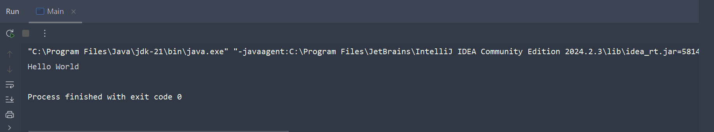

# 目錄

- [Java 基本介紹](#Java-基本介紹)
- [環境設定和基本安裝](#環境設定和基本安裝)
- [第一支Java程式](#第一支Java程式)
- [基本語法](#基本語法)
  - [基本介紹](#基本介紹)
  - [變量和賦值](#變量和賦值)
  - [Data Type](#Data-Type)
  - [String Operation](#String-Operation)
  - [關係 條件運算符](#關係-條件運算符)
  - [Arithmetic Operator](#Arithmetic-Operator)
  - [if statement](#if-statement)
  - [Array and ArrayList](#Array-and-ArrayList)
  - [2D Array](#2D-Array)
  - [For Loop](#For-Loop)
  - [while Loop](#while-Loop)
  - [Nested Loops 巢狀迴圈](#Nested-Loops-巢狀迴圈)
  - [break continue](#break-continue)
  - [Java 圖形用戶介面](#Java-圖形用戶介面)
  - [Loop Lab](#Loop-Lab)
  - [Java Method](#Java-Method)
  - [Return Keyword](#Return-Keyword)
  - [Method Overloading](#Method-Overloading)
  
## Java 基本介紹

**什麼是Java?**

Java 是一種廣泛使用的電腦程式設計語言，擁有跨平台、物件導向等特性，廣泛應用於企業級Web應用開發和各種行動應用開發。例如: Android Apps,數據中心和超級計算機，桌面應用程序，數據庫連接，資料視覺化以及數據分析，都可以見到Java的應用。許多政府機關、醫療、教育、國防以及電子交易系統也是用Java做成的!

簡單來說，Java是非常受歡迎的程式語言，可以運用在各種領域，支援性非常強大！此外，Java是跨平台的程式語言，寫一份程式碼，就可以在多個平台上運行

Java優點包含：

1. 跨平台、相容性高

2. 可以做各式各樣的應用，不論是網站、應用程式、使用者圖形介面、網頁伺服器，都可以透過Java撰寫而成。

3. 市場需求高，很難找不到工作。

缺點包含：

1. 執行速度緩慢（相較於C++）

2. 需要經過編譯（compile）。跟Python等直譯語言相比，Java需要先經過轉換，才能被執行

## 環境設定和基本安裝

> 判定是否已安裝java

```shell
java -version
```
若沒有呈現東西，那可以到下面網址安裝，安裝完後再打上面指令看是否有安裝成功

[安裝網址](https://adoptium.net/temurin/release/)

在 Windows上，Java通常安裝在C:/Program Files/Java 目錄中。可以檢查此文件夾是否存在

> 安裝IDE 

整合開發環境(Integrated development environment) 是一種輔助程式開發軟體的應用軟體，在開發工具內部就可以輔助編寫原始碼文字、並編譯打包成為可用的程式，通常包刮除錯器以及文字修正功能。

常用的Java IDE 包含:

1. Eclipse (屬於Linux基金會，財大氣粗，功能非常強大，也支援其他語言)

2. IntelliJ IDEA(號稱地球最強Java開發神器，背靠JetBrains這棵大樹)

3. VS Code (微軟開發的輕量級程式碼編輯器。嚴格來說，算不上是IDE，卻比IDE好用)

4. NetBeans(Apache基金會出品必屬精品)

## 第一支Java程式

在Java中，所有程式碼是以.java做結尾的純文本文件。這些文件後由javac(Java Compiler)編譯器編譯成.class文件。.class文件包含Java虛擬機(Java Virtual Machine)的機器語言。最後，Java啟動器工具使用Java虛擬機來運行我們寫的應用程序


**.Class文件在每個平台都是相同的，但JVM在每個作業系統或平台當中都是不一樣的。這是為何Java有平台獨立性(platform-independent)。每個平台在安裝Java時，都會下載對應的JVM。**

> .java檔案名稱，須以大寫為開頭

- Main.java

```java
public class Main {
  public static void main(String[] args) {
    System.out.println("Hello, world!");
  }
}
```

> 打開命令提是字元(cmd)，cd到放Main.java的目錄打

```shell
javac Main.java
```


## 基本語法

### 基本介紹

**函數(Functions. Methods)**

f(x) = 3x+6

f(x): 函數名稱
x: 輸入(input)
3x+6: 輸出(output)

會有一個函數名稱，一個輸入和輸入，根據輸入的不同會得到不同的輸出。此外，一個函數應該只返回一個值(如果一個input導致兩個不同的output，那麼f(x)就不是一個函數。)

同樣的概念也是用於Java函數。在Java函數中，我們可以提供或不提供任何input；然後，我們從該函數或的一個output

**Class 規則**

1. Class名稱一定要跟文件名稱相同
2. Class名稱一定要大寫英文字母當開頭
3. public static void main(String[] args)會被執行。這是Java的規定，每個字都不能少。

> 若打 `psvm`就會出現`public static void main(String[] args)`


> 打`sout`+Tab鍵會直接出現`System.out.println()`




### 變量和賦值

### Data Type

### String Operation

### 關係 條件運算符

### Arithmetic Operator

### if statement

### Array and ArrayList

### 2D Array

### For Loop

### while Loop

### Nested Loops 巢狀迴圈

### break continue

### Java 圖形用戶介面

### Loop Lab

### Java Method

### Return Keyword

### Method Overloading