## 目錄

- [下載 intellIJ_IDEA](#下載-intellIJ_IDEA)
- [下載 JDK](#下載-JDK)
- [建立新專案](#建立新專案)
- [新增檔案](#新增檔案)
- [配置設定](#配置設定)
- [設定 kotlin 檔案執行](#設定-kotlin-檔案執行)
- [設定 application 檔案](#設定-application-檔案)

# 下載 intellIJ_IDEA

- Google 搜尋 intellIJ_IDEA
- 點擊 Download

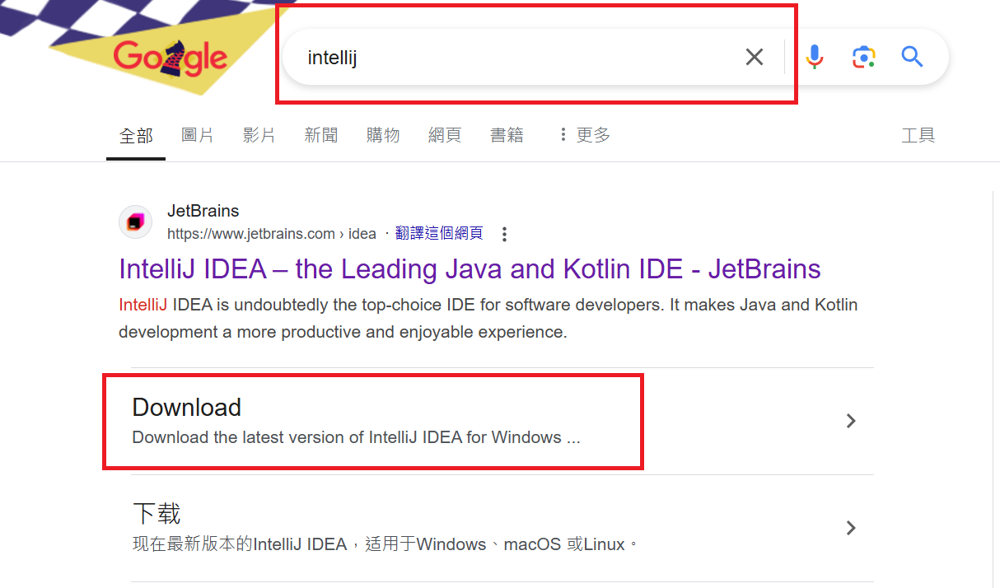

- 不要選第一個(只有三十天免費試用)而是要往下滑，滑到下面那個免費的，點擊 download

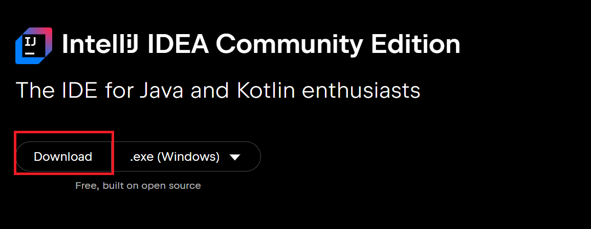

- 跟著步驟安裝

# 下載 JDK

- Google 搜尋 JDK21
- 點擊 Java Downloads

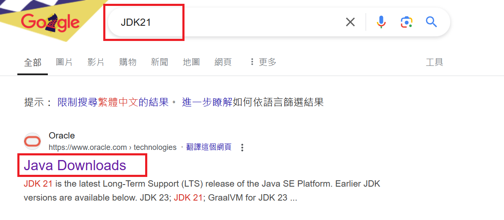

- 選擇電腦作業系統
- 點選 "x64 Compressed Archive" 下載

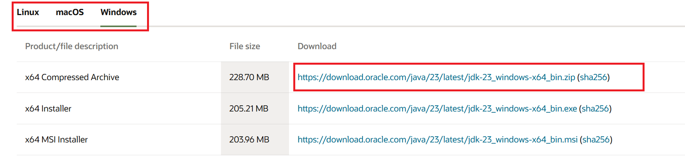

# 建立新專案

- 開啟 IntellIJ IDEA
- 點選右上 New Project

  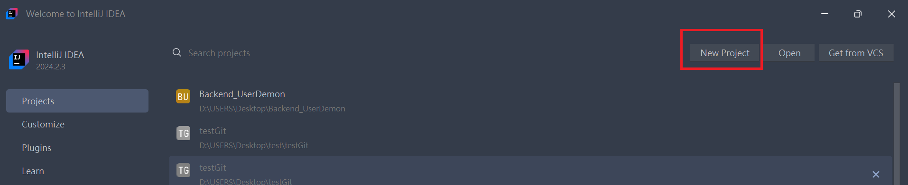

- 選擇 Kotlin
- 輸入專案名稱
- 選擇要儲存的路徑
- 不勾選 Greate git repositor (之後可以再推上去) =>詳情請看[GitHub.md](./github.md)
- Build System: Maven
- JDK 選 21
- 不勾選 Add sample Code
- Advancing Setting
  - Group: 網域名稱，例: https://chatgpt.com/ 就要寫成 com.chatgpt
  - ArtfactID: 專案名稱
- 完成後點選 create

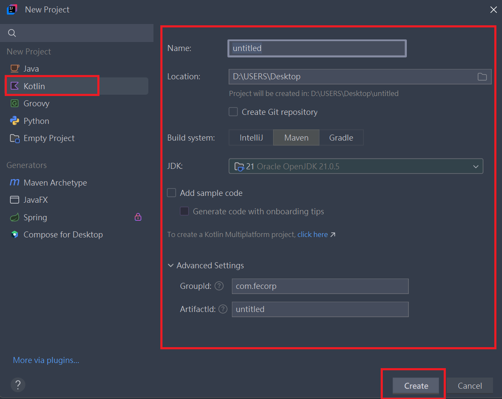

# 新增檔案

## 新增 MainAppKt

- 點選 main 裡面的 kotlin

- 滑鼠右鍵 -> New -> Kotlin Class/Files

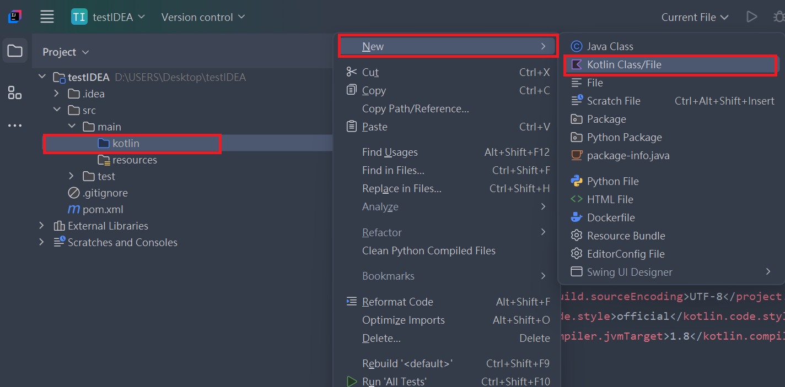

- 選擇 file

- 輸入檔名

- 按 Enter

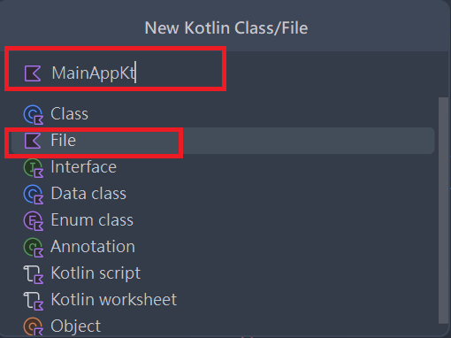

- 複製下面程式碼到此檔案裡面

```shell
package com.fecorp.service.backend.il

import org.springframework.boot.autoconfigure.SpringBootApplication
import org.springframework.boot.runApplication

@SpringBootApplication
class MainAppKt

fun main(args: Array<String>) {
    runApplication<MainAppKt>(*args)
}
```

# 配置設定

## 更改 pox.xml 檔案裡的設置

### 1. 項目模型版本和父項配置

```xml
<modelVersion>4.0.0</modelVersion>
<parent>
    <groupId>org.springframework.boot</groupId>
    <artifactId>spring-boot-starter-parent</artifactId>
    <version>3.4.0-M3</version>
    <relativePath/>
</parent>
```

> modelVersion: 定義 POM 文件的版本，通常是 4.0.0。<br>
> parent: 定義這個項目的父 POM，這裡使用的是 Spring Boot 的父項 POM (spring-boot-starter-parent)，其版本為 3.4.0-M3。Spring Boot 父 POM 會提供許多自動配置和預設設置，讓項目更容易構建和管理。

### 2. 基本項目信息

```xml
<groupId>com.fecorp</groupId>
<artifactId>service-backend-i1</artifactId>
<version>1.0-SNAPSHOT</version>
```

> groupId: 定義項目的組 ID，這通常代表一個組織或公司，這裡是 com.fecorp。<br>
> artifactId: 定義項目的構件 ID，這是項目的名稱，這裡是 service-backend-i1。<br>
> version: 定義項目的版本，這裡是 1.0-SNAPSHOT，SNAPSHOT 表示這是一個開發中的版本。<br>

### 3. 項目屬性

```xml
<properties>
    <project.build.sourceEncoding>UTF-8</project.build.sourceEncoding>
    <kotlin.code.style>official</kotlin.code.style>
    <kotlin.compiler.jvmTarget>17</kotlin.compiler.jvmTarget>
    <kotlin.version>2.0.20</kotlin.version>
</properties>

```

> project.build.sourceEncoding: 設置編碼為 UTF-8，這對於處理多語言字符非常重要。<br>
> kotlin.code.style: 設置 Kotlin 代碼風格為官方風格。<br>
> kotlin.compiler.jvmTarget: 設置 Kotlin 編譯器的目標 JVM 版本為 17。<br>
> kotlin.version: 定義 Kotlin 的版本，這裡是 2.0.20。<br>

### 4. Maven 存儲庫配置

```xml
<repositories>
    <repository>
        <id>spring-milestones</id>
        <name>Spring Milestones</name>
        <url>https://repo.spring.io/milestone</url>
        <snapshots>
            <enabled>false</enabled>
        </snapshots>
    </repository>
    <repository>
        <id>fecorp</id>
        <name>福茂Maven庫</name>
        <url>http://192.168.x.xxx:xxxx/nexus/content/repositories/fecorp/</url>
    </repository>
</repositories>
```

> spring-milestones: 定義了 Spring Milestones 的 Maven 存儲庫，用於下載 Spring 相關的里程碑版本。<br>
> fecorp: 這是項目的私有 Maven 存儲庫，用來從內部服務中拉取依賴。<br>

### 5. 插件庫配置

```xml
<pluginRepositories>
    <pluginRepository>
        <id>spring-milestones</id>
        <name>Spring Milestones</name>
        <url>https://repo.spring.io/milestone</url>
    </pluginRepository>
</pluginRepositories>

```

> 這部分配置了 Maven 插件的來源，這裡依然使用 Spring Milestones 來作為插件的源。

### 6. 分發管理

```xml
<distributionManagement>
    <repository>
        <id>fecorp-maven-repo</id>
        <url>http://192.168.x.xx:/repository/fecorp-maven-repo/</url>
    </repository>
</distributionManagement>
```

> 這部分定義了項目構建後的發佈目標位置，將項目構建的結果發佈到內部 Maven 存儲庫。

### 7. 構建配置

```xml
<build>
    <finalName>${project.artifactId}</finalName>
    <sourceDirectory>src/main/kotlin</sourceDirectory>
    <testSourceDirectory>src/test/kotlin</testSourceDirectory>
    <plugins>
        <plugin>
            <groupId>org.jetbrains.kotlin</groupId>
            <artifactId>kotlin-maven-plugin</artifactId>
            <version>${kotlin.version}</version>
            <executions>
                <execution>
                    <id>compile</id>
                    <phase>compile</phase>
                    <goals>
                        <goal>compile</goal>
                    </goals>
                </execution>
                <execution>
                    <id>test-compile</id>
                    <phase>test-compile</phase>
                    <goals>
                        <goal>test-compile</goal>
                    </goals>
                </execution>
            </executions>
            <configuration>
                <args>
                    <arg>-Xjsr305=strict</arg>
                </args>
                <compilerPlugins>
                    <plugin>spring</plugin>
                    <plugin>jpa</plugin>
                </compilerPlugins>
                <jvmTarget>17</jvmTarget>
            </configuration>
        </plugin>
        <plugin>
            <groupId>org.apache.maven.plugins</groupId>
            <artifactId>maven-jar-plugin</artifactId>
            <version>3.4.2</version>
            <configuration>
                <archive>
                    <manifest>
                        <mainClass>com.fecorp.service.backend.i1.MainAppKt</mainClass>
                    </manifest>
                </archive>
            </configuration>
        </plugin>
        <plugin>
            <groupId>org.springframework.boot</groupId>
            <artifactId>spring-boot-maven-plugin</artifactId>
            <version>3.3.5</version>
            <executions>
                <execution>
                    <goals>
                        <goal>repackage</goal>
                    </goals>
                </execution>
            </executions>
        </plugin>
    </plugins>
</build>
```

- finalName: 定義構建後產生的 JAR 文件名稱。
- sourceDirectory 和 testSourceDirectory: 定義了 Kotlin 源代碼和測試源代碼的目錄。
- 插件配置:
  - Kotlin 插件 (kotlin-maven-plugin): 用來編譯 Kotlin 代碼，設置了 Kotlin 編譯器的選項，並啟用了 Spring 和 JPA 插件。
  - Maven Jar 插件 (maven-jar-plugin): 用來生成 JAR 文件，並設定了 MainAppKt 為應用的主類。
  - Spring Boot 插件 (spring-boot-maven-plugin): 用來打包 Spring Boot 應用並生成可執行的 JAR 文件。

### 8. 項目依賴

```xml
<dependencies>
    <dependency>
        <groupId>org.jetbrains.kotlin</groupId>
        <artifactId>kotlin-test-junit5</artifactId>
        <version>2.0.20</version>
        <scope>test</scope>
    </dependency>
    <dependency>
        <groupId>org.junit.jupiter</groupId>
        <artifactId>junit-jupiter</artifactId>
        <version>5.10.0</version>
        <scope>test</scope>
    </dependency>
    <dependency>
        <groupId>org.jetbrains.kotlin</groupId>
        <artifactId>kotlin-stdlib-jdk8</artifactId>
        <version>${kotlin.version}</version>
    </dependency>
    <dependency>
        <groupId>org.jetbrains.kotlin</groupId>
        <artifactId>kotlin-test</artifactId>
        <version>${kotlin.version}</version>
        <scope>test</scope>
    </dependency>
    <dependency>
        <groupId>org.jetbrains.kotlin</groupId>
        <artifactId>kotlin-reflect</artifactId>
    </dependency>
    <!-- Spring Boot 基本依賴 -->
    <dependency>
        <groupId>org.springframework.boot</groupId>
        <artifactId>spring-boot-starter</artifactId>
    </dependency>
    <dependency>
        <groupId>org.springframework.boot</groupId>
        <artifactId>spring-boot-starter-web</artifactId>
    </dependency>
    <!-- Spring Boot Kotlin 支援 -->
    <dependency>
        <groupId>org.springframework.boot</groupId>
        <artifactId>spring-boot-starter-thymeleaf</artifactId>
    </dependency>
    <!-- Spring Boot 測試依賴 -->
    <dependency>
        <groupId>org.springframework.boot</groupId>
        <artifactId>spring-boot-starter-test</artifactId>
        <scope>test</scope>
    </dependency>
    <!-- JPA 支援 -->
    <dependency>
        <groupId>org.springframework.boot</groupId>
        <artifactId>spring-boot-starter-data-jpa</artifactId>
    </dependency>
    <dependency>
        <groupId>com.mysql</groupId>
        <artifactId>mysql-connector-j</artifactId>
        <scope>runtime</scope>
    </dependency>
</dependencies>
```

- 這些是項目的依賴，包括了 Kotlin、JUnit、Spring Boot、JPA、MySQL 等庫：
  - Kotlin 測試庫、JUnit 5（用于單元測試）。
  - Spring Boot 基本庫（spring-boot-starter 和 spring-boot-starter-web）用來構建 web 應用。
  - Spring Boot Thymeleaf 支援，通常用來渲染前端模板。
  - JPA 支援，用來操作資料庫。
  - MySQL 驅動，用於與 MySQL 資料庫進行連接。

### 完整程式碼(可直接複製覆蓋但要做下列調整)

1. 記得更改 groupId 和 artifactId

```xml
<groupId>com.fecorp</groupId>
<artifactId>service-backend-i1</artifactId>
<version>1.0-SNAPSHOT</version>
```

2. 記得更改 Maven 存儲庫配置

```xml
  <repository>
        <id>fecorp</id>
        <name>福茂Maven庫</name>
        <url>http://192.168.x.xxx:xxxx/nexus/content/repositories/fecorp/</url>
    </repository>
```

3. 記得更改分發管理

```xml
<distributionManagement>
    <repository>
        <id>fecorp-maven-repo</id>
        <url>http://192.168.x.xx:/repository/fecorp-maven-repo/</url>
    </repository>
</distributionManagement>
```

4. 記得更改 構建配置裡的 mainClass, 改成自己專案裡的 MainAppKt

```xml
 <plugin>
    <groupId>org.apache.maven.plugins</groupId>
        <artifactId>maven-jar-plugin</artifactId>
          <version>3.4.2</version>
            <configuration>
                <archive>
                    <manifest>
                        <mainClass>com.fecorp.service.backend.i1.MainAppKt</mainClass>
                </manifest>
            </archive>
        </configuration>
    </plugin>
```

5. 全部的程式碼

```xml
<?xml version="1.0" encoding="UTF-8"?>
<project xmlns:xsi="http://www.w3.org/2001/XMLSchema-instance"
         xmlns="http://maven.apache.org/POM/4.0.0"
         xsi:schemaLocation="http://maven.apache.org/POM/4.0.0 http://maven.apache.org/xsd/maven-4.0.0.xsd">
    <modelVersion>4.0.0</modelVersion>
    <parent>
        <groupId>org.springframework.boot</groupId>
        <artifactId>spring-boot-starter-parent</artifactId>
        <version>3.4.0-M3</version>
        <relativePath/>
    </parent>
    <groupId>com.fecorp</groupId>
    <artifactId>service-backend-i1</artifactId>
    <version>1.0-SNAPSHOT</version>

    <properties>
        <project.build.sourceEncoding>UTF-8</project.build.sourceEncoding>
        <kotlin.code.style>official</kotlin.code.style>
        <kotlin.compiler.jvmTarget>17</kotlin.compiler.jvmTarget>
        <kotlin.version>2.0.20</kotlin.version>
    </properties>

    <repositories>
        <repository>
            <id>spring-milestones</id>
            <name>Spring Milestones</name>
            <url>https://repo.spring.io/milestone</url>
            <snapshots>
                <enabled>false</enabled>
            </snapshots>
        </repository>
        <repository>
            <id>fecorp</id>
            <name>福茂Maven庫</name>
            <url>http://ip:port/nexus/content/repositories/fecorp/</url>
        </repository>
    </repositories>
    <pluginRepositories>
        <pluginRepository>
            <id>spring-milestones</id>
            <name>Spring Milestones</name>
            <url>https://repo.spring.io/milestone</url>
            <snapshots>
                <enabled>false</enabled>
            </snapshots>
        </pluginRepository>
    </pluginRepositories>

    <distributionManagement>
        <repository>
            <id>fecorp-maven-repo</id>
            <url>http://ip:port/repository/fecorp-maven-repo/</url>
        </repository>
    </distributionManagement>

    <build>
        <finalName>${project.artifactId}</finalName>
        <sourceDirectory>src/main/kotlin</sourceDirectory>
        <testSourceDirectory>src/test/kotlin</testSourceDirectory>
        <plugins>
            <plugin>
                <groupId>org.jetbrains.kotlin</groupId>
                <artifactId>kotlin-maven-plugin</artifactId>
                <version>${kotlin.version}</version>
                <executions>
                    <execution>
                        <id>compile</id>
                        <phase>compile</phase>
                        <goals>
                            <goal>compile</goal>
                        </goals>
                    </execution>
                    <execution>
                        <id>test-compile</id>
                        <phase>test-compile</phase>
                        <goals>
                            <goal>test-compile</goal>
                        </goals>
                    </execution>
                </executions>
                <configuration>
                    <args>
                        <arg>-Xjsr305=strict</arg>
                    </args>
                    <compilerPlugins>
                        <plugin>spring</plugin>
                        <plugin>jpa</plugin>
                    </compilerPlugins>
                    <jvmTarget>17</jvmTarget>
                </configuration>
                <dependencies>
                    <!-- 生成無參數構造式 -->
                    <dependency>
                        <groupId>org.jetbrains.kotlin</groupId>
                        <artifactId>kotlin-maven-allopen</artifactId>
                        <version>${kotlin.version}</version>
                    </dependency>
                    <!-- 將方法改為Open -->
                    <dependency>
                        <groupId>org.jetbrains.kotlin</groupId>
                        <artifactId>kotlin-maven-noarg</artifactId>
                        <version>${kotlin.version}</version>
                    </dependency>
                </dependencies>
            </plugin>
            <plugin>
                <groupId>org.apache.maven.plugins</groupId>
                <artifactId>maven-jar-plugin</artifactId>
                <version>3.4.2</version>
                <configuration>
                    <archive>
                        <manifest>
                            <mainClass>com.fecorp.service.backend.i1.MainAppKt</mainClass>
                        </manifest>
                    </archive>
                </configuration>
            </plugin>
            <plugin>
                <groupId>org.springframework.boot</groupId>
                <artifactId>spring-boot-maven-plugin</artifactId>
                <version>3.3.5</version>
                <executions>
                    <execution>
                        <goals>
                            <goal>repackage</goal>
                        </goals>
                    </execution>
                </executions>
            </plugin>
        </plugins>
    </build>

    <dependencies>
        <dependency>
            <groupId>org.jetbrains.kotlin</groupId>
            <artifactId>kotlin-test-junit5</artifactId>
            <version>2.0.20</version>
            <scope>test</scope>
        </dependency>
        <dependency>
            <groupId>org.junit.jupiter</groupId>
            <artifactId>junit-jupiter</artifactId>
            <version>5.10.0</version>
            <scope>test</scope>
        </dependency>
        <dependency>
            <groupId>org.jetbrains.kotlin</groupId>
            <artifactId>kotlin-stdlib-jdk8</artifactId>
            <version>${kotlin.version}</version>
        </dependency>
        <dependency>
            <groupId>org.jetbrains.kotlin</groupId>
            <artifactId>kotlin-test</artifactId>
            <version>${kotlin.version}</version>
            <scope>test</scope>
        </dependency>
        <dependency>
            <groupId>org.jetbrains.kotlin</groupId>
            <artifactId>kotlin-reflect</artifactId>
        </dependency>
        <!-- Spring Boot 基本依賴 -->
        <dependency>
            <groupId>org.springframework.boot</groupId>
            <artifactId>spring-boot-starter</artifactId>
        </dependency>
        <dependency>
            <groupId>org.springframework.boot</groupId>
            <artifactId>spring-boot-starter-web</artifactId>
        </dependency>
        <!-- Spring Boot Kotlin 支援 -->
        <dependency>
            <groupId>org.springframework.boot</groupId>
            <artifactId>spring-boot-starter-thymeleaf</artifactId>
        </dependency>

        <!-- Spring Boot 測試依賴 -->
        <dependency>
            <groupId>org.springframework.boot</groupId>
            <artifactId>spring-boot-starter-test</artifactId>
            <scope>test</scope>
        </dependency>
        <!--jpa //負責資料庫的操作，建立資料庫的工具-->
        <dependency>
            <groupId>org.springframework.boot</groupId>
            <artifactId>spring-boot-starter-data-jpa</artifactId>
        </dependency>
        <dependency>
            <groupId>com.mysql</groupId>
            <artifactId>mysql-connector-j</artifactId>
            <scope>runtime</scope>
        </dependency>
    </dependencies>

</project>
```

### 小提醒: 更新完之後記得按 m 這個 icon 才會應用上去

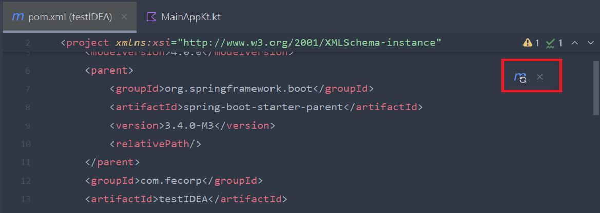

## 修改專案設定

- 點選右上角齒輪 icon

- 選擇 Settings

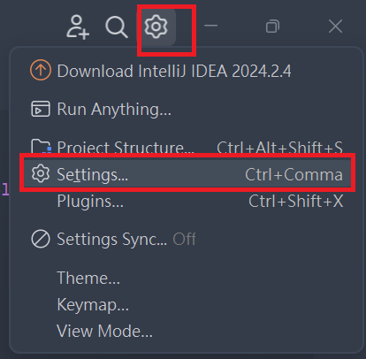

- Building, Execution, Deployment

  - complier
    - kotlin complier

- 修改成下圖設定

- 按 apply 後按 ok

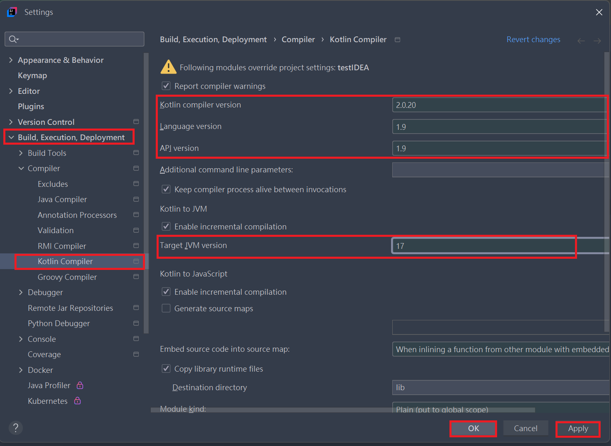

## 全部改完若還有出現錯誤請關閉整個專案重開

## 設定 kotlin 檔案執行

- 點選上方 Current File

- 選擇 Edit Configures...

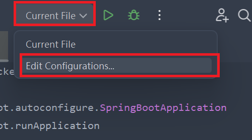

- 點選左邊 Add New..

- 選擇 Kotlin

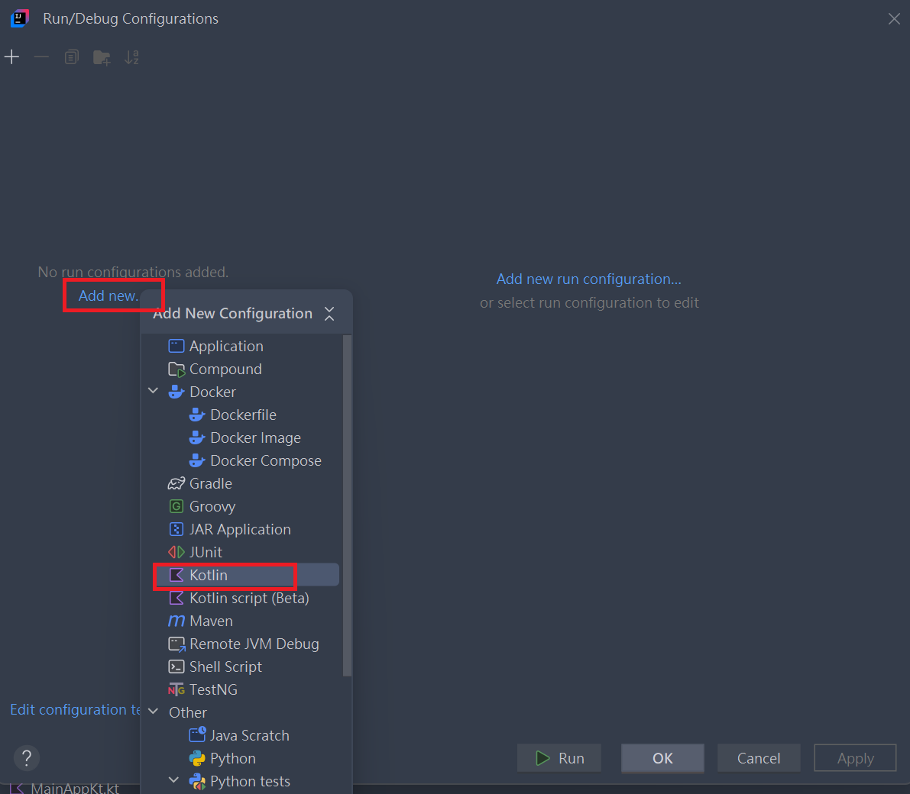

- 輸入名稱: 通常會跟專案名稱相同

- 自行輸入 Main Class

- 選擇 kt 檔案

- 按 Apply

- 按 ok

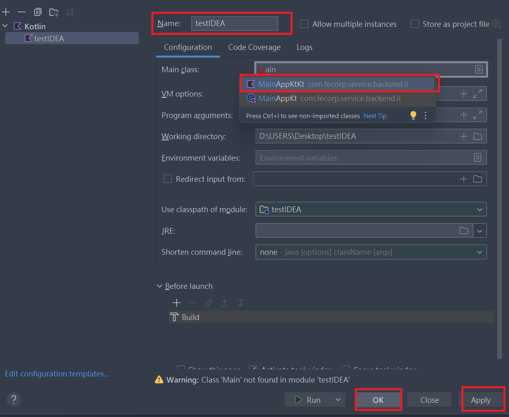

## 設定 application 檔案

- 選擇 resource
- 滑鼠右鍵 > new -> file

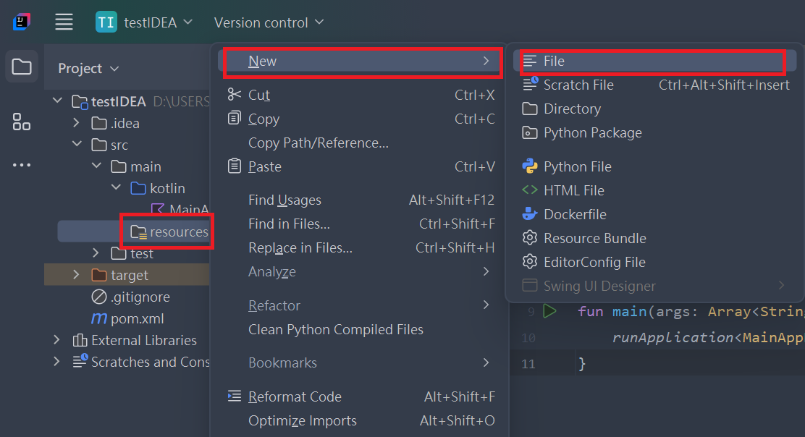

- 新增一個 application.yml 檔案

### 程式碼解釋:

#### 1. 資料源配置 (spring.datasource)

```yml
spring:
  datasource:
    url: jdbc:mysql://127.0.0.1:3306/DemonUser?useUnicode=true&characterEncoding=utf-8&serverTimezone=Asia/Taipei
    username: root
    password: 'xxxxxx'
```

- url: 設定資料庫的連接 URL。這裡是連接到本地的 MySQL 資料庫 DemonUser，並且設置了相關的編碼參數：
  - useUnicode=true: 啟用 Unicode 編碼，支持多語言字符集。
  - characterEncoding=utf-8: 設置字符編碼為 UTF-8，確保可以正確處理各種字符。
  - serverTimezone=Asia/Taipei: 設置服務器時區為台北時間。
- username: 資料庫的用戶名，這裡是 root。
- password: 資料庫的密碼，這裡是 'xxxxxx'。實際使用中需要替換為具體的密碼。

#### 2. SQL 初始化設定 (spring.sql.init)

```yml
sql:
  init:
    mode: always
```

- mode: always: 設定 SQL 初始化模式為 "always"。這意味著每次應用啟動時，Spring Boot 都會執行資料庫初始化操作。通常，這會執行 SQL 腳本來建立或更新資料庫結構。如果設置為 embedded，它只會在內嵌資料庫時生效；設置為 never 則禁用 SQL 初始化。

#### 3. JPA 配置 (spring.jpa)

```yml
jpa:
  hibernate:
    ddl-auto: update
    naming:
      physical-strategy: org.hibernate.boot.model.naming.PhysicalNamingStrategyStandardImpl
  generate-ddl: true
  properties:
    hibernate:
      jdbc:
        batch_size: 2000
      batch_versioned_data: true
      order_inserts: true
      globally_quoted_identifiers: true
  open-in-view: false
```

- spring.jpa.hibernate.ddl-auto

  - ddl-auto: update: 定義 Hibernate 的資料庫結構更新策略。update 表示每次啟動應用時，Hibernate 會根據實體類與資料庫的差異自動更新資料庫結構（表格和欄位）。不會刪除資料，只會更新。如果想避免修改資料庫結構，可以選擇 validate，這樣 Hibernate 只會檢查資料庫結構是否正確，並不會進行更新。

- spring.jpa.hibernate.naming.physical-strategy

  - naming.physical-strategy: org.hibernate.boot.model.naming.PhysicalNamingStrategyStandardImpl: 配置 Hibernate 如何處理資料庫的命名策略。在這裡使用的是標準的命名策略，它會將 Java 中的驚嘆符號（CamelCase）轉換為資料庫中的下劃線風格（snake_case）。例如，userName 會被轉換成 user_name。

- spring.jpa.generate-ddl
  - generate-ddl: true: 設置是否由 JPA 在啟動時自動生成資料庫結構，通常與 ddl-auto 配合使用。在這裡設置為 true，表示啟用這一功能。

**Hibernate 相關設置 (hibernate.properties)**

- hibernate.jdbc.batch_size: 2000: 設定批量處理的大小，這意味著 Hibernate 在執行批量操作（例如插入、更新）時，會將操作分為每批最多 2000 條 SQL 語句一起執行，從而提升性能，尤其是在處理大量資料時。

- hibernate.batch_versioned_data: true: 設定是否啟用批量更新版本化數據的功能。如果設為 true，在進行批量更新時，Hibernate 會對版本化的資料（如使用了樂觀鎖的實體）進行處理，以避免併發問題。

- hibernate.order_inserts: true: 設定是否將插入操作按照表的依賴順序排序，這有助於提高資料庫性能，避免外鍵約束錯誤。設為 true 會讓 Hibernate 優化插入語句的順序。

- hibernate.globally_quoted_identifiers: true: 設定是否為所有資料庫表和欄位名稱加上引號，這有助於確保資料庫操作不會因為表或欄位名稱與關鍵字衝突而出錯。這在某些資料庫中（如 MySQL）可以幫助避免命名衝突。

- spring.jpa.open-in-view
  - open-in-view: false: 設置是否開啟 "Open Session in View" 功能。這是一種設計模式，通常用於 Spring MVC 應用中，在整個請求處理過程中保持資料庫的 Hibernate session 開放，以便於在視圖層渲染時進行資料庫查詢。如果設為 true，則在請求過程中，Hibernate 的 session 會在整個請求生命周期內保持開啟，允許在視圖層進行懶加載（lazy loading）。設為 false，則避免在視圖渲染階段進行懶加載，有助於防止懶加載引發的延遲加載問題，通常更推薦這種做法。

### 完整程式碼

```yml
spring:
  datasource:
    url: jdbc:mysql://127.0.0.1:3306/DemonUser?useUnicode=true&characterEncoding=utf-8&serverTimezone=Asia/Taipei
    username: root
    password: 'xxxxxx'
  sql:
    init:
      mode: always
  jpa:
    hibernate:
      ddl-auto: update
      naming:
        physical-strategy: org.hibernate.boot.model.naming.PhysicalNamingStrategyStandardImpl
    generate-ddl: true
    properties:
      hibernate:
        jdbc:
          batch_size: 2000
        batch_versioned_data: true
        order_inserts: true
        globally_quoted_identifiers: true
    open-in-view: false
```

### 小結

- 資料源配置: 設定了資料庫連接的基本信息，如 URL、用戶名和密碼。
- SQL 初始化模式: 設定了 Spring Boot 在啟動時是否總是初始化資料庫。
- JPA 配置: 設定了 Hibernate 的一些性能優化選項和資料庫結構管理策略，並關閉了懶加載的會話模式 (open-in-view)，以避免可能的延遲加載問題。

  > 這些配置共同作用於你的 Spring Boot 應用，確保資料庫與應用的運行效率和穩定性。

### 如果有推上 github 的話，要記得把 application.yml 放在.gitignore 裡面
