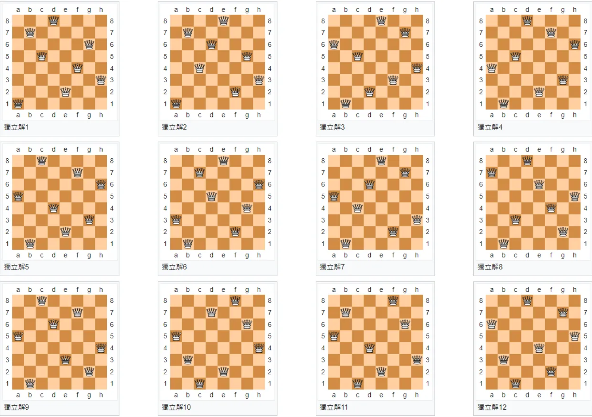

# 目錄

- [第一題 反轉陣列](#第一題-反轉陣列)
- [第二題 找出最大值](#第二題-找出最大值)
- [第三題 加總數值](#第三題-加總數值)
- [第四題 等差數列](#第四題-等差數列)
- [第五題 九九乘法表](#第五題-九九乘法表)
- [第六題 第一個字母是否為大寫](#第六題-第一個字母是否為大寫)
- [第七題 所有字母是否為大寫](#第七題-所有字母是否為大寫)
- [第八題 回傳第一個大寫字母和它的 position](#第八題-回傳第一個大寫字母和它的-position)
- [第九題 星星階層](#第九題-星星階層)
- [第十題 尋找最小數](#第十題-尋找最小數)
- [第十一題 星星階層 2](#第十一題-星星階層2)
- [第十二題 尋找最小數的總和](#第十二題-尋找最小數的總和)
- [第十三題 費波那契數](#第十三題-費波那契數)
- [第十四題 字串反轉](#第十四題-字串反轉)
- [第十五題 字串反轉](#第十五題-字串大小寫反轉)
- [第十六題 是否為質數](#第十六題-是否為質數)
- [第十七題 回文](#第十七題-回文)
- [第十八題 金字塔星星](#第十八題-金字塔星星)
- [第十九題 反轉金字塔星星](#第十九題-反轉金字塔星星)
- [第二十題 質因數](#第二十題-質因數)
- [第二十一題 排序](#第二十一題-排序)
- [第二十二題 落地問題](#第二十二題-落地問題)
- [第二十三題 水仙花數](#第二十三題-水仙花數)
- [第二十四題 n 位數問題](#第二十四題-n-位數問題)
- [第二十五題 洗牌](#第二十五題-洗牌)
- [第二十六題 剩餘元素的順序](#第二十六題-剩餘元素的順序)
- [第二十七題 老鼠藥問題](#第二十七題-老鼠藥問題)
- [第二十八題 囚犯問題](#第二十八題-囚犯問題)
- [第二十九題 演算法](#第二十九題-演算法)
- [第三十題 八皇后問題](#第三十題-八皇后問題)

# 第一題 反轉陣列

試試看，用課程學過的語法，將一個 array 內部的所有元素反過來!

(禁止使用 Array.prototype.reverse()。另外，考慮時間複雜度，需要在 O(n)內，不能是 O(n^2))

例如:

const friends = ["Harry", "Ron", "Snap", "Mike", "Grace"];

會變成

["Grace", "Mike", "Snap","Ron","Harry"];

[解答](#第一題解答)

---

# 第二題 找出最大值

在這個 coding 練習裡面，你要寫一個函式，他可以接受一個 parameter，參數是一個 array of numbers。這個函式要 return 一個值，也就是 Array 當中最大的數! 若是 input 是一個 empty array，則 return undefined。例如：

```js
findBiggest([15, 20, 22, 16, 7]); // return 22
findBiggest([1, 2, 3, 4, 5, 999]); // return 999
findBiggest([-11, 0, -3, -4, -5, -999]); // return 0
findBiggest([]); // return undefined
```

[解答](#第二題解答)

---

# 第三題 加總數值

addUpTo() 這個函式有大於 0 的參數 n，n 為一個正整數。 addUpTo() 要 return 1 + 2 + 3 + ..... + n 的值。

例如:

```js

addUpTo(5) = 1 + 2 + 3 + 4+ 5 = 15
addUpTo(100) = 1 + 2 + 3 + 4 + 5 + ....... + 100 = 5050
addUpTo(5); // 15
addUpTo(100); // 5050
addUpTo(5000); // 12502500
addUpTo(100000); // 5000050000
```

[解答](#第三題解答)

---

# 第四題 等差數列

編寫一個名為“printEvery3()”的函式，它打印出等差數列 1, 4, 7, …, 88。

```js
printEvery3();
// 1
// 4
// ...
// 88
```

[解答](#第四題解答)

---

# 第五題 九九乘法表

編寫一個名為 table9to9 的函式，它打印出九九乘法表的內容。

```js
table9to9();
// 1 x 1 = 1
// 1 x 2 = 2
// 1 x 3 = 3
// ...
// 1 x 9 = 9
// 2 x 1 = 2
// 2 x 2 = 4
// ...
// 9 x 9 = 81
```

[解答](#第五題解答)

---

# 第六題 第一個字母是否為大寫

編寫一個名為 isUpperCase 的函式，唯一的參數是一個 String，其功能為來檢查參數中 String 的第一個字母是否為大寫。

```js
isAllUpperCase("ABCD"); // returns true
isAllUpperCase(""); // returns false
isAllUpperCase("ABCDEFGHIJKLm"); // returns false
```

[解答](#第六題解答)

---

# 第七題 所有字母是否為大寫

編寫一個名為 isAllUpperCase 的函式，唯一的參數是一個 String，其功能為來檢查參數中 String 的所有字母是否為大寫。

```js
isAllUpperCase("ABCD"); // returns true
isAllUpperCase(""); // returns false
isAllUpperCase("ABCDEFGHIJKLm"); // returns false
```

[解答](#第七題解答)

---

# 第八題 回傳第一個大寫字母和它的 position

編寫一個名為 position 的函式，唯一的參數是一個 String，其功能為找到參數 String 當中的第一個大寫字母，並且回傳大寫字母的值以及其 index 位置。

```js
position("abcd"); // prints -1
position("AbcD"); // prints A 0
position("abCD"); // prints C 2
```

[解答](#第八題解答)

---

# 第九題 星星階層

編寫一個名為 stars 的函式，功能為按以下模式打印出星星層：

```js
stars(1);
// _
stars(4);
// _
// **
// \***
// \*\*\*\*
```

[解答](#第九題解答)

---

# 第十題 尋找最小數

編寫一個名為 findSmallCount 的函式，其參數為一個整數的 array 以及另一個整數，功能是回傳一個整數，來表示 array 中有多少元素小於第二個參數。

```js
findSmallCount([1, 2, 3], 2); // returns 1
findSmallCount([1, 2, 3, 4, 5], 0); // returns 0
```

[解答](#第十題解答)

---

# 第十一題 星星階層 2

編寫一個名為 stars2 的函式，功能為按以下模式打印出星星層：

```js
stars2(1);
// *
stars2(2);
// *
// **
// *
stars2(3);
// *
// **
// ***
// **
// *
stars2(4);
// *
// **
// ***
// ****
// ***
// **
// *
```

[解答](#第十一題解答)

---

# 第十二題 尋找最小數的總和

編寫一個名為 findSmallerTotal 的函式，其參數為一個整數的 array 以及另一個整數，回傳值為 array 中小於第二個參數的所有元素的總和。

```js
findSmallerTotal([1, 2, 3], 3); // returns 3
findSmallerTotal([1, 2, 3], 1); // returns 0
findSmallerTotal([3, 2, 5, 8, 7], 999); // returns 25
findSmallerTotal([3, 2, 5, 8, 7], 0); // returns 0
```

[解答](#第十二題解答)

---

# 第十三題 費波那契數

在數學上，費波那契數是以遞迴的方法來定義：

```math
F_0 = 0, F_1 = 1, \\
F_n = F_{n-1} + F_{n - 2},n\ge2
```

首幾個費波那契數是：0、1、 1、 2、 3、 5、 8、 13、 21、 34、 55、 89、 144、 233、 377、 610、 987、…。編寫一個名為 fib 的函式，唯一的參數是個整數 n，回傳值為斐波那契數列的第 n 項。

```js
fib(0); // returns 0
fib(1); // returns 1
fib(2); // returns 1
fib(3); // returns 2
fib(8); // returns 21
```

[解答](#第十三題解答)

---

# 第十四題 字串反轉

編寫一個名為 reverse 的函式，參數為一個 String，回傳值為順序反轉的 String。

```js
reverse("abcd"); // returns "dcba"
reverse("I am a good guy."); // returns ".yug doog a ma I"
```

[解答](#第十四題解答)

---

# 第十五題 字串大小寫反轉

編寫一個名為 swap 的函式，參數為一個 String，回傳值為大小寫反轉的 String。

```js
swap("Aloha"); // returns "aLOHA"
swap("Love you."); // returns "lOVE YOU."
```

[解答](#第十五題解答)

---

# 第十六題 是否為質數

編寫一個名為 isPrime 的函式，它接受一個整數作為參數，回傳值為一個 boolean，告訴我們參數是否為一個質數。

```js
isPrime(1); // returns false
isPrime(5); // returns true
isPrime(91); // returns false
isPrime(1000000); // returns false
```

[解答](#第十六題解答)

---

# 第十七題 回文

回文是指，正著讀或反著讀都一樣的句子。例如:【上海自來水來自海上】是迴文。寫一個名為 palindrome 的函式，它接受一個 String 作為參數，回傳值為一個 boolean，告訴我們參數是否為回文。

```js
palindrome("bearaeb"); // returns true
palindrome("whatever revetahw"); // returns true
palindrome("Aloha, how are you today?"); // returns false
```

[解答](#第十七題解答)

---

# 第十八題 金字塔星星

編寫一個名為 pyramid 的函式，功能為按以下模式打印出星星層：

```js
pyramid(1);
//*
pyramid(2);
//  *
// ***
pyramid(4);
//    *
//   ***
//  *****
// *******
```

[解答](#第十八題解答)

---

# 第十九題 反轉金字塔星星

編寫一個名為 inversePyramid 的函式，功能為按以下模式打印出星星層：

```js
inversePyramid(4);
// *******
//  *****
//   ***
//    *
```

[解答](#第十九題解答)

---

# 第二十題 質因數

編寫一個名為 factorPrime 的函式，唯一的參數是個整數 n，回傳值是一個 String，表示 n 的質因數分解結果。

```js
factorPrime(120); // returns "2 x 2 x 2 x 3 x 5"
```

[解答](#第二十題解答)

---

# 第二十一題 排序

編寫一個名為 mySort 的函式，參數為一個 array of numbers，回傳值為一個將元素由小到大排序的 array。

```js
mySort([17, 0, -3, 2, 1, 0.5]); // returns [-3, 0, 0.5, 1, 2, 17]
```

[解答](#第二十一題解答)

---

# 第二十二題 落地問題

落地問題: 一球從 h 米高度自由落下，每次落地後反跳回原高度的一半，再落下。求小球在第 n 次落地時，總共經過多少公尺？編寫一個名為 distance 的函式，參數為 h 與 n，回傳值為小球經過的總距離。

```js
console.log(distance(100, 4)); // 275
console.log(distance(500, 7)); // 1484.375
```

[解答](#第二十二題解答)

---

# 第二十三題 水仙花數

打印出所有的"水仙花數"。所謂"水仙花數"是指一個三位數，其各位數字立方和等於該數本身。例如：153 是一個"水仙花數"，因為$153=1^3+5^3+3^3$，或 370 也是水仙花數，因為$370=3^3+7^3+0^3$。

```js
PPDI();
// 153
// 370
// 371
// 407
```

[解答](#第二十三題解答)

---

# 第二十四題 n 位數問題

求 s=a+aa+aaa+aaaa+aa...a 的值，其中 a 是小於 10 的數字，相加的項數為 n。例如，當 a = 2，n=5 時，s=2+22+222+2222+22222。若 a =2, n = 3，則輸出結果的形式如：2+22+222 = 246。編寫一個名為 calc 的函式，參數為 a 與 n，回傳值為 s。

```js
calc(2, 3); // returns 246
calc(8, 5); // returns 98760
```

[解答](#第二十四題解答)

---

# 第二十五題 洗牌

編寫一個名為"shuffle()”的函數，唯一的參數為一個 array of integers，return type 也是 array of integers，返回的 array 與參數 array 的元素相同，但元素順序為隨機排序的結果。

```js
shuffle([2, 11, 37, 42]);
// returns 一個經過洗牌後的 array。
// 可能是[42, 11, 37, 2]
```

[解答](#第二十五題解答)

---

# 第二十六題 剩餘元素的順序

電腦科學中 String 的 subsequence 是指，可以通過刪除零個或多個元素而不改變剩餘元素的順序，從而產生的新的 String，就是原先 String 的 subsequence。例如: book 是 brooklyn 的 subsequence。
寫出一個被稱為 isSubsequence 的函式。此函式能夠給定任兩個 String，並且回傳一個 boolean 值，判斷第一個 string 是不是第二個 string 的 subsequence。

```js
console.log(isSubsequence("book", "brooklyn")); // true
console.log(isSubsequence("CAATCGA", "TCAATCAGGATCCGCTGA")); // true
console.log(isSubsequence("AATTAA", "TCAATCAGGATCCGCTGA")); // false
```

[解答](#第二十六題解答)

---

# 第二十七題 老鼠藥問題

老鼠毒藥問題: 有 100 個一模一樣的瓶子，其中有 99 瓶是普通的水，有一瓶是毒藥。任何喝下毒藥的生物都會在一星期之後死亡。現在，你有一星期的時間，請問你最少可以用幾隻老鼠就檢測出毒藥是哪一瓶，以及如何檢驗出哪個瓶子裡有毒藥？
若有 1000 個一模一樣的瓶子，其中有 999 瓶是普通的水，有一瓶是毒藥，那又需要最少用幾隻老鼠呢?

```js
// 100瓶需要7隻老鼠
```

[解答](#第二十七題解答)

---

# 第二十八題 囚犯問題

100 位囚犯排排站，站在奇數位的人槍斃，偶數位留下，不斷重複這個過程直到剩下一個人。請問，若要活到最後，一開始要站在 100 中的第幾號位置? 若有 1000 名囚犯呢?一開始要站在第幾號位置?

```js
// 100人要站在64號位置
// 1000人要站在512號位置
```

[解答](#第二十八題解答)

---

# 第二十九題 演算法

請證明，任何使用比較 array 元素大小來做排序的演算法，其最好的時間複雜度是：

```math
O(n\log_2n)
```

[解答](#第二十九題解答)

---

# 第三十題 八皇后問題

八皇后問題是一個以西洋棋為背景的問題：如何能夠在 8×8 的西洋棋棋盤上放置八個皇后，使得任何一個皇后都無法直接吃掉其他的皇后？為了達到此目的，任兩個皇后都不能處於同一條橫行、縱行或斜線上。所有解不需要考慮旋轉棋盤後的不同結果，而八皇后問題的解答如下:



[解答](#第三十題解答)

---

# 第一題解答

```js
const friends = ["Harry", "Ron", "Snap", "Mike", "Grace"];
let arr = friends;
for (let i = 0; i < arr.length; i++) {
  friends[i] = arr[arr.length - i - 1];
}
console.log(friends);
```

[01](../javaScript/01.js)

---

# 第二題解答

```js
function findBiggest(arr) {
  let max = arr[0];
  for (let i = 1; i < arr.length; i++) {
    if (arr[i] > max) {
      max = arr[i];
    }
  }
  return max;
}
console.log(findBiggest([15, 20, 22, 16, 7]));
console.log(findBiggest([1, 2, 3, 4, 5, 999]));
console.log(findBiggest([-11, 0, -3, -4, -5, -999]));
console.log(findBiggest([]));
```

[02](../javaScript/02.js)

---

# 第三題解答

> 時間複雜度 O(n)

```js
function addUpTo(num) {
  let total = 0;
  for (let i = 0; i <= num; i++) {
    total += i;
  }
  return total;
}
console.log(addUpTo(5));
console.log(addUpTo(100));
console.log(addUpTo(5000));
console.log(addUpTo(100000));
```

[03_1](../javaScript/03_1.js)

> 時間複雜度 O(1)

```js
function addUpTo(num) {
  return ((num + 1) * num) / 2;
}
console.log(addUpTo(5));
console.log(addUpTo(100));
console.log(addUpTo(5000));
console.log(addUpTo(100000));
```

[03_2](../javaScript/03_2.js)

> 計算效能

```js
function addUpTo1(num) {
  return ((num + 1) * num) / 2;
}
let startTime1 = performance();
console.log(addUpTo1(100000));
let endTime1 = performance();
console.log(endTime1 - startTime1);

function addUpTo2(num) {
  let total = 0;
  for (let i = 0; i <= num; i++) {
    total += i;
  }
  return total;
}
let startTime2 = performance();
console.log(addUpTo2(100000));
let endTime2 = performance();
console.log(endTime2 - startTime2);
```

[03_3](../javaScript/03_3.js)

```js
function addUpTo(n) {
  if (n == 1) return 1;
  return n + addUpTo(n - 1);
}
console.log(addUpTo(5));
console.log(addUpTo(100));
console.log(addUpTo(5000));
```

[03_4](../javaScript/03_4.js)

---

# 第四題解答

```js
function printEvery3() {
  for (let i = 1; i <= 88; i += 3) {
    console.log(i);
  }
}
printEvery3();
```

[04_for](../javaScript/04_for.js)

```js
function printEvery3() {
  let i = 1;
  while (i < 88) {
    console.log(i);
    i += 3;
  }
}
printEvery3();
```

[04_while](../javaScript/04_while.js)

```js
function printEvery3() {
  let i = 1;
  do {
    console.log(i);
    i += 3;
  } while (i <= 88);
}
printEvery3();
```

[04_do_while](../javaScript/04_do_while.js)

---

# 第五題解答

```js
function table9to9() {
  for (let i = 1; i < 10; i++) {
    for (let j = 1; j < 10; j++) {
      console.log(i + " x " + j + " = " + i * j);
    }
  }
}
table9to9();
```

[05](../javaScript/05.js)

---

# 第六題解答

```js
function isUpperCase(str) {
  let upperCase = [
    "A",
    "B",
    "C",
    "D",
    "E",
    "F",
    "G",
    "H",
    "I",
    "J",
    "K",
    "L",
    "M",
    "N",
    "O",
    "P",
    "Q",
    "R",
    "S",
    "T",
    "U",
    "V",
    "W",
    "X",
    "Y",
    "Z",
  ];
  for (let i = 0; i < upperCase.length; i++) {
    if (str[0] == upperCase[i]) {
      return true;
    }
  }
  return false;
}

console.log(isUpperCase("ABCD"));
console.log(isUpperCase(""));
console.log(isUpperCase("aBCD"));
```

[06_01](../javaScript/06_1.js)

```js
function isUpperCase(str) {
  if (str.length <= 0) {
    return false;
  } else {
    return str[0] == str[0].toUpperCase();
  }
}
console.log(isUpperCase("ABCD"));
console.log(isUpperCase(""));
console.log(isUpperCase("aBCD"));
```

[06_02](../javaScript/06_2.js)

---

# 第七題解答

```js
function isAllUpperCase(str) {
  let upperCase = [
    "A",
    "B",
    "C",
    "D",
    "E",
    "F",
    "G",
    "H",
    "I",
    "J",
    "K",
    "L",
    "M",
    "N",
    "O",
    "P",
    "Q",
    "R",
    "S",
    "T",
    "U",
    "V",
    "W",
    "X",
    "Y",
    "Z",
  ];
  if (str.length <= 0) {
    return false;
  }
  for (let i = 0; i < str.length; i++) {
    for (let j = 0; j < upperCase.length; j++) {
      if (str[i] == upperCase[j]) {
        break;
      } else if (upperCase[j] == "Z") {
        return false;
      }
    }
  }

  return true;
}

console.log(isAllUpperCase("ABCD"));
console.log(isAllUpperCase(""));
console.log(isAllUpperCase("ABCDEFGHIJKLm"));
```

[07_01](../javaScript/07_01.js)

```js
function isAllUpperCase(str) {
  if (str.length <= 0) {
    return false;
  } else {
    let counter = 0;
    while (counter < str.length) {
      if (str[counter] == str[counter].toUpperCase()) {
        counter++;
      } else {
        return false;
      }
    }
    return true;
  }
}

console.log(isAllUpperCase("ABCD"));
console.log(isAllUpperCase(""));
console.log(isAllUpperCase("ABCDEFGHIJKLm"));
```

[07_02](../javaScript/07_02.js)

```js
function isAllUpperCase(str) {
  if (str.length <= 0) {
    return false;
  } else {
    for (let i = 0; i < str.length; i++) {
      if (str[i] != str[i].toUpperCase()) {
        return false;
      }
    }
    return true;
  }
}

console.log(isAllUpperCase("ABCD"));
console.log(isAllUpperCase(""));
console.log(isAllUpperCase("ABCDEFGHIJKLm"));
```

[07_03](../javaScript/07_03.js)

```js
function isAllUpperCase(str) {
  if (str.length <= 0) {
    return false;
  } else {
    return str == str.toUpperCase();
  }
}

console.log(isAllUpperCase("ABCD"));
console.log(isAllUpperCase(""));
console.log(isAllUpperCase("ABCDEFGHIJKLm"));
```

[07_04](../javaScript/07_04.js)

---

# 第八題解答

```js

```

[08]()

---

# 第九題解答

```js

```

[09]()

---

# 第十題解答

```js

```

[10]()

---

# 第十一題解答

```js

```

[11]()

---

# 第十二題解答

```js

```

[12]()

---

# 第十三題解答

```js

```

[13]()

---

# 第十四題解答

```js

```

[14]()

---

# 第十五題解答

```js

```

[15]()

---

# 第十六題解答

```js

```

[16]()

---

# 第十七題解答

```js

```

[17]()

---

# 第十八題解答

```js

```

[18]()

---

# 第十九題解答

```js

```

[19]()

---

# 第二十題解答

```js

```

[20]()

---

# 第二十一題解答

```js

```

[21]()

---

# 第二十二題解答

```js

```

[22]()

---

# 第二十三題解答

```js

```

[23]()

---

# 第二十四題解答

```js

```

[24]()

---

# 第二十五題解答

```js

```

[25]()

---

# 第二十六題解答

```js

```

[26]()

---

# 第二十七題解答

```js

```

[27]()

---

# 第二十八題解答

```js

```

[28]()

---

# 第二十九題解答

```js

```

[29]()

---

# 第三十題解答

```js

```

[30]()
