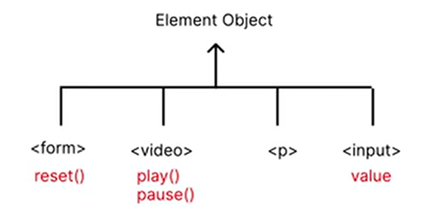

# 目錄

- [第一章 Document Object Model DOM 簡介](#第一章-Document-Object-Model-DOM-簡介)
- [第二章 Document Object](#第二章-Document-Object)
- [第三章 Function Declaration and Expression](#第三章-Function-Declaration-and-Expression)
- [第四章 Arrow Function Expression](#第四章-Arrow-Function-Expression)
- [第五章 ForEach methods](#第五章-ForEach-methods)
- [第六章 Element Objects](#第六章-Element-Objects)
- [第七章 Inheritance](#第七章-Inheritance)
- [第八章 JS Event](#第八章-JS-Event)
- [第九章 Local Storage and Session Storage](#第九章-Local-Storage-and-Session-Storage)

# 第一章 Document Object Model DOM 簡介

> 文件物件模型(Document Object Model DOM) 是 HTML 的程式介面。它提供了一個文件(樹)的結構化表示法，並定義讓程式可以存取並改變文件架構、風格和內容的方法。

> DOM 提供了文件已擁有屬性和函式的節點與物件組成的結構化表示。節點也可以附加事件處理程序，一旦觸發事件就會執行處理程序。本質上，它將網頁與腳本或程式語言連結在一起。

> 簡單來說，**DOM 允許我們在 JavaScript 當中操作 HTML 元素**。(如果 JS 無法存取 DOM，那麼它與其他程式語言相比沒有甚麼區別)

## Window Object

- 在 JavaScript 當中的 window object 代表目前程式碼正在運行的電腦視窗(通常就是指我們瀏覽器的視窗)。Window Object 可使用的常見 methods 包含:
  **window 可以不寫，直接寫後面的 function 即可**

  - window.alert(): 在視窗顯示對話框

    ```js
    window.alert("Hello World!");
    ```

    ```js
    alert("Hello World!");
    ```

  - window.addEventLister(): 將事件監聽程式碼附加到 Window Object
  - window.setInterval(): 每次經過給定的毫秒數時，安排一個函數執行

    ```js
    function sayHelloToUser() {
      alert("Three seconds have already passed!");
    }
    window.setInterval(sayHelloToUser, 3000);
    ```

  - window.clearInterval(): 將 setInterval()所重複執行的程式暫停

    - 執行一次後就不會執行

    ```js
    function sayHelloToUser() {
      alert("Three seconds have already passed!");
      window.clearInterval(interval);
    }
    window.setInterval(sayHelloToUser, 3000);
    ```

  - window.prompt(): return 用戶在提示對話框中輸入的文字

- 物件導向程式概念: 一個 Objet 可以是另一個 Object 的 attribute。例如:人的配偶也是一個人。

```js
let Grace = {
  name: "Grace",
  age: 26,
};

let Wilson = {
  name: "Wilson",
  age: 26,
  spouse: Grace,
};
console.log(Wilson.spouse.Grace);
```

- Window Object 可使用的常見 properties 包含:

  - window.console: return 一個 console object。console object 可以對瀏覽器的 debuggung console 進行控制與訪問。常用的 methods 為 log(),error()。

  ```js
  console.log("Hello World!");
  console.error("This is a error!");
  ```

  - window.document: return window 包含的文檔，也就是 HTML 文件。

  ```js
  console.log(window.document);
  ```

  - window.localStorage: return 一個 local storage 物件
  - window.sessionStorage: return 一個 session storage 物件
    [第九章 Local Storage and Session Storage](#第九章-Local-Storage-and-Session-Storage)

- 總結:

  - 所謂的 Document Object Model，顧名思義，可知 HTML 也被視為是個物件。這種架構被稱之為模型(Model)。我們知道:

    1. document 是一個 object，是 window object 的一個屬性
    2. document 是指 HTML document
    3. 這個模型意味著所有 document 內部的 HTML 元素都是 object。**每個 HTML 標籤都有其屬性和方法**。

    

# 第二章 Document Object

- 在 Document Object Model 這棵樹上的每個點被稱之為節點(node)。節點分為三種:

  1. HTML 元素節點(稱為 element nodes or element objects)
     - chidren : 回傳 HTMLCollection
     - chidNodes: 回傳 NodeList
  2. 文字節點(text node)
     - chidren : 回傳 HTMLCollection
     - chidNodes: undefined
  3. 註解節點(comment node)
     - chidren : 回傳 HTMLCollection
     - chidNodes: undefined

- DOM 提供 2 種節點集合: HTMLCollection 以及 NodeList

  - HTMLCollection
    - [更多相關資訊](https://developer.mozilla.org/en-US/docs/Web/API/HTMLCollection)
  - NodeList
    - [更多相關資訊](https://developer.mozilla.org/en-US/docs/Web/API/NodeList)
  - 以上兩個東西都不是 Array，而是 array-like object(類似 array 的 object)，可以用 index 拿取到東西，也可以用 length 屬性，但無法使用 pop()等的 method

- Document Object 常用的 methods 有:

  - window.document.addEventListener()
  - window.document.createElement(tagName)

    ```js
    let myH1 = document.createElement("h1");
    console.log(myH1);
    ```

    

  - window.document.getElementById(id): return 第一個 id 相符合的 element object

    ```html
    <h1 id="myHeadingH1">This is H1</h1>
    ```

    ```js
    let myHeadingH1 = document.getElementById("myHeadingH1");
    console.log(myHeadingH1);
    ```

    

  - window.document.getElementsByClassName(className): return 一個動態的 HTMLCollection，內部元素包含所有具有給定 className 的元素

    ```html
    <p class="my-p">
      Lorem ipsum, dolor sit amet consectetur adipisicing elit. Aliquam,
      delectus.
    </p>
    <p class="my-p">
      Lorem ipsum, dolor sit amet consectetur adipisicing elit. Aliquam,
      delectus.
    </p>
    <p class="my-p">
      Lorem ipsum, dolor sit amet consectetur adipisicing elit. Aliquam,
      delectus.
    </p>
    <p class="my-p">
      Lorem ipsum, dolor sit amet consectetur adipisicing elit. Aliquam,
      delectus.
    </p>
    ```

    ```js
    let myParagraphs = document.getElementsByClassName("my-p");
    console.log(myParagraphs);
    ```

    

  - querySelector(selectors): return 第一個符合特定選擇器群組的 element object。採用深度優先搜尋演算法

    ```html
    <p class="my-p">
      Lorem ipsum, dolor sit amet consectetur adipisicing elit. Aliquam,
      delectus.
    </p>
    <p class="my-p">
      Lorem ipsum, dolor sit amet consectetur adipisicing elit. Aliquam,
      delectus.
    </p>
    <p class="my-p">
      Lorem ipsum, dolor sit amet consectetur adipisicing elit. Aliquam,
      delectus.
    </p>
    <p class="my-p">
      Lorem ipsum, dolor sit amet consectetur adipisicing elit. Aliquam,
      delectus.
    </p>
    <a class="my-p" href="">this is an a tag</a>
    ```

    ```js
    let first_found = document.querySelector(".my-p");
    console.log(first_found);
    ```

    

    - 可用 css 語法來選擇元素

      ```js
      let first_found = document.querySelector("a.my-p");
      console.log(first_found);
      ```

      

  - querySelectorAll(selectors): return 一個靜態(not live) NodeList，表示與指定選擇器匹配的元素列表

    ```html
    <p class="my-p">
      Lorem ipsum, dolor sit amet consectetur adipisicing elit. Aliquam,
      delectus.
    </p>
    <p class="my-p">
      Lorem ipsum, dolor sit amet consectetur adipisicing elit. Aliquam,
      delectus.
    </p>
    <p class="my-p">
      Lorem ipsum, dolor sit amet consectetur adipisicing elit. Aliquam,
      delectus.
    </p>
    <p class="my-p">
      Lorem ipsum, dolor sit amet consectetur adipisicing elit. Aliquam,
      delectus.
    </p>
    <a class="my-p" href="">this is an a tag</a>
    ```

    ```js
    let found_elements = document.querySelectorAll(".my-p");
    console.log(found_elements);
    ```

    

    - 可用 css 語法來選擇元素

      ```js
      let found_elements = document.querySelectorAll("a.my-p");
      console.log(found_elements);
      ```

      

## HTMLCollection vs. NodeList

1. HTMLCollection(動態) vs. NodeList(靜態，使用 querySelectorAll)

   ```html
   <p class="my-p">
     Lorem ipsum, dolor sit amet consectetur adipisicing elit. Aliquam,
     delectus.
   </p>
   <p class="my-p">
     Lorem ipsum, dolor sit amet consectetur adipisicing elit. Aliquam,
     delectus.
   </p>
   ```

   ```js
   let myPs = document.getElementsByClassName("my-p");
   let myPss = document.querySelectorAll(".my-p");
   console.log("HTMLCollection: " + myPs.length); //2
   console.log("NodeList: " + myPss.length); //2

   let body = document.querySelector("body");
   let p = document.createElement("p");
   p.innerText = "This is a new p";
   p.classList.add("my-p");
   body.appendChild(p);
   console.log("When DOM is changed!");
   console.log("HTMLCollection: " + myPs.length); //3
   console.log("NodeList: " + myPss.length); //2
   ```


2. 節點(Node)比較

   ```html
   <body>
     <!--This is twwo p tag-->
     <p class="my-p">
       Lorem ipsum, dolor sit amet consectetur adipisicing elit. Aliquam,
       delectus.
     </p>
     <p class="my-p">
       Lorem ipsum, dolor sit amet consectetur adipisicing elit. Aliquam,
       delectus.
     </p>
   </body>
   ```

   ```js
   let body = document.querySelector("body");
   console.log(body.childNodes); //NodeList
   console.log(body.children); //Element Object
   ```

   

   > 從上圖可知: Element Objects 這種 node 可以同時使用 childNodes 以及 children 屬性。但其他兩種 Node 卻只有能夠使用 childrenNodes 屬性。若其他兩種 node 使用 children 屬性，只會看到 undefined。

**表格比較**

| Methods                           | Return Type                                                                                                          |
| --------------------------------- | -------------------------------------------------------------------------------------------------------------------- |
| getElementById(id)                | Element object (single element, returns `null` if not found)                                                         |
| getElementsByClassName(className) | HTMLCollection (contains only Element objects, dynamic, updates automatically when the DOM changes)                  |
| querySelector(selector)           | Element object (first matching element, returns `null` if not found)                                                 |
| querySelectorAll(selector)        | Static NodeList (can contain Element, Text, and Comment nodes, does not auto-update, but can be used with `forEach`) |

| 方法                              | 回傳類型                                                                                        |
| --------------------------------- | ----------------------------------------------------------------------------------------------- |
| getElementById(id)                | Element 物件（單一元素，如果找不到則回傳 `null`）                                               |
| getElementsByClassName(className) | HTMLCollection（內部只包含 Element 物件，動態更新，當 DOM 改變時，內容會自動更新）              |
| querySelector(selector)           | Element 物件（符合條件的第一個元素，如果找不到則回傳 `null`）                                   |
| querySelectorAll(selector)        | 靜態 NodeList（內部可包含 Element、Text、Comment 節點，不會自動更新，但可以直接使用 `forEach`） |

|            | NodeList                                                     | HTMLCollection                                              |
| ---------- | ------------------------------------------------------------ | ----------------------------------------------------------- |
| Feature    | Array-like,but not array. No push,pop,shift,unshift methods. | Array-like,but not array.No push,pop,shift,unshift methods. |
| Motion     | static                                                       | dynamic                                                     |
| Elements   | Nodes                                                        | Element Object                                              |
| Attributes | length,index                                                 | length,index                                                |
| forEach    | Allowed                                                      | Not allowed                                                 |

|           | NodeList                                                          | HTMLCollection                                                    |
| --------- | ----------------------------------------------------------------- | ----------------------------------------------------------------- |
| 特性      | 類陣列，但不是陣列。沒有 `push`、`pop`、`shift`、`unshift` 方法。 | 類陣列，但不是陣列。沒有 `push`、`pop`、`shift`、`unshift` 方法。 |
| 變動性    | 靜態                                                              | 動態                                                              |
| 元素      | Nodes                                                             | Element 件                                                        |
| 屬性      | `length`、`index`                                                 | `length`、`index`                                                 |
| `forEach` | 支援                                                              | 不支援                                                            |

# 第三章 Function Declaration and Expression

- 在 JavaScript 當中，定義 function 的方法有兩種

  - Function Declaration:不可省略函數名稱

    ```js
    function addition(a, b) {
      return a + b;
    }
    ```

    - 可以在還沒被定義 function 時就會啟用

    ✅

    ```js
    console.log(addition(10, 5));
    function addition(a, b) {
      return a + b;
    }
    ```

  - Function Expression: 可省略函數名稱以創建匿名函數

    - 語法為:

    ```pseudocode
     function(param0,param1,/*...,*/paramN){
        statements
     }
    ```

    - 主要用途:

    - 創建一個未命名的 function，之後再把 function 放在其他的變數內部，讓程式碼更有彈性

      - 範例 1:

        ✅

        ```js
        let addition = function (a, b) {
          return a + b;
        };
        console.log(addition(2, 3));
        ```

        - 不可在未定義前被啟用

        ❌

        ```js
        console.log(addition(2, 3));
        let addition = function (a, b) {
          return a + b;
        };
        ```

      - 範例 2:

        ```js
        let Wilson = {
          name: "Wilson",
          greet() {
            console.log(this.name + "says Hi!");
          },
          walk: function () {
            console.log(this.name + "is walking");
          },
        };
        Wilson.greet();
        Wilson.walk();
        ```

    - 當作 higher order function 的 callback function 使用

      - higher order function: A(B), then A is a higher order function
      - 例如:

        - forEach
        - addEventListener: 有兩個參數

          1. 事件
          2. 當事件發生時，要執行什麼動作

          ```js
          function react() {
            alert("click!");
          }
          window.addEventListener("click", react);
          ```

          > addEventListener 是一個 higher order functin,react 是一個 callback function

          - 如果只有在一個地方使用，建議換成 Expression 的形式

            ```js
            window.addEventListener("click", function () {
              alert("click!");
            });
            ```

            - 優點:
              1. 如果我們程式碼中有許多 callback function 都是採用 function declaration，在命名變數時都須要避開這些 function 的名稱
              2. Callback function 的名稱都沒有意義
              3. 使用 Function Expression 可以讓五們程式碼變簡潔

    - 使用 IIFE(Immediately Invokied Function Expression)的功能

      - 立即執行的 Function Expression，寫法:

        ```js
        (function (a, b) {
          console.log(a + b);
        })(10, 5);
        ```

# 第四章 Arrow Function Expression

- JavaScript 中的函數是 first-class object(一等公民)。所謂的 function 是 first-class object 是指，我們可以:

  1. 將 function 分配給變數。 例如，let hello = function(){...};
  2. 將 function 當作 aurgement 傳給其他 function(等同於數學上的 composite function)。Higher Order Function 的 argument 被稱為 callback function。

- 在許多情況下，若把 function 當作 aurgement 傳給其他 function，那麼對此函數命名則變得沒有意義。因此，選用 function Expression 會是很好的選項

**Arrow Function Expression 是 Function Expression 的簡化語法。**

- Arrow Function Expression 的語法

  - 第一種:

    ```pseudocode
    ()=> expression
    ```

    ✅

    ```js
    let Hello = () => console.log("Hello World!");
    Hello();
    ```

    ```js
    window.addEventListener("click", () => alert("click!"));
    ```

    ❌

    ```js
    let Wilson = {
      name: "Wilson",
      walk: () => console.log(this.name + "is walking"); // undrfined
    };
    Wilson.walk();
    ```

    > Arrow Function Expression 沒有 this 關鍵字綁定，不應該用做 Object 的 methods

  - 第二種: 如果只有一個參數，括弧可加可不加

    ```pseudocode
    param => expression
    ```

    ```js
    let convertor = (c) => c * 1.8 + 32;
    console.log(convertor(32));
    ```

  - 第三種:參數若有兩種以上，須加括弧

    ```pseudocode
    (param1,param2,...)=> expression
    ```

    ```js
    let addition = (a, b) => a + b;
    console.log(addition(10, 5));
    ```

  - 第四種:

        ```pseudocode
        param =>{return expression}
        ```

        ```js
        let convertor = (c) => {
         const f =  c * 1.8 + 32
         return f;
        };
        console.log(convertor(32));
        ```

**第一到第三種情況若 Expression 沒有加大括弧，那會自動 return Expression，若加大括弧，就須像第四種寫法，須寫 return 這 keywords 才會 return**

**若 function 裡面的邏輯運算很複雜(超過一行以上)都須加大括號**

## 規則整理:

1. 若 Arrow Function Expression 只有一個 parameter，則不需要加上括號(可加可不加)。

2. 若有零個或是兩個以上的 parameter，則一定要加上括號

3. Arrow Function Expression 的主體若不加上 curly brackets，則 return expression 的值。

4. 若主體有多個計算式，則一定需要加上 curly brackets。

5. 若 Arrow Function Expression 有加上 curly brackets，則一定需要加 return 關鍵字才會回傳一個值。

6. Arrow Function Expression 沒有 this 關鍵字黨定，不應該作用 Objects 的 methods。

# 第五章 ForEach methods

- forEach()為每個陣列元素執行一次提供函數。它本身為 higher order functiion，forEach()與 arrow function 協作的語法為:

  ```pseudocode
  forEach(element=>...)
  ```

  - 原本寫法:

    ```js
    let myLuckyNumber = [1, 2, 3, 4, 5, 6, 7];
    const len = myLuckyNumber.length;
    for (let i = 0; i < len; i++) {
      console.log(myLuckyNumber[i] + 3);
    }
    ```

  - forEach 寫法:

    ```js
    let myLuckyNumber = [1, 2, 3, 4, 5, 6, 7];
    myLuckyNumber.forEach((n) => console.log(n + 3));
    ```

  ```pseudocode
  forEach((element,index)=>...)
  ```

        ```js
        let myLuckyNumber = [1, 2, 3, 4, 5, 6, 7];

        myLuckyNumber.forEach((n,index) => {
            console.log(n +" is at index:"+index);
        });
        ```

  - 若只放入一個 callback function，與法則是:
    ```pseudocode
    forEach(callbackFn)
    ```
    ```js
    let myLuckyNumber = [1, 2, 3, 4, 5, 6, 7];
    function plus3(n) {
      console.log(n + 3);
    }
    myLuckyNumber.forEach(plus3);
    ```

- ✅forEach in NodeList

  ```html
  <p class="my-p">
    Lorem ipsum, dolor sit amet consectetur adipisicing elit. Aliquam, delectus.
  </p>
  <p class="my-p">
    Lorem ipsum, dolor sit amet consectetur adipisicing elit. Aliquam, delectus.
  </p>
  <p class="my-p">
    Lorem ipsum, dolor sit amet consectetur adipisicing elit. Aliquam, delectus.
  </p>
  <p class="my-p">
    Lorem ipsum, dolor sit amet consectetur adipisicing elit. Aliquam, delectus.
  </p>
  <a class="my-p" href="">this is an a tag</a>
  ```

  ```js
  let myPs = document.querySelectorAll(".my-p");
  myPs.forEach((item, index) => {
    console.log("index: " + index);
    console.log(item);
  });
  ```

  

- ❌forEach in HTMLCollection

  ```html
  <p class="my-p">
    Lorem ipsum, dolor sit amet consectetur adipisicing elit. Aliquam, delectus.
  </p>
  <p class="my-p">
    Lorem ipsum, dolor sit amet consectetur adipisicing elit. Aliquam, delectus.
  </p>
  <p class="my-p">
    Lorem ipsum, dolor sit amet consectetur adipisicing elit. Aliquam, delectus.
  </p>
  <p class="my-p">
    Lorem ipsum, dolor sit amet consectetur adipisicing elit. Aliquam, delectus.
  </p>
  <a class="my-p" href="">this is an a tag</a>
  ```

  ```js
  let myPs = document.getElementsByClassName("my-p");
  myPs.forEach((item, index) => {
    console.log("index: " + index);
    console.log(item);
  });
  ```

  

# 第六章 Element Objects

- 在 DOM Tree 當中，每個 HTML 元素(可能)有自己獨特的 properties 和 methods。除了這些獨特的屬性外，所有 Element Objects 都必須具有此列表中的屬性和方法:

  - addEventListener(event,callbackFn)

    ```html
    <button id="my-btn">click me!</button>
    ```

    ```js
    let myBtn = document.querySelector("#my-btn");
    myBtn.addEventListener("click", () => alert("click me!"));
    ```

  - innerHTML

    ```js
    let body = document.querySelector("body");
    body.innerHTML = "<h1>This is h1</h1>";
    ```

  - innerText

    ```html
    <h1></h1>
    ```

    ```js
    let h1 = document.querySelector("h1");
    h1.innertext = "This is h1";
    ```

  - appendChild(element)須與 documnet.createElement()(創建一個 element)做搭配使用

    ```js
    let body = document.querySelector("body");
    let myH1 = document.createElement("h1");
    body.appendChild(myH1);
    ```

    

    

  - children: return HTMLCollection

    ```html
    <body>
      <div>
        <p class="my-p">
          Lorem ipsum, dolor sit amet consectetur adipisicing elit. Aliquam,
          delectus.
        </p>
        <p class="my-p">
          Lorem ipsum, dolor sit amet consectetur adipisicing elit. Aliquam,
          delectus.
        </p>
      </div>
    </body>
    ```

    ```js
    let body = document.querySelector("body");
    console.log(body.children);
    ```

    

    > 如何拿到下一層的 children:

        ```js
        let body = document.querySelector("body");
        console.log(body.children[0].children);
        ```
        

  - childNodes: return NodeList

    ```html
    <body>
      <div>
        <p class="my-p">
          Lorem ipsum, dolor sit amet consectetur adipisicing elit. Aliquam,
          delectus.
        </p>
        <p class="my-p">
          Lorem ipsum, dolor sit amet consectetur adipisicing elit. Aliquam,
          delectus.
        </p>
      </div>
    </body>
    ```

    ```js
    let body = document.querySelector("body");
    console.log(body.childNodes);
    ```

    

    ```js
    let body = document.querySelector("body");
    console.log(body.childNodes[1].children);
    ```

    

    ```js
    let body = document.querySelector("body");
    console.log(body.childNodes[1].childNodes);
    ```

    

  - parentElement

    ```html
    <body>
      <div>
        <p class="my-p">
          Lorem ipsum, dolor sit amet consectetur adipisicing elit. Aliquam,
          delectus.
        </p>
        <p class="my-p">
          Lorem ipsum, dolor sit amet consectetur adipisicing elit. Aliquam,
          delectus.
        </p>
      </div>
    </body>
    ```

    ```js
    let firstP = document.querySelector("p");
    console.log(firstP.parentElement);
    ```

    

    ```js
    let firstP = document.querySelector("p");
    console.log(firstP.parentElement.parentElement);
    ```

    

  - classList，回傳為 objects，此物件可用 method 有 add(),remove(),toggle(),contains();

    ```html
    <body>
      <div>
        <p class="my-p">
          Lorem ipsum, dolor sit amet consectetur adipisicing elit. Aliquam,
          delectus.
        </p>
        <p class="my-p">
          Lorem ipsum, dolor sit amet consectetur adipisicing elit. Aliquam,
          delectus.
        </p>
      </div>
    </body>
    ```

    ```js
    let firstP = document.querySelector("p");
    console.log(firstP.classList);
    ```

    

    - add(): 增加

      ```js
      let firstP = document.querySelector("p");
      firstP.classList.add("blue");
      console.log(firstP);
      console.log(firstP.classList);
      ```

      

    - remove(): 移除

      ```js
      let firstP = document.querySelector("p");
      firstP.classList.remove("my-p");
      console.log(firstP);
      console.log(firstP.classList);
      ```

      

    - toggle(): 如果有就移除，沒有就增加

      ```js
      let firstP = document.querySelector("p");
      firstP.addEventListener("click", () => {
        firstP.classList.toggle("my-p");
        console.log(firstP);
        console.log(firstP.classList);
      });
      ```

      - 點擊第一次:

      

      - 點擊第二次:

      

    - contains(): return boolean，有無包含此屬性

      ```js
      let firstP = document.querySelector("p");
      console.log(firstP.classList.contains("my-p")); //true
      ```

  - getAttribute(attributeName)

    ```html
    <a title="Google" href="https://www.google.com">Google</a>
    ```

    ```js
    let google = document.querySelector("a");
    console.log(google.getAttribute("title")); //Google
    console.log(google.getAttribute("href")); //https://www.google.com
    ```

  - querySelector(selector)

    - Document Objects: 在整個 DOM Tree 裡面尋找

      ```html
      <button id="my-btn">click me!</button>
      ```

      ```js
      let myBtn = document.querySelector("#my-btn");
      console.log(myBtn);
      ```

    - Element Objects: 只會從此 tag 標籤下去找尋

      ```html
      <body>
        <div>
          <p class="my-p">
            Lorem ipsum, dolor sit amet consectetur adipisicing elit. Aliquam,
            delectus.
          </p>
          <p class="my-p">
            Lorem ipsum, dolor sit amet consectetur adipisicing elit. Aliquam,
            delectus.
          </p>
        </div>
      </body>
      ```

      ```js
      let div = document.querySelector("div");
      console.log(div.querySelector("p"));
      ```

      

  - querySelectAll(selector)

    - Document Objects: 在整個 DOM Tree 裡面尋找

      ```html
      <p class="my-p">
        Lorem ipsum, dolor sit amet consectetur adipisicing elit. Aliquam,
        delectus.
      </p>
      <p class="my-p">
        Lorem ipsum, dolor sit amet consectetur adipisicing elit. Aliquam,
        delectus.
      </p>
      ```

      ```js
      let myPs = document.querySelectorAll(".my-p");
      console.log(myPs);
      ```

    - Element Objects: 只會從此 tag 標籤下去找尋

      ```html
      <body>
        <div>
          <p class="my-p">
            Lorem ipsum, dolor sit amet consectetur adipisicing elit. Aliquam,
            delectus.
          </p>
          <p class="my-p">
            Lorem ipsum, dolor sit amet consectetur adipisicing elit. Aliquam,
            delectus.
          </p>
        </div>
      </body>
      ```

      ```js
      let div = document.querySelector("div");
      console.log(div.querySelectorAll("p"));
      ```

      

  - remove(): 移除此 Html tag

    ```html
    <body>
      <button>delete h1 tag</button>
      <h1>this is h1</h1>
    </body>
    ```

    ```js
    let body = document.querySelector("body");
    let btn = document.querySelector("button");
    let h1 = document.querySelector("h1");
    console.log("Before:");
    console.log(body);
    btn.addEventListener("click", () => {
      h1.remove();
      console.log("After:");
      console.log(body);
    });
    ```

    

  - style: 可以用來改變 element object 的 inline styling。因為 JS 中不允許使用 hyphen，因此，JS 中的 CSS 屬性都被改為 camelCase

    ```html
    <body>
      <button>click me</button>
    </body>
    ```

    ```js
    let btn = document.querySelector("button");
    btn.style.backgroundColor = "blue";
    btn.style.color = "white";
    ```

    ```js
    let btn = document.querySelector("button");
    btn.style = "background-color: blue; color:white";
    ```

    

# 第七章 Inheritance

- 在物件導向的程式語言當中，我們可以將 attributes 和 methods 從一個 class 繼承到另一個 class。用更簡單的方式來說，從一個物件繼承到另一個物件這個過程稱為 inheritance

  1.  subclass(子類): 從另一個 class 繼承的 class。也被稱作 child class。
  2.  superclass(父類): 繼承自的 class。也被稱作為 parent class。

  

  - 使用 OOP 的好處:
    1. 重複的東西不用一直寫，精簡 code，RAM 也可以下降，速度也會上升
    2. 容易維護

- 所有 HTML 元素都從「element object」繼承 attributes 和 methods。除了繼承來的屬性與方法，其中某些 HTML 元素有自己獨特的 attributes 和 methods。

  

  ```html
  <button>reset</button>
  <form>
    <label id="name">Name:</label>
    <input for="name" type="text" />
    <label id="age">Age:</label>
    <input for="age" type="number" />
  </form>
  ```

  ```js
  let btn = document.querySelector("button");
  btn.addEventListener("click", () => {
    let form = document.querySelector("form");
    form.reset();
  });
  ```

# 第八章 JS Event

- Event 表示了一個在 DOM 物件上所發生的事件。一個事件的發生通常是由使用者的操作行為所產生的(如:調整螢幕大小、點擊滑鼠按鈕或是敲打鍵盤)。當某個事件在某個元素上發生時，我們可以撰寫程式碼來讓元素做出相對應的回應

- addEventListener()可以讓我們在 window object,document object 以及 element object 上面掛一個事件監聽器(Event Listener)。事件監聽器會不斷地等待特定事件的發生。當有特定事件發生時，事件監聽器就會執行被賦予的 function。

- event bubbling:當一個事件發生在一個元素上時，它首先在其上運行 event handler，然後運行其 parent element 的 event handler，然後一直往上運行其他父層的 event handler。之所以稱作 event bubbling 是因為這個過程就像冒泡一樣，事件像水中的氣泡從內部元素向上通過 parent element 往上走

  ```html
  <button>click me</button>
  ```

  ```js
  let btn = document.querySelector("button");
  btn.addEventListener("click", (e) => {
    console.log(e.target); // button element
  });
  ```

  

- addEventListener(type,listener);

  - type 是指事件的類型。例如:一個 button 可以掛著 click 這種事件的事件監聽器、window object 可以掛著 resize 這種事件監聽器
  - listener 通常為一個一般的 function，或更常見的是一個 arrow function expression。當事件發生在 HTML Element 上面時，JavaScript 會自動執行 listener 這個 callback function。Callback function 被執行時，JavaScript 會在把 event object 當作 argument，放進 listener 內部去執行涵式。

    ```html
    <button>A Button</button>
    ```

    ```js
    let btn = document.querySelector("button");
    btn.addEventListener("click", (e) => {
      console.log(e); //event object
    });
    ```

  - JavaScript Event Object 的繼承關係如下:


[MDN](https://developer.mozilla.org/en-US/docs/Web/API/Event)

    ```js
    addEventListener("keydown", (e) => {
      console.log(e); //event object
    });
    ```

    **每個 event 的 objects 並不盡相同，要看他們各自繼承了什麼屬性和方法**

    - 所有的 Event Object 中，最常用到的幾個屬性與方法:

      - target: 指向最初觸發事件的 DOM

```html
<div class="box1">
  <div class="box2"></div>
</div>
```

```css
.box1 {
  width: 300px;
  height: 300px;
  background-color: red;
}

.box2 {
  width: 150px;
  height: 150px;
  background-color: blue;
}
```

```js
let box1 = document.querySelector(".box1");
let box2 = document.querySelector(".box2");
box1.addEventListener("click", () => {
  alert("box1 has been clciked!");
});
box2.addEventListener("click", () => {
  alert("box2 has been clciked!");
});
```

        - 在 event bubbling 發生時，event object 的 target 屬性在 child element 與 parent element 的 event handler 內會是一樣的。因此需要改成使用另一個屬性叫做 currentTarget

```html
<div id="outer">
  <div id="middle">
    <button id="inner">Click me!</button>
  </div>
</div>
```

```js
const outerElement = document.getElementById("outer");
const middleElement = document.getElementById("middle");
const innerButton = document.getElementById("inner");
outerElement.addEventListener("click", function (event) {
  console.log("Outer element clicked!");
  console.log("Event target:", event.target); //<button id="inner">Click me!</button
  console.log("Event current target:", event.currentTarget);
});

middleElement.addEventListener("click", function (event) {
  console.log("Middle element clicked!");
  console.log("Event target:", event.target); //<button id="inner">Click me!</button
  console.log("Event current target:", event.currentTarget);
});

innerButton.addEventListener("click", function (event) {
  console.log("Inner button clicked!");
  console.log("Event target:", event.target); //<button id="inner">Click me!</button
  console.log("Event current target:", event.currentTarget);
});
```

      - preventDefault(): 如果事件可以被取消，就取消事件(即取消事件的預設行為)，但不會影響事件的傳遞(event bubbling)，事件仍會繼續傳遞

```html
<form>
  <label for="name">Name:</label>
  <input id="name" type="text" />
  <label for="age">Age:</label>
  <input id="age" type="number" />
  <button>submit</button>
</form>
```

```js
let form = document.querySelector("form");
form.addEventListener("submit", (e) => {
  e.preventDefault(); // disable to submit
});
```

```html
<div class="box1">
  <div class="box2"></div>
</div>
```

```css
.box1 {
  width: 300px;
  height: 300px;
  background-color: red;
}

.box2 {
  width: 150px;
  height: 150px;
  background-color: blue;
}
```

```js
let box1 = document.querySelector(".box1");
let box2 = document.querySelector(".box2");
box1.addEventListener("click", () => {
  alert("box1 has been clciked!");
});
box2.addEventListener("click", (e) => {
  e.preventDefault(); // it can not be stop event bubbling
  alert("box2 has been clciked!");
});
```

      - stopPropagation(): 可防止在 event bubbling 進一步傳播當前事件。

```html
<div class="box1">
  <div class="box2"></div>
</div>
```

```css
.box1 {
  width: 300px;
  height: 300px;
  background-color: red;
}

.box2 {
  width: 150px;
  height: 150px;
  background-color: blue;
}
```

```js
let box1 = document.querySelector(".box1");
let box2 = document.querySelector(".box2");
box1.addEventListener("click", () => {
  alert("box1 has been clciked!");
});
box2.addEventListener("click", (e) => {
  e.stopPropagation();
  alert("box2 has been clciked!");
});
```

# 第九章 Local Storage and Session Storage

- storage 是在瀏覽器中的一個儲存資料的地方(這個地方並不是資料庫)。在 Storage 內部儲存的資料都是 key-value pair，且不論是 key 還是 value，資料型態都必須是 String。如果不是 String，那麼資料會先被強制轉為 String 再儲存到 storage 內部

- storage 有兩種

  - LocalStorage: 儲存資料並沒走過期的時效，即使把瀏覽器關掉，電腦也關機，local storage 的資料依然會存放在瀏覽器裡面
    - 綁定網址，每個網址有自己的 localStorage
  - SessionStorage: 一旦用戶關閉瀏覽器，seesionStorage 所儲存的資料就會被銷毀

- Local Storage 和 Session Storage 所使用的 methods 都是一樣的:

  - setItem(key,value): 當傳遞一個 key 和 value 時，會將該 key-value pair 添加道給定的 Storage，或者如果該 key 的值已經存在，則更新該 key 的 value。

    ```js
    localStorage.setItem("name", "Joan");
    ```

    

    ```js
    sessionStorage.setItem("name", "Joan");
    ```

    

  - getItem(key): 從給定的 Storage 中返回該 key 的 value 值。如果該 key 不存在，則返回 null

    ```js
    localStorage.setItem("name", "Joan");
    localStorage.setItem("age", 26);
    console.log(localStorage.getItem("name")); //Joan
    console.log(localStorage.getItem("age")); //26
    console.log(typeof localStorage.getItem("age")); //string
    ```

    ```js
    sessionStorage.setItem("name", "Joan");
    sessionStorage.setItem("age", 26);
    console.log(sessionStorage.getItem("name")); //Joan
    console.log(sessionStorage.getItem("age")); //26
    console.log(typeof sessionStorage.getItem("age")); //string
    ```

  - removeItem(key): 從給定的 Storage 中刪除該 key-value pair(如果 key-value pair 存在的話)，不存在則無視這行指令，並不會報錯。

    ```js
    localStorage.removeItem("name");
    ```

    ```js
    sessionStorage.removeItem("name");
    ```

  - clear(): 清除儲存在 Storage 中的所有 key-value pair(只清除當前網址，無法清除別人加的網址的 storage)。

    ```js
    localStorage.clear();
    ```

    ```js
    sessionStorage.clear();
    ```

- 由於 Storage 只能儲存 String，我們若想要把 object,array 等等資料型態存放在 Storage 內部，需要用到 JSON Object。JSON 代表 JavaScript Object Notation，是一種資料交換格式。

  - JSON Object 有兩個 method:

    - JSON.stringify(value): 將 value 轉換為 JSON String。

      ```js
      localStorage.setItem("myArr", JSON.stringify([1, 2, 3, 4, 5, 6, 7, 8]));
      ```

    - JSON.parse(text): 解析 JSON String，製作出 JSON String 描述的 JavaScript 或值或 Object。

      ```js
      let arr = JSON.parse(localStorage.getItem("myArr"));
      ```

    - ❌

      ```js
      localStorage.setItem("myArr", [1, 2, 3, 4, 5, 6, 7, 8]);
      let arr = localStorage.getItem("myArr");
      arr.forEach((n) => {
        console.log(n);
      });
      ```

    - ✅

      ```js
      localStorage.setItem("myArr", JSON.stringify([1, 2, 3, 4, 5, 6, 7, 8]));
      let arr = JSON.parse(localStorage.getItem("myArr"));
      arr.forEach((n) => {
        console.log(n);
      });
      ```
