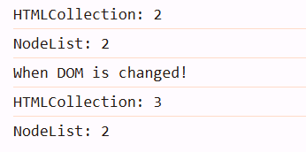

# 目錄

- [第一章 Document Object Model DOM 簡介](#第一章-Document-Object-Model-DOM-簡介)
- [第二章 Document Object](#第二章-Document-Object)

# 第一章 Document Object Model DOM 簡介

> 文件物件模型(Document Object Model DOM) 是 HTML 的程式介面。它提供了一個文件(樹)的結構化表示法，並定義讓程式可以存取並改變文件架構、風格和內容的方法。

> DOM 提供了文件已擁有屬性和函式的節點與物件組成的結構化表示。節點也可以附加事件處理程序，一旦觸發事件就會執行處理程序。本質上，它將網頁與腳本或程式語言連結在一起。

> 簡單來說，**DOM 允許我們在 JavaScript 當中操作 HTML 元素**。(如果 JS 無法存取 DOM，那麼它與其他城市語言相比沒有甚麼區別)

## Window Object

- 在 JavaScript 當中的 window object 代表目前程式碼正在運行的電腦視窗(通常就是指我們瀏覽器的視窗)。Window Object 可使用的常見 methods 包含:
  **window 可以不寫，直接寫後面的 function 即可**

  - window.alert(): 在視窗顯示對話框

    ```js
    window.alert("Hello World!");
    ```

    ```js
    alert("Hello World!");
    ```

  - window.addEventLister(): 將事件監聽程式碼附加到 Window Object
  - window.setInterval(): 每次經過給定的毫秒數時，安排一個函數執行

    ```js
    function sayHelloToUser() {
      alert("Three seconds have already passed!");
    }
    window.setInterval(sayHelloToUser, 3000);
    ```

  - window.clearInterval(): 將 setInterval()所重複執行的程式暫停

    - 執行一次後就不會執行

    ```js
    function sayHelloToUser() {
      alert("Three seconds have already passed!");
      window.clearInterval(interval);
    }
    window.setInterval(sayHelloToUser, 3000);
    ```

  - window.prompt(): return 用戶在提示對話框中輸入的文字

- 物件導向程式概念: 一個 Objet 可以是另一個 Object 的 attribute。例如:人的配偶也是一個人。

```js
let Grace = {
  name: "Grace",
  age: 26,
};

let Wilson = {
  name: "Wilson",
  age: 26,
  spouse: Grace,
};
console.log(Wilson.spouse.Grace);
```

- Window Object 可使用的常見 properties 包含:

  - window.console: return 一個 console object。console object 可以對瀏覽器的 debuggung console 進行控制與訪問。常用的 methods 為 log(),error()。

  ```js
  console.log("Hello World!");
  console.error("This is a error!");
  ```

  - window.document: return window 包含的文檔，也就是 HTML 文件。

  ```js
  console.log(window.document);
  ```

  - window.localStorage: return 一個 local storage 物件
  - window.sessionStorage: return 一個 session storage 物件

- 總結:

  - 所謂的 Document Object Model，顧名思義，可知 HTML 也被視為是個物件。這種架構被稱之為模型(Model)。我們知道:

    1. document 是一個 object，是 window object 的一個屬性
    2. document 是指 HTML document
    3. 這個模型意味著所有 document 內部的 HTML 元素都是 object。**每個 HTML 標籤都有其屬性和方法**。

    

# 第二章 Document Object

- 在 Document Object Model 這棵樹上的每個點被稱之為節點(node)。節點分為三種:

  1. HTML 元素節點(稱為 element nodes or element objects)
     - chidren : 回傳 HTMLCollection
     - chidNodes: 回傳 NodeList
  2. 文字節點(text node)
     - chidren : 回傳 HTMLCollection
     - chidNodes: undefined
  3. 註解節點(comment node)
     - chidren : 回傳 HTMLCollection
     - chidNodes: undefined

- DOM 提供 2 種節點集合: HTMLCollection 以及 NodeList

  - HTMLCollection:只包含 element nodes，上圖只有黃色的部分會被選到
    - 屬於動態的(dynamic)
    - [更多相關資訊](https://developer.mozilla.org/en-US/docs/Web/API/HTMLCollection)
  - NodeList: 包含全部三種
    - 屬於靜態的(static)
    - [更多相關資訊](https://developer.mozilla.org/en-US/docs/Web/API/NodeList)
  - 以上兩個東西都不是 Array，而是 array-like object(類似 array 的 object)，可以用 index 拿取到東西，也可以用 length 屬性，但無法使用 pop()等的 method

- Document Object 常用的 methods 有:

  - window.document.addEventListener()
  - window.document.createElement(tagName)

    ```js
    let myH1 = document.createElement("h1");
    console.log(myH1);
    ```

    

  - window.document.getElementById(id): return 第一個 id 相符合的 element object

    ```html
    <h1 id="myHeadingH1">This is H1</h1>
    ```

    ```js
    let myHeadingH1 = document.getElementById("myHeadingH1");
    console.log(myHeadingH1);
    ```

    

  - window.document.getElementsByClassName(className): return 一個動態的 HTMLCollection，內部元素包含所有具有給定 className 的元素

    ```html
    <p class="my-p">
      Lorem ipsum, dolor sit amet consectetur adipisicing elit. Aliquam,
      delectus.
    </p>
    <p class="my-p">
      Lorem ipsum, dolor sit amet consectetur adipisicing elit. Aliquam,
      delectus.
    </p>
    <p class="my-p">
      Lorem ipsum, dolor sit amet consectetur adipisicing elit. Aliquam,
      delectus.
    </p>
    <p class="my-p">
      Lorem ipsum, dolor sit amet consectetur adipisicing elit. Aliquam,
      delectus.
    </p>
    ```

    ```js
    let myParagraphs = document.getElementsByClassName("my-p");
    console.log(myParagraphs);
    ```

    

  - querySelector(selectors): return 第一個符合特定選擇器群組的 element object。採用深度優先搜尋演算法

    ```html
    <p class="my-p">
      Lorem ipsum, dolor sit amet consectetur adipisicing elit. Aliquam,
      delectus.
    </p>
    <p class="my-p">
      Lorem ipsum, dolor sit amet consectetur adipisicing elit. Aliquam,
      delectus.
    </p>
    <p class="my-p">
      Lorem ipsum, dolor sit amet consectetur adipisicing elit. Aliquam,
      delectus.
    </p>
    <p class="my-p">
      Lorem ipsum, dolor sit amet consectetur adipisicing elit. Aliquam,
      delectus.
    </p>
    <a class="my-p" href="">this is an a tag</a>
    ```

    ```js
    let first_found = document.querySelector(".my-p");
    console.log(first_found);
    ```

    

    - 可用 css 語法來選擇元素

      ```js
      let first_found = document.querySelector("a.my-p");
      console.log(first_found);
      ```

      

  - querySelectorAll(selectors): return 一個靜態(not live) NodeList，表示與指定選擇器匹配的元素列表

    ```html
    <p class="my-p">
      Lorem ipsum, dolor sit amet consectetur adipisicing elit. Aliquam,
      delectus.
    </p>
    <p class="my-p">
      Lorem ipsum, dolor sit amet consectetur adipisicing elit. Aliquam,
      delectus.
    </p>
    <p class="my-p">
      Lorem ipsum, dolor sit amet consectetur adipisicing elit. Aliquam,
      delectus.
    </p>
    <p class="my-p">
      Lorem ipsum, dolor sit amet consectetur adipisicing elit. Aliquam,
      delectus.
    </p>
    <a class="my-p" href="">this is an a tag</a>
    ```

    ```js
    let found_elements = document.querySelectorAll(".my-p");
    console.log(found_elements);
    ```

    

    - 可用 css 語法來選擇元素

      ```js
      let found_elements = document.querySelectorAll("a.my-p");
      console.log(found_elements);
      ```

      

# HTMLCollection vs. NodeList

1. HTMLCollection(動態) vs. NodeList(靜態，使用 querySelectorAll)

   ```html
   <p class="my-p">
     Lorem ipsum, dolor sit amet consectetur adipisicing elit. Aliquam,
     delectus.
   </p>
   <p class="my-p">
     Lorem ipsum, dolor sit amet consectetur adipisicing elit. Aliquam,
     delectus.
   </p>
   ```

   ```js
   let myPs = document.getElementsByClassName("my-p");
   let myPss = document.querySelectorAll(".my-p");
   console.log("HTMLCollection: " + myPs.length); //2
   console.log("NodeList: " + myPss.length); //2

   let body = document.querySelector("body");
   let p = document.createElement("p");
   p.innerText = "This is a new p";
   p.classList.add("my-p");
   body.appendChild(p);
   console.log("When DOM is changed!");
   console.log("HTMLCollection: " + myPs.length); //3
   console.log("NodeList: " + myPss.length); //2
   ```



2. 節點(Node)比較

   ```html
   <body>
     <!--This is twwo p tag-->
     <p class="my-p">
       Lorem ipsum, dolor sit amet consectetur adipisicing elit. Aliquam,
       delectus.
     </p>
     <p class="my-p">
       Lorem ipsum, dolor sit amet consectetur adipisicing elit. Aliquam,
       delectus.
     </p>
   </body>
   ```

   ```js
   let body = document.querySelector("body");
   console.log(body.childNodes); //NodeList
   console.log(body.children); //Element Object
   ```

   

   > 從上圖可知: Element Objects 這種 node 可以同時使用 childNodes 以及 children 屬性。但其他兩種 Node 卻只有能夠使用 childrenNodes 屬性。若其他兩種 node 使用 children 屬性，只會看到 undefined。

**表格比較**

| Methods                           | Return Type                                                                                                          |
| --------------------------------- | -------------------------------------------------------------------------------------------------------------------- |
| getElementById(id)                | Element object (single element, returns `null` if not found)                                                         |
| getElementsByClassName(className) | HTMLCollection (contains only Element objects, dynamic, updates automatically when the DOM changes)                  |
| querySelector(selector)           | Element object (first matching element, returns `null` if not found)                                                 |
| querySelectorAll(selector)        | Static NodeList (can contain Element, Text, and Comment nodes, does not auto-update, but can be used with `forEach`) |

| 方法                              | 回傳類型                                                                                        |
| --------------------------------- | ----------------------------------------------------------------------------------------------- |
| getElementById(id)                | Element 物件（單一元素，如果找不到則回傳 `null`）                                               |
| getElementsByClassName(className) | HTMLCollection（內部只包含 Element 物件，動態更新，當 DOM 改變時，內容會自動更新）              |
| querySelector(selector)           | Element 物件（符合條件的第一個元素，如果找不到則回傳 `null`）                                   |
| querySelectorAll(selector)        | 靜態 NodeList（內部可包含 Element、Text、Comment 節點，不會自動更新，但可以直接使用 `forEach`） |

|            | NodeList                                                     | HTMLCollection                                              |
| ---------- | ------------------------------------------------------------ | ----------------------------------------------------------- |
| Feature    | Array-like,but not array. No push,pop,shift,unshift methods. | Array-like,but not array.No push,pop,shift,unshift methods. |
| Motion     | static                                                       | dynamic                                                     |
| Elements   | Nodes                                                        | Element Object                                              |
| Attributes | length,index                                                 | length,index                                                |
| forEach    | Allowed                                                      | Not allowed                                                 |

|           | NodeList                                                          | HTMLCollection                                                    |
| --------- | ----------------------------------------------------------------- | ----------------------------------------------------------------- |
| 特性      | 類陣列，但不是陣列。沒有 `push`、`pop`、`shift`、`unshift` 方法。 | 類陣列，但不是陣列。沒有 `push`、`pop`、`shift`、`unshift` 方法。 |
| 變動性    | 靜態                                                              | 動態                                                              |
| 元素      | Nodes                                                             | Element 件                                                        |
| 屬性      | `length`、`index`                                                 | `length`、`index`                                                 |
| `forEach` | 支援                                                              | 不支援                                                            |
