# 目錄

- [AJAX 簡介](#AJAX-簡介)
- [同步與異步](#同步與異步)
- [Promise 物件](#Promise-物件)
- [json 與 fetch 補充](#json-與-fetch-補充)
- [Catching Errors](#Catching-Errors)
- [Combining Multiple Promise](#Combining-Multiple-Promise)
- [Async and Await](#Async-and-Await)
- [Nodejs Event Loop](#Nodejs-Event-Loop)
- [Race Condition](#Race-Condition)
- [Mutex 製作原因](#Mutex-製作原因)
- [Promise Based API](#Promise-Based-API)
- [連接到外部 API](#連接到外部-API)


# AJAX 簡介

Asynchronous JavaScript

- Ajax: 即「Asynchronous JavaScript and XML」(非同步的JavaScript與XML技術)，指的是一套綜合了多項技術的瀏覽器端網頁開發技術。

- AJAX在客戶端使用各種Web技術來創建異步(asynchronous) Web應用程序。應用程序可以在背景從服務器發送和獲得數據，而不干擾現有頁面的顯示和行為。通過將數據交換層與表示層分離，Ajax允許網頁以及擴展的Web應用程序動態地更改內容，而無須重新加仔整個頁面。在實踐中，數據的傳送通常使用JSON而不是XML。

- 常見的Ajax應用的例子是，我們在Youtube或是Google搜尋時，網站會根據我們前面打的幾個字，猜想我們要搜尋的關鍵字是什麼。這就是不干擾現有頁面的顯示和行為的情況下，從服務器發送和獲得數據，並且更新網頁的方法。

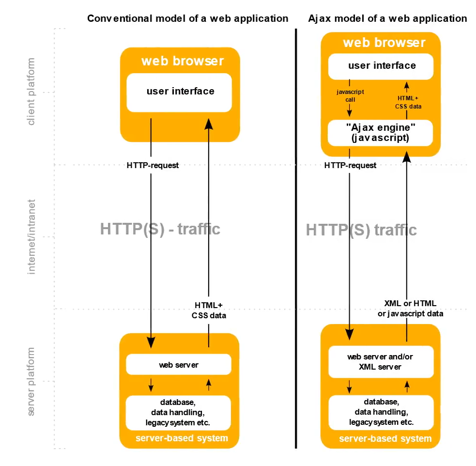

# 同步與異步

- 在電腦裡，異步(asynchronous)代表著一個process獨立於其他process運行，而同步(synchronous)代表著一個process僅在某個其他process完成或移交而運行

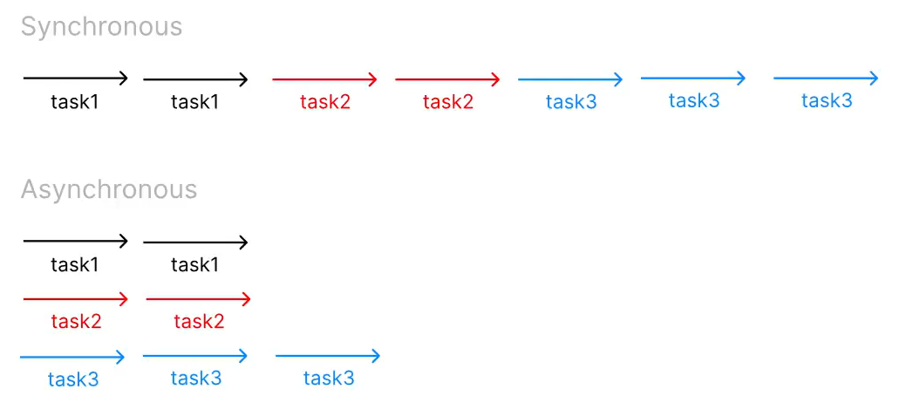

- 通常來說，JavaScript的特性是single-threaded synchronous，代表JavaScript是個一次只會做一件事情的程式語言。然而，JS有內建的asynchronous function，例如setTimeout()。setTimeout() function設置一個計時器，一旦計時器時間到，該計時器就會執行一個函數或指定的一段代碼。setTimeout()的語法為:

```js
setTimeout(code, delay);
```

- Code 是 delay結束時要執行的程式碼，delay是在執行指定的函數或代碼之前計時器應等待的時間(以毫秒為單位)。如果省略此參數，則使用值0，表示"立即"執行。

```js
console.log('start');
setTimeout(()=>{                                  
  console.log('Here is the code.');
},2000)
console.log('end');
```

> 上面這段程式碼執行的結果是:

1. start
2. end
3. Here is the code.

# Promise 物件

- Promise是現代JavaScript中異步編程的基礎。Promise是由一個asynchronous function所return的物件,主要功能是, Promise會代理一個建立時不用預先得知結果的值。

- Promise使我們能夠接續著發動非同步操作後,最終的成功值(success value)獲失敗訊息(failure reason)的處理函式(handlers)。我們向伺服器傳送request之後,因為需要等待response的時間,所以我們會先的到一個Promise,而這個Promise目前的狀態是「擱置」(pending)

- 一個Promise物件處於以下三種狀態:
1. 擱置(pending): 初始狀態，並不是fulfilled與rejected。
2. 實現(fulfilled): 表示操作成功地完成
3. 拒絕(rejected): 表示操作失敗

Promise在pending後的幾秒之內,狀態可能變成fulfilled或是rejected。一個處於擱置(pending)狀態的Promise，若操作成功，能夠將狀態變成fulfilled，或是因為某些原因或錯誤，變成拒絕(rejected)狀態。當上述任一狀態轉換發生時，那些透過then方法所連結的callback就會被調用。

> promise物件裡面有兩個method，一個是then()，另一個是catch()，裡面需放callback function用於接住fulfilled的結果或rejected結果，在pending時是不會啟動的

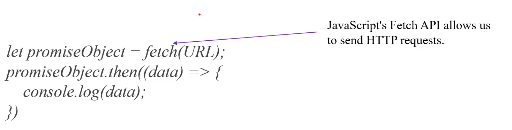

```js
let promiseObject = fetch(URL);
promiseObject.then((data)=>{
  console.log(data);
})
```
>Javascript Fetch API allows us to send HTTP resquests.
> 這段程式碼中，當promiseObject從pending變成fulfilled之後,`.then()`內部的callback function就會被javascript自動執行,執行時,帶入的參數就是從URL獲得的HTTP Response內容

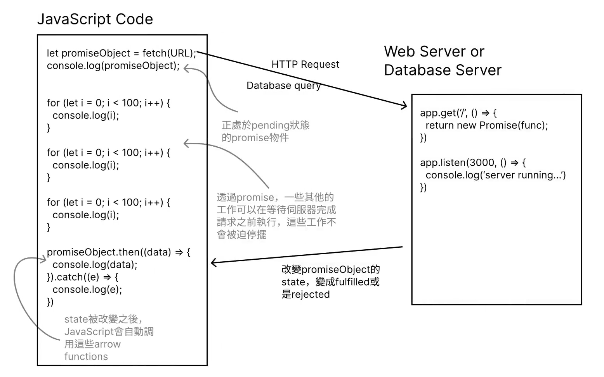
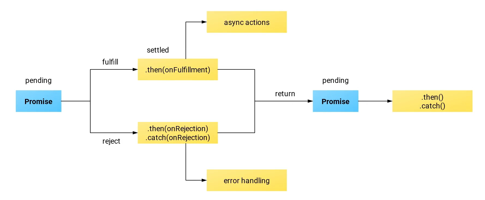

> onFulfillment, onRejection are all callback functions. 另外reject後面通常是使用.catch()來接onRejection

❌
```js
let promiseObject = fetch(URL);
fetchpromise.then((response)=>{
  let jsonPromise = response.json(); // response=>json
  //.json() method is also 
  //return promise object
  console.log(jsonPromise) //pending
})
```

✅
```js
let promiseObject = fetch(URL);
fetchpromise.then((response)=>{
  response.json().then(data=>{
    console.log(data);
  })
})
```

> 很容易發生callback hell所以要改一下寫法


✅
```js
let promiseObject = fetch(URL);
fetchpromise.then((response)=>return response.json())
.then(data=>{
    console.log(data);
})
```

# json 與 fetch 補充

根據 MDN，在 JavaScript 內建的 fetch() 函式的定義是「starts the process of fetching a resource from the network, returning a promise which is fulfilled once the response is available. The promise resolves to the Response object representing the response to your request.」


這段的中文意思是指，fetch() 本身的功能是寄送 HTTP request。其中，fetch 會 return 一個 promise 物件。這個 promise 物件在 HTTP response 被接收到時會從 pending 轉變成 fulfilled。另外，如果對 fetch() 所 return 的 promise 物件做 .then(callback) 時，JavaScript 自動帶入 callback 的參數會是一個「Response Object」。

（這個 Response Object 是 JavaScript 內建的一種物件，用來代表 HTTP response。）

其中需要特別注意的是，截圖中的第三段有提到規則「A fetch() promise only rejects when a network error is encountered (which is usually when there's a permissions issue or similar). A fetch() promise does not reject on HTTP errors (404, etc.). Instead, a then() handler must check the Response.ok and/or Response.status properties.」

 

這段的中文意思是指，如果遇到 HTTP status code 是 404 的情況，fetch() 的 promise 並不會出現 rejected 狀態，而是會變成 fulfilled 狀態。但我們可以用使用 Response Object 的 status 或 ok 等屬性來確定我們得到的 HTTP response 的狀態是 200 OK 還是 404 Not Found。

 

 

那麼，在什麼樣的情況下，fetch() Promise 才會變成 rejected 呢？其實在 MDN 這頁有說明：「The promise will only reject on network failure or if anything prevented the request from completing.」

 

這段的中文意思是指「只有當網路故障或有任何原因阻止請求完成時，該 Promise 才會變成 rejected。」在後面課程 Combining Multiple Promises 的影片中，我們就可以看到實際一個例子。當我們的網址是完全亂打時，因為沒有相對應的伺服器可以回傳 HTTP Response，所以會產生「TypeError: NetworkError when attempting to fetch resource."」由此可知這裡發生了網路錯誤，導致 Promise 就變成 rejected 狀態了。

 

最後，我補充一下 .json() method 的功能。.json()是 JavaScript Response Object 可用的 instance method。根據 MDN 的描述，.json() method 的功能是「The json() method of the Response interface takes a Response stream and reads it to completion. It returns a promise which resolves with the result of parsing the body text as JSON. Note that despite the method being named json(), the result is not JSON but is instead the result of taking JSON as input and parsing it to produce a JavaScript object.」

翻譯成中文就是：「.json() 讀取 Response Object 直到完成。此 method 會 return 一個 promise 物件，而該 promise 物件會帶有將 body text 解析為 JSON 的結果。儘管此 method 的名稱為 json()，但此 promise 物件帶有的結果是 JavaScript Object。」所以，我們使用 .json() 就可以將 fetch(URL) 所回傳的 Response Object 內部的文本資料取出。

例如，以「上一隻影片」的例子來說，我們執行 fetch("https://mdn.github.io/learning-area/javascript/apis/fetching-data/can-store/products.json") 時會發送一個 HTTP request 出去。收到的 HTTP response 的內容包含 header 以及 message section 兩個部分：

```shell
HTTP/1.1 200 OK
Content-Length: 300
Content-Type: text/json; charset=UTF-8
 
[{name: "bake beans", price: 0.4, image:"beans.jpg"}, {name: "hot dogs", price: 1.99, image:"hotdogs.jpg"}, ...]

```

以上的這個 HTTP response 會被 JavaScript 製作成上面有提到過的「Response Object」：

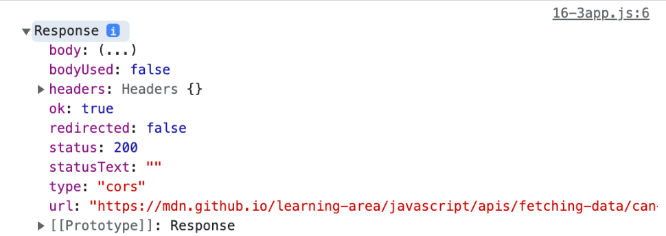

但我們只能看到跟 header 有關的資訊，例如 status code 是 200、okay 是 true 等等，而無法看到 HTTP response 中的 message section 中的數據。因此，我們需要使用 JavaScript 中 Response Object 的 .json() method，將 message section 中的文字透過 .json() 轉換成 JavaScript 物件後才能夠使用。這就是使用 .json() 的目的。

[mdn](https://developer.mozilla.org/en-US/docs/Web/API/Fetch_API)

# Catching Errors

為了支持錯誤處理, Promise 物件提供了一個catch() 方法, 跟then()很像。我們調用.catch()時，傳入一個callback function當作參數。傳遞給catch()的處理函數在異步操作失敗時會自動被JavaScript調用。catch()內部的callback function被調用時，參數會被放入錯誤訊息，通常以變數e或是err代表錯誤(error)。

當串聯多個`.then`語句時，後一個`.then()`內部的callback function被執行時，所用的參數是前一個`.then()`中的callback function索回傳的值

如果將catch()添加到Promise Chain的末尾,那麼當任何異步函數調用失敗時都會調用到它。

```js
let fetchPromise = fetch(url);
fetchPromise
  .then((res)=>res.json())
  .then((data)=>{
    console.log(data);
  })
  .catch((e)=>{
    console.log(e);
  });
```

# Combining Multiple Promise

當我們的操作由多個異步函數組成時,我們需要用到promise chaining,讓我們在開始下一個函數之前完成前一個函數。這種情況下,每個Promise都互相依賴。

有時,我們需要所有Promise都被fulfilled,但它們並不相互依賴。在這種情況下,將它們全部一起啟動,然後在它們全部fulfilled時收到通知會更有效。JavaScript當中,提供了Promise.all()這個static method,它接受一個promise array並返回一個promise。

Promise.all() 返回的promise是:

1. fulfilled: 如果所有在array當中的promisses都變成fulfilled,則Promised.all()所return的promise狀態會變成fulfilled。`.then()`被JavaScript調用時,參數是array of response,順序跟Promise.all()參數的array of promises的順序相同。

2. rejected: 當任一個array當中的promises變成rejected,則Promise.all()所return的promise狀態會變成rejected。此時,`.catch()`被JavaScript調用時,參數會是被rejected的promises的錯誤訊息。

```js
const fetchPromise1 = fetch(url1);
const fetchPromise2 = fetch(url2);
const fetchPromise3 = fetch(url3);
Promise.all([fetchPromise1,fetchPromise2,fetchPromise3]).then(responses=>{
  responses.forEach(response=>{
    console.log(response.url,response.status);
  })
}).catch(e=>{
  console.log(e);
})
```

有時,我們可能需要履行一組Promise中的任何一個,而不關心哪一個,那我們就需要使用Promise.any()。只要Promise array中的任何一個變成fulfilled,就執行.then(),或者如果所有promises都被拒絕,則執行.catch()

# Async and Await

Async關鍵字為我們提供了一種更簡單的方式來處理基於async promise的代碼

```js
async function myFunction(){
  //This is an async function
}
```

在asynchoronous function中，您可以在調用return promise的函數之前使用await關鍵字。這使得代碼在該點等待值到Promise被fulfilled或是rejected。

**await關鍵字只能放在async function內部!!**

**特別注意!!JavaScript設定所有的async function都一定會return一個Promise Object，不論我們在async function內return什麼值!!在async function內部return的任何值，在async function所return的Promise變成fulfilled時，執行`.then()`的callback function內部自動變成參數。**

```js
async function myFunction(){
  return 10;
}
let promise = myFunction();
promise.then(data=>{
  console.log(data);
})
```

> `console.log`的data會是10

特別注意，若程式碼是:

```js
async function fetchSomething(){
  const response = await fetch(URL)
}
```
> 在這裡我們調用了await fetch()，response並不會是一個Promise! 使用了 await關鍵字，我們會獲得URL回應完整的Response Object，就像fetch()是一個同步函數(synchronous)一樣!

> 我們在asynchronous function內部甚至可以使用`try...catch`塊進行錯誤處理，就像代碼是同步的一樣

```js
const function fetchProduct(){
  try{
    const response = await fetch(url);
    console.log(response);
    const data = await response.json();
    console.log(data);
  }catch(e){
    console.log(e)
  }
}
fetchProduct();
```

# Nodejs Event Loop

在Node.js當中,將凡事有任何等待結果的、請求外部資源才能進行的涵式，都會被放到Event Loop中等待。

當運算結果出來了或是資源載入完成後，這些正在等待被執行的涵式，都會被Node.js依序執行。如此一來，Node.js可以保持忙碌且維持高效率。

**Node.js的Event Loop與瀏覽器的Event Loop不盡相同。Event Loop的結果也跟JavaScript引擎的版本有官**

再認識Event Loop之前,先來認識一種資料結構 - Queue。Queue與Stack是兩個相似但源則相反的資料結構。Queue是一種列隊式的結構,採用先進先出(First In First Out, FIFO)為原則。 Stack則是推狀的結構,採用後進先出(Last In First Out, LIFO)為原則。

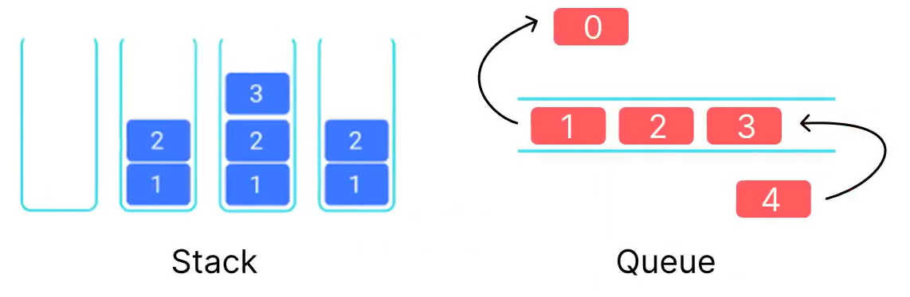

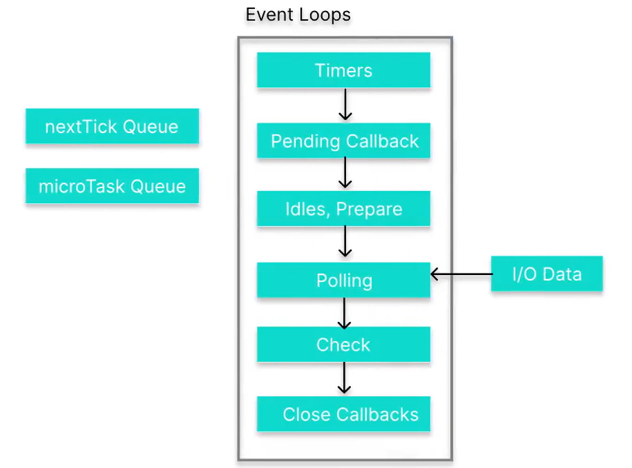

> 在Node.js的Event Loop當中，大致可分成以下幾種Queue:

1. 優先級別: nextTick queue 以及 mircoTask Queue。
2. 普通級別: macrotask queue (或叫做 task queue)。其中,macrotask queue 又有 timers, pending callbacks, Idle, prepare, polling, check, and close callbacks 這六種。

- nextTick Queue: 優先程度最高 queue。給定的process.nextTick(callbackFn)的callbackFn都會背放入這個queue內部。

- mircoTack Queue: 優先程度第二高的queue。當promise object的狀態,由pending轉變成fulfilled或rejected時,`.then`(callbackFn)或`.catch`(callbackFn)所執行的callbackFn都會被排在這個queue。

以下的都是marcoTack queue:

- timers: 當setTimeout(callbackFn)跟setInterval(callbackFn)所設定的時間到屬完畢時,callbackDn會被放來這裡等待執行

- Pending callbacks: 給作業系統做使用的queue,例如socket連線時的錯誤,或是傳輸控制協定層出現錯誤，相關的callback functions會被放到這邊來。

- Idle, prepare: 給Node.js內部座使用的queue，可以略過

- Polling: 當I/O有callback function時使用的queue。例如: `.on('data',callbackFn)`當中callbackFn就會被放入polling。

- Check: 給setImmediate()的callback function使用的queue。

- Close Callbacks: 當socket或是檔案被關閉或是突然中斷連線時，使用的關閉動作callback會被放在這裡。

**Node.js運行程式碼的順序是:**

1. 將整份程式碼先掃描一次。若遇到同步涵式，就馬上執行。

2. 若遇到異步函式，則將callback function分配到各字歸屬的queue內部。例如，setImmediate()的callback function就會被放到Check。

3. 當整份程式碼完成掃描後，Node.js會重複event loop。只要queue還有callbackg尚未被觸發，Node.js就會一直循環下去。例如，setTimeout()有callback function，但需要幾秒後才觸發，那這之間的時間event loop就會不斷循環。當然，這中間的幾秒也有可能有其他的callback function被放入queue。

4. 循環至某個queue時，發現callback可以被執行了，就把queue內部的callback依照先進先出原則處理

5. 如果在循環的過程中，若nextTick Queue有涵式可以執行，則優先將nextTick Queue清空

6. mircotack Queue也是同樣操作，若mircotask Queue當中有涵式可以執行，則優先將mircotask Queue清空。

```js
console.log("start");

process.nextTick(function () {
  console.log("nextTick1");
});

setTimeout(function () {
  console.log("setTimeout");
}, 0);

// call the constructor 是一個sync function
new Promise(function (resolve, reject) {
  console.log("promise");
  resolve("resolve");
}).then(function (result) {
  console.log("promise then");
});

//IIFE
(async function () {
  console.log("async");
})();

setImmediate(function () {
  console.log("setImmediate");
});

process.nextTick(function () {
  console.log("nextTick2");
});

console.log("end");
```

1. start
2. promise
3. async
4. end
5. nextTick1
6. nextTick2
7. promise then
8. setTimeout
9. setImmediate

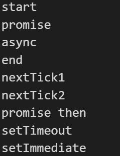

# Race Condition

在電腦科學中，進程(process)是正在執行的程式，執行緒(thread)是可以由程序調度員(scheduler，一個作業系統內的功能)獨自管理的輕量級進程。一個process內部可以有多個threads。

由於絕大多數的時間，我們電腦許多CPU都是閒置的狀態(因為threads可能會需要等待I/O，或者是可能發生CPU正在忙碌，其他的CPU卻閒得發慌的情況)，因此，我們可以寫出內部含有多個threads的程式，讓threads被多個CPU並聯執行，善用CPU資源，提高效率。這就是許多程式語言都支援的multi-threaded programming。

> 可以查看電腦的工作管理員，就知道現在有多少程式或軟體在同時進行

當兩個以上的thread訪問的一個共享資源(shared resource)時，就會發生race condition。Race condition 發生時，有可能造成難以預期的狀況或bug。

> 例如:演唱會門票購買，餐廳線上訂位等等，都可能造成race condition的發生

要避免Race Condition的發生，我們可以透過劃分critical region。程式當中，訪問shared resource的部分，被稱為Critical Region。每當我們要進去Critical Region之前，我們可以先把共享資源上鎖。上鎖期間，任何其他的thread都無法訪問這個共享資源。離開Critical Region之後，再去做解鎖。

**Lock也稱為mutex(mutual exclusion lock)。在進入Critical Region之前,mutex會檢查我們是否可以進入。Mutex另一個名字是binary semaphore。**

在Node.js當中，製作mutex的方式很簡單。

```js
let mutex =Promise.resolve();
async function doing SomethingCritical(){
  mutex = mutex.then(()=>{
    // ... do stuff on the critical path
  }).catch(()=>{
    // ...manage errors on the critical path
  })
  return mutex;
}
```

> 這個想法是每次我們調用doingSomethingCritical()函數時，我們都在使用mutex.then()有效地「排隊」執行critical region的代碼。mutex = Promise.resolve()會回傳給我們一個fulfilled promise(這是Promise class的一個static method。)這是屬於同步動作，在Node.js會直接執行。

> 每次的mutex = mutex.then()會return一個pending promise。當Promise.all()執行多次時，每次mutex.then()內部的callback function能否被執行，都取決於前次的promise是否已經進入fulfilled。只有當前一個promise進入fulfilled時，程式才會繼續執行，所以可以避免發生race condition。


```js
let balance = 0; // shared resource
let mutex = Promise.resolve(); // return fulfilled Promise object

const randomDelay = () => {
  // return value is a Promise
  // and the time for this promise changing from pending to fulfilled
  // is random (0s-0.1s)
  return new Promise((resolve) => setTimeout(resolve, Math.random() * 100));
};

async function loadBalance() {
  await randomDelay(); // 等個隨機的0s~0.1s
  return balance;
}

async function saveBalance(value) {
  await randomDelay();
  balance = value;
}

async function sellGrapes() {
  mutex = mutex
    .then(async () => {
      const balance = await loadBalance();
      console.log(`賣葡萄前，帳戶金額為: ${balance}`);
      const newBalance = balance + 50;
      await saveBalance(newBalance);
      console.log(`賣葡萄後，帳戶金額為: ${newBalance}`);
    })
    .catch((e) => {
      console.log(e);
    });
  return mutex;
}

async function sellOlives() {
  mutex = mutex
    .then(async () => {
      const balance = await loadBalance();
      console.log(`賣橄欖前，帳戶金額為: ${balance}`);
      const newBalance = balance + 50;
      await saveBalance(newBalance);
      console.log(`賣橄欖後，帳戶金額為: ${newBalance}`);
    })
    .catch((e) => {
      console.log(e);
    });
  return mutex;
}

async function main() {
  await Promise.all([
    sellGrapes(),
    sellOlives(),
    sellOlives(),
    sellOlives(),
    sellGrapes(),
    sellGrapes(),
    sellGrapes(),
  ]);
  const balance = await loadBalance();
  console.log(`賣葡萄與橄欖後的帳戶金額是$${balance}`);
}

main();

```

> 每次的mutex = mutex.then()會return一個pending promise。當Promise.all()執行多次sellOlives與sellGrapes時，每次mutex.then()內部的callback function能否被執行，都取決於前次的promise是否已經進入fulfilled。只有當前一個promise進入fulfilled時，程式才會繼續執行，所以可以避免發生race condition。


# Mutex 製作原因

> 另一種寫法

```js
let balance = 0; // shared resource
let mutex = Promise.resolve(); // return fulfilled Promise object

const randomDelay = () => {
  // return value is a Promise
  // and the time for this promise changing from pending to fulfilled
  // is random (0s-0.1s)
  return new Promise((resolve) => setTimeout(resolve, Math.random() * 100));
};

async function loadBalance() {
  await randomDelay(); // 等個隨機的0s~0.1s
  return balance;
}

async function saveBalance(value) {
  await randomDelay();
  balance = value;
}

async function sellGrapes() {
  const balance = await loadBalance();
  console.log(`賣葡萄前，帳戶金額為: ${balance}`);
  const newBalance = balance + 50;
  await saveBalance(newBalance);
  console.log(`賣葡萄後，帳戶金額為: ${newBalance}`);
}

async function sellOlives() {
  const balance = await loadBalance();
  console.log(`賣橄欖前，帳戶金額為: ${balance}`);
  const newBalance = balance + 50;
  await saveBalance(newBalance);
  console.log(`賣橄欖後，帳戶金額為: ${newBalance}`);
}

async function main() {
  await  sellGrapes()
  await  sellOlives()
  await  sellOlives()
  await  sellOlives()
  await  sellGrapes()
  await  sellGrapes()
  await  sellGrapes()

  console.log("we will be doing some work here...");
}

main();
```

🔍 問題說明
你有兩個關鍵的 async 函數 sellGrapes() 和 sellOlives()，它們都會：

讀取 balance（透過 loadBalance()，這會有隨機延遲）

將讀取到的 balance 加上 50

寫回 balance（透過 saveBalance()，也有隨機延遲）

看起來這是共享資源的讀-改-寫操作，這本質上是一個critical section（臨界區段），但你現在的程式中：

👉 這些操作是沒有鎖的！

雖然你用了 await 把它們串起來，但這只保證順序性，不保證原子性。

🧠 為什麼會有問題？
因為 randomDelay() 會讓讀跟寫時間不固定，可能導致 race condition（競爭條件）：

假設：

sellGrapes() 讀到 balance = 0

sellOlives() 也讀到 balance = 0（還沒來得及更新）

sellGrapes() 寫入 balance = 50

sellOlives() 寫入 balance = 50（把剛剛的結果覆蓋掉了）

最後結果應該是 100，但實際會是 50！

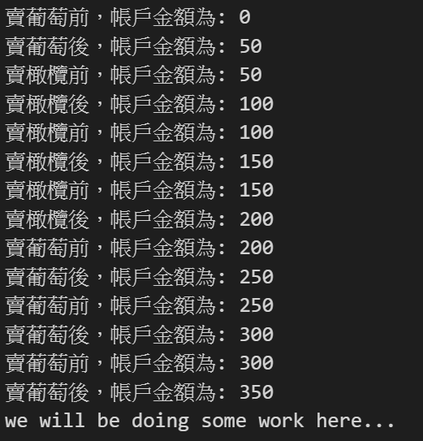

```js
async function main() {
  sellGrapes()
  sellOlives()
  sellOlives()
  sellOlives()
  sellGrapes()
  sellGrapes()
  sellGrapes()
  console.log("we will be doing some work here...");  
}
```
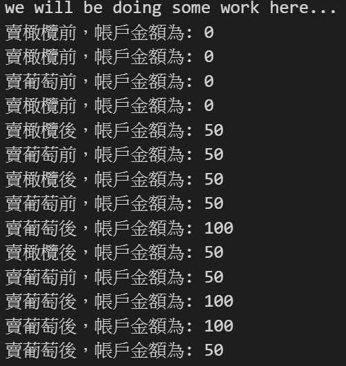

不解await的好處:

1. 可以不用等await function跑完就可以執行下面程式碼，但會產生race condition的問題
2. 順序如果沒有差別，那其實可以不用await確定先後關係

什麼時候要用await?

1. 當你要還傳值，值需要被下一段程式碼使用(順序有關聯)，就需要用await

**那什麼時候要用mutex?**

function裡面的值被共用，但每個function的先後順序沒有關係，這時就會使用mutex

# Promise Based API

API(Application Programming Interface)的中文是應用程式介面。
Application是指任何具有功能的程式，Interface(接口)可以背認為是兩個程式之間的服務契約。該合約定義了兩個程式之間如何互相通信。例如:當程式甲需要程式乙幫他做某件事情，或是取得某些資料的時候，程式乙會定義一套的標準或接口，告訴任何想要程式乙提供服務的對象，如何跟程式乙溝通。這套標準就是API。

這時程式甲並不需要知道程式乙做了什麼，怎麼做的。程式甲只需要知道三件事情:

1. API上面要求要提供什麼資料,才能向程式乙溝通?
2. 成功的話，程式乙會回覆給我什麼?
3. 失敗的話，程式乙會回覆給我什麼?

API上面會把這些情況寫得明明白白。至於哪些機構或機關有提供API,讓大家獲取服務呢？如Facebook、Google，或是政府機關網站（像是故宮博物院）都會有對應的API規則文件可以參考

透過API，我們可以連結到其他程式所提供的服務，大多數的API都需要先申請註冊，申請API Key才能使用，甚至有些向google的api超過一定的次數還需要付錢。所以使用之前，還是需要先查詢官方網站查看；資料回傳結構，也需查看此官網的api網站

若我們想要製作一個API，而API中的function會return promise object，使的調用這些function時，可以使用`.then()`,`.catch()`等語法，那我們就必須使用Promise class的constructor。Promise cinstructor接受一個函數作為參數。我們將這個函數稱為executor。

executor函數本身有兩個參數，它們都是函數，通常稱為resolve和reject。如果異步函數成功，則調用resolve，如果失敗，則調用reject。Resolve以及Reject這兩個函數的argument只有一個，並且可以是任何的data type。

```html
<input type="text" id="name"/>
<input type="number" id="delay"/>
<button id="set-alarm">設定鬧鐘</button>
<div id="output"></div>

<script src="./app.js"></script>
```

> app.js

- 一般寫法

```js
const name = document.querySelector("#name");
const delay = document.querySelector("#delay");
const button = document.querySelector("#set-alarm");
const output = document.querySelector("#output");

function alarm(person,delay){
    setTimeout(() => {
    output.innerHTML = person + " wakes up!!";
  }, delay);
}

button.addEventListener("click",(e)=>{
  alarm(name.value,delay.value);
  // console.log("Click Button");
})
```

- Promise寫法

```js
const name = document.querySelector("#name");
const delay = document.querySelector("#delay");
const button = document.querySelector("#set-alarm");
const output = document.querySelector("#output");

//return Promise object
//delay of pending => fulfilled
//if delay < 0 => rejected
function alarm(person,delay){
  return new Promise((resolve,reject)=>{
     if(delay<0){
      reject("delay is not able to less 0.");
     }else{
      setTimeout(() => {
        resolve( person + " wakes up!!");
      }, delay);
     }
  })
}

button.addEventListener("click",()=>{
  let promiseObject = alarm(name.value,delay.value);
  promiseObject.then((message)=>{
    output.innerHTML = message;
  }).catch(e=>{
    output.innerHTML = e;
  })
})
```

> 從寫成async方式
```js
button.addEventListener("click",async()=>{
  try{
      let result = await alarm(name.value,delay.value);
      output.innerHTML = result;
  }catch(e){
      output.innerHTML = e;
  }
})
```

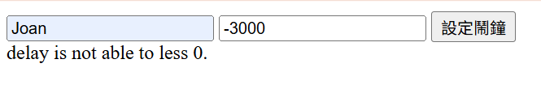

# 連接到外部 API

[joke API](https://sv443.net/jokeapi/v2/)

```html
<button id="new-joke">Create Joke</button>
<div id="output"></div>
```

```js
let output = document.querySelector("#output");
async function hello(){
  try{
    let result = await fetch('https://v2.jokeapi.dev/joke/Programming?type=single');
    let data = await result.json();
    console.log(data);
    output.innerText += data.joke+ "\n";
  } catch(e){
    console.log(e)
  }
}

let button = document.querySelector("#new-joke");
button.addEventListener("click",()=>{
  hello();
})
```

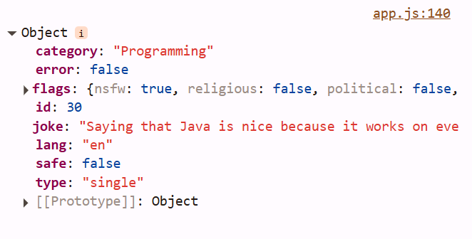
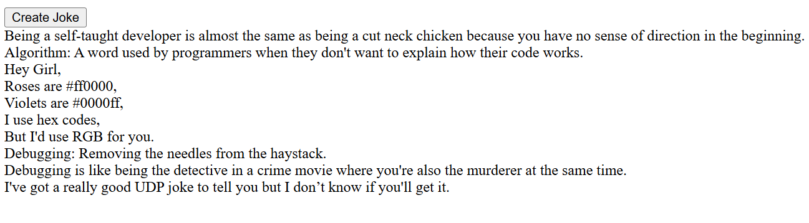
