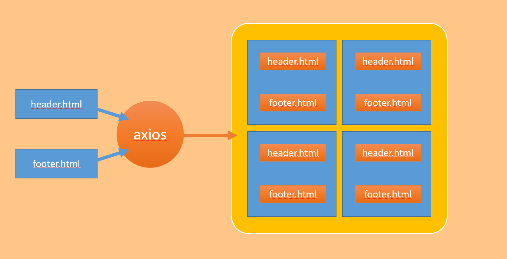
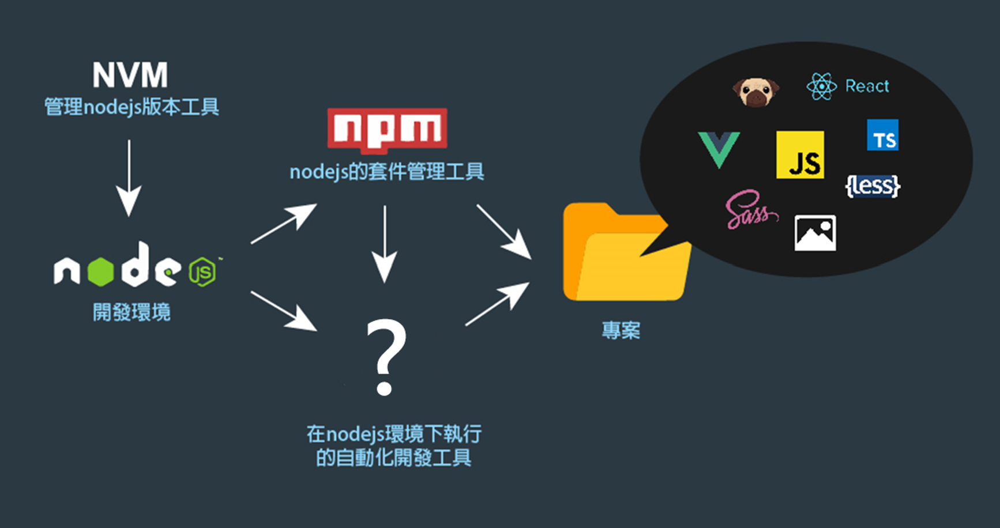

# 目錄
- [第一章 陣列與物件](#第一章-陣列與物件)
    - [什麼是物件?](#什麼是物件)
    - [物件常用的使用方式](#物件常用的使用方式)
    - [資料格式](#資料格式)
        - [陣列包物件](#陣列包物件)
        - [物件包陣列](#物件包陣列)
        - [統整](#統整)
    - [涵式回傳](#涵式回傳)
    - [分開資料和DOM元素](#分開資料和DOM元素)
    - [陣列進階操作](#陣列進階操作)
        - [forEach](#forEach)
        - [filter](#filter)
        - [every](#every)
        - [map](#map)
        - [方法總結](#方法總結)
- [第二章 進階字串處理](#第二章-進階字串處理)
    - [trim 字串前後去除空白](#trim-字串前後去除空白)
    - [slice 字串切割](#slice-字串切割)
    - [變換英文字母大小寫](#變換英文字母大小寫)
    - [reverse 字串反轉](#reverse-字串反轉)
    - [replace 字串取代](#replace-字串取代)
    - [indexOf 取得字串索引位置](#indexOf-取得字串索引位置)
- [第三章 非同步處理](#第三章-非同步處理)
   - [什麼是api](#什麼是api)
   - [什麼是非同步](#什麼是非同步)
   - [什麼是JSON](#什麼是JSON)
   - [什麼是get? 什麼是post?](#什麼是get-什麼是post)
   - [非同步工具  axios](#非同步工具-axios)
   - [JSON 與 FormData](#JSON-與-FormData)
   - [常見的HTTP狀態碼](#常見的HTTP狀態碼)
   - [跨網域存取CORS](#跨網域存取CORS)
- [第四章 共用組件](#第四章-共用組件)
   - [非同步載入共用組件](#非同步載入共用組件)
   - [程式流程控管](#程式流程控管)
- [第五章 網址兩三事篇](#第五章-網址兩三事篇)
   - [網頁轉址與重整](#網頁轉址與重整)
   - [開新視窗](#開新視窗)
   - [網址GET參數](#網址GET參數)
   - [轉址帶參數注意事項](#轉址帶參數注意事項)
- [第六章 正規表達式入門](#第六章-正規表達式入門)
  - [什麼是正規表達式 (Regular Expression)](#什麼是正規表達式-regular-expression)
  - [匹配](#匹配)
  - [模糊匹配](#模糊匹配)
  - [檢查是否輸入大寫英文](#檢查是否輸入大寫英文)
  - [範例](#範例)
  - [方括號與大括號](#方括號與大括號)
- [第七章 ES6升級指南篇](#第七章-ES6升級指南篇)
  - [let與const](#let與const)
  - [解構賦值](#解構賦值)
  - [展開運算子Array](#展開運算子Array)
  - [展開運算子Object](#展開運算子Object)
  - [字串模板](#字串模板)
  - [箭頭涵式](#箭頭涵式)
  - [function預設值](#function預設值)
- [第八章 Javascript 模組入門篇](#第八章-Javascript-模組入門篇)
- [第九章 Javascript 矯正篇](#第十章-Javascript-矯正篇)


---

# 第一章 陣列與物件

### 什麼是物件?

以人來比喻:

```js
ver human = {
    name:"Joan",
    age:12,
    sex:"female"
}
console.log(human);
```

**物件和陣列的差別:在於一個有key一個沒有key**

> object有key，array沒有key，所以array只能用索引(index)來取值

```js
ver obj = {
    name:"Joan",
    age:12,
    sex:"female"
}

var arr = ['Joan',12,'female']

//兩個取得是同樣的東西
console.log(obj.name);
console.log(arr[0]);
```

> 因為array是用索引取值，因此裡面的位置很重要，一旦位置改變取出來的值就不同，但object並沒有這個問題


> 網頁中任何一個元素都是物件，哪怕是一個 p標籤都是物件

```html
<html>
<body>
    <a id="alink" href="javascript:;" target="_blank">點我超連結</a>
    <script>
        var attr = document.getElementById('alink');
        alink.href = "https://github.com/renew-key/Instructions/blob/main/%E5%89%8D%E7%AB%AF/JavaScript/intermediate.md";
        console.log(link.href);
    </script>
</body>
</html>
```

### 物件常用的使用方式

```js
var obj={
    name:"joan",
    age:12
}
console.log(obj.name);
console.log(obj.age);
obj.sex="female";
console.log(obj.sex);

console.log(obj['name']); //如果直接放key在中括號裡可以取得內容
obj['sex'] = "boy";

```

**用 `[]` 取得和 `.` 取得有神麼不同?**

1. 如果用`[]`，可以用變數的方式替換key值

```js
var obj={
    name:"joan",
    age:12
}
var text = "name";
console.log(obj[text]);

```

### 資料格式

#### 陣列包物件

| firstName | Seniority | position | salary |
|-------|-------|-------|-------|
| Mike | 3 | 前端工程師 | 22000 |
| Jacky | 4 | 網頁設計師 | 76000 |
| Andy | 6 | 全端工程師 | 80000 |
| Scars | 10 | 前端技術總監 | 85000 |
| Alice | 5 | 互動設計師 | 78000 |

```js
var data=[
    {
        firstName:"Mike",
        Seniority:3 ,
        position: "前端工程師",
        salary: 22000
    },
    {
        firstName:"Jacky",
        Seniority:4 ,
        position: "網頁設計師",
        salary: 76000
    },
    {
        firstName:"Andy",
        Seniority:6 ,
        position: "全端工程師",
        salary: 80000
    },
    {
        firstName:"Scars",
        Seniority:10 ,
        position: "前端技術總監",
        salary: 85000
    },
    {
        firstName:"Alice",
        Seniority:5 ,
        position: "互動設計師",
        salary: 78000
    },
    
]

```

#### 物件包陣列

**使用時機:使用對應的key，把不只一個內容渲染上去**

```html
<!DOCTYPE html>
<html lang="en">
<head>
    <meta charset="UTF-8">
    <meta name="viewport" content="width=device-width, initial-scale=1.0">
    <meta http-equiv="X-UA-Compatible" content="ie=edge">
    <title>應用範例</title>
    <link rel="stylesheet" href="./css/normalize.css">
    <link rel="stylesheet" href="./css/02-5.css">
</head>
<body>

    <div class="mid">
        <input class="search" type="text" value="線上課程">
        <p>最近熱門搜尋:  
            <a class="tag" href="javascript:;" >媽祖</a>、
            <a class="tag" href="javascript:;">地震</a>、
            <a class="tag" href="javascript:;" >館長</a>、
            <a class="tag" href="javascript:;" >線上課程</a>
        </p>
        <div class="search_list">
        </div>
    </div>
    <script>
        var searchData = {
            "媽祖":[
                {
                    title: '台灣媽祖信仰- 维基百科，自由的百科全书',
                    link: 'https://zh.wikipedia.org/zh-tw/台灣媽祖信仰',
                    text: '媽祖信仰是臺灣普遍民間信仰。早期移民多自華南渡海，心驚膽顫，且台灣四面環海，海上活動頻繁，海神媽祖婆成臺灣人重要精神託付。臺灣有媽祖廟510座以上，有 ...',
                },
                {
                    title: '媽祖的介紹',
                    link: 'www.ntcu.edu.tw/edison/otm/__1.html',
                    text: '媽祖就是「天上聖母」，我們一般通稱「媽祖」或「媽祖婆」。 媽祖是古時候的宋朝人，她的本名叫「林默娘」，從小就相當相當聰明，讀經書過目不忘。 媽祖十三歲的時後 ...',
                }
            ],
            "地震":[
                {
                    title: '地震 - 中央氣象局',
                    link: 'https://www.cwb.gov.tw/V7/earthquake/',
                    text: '資料來源：美國地質調查所主動發布之全球地震自動定位資訊，透過EMAIL方式通報.本網頁僅展示地震規模大於6之全球地震初步訊息，欲查詢詳細地震資訊請 ...',
                }
            ],
            "館長":[
                {
                    title: '館長成吉思汗- YouTube',
                    link: 'https://www.youtube.com/channel/UCnnp2fWa77PP2h08T7WAzzw',
                    text: '健身格鬥者的天堂成吉思汗健身俱樂部進化綜合格鬥中心https://www.facebook.com/mmagym.tw?ref=bookmarks 惡名昭彰全新 ',
                },
                {
                    title: '陳之漢- 维基百科，自由的百科全书',
                    link: 'https://zh.wikipedia.org/zh-tw/陳之漢',
                    text: '陳之漢（1979年3月12日－），原名陳思翰，臺灣知名部落客、直播主、網路名人、企業家、運動員、健身教練、散打武術家，曾任志願役軍人，後為連鎖健身房創辦人兼執行長、「中華民國健力協會」顧問、服飾品牌創辦人。生於臺北蘆洲（今新北市蘆洲區），籍貫宜蘭，人稱「館長」。',
                }
            ],
            "線上課程":[
                {
                    title: '現代 JavaScript 職人之路｜入門篇',
                    link: 'https://hiskio.com/courses/244',
                    text: '現代 JavaScript 職人之路學程，明確的學程定位帶您往前端工程師的技術門檻前進！深厚的 JavaScript 觀念 + 大量的實戰講義 + 情境實作範例，唯一目標就是帶您取得前端工程師的入門券！',
                },
                {
                    title: '現代 JavaScript 職人之路｜中階實戰篇',
                    link: 'https://hiskio.com/courses/245',
                    text: '您需要一位在業界打滾多年、在教學界經驗豐富又懂得如何帶您成長的導師，帶您從基礎起飛，成為進擊的前端工程師。',
                },
                {
                    title: '職人必修的 RWD 網頁入門班',
                    link: 'https://hahow.in/cr/responsive-design',
                    text: '從零開始打好基礎建立觀念，帶入實作，用業界常常遇到的問題當舉例，教你如何解決很多因為行動裝置而產生破版，還有如何利用百分比的切版技巧來減少修改的時間',
                }
            ]
        }
        var searchBar = document.getElementsByClassName('search')[0];
        var searchValue = searchBar.value;
        var tag = document.getElementsByClassName('tag');
        var searchList = document.getElementsByClassName('search_list')[0];
        var searchArr = [];
        var html="";
        // console.log(searchValue);

        function clickToShow(){
         searchValue = this.innerText;
         document.getElementsByClassName('search')[0].value = searchValue
         DomRender();
         
        }
        function DomRender (){
            html="";  
            searchArr=searchData[searchValue];
            for(let i=0;i<searchArr.length;i++){
                html+= '<div class="item">';
                html+='<a href='+searchArr[i].link+'target="_blank" class="title">'+searchArr[i].title+'</a>';
                html+='<a href="'+searchArr[i].link+';" target="_blank" class="link">'+searchArr[i].link+'</a>'
                html+= '<p>'+searchArr[i].text+'</p>';
                html+= '</div>';
                }
         searchList.innerHTML=html;
        }

        function keyUp(){
            searchValue = this.value;
            // console.log(this.value);
            if(searchData[searchValue]){
                DomRender();
            }else{
                html="";
                searchList.innerHTML=html;
            }
           
        }

        function inputValue(){
            if(this.value){
                searchValue = this.value;
                const keys = Object.keys(searchData);
                // console.log(searchValue);
      
                for(let i=0;i< keys.length;i++){
                    if(keys[i].includes(searchValue)){
                        // console.log("111")
                        searchValue = keys[i];
                        DomRender();
                    }
                }
            }
            else{
                html="";
                searchList.innerHTML=html;
            }
            
        }

        for(let i=0;i<tag.length;i++){
            tag[i].addEventListener("click",clickToShow);
        }
        searchBar.addEventListener("input",inputValue)
        // searchBar.addEventListener("keyup",keyUp);
        DomRender();

    
    
    </script>
</body>
</html>
```

[完整範例](https://codepen.io/JoanHu/pen/raBdrjo)
#### 統整

**1. 陣列**

```js
var arr = [1,2,3,4,5,6,7,8,9,10]
```

> 用索引去查找值

**2. 物件**

```js
var obj ={
    name: "mike",
}
```

> 用key去查找值

**3. 陣列包陣列**

```js
var arrArr = [
    {
        "2019/01/01",
        "http://www.cwb.gov.tw/v?/earthquake/",
    },
    {
        "2019/01/02",
        "http://www.cwb.gov.tw/v?/earthquake/",
    }
]
```

> 如果資料是不管順序性和關聯性，沒有要相互對印可以用陣列包陣列的用法，例如:圖片、內容

**4. 陣列包物件**

```js
var arrObj = [
    {
        data:"2019/01/01",
        url:'http://www.cwb.gov.tw/v?/earthquake/',
    },
    {
        data:"2019/01/02",
        url:'http://www.cwb.gov.tw/v?/earthquake/',
    },
    {
        data:"2019/01/03",
        url:'http://www.cwb.gov.tw/v?/earthquake/',
    },
]
```

**5. 嵌套式**

```js
var nested ={
    idx: "1",
    data: "2019/01/01",
    userList:{
        {name:"Mike"},
        {name:"Jacky"},
        {name:"Andy"},
        {name:"Alice"},
        {name:"Joan"},
    }
}
```

> 可以用來作相對複雜的處理，例:會員資料、註冊資料

**注意事項:如果是中文key值要使用`''`來包裹**

```js
var nested ={
    '索引': "1",
    '資料': "2019/01/01",
    '列表':{
        {'名字':"Mike"},
        {'名字':"Jacky"},
        {'名字':"Andy"},
        {'名字':"Alice"},
        {'名字':"Joan"},
    }
}
```

### 涵式回傳

**涵式是可以帶入參數的**

```js
function Data(i,s){
    console.log(i+s);
}
Data(1,5);//會跑出6
```

**涵式也可以吐出值**

```js
function Data(i,s){
    return i + s;
}
console.log(Data(1,5));//一樣會跑出6
```

**e為我們放進去的參數，而return在我們監聽的部分(addEventListener)，這存在於瀏覽器底層的code是我們看不到的**

```html
<body>
    <button id="btn">點我</button>
    <script>
          var btn = document.getElementById("btn");
          //e也可以寫成event，不可以寫保留字
          btn.addEventListener('click',function(e){ 
             console.log(e);
            console.log(e.target);
          })
    </script>
</body>
```
> `e`是mouseEvent(滑鼠操作的內容)，滑鼠點擊後所有的資訊都在裡面
> `e.target`代表這顆按鈕本身的實體，可以代替`this`的使用

**return:當程式執行到`return`時就會緩回停止，不會再執行下去**

```js
function init(){
    console.log(1);
    console.log(2);
    console.log(3);
    console.log(4);
    console.log(5);
    return;
    console.log(6);
    console.log(7);
    console.log(8);
}
init(); //只會到5，6、7、8不會出現
```

> return 只能包在fun裡面，不能獨立出來

**可以包在window.onload裡面**

```js
window.onload = function(){
    console.log(1);
    console.log(2);
    console.log(3);
    console.log(4);
    console.log(5);
    return;
    console.log(6);
    console.log(7);
    console.log(8);
}
```

### 分開資料和DOM元素

 - 不好的行為: 同時操作資料和DOM元素

 - 好的行為: 只操作資料，由資料去控制DOM元素

 **透過Object.defineProperty操作**
> IE8 不支援

```html
<body>
    <div id="app">
        <a class="menuBtn"><i class="fas fa-bars fa-3x"></i></a>
        <div class="content">
            
        </div>

        <div class="menu ">
            <a class="closeBtn"><i class="fas fa-times fa-3x"></i></a>
            <ul class="nav">
                <li><a>abous</a></li>
                <li><a>content</a></li>
                <li><a>user</a></li>
                <li><a>address</a></li>
            </ul>
        </div>
    </div>
    <script>
        var menu = document.getElementsByClassName('menu')[0];
        var menuBtn = document.getElementsByClassName('menuBtn')[0];
        var closeBtn = document.getElementsByClassName('closeBtn')[0];

        var Data = {
            isMenuOpen: false;
        };

        Object.definePropetry(Data,'isMenuOpen',{
            //拿取資料
            get: function(){
                return isMenuOpen
            },
            //設定資料
            set:function(value){
                isMenuOpen = value;
                handleClass(value);
            }
        })

        //如果使用Object.definePropetry，若在外面直接拿取資料是無效的
        console.log(Data.isMenuOpen) //會顯示出error

        //要先設定值，設定完值後在get才拿得到資料
        Data.isMenuOpen = false;
        console.log(Data.isMenuOpen);

        function handleClass(value){
            if(value){
                menu.classList.add('open');
            }else{
                 menu.classList.add('close');
            }
        }

        menuBtn.addEventListener('click', function(){
          Data.isMenuOpen = true;
        })
        closeBtn.addEventListener('click', function(){
          Data.isMenuOpen = false;
        })


        // menuBtn.addEventListener('click', function(){
        //     menu.classList.add('open');
        // })
        // closeBtn.addEventListener('click', function(){
        //     menu.classList.remove('open');
        // })
    </script>
</body>
```

[完整範例](https://codepen.io/JoanHu/pen/pvzLZwK)

```html
<body>

    <div class="mid">
        <input class="search" type="text" value="線上課程">
        <p>最近熱門搜尋:  
            <a class="tag" href="javascript:;" >媽祖</a>、
            <a class="tag" href="javascript:;">地震</a>、
            <a class="tag" href="javascript:;" >館長</a>、
            <a class="tag" href="javascript:;" >線上課程</a>
        </p>
        <div class="search_list">
        </div>
    </div>
    <script>
        var searchData = {
            "媽祖":[
                {
                    title: '台灣媽祖信仰- 维基百科，自由的百科全书',
                    link: 'https://zh.wikipedia.org/zh-tw/台灣媽祖信仰',
                    text: '媽祖信仰是臺灣普遍民間信仰。早期移民多自華南渡海，心驚膽顫，且台灣四面環海，海上活動頻繁，海神媽祖婆成臺灣人重要精神託付。臺灣有媽祖廟510座以上，有 ...',
                },
                {
                    title: '媽祖的介紹',
                    link: 'www.ntcu.edu.tw/edison/otm/__1.html',
                    text: '媽祖就是「天上聖母」，我們一般通稱「媽祖」或「媽祖婆」。 媽祖是古時候的宋朝人，她的本名叫「林默娘」，從小就相當相當聰明，讀經書過目不忘。 媽祖十三歲的時後 ...',
                }
            ],
            "地震":[
                {
                    title: '地震 - 中央氣象局',
                    link: 'https://www.cwb.gov.tw/V7/earthquake/',
                    text: '資料來源：美國地質調查所主動發布之全球地震自動定位資訊，透過EMAIL方式通報.本網頁僅展示地震規模大於6之全球地震初步訊息，欲查詢詳細地震資訊請 ...',
                }
            ],
            "館長":[
                {
                    title: '館長成吉思汗- YouTube',
                    link: 'https://www.youtube.com/channel/UCnnp2fWa77PP2h08T7WAzzw',
                    text: '健身格鬥者的天堂成吉思汗健身俱樂部進化綜合格鬥中心https://www.facebook.com/mmagym.tw?ref=bookmarks 惡名昭彰全新 ',
                },
                {
                    title: '陳之漢- 维基百科，自由的百科全书',
                    link: 'https://zh.wikipedia.org/zh-tw/陳之漢',
                    text: '陳之漢（1979年3月12日－），原名陳思翰，臺灣知名部落客、直播主、網路名人、企業家、運動員、健身教練、散打武術家，曾任志願役軍人，後為連鎖健身房創辦人兼執行長、「中華民國健力協會」顧問、服飾品牌創辦人。生於臺北蘆洲（今新北市蘆洲區），籍貫宜蘭，人稱「館長」。',
                }
            ],
            "線上課程":[
                {
                    title: '現代 JavaScript 職人之路｜入門篇',
                    link: 'https://hiskio.com/courses/244',
                    text: '現代 JavaScript 職人之路學程，明確的學程定位帶您往前端工程師的技術門檻前進！深厚的 JavaScript 觀念 + 大量的實戰講義 + 情境實作範例，唯一目標就是帶您取得前端工程師的入門券！',
                },
                {
                    title: '現代 JavaScript 職人之路｜中階實戰篇',
                    link: 'https://hiskio.com/courses/245',
                    text: '您需要一位在業界打滾多年、在教學界經驗豐富又懂得如何帶您成長的導師，帶您從基礎起飛，成為進擊的前端工程師。',
                },
                {
                    title: '職人必修的 RWD 網頁入門班',
                    link: 'https://hahow.in/cr/responsive-design',
                    text: '從零開始打好基礎建立觀念，帶入實作，用業界常常遇到的問題當舉例，教你如何解決很多因為行動裝置而產生破版，還有如何利用百分比的切版技巧來減少修改的時間',
                }
            ]
        }
        var searchBar = document.getElementsByClassName('search')[0];
        var searchValue = searchBar.value;
        var tag = document.getElementsByClassName('tag');
        var searchList = document.getElementsByClassName('search_list')[0];
        var searchObj = {
            item:[]
        };
        var html="";
        // console.log(searchObj.item);

        Object.defineProperty(searchObj,'item',{
            set: function(value){
                item = value;
                DomRender(value);
            },
            get:function(){
                return item;
            }
        })

        searchObj.item = searchData[searchValue];
        
        function clickToShow(){
         searchValue = this.innerText;
         searchBar.value = searchValue;
         searchObj.item = searchData[searchValue];
         
        }
        function DomRender (value){
            html="";  
            searchArr=value;
            if(value == undefined){
                searchArr=[];
            }
           else{
            for(let i=0;i<searchArr.length;i++){
                html+= '<div class="item">';
                html+='<a href='+searchArr[i].link+'target="_blank" class="title">'+searchArr[i].title+'</a>';
                html+='<a href="'+searchArr[i].link+';" target="_blank" class="link">'+searchArr[i].link+'</a>'
                html+= '<p>'+searchArr[i].text+'</p>';
                html+= '</div>';
                }
            }
         searchList.innerHTML=html;
        }
        function inputValue(){
            if(this.value){
                searchValue = this.value;
                const keys = Object.keys(searchData);
                // console.log(searchValue);
      
                for(let i=0;i< keys.length;i++){
                    if(keys[i].includes(searchValue)){
                        // console.log("111")
                        searchValue = keys[i];
                        searchObj.item = searchData[searchValue];
                    }
                }
            }
            else{
                html="";
                searchList.innerHTML=html;
            }
            
        }

        for(let i=0;i<tag.length;i++){
            tag[i].addEventListener("click",clickToShow);
        }
        searchBar.addEventListener("input",inputValue);
    </script>
</body>
```

[完整範例](https://codepen.io/JoanHu/pen/emOMjEb)

**如何讓Object.defineProperty吃多個key**
```html
<body>
    <button id="btn1">title</button>
    <button id="btn2">link</button>
    <button id="btn3">text</button>
    <button id="btn4">money</button>

    <script>


        var data = {
            title: '現代 JavaScript 職人之路｜中階實戰篇',
            link: 'https://hiskio.com/courses/245',
            text: '您需要一位在業界打滾多年、在教學界經驗豐富又懂得如何帶您成長的導師，帶您從基礎起飛，成為進擊的前端工程師。',
            money: '3800'
        }
        var dataTmp = { }
        var btn =[];

        function Binding(obj,key,ccallBackFun){
            let val = obj[key];
            Object.defineProperty(obj,key,{
                get:function(){
                    return val;
                },
                set:function(value){
                    val = value;
                    callBackFun(val);
                }
            })
        }
        function handleClick(key){
            dataTmp[key] = data[key];
        }
        Binding(dataTmp,'title',callBackFun);
        Binding(dataTmp,'link',callBackFun);
        Binding(dataTmp,'text',callBackFun);
        Binding(dataTmp,'money',callBackFun);
        
    
        function callBackFun(key){
            console.log(key);
        }

        for(let i=1;i<5;i++){
            btn[i]= document.getElementById('btn'+i);
            // console.log(btn[i].innerText);
            // btn[i].addEventListener('click',handleClick(i)); //加載後立刻會執行
            btn[i].addEventListener('click',()=>handleClick(btn[i].innerText)); //點擊後才會執行
        }
    </script>
</body>

```

> 傳入多個key的時候需要傳入function

[完整範例](https://codepen.io/JoanHu/pen/YPKajrq)

### 陣列進階操作

#### forEach

> 跟for迴圈很像，但forEach可以不管data的length大小，巡迴每個物件

```js
    var newData = data;
    var itemList = document.getElementsByClassName("itemList")[0];
    var html = "";
    newData.forEach(function(obj){
        html += '<ul class="tit2">'
        html += '<li>'+obj.name+'</li>'
        html += '<li>'+obj.money+'</li>'
        html += '<li>'+obj.age+'</li>'
        html += '<li>'+obj.sex+'</li>'
        html += '</ul>'
    })
    itemList.innerHTML = html;

```

[完整範例](https://codepen.io/JoanHu/pen/KwPoBZB)

#### filter

```js
    var newData = data;
    var itemList = document.getElementsByClassName("itemList")[0];
    var arr = newData.filter(function(obj){
        return obj.age<3;
    })
    console.log(arr);

```
[完整範例](https://codepen.io/JoanHu/pen/KwPoBRx)

#### every

```js
  var arr = {
    document.getElementById('query1');
    document.getElementById('query2');
    document.getElementById('query3');
  }
  const isAllCheck = arr.every(function(el){
    return el.checked === true;
  })
  console.log(isAllCheck);
```

> every 和 filter 最大的不同在於回傳的值，every是回傳true或false，而filter是回傳array

[完整範例](https://codepen.io/JoanHu/pen/vEBRaPx)

#### map

> map可以重組一個新的array

```js
var originalObj = [
            {
                name: "遊戲",
                sex: "male"
            },
            {
                name: "幸子",
                sex: "female"
            },
            {
                name: "城之內",
                sex: "male"
            },
            {
                name: "海馬",
                sex: "male"
            },
            {
                name: "本田",
                sex: "male"
            }
]
var newArray = originalObj.map(function(obj){
    return obj.name + obj.sex;
})
console.log(newArray);

```

[完整範例](https://codepen.io/JoanHu/pen/YPKaOKV)

### 方法總結


| 方法      | 描述                                                         | 回傳結果                            |
|-----------|--------------------------------------------------------------|------------------------------------|
| `forEach()` | 會將陣列內的每個元素傳入並執行給定的函式一次。                        | 無回傳結果（`undefined`）。               |
| `filter()`  | 會搜尋符合條件的資料，然後返回再構成的新陣列。                         | 返回一個新陣列，包含符合條件的所有元素。     |
| `every()`   | 會檢查陣列中所有的元素是否符合條件，只會回傳一個 `true` 或 `false`。     | 返回一個布林值（`true` 或 `false`）。        |
| `map()`     | 透過函式內所回傳的值，組合成一個新陣列。                            | 返回一個新陣列，包含每個元素經過函式處理後的結果。 |

---

# 第二章 進階字串處理

### trim 字串前後去除空白

```html
<body>
    <div>  
        <input id="searchBar" type="text">
        <button id="submit">送出</button>
    </div>


    <script>
        
        var searchBar = document.getElementById("searchBar")
        var submit = document.getElementById("submit")
        

        submit.addEventListener("click", function(){
            var str = searchBar.value.trim();
            if(str){
                alert("恭喜輸入成功");
            }else{
                alert("請輸入值");
            }
        })


    </script>


</body>
```
[完整範例](https://codepen.io/JoanHu/pen/RNbMYrj)

### slice 字串切割
```js
var email = "1208966@gamil.com"

//起始索引為0， 結束索引為7
console.log(email.slice(0,7)); //1208966

//索引為7之後面都被切出來(不包含索引7)
console.log(email.slice(7)); //@gamil.com

//找尋符合此字元的索引位置
console.log(email.indexOf('@')) //12

//不管前面有幾個字元都可以撈出來
console.log(email.slice(0,email.indexOf('@'))); //1208966
```

### 變換英文字母大小寫

> toLocaleLowerCase 大寫轉小寫
> toLocaleUpperCase 小寫轉大寫

```js
    var searchBar = document.getElementById("searchBar")
    var submit = document.getElementById("submit")
        
    submit.addEventListener("click", function(){
            var str = searchBar.value.trim();
            var strChange = str.toLocaleLowerCase();
            console.log(strChange);
    });
```

### reverse 字串反轉

```js
    function reverse(txt){
         //split分割字串為陣列
        var sp = txt.split('');
        //反轉陣列
        var re = sp.reverse(); 
        //合併陣列變成字串
        var join =re.join(''); 

        var finialTxt = txt.split('').reserve().join('');

        return join
    }

    var text = reverse("HelloMike!");
    console.log(text);

```

### replace 字串取代

```js
  // "2019-01-01"  ---> "2019/01/01"
  var date = "2019-01-01";

  //第一個參數為想要取代的參數

  const change = date.replace('-','/')   //只會取代第一個為'-'的參數 

  console.log(change); //2019/01-01


  //使用正規表達式
  const change2 = date.replace('/-/g','/')   //g代表權部的意思 
  console.log(change2); //2019/01/01

```

### indexOf 取得字串索引位置

```js
    var arr = ["Mike", "Jacky", "Andy", "Alice", "Max"];
    var str = "123@456789";

    console.log(str.indexOf('@')); //3
    console.log(arr.indexOf('Andy')); //2

    //若找不到則會回傳-1
    console.log(str.indexOf('g')); //-1
```

> 不只string可以使用array也可以使用
> 當indexOf找不到值會回傳-1

**千分位加逗點練習**

```js
   
 function Num(num){
           var sp = String(num).split('');
           var re = sp.reverse(); 
           var tmp = [];
           var count = 0;
           for(let i=0;i<re.length;i++){
               if(i%3==0 && i!=0){
                 tmp[count]= ',';
                 count++;
               }
               tmp[count]=re[i];
               count++;
           }   
           return tmp.reverse().join(''); 
        }

        var n = Num(52415223456);
        console.log(n);
        
```
---

# 第三章 非同步處理

### [什麼是api](https://youtu.be/zvKadd9Cflc)

> api的全名是 application programming interface (應用程式介面)

https://vue-lessons-api.vercel.app/courses/list

### 什麼是非同步

**同步例子**

```js
console.log('1');
console.log('2');
console.log('3');
console.log('4');
console.log('5');
```

> 會照順序由上而下執行

**非同步例子**

```js
console.log('1');
console.log('2');
setTimeout(function(){
    console.log('3')
},1000)
console.log('4');
console.log('5');
```

> 不會按照順序執行

**API的處理也是非同步**

### [什麼是JSON](https://www.json.org/)

> JavaScript Object Notation (JSON) 為將結構化資料呈現為 
> JavaScript 物件的標準格式，常用於網站上的資料呈現。

> JSON 是依照 JavaScript 物件語法的資料格式，雖然 JSON 是以 ?
> JavaScript 語法為基礎，但可獨立使用，且許多程式設計環境亦可讀取 (剖析) 並產生 JSON。

> JSON 可能是物件或字串。當你想從 JSON中讀取資料時，JSON可作為物件；當要跨網路傳送 JSON 時，就會是字串。這不是什麼大問題 —  JavaScript 提供全域 JSON 物件，其內的函式可進行切換。

> JSON 物件可儲存於其自有的檔案中，基本上就是副檔名為 .json 的文字檔案。

```json
[
    {
      "name":"mike",
      "age":123
    },
]
```

**注意:在json的格式裡面只能用雙引號，不能用單引號，若下面已經沒值的話是無法接`,`**

> json會用在和後端溝通上面


### 什麼是get? 什麼是post?

**get**

> 用get可以把資料傳遞給網址後面，用`?`的形式加參數

> get傳資料很不安全，因為是透過網址傳過去，因此get不適合傳資料，比較適合拿取資料

**post**

> 用來丟資料給後端，不會秀在網址上面

> 按F12，點選Network，勾選Preserve log，可以看到寄送的資料，如:header、Form data...等

> 因為post還是用明碼的方式傳送，如果想要安全傳送還是要透過`https`的方式傳送會比較安全

### [非同步工具  axios](https://github.com/axios/axios)

**get**

```js
console.log('1')
axios.get('api') //可以放入api(網址)
.then(function(res){
    //請求成功時做的事情
    console.log(res);
    //拿到的資料
    console.log(res.data);
    console.log('2')
})
.catch(function(error){
     //請求失敗時做的事情
    console.error(error)
    //後端有寫才有，沒寫就沒有
    console.error(error.response)
    console.log('3')
})
.finally(function(){
    //不管是成功還是失敗都會做的事情
})
console.log('4')
```
> 通常只會用到`then`和`catch`

> console的順序為: 1 4 2 (成功)，1 4 3(失敗) 

**post**

```js
//可以放入api(網址)
axios.post('api',{
    firstName: 'Fred',  //放入參數=>傳給後端會是json的格式
    lastName: 'Flintstone'
}) 
.then(function(res){
    //請求成功時做的事情
    console.log(res);
    //拿到的資料
    console.log(res.data);
})
.catch(function(error){
     //請求失敗時做的事情
    console.error(error)
})
.finally(function(){
    //不管是成功還是失敗都會做的事情
})

```

[線上模擬API](https://www.mocky.io/)

### JSON 與 FormData

```js
//json資料格式 Content Type: application/json
var obj = {
  firstName: 'Fred', 
  lastName: 'Flintstone'
}

axios.post('api',obj) 
.then(function(res){
    console.log(res);
    console.log(res.data);
})
.catch(function(error){
    console.log(error)
})
.finally(function(){

})
```

> json資料格式 Content Type: application/json

> FormData資料格式 Content Type: multipart/form-data

[FromData相關內容](https://developer.mozilla.org/zh-TW/docs/Web/API/FormData)

```js
//FormData=>如果用<form>表單包裹會傳送的格式 Content Type: multipart/form-data

var fobj = new FormData();
//第一個參數是key，第二個是value
fobj.append('firstName','Fred'); 
fobj.append('lastName','Flintstone');

axios.post('api',fobj) 
.then(function(res){
    console.log(res);
    console.log(res.data);
})
.catch(function(error){
    console.log(error)
})
.finally(function(){

})
```

> 查詢資料格式是否正確 F12->Network->XHR

### [常見的HTTP狀態碼](https://developer.mozilla.org/zh-TW/docs/Web/HTTP/Status)

- 2xx成功 : http請求成功
- 4xx用戶端錯誤 : http 請求失敗，常見的可能是
  - 404找不到資源，或是403請求不符合規範
- 5xx伺服器錯誤
  - 這類狀態碼 90% 代表了伺服器在處理請求的過程中有錯誤或者異常狀態發生，你就可以先去找後端，不是你的code寫錯！
 
 **在axios裡，若status是200會進入then，不是200就會到catch裡面**

### 跨網域存取CORS

> 以威秀影城為例
```js
  axios.get("https://www.vscinemas.com.tw/VsWeb/api/GetLstDicCinema")
  .then(function(res){
    console.log(res);

  }).catch(function(error){
     console.error(error);
  })
```

> 在瀏覽器上面不能不同的網址傳達資料，除非後端有設定

**遇到這問題，找後端解決**


```js
 var proxy = "https://cors-anywhere.herokuapp.com/";
 var url = "https://www.vscinemas.com.tw/VsWeb/api/GetLstDicCinema";
   axios.get(proxy+url)
  .then(function(res){
    console.log(res);

  }).catch(function(error){
     console.error(error);
  })

```

**不要用這個`proxy`傳遞敏感資料**
---

# 第四章 共用組件

### 非同步載入共用組件

 

 步驟1:先把共用的html放在componet的資料夾裡面

 步驟2:用javascript抓取放在componet資料夾裡的共用html檔案

 ```js
window.onload = function(){
    var header = document.getElementById("header");
    var footer = document.getElementById("footer");

    //header
    axios.get("./component/header.html") //路徑要從引入這javascript的html路徑找尋
    .then(function(res){
        console.log(res);
        header.innerHTML = res.data; 
    })
    .catch(function(error){
        console.error(error);
    })

    //footer
     axios.get("./component/footer.html") //路徑要從引入這javascript的html路徑找尋
    .then(function(res){
        console.log(res);
        footer.innerHTML = res.data; 
    })
    .catch(function(error){
        console.error(error);
    })
}
 ```

### 程式流程控管

> 確保DOM元素被載入完成再執行後面的程式

**axios 有提供一個all的方法可以把所有非同步處理都處理完成後再執行callBack**

```js
window.onload = function(){
    var header = document.getElementById("header");
    var footer = document.getElementById("footer");

    function headerData(){
        return axios.get("./components/header.html") ;
    }

    function footerData(){
        return axios.get("./components/footer.html") ;
    }
    //確保axios都拿回資料才做處理
    axios.all([headerData(),footerData()])
    .then(axios.spread(function(resHeader,resFooter){
        console.log(resHeader.data,resFooter.data)
        header.innerHTML = resHeader.data;
        footer.innerHTML = resFooter.data;
    })).catch(function(error){
        console.log(error)
    })
}
```
---

# 第五章 網址兩三事篇

### 網頁轉址與重整

**只要是和網址有關的事情，都會在`window.loaction裡面** 

**重整**

```js

   var btn =  document.getElementById('btn')
        
   btn.addEventListener('click', function(){
      window.loaction.reload();
    });

```

**跳轉**

```js

   var btn =  document.getElementById('btn')
        
   btn.addEventListener('click', function(){
        //跳到同個目錄下的open.html
         window.loaction.href="open.html"; 

         //轉址時沒有歷史紀錄，無法點擊上一頁
         window.loaction.replace("open.html"); 
    });

```

- window.loaction.href => 有歷史紀錄

- window.loaction.replace =>沒有歷史紀錄(不能回上一頁)

### 開新視窗

**開新的頁面**

```js
  var btn = document.getElementById('btn');
  btn.addEventListener('click', function(){
    //開啟新的頁面
    window.open("https://www.youtube.com/")

  });
```

**開新的視窗**

```js
  var btn = document.getElementById('btn');
  btn.addEventListener('click', function(){
    //開啟新的頁面
    window.open("https://www.youtube.com/","_blank","width=400,jeight=200");

  });
```

- window.open => 三個參數
  - 第一個參數: 網址
  - 第二個參數: 是否要開新的分頁
  - 第三個參數: 新的分頁的寬和高，若沒設就是全頻

  **window.open還有一些其他的參數，有興趣可以console.log或上網查詢**

  ### 網址GET參數

  [取得網址後面參數的小工具](https://github.com/Mikhus/domurl)

  ```js
  // ?name=mike&age=12
  var url = new Url(window.location.href);
  console.log(url);
  console.log(url.query,name); //mike
  console.log(url.query,age); //age
  ```

  ### 轉址帶參數注意事項

  ```js
   var btn = document.getElementById('btn')
   btn.addEventListener('click', function(){
            //此頁面有參數透過window.location.href時參數並不會帶過去
            window.location.href = "open.html";
            console.log(window.location.search)//取得後面參數
             window.location.href= "open.html"+window.location.search;

        });
  ```

  > window.location.search: 取得後面參數(字串)

```js
   var search = new Url(window.location.search);
        
    if(search.query.from !== undefined){
        console.log("從"+search.query.from+"來的");
        alert("從"+search.query.from+"來的");
    }
```

> 可以判斷從哪裡轉址過來的，可做數據流量

---

# 第六章 正規表達式入門

### 什麼是正規表達式 (Regular Expression)

> 正規表達式與js無關，它是一種電腦的表達法

[正規表達式線上測試](https://regexper.com/)

| 正規表達式   | 說明                         | 例子                                                                 |
|--------------|------------------------------|----------------------------------------------------------------------|
| `/ /`        | 斜線之間要放比對的內容物      | `/-/` => 要尋找 `-` 符號                                            |
| `g`          | 全部 global 的意思，搜尋全部匹配項目 | `/-/g` => 要尋找全部的 `-` 符號                                      |
| `i`          | 修飾符號，模糊大小寫          | `/E([a-zA-Z]+)t/g` => 尋找第一個字母為 `E/e`，最後一個字母為 `t/T` 的多個字元 |
| `^`          | 匹配開頭                      | `/^air/` => 尋找開頭為 `air` 的字串                                 |
| `$`          | 匹配尾巴                      | `/er$/` => 尋找尾巴為 `er` 的字串                                   |
| `.`          | 包含所有字元、數字和特殊符號  | `/a.b/` => 可以匹配 `a1b`、`a-b`、`a b` 等                           |
| `*`          | 匹配 0 次或多次               | `/a*b/` => 匹配 `b`、`ab`、`aab` 等                                |
| `[a-zA-Z]`   | 所有大小寫字母                | `/E([a-zA-Z])t/g` => 尋找第一個字母為 `E`，最後一個字母為 `t` 的第一個字元 |
| `+`          | 匹配 1 次或多次               | `/E([a-zA-Z]+)t/g` => 尋找第一個字母為 `E`，最後一個字母為 `t` 的多個字元 |
| `[0-9]`      | 只匹配數字                    | `/\d+/` => 尋找數字串                                               |
| `{}`         | 匹配指定次數                  | `/a{2,4}/` => 匹配兩到四次的字母 `a`，例如 `aa`、`aaa`、`aaaa` 等  |
| `[]`         | 匹配範圍內的字符               | `/[a-z]/` => 匹配小寫字母，`/[A-Z]/` => 匹配大寫字母                 |
| `\`          | 轉義字符，匹配特殊字符       | `/\./` => 匹配 `.` 字符，`/\$/` => 匹配 `$` 字符                    |
| `()`         | 小括號，用於分組或捕獲組     | `/(abc)+/` => 匹配一個或多個 "abc"，例如 `"abcabc"`、`"abc"` 等  |
| `match`      | 比對方法，會返回一個陣列     | `"hello".match(/e/g)` => 返回 `["e"]`                                |
| `test`       | 檢查是否符合正規表達式，會返回 `true` 或 `false` | `/air/.test("airplane")` => 返回 `true`                               |
| `exec`       | 返回匹配的結果，若匹配成功返回匹配的陣列，若失敗返回 `null` | `"hello world".exec(/world/)` => 返回 `["world"]`                    |


**正規表達式用來找尋字串處理的規則，取得鄉匹配和對應的內容字串出來做其他的操作**

### 匹配

**把所有的ECMAScript換成Javscript**

```js
var str = 'ECMAScript is a scripting-language specification standardized by Ecma International in ECMA-262 and ISO/IEC 16262. It was created to standardize JavaScript, so as to foster multiple independent implementations. JavaScript has remained the best-known implementation of ECMAScript since the standard was first published, with other well-known implementations including JScript and ActionScript.ECMAScript is commonly used for client-side scripting on the World Wide Web, and it is increasingly being used for writing server applications and services using Node.js.'
var txt = str.replace(/ECMAScript/g,'Javscript');
console.log(txt);
```

### 模糊匹配
**抓第一個字母為`E`最後一個字母為`t`的單字**
```js
var str = 'ECMAScript Javscript EggCat E123456789t Eabcdefg ecmascripT Ecmascript'
var reg = /E([a-zA-Z]+)t/g;
var txtArr = str.match(reg);
var html = "";
console.log(txtArr);
txtArr.forEach(function(arr){
html+='<li>'+arr+'</li>';
})
document.getElementById('app').innerHTML = html;
```

[正規表示法線上預覽工具](https://regex101.com/)

### 檢查是否輸入大寫英文

```js
 var searchBar = document.getElementById("searchBar");
 var submit = document.getElementById("submit");
 var regex = /[A-Z]/g;
            
 submit.addEventListener("click", function(){
    var value = searchBar.value.trim()
    if(value === ""){
        alert("欄位不可以空白");
        return;
    }
    if(!regex.text(value)){
        alert("請輸入大寫英文");
        return;
    }

    alert("輸入成功");
                
 });
    
```

### 範例

**篩選特殊信箱**

```js
 var mail = [
    'a123@gmail.com',
    'tesst@hotmail.com',
    'n789@gmail.com',
    'abcdef@yahoo.com',
    '55555@gmail.com',
    '1245@hotmail.com',
    'abc123@hotmail.com',
]
var reg = /^.*@gmail\.com$/
var mailList = mail.filter(function(mail){
return reg.test(mail);
})
console.log(mailList);
```

### 方括號與大括號
```js
   var Datestr = [
    "2006/02/03",
    "test/07/sd",
    "2016/05/10",
    "1998/03/07",
    "12345/23/45678",
    "1234/23/45678",
    "12345/23/45",
    ];
    var html = '';
    var reg = /^([0-9]{4})\/({0-9}{2})\/({0-9}{2})/;
    var dataStr = Datestr.filter(function(data){
        return reg.test(data);
    }).map(function(item){
        return item.replace(/\//g,'-');
    })

    console.log(dataStr)
```

| 描述               | 正規表達式                                                                                                                                 |
|--------------------|------------------------------------------------------------------------------------------------------------------------------------------|
| 檢查字串只能有文字與數字 | `/^[a-zA-Z0-9]*$/`                                                                                                                     |
| 檢查字串只能有文字     | `/^[a-zA-Z]*$/`                                                                                                                         |
| 檢查字串只能有數字     | `/^[0-9]*$/`                                                                                                                           |
| 檢查日期型態 (MM/DD/YYYY) | `/^((0?[1-9]|1[012])[- /.](0?[1-9]|[12][0-9]|3[01])[- /.](19|20)?[0-9]{2})*$/`                                                       |
| 檢查日期型態 (YYYY/MM/DD) | `/^((19|20)?[0-9]{2}[- /.](0?[1-9]|1[012])[- /.](0?[1-9]|[12][0-9]|3[01]))*$/`                                                       |
| Email檢查           | `/^([a-zA-Z0-9._%-]+@[a-zA-Z0-9.-]+\.[a-zA-Z]{2,4})*$/`                                                                                 |
| 檢查IP位址           | `/^((?:(?:25[0-5]|2[0-4][0-9]|[01]?[0-9][0-9]?)\.){3}(?:25[0-5]|2[0-4][0-9]|[01]?[0-9][0-9]?))*$/`                                   |
| 檢查密碼：長度8碼以上並包含小寫字母、大寫字母及數字 | `/^(?=^.{8,}$)((?=.*[A-Za-z0-9])(?=.*[A-Z])(?=.*[a-z]))^.*$/`                                                                     |
| 檢查網址             | `/^(((http|https|ftp):\/\/)?([[a-zA-Z0-9]\-\.])+(\.)([[a-zA-Z0-9]]){2,4}([[a-zA-Z0-9]\/+=%&_\.~?\-]*))*$/`                             |


---

# 第七章 ES6升級指南篇

### let與const

```js
console.log(a) //undefine 找得到變數但沒有值
var a = 1;

console.log(b); //b is undefine 找不到變數也找不到值
if(true){
    let b = 1;
}

```

- var: 沒有區域概念，會直接把變數提升到window底下

- let: 只有在括號的範圍內才使用到

- const: 用const命名的變數必須要有初始值，並且無法被改變

**for迴圈裡用setTimeout(非同步的環境底下)時要用let不能用var**

```js
for(var i = 0; i<5:i++){ 
    //會執行五次
    setTimeout(function(){
        console.log(i);
    },1000)
}


for(let i = 0; i<5:i++){ 
    //會執行四次
    setTimeout(function(){
        console.log(i);
    },1000)
}
```

**const如果是object或array的話，可以改裡面的值，但是無法修改它的類型**

```js
const SETED = [];
const OBJ = {};

// 這是可以的
SETED[0] = 1; 
OBJ.idx = 1
console.log(SETED[0]);

SETED = 1; // 這是不行的
```

### 解構賦值

```js
let data = {
    name: "Kate",
    age: 12,
    time: "2019/04/01"
}
//原先寫法
name = data.name;
age = data.age;
time = data.time;

//ES6寫法
let {name,age,time} = data;

console.log(name,age,time);

function dataSet(obj){
    let {name,age,time} = data;
    return{
        name: name+'123',
        age,
        time,
    }
}
let objs = dataSet(data);
console.log(objs);
```

**解構的變數名稱只能和object裡面的key的名稱一樣，不能自行隨意改**

### 展開運算子Array

**把兩個或多個array合併成一個array**

> `...`:展開運算子

 ```js
 let arr1 = [1, 2, 3, 4];
 let arr2 = ["a", "b", "c", "d"];
 let arr3 = [12,11,10];

 //ES5
 let newArr1 = [].concat(arr1,arr2,arr3);
  console.log(newArr1);

 //ES6
 let newArr2 = [...arr1,...arr2,...arr3];
  console.log(newArr2);

 ```

### 展開運算子Object

 **把兩個或多個Object合併成一個Object**

> `...`:展開運算子

 ```js
  let obj1 = {
    name: "mike"
  };
  let obj2 = {
     age: 12,
     title: "前端工程師"
  };


  let newObj1 = Object.assign(obj1,obj2);
  console.log(newObj1);

  let newObj2 = {...obj1,...obj2};
  console.log(newObj2);

 ```

### 字串模板

```js
const name = "mike";
const mail = "1208966@gmail.com";

//ES5
document.getElementById("title").innerHTML = "姓名:"+name+ "/ 信箱: "+ mail;

//ES6 字串模板
document.getElementById("title").innerHTML = `姓名${name}/信箱:${mail}`;

  // ES5
 var html = "";
 html += '<ul>';
 html += '<li>'+name+'</li>';
 html += '<li>'+mail+'</li>';
 html += '<ul>';

 // ES6 可以直接換行
 const html = `
     <ul>
         <li>${name}</li>
         <li>${mail}</li>
     </ul>
 `
 document.getElementById("title").innerHTML = html;
```

### 箭頭涵式

```html
<body>

    
    <button id="btn">測試點擊</button>

    <script src="./data.js"></script>
    <script>
        //取得按鈕本身

        //ES5
        document.getElementById("btn").addEventListener("click",function(e){
            console.log(this);
            console.log(e.target);
        })

        //ES6
         document.getElementById("btn").addEventListener("click",(e)=>{
            console.log(this); //箭頭涵式裡面本身沒有this
            console.log(e.target);
        })
        
        // 若箭頭涵式只有取一個值可以寫下面這方法，會直接return回來
        const fdata = data.filter((item)=>item.sex == 'male');
        console.log(fdata);

        //若箭頭涵式的參數只有一個值可以不用`()`
        const fdata = data.filter(item=>item.sex == 'male');
        console.log(fdata);

        data.forEach(obj=>{

        })

        //兩個值就要括號
         data.forEach((obj,index)=>{

        })
         

        console.log(add3(3,2)); //會找不到add3這個function

        function add1(a,b){
            return a+b;
        }

        const add2 = (a,b)=>{
            return a+b;
        }

        const add3 = (a,b)=> a+b;

         console.log(add3(3,2)); //放這才會找到
        

    </script>

</body>
```

**在箭頭涵式的本身是沒有`this`的，`this`會指向最外層的window**

**變數和function一定要拉到最上面，才不會發生找不到的問題**

**補充 target 和 currentTarget**

> 只有`link`會不一樣，`button`不會有問題

- target => 事件的觸發者

- currentTarget => 事件的真正監聽者。

```html
<div class="link">
    <p>Mike</p>
    <p>Andy</p>
    <p>Jacky</p>
</div>

<script>
document.querySelector('.link').addEventListener("click",(e)=>{
    console.log(e.target); //<p>mike</p> 
    console.log(e.currentTarget) // <div class="link"><div>
})
</script>

```

> 額外補充一個小知識，其原因是因為我們的滑鼠放在DOM上面操作會穿透，所以它會觸發click事件，事件打穿到裡面的 p 標籤，所以我們可以使用 pointer-events: none; 來禁止該物件可以被觸發，就可以避免這問題

```css
.link > p {
    pointer-events: none;
}
```

### function預設值

```js
 // ES5
    function Add(a, b){
        return a + b
    }
    console.log(Add());     // NaN
    console.log(Add(2, 3)); // 5

   //設預設值
    function Add(a, b){
        if(a === undefined){
            a=1
        }
        if(b === undefined){
            b=2
        }
        return a + b
    }
    console.log(Add());     // 3
    console.log(Add(2, 3)); // 5
        
    // ES6
    //直接設預設值
    const Add =(a=1,b=2)=>{
         return a + b;
    }
    console.log(Add());     // 3
    console.log(Add(2, 3)); // 5
```
--- 
# 第八章 Javascript 模組入門篇

 