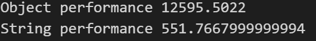
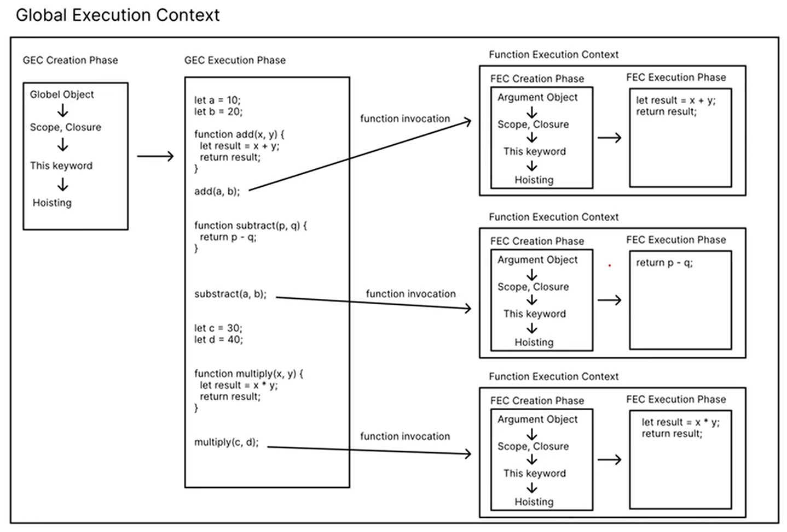
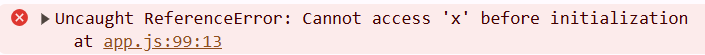
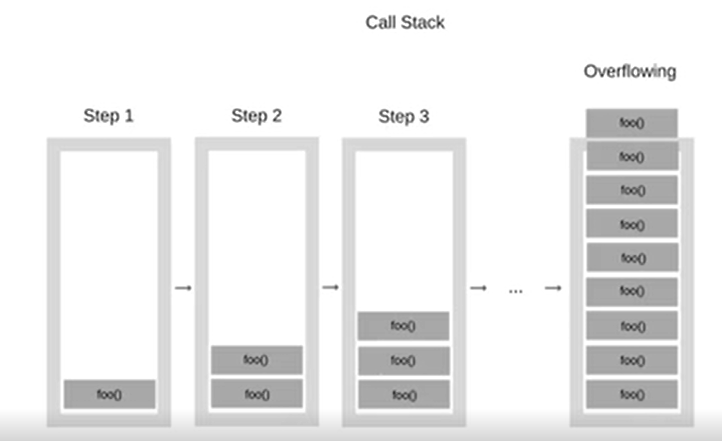

# 目錄

- [JavaScript 引擎](#JavaScript-引擎)
- [NaN 和 Infinity](#NaN-和-Infinity)
- [Spread Syntax and Rest Parameters](#Spread-Syntax-and-Rest-Parameters)
- [Primitive, Reference Data Types](#Primitive-Reference-Data-Types)
- [JavaScript String Comparison](#JavaScript-String-Comparison)
- [JS 內建排序涵式](#JS-內建排序涵式)
- [for of Loop 和 for in Loop](#for-of-Loop-和-for-in-Loop)
- [Execution Cintext 執行環境](#Execution-Cintext-執行環境)
- [Scope and Closure](#Scope-and-Closure)
- [Call Stack and Recursion](#Call-Stack-and-Recursion)
- [費波那契數](#費波那契數)
- [第十二章 Object 物件](#第十二章-Object-物件)
- [第十三章 Math Object](#第十三章-Math-Object)

# JavaScript 引擎

> JavaScript 並不是由任何程式語言所寫成。它只是一個由歐洲電腦製造協會(ECMA)所訂的標準。瀏覽器內部的 JavaScript 程式碼，讓 JavaScript 程式碼可以運作

> JavaScript 最有名的標準更新在 2015 年，被稱為 ECMA2015 或是 ES6

# NaN 和 Infinity

> 在 JavaScript 的數字當中，兩個最特別的分別是 NaN 以及 Infinity。兩個的資料類型都是 number。

- NaN 屬性表示 Not-A-Number 的值。當我們嘗試使用 String 或其他資料類型進行一些數學計算時，若無法計數值，就會出現 NaN。

- Infinity 值(正無窮大)大於其他任何數值。負無窮大則是-Infinity。任何乘以 Infinity 的正整數都是 Infinity， 除以 Infinity 的任何數都是 0

  ```js
  console.log(typeof Infinity); //number
  ```

# Spread Syntax and Rest Parameters

- Spread Syntax 允許在需要零個或多個參數(例如,function invocation)或元素(例如,array 的內部元素)的地方，去擴展 array 內部的元素

  - 語法:

    ```pseudocode
    myFunction(a,...iterableObj,b)
    [1,...iterableObj,'4','five',6]
    ```

  - 用法:

    - 複製 array

      ```js
      const arr = [1, 2, 3];
      const arr2 = [...arr]; // copy by value
      arr2.push(4);
      console.log(arr);
      console.log(arr2);
      ```

    - 合併 array

      ```js
      const arr = [1, 2, 3];
      const arr2 = [4, 5, 6];
      let result = [...arr, arr2];
      console.log(result);
      ```

    - 也可以用在 傳入 function 參數上面(function invocation)

      ```js
      function sum(x, y, z) {
        return x + y + z;
      }
      let arr = [1, 2, 3];
      console.log(sum(...arr)); //6
      ```

      ```js
      function sum(a, b, c, x, y) {
        return x + y + z;
      }
      let arr = [1, 2, 3];
      console.log(sum(10, ...arr, 5)); //21
      ```

    - 多個 Array 合併

      - ❌

        ```js
        let arr1 = [1, 2, 3];
        let arr2 = [4, 5, 6];
        console.log(arr1 + arr2); //1,2,34,5,6

        let result = arr1 + arr2;
        console.log(typeof result); //String
        ```

      - ✅

        - 第一種做法:

          ```js
          let arr1 = [1, 2, 3];
          let arr2 = [4, 5, 6];
          let result = [...arr1, ...arr2];
          console.log(result);
          ```

        - 第二種做法:

          ```js
          let arr1 = [1, 2, 3];
          let arr2 = [4, 5, 6];
          let result = arr1.concat(arr2);
          console.log(result);
          ```

- Rest Parameters 語法幾乎和 Spread Syntax 一樣。然而,Spread Syntax 是擴展 array 中的元素，而 Rest Parameters 是收集多個元素並將他們「壓縮」為單個 JS array。

  - 語法

    ```pseudocod
     function f(a,b,...theArgs){
        //...
     }
    ```

  - 用法:(function definition)
    ```js
    function sum(...theArgs) {
      let result = 0;
      theArgs.forEach((item) => {
        result += item;
      });
      return result;
    }
    console.log(sum(1, 2, 3, 4, 5, 6, 7, 8, 9, 10));
    ```

# Primitive, Reference Data Types

> 在 JavaScript 的 Primitive Data Type 代表著他們不是 Object，每個 Primitive Data Types 都沒有自己的 attributes 和 methods。此外，裝有 Primitive Data Types 的 variable 確實擁有數值，而不僅僅是對其數值得記憶體位置的 reference。

> Object 和 Array 都是 Reference Data Type。Reference Data Type 變數中，儲存的值是 Reference，也就是記憶體的位置，指向儲存真實內容的記憶體區塊的位置。

**Primitive Coercion**

- 既然 Primitive Data Type 沒有自己的 attributes 和 methods，為何我們可以使用`.length`或是`.toFixed()`呢?

- 當 Primitive Data Type 使用 attributes 和 methods 時，JavaScript 將值自動把數值裝箱到 wrapper object 中，並改為訪問該 wrapper object 上的屬性。

- 例如:`"foo".includes("f")`會把`"foo"`放到 new String("foo")當中，並且執行 new String("foo")，從 String 繼承而來的 String.protoype.include()。

- 這種自動裝箱行為在 JavaScript 代碼中是不可觀察的。這就叫做 Primitive Coercion。

- 如果我們願意，可以在創建 String 的時候，就使用 wrapper object 來製作。但這樣做會造成 RAM 的非必要耗損，且 wrapper object 所製作的時間要遠大於 primitive data type，code 完成時間會被拖延，所以 MDN 強烈不推薦使用這種寫 code 的方式。

- ✅ 推薦: 因為 javaScript 會自動轉成下面那種，讓我們可以使用 attributes 和 methods。

  ```js
  let myName = "Wilson";
  console.log(typeof myName); //string
  ```

- ❌ 不推薦: 要把所有有關這物件的 attributes 和 methods 都導入，會花較久的時間

  ```js
  let myName = new String("Wilson");
  console.log(typeof myName); //object
  ```

```js
const { performance } = require("perf_hooks"); // node.js

let stratTime = performance.now();

for (let i = 0; i < 1000000000; i++) {
  let a = new String("test");
}

let endTime = performance.now();
let timeDiff = endTime - stratTime;
console.log("Object performance" + timeDiff); //Object performance 12595.5022

let stratTime = performance.now();
for (let i = 0; i < 1000000000; i++) {
  let a = "test";
}
let endTime = performance.now();
let timeDiff = endTime - stratTime;
console.log("String performance" + timeDiff); //String performance 551.7667999999994
```



# JavaScript String Comparison

> JavaScript 如同大部分的程式語言一樣，String 之間的比較都是採用 compared lexicographically(字典式的比較法)。在英文字典中，排序單詞的順序是先按照第一格字母以升序排列(即 a、b、c....z 的順序)；如果第一個字母一樣，那麼比較第二個、第三個乃至後面的字母

- JavaScript 的 String 之間的比較中，在字典順序中較後面者會大於較前面者，所以:

  - "z">"y">...>"b">"a"
  - "9">"8">...>"2">"1"

  ```js
  console.log("abandon" < "apple"); //true
  console.log("12" < "2"); //true
  ```

# 進階 Array Methods

- arr.map(callbackFn): 創建一個新 array，其中填充了在 arr 中的每個元素上調 callbackFn 的結果。每次 callbackFn 執行時，返回的值都會添加到新 array 內部

  ```js
  let languages = ["Python", "Java", "C++", "PHP", "JS"];
  let result = languages.map((lang) => lang.toUpperCase());
  console.log(result); //[ 'PYTHON', 'JAVA', 'C++', 'PHP', 'JS' ]
  ```

  ```js
  const languages = [
    { name: "Python", rating: 9.5, popularity: 9.7, trending: "super hot" },
    { name: "Java", rating: 9.4, popularity: 8.5, trending: "hot" },
    { name: "C++", rating: 9.2, popularity: 7.7, trending: "hot" },
    { name: "PHP", rating: 9.0, popularity: 5.7, trending: "decreasing" },
    { name: "JS", rating: 8.5, popularity: 8.7, trending: "hot" },
  ];
  let result = languages.map((lang) => lang.name.toUpperCase());
  console.log(result); //[ 'PYTHON', 'JAVA', 'C++', 'PHP', 'JS' ]
  ```

- arr.find(callbackFn): 返回 arr 中滿足 callbackFn 條件的第一個元素(也就是第一個使 callbackFn 做 return true 的元素)。如果沒有值滿足 callbackFn 條件，則返回 undefined。

  ```js
  const languages = [
    { name: "Python", rating: 9.5, popularity: 9.7, trending: "super hot" },
    { name: "Java", rating: 9.4, popularity: 8.5, trending: "hot" },
    { name: "C++", rating: 9.2, popularity: 7.7, trending: "hot" },
    { name: "PHP", rating: 9.0, popularity: 5.7, trending: "decreasing" },
    { name: "JS", rating: 8.5, popularity: 8.7, trending: "hot" },
  ];
  let result = languages.find((lang) => lang.popularity > 9.5);
  console.log(result); //{ name: 'Python', rating: 9.5, popularity: 9.7, trending: 'super hot' }

  result = languages.find((lang) => lang.popularity > 9.8);
  console.log(result); //undefined
  ```

- arr.filter(callbackFn): 過濾出在給定 arr 中通過在 callbackFn 會 return true 的元素。Return value 是 A shallow copy of a portion of arr。

  ```js
  const languages = [
    { name: "Python", rating: 9.5, popularity: 9.7, trending: "super hot" },
    { name: "Java", rating: 9.4, popularity: 8.5, trending: "hot" },
    { name: "C++", rating: 9.2, popularity: 7.7, trending: "hot" },
    { name: "PHP", rating: 9.0, popularity: 5.7, trending: "decreasing" },
    { name: "JS", rating: 8.5, popularity: 8.7, trending: "hot" },
  ];
  let result = languages.filter((lang) => lang.rating >= 9.2);
  console.log(result); //[{name: 'Python',rating: 9.5,popularity: 9.7,trending: 'super hot'},{ name: 'Java', rating: 9.4, popularity: 8.5, trending: 'hot' },{ name: 'C++', rating: 9.2, popularity: 7.7, trending: 'hot' }]

  result = languages.find((lang) => lang.popularity > 9.8);
  console.log(result); //[]
  ```

- arr.some(callbackFn): 給定 callbackFn，測試 arr 中是否至少有一個元素，通過 callbackFn 的測試(是否至少有一元素會 return true)。some()的 return type 是 boolean。

  ```js
  const languages = [
    { name: "Python", rating: 9.5, popularity: 9.7, trending: "super hot" },
    { name: "Java", rating: 9.4, popularity: 8.5, trending: "hot" },
    { name: "C++", rating: 9.2, popularity: 7.7, trending: "hot" },
    { name: "PHP", rating: 9.0, popularity: 5.7, trending: "decreasing" },
    { name: "JS", rating: 8.5, popularity: 8.7, trending: "hot" },
  ];
  let result = languages.some((lang) => lang.rating >= 9.2);
  console.log(result); //true
  result = languages.some((lang) => lang.popularity > 9.8);
  console.log(result); //false
  ```

- arr.every(callbackFn): 給定 callbackFn，測試 arr 中是否所有的元素都通過 callbackFn 的測試(是否所有元素都會 return true)。every()的 return type 是 boolean。

  ```js
  const languages = [
    { name: "Python", rating: 9.5, popularity: 9.7, trending: "super hot" },
    { name: "Java", rating: 9.4, popularity: 8.5, trending: "hot" },
    { name: "C++", rating: 9.2, popularity: 7.7, trending: "hot" },
    { name: "PHP", rating: 9.0, popularity: 5.7, trending: "decreasing" },
    { name: "JS", rating: 8.5, popularity: 8.7, trending: "hot" },
  ];
  let result = languages.every((lang) => lang.rating >= 9.2);
  console.log(result); //fasle
  result = languages.every((lang) => lang.popularity > 8.0);
  console.log(result); //false
  result = languages.every((lang) => lang.popularity > 5.0);
  console.log(result); //true
  ```

## Map vs. ForEach

[mdn](https://developer.mozilla.org/en-US/docs/Web/JavaScript/Reference/Global_Objects/Array/map)

| 特性           | `map()`                                    | `forEach()`                                    |
| -------------- | ------------------------------------------ | ---------------------------------------------- |
| **回傳值**     | ✅ 產生新陣列（返回修改後的值）            | ❌ `undefined`（不回傳新陣列）                 |
| **用途**       | 適用於需要返回新陣列的情境                 | 適用於單純迭代執行副作用                       |
| **可鏈式呼叫** | ✅ 可繼續 `.filter()`、`.reduce()` 等      | ❌ 無法鏈式呼叫，因為回傳 `undefined`          |
| **修改原陣列** | ❌ 不會改變原陣列                          | ❌ 不會改變原陣列                              |
| **適用場景**   | 需要轉換陣列內容時，如調整數值、提取欄位等 | 只執行迴圈處理，如 `console.log()`、累加變數等 |

| Feature                     | `map()`                                                                     | `forEach()`                                                                     |
| --------------------------- | --------------------------------------------------------------------------- | ------------------------------------------------------------------------------- |
| **Return Value**            | ✅ Creates a new array (returns modified values)                            | ❌ `undefined` (does not return a new array)                                    |
| **Purpose**                 | Used when a new transformed array is needed                                 | Used for performing side effects only                                           |
| **Chaining**                | ✅ Can be chained with `.filter()`, `.reduce()`, etc.                       | ❌ Cannot be chained since it returns `undefined`                               |
| **Modifies Original Array** | ❌ No                                                                       | ❌ No                                                                           |
| **Use Case**                | When modifying array elements, such as changing values or extracting fields | When performing operations like `console.log()` or modifying external variables |

# JS 內建排序涵式

- 使用時機:
  1. 自己寫: 當要客製化排序時，系統優化(資料結構)
  2. 內建: 其他非客製化或優化的時候

> 若想要把 array 內部的元素由小排到大，可使用 JS 內建排序 sort()方法。

> sort()方法對數組的元素進行就地排序，也就是說，array 會被永久改變(注意:絕大多數的 js 內建 method 並不改變調用此 method 變數的值)，若希望保留未經過排序的 array，則需要先製作一個完整的複製品。

```js
let arr = [2, 5, 7, 1, 4, 3, 8];
console.log(arr.sort()); //[1, 2, 3, 4, 5, 7, 8]
console.log(arr); //[1, 2, 3, 4, 5, 7, 8]
```

```js
let arr = [2, 5, 7, 1, 4, 3, 8];
let copyArr = [...arr];
arr.sort();
console.log(arr); //[1, 2, 3, 4, 5, 7, 8]
console.log(copyArr); //[2, 5, 7, 1, 4, 3, 8]
```

- 語法:

  ```pseudocode
  sort()
  sort(compareFn)
  ```

  - compareFn 式定義排序順序的函數。如果省略，則將 array 元素按照 JavaScript 預設方式排序(從小到大排序)。若我們要自己提供 compareFn，則此 funcion 需要有兩個 parameter a,b，而 sort()會根據 compareFn 的 return value 來決定排序順序。

  | `compareFn(a, b)` Return Value | Sort Order                                 |
  | ------------------------------ | ------------------------------------------ |
  | `a - b`                        | Ascending order (small → large)            |
  | `b - a`                        | Descending order (large → small)           |
  | `> 0`                          | Place `a` after `b` (swap `a` and `b`)     |
  | `< 0`                          | Place `a` before `b` (keep `a` before `b`) |
  | `=== 0`                        | Keep original order (may not be stable)    |

  | `compareFn(a, b)` 回傳值 | 排序順序                                     |
  | ------------------------ | -------------------------------------------- |
  | `a - b`                  | 升序（從小到大）                             |
  | `b - a`                  | 降序（從大到小）                             |
  | `> 0`                    | 把 `a` 排在 `b` 之後（交換 `a` 和 `b`）      |
  | `< 0`                    | 把 `a` 排在 `b` 之前（保持 `a` 在 `b` 之前） |
  | `=== 0`                  | 保持原始順序（可能不穩定）                   |

  ```js
  let arr = [2, 5, 7, 1, 4, 3, 8];
  arr.sort((a, b) => a - b);
  console.log(arr); //[1, 2, 3, 4, 5, 7, 8]
  ```

  ```js
  let arr = [2, 5, 7, 1, 4, 3, 8];
  arr.sort((a, b) => b - a);
  console.log(arr); //[8, 7, 5, 4, 3, 2, 1]
  ```

  ```js
  let arr = ["Watermelon", "Apple", "Banana"];
  arr.sort((a, b) => {
    if (a.length > b.length) return 1;
    return -1;
  });
  console.log(arr); //[ 'Apple', 'Banana', 'Watermelon' ]
  ```

  ```js
  let arr = ["Watermelon", "Apple", "Banana"];
  arr.sort((a, b) => {
    if (a.length > b.length) return -1;
    return -1;
  });
  console.log(arr); //[ 'Watermelon', 'Banana', 'Apple' ]
  ```

  ```js
  let arr = ["Watermelon", "Apple", "Banana"];
  arr.sort((a, b) => {
    if (a.length > b.length) return 0;
    return -1;
  });
  console.log(arr); //[ 'Apple', 'Banana', 'Watermelon' ]
  ```

  - 不放參數: array 當中的每個元素將先被轉換為 String，再以 Unicode 編碼位置進行比較來排序。在 Unicode 編碼位置較後面者，會被排序在較後方。
    ```js
    let arr = ["Watermelon", "Apple", "Banana"];
    arr.sort();
    console.log(arr); //[ 'Apple', 'Banana', 'Watermelon' ]
    ```

- 排序的時間和空間複雜度不能被保證，因為它取決於每個瀏覽器的 JS 引擎如何實現 sort()，但以下為幾個參考方向:
  - V8 引擎: Quicksort or Insertion Sort(for smaller arays)，或使用 AVL Tree。
  - Firefox: Merge sort
  - Safari: Quicksort, Merge Sort, or Selection Sort(depending on the type of array)

# for of Loop 和 for in Loop

- `for...of Loop`創建一個迴圈，去循環可迭代對象(iterable)內的每個元素。可迭代對象包括: string、array、array-like object、TypedAray、Map、Set 和 user-defined 的 iterable。

**注意: object 並不是 iterable**

    - 語法:

      ```pseudocode
      for(variables of iterable){
        statement;
      }
      ```

      ```js
      let arr = [10, 20, 30];
      for (let n of arr) {
        console.log(n); // 10 20 30
      }
      ```

      ```js
      let myString = "Grace";
      for (let i of myString) {
        console.log(i); // G r a c e
      }
      ```

- `for...in Loop`創建一個迴圈，去循環一個 JS 物件中所有的可枚舉屬性(enumerable properties)。

  - 對於 object 來說，enumerable properties 就是 keys。
    ```js
    let Joan = {
      name: "Joan Hu",
      age: 26,
    };
    for (let property in Joan) {
      console.log(property); //name age
      console.log(property[property]); //Joan Hu 26
    }
    ```
  - 對於 array 來說，enumerable properties 就是 indices。

    ```js
    let arr = [1, 2, 3];
    for (let i in arr) {
      console.log(item); //0 1 2
      console.log(arr[i]); //1 2 3
    }
    ```

  - 對於 String 來說，enumerable properties 就是 indices。

    ```js
    let myString = "Grace";
    for (let i in myString) {
      console.log(i); // 0 1 2 3 4
      console.log(myString[i]); // G r a c e
    }
    ```

# Execution Cintext 執行環境

> 當 JS 引擎值行程式碼(script)時，便會創建 execution contexts(執行環境)。

- JavaScript 共會建立兩種值環境

  1. 全域執行環境(Global Execution Context)
  2. 涵式執行環境(Function Execution Context)

- 每種 execution context 都包含兩個階段
  1. 創造階段(creation phase)
  2. 執行階段(execution phsae)

## 全域執行環境

> 當初次執行一份 JavaScript 程式碼時， JS 引勤會創造第一種 execution context，叫 Global Execution Context。在 Globel Execution Context 內部，

- 會先進入 creation phase:

  1. 創建 Global object。
     - 例如: 瀏覽器中的 window object，或 Node.js 中的 global phase
  2. 建立 scope。
  3. 創建 this 關鍵字，並被綁定至 global object(指向 window)
  4. 將 variables、class 和 function 分配至記憶體。(hoisting 步驟)

- creation pharse 結束後，會進入 execution phase:

  1. 逐行(line by line)執行程式碼
  2. 遇到遞迴時，則使用 call stack 來排定工作順序

- 例子:

  ```js
  let a = 3;
  function area(s) {
    return s * s;
  }
  let result = area(a);
  console.log(result);
  ```

  - creation phase:

    1. global object 製作完成(才可使用 window)

    ```js
    window.alert("Hello");
    ```

    2. 建立 scope。
    3. 建立 this keywords (可使用 this)

    ```js
    console.log(this);
    ```

    4. let a，let result，function area(s){...}都拿到最上面

  - execution phase:
    1. a = 3;
    2. result = 9;
    3. console.log(result);

  **從上述說明可知道 function 不管放在哪邊都不會受影響，因為 function 會在 creation phase 就被存入**

## 函式執行環境

> 每次的 function call，JS 引擎也都會創造一個 Function Execution Context。涵式執行環境與全域執行環境非常類似，一樣也有 creation phase 以及 execution phase，但差別在於，函式執行環境不創建 global object，而是創建 argument object。

- Argument Object 包含了被放入此函式的 parameters 的數值參照值(a reference to all the parameters passed into the function)

- 函式執行環境的 creation phase 是:
  1. 創建 argument object
  2. 建立 scope(依照 closure 這個準則)
  3. 創建 this 關鍵字(指向 window 或指向 object)
  4. 將 variables、class 和 function 分配至記憶體。(hoisting 步驟)
- creating phase 結束後，會進入 execution phase:

  1. 逐行(line by line)值行程式碼
  2. 遇到遞迴時，使用 call stack 來排定工作順序

- 例子:

  ```js
  let a = 3;
  function area(s) {
    return s * s;
  }
  let result = area(a);
  console.log(result);
  ```

  - creation phase:

    1. 創建 argument object(a: 3)
    2. 建立 scope。
    3. 建立 this keywords (可使用 this，這裡指向 window)
    4. s undefined

  - execution phase:
    1. 迴傳 `3*3=9`



## Hoisting

> JavaScript Hoisting 是指 JS 引擎在執行代碼之前，將 function、variables 或 class 的 declaration 移動到其範圍頂部的過程

> Hoisting 的優點之一是，它允許我們在 code 中，declare function 之前使用這個 function。**要小心，這個功能只對 function declaration**

> Hoisting 也適用於 variables，因此我們可以在 declaration 和/或 initialization 之前在 code 中使用 variables。然而 JavaScript 只 hoist declaration，而不是 initialization!也就是說，`let x = 10;`這段程式碼，只有`let x`會被放到程式碼頂部。

> Hoisting 發生時，對於使用 var 做 declaration 的 variable 會給定初始值 undefined。然而，對於使用 let,const 做 declaration 的 variable 並不會給任何初始值。

    ```js
    console.log(x); // undefined
    var x;
    ```


    ```js
    console.log(x); // ReferenceError: cannot access 'x' before initialization
    let x;
    ```



> let 可以 declare without initialization，且我們可以用 console.log()檢查 let 的變數值是 undefined，但這個 undefined 的 initialization 並不像 var 是發生在 creation phase 的 hoisting 階段發生的，而是在 execution phase 的階段。

    ```js
    let x;
    console.log(x); // undefined
    ```


# Scope and Closure

## Scope

> Scope 是指:在當前的 execution context 之中，變數的可訪問性(accessibility)為何?我們在 function A 所宣告的變數，在 function B 內部可以使用(訪問)嗎?

- 例:

  ```js
  function fun1() {
    let x = 10;
    console.log(x);
  }
  function fun2() {
    return x + 10;
  }
  ```

  - fun2()可以訪問到 fun1 裡面的區域變數(local variable) x=10 嗎?❌

  ```js
  let x = 10;
  function fun1() {
    function fun2() {
      return x + 10;
    }
  }
  ```

  - fun2()可以訪問到全域變數(global variable)x=10 嗎?✅

- 了解 Scope 可以知道，每個變數在哪些區域或範圍是有意義的，或者是說，變數在哪些區域是可訪問或可使用的

- 全域變數（Global Variable）：定義在函式外部，能夠在整個程式的任何地方存取。
- 區域變數（Local Variable）：定義在函式內部，只能在該函式內部存取，函式外部無法使用。

- JavaScript 的變數有以下幾種 Scope:

  - 全域作用域(Global scope): The default scope for all code running in the script.
  - 模組作用域(Module scope): The scope for code running in module mode.
  - 函式作用域(Function scope): The scope is created with a function.

    - 例子

      ```js
      function sayHi() {
        console.log("hello");
        // function declaration 也有function scope
        function sayHi2() {
          console.log(hello2);
        }
        sayHi2(); //✅
      }
      sayHi2(); //❌
      ```

  - 區塊作用域(Block scope): The scope created with a pair of curly braces(a block);(**用 let 或是 const 去宣告的變數屬於這個**)
    - ✅: let 或是 const 有 Block scope
      ```js
      if (true) {
        let x = 10;
      }
      console.log(x); //reference erroe;
      ```
      ```js
      for (let i = 0; i < 20; i++) {}
      console.log(i); //reference erroe;
      ```
    - ❌: var 沒有 Block scope
      ```js
      if (true) {
        var x = 10;
      }
      console.log(x); //10
      ```
      ```js
      var x = 100;
      for (var x = 0; x < 10; x++) {}
      console.log(x); //10
      ```

**因為 var 沒有 Block scope，可能會重複賦予值，因此現在在寫程式時盡量少用**

## Closure

> 在 function execution context 中，如果發現不在 function scope 內部的變數，JavaScript 將轉到其他地方查找。Closure(閉包)就是指這種將函數其周圍的狀態或語詞環境結合在一起的組合。在 JavaScript 中，每次 function execution context 都會在 creation phase 創建 closure。

- Closure 的規則是:

  1. 從 Argument Object 以及 Local variable 去尋找
  2. 若從 1 找不到，則從記憶體被分配給函數的位置開始尋找
  3. 若在目前的 execution context 找不到，就繼續往外層、往全域一層一層的去找

- 例子:

  ```js
  let c = 100;
  function add(a, b) {
    let c = 5;
    return a + b + c; //12
  }
  add(3, 4);
  ```

  ```js
  let c = 100;
  function add(a, b) {
    return a + b + c; //107
  }
  add(3, 4);
  ```

  ```js
  let myName = "Joan";

  function sayHi() {
    let myName = "John";
    console.log(myName + " say Hi!"); // John say Hi!
    sayHi2();
  }
  function sayHi2() {
    console.log(myName + " say Hi!"); // Joan say Hi!
  }

  sayHi();
  ```

  ```js
  let myName = "Joan";

  function sayHi() {
    let myName = "John";
    console.log(myName + " say Hi!"); // John say Hi!
    sayHi2();

    function sayHi2() {
      console.log(myName + " say Hi!"); // John say Hi!
    }
  }

  sayHi();
  ```

# Call Stack and Recursion

## Call Stack

> 是 JS 引擎追蹤本身在調用多個函數的程式碼中位置的機制(資料結構的一種)。Call stack 可以幫助我們知道 JS 引擎當前正在運行什麼函式以及從該函數中調用了哪些函式等

> Stack: 後進先出(Last-in-first-out LIFO)

- 其機制為:

  1. 當執行函式 F1 時，JS 引擎將其添加到 call stack 中，然後開始執行該函式
  2. 若該函式(f1)內部又調用其他函式 f2，則將函式 f2 添加到 call stack 中，然後開始執行該函式。
  3. 當 f2 執行完畢後，js 引擎將其從 call stack 中取出，並且從 f1 停止的位置繼續執行
  4. 如果 call stack 堆疊過高，高出記憶體分配給 call stack 的最大空間，則會導致「stack overflow」的問題。
     **stack overflow**
     ```js
     function hello() {
       console.log("hello...");
       hello();
     }
     hello();
     ```

  ```js
  function f1() {
    console.log("start f1....");
    f2();
    console.log("end f1....");
  }
  function f2() {
    console.log("start f2....");
    console.log("end f2....");
  }
  f1();
  ```

  1. start f1....
  2. start f2....
  3. end f2....
  4. end f1....

## Recursion

> 遞迴:在程式設計中，function 裡面又在執行自己的 function

> 若沒有設計好就會發生 stack overflow

    ```js
    function hello() {
      console.log("hello...");
      hello();
    }
    hello();
    ```

> 在數學上，遞迴關係(recurrence relation)是一種定義數列的方式；數列的每一項目定義為前面項的函數。

- 如:我們可以定義數列 S:

  1. `A base case S(1) = 2`
  2. `S(n) = 2*S(n-1) for n>=2`
     > 以上面的規則可知，S 會是等比數列:2,4,8,16,32,...

  ```js
  function s(n) {
    if (n >= 2) return 2 * s(n - 1);
    return 2;
  }
  console.log(s(10));
  ```

> 程式語言中，遞迴演算法(recirsive algorithm)有相似的概念。當一個函式內部，執行自己這個函式，這種情況就是遞迴演算法。(因此，遞迴演算法絕對會產生 call stack)

> 遞迴演算法的設計上，與數學歸納法以及遞迴關係(recurrence relation)相似。我們需要定義一個 base case(基準情況)。Base case 的用途是為了避免遞迴演算法產生在 call stack 上無限迭加的情況



# 費波那契數列

> 在數學上，費波那契數是以遞迴的方式來定義

1. F(0) = 0
2. F(1) = 1
3. F(n)=F(n-1)+F(n-2) for all n>=2

> 所以，費波那契數列的前幾項列出來會是:0,1,12,3,4,5,13,...

```js
function f(n) {
  if (n == 0) {
    return 0;
  } else if (n == 1) {
    return 1;
  } else {
    return f(n - 1) + f(n - 2);
  }
}
console.log(f(10));
```

> 由離散數學的二階遞迴 closed-form 公式可以得出，費波那契數列第 n 項的值公式為:

```math
F(n) = \frac{\frac{1+\sqrt{5}}{2}^n - \frac{1-\sqrt{5}}{2}^n}{\sqrt{5}}
```

其中：

````math
\frac{1+\sqrt{5}}{2}
```
為黃金比例
````
