# 目錄

- [第一章 JS 簡介](#第一章-JS簡介)
- [第二章 變數與賦值](#第二章-變數與賦值)
- [第三章 常見 JavaScript 函數和 Lexical Structure](#第三章-常見-JavaScript-函數和-Lexical-Structure)
- [第四章 資料類型 Data Type](#第四章-資料類型-Data-Type)
- [第五章 JavaScript Operators](#第五章-JavaScript-Operators)
- [第六章 if statement](#第六章-if-statement)
- [第七章 Codeing Convention and Restrictions](#第七章-Codeing-Convention-and-Restrictions)
- [第八章 JavaScript Function](#第八章-JavaScript-Function)
- [第九章 Array 陣列](#第九章-Array-陣列)

# 第一章 JS 簡介

**什麼是 JavaScript?**

> JavaScript 程式語言最初的創建是為了"讓網頁活起來"。這種語言的程序稱為腳本(script)。

> JavaScript 可以直接被寫在網頁的 HTML 中，並在頁面加載時自動運行

> JavaScript 本身跟 Java 關連不大。創建 JavaScript 時，他最初有另一個名稱"LiveScript"。但當時 Java 非常流行，因此決定將此新語言定義為 JavaScript。但隨者時間過去與發展，JavaScript 成為一種完全獨立的語言，擁有自己的規範，稱為 ECMAScrip(European Computer Manufactures Association Scrip)，現在他與 Java 完全沒有關係。如同狗跟熱狗的關係。

> Vanilla JavaScript 是指使用純 JavaScript 而不需要任何額外的 library 或框架。常見的 JavaScript library 有 jQuery。因為 JavaScript 本身支援的語法眾多且功能強大，越來越多網站選擇使用純 JavaScript 來製作。

> 每個瀏覽器有自己的 JavaScript 引擎，用來讀取並編譯 JavaScript 程式碼。若要確認某個瀏覽器的 JavaScript 引擎是否有支援某種功能，可參考:https://caniuse.com

**`<script>`放在哪裡?**

> 通常來說，`<script>`會被放在 HTML 頁面的最下方，與 CSS 的`<link>`不同。這是因為將 JavaScript 放在 HTML 正文的底部時，他會在任何 JavaScript 加載之前讓 HTML、CSS 有時間加載。`<script>`被放在 HTML 頁面最下方所以會最後加載

> 先讓瀏覽器可以加載 HTML、CSS，用戶無需等待 JavaScript 被解析完成，即可在網頁中看到某些內容，許多網頁使用者點進網站後，看到內容是空白，持續幾秒的話還是空白就會離開!若想留下更多的使用者，就先讓他們看見文字或圖片，JavaScript 的功能可以慢慢 load up!

# 第二張 變數與賦值

- 變數(variable)和賦值(assignment)是任何程式語言中的一些基本概念。

  - 變數: 一個可以儲存值的容器，由於變數內部的值可以不斷改變，因此被稱為「變數」。

  - 賦值: 在 JavaScript 當中`=`是賦值(assignment)的意思，要把右邊的數據放到等號左邊。

  - 例:

    ```js
    x = 5;
    x = x + 1;
    ```

> 經過執行後，x 的值會變成 6

**語法糖(syntax sugar)支援將`x=x+1`更改為`x+=1`。在這 JavaScript 中極為常見。**

> 在 javascript 中使用變數前需要先宣告變數(declare variable)。

有三個宣告變數的方法:

1. let: 變數的值會變動，只在第一個大括弧內有效

```js
for (let i = 0; i < 10; i++) {
  // console.log(i);
}
console.log(i); //error: i is not defined
```

> i 只會在 for 迴圈被宣告，其他地方會產生錯誤

2. const: 變數的值不會變動

3. var: 與 let 的相同，但請勿使用 var，一旦宣告就對所有的 fun 都有效

```js
for (var i = 0; i < 10; i++) {
  // console.log(i);
}
console.log(i); //10
```

> 此 i 對整個`.js` 都有效

幾個需要特別注意的規則:

1. 用 const 宣告的變數一定要賦予初始值(initializer)，let 則不需要，若 let 宣告了變數，但還沒有復職，則變數的值是 undefined。

2. 用 const, let 宣告過的變數，不能重複宣告。(redeclaration is not allowd)。

❌

```js
let x = 10;
let x = 5;
```

✅

```js
let x = 10;
x = 5;
```

❌

```js
const pi = 3.14;
pi = 3.14;
```

3. const 不能做重複賦值。(reassignment is not allowed)

|       | redeclaration | reassignment | initializer |
| ----- | ------------- | ------------ | ----------- |
| let   | ❌            | ✅           | ❌          |
| const | ❌            | ❌           | ✅          |

**JavaScript 引擎中有一個稱為 garbage collector 的後台程式。它監視所有物件並刪除那些變得無法訪問的物件**

# 第三章 常見 JavaScript 函數和 Lexical Structure

**JavaScript 函數**

> 函數為一個 input 對上一個 output

1. console.log(): 將 message 輸出到 Web 控制台。message 可以是單個 string，也可以是任何一個或多個 JavaScript Object。

```js
console.log("Hello World!");
```

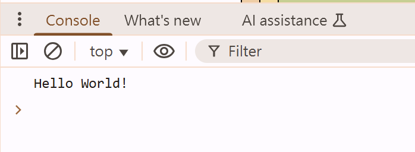

2. window.alert(): 指示瀏覽器顯示帶有可選消息的對話框，並等待用戶關閉對話框

```js
window.alert("welcome to website");
```


3. window.prompt(): 指示瀏覽器顯示帶有可選消息的對話框，提示用戶輸入一些文字，並等待用戶提交文字或取消對話框

```js
window.prompt("please enter your name!");
```

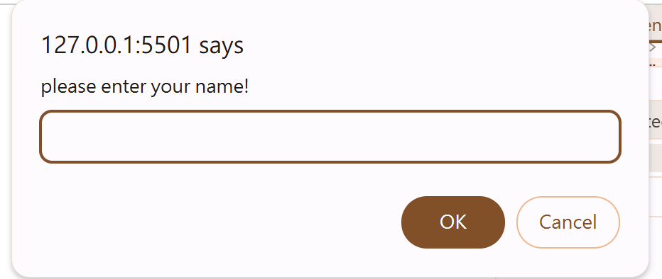

**可連續使用**

```js
let name = window.prompt("please enter your name!");
window.alert(`${name}, Welcome to website!`);
```

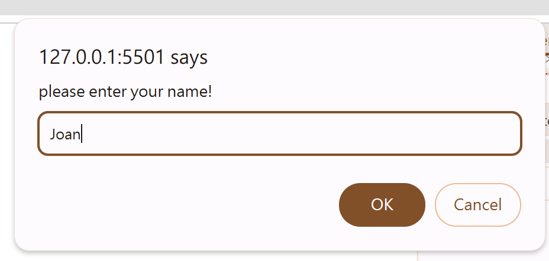
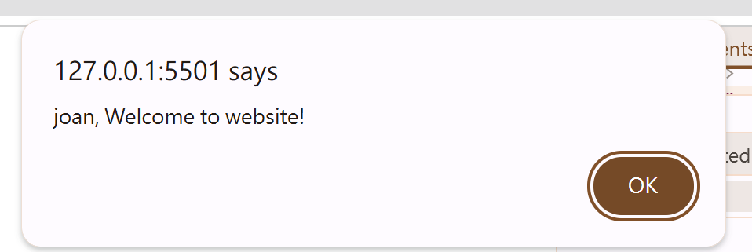

**Lexical Structure**

- 類比:
  - 自然語言(Natural Language)
    - 文法(Grammer)
    - 單字(words)
  - 程式語言(Programming Language)
    - 語法(syntax)
    - 被保留單字(reserved words)

> 程式語言 Lexical Structure 是一組基本規則，用於指定如何用該語言編寫程式。它是一種語言的最低級語法: 例如，它指定變量名稱的外觀、註釋的分隔符號以及如何將一個程式語句與下一個程式語句分開。以下為 JavaScript 中的幾個 Lexical Strueture:

1. Case(uppercase, lowercase) Sensitive: JavaScript 中的大小寫是有差別的

2. 空白鍵、換行鍵等等在 JavaScript 當中會全部被忽略。通常來說，放到伺服器上的 JavaScript 程式碼都會被做 minification(刪除空白鍵、換行鍵)。Minification 可少量的減少 JS 檔案大小。

3. JavaScript 的當行註解是`//`，多行則是`/**/`

4. 在 JavaScript 內部的變數名稱需要由文字、underscore(\_)、dollar sign($)當作開頭(不能用數字開頭)

❌

```js
let 02test = 10;
```

5. JavaScript 內部有關鍵字(reserved words,keywords)，例如: null,of,if,then,in,finally,for,while,break,continue,try,let,const,var 等等，不能當作變數名稱

❌

```js
let const = 10;
```

6. JavaScript 使用 Unicode 字元集合，所以 String 內部可由任何 Unicode 文字組成。

7. Semicolons(;)可用來分隔程式語言。Semicolons 的使用是 optional。

# 第四章 資料類型 Data Type

> JacaScript 中有 7 種基本數據類型。這 7 種基本數據類型被稱為 primitive data type。

1. Number: 整數與帶小數點的數字

   - JavaScript 數字格式允許我們精確地表示介於 -9,007,254,740.992(2^-53)和 9,007,254,740.992(2^53)之間的所有整數。
   - 如果大於此整數值，則可能會丟失數字的精度
   - 數字支援的運算符號包含加法、減法、乘法、除法、取餘數(remainder operator)、exponentiation poeration、`++`、`--`、`+=`、`-=`、`/=`、`*=`等等

   ```js
   let x = 10;
   let y = 3;

   console.log(x + y); //13
   console.log(x - y); //7
   console.log(x * y); //30
   console.log(x / y); //3.333

   console.log(x % y); //1
   console.log(x ** y); //x^y 1000

   //x = x + 1, x++ , x+=1
   x++;
   console.log(x); // 11
   x--;
   console.log(x); // 10
   x /= 2;
   console.log(x); //5
   ```

   - Number Methods:

     - JavaScript 是個物件導向(OOP)的程式語言，所以 JavaScript 當中的數字可被視為是物件。

     - JavaScript 中的 unary operator typeof 可以用來確認資料類型

     以下數字常見可用 methods:

     - toString(): return 一個數字的 String

     ```js
     let age = 27;
     console.log(typeof age.toString()); // String
     ```

     ```js
     let x = 10; // x is a number(x is an object)
     console.log(x.toString); //to x, toString is a function or method
     ```

     - toFixed(n): return 被轉換後的數字，到小數點後第 n 位數。
       - **注意!二進位置不能精確表示所有小數。這可能會導致意外結果，例如:`0.1+0.2 === 0.3`會 return false**
       ```js
       const pi = 3.1415926535;
       console.log(pi.toFixed(2));
       console.log(typeof pi.toFixed(2)); //String
       ```

2. BigInt: 任意長度的整數

3. String: 字符串

   - String 由字母或數字串接組成。
   - 需使用單引號或雙引號。
   - 兩個 String 之間的串接是由`+`來完成的。String 之間的串接被稱為 concatenation。
   - String 與 String 之間不能做 `-`,`*`,`/`運算。若嘗試做此類運算，則會出現`NaN`,代表 Not a Number。(這是因為,JavaScript 還會是常是算出某個數字結果，但兩個 operand 的值都不是數字,無法算出一個數計結果,因此會出現`NaN`)
   - String 與 Number 之間，若是做`+`運算則會變成 String 和 String 之間的 concatenation
   - `\n`可以換行

   ```js
   let name = "Joan";
   let sentence = "he's a good guy";
   const first_name = "Joan";
   const last_name = "Hu";

   //+ is not addition,instead,+ is string concatenation
   console.log(first_name + " " + last_name);
   ```

   ```js
   // x data type is number, y data type is a String
   let x = 10;
   let y = "10";
   console.log(x + x); //20
   console.log(y + y); //1010
   console.log(x + y); //1010

   let n1 = 20;
   let n2 = 30;
   let name = "Johnson";
   let n3 = 10;
   let n4 = 15;
   console.log(n1 + n2 + name); //50Johnson
   console.log(n1 + n2 + name + n3 + n4); //50Johnson1015
   console.log("Joan\nHu");
   ```

   - [String Attributes and Methods](https://developer.mozilla.org/en-US/docs/Web/JavaScript/Reference/Global_Objects/String)

     - JavaScript 中的 String 有可用的 attributes 以及 methods。常見的有:

       - length: return String 的程度;length 是 attributes,在使用時不用加()

       ```js
       let str = "Joan";
       let str2 = "Joan Hu";
       let str3 = "";
       console.log(str.length); // 4
       console.log(str2.length); //7
       console.log(str3); //0
       ```

       - `[n]`: return index(索引) 第 n 項的字。(index 從 0 開始計算)

       ```js
       let str = "Joan"; //length of str is 4
       console.log(str[0]); //J
       console.log(str[1]); //o
       console.log(str[2]); //a
       console.log(str[3]); //n
       console.log(str[4]); //undefine

       // to any string, if length of length is x, then the last index of string must be x-1
       console.log(str[str.length - 1]); //n
       ```

       - `slice(indexStart [,indexEnd])`: 提取字符串的一部份並將其作為新 String 返回，而不修改原始字符串。indexStart 是 inclusive(包含此 indexStrat), indexEnd 是 optional(可填可不填，沒填就會抓到最後), exclusive(不包含 indexEnd)。

       ```js
       let str = "Joan"; // the index of 'o' is 1
       console.log(str.slice(2)); //oan
       console.log(str.slice(2, 3)); //oa
       ```

       - indexOf(substring): return substring 的 index 位置。若找不到 substring，則 return -1

       ```js
       let str = "Book Store";
       console.log(str.indexOf("a")); //-1
       console.log(str.indexOf("S")); //5
       console.log(str.indexOf("tore")); //6
       ```

       - toUpperCase(): return 轉換為大寫的 String。此方法不會影響 String 本身

       ```js
       let str = "Joan";
       console.log(str.toUpperCase()); // JOAN
       console.log(str); //Joan

       //reassignment
       str = str.toUpperCase();
       console.log(str); //JOAN
       ```

       - toLowerCase(): return 轉換為小寫的 String。此方法不會影響 String 本身

       ```js
       let str = "Joan";
       console.log(str.toLowerCase()); // joan
       console.log(str); //Joan

       //reassignment
       str = str.toLowerCase();
       console.log(str); //joan
       ```

       - split(pattern): 接受一個 pattern 並通過搜尋將一個字符串分成一個有序的 array,然後 return 該 array。Pattern 可以是 regular expression。

       ```js
       let sentence = "Today is a good day";
       // "Today", "is" ,"a","good","day"

       let result = sentence.split(" ");
       cosnole.log(result); // ["Today", "is" ,"a","good","day"]
       let result2 = sentence.split("o");
       cosnole.log(result2); // ["T", "day is a g" ,"","d day"]
       ```

       - startsWith(s):確定 String 是否已指定字串 s 開頭，根據結果返回 true 或 false。

       ```js
       let sentence = "Today is a good day";
       console.log(sentence.startsWith("Today")); // true
       console.log(sentence.startsWith("today")); //false
       ```

       - endsWith(s):確定 String 是否已指定字串 s 結尾，根據結果返回 true 或 false。

       ```js
       let sentence = "Today is a good day";
       console.log(sentence.endsWith("day")); // true
       console.log(sentence.endsWith("today")); //false
       ```

       - includes(str): return true 如果 String 內不包含 str

       ```js
       let sentence = "Today is a good day";
       console.log(sentence.includes("day")); // true
       console.log(sentence.includes("Joan")); // false
       ```

       - charCodeAt(n): 返回一個介於 0 和 65535 之間的整數，表示給索引處 n 的 UTF-16code unit。

       ```js
       let sentence = "Today is a good day";
       console.log(sentence.charCodeAt("0")); // 84 (UTF-16code unit of T)
       console.log(sentence.charCodeAt("1")); // 111 (UTF-16code unit of o)
       ```

       [ASCII American Standard Code for Information Interchange](https://en.wikipedia.org/wiki/ASCII)

4. Boolean: true 或 false 兩種值

   - 在程式語言當中,我們很多情況需要一種資料類型來記錄 true,false 資料,例如 YouTube 資料庫紀錄使用者是否是 Premium 會員，就只需要使用 Boolean 即可。
   - Unary operator 「!」 可以將 Boolean 的值反轉

   ```js
   let isPremium = true; //Boolean
   console.log(isPremium); // true
   console.log(!isPremium); // false

   let isLogin = "true"; //String
   ```

5. null: 用來代表某個故意不存在的值

   - 用來代表某個故意不存在的值

   ```js
   let x;
   console.log(x); //undefine x is waiting assignment.

   let y = null;
   console.log(y); //null y has nothing inside.
   ```

6. undefine: 未被賦值的變數，就是 undefined。

   - 已經宣告變數，卻沒有賦予 initializer 時，就會出現 undefined。

   - undefined 也是 JavaScript 中的 functions 的預設 return value。

7. symbol: unique identifer。

> 除了這 7 種基本數據類型之外，JavaScript 的第八種類型叫做 Object，屬於 non-primitive data type。 JavaScript 中的 object 可能是 array、object 或是 function 等等。

# 第五章 JavaScript Operators

```js
let x = 3; //operand 運算元
let y = 2; //operand 運算元
console.log(x + y); //+ is operator
```

- 常見的運算符號有:

  - assignment operator: `=`
  - comparison operator: 運算元是兩個任意資料型態，且運算結果為 Boolean 值

    - `==`: returns true if the operands are equal.

    ```js
    console.log(3 == 3); //true
    console.log(3 == 5); // false
    console.log(3 == "3"); //true
    ```

    - `!=`: returns true if the operands are not equal.

    ```js
    console.log(3 != 3); //false
    console.log(3 != 5); // true
    console.log(3 != "3"); //false
    ```

    - `===`: returns true if the operands are equal and of the same data type.

    ```js
    console.log(3 === 3); //true
    console.log(3 === 5); // false
    console.log(3 === "3"); //false
    ```

    - `!==`: returns true if the operands are of the same type but not equal, or are of different type.

    ```js
    console.log(3 !== 3); //false
    console.log(3 !== 5); // true
    console.log(3 !== "3"); //true
    ```

    - `>`: returns true if the left operand is greater than the right operand.

    ```js
    console.log(3 > 3); //false
    console.log(3 > 2); // true
    ```

    - `>=`: returns true if the left operand is greater than or equal to the right operand.

    ```js
    console.log(3 >= 3); //true
    console.log(3 > 2); // true
    console.log(3 > 5); // false
    ```

    - `<`: returns true if the left operand is less than the right operand.

    ```js
    console.log(3 < 3); //false
    console.log(3 < 5); // true
    ```

    - `<=`: returns true if the left operand is less than or equal to the right operand.

    ```js
    console.log(3 <= 3); //true
    console.log(3 < 2); // false
    console.log(3 < 5); // true
    ```

  - logical operator: 兩個運算元也是任意資料型態，且運算結果為 Boolean 值。以下是 logical operator 的運算規則:
    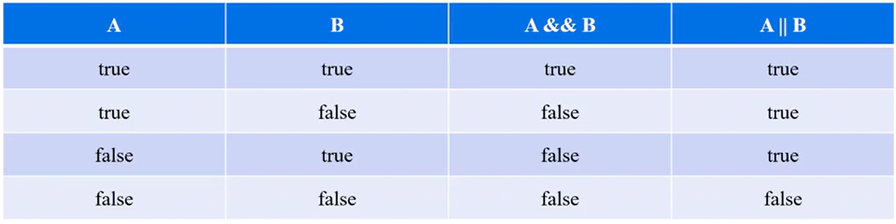

    ```js
    console.log(true && false); //false
    console.log(true && true); //true
    console.log(false && false); //true
    console.log(true || false); //true
    console.log(true || true); //true
    console.log(false || false); //false
    ```

    - `&&`: A,B are both then `A&&B` is true
      - If the left hand side is true, then it evaluates as the right hand side.
      - If the left hand side is not true, then it evaluates as the left hand side.
      ```js
      console.log(3 && 5); //true
      console.log(0 && -100); //0
      ```
    - `||`: A,or B is time, `A||B` is time.
      - If left hand side can be converted to true, returns left hand side;else, returns right hand side.
      ```js
      console.log(6 || 100); //6
      console.log(NaN || 100); //100
      ```
    - 我們可以把 comparison operator 運算出的結果，變成 Logical operator 的運算元，讓他們做 Logical operator

    ```js
    console.log(5 > 3 && 100 > 99); //true
    console.log(3 == 6 && 100 > 99); //false
    ```

  - typeof operator(unary): `typeof`
  - negation operator (unary): `!`
  - increment operator(unary): `++`,`--`
  - bitwise operator: 將數字的 operand 視為 32 bits 的數字，並且對每個 bit 進行運算。

    - `a&b`: 在兩個 operand 的對應都是 1 的位置返回一個 1。

    ```js
    let a = 10; //1010
    let b = 9; //1001
    console.log(a & b); //8  => 1000
    ```

    - `a|b`: 在兩個 operand 的對應都是 0 的位置返回一個 0

    ```js
    let a = 10; //1010
    let b = 9; //1001
    console.log(a | b); //11  => 1011
    ```

    - `a^b`: 在兩個 operand 的對應位相同的每個位置返回 0。(XOR 運算)

    ```js
    let a = 10; //1010
    let b = 9; //1001
    console.log(a ^ b); //3  => 0011
    ```

    - `~a`: 反轉 operand 的每個 bit。

    ```js
    let a = 10; //1010
    let b = 9; //1001
    console.log(~a); //5  => 0101
    console.log(~b); //6  => 0110
    ```

    - `a<<b`: 將二進制表示中的 a 向左移動 b 位，丟棄任何被移出的 bits。

    ```js
    let a = 10; //1010
    let b = 9; //1001
    console.log(a << b); //5120  => 1010000000000
    console.log(a << 1); //20 => 10100
    ```

    - `a>>b`: 將二進制表示中的 a 向右移動 b 位，丟棄任何被移出的 bits。

    ```js
    let a = 10; //1010
    let b = 9; //1001
    console.log(a >> b); //0  => 0
    console.log(a << 1); //5 => 101
    ```

    - 何時會用到 Bitwise Operators?

      1.  做編碼運算
      2.  資料傳出，sockets programming ports
      3.  資料加密、SHA 函數
      4.  作業系統、CPU
      5.  Finite State Machine
      6.  Graphics,例如影像處理、人工智能

    - 補充:

      - 在十進位系統中，可用數字集合是:{0、1、2、3、4、5、6、7、8、9}，當我們屬到十後沒有數字可以用，因此我們會進位，也就是使用兩位數字，把 1 放在前面 0 在最後然後繼續數
      - 在二進位系統中，可用的數字集合是 {0,1}，當我們要屬 2 時沒有得數，因此我們會進位，把 1 放在前面 0 放在後面

      - 從 Decimal 到 Binary 映射可以顯示在一個表中:

      | Binary | Decimal |
      | ------ | ------- |
      | 0      | 0       |
      | 1      | 1       |
      | 10     | 2       |
      | 11     | 3       |
      | 100    | 4       |
      | 101    | 5       |
      | 110    | 6       |
      | 111    | 7       |
      | 1000   | 8       |

      - [轉換網址](https://www.rapidtables.com/convert/number/binary-to-decimal.html)

  - arithmetic operator:
    - `+`: 兩數相加
    - `-`: 兩數相減
    - `*`: 兩數相乘
    - `/`: 兩數相除
    - `+=`: 單數加值
    - `-=`: 單數減值
    - `/=`: 單數除值
    - `*=`: 單數乘值
    - `**`: 次方
    - `%`: 取餘數

# 第六章 if statement

> if 語句是最簡單的決策語句。他用於決定是否執行某個語句或語句塊，即如果某個條件為真，則執行一個語句塊，否則不執行。If statement 的語法如下:

**condition 通常為 Boolean**

```pseudocode
if(condition) statement1;

if(condition){
  statement1;
}else{
  statement2;
}

if(condition1){
  statement1;
}else if(condition2){
  statement2;
}
...
else{
  statementN
}
```

```js
if (true) console.log("This is true."); //可省略括號
if (5 > 3 && 6 < 10) console.log("This is true.");
```

```js
if (5 > 3 && 6 > 10) {
  console.log("This is true.");
} else {
  console.log("This is false.");
}
```

```js
let age = 12;
if (age < 18) {
  console.log("Children");
} else if (age <= 18 && age > 65) {
  console.log("Adult");
} else if (age >= 65) {
  console.log("Elderly");
}
```

```js
let age = Number(window.prompt("please enter your age")); //convert string to number
if (age <= 12) {
  window.alert("The price is NT$100.");
} else if (age >= 12 && age < 65) {
  window.alert("The price is NT$250.");
} else if (age >= 65) {
  window.alert("The price is NT$150.");
} else {
  window.alert("Please enter number!");
}
```

> Truthy and Falsy Values

- 在 JavaScript 中，每個值(Data Type)在 Boolean context 之下，都可以被視為 true 或是 false。
- 常見的 Boolean context:
  - if statment
  - Logical Operators 運算
    - `&&`: A,B are both then `A&&B` is true
      - If the left hand side is true, then it evaluates as the right hand side.
      - If the left hand side is not true, then it evaluates as the left hand side.
    ```js
    console.log(3 && 5); //true
    console.log(0 && -100); //0
    ```
    - `||`: A,or B is time, `A||B` is time.
      - If left hand side can be converted to true, returns left hand side;else, returns right hand side.
      ```js
      console.log(6 || 100); //6
      console.log(NaN || 100); //100
      ```
- 在 Boolean context 之下，JavaScript 會自動幫每個值做 type coercion。
- 在 JavaScript 裡面所有 Falsy Values 為下面這幾項，其他都是 truthy value，包含[]empty array,{}empty object 等等:

  - false
  - 0,-0,0n(BitInt)
  - "",'',``(所有的 empty string)
  - null
  - undefined
  - NaN

  ```js
  let x = 0;
  if (x) {
    console.log("x is true");
  } else {
    console.log("x is false");
  }
  ```

  ```js
  let x = null;
  if (x) {
    console.log("x is true");
  } else {
    console.log("x is false");
  }
  ```

  ```js
  let x = "";
  if (x) {
    console.log("x is true");
  } else {
    console.log("x is false");
  }
  ```

  ```js
  let x;
  if (x) {
    console.log("x is true");
  } else {
    console.log("x is false");
  }
  ```

# 第七章 Codeing Convention and Restrictions

> JavaScript 中的 coding 習慣(Convention)是:

1. 變數與函數的名稱，全部小寫，若名稱由兩個以上的單字組成，則使用 camelCase。(或也可使用 underline)
2. Operators 周圍加上空白鍵
3. 用分號結束一個簡單的 statement
4. Constants 全部使用大寫。
5. Class 由大寫字母開頭

> JavaScript 中的 coding 限制(Restrictions)是:

1. 變數、函數名稱
2. 變數、函數名稱不包含 hyphen。Hyphen 已經預留給數字做減法運算
3. 變數、函數名稱不可使用 reserved words。

# 第八章 JavaScript Function

> JavaScript 的函數類似於數學的函數

```math
f(x) = 3x+6
```

> `f` 這個字母是此函數的名稱，`x` 是此函數的參數(parameter)，然後 `3x+6` 是函數的輸出值

> 函數應該只返回一個值(如果一個輸入導致兩個不同的輸出，那就不是一個函數)，函數可以多對一，但不能一對多

> 在結帳時只能一個條碼對一個價格，也可以很多個條碼對同一個價格，但卻無法一個條碼對多種價格

**在`f(x) = 3x+6`當中，x 稱作是 parameter。當使用 f(5)時，數字 5 被稱作是 argument**

[desmos graphing](https://www.desmos.com/calculator)

> 除了 JavaScript 內建的 function 之外`[alert(),prompt()]`，我們可以定義或客製化自己的 function。
> Function 由一連串的程式碼組成，用來完成任務或是計算值。

- 宣告(declare)一個 Function 的語法為:

```
function name([param[,param[,param]]]){
  statement
}
```

```js
//declaration, definition
function f() {
  cnsole.log("This is my first function.");
}
// function exection, invoke a function,function invocation, call a function
f();
```

```js
function sayHi(name, age) {
  console.log(`Hi, My name is ${name}`);
  console.log(`I am ${age} years old.`);
}
sayHi("Joan", 35);
```

**return of function**

- JavaScript Function 中，若沒有 return 語句的 function 將返回 undefined(這是 JavaScript 的 function 默認的 return value)。要返回默認值以外的的值，需要用到 return 語句

- return 語句結束函式執行並指定要返回給函數調用者的值。任何放在 return 語句底下的程式碼都不會被執行

- Function 執行、調用的英文是 function call、function execution 或是 function invocation

**每個 JavaScript 還樹實際上都是一個物件。(代表每個 function 有 instance properties 以及 instance methods)**

```js
function circle1(r) {
  console.log(r * r * 3.14); //314
}
console.log(circle1(10)); //undefine

function circle(r) {
  return r * r * 3.14;
  console.log("finished"); // It will not be displayed
}
console.log(circle(10)); //314
```

> Celsius to Fahrenheit

```js
function convertor(c) {
  return c * 1.8 + 32;
}
let input = Number(prompt("Please enter the temperature(°C)"));
let result = convertor(input);
alert(`The converted temperature is ${result} °F`);
```

**Function 的時間複雜度**

> 在電腦科學中，演算法的時間複雜度(Time complexity)可以描述該演算法的執行時間。時間複雜度常用大 O 符號(Big O Notation)表述，不包括這個函式的低階項和首項係數。

> 例如，如果一個演算法對於任何大小為`n`(必須比 n0 大)的輸入，它需要 5n^3+3n 的時間執行完畢，那麼它的漸進時間複雜度是 O(n^3)。

    - 3n 為低階項所以不予領會，5n^3 的 5 為首項係數，所以也不理會，因此時間複雜度才會為 O(n^3)
    - 若參數變為原本的十倍，那所需的時間就會變成原本的一千倍

> 為了計算時間複雜度，我們通常會估計演算法的操作單元數量，每個單元執行的時間都是相同的。

**時間複雜度基本概念為當參數變大時，執行這 function 的時間會如何增長**

- 調用函數 f(x),f(10)需要的時間是 5 秒，f(50)需要時間是 125 秒，那 f(x)的時間複雜度就會是 O(n^2)，也就是說參數成長會導致函示成平方倍成長

- 調用函數 g(x),g(10)需要的時間是 5 秒，g(50)需要的時間是 25 秒，那 g(x)時間複雜度會是 O(n)，也就是說參數成長會導致函數成線性成長

- 調用函數 h(x),h(10)需要的時間為 5 秒，但 h(50)需要的時間也是 5 秒，則參數變大 5 被，但時間卻沒有變多，那麼就表述參數的成長和時間沒有關係，因此時間複雜度為 O(1)

```
y = 5n^3+3n
```

> y (縱軸)為執行時間，n (橫軸)為參數，上述式子會發現當 n 增加一點點時，y 所增加的幅度會非常多，可以從下圖中觀察到

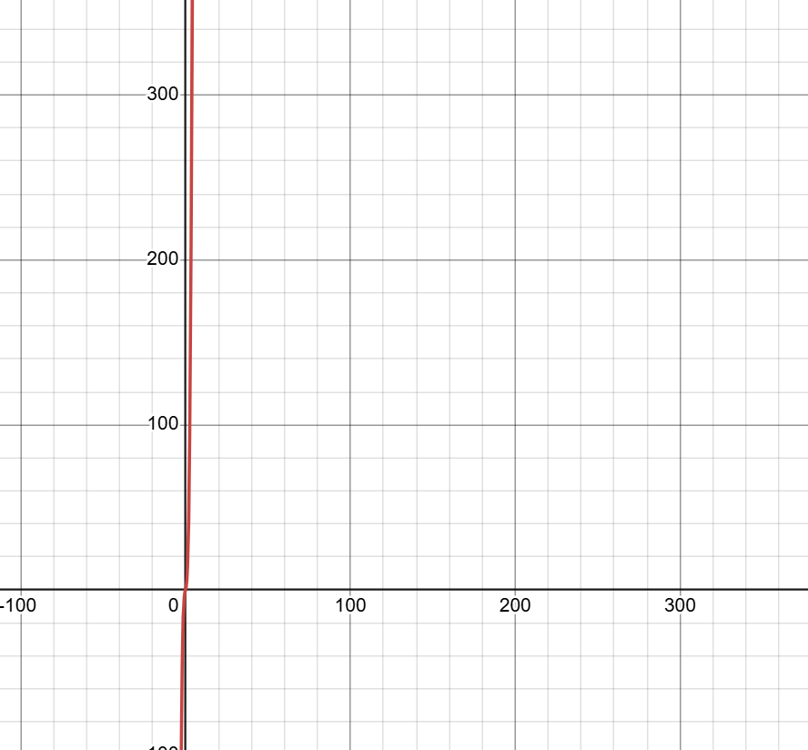

| n(parameter) | y(time) |
| ------------ | ------- |
| 1            | 8       |
| 2            | 46      |
| 3            | 144     |

# 第九章 Array 陣列

**在 JavaScript 中，array 並不是 primitive data type。當我們有需要將用途或性質相近的數據儲存在一起時，Array 即可派上用場。Array 具有以下核心特徵:**

1. JavaScript Array 是可調整大小的，並且可以包含不同資料類型的混合
2. JavaScript Array 中的元素(The value of array)必須使用非負整數作為 index 來訪問
3. JavaScript Array 的第一個元素的 index 為 0，第二個的 index 為 1，依此類推，最後一個元素在 Array 的長度減 1 的處。
4. JavaScript Array 複製會複製 reference

```js
//Original;
let friend1 = "Grace";
let friend2 = "Mike";
let friend3 = "Spencer";
let friend4 = "Esther";
let friend5 = "Slade";

//Array
let friends = ["Grace", "Mike", "Spencer", "Esther", "Slade"];
//the value of array is called element
console.log(friends[0]); //Grace

friends[0] = "Michael";
console.log(friends); //["Michael","Mike", "Spencer", "Esther", "Slade"]

let anotherVariable = friends;
anotherVariable[0] = "Michael";
console.log("friends Array:");
console.log(friends); //["Michael","Mike", "Spencer", "Esther", "Slade"]
console.log("AnotherVariable Array:");
console.log(anotherVariable); //["Michael","Mike", "Spencer", "Esther", "Slade"]

let anotherArray = [null, false, "This is a string", 3.14159, undefined];
```

- primitive data type: copy by value

  - RAM(Random Access Memory)內存中 deposit 和 anotherDeposit 指向的 address 是不同的，所以值並不會被覆蓋。

  ```js
  let deposit = 500;
  let anotherDeposit = deposit;
  anotherDeposit = 600;
  console.log("deposit is", deposit, "anotherDeposit is", anotherDeposit); //deposit is 500, anotherDeposit is 600
  ```

  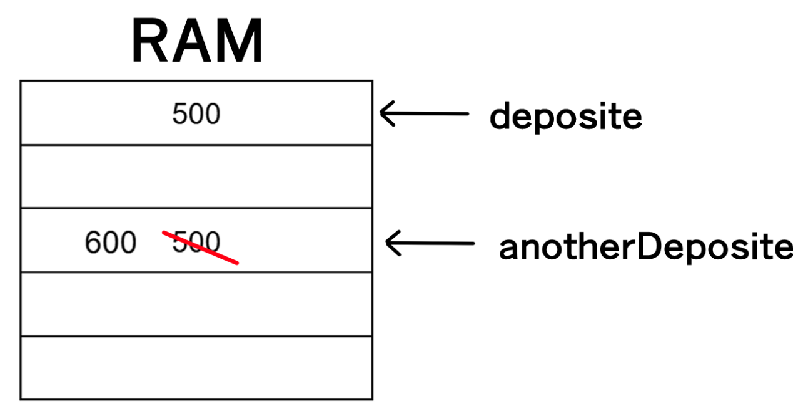

  - comparison operator: 比較所指向的值

  ```js
  let x = 10;
  let y = 10;
  console.log(x == y); //true
  ```

  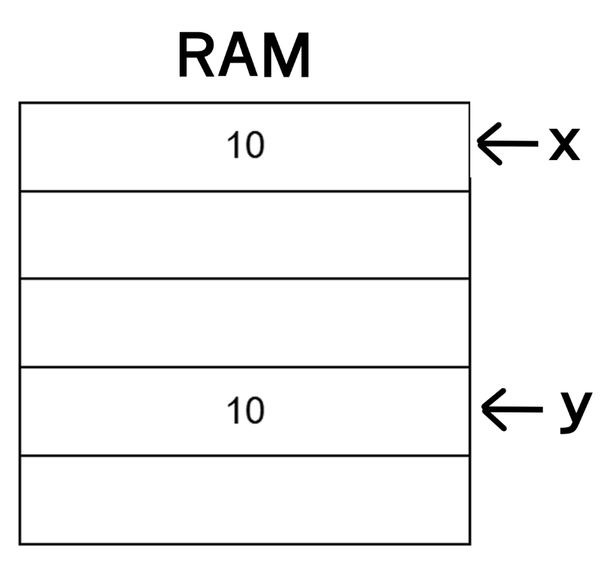

  ```js
  let x = 10;
  let y = x;
  console.log(x == y); //true
  ```

- reference data type: copy by reference

  - RAM(Random Access Memory)內存中 friends 的元素 和 anotherVariable 的元素指向的 address 是一樣的，所以值會被覆蓋。

  ```js
  let friends = ["Grace", "Mike", "Spencer", "Esther", "Slade"];
  let anotherVariable = friends;
  anotherVariable[0] = "Michael";
  console.log("friends Array:");
  console.log(friends); //["Michael","Mike", "Spencer", "Esther", "Slade"]
  console.log("AnotherVariable Array:");
  console.log(anotherVariable); //["Michael","Mike", "Spencer", "Esther", "Slade"]
  ```

  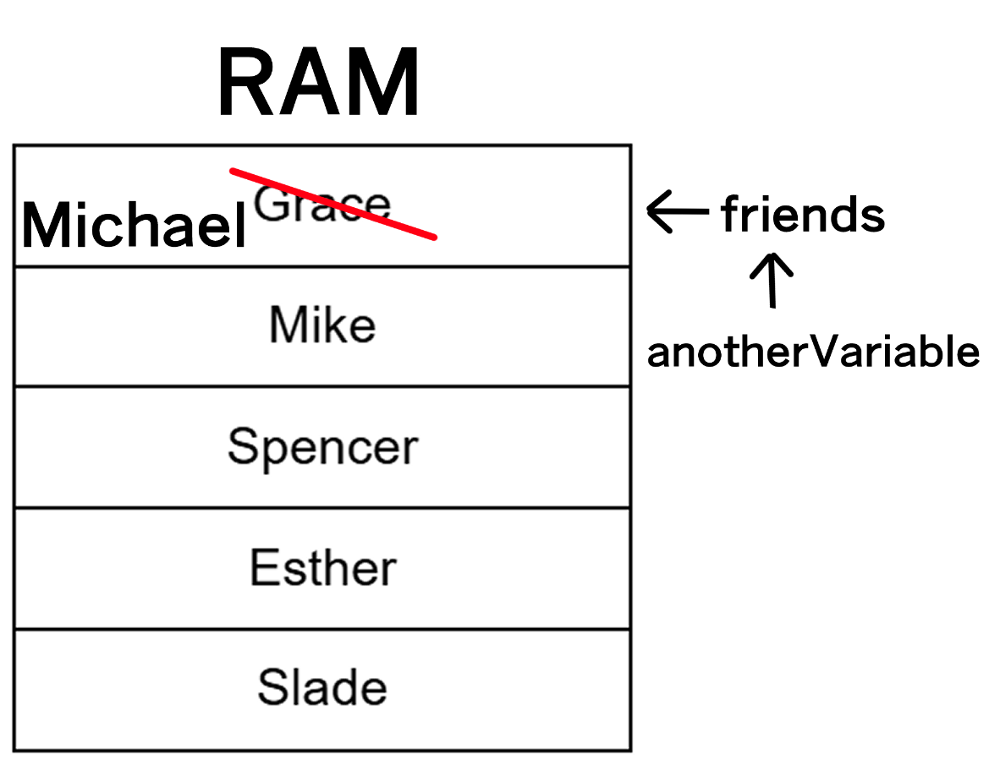

  - comparison operator: 比較所指向的記憶體的地址

  ```js
  let arr1 = [1, 2, 3];
  let arr2 = [1, 2, 3];
  console.log(arr1 == arr2); //false
  ```

  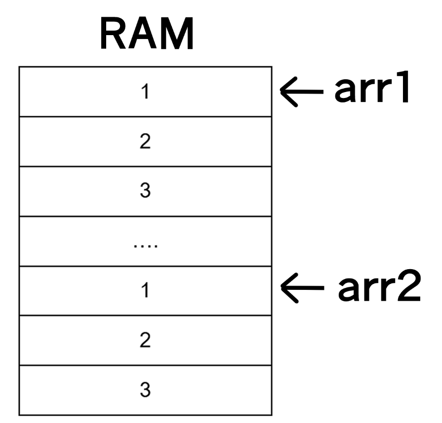

  ```js
  let arr1 = [1, 2, 3];
  let arr2 = arr1;
  console.log(arr1 == arr2); //true
  ```

  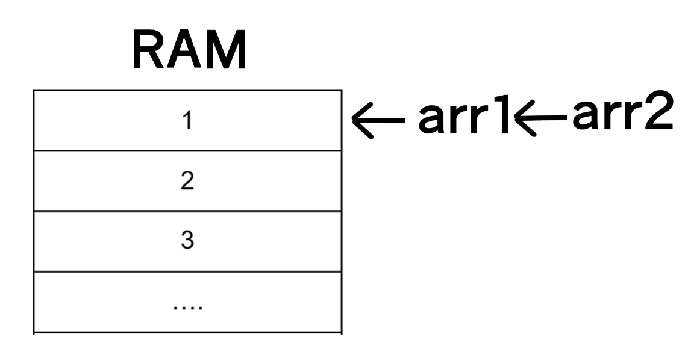

**Array Instance Properties: length**

```js
let friends = ["Grace", "Mike", "Spencer", "Esther", "Slade"];
console.log(friends.length); //5 length is poperties, so it cannot add parentheses
```

常見的 Array Instance Methods:

- push(element): 將一個或多個元素添加到陣列的末尾，並 return 陣列的新長度
  - 時間複雜度為 O(1)，參數的多寡(array 的長度有多少)與執行的時間無關
    - 若 arr1 的元素有 100 個，而 arr2 的元素有 1000000 個，他們同時執行 push()，所花的時間會一樣

```js
let friends = ["Grace", "Mike", "Spencer", "Esther", "Slade"];
const returnValue = friends.push("Jared");
console.log(friends); //["Grace", "Mike", "Spencer", "Esther", "Slade", "Jared"];
console.log(returnValue); //6

const returnValue2 = friends.push("Marry", "Joan");
console.log(friends); //["Grace", "Mike", "Spencer", "Esther", "Slade", "Jared","Marry","Joan"];
console.log(returnValue2); //8
```

[mdn](https://developer.mozilla.org/en-US/docs/Web/JavaScript/Reference/Global_Objects/Array/push)

- pop(): 從陣列中刪除第一個元素並返回該元素
  - 時間複雜度為 O(1)，參數(array 的長度有多少)的多寡與執行時間無關
  - 若 arr1 的元素有 100 個，而 arr2 的元素有 1000000 個，他們同時執行 pop()，所花的時間會一樣

```js
let friends = ["Grace", "Mike", "Spencer", "Esther", "Slade"];
const returnValue = friends.pop();
console.log(friends); //["Grace", "Mike", "Spencer", "Esther"];
console.log(returnValue); //Slade
```

- shift(): 從陣列中刪除第一個元素並返回刪除的元素
  - 時間複雜度為 O(n)(array 的長度有多少)，參數的增加會導致執行時間呈現性增加，因為拿掉第一個元素後，要把剩餘的元素往前移動，所以才導致執行時間呈現性增加
  - 若 arr1 的元素有 100 個，而 arr2 的元素有 1000000 個，他們同時執行 shift()，則 arr2 所花的時間會是 arr1 的 10000 倍

```js
let friends = ["Grace", "Mike", "Spencer", "Esther", "Slade"];
const returnValue = friends.shift();
console.log(friends); //["Mike", "Spencer", "Esther", "Slade"];
console.log(returnValue); //Grace;
```

- unshift(element): 將一個或多個元素添加到陣列的開頭，並 return 陣列的長度
  - 時間複雜度為 O(n)，參數的增加會導致執行時間呈現性增加，因為在增加第一個元素時，需要先把已存在的元素往後移動，所以才導致執行時間呈現性增加
  - 若 arr1 的元素有 100 個，而 arr2 的元素有 1000000 個，他們同時執行 unshift(element)，則 arr2 所花的時間會是 arr1 的 10000 倍

```js
let friends = ["Grace", "Mike", "Spencer", "Esther", "Slade"];
const returnValue = friends.unshift("Jared");
console.log(friends); //["Jared", "Grace", "Mike", "Spencer", "Esther", "Slade"];
console.log(returnValue); //6;

const returnValue2 = friends.unshift("Marry", "Joan");
console.log(friends); //["Marry","Joan", "Grace", "Mike", "Spencer", "Esther", "Slade", "Jared"];
console.log(returnValue2); //8;
```

**當 Array 內部的元素有 Array 時，就被稱為是 array of arrays**

```js
let myArr = {
  ["name","address","age"],
  ["Mike","TWN",35],
  ["Grace","USA",26]
}
console.log(myArr[1][0]);//Mike
```
