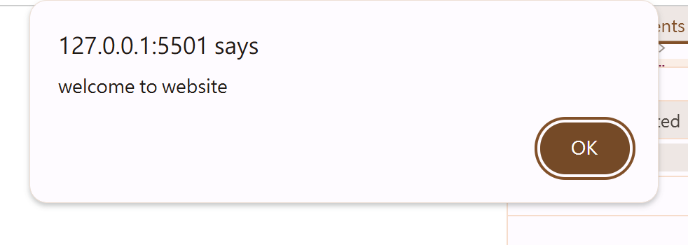

# 目錄

- [第一章 JS 簡介](#第一章-JS簡介)
- [第二章 變數與賦值](#第二章-變數與賦值)
- [第三章 常見 JavaScript 函數和 Lexical Structure](#第三章-常見-JavaScript-函數和-Lexical-Structure)
- [第四章 資料類型 Data Type](#第三章-資料類型-Data-Type)

# 第一章 JS 簡介

**什麼是 JavaScript?**

> JavaScript 程式語言最初的創建是為了"讓網頁活起來"。這種語言的程序稱為腳本(script)。

> JavaScript 可以直接被寫在網頁的 HTML 中，並在頁面加載時自動運行

> JavaScript 本身跟 Java 關連不大。創建 JavaScript 時，他最初有另一個名稱"LiveScript"。但當時 Java 非常流行，因此決定將此新語言定義為 JavaScript。但隨者時間過去與發展，JavaScript 成為一種完全獨立的語言，擁有自己的規範，稱為 ECMAScrip(European Computer Manufactures Association Scrip)，現在他與 Java 完全沒有關係。如同狗跟熱狗的關係。

> Vanilla JavaScript 是指使用純 JavaScript 而不需要任何額外的 library 或框架。常見的 JavaScript library 有 jQuery。因為 JavaScript 本身支援的語法眾多且功能強大，越來越多網站選擇使用純 JavaScript 來製作。

> 每個瀏覽器有自己的 JavaScript 引擎，用來讀取並編譯 JavaScript 程式碼。若要確認某個瀏覽器的 JavaScript 引擎是否有支援某種功能，可參考:https://caniuse.com

**`<script>`放在哪裡?**

> 通常來說，`<script>`會被放在 HTML 頁面的最下方，與 CSS 的`<link>`不同。這是因為將 JavaScript 放在 HTML 正文的底部時，他會在任何 JavaScript 加載之前讓 HTML、CSS 有時間加載。`<script>`被放在 HTML 頁面最下方所以會最後加載

> 先讓瀏覽器可以加載 HTML、CSS，用戶無需等待 JavaScript 被解析完成，即可在網頁中看到某些內容，許多網頁使用者點進網站後，看到內容是空白，持續幾秒的話還是空白就會離開!若想留下更多的使用者，就先讓他們看見文字或圖片，JavaScript 的功能可以慢慢 load up!

# 第二張 變數與賦值

- 變數(variable)和賦值(assignment)是任何程式語言中的一些基本概念。

  - 變數: 一個可以儲存值的容器，由於變數內部的值可以不斷改變，因此被稱為「變數」。

  - 賦值: 在 JavaScript 當中`=`是賦值(assignment)的意思，要把右邊的數據放到等號左邊。

  - 例:

    ```js
    x = 5;
    x = x + 1;
    ```

> 經過執行後，x 的值會變成 6

**語法糖(syntax sugar)支援將`x=x+1`更改為`x+=1`。在這 JavaScript 中極為常見。**

> 在 javascript 中使用變數前需要先宣告變數(declare variable)。

有三個宣告變數的方法:

1. let: 變數的值會變動，只在第一個大括弧內有效

```js
for (let i = 0; i < 10; i++) {
  // console.log(i);
}
console.log(i); //error: i is not defined
```

> i 只會在 for 迴圈被宣告，其他地方會產生錯誤

2. const: 變數的值不會變動

3. var: 與 let 的相同，但請勿使用 var，一旦宣告就對所有的 fun 都有效

```js
for (var i = 0; i < 10; i++) {
  // console.log(i);
}
console.log(i); //10
```

> 此 i 對整個`.js` 都有效

幾個需要特別注意的規則:

1. 用 const 宣告的變數一定要賦予初始值(initializer)，let 則不需要，若 let 宣告了變數，但還沒有復職，則變數的值是 undefined。

2. 用 const, let 宣告過的變數，不能重複宣告。(redeclaration is not allowd)。

❌

```js
let x = 10;
let x = 5;
```

✅

```js
let x = 10;
x = 5;
```

❌

```js
const pi = 3.14;
pi = 3.14;
```

3. const 不能做重複賦值。(reassignment is not allowed)

|       | redeclaration | reassignment | initializer |
| ----- | ------------- | ------------ | ----------- |
| let   | ❌            | ✅           | ❌          |
| const | ❌            | ❌           | ✅          |

**JavaScript 引擎中有一個稱為 garbage collector 的後台程式。它監視所有物件並刪除那些變得無法訪問的物件**

# 第三章 常見 JavaScript 函數和 Lexical Structure

**JavaScript 函數**

> 函數為一個 input 對上一個 output

1. console.log(): 將 message 輸出到 Web 控制台。message 可以是單個 string，也可以是任何一個或多個 JavaScript Object。

```js
console.log("Hello World!");
```


2. window.alert(): 指示瀏覽器顯示帶有可選消息的對話框，並等待用戶關閉對話框

```js
window.alert("welcome to website");
```



3. window.prompt(): 指示瀏覽器顯示帶有可選消息的對話框，提示用戶輸入一些文字，並等待用戶提交文字或取消對話框

```js
window.prompt("please enter your name!");
```


**可連續使用**

```js
let name = window.prompt("please enter your name!");
window.alert(`${name}, Welcome to website!`);
```


**Lexical Structure**

- 類比:
  - 自然語言(Natural Language)
    - 文法(Grammer)
    - 單字(words)
  - 程式語言(Programming Language)
    - 語法(syntax)
    - 被保留單字(reserved words)

> 程式語言 Lexical Structure 是一組基本規則，用於指定如何用該語言編寫程式。它是一種語言的最低級語法: 例如，它指定變量名稱的外觀、註釋的分隔符號以及如何將一個程式語句與下一個程式語句分開。以下為 JavaScript 中的幾個 Lexical Strueture:

1. Case(uppercase, lowercase) Sensitive: JavaScript 中的大小寫是有差別的

2. 空白鍵、換行鍵等等在 JavaScript 當中會全部被忽略。通常來說，放到伺服器上的 JavaScript 程式碼都會被做 minification(刪除空白鍵、換行鍵)。Minification 可少量的減少 JS 檔案大小。

3. JavaScript 的當行註解是`//`，多行則是`/**/`

4. 在 JavaScript 內部的變數名稱需要由文字、underscore(\_)、dollar sign($)當作開頭(不能用數字開頭)

❌

```js
let 02test = 10;
```

5. JavaScript 內部有關鍵字(reserved words,keywords)，例如: null,of,if,then,in,finally,for,while,break,continue,try,let,const,var 等等，不能當作變數名稱

❌

```js
let const = 10;
```

6. JavaScript 使用 Unicode 字元集合，所以 String 內部可由任何 Unicode 文字組成。

7. Semicolons(;)可用來分隔程式語言。Semicolons 的使用是 optional。

# 第四章 資料類型 Data Type

> JacaScript 中有 7 種基本數據類型。這 7 種基本數據類型被稱為 primitive data type。

1. Number: 整數與帶小數點的數字

   - JavaScript 數字格式允許我們精確地表示介於 -9,007,254,740.992(2^-53)和 9,007,254,740.992(2^53)之間的所有整數。
   - 如果大於此整數值，則可能會丟失數字的精度
   - 數字支援的運算符號包含加法、減法、乘法、除法、取餘數(remainder operator)、exponentiation poeration、`++`、`--`、`+=`、`-=`、`/=`、`*=`等等

   ```js
   let x = 10;
   let y = 3;

   console.log(x + y); //13
   console.log(x - y); //7
   console.log(x * y); //30
   console.log(x / y); //3.333

   console.log(x % y); //1
   console.log(x ** y); //x^y 1000

   //x = x + 1, x++ , x+=1
   x++;
   console.log(x); // 11
   x--;
   console.log(x); // 10
   x /= 2;
   console.log(x); //5
   ```

   - Number Methods:
     - JavaScript 是個物件導向(OOP)的程式語言，所以 JavaScript 當中的數字可被視為是物件。以下數字常見可用 methods:
       - toString(): return 一個數字的 String
       - toFixed(n): return 被轉換後的數字，到小數點後第 n 位數。
         - **注意!二進位置不能精確表示所有小數。這可能會導致意外結果，例如:`0.1+0.2 === 0.3`會 return false**

2. BigInt: 任意長度的整數

3. String: 字符串

   - String 由字母或數字串接組成。
   - 需使用單引號或雙引號。
   - 兩個 String 之間的串接是由`+`來完成的。String 之間的串接被稱為 concatenation。
   - String 與 String 之間不能做 `-`,`*`,`/`運算。若嘗試做此類運算，則會出現`NaN`,代表 Not a Number。(這是因為,JavaScript 還會是常是算出某個數字結果，但兩個 operand 的值都不是數字,無法算出一個數計結果,因此會出現`NaN`)
   - String 與 Number 之間，若是做`+`運算則會變成 String 和 String 之間的 concatenation
   - `\n`可以換行

   ```js
   let name = "Joan";
   let sentence = "he's a good guy";
   const first_name = "Joan";
   const last_name = "Hu";

   //+ is not addition,instead,+ is string concatenation
   console.log(first_name + " " + last_name);
   ```

   ```js
   // x data type is number, y data type is a String
   let x = 10;
   let y = "10";
   console.log(x + x); //20
   console.log(y + y); //1010
   console.log(x + y); //1010

   let n1 = 20;
   let n2 = 30;
   let name = "Johnson";
   let n3 = 10;
   let n4 = 15;
   console.log(n1 + n2 + name); //50Johnson
   console.log(n1 + n2 + name + n3 + n4); //50Johnson1015
   console.log("Joan\nHu");
   ```

4. Boolean: true 或 false 兩種值

5. null: 用來代表某個故意不存在的值

6. undefine: 未被賦值的變數，就是 undefined。

7. symbol: unique identifer。

> 除了這 7 種基本數據類型之外，JavaScript 的第八種類型叫做 Object，屬於 non-primitive data type。 JavaScript 中的 object 可能是 array、object 或是 function 等等。
