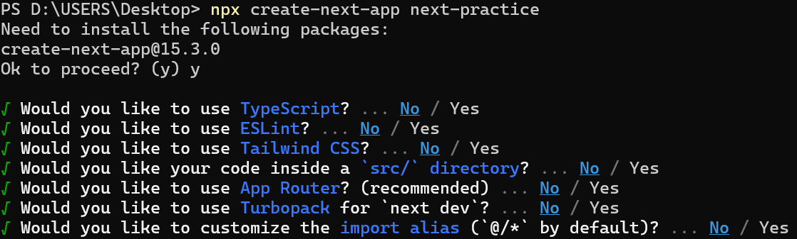
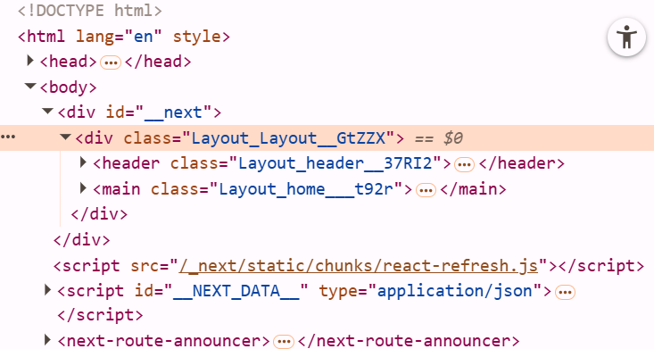
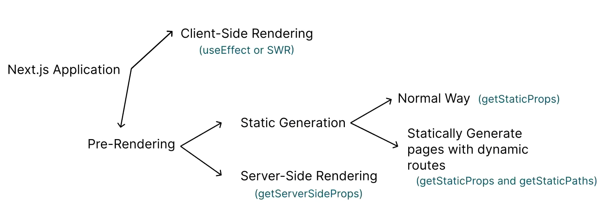

## 目錄

- [介紹](#介紹)
- [選染方式](#選染方式)
- [Routing and Link 標籤](#Routing-and-Link-標籤)
- [Layout 與 metadata](#Layout-與-metadata)
- [CSS Modules 與 App Component](#CSS-Modules-與-App-Component)
- [Nextjs 開發選項](#Nextjs-開發選項)
  - [Client side rendering](#Client-side-rendering)
  - [Pre Rendering](#Pre-Rendering)
    - [static generation with data](#static-generation-with-Dynamic-Routes)
    - [static generation with Dynamic Routes](#Server-Side-Generation-Data)
- [Server Side Rendering](#Server-Side-Rendering)

# 介紹

> Next.js是一個建構於Node.js之上的開源Web開發框架，支援基於React的Web應用程式功能。初始版本於2016年10月25日發佈。Next.js是最流行的React框架之一。

> Beta: 還在被開發測試的功能

Next.js在發佈之前，會經過以下的步驟

1. Compiling: 代碼需要轉換成瀏覽器可以理解的版本。

2. Minifying: Minifying是在不更改代碼功能的情況下刪除不必要的代碼格式和註釋的過程。目標是通過減小文件大小來提高應用程序的性能。

3. Bundling: Bundling是將modules合併(或"打包")的過程，目的是減少用戶訪問網頁時對網頁的請求數量。

4. Code Splitting: 是將應用程序的bundle分為每個end point所需的較小塊的過程。目標是通過僅加載運行該頁面所需的代碼來改進應用程序的初始加載時間。
Next.js內建了Code Splitting的功能。在建構Next.js網站時，pages/目錄中的每個文件都會自動將代碼拆分為自己的JavaScript bundle。此外，不同頁面之間共享的任何代碼也會被拆分到另一個bundle中，以避免在前往另一個頁面時，重新下載相同的代碼。在初始頁面加載後，Next.js也會自動開始pre-loading用戶可能導航到的其他頁面的代碼

優勢:

1. SEO比React本身較好
2. 在Routing上面較方便，有內建的routing
3. Nuxt使用Server-Side Rending，反之Client-side Rendering
4. Deployment版本的效能更好

[官方網站](https://nextjs.org/)

```shell
npx create-next-app <Project-Name>
```



# 選染方式

在React課程當中，我們學過，React的運作方式為，瀏覽器從伺服器接收一個空的index.html文件以及用於建構UI的JavaScript程式碼。渲染頁面內容的工作發生在用戶端的電腦設備上，這被稱為client-side rendering。

在Next.js當中，我們可以設定要使用client-side rendering還是pre-rendering。

pre-rendering有兩種方式:

1. Server-Side Rendering: 對於每個HTTP Request，網頁會重複製作。通常在需要重複向API請求即時資料的網頁會選用此種方法。

2. Static Site Generation: 網頁會被製作一次，並且存放在Content Delivery Network(CDNs)的伺服器上面重複使用

# Routing and Link 標籤

在Next.js當中的Routing規則很簡單:

1. 每個頁面的routes與在pages資料夾內的路徑有關。pages/index.js 是用的是`/`這個route

2. pages/posts/first-post.js 使用的是pages資料夾當中，`/posts/first-post`這個route。

在Next.js當中，開發者會使用<link>標籤當作<a>的替代品(需要import Link form "next/link")。兩者的差別在於:

1. 使用<Link>標籤連結到的新網頁是使用JavaScript加載的，所以只換變更網頁內不需要改變的內容，而不會重整整個網頁。


> 用`<a>`會重整頁面
```jsx
export default function Home(){
  return (
    <div>
      <h1>This is a home</h1>
      <a href="/post/edit-post">編輯post</a>
    </div>
  )
}
```

> 用`<Link>`不會重整頁面
```jsx
import Link from "next/link"
export default function Home(){
  return (
    <div>
      <h1>This is a home</h1>
      <Link href="/post/edit-post">編輯post</Link>
    </div>
  )
}
```

2. Next.js有"prefetching"的功能。每當`<Link>`出現在瀏覽器時，Next.js會自動在後台prefetch`<Link>`頁面的代碼。當使用者點擊`<Link>`時，目標頁面的代碼可能已經在後台加載完成。

**如果我們的網站需要連結到Next.js應用程序之外的頁面(例如連結到YouTube)，使用`<a>`即可**

# Layout 與 metadata

在Next.js當中，使用`<Head>`標籤可以設定網頁的metadata。`<Head>`本身是一個內建在Next.js中的Component，可以用來代替HTML當中的`<Head>`標籤。使用`<Head>`之前，需要先`import Head from "next/head"`

通常會先建立一個`Layout.jsx`，其中裡面放一些有關`<head>`的資訊，並且用`<main>{children}</main>`包裹之後的內容

> `<main>{children}</main>`: 也是所有component都有的

> Layout.jsx

```jsx
import Head from "next/head";
const name = "Joan";
const websiteTitle = "Next.js practice website"
export default function Layout({children}){
  return (
    <div>
      <Head>
        <meta charSet="utf-8"></meta>
        <meta name="viewport" content="width=device-width,initial-scale=1"></meta>
        <meta name="author" content="Joan"></meta>
      </Head>
      <main>{children}</main>
    </div>
  );
}
```

> index.js

```jsx
import Layout from "../components/layout.jsx"
export default function Home() {
  return (
   <Layout>
       <div>
         <h1>This is a home</h1>
       </div>
   </Layout>
   
  );
}
```

> 所有的componet都有一個屬性是`returnBack`，可以根據`returnBack`來決定是否顯示此component

> about.jsx

```jsx
import Layout from "../components/layout.jsx";
export default function Home() {
  return (
   <Layout returnBack={true}>
       <div>
         <h1>This is a about</h1>
       </div>
   </Layout>
   
  );
}
```

> layout.jsx

```jsx
import Head from "next/head";
import Link from "next/link"
const name = "Joan";
const websiteTitle = "Next.js practice website"
export default function Layout({children,returnBack}){
  return (
    <div>
      <Head>
        <meta charSet="utf-8"></meta>
        <meta name="viewport" content="width=device-width,initial-scale=1"></meta>
        <meta name="author" content="Joan"></meta>
      </Head>
      <main>{children}</main>
      {
          returnBack && 
          <Link href="/">Back to Home</Link>
      }
    </div>
  );
}
```

# CSS Modules 與 App Component

Next.js支援CSS Modules的功能。CSS Modules是指，我們可以將CSS文件做成module，並且將樣式套用給特並的Next.js Component。

- Layout.module.css

```css
.header{
  background-color: black;
  color: white;
}
.Layout{
  padding: 3rem;
}
.home{
  color:rgb(64, 64, 196);
  text-decoration: none;
}
```

- index.jsx

```jsx
import Head from "next/head";
import Link from "next/link";
import style from "./Layout.module.css";

const name = "Joan";
const websiteTitle = "Next.js practice website"
export default function Layout({children,returnBack}){
  return (
    <div className={style.Layout}>
      <Head>
        <meta charSet="utf-8"></meta>
        <meta name="viewport" content="width=device-width,initial-scale=1"></meta>
        <meta name="author" content="Joan"></meta>
      </Head>
      <header className={style.header}>
        <h1>{websiteTitle}</h1>
        <h2>author: {name}</h2>
      </header>
      <main >{children}</main>
      {
          returnBack && 
          <Link className={style.home} href="/">Back to Home</Link>
      }
    </div>
  );
}
```

> 要記得引入`import style from "./Layout.module.css"`


CSS Modules當中，文件的命名規則是[name].module.css。此外，CSS樣式套用在Component上時，會自動生成一個獨特的class名稱。此特性可以讓我們避免CSS的命名衝突。



如果我們希望某些CSS樣式套用所有頁面上，我們需要創建一個名為`page/_app.js`的文件。(創建這個文件後，伺服器一定要重新運行。)Next.js會自動套用`_app.js`的樣式到所有頁面上

```jsx
import "@/styles/globals.css";
export default function App({ Component, pageProps }) {
  return <Component {...pageProps} />;
}
```

- globals.css

```css
*{
  padding: 0;
  margin: 0;
  box-sizing: border-box;
}

a{
  text-decoration:underline;
  color: lightblue;
}

```


# Nextjs 開發選項



## Client side rendering

```jsx
import{useEffect,useState} from "react";

export default function Profile(){
  const [data, setData] = useState(null);

  useEffect(()=>{
    const myFunction = async () =>{
      let response = await fetch("http://loaclhost:8080/students");
      let data = await response.json();
      setDta(data);
    };
    myFunction();
  },[])
  return (
    <div>
      {
        data &&
        data.map((d)=>{
          return <p>{d.name}</p>;
        })
      }
    </div>
  )
}
```

## Pre Rendering

### static generation with data

新建一個 `static-generation-with-data.jsx`

- static-generation-with-data.jsx

**名稱一定是getStaticProps()，並且只能存在於pages下面**

```jsx
export async function getStaticProps(){
  const response = await fetch("http://localhost:8080/students")
  const data = await response.json();
  return{
    props:{
      data,
    },
  };
}
export default function StaticGenerationPage({data}){
  return (
    <div>
    {
      data.map(d=>{
        return <h1>{d.name}</h1>;
      })
    }
    </div>
  );
}
```
> `getStaticProps()`一定要return一個物件，物件內的屬性一定需要較做pros，props的屬性會自動被Next.js使用,props屬性會變成下面function的參數

### static generation with Dynamic Routes 

1. Statically Generate pages with dynamic routes: 先從api拿到全部的id放到一個array裡面，根據每個id找到data最後製造出每個頁面

2. Server-Side Rendering: 直接從網址後面拿參數，找出data並且製造出頁面

```jsx
import {useEffect,useState} from "react"
import Link from "next/link"
export async function getStaticProps(){
  const response = await fetch("http://localhost:8080/students")
  const data = await response.json();
  return{
    props:{
      data,
    },
  };
}
export default function ServerSideRendering({data}){
  return (
    <div>
    {
      data.map(d=>{
        return <Link href={`profile/${d.id}`} style={{padding:"2rem"}}>{d.name}</Link>;
      })
    }
    </div>
  );
}
```
> 檔案命名方法跟vite和Nuxt一樣都是`[id]`

- [id].jsx

```jsx
export asyns function getStaticProps(){
  const response =await fetch("http://localhost:8080/students")
  const data = await response.json();
}
```
> 這裡的path一定要符合Next.js要求的格式
> `getStaticProps()`一定要return一個有paths屬性的物件


