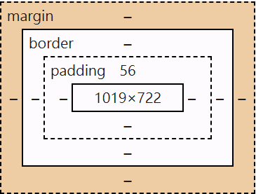
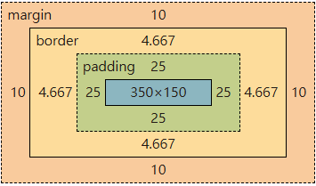
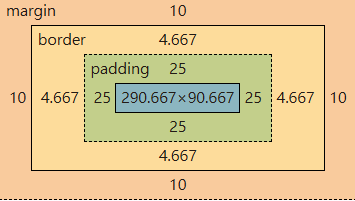
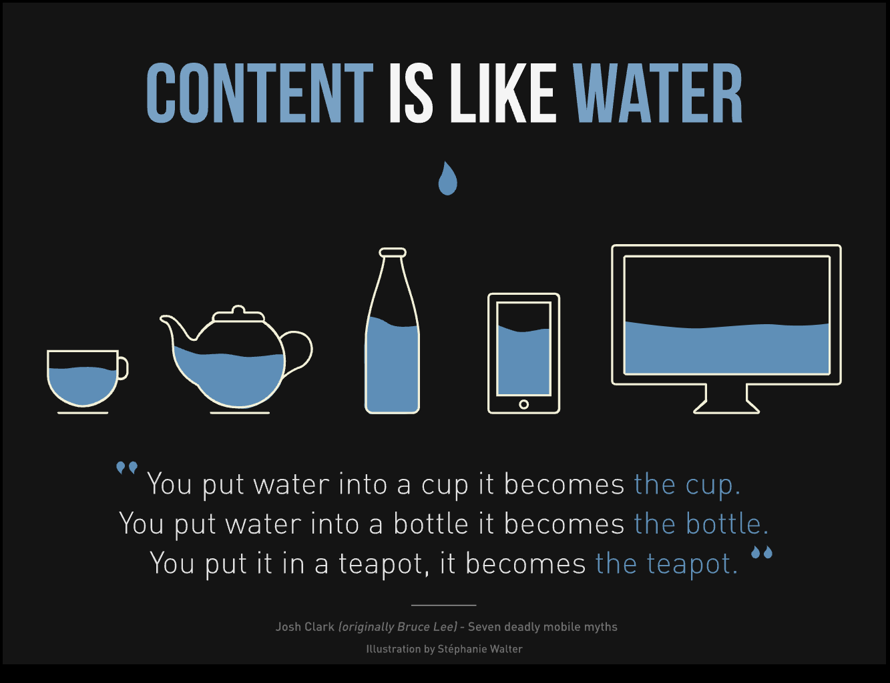
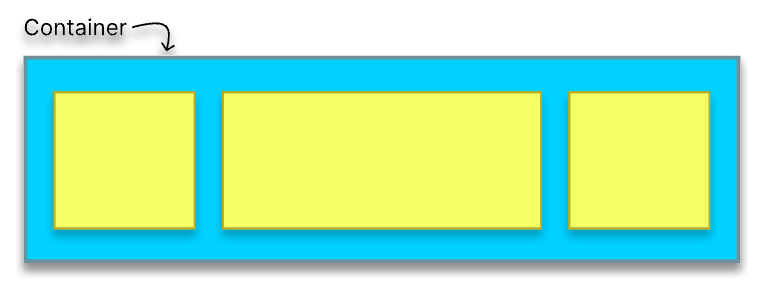

# css

## 目錄

- [第一章 CSS 簡介](#第一章-CSS-簡介)
- [第二章 CSS 放置位置](#第二章-CSS-放置位置)
- [第三章 CSS 顏色設定](#第三章-CSS-顏色設定)
- [第四章 Selectors](#第四章-Selectors)
- [第五章 Pseudo class,element](#第五章-Pseudo-classelement)
- [第六章 CSS 重點概念](#第六章-CSS-重點概念)
- [第七章 文字樣式 text styling](#第七章-文字樣式-text-styling)
- [第八章 背景設定](#第八章-背景設定)
- [第九章 Box Model 基本認識](#第九章-Box-Model-基本認識)
- [第十章 display](#第十章-display)
- [第十一章 position](#第十一章-position)
- [第十二章 Transition](#第十二章-Transition)
- [第十三章 Transform](#第十三章-Transform)
- [第十四章 Animation](#第十四章-Animation)
- [第十五章 響應式網頁設計](#第十五章-響應式網頁設計)

# 第一章 CSS 簡介

**DOM Tree (Document Object Model 文件物件模型)**

是加載到瀏覽器中的網頁的樹狀表示，在 DOM Tree 的 Parent Node 可被稱為 Child Node 的父元素(Parent Element)，反之，Child Node 可稱為 Parent Node 的子元素(child Element)。

瀏覽器加載網頁時，它會創建該頁面的 DOM Tree。

<html>標籤是<head>標籤和<body>標籤的父元素(Parent Element)，反之<html>標籤的子元素(child Element)是<head>標籤和<body>標籤。

```html
<html>
  <head></head>
  <body></body>
</html>
```

**CSS(Cascading Style Sheet) 階層式的樣式表**
被用來設定網頁的樣式及布局。舉例來說，改變字體、顏色、尺寸以及擺放您的內容、拆分為多欄，或是添加動畫效果和其他的裝飾

注意!! 沒有必要了解所有世界上存在的 CSS 屬性!只要認識常用的以及實用的屬性即可!

CSS comment 語法為`/**/`

```html
<style>
  /*selector*/
  h1 {
    color: red;
  }
  h2 {
    color: green;
  }
</style>
```

# 第二章 CSS 放置位置

可以放置三個不同的地方:

1. inline styling

   - 優點: 優先層級最高
   - 缺點: 只能對特定的標籤設定樣式

   ```html
   <h1 style="color: red;">This is h1</h1>
   ```

2. internal styling

   - 優點: 方便撰寫
   - 缺點: 多個 HTML 頁面會難以維護

   ```html
   <html>
     <head>
       <style>
         h1 {
           color: red;
         }
         h2 {
           color: green;
         }
       </style>
     </head>
     <body>
       <h1>This is h1</h1>
       <h2>This is h2</h2>
     </body>
   </html>
   ```

3. external styling(最常用)
   - 優點: 易維護

**style.css**

```css
h1 {
  color: red;
}
h2 {
  color: green;
}
```

**index.html**

```html
<html>
  <head>
    <link rel="stylesheet" href="./style.css" />
  </head>
  <body>
    <h1>This is h1</h1>
    <h2>This is h2</h2>
  </body>
</html>
```

# 第三章 CSS 顏色設定

1. Color Keywords: 這些為 CSS 預定保留的關鍵字，例如: red,black,purple,green,coral 等等。

```css
h1 {
  color: red;
}
h2 {
  color: green;
}
```

2. rgb: 依照光學三原色，分別設定紅、綠、藍三色彩，數值範圍是 0 到 255, 共 256 種不同選擇。每個 color channel 使用 1 byte 來儲存。

```css
h1 {
  color: rgb(0, 0, 0);
}
h2 {
  color: rgb(255, 255, 255);
}
h3 {
  color: rgb(255, 255, 0);
}
```

3. rgba: 同 rgb，但使用多一個叫 alpha 的 channel 來儲存透明度。透明度範圍是 0 到 1。

```css
h1 {
  color: rgba(0, 0, 0, 0.2);
}
h2 {
  color: rgba(255, 255, 255, 0.5);
}
h3 {
  color: rgba(255, 255, 0, 0.7);
}
```

4. hex: 使用十六進制的數字來代表顏色。十六進制數字範圍是 0、1、2、...、9、A、B、...、F。

```css
h1 {
  color: #000000;
}
h2 {
  color: #ffffff;
}
h3 {
  color: #fff000;
}
```

5. HSL: 即色相、飽和度、亮度(英文: Hue,Saturation,Lightness)。這種表示法試圖做到比基於笛卡爾座標系的幾何結構 RGB 更加直觀。

[HSL 與 hex 系統互換](https://coloors86.netlify.app/)

[css 顏色參考](https://developer.mozilla.org/en-US/docs/Web/CSS/named-color)

| Bit 數 | 可能的組合                             | 種類數量 |
| ------ | -------------------------------------- | -------- |
| 1 bit  | 0, 1                                   | 2 種     |
| 2 bits | 00, 01, 10, 11                         | 4 種     |
| 3 bits | 000, 001, 010, 011, 100, 101, 110, 111 | 8 種     |
| n bits | 2 的 n 次方種                          | 2ⁿ 種    |

| Bit Count | Possible Combinations                  | Number of Types |
| --------- | -------------------------------------- | --------------- |
| 1 bit     | 0, 1                                   | 2 types         |
| 2 bits    | 00, 01, 10, 11                         | 4 types         |
| 3 bits    | 000, 001, 010, 011, 100, 101, 110, 111 | 8 types         |
| n bits    | 2 to the power of n                    | 2ⁿ types        |

| Unit                | Conversion  |
| ------------------- | ----------- |
| **1 Byte**          | 8 Bits      |
| **1 KB** (Kilobyte) | 1,024 Bytes |
| **1 MB** (Megabyte) | 1,024 KB    |
| **1 GB** (Gigabyte) | 1,024 MB    |
| **1 TB** (Terabyte) | 1,024 GB    |

8 bits => 1 byte

RAM 8GB (8 Gigabyte)
1 gigabyte = 10 億 bytes

# 第四章 Selectors

- Universal Selector: `*`

  - 匹配任何類型的 HTML element

  ```css
  * {
    color: blue;
  }
  ```

- Element Selector:

  - 可選擇特定的 HTML element

    ```css
    h1 {
      color: blue;
    }
    ```

- ID Selector:

  - 可選擇特有特定 ID 屬性的 HTML element
  - ID 一定要是唯一，不能在一個 HTML 檔案裡有重複

    ```html
    <button id="btnId">click me</button>
    ```

    ```css
    #btnId {
      color: blue;
    }
    ```

- Class Selector:

  - 可選擇特有特定 Class 屬性的 HTML element
  - 可重複利用，一個 HTML 檔案可以有多個重複的 Class
  - 一個標籤裡面可以有多個 class

    ```html
    <button class="btnClass FontSize">click me 1</button>
    <button class="btnClass">click me 2</button>
    ```

    ```css
    .btnClass {
      color: blue;
    }
    .FontSize {
      font-size: 32px;
    }
    ```

- Grouping Selector:

  - 可一次選擇所有數個 HTML 元素，並以逗號分隔

    ```html
    <h1>This is h1</h1>
    <h2>This is h2</h2>
    <h3>This is h3</h3>
    ```

    ```css
    h1,
    h2,
    h3 {
      color: red;
    }
    ```

- Descendant Selector:

  - 由兩個或多個用空格分隔的選擇器組成

    ```html
    <div class="link1">
      <a href="https://www.google.com">Google首頁</a>
      <a href="https://www.youtube.com">Youtube首頁</a>
    </div>
    <div class="link2">
      <a href="../HTML/範例/故宮範例/表單.html">表單</a>
    </div>
    ```

    ```css
    div.link1 a {
      color: red;
    }
    div.link2 a {
      color: green;
    }
    ```

- Attribute Selector:

  - 選擇所有具有相同屬性的 HTML element

    ```html
    <label for="name">name:</label>
    <input type="text" id="name" />
    <label for="phone">phone:</label>
    <input type="text" id="phone" />
    ```

    ```css
    input[type="text"] {
      color: red;
    }
    ```

**Element Selector 和 Class Selector 可以並用**

```html
<button class="btnClass FontSize">click me 1</button>
<button class="btnClass">click me 2</button>
<a class="FontSize"> This is a link</a>
```

```css
a.FontSize {
  font-size: 10px;
}
```

# 第五章 Pseudo class,element

- Pseudo-class: 用於指定所選元素的特殊狀態

  - hover: 可用於在用戶滑鼠懸停在標籤上時更改標籤的樣式。
  - active: 可用於在用戶滑鼠點擊標籤上時更改標籤的樣式。
  - focus: 可用於在用戶滑鼠點擊`<input>`標籤上時更改`<input>`標籤的樣式
  - nth-child(): 可用來選擇第 n 個元素

    ```html
    <label for="name">name:</label>
    <input type="text" id="name"></input>
    <label for="phone">phone:</label>
    <input type="text" id="phone"></input>
    ```

    ```css
    input[type="text"] {
      color: red;
    }
    input[type="text"]:hover {
      color: lightgreen;
    }
    input[type="text"]:active {
      color: blue;
    }
    input[type="text"]:focus {
      color: yellow;
    }
    ```

- Pseudo-element: 添加到選擇器的關鍵字，可讓我們設置所選元素的特定部分的樣式

  - first-line: 可用於更改段落第一行的字體。
  - before: 在標籤前面新增東西。
  - selection:可以改變被選取到的文字的樣式。

    ```html
    <p>This is p1</p>
    <p>This is p2</p>

    <!--lorem+字數+TAB 生成沒有意義的文字-->
    <p>
      Lorem ipsum dolor sit amet consectetur adipisicing elit. Dolor voluptas
      molestias quis ab nemo ullam rem aspernatur laboriosam at dolorem nisi
      totam, vero quaerat et dicta saepe cupiditate aliquid animi adipisci
      corporis optio quibusdam. Nisi est ipsa perspiciatis inventore consectetur
      eos beatae temporibus facere itaque facilis. At facere inventore quidem
      voluptatum sunt est maxime officia optio error, veniam nulla, nihil
      corporis perspiciatis veritatis reprehenderit! Ut mollitia voluptatibus
      porro, aut minima nam quis earum cum et pariatur veniam corporis eos
      consequuntur placeat quos ratione, dolorem deserunt ea officia dicta!
      Alias impedit animi quis delectus magnam error quos atque ut odio
      aspernatur distinctio deleniti, temporibus dolorem quidem. Corrupti
      reprehenderit laboriosam dolorem nemo quam accusamus. Repellendus maxime
      magni odio, deserunt accusantium totam molestiae reprehenderit ea
      praesentium eum similique esse sunt quaerat consectetur ad magnam mollitia
      soluta nihil, illum eveniet non. Tenetur dolore officia blanditiis maxime
      dolorem doloribus inventore dicta enim rem quisquam labore ut, aperiam
      aliquid ex voluptatum, quaerat quis numquam quasi reprehenderit corrupti
      repellat! A, voluptate. Pariatur ut iste laboriosam quasi illo omnis,
      quidem illum asperiores obcaecati, et quo, soluta sint eaque excepturi
      minima tempora molestiae quaerat harum! Ea temporibus voluptatem alias
      omnis tempora ab id facilis mollitia cumque! Iure optio facilis ut
      repellat sint veniam voluptate odit necessitatibus cum fugit, sed quod?
      Expedita temporibus consequatur et, animi necessitatibus nemo, quidem
      porro voluptate quas laudantium voluptatum minima nesciunt officia? Quae
      non nulla quaerat laboriosam architecto quia? Eaque, eligendi eveniet
      quaerat ipsa animi error non aliquid quis consequuntur laudantium quas,
      exercitationem quod. Explicabo quia repudiandae nemo, libero praesentium
      non quam provident! Molestiae dolor ut eaque? Ab pariatur dolore cum
      provident laboriosam quis suscipit! Numquam in enim nemo, asperiores amet
      accusantium debitis quos omnis sunt architecto! Error voluptatibus sit qui
      impedit sunt dolorum, rerum voluptas consequatur exercitationem,
      explicabo, reprehenderit consequuntur accusantium minus autem ut.
    </p>
    ```

    ```css
    p::before {
      content: ">>";
      color: blue;
    }
    *::selection {
      background-color: lightgreen;
    }
    ```

**Pseudo-element(偽元素)的目的在於創造一個 DOM 當中不存在 HTML 元素，我們知道第一行並沒有被任何 TAG 包住，但`::first-line`選取的過程中，就像是用了一個看不到的 TAG 把第一行包住，所以才能選到這行。這就是 pseudo-element(偽元素)的命名原因**

# 第六章 CSS 重點概念

| Order Rule                                       | Description                                                                                                         |
| ------------------------------------------------ | ------------------------------------------------------------------------------------------------------------------- |
| Later styles override earlier styles             | For example, in internal CSS, `p { color: red; }` written later will override `p { color: blue; }` written earlier. |
| Later `<link>` stylesheets override earlier ones | `<link rel="stylesheet" href="style1.css">` will be overridden by `<link rel="stylesheet" href="style2.css">`.      |

**Cascading Style Sheet**

- Inheritance:

  - Parants and Children - 在 HTML 當中的 DOM Tree 中，Parant Node 可被稱為 Child Node 的父元素，反之，Child Node 可稱為 Parant Node 的子元素。
  - Inheritance and Non-inheritance Propetries: CSS 當中的某些屬性會被子元素繼承，而某些不會
  - 會繼承的屬性:

    - color
    - font-family
    - font-size
    - font-weight
    - list-style-type
    - text-align
    - [更多相關屬性請查閱](https://www.w3.org/TR/CSS21/propidx.html)

    ```html
    <body>
      <h1>國立故宮博物院</h1>
      <h2>簡介：</h2>
      <p>
        國立故宮博物院，簡稱<strong>臺灣故宮</strong>或臺北故宮（博物院），別名中山博物院，為臺灣最具規模的博物館以及臺灣八景之一，也是古代中國藝術史與漢學研究機構。館舍位於臺北市士林區，一年可接待超過614萬人次的參訪旅客，曾位列2015年全球參觀人數第六多的藝術博物館。
        國立故宮博物院是隸屬於中華民國行政院的中央二級機關，故宮院長為特任官，視同部會首長。它的前身是成立於京兆地方（今北京）紫禁城外廷的古物陳列所，1925年10月10日在紫禁城內廷另外組織了故宮博物院，後來因為抗日戰爭爆發輾轉遷移至南京市和四川省等地，古物陳列所於第二次世界大戰後裁撤併入國立中央博物院籌備處。隨後第二次國共內戰衝突導致時局再陷動盪，包括國立北平故宮博物院在內的6個機構於是在1948年11月10日決定遷往臺灣，幾經改組易名，最終由國立北平故宮博物院和國立中央博物院籌備處合併為國立故宮博物院，1965年11月12日在臺北現址復院開幕。此後，博物館致力打造成為文化創意產業加值應用的虛擬博物館，館舍也歷經多次整修擴建。
      </p>
      <h2>故宮文物：</h2>
      <p>
        國立故宮博物院典藏為數近70萬件文物與藝術作品，大部分是原先國立北平故宮博物院、國立中央博物院籌備處和國立北平圖書館等機構所藏來自紫禁城、盛京行宮、避暑山莊、頤和園、靜宜園和國子監等處皇家舊藏；另有部分是編列預算購置，接收自第二次世界大戰結束日本歸還部分文物，以及透過各界捐贈和徵集而來。藏品時間跨度涵蓋新石器時代至今長達8,000年，各類藏品分別交由器物處、書畫文獻處和南院處等3個策展部門管理，當中以長篇銘文的青銅器、古代早期的名家書畫、善本古籍和官窯瓷器等蒐藏最具影響力。展廳內是按照文物類別以編年方式系統性地陳設7,000件展品，器物類展件相隔半年至2年輪換一次，書畫和圖書文獻類展件為每3個月定期更換。
        故宮三寶：故宮三寶一般是指臺北國立故宮博物院蒐藏的范寬〈谿山行旅圖〉、郭熙〈早春圖〉和李唐〈萬壑松風圖〉等三幅北宋巨碑式水墨畫。近年亦有將〈翠玉白菜〉、〈肉形石〉和〈毛公鼎〉合稱之說法。
      </p>
    </body>
    ```

    ```css
    body {
      color: red;
    }
    ```

  - 注意優先度，user agent styling > inheritance，所以要注意瀏覽器的預設樣式可能會覆蓋繼承的屬性
    - <a> tag 的顏色通常需要額外設定

- Conflicting Styling:

  - 由於一個 HTML 文件可以連結到數個 CSS Stylesheet，且單一 Stylesheet 內部可能出現重複設定樣式的情況，所以 css 程式碼之間可能存在衝突
  - 衝突處理原則有:

        - Priority (優先度)

          - 根據 W3C 標準，網頁瀏覽器的預設樣式被稱為 **User Agent Stylesheet**，而開發者定義的樣式則被稱為 **User Stylesheet**。優先級 (Priority) 順序如下：


        - Specificity (特定度)

          - 當一個標籤有多個 CSS 選擇器應用時，會選擇 **特定度 (Specificity) 更高** 的樣式，而不考慮順序。


          - **具體程度**: `id > class > tag`

        - Order Rule (順序性)

          - 當選擇器的 Specificity 相同時，**後寫的樣式會覆蓋前面的樣式**。例如:

          ```css

          p {
          color: blue;
          }
          p {
          color: red;
          } /_ 這條規則會覆蓋前面的 _/
          ```

<!-- - Priority(優先度)

          - 根據 W3C 的標準，網頁連覽器的預設樣被稱為 user agent stylesheet，而網頁瀏覽器連結的 stylesheet 被稱為 user stylesheet。Pority 優先即順序為:

          1.  inline Styling
          2.  User Stylesheet(內部順序由 Specificity 決定)
          3.  User Agent Stylesheet
          4.  Inheritance

        - Specificity(特定度)

          - CSS Selector 有不同的 Specificity(特定度)，當一個標籤有兩個具體度不同的 CSS Selectoor 時，它會取更 specific(具體)的樣式並套用於標籤上面，而不考慮順序前後

          > 1 被放在前面越重要，放後面越不重要

          1.  id -specificty(1,0,0)
          2.  class -specificty(0,1,0)
          3.  tag -specificty(0,0,1)

          - specific(具體)程度: id>class>tag

        - Order Rule(順序性)
          - 當我們有相同specificty的選擇器時，後寫的選擇器樣式會覆蓋前面寫的樣式。
          - 放在比較後面的<link> stylesheet會複寫放在前面的<link> stylesheet -->

**user styling(stylesheet) 和 user agent styling(stylesheet)**

- user styling: 程式設計師對網頁設計的樣式
- user agent styling: 瀏覽器預設樣式，非程式設計師設計的

**cascading styleseet: 下面的設定會覆蓋到上面的設定**

```css
h1 {
  color: red;
}
h2 {
  color: red;
}
h1 {
  color: blue;
}
```

# 第七章 文字樣式 text styling

- font-size: 設定字體的大小。可以設置絕對單位或是相對單位
  - [預設字體大小](https://www.w3schools.com/cssref/css_default_values.php)
- text-align: 設置 block element 或 table cell 中的 content 的水平對齊位置
  - center: 中間對齊
  - right: 往右對齊
  - left: 往左對齊(預設)
- text-decoration: 設置文本上的裝飾線的外觀
  - <a> tag 預設 underline
  - line-through
- line-height: 通常用於設置文字行距
- letter-soacing: 設置文自水平間距
- font-family: 為所選元素指定一個或多個字體系列的優先順序
  - [Google font](https://fonts.google.com/)
  - 從 google font 拿來的網只要貼在 引入自己的 stylesheet 的上方
- text-indent: 設段落的內縮長度 (寫文章開頭要空兩格字的大小)
- font-weight: 文字粗體設置

**css 單位:**

1. Absolute units: 只有預設數值或是現實生活定義的單位，包含 px(代表 pixel，長度為 2.54cm (1 inch)的 1/96), in,mm,cm 等等

2. Relative units 是指相對於某種數值的單位，包含:

- em: 相對於 parent element 的長度。多層的 DOM Tree 當中，越下層的 element 的 em 值可能難以計算，所以在 css 當中會必免使用 em；例:如果 paraent element 的長度為 50px，那 children element 的 1em 就會是 50px，2em 為 100px，0.5em 為 25px。
- rem: root rem 的意思。rem 會找到<html>這個元素的設定。網頁瀏覽器的預設 font-size 為 16px，所以 1rem 等於 16px。如果年長者使用的網頁瀏覽器設定字體放大，則網頁瀏覽器預設 font-size 可能為 24px，則 1rem 等於 24px。
- vw: viewport width 的縮寫，是指目前 viewport(也就是瀏覽器視窗)的寬度的 1/100。100vw 長度通常會略寬於網頁寬度，所以設定某個元素的寬度為 100 vw 會導致出現 horizontal scrollbar。
- vh: viewport height 的縮寫，指目前 viewport(也就是瀏覽器視窗)的高度的 1/100。
- %: percentage 代表相對於 parent element 的值。例如，parent element 的 width 是 500px，在 child element 設定 50%則 children element 寬度就是 250px

**單位表單整理**

| 單位 | 說明                                                                                                                                                                                                 |
| ---- | ---------------------------------------------------------------------------------------------------------------------------------------------------------------------------------------------------- |
| em   | 相對於 parent element 的長度。在多層 DOM Tree 中，越下層的 element 的 em 值可能難以計算。；如果 paraent element 的長度為 50px，那 children element 的 1em 就會是 50px，2em 為 100px，0.5em 為 25px。 |
| rem  | root em 的意思。rem 會參照 `<html>` 元素的設定。瀏覽器的預設 `font-size` 為 `16px`，所以 `1rem = 16px`。如果使用者修改了瀏覽器的字體大小，例如設為 `24px`，則 `1rem = 24px`。                        |
| vw   | viewport width，表示當前 viewport（瀏覽器視窗）寬度的 `1/100`。`100vw` 可能會略大於網頁寬度，若將元素設定為 `100vw`，可能會導致水平滾動條（horizontal scrollbar）。                                  |
| vh   | viewport height，表示當前 viewport（瀏覽器視窗）高度的 `1/100`。                                                                                                                                     |
| %    | 百分比，代表相對於 parent element 的值。例如，若 parent element 的寬度為 `500px`，子元素的 `width: 50%`，則實際寬度為 `250px`。                                                                      |

# 第八章 背景設定

- background-color: 用來設定 HTML 元素的背景顏色，值可以是顏色亦可以是特定關鍵字，例如 transparent

  ```css
  h1 {
    background-color: rgba(200, 200, 200, 0.5);
  }
  h2 {
    background-color: transparent;
  }
  ```

- background-image: 在元素上設置一個或多個背景圖像
  ```css
  body {
    background-image: url("./範例/故宮範例/img/故宮圖片2.jpeg");
  }
  ```
- background-size: 設置元素背景圖像的大小
  - contain: 會在其容器盡可能大地等比例縮放圖像，而不裁剪或拉伸圖像，若容器大於圖像會導致圖像重複平鋪
  - cover: 圖像保持同比例儘可能縮小尺寸以填充容器，即高度和寬度符合容器，不留空白，若長寬比不符合容器會自動進行裁切
  - [mvn background size](https://developer.mozilla.org/en-US/docs/Web/CSS/background-size)
- background-repeat: 設置圖像是否重複
  - no-repeat:不重複
- background-position: 設置每個背景圖像地初始位置。
  - center:使圖像居中
  - top: 圖像往上(超出的下面部分會被裁切但最上面會保留)
  - left: 圖像往左(超出的右邊部分會被裁切但最左邊會保留)
  - bottom: 圖像往底部(超出的上面部分會被裁切但最下面會保留)
  - right: 圖樣往右(超出的左邊部分會被裁切但最右邊會保留)
- background: 背景各種設定的 shorthand 設定，可一次設置所有背景樣式屬性，例如顏色，圖像、圓點和大小或重複的方法
  - background:green 等同於 background-color:green
  - background:url("test.jpg") 等同於 background-image:url("test.jpg")
  - [其他語法設定](https://developer.mozilla.org/en-US/docs/Web/CSS/background)

**[免費商用圖片 unsplash](https://unsplash.com/)**

# 第九章 Box Model 基本認識

**CSS Box Model 是指每個 block element 都被視為一個 box，並且 box 由 margin,border,padding 以及 content 所組成。inline element 僅使用 Box Model 中定義的一部分屬性**



- content: 顯示於內容的區域；使用 width 和 height 等屬性調整大小
- padding: 位於 content 周圍的區域，在 content 與 border 之間；可使用 padding 屬性調整大小
  - 快捷設定(shorthand):
    - 只設定一個值四邊都會應用
    - 設定兩個值，第一個是垂直，第二個是水平
    - 設定三個值，第一個上面，第二個水平，第三個下面
    - 設定四個值，第一個上面，第二個右邊，第三個下面，第四個左邊
  - [其餘 padding 資料](https://developer.mozilla.org/en-US/docs/Web/CSS/padding)
- border: 包住 content 與 padding 的邊框；可使用 border 屬性調整大小
  - 有三個參數可以設定
    - 外框大小
    - [外框的種類](https://developer.mozilla.org/en-US/docs/Web/CSS/border-style)
    - 外框的顏色
  - [其餘 border 資料](https://developer.mozilla.org/en-US/docs/Web/CSS/border)
- margin: border 外的區域，可用 margin 屬性調整大小

**padding、border 以及 margin 都可再分別設定上下左右的個別屬性。另外 border 可以特別設定 border-radius(外框圓滑度) 屬性**

- border-radius 的數值越大越圓滑
- border-radius:50% =>為正圓

```css
h1 {
  border: 1px solid black;
  border-radius:30px
  padding: 10px 30px;
  margin: 0rem 3rem;
}
```

**width 和 height 與 overflow 的屬性**

- width 屬性指定元素的寬度。預設情況下，該屬性定義內容 content 的寬度。但是，如果 box-sizing 設置為 border-box，它會被設定為 border 區域的寬度。

- height 屬性指定元素的高度。預設情況下，該屬性定義 content 區域的高度。但是，如果 box-sizing 設置為 border-box，他會被設定為 border 區域的高度。

**CSS 當中有個非常特別的規定，那就是 width 可以直接設定%，但 height 不行!!!**

> 如果我們希望使用%來設定某個元素的高度的話，我們必須先設定 parent element 高度為某個特定的值，這樣 child element 的%就可以計算出來。例如設定 parent element 高度為 1000px、300vh 等等。

> 另外，在許多的情況下，我們不會去設定某個元素的高度，而是讓瀏覽器根據 content 的內容來決定元素的高度。若有設定高度，則須考慮 overflow 的情況，當元素的寬度或高度小於 comtent 時，我們可以設定 overflow 屬性來選擇處理方式

```html
<!DOCTYPE html>
<html lang="en">
  <head>
    <meta charset="UTF-8" />
    <meta name="viewport" content="width=device-width, initial-scale=1.0" />
    <title>Document</title>
    <style>
      div.box {
        width: 500px;
        height: 50vh;
        /* height: 500px; */
        padding: 10px;
        border: 10px solid black;
        background-color: green;
      }
      div.box2 {
        width: 50%;
        padding: 10px;
        border: 10px solid black;
        background-color: green;
      }
      div.box.innerBox {
        /* height: 50%; */
        background-color: green;
      }
    </style>
  </head>
  <body>
    <div class="box">
      <div class="innerBox"></div>
    </div>
    <div class="box2"></div>
  </body>
</html>
```

**overflow 屬性**

1. visible: content 不會被修剪，可以呈現在元素框之外。此為預設值。
2. hidden: 如果有需要，內容將被剪裁以適合元素。不提供滾動條。
3. scroll:如果有必要，內容將被剪裁以適合填充框。瀏覽器顯示移動軸

> 若想要指定特定方樣的 overflow 屬性，可只選擇 overflow-x 或 overflow-y

**content-box 和 border-box**

1. content-box:意指 padding 與 border 會附加到已經設定的 width 與 height 上面，拓展整個 box model 的大小

   - css 預設的 box-sizing 屬性

   ```css
   .box {
     width: 350px;
     height: 150px;
     margin: 10px;
     padding: 25px;
     border: 5px solid black;
   }
   ```

   > box 實際佔用空間是 410px 寬(350+25+25+10)和 210px 高(150+25+25+10)，margin 不算進 box 的佔用空間，它算外層

   

2. border-box:width 和 height 屬性包括內容(content)，內邊距(padding)和邊框(border)，但不包括外邊距(margin)

```css
* {
  box-sizing: border-box;
}
.box {
  width: 350px;
  height: 150px;
  margin: 10px;
  padding: 25px;
  border: 5px solid black;
}
```

> box 實際佔用空間是 350px 寬，content 寬只有 290px(350-25-25-5-5)，需減去上下 padding 和 border，總高度為 150px 但 content 高只有 90px(150-25-25-5-5)。



[其他 box-sizing 補充](https://developer.mozilla.org/en-US/docs/Web/CSS/box-sizing)

在大多數的網站設定 box-sizing 都會設置為 border-box

```css
* {
  margin: 0;
  padding: 0;
  box-sizing: border-box;
}
```

# 第十章 display

每個 HTML 元素都有兩種 display 類型，一種被稱為 outer display type，另一個是 inner display type。

- outer display type:決定不同 box 之間在網頁的排版位置
  - block :會佔據整行，並且自動換行
    - 例如: `<div>,<p>,<h1>`
  - inline : 內容會在同一行顯示，但不能設定寬度
    - 例如: `<span>,<a>,<strong>`
  - inline-block: 內容在同一行顯示，但可以設定 width 和 height。
    - 例如:`<button>,<input>,`
- inner display type: 決定 boxes 內部的元素在網頁的排版位置
  - flex
  - grid

| display-type | new line | width,height | margin-top/bottom,padding-top/bottom     | margin-left/right,padding-top/right | 範例                                             |
| ------------ | -------- | ------------ | ---------------------------------------- | ----------------------------------- | ------------------------------------------------ |
| block        | 會換行   | 可以設定     | 可以設定                                 | 可以設定                            | `<h1>,<p>`等等                                   |
| inline       | 不會換行 | 不能設定     | 可以設定，但不會推開其他 inlien elements | 可以設定                            | `<a>,<span>`等等                                 |
| inline-block | 不會換行 | 可以設定     | 可以設定                                 | 可以設定                            | 只有`,<button>,<input>,<select>,<textarea>` |
| flex item    | 不會換行 | 可以設定     | 可以設定                                 | 可以設定                            | 任何在 flex 之下的 element                       |

# 第十一章 position

> position 屬性:設置元素在文檔中的定位方式。top、right、bottom 和 left 屬性確定定位元素的最終位置。可設定的值包含:

- static: 元素根據文檔的 normal flow 進行定位。top、right、bottom、left 和 z-index 屬性無效。這是 position 屬性的預設值。

  - 所謂的 css normal flow 是指瀏覽器的正常排版規則，包含 block element 換行，inline elemenet 並排直到沒有空間等等規則
    - **Static 並不是 positioned element**
  - z-index 是指在 stacking context 相同的情況下，positioned element 會具有較大 z-index 的重疊元素覆蓋具有較小的 z-index 的元素。
    - **z-index 只會套用在 positioned element 上面**

- relative: HTML element 根據 normal flow 定位，然後根據 top、right、bottom 和 left 的值相對於自身進行偏移。

  - 所謂的 relative 是指 element is positioned relative to its normal position.

- absolute: 該元素會從 normal flow 中移除，不保留任任何空間。根據 top、right、bottom 和 left 的值相對於自身進行定位，定位的參考對象是 closest positioned ancestor。若不斷往上找，都找不到任何 positioned ancestor，則定位的參考對象是 initial containing block，即瀏覽器的初始視窗。

  - ancestor: parent element，離它最近父元素的 positioned element

- fixed: 該元素會從 normal flow 中移除，不保留任何空間。根據 top、right、bottom 和 left 的值相對於自身進行定位，固定在瀏覽器視窗的固定位置，不會隨滾動捲軸拉動。定位的參考對象是 viewport 形成的 initial containing block

- sticky: 是 relative position 和 fixed position 的混合體。HTML 被視為相對定位，直到它超過指定的 threshold(臨界點)，此時它被視為固定定位。例如:

```css
#one {
  position: sticky;
  top: 10px;
}
```

> 會讓 id 為 one 的元素保持 relative position，直到元素與瀏覽器上方的空間小於 10px。超過指定的 threshold 後，元素會被 fixed 在距離上方 10px 的位置

**這幾種裡面只有 static 不是 positioned element，其他都是 positioned element，只要是 positioned element 都可以使用 z-index**

**z-index 越大，會越上面**

## sticky 和 fixed 比較

> sticky 的範圍會到上一層的父元素，但 fixed 則是參考整個 body(viewport)
> fixed 會在 normol flow 移除(找原先的位置會找不到)，但 sticky 還在原本的位置

## stacking context

Stacking Context 是 HTML 元素沿虛擬 Z 軸相對於用戶的 3D 概念化，假設用戶面向的網頁為 XY 平面，HTML 元素根據元素屬性和優先級順序佔據該空間。

- Stacking context 的形成情況包含(但不限於):
- Root element of the document(`<html>`)
- 任何元素有設定 position 的值為 absolute 或 relative，且 z-index 的值不是 auto，則內部形成新的 stacking context。
- 任何元素有設定 position 的值為 fixed 或 sticky(sticky 適用於所有 mobile browsers)。

[其他資料](https://developer.mozilla.org/en-US/docs/Web/CSS/CSS_positioned_layout/Understanding_z-index/Stacking_context)

## 表格樣式設定

- border-collapse:設置`<table>`內的單元格是否具有共享或單獨的邊框
- 若螢幕太小而無法顯示完整內容，則表格將超出螢幕介面。通常這種問題會發生在手機螢幕瀏覽網頁上。如果要做出響應是表格(responsive table)，我們可以在表格元素周圍添加一個帶有 `overflow-x:auto` 的容器元素，例如:在`<table>`外面建立一個`<div>`標籤，裡面放 `overflow-x:auto`。如此一來，若在手機螢幕瀏覽網頁上表格，就只會表格區域產生 horizontal scrollbar。

[範例](https://codepen.io/JoanHu/pen/zxYOoXq)

## Opacity 與 Cursor 設定

- opacity 屬性設置元素的不透明度。
  - 不透明度是元素背後的內容被隱藏的程度，與透明度相反，可設置的範圍是 0~1
    - 0: 完全透明
    - 1: 完全不透明
    - HTML 元素的 opacity 預設值為 1
    ```css
    h1 {
      opacity: 0.2;
    }
    ```
- cursor 屬性設置屬標游標的不同圖示
  ```css
  h1 {
    cursor: pointer;
  }
  ```
  - [mdn](https://developer.mozilla.org/en-US/docs/Web/CSS/cursor)

# 第十二章 Transition

- transition 屬性可以幫助我們設定某個 CSS 屬性轉換時的 timing function 以及速度。Transition 本身為一個 shorthand property，可以一次設定這四種 CSS 屬性

  - transition-property
  - transition-duration
  - transition-timing-function
  - transition-delay

- 常見的 transition 設定是:
  - property name
  - duration
  - easing function(時間函數)
  - 其他的可用設定請參考 MDN。
- [easing function](https://easings.net/zh-tw)

```css
h1 {
  transition: all 2s;
}
h1:hover {
  background-color: green;
  color: white;
}
```

**若把 transition 設定在 hover 裡面移開後不會有 transition 的效果**

# 第十三章 Transform

> transform 屬性允許我們旋轉、縮放、傾斜或平移 HTML 元素。它修改了 CSS 視覺格式化模型座標空間。每當我們使用一個或多個 Transform 屬性時，瀏覽器都會通過一系列內部矩陣乘法計算 HTML 元素的結果位置、大小和形狀。

- 可設定的值包含:

  - translate:可以把元素拿來做置中

    - 一般使用

    ```css
    div.container {
      width: 500px;
      height: 500px;
      background-color: black;
    }
    div.box {
      width: 100px;
      height: 100px;
      background-color: aqua;
      transition: all 1s ease-in-out;
    }
    div.box:hover {
      transform: translate(-100px, 200px);
    }
    ```

    - 置中

    ```css
    div.container {
      width: 500px;
      height: 500px;
      background-color: black;
      position: relative;
    }
    div.box {
      width: 100px;
      height: 100px;
      background-color: aqua;
      position: absolute;
      top: 50%;
      left: 50%;
      transform: translate(-50%, -50%);
    }
    ```

  - rotate
    ```css
    div.container {
      width: 500px;
      height: 500px;
      background-color: black;
    }
    div.box {
      width: 100px;
      height: 100px;
      background-color: aqua;
      transition: all 1s ease-in-out;
    }
    div.box:hover {
      transform: rotate(90deg);
      transform: rotateX(180deg);
      transform: rotateY(90deg);
    }
    ```
  - scale

    ```css
    div.container {
      width: 500px;
      height: 500px;
      background-color: black;
    }
    div.box {
      width: 100px;
      height: 100px;
      background-color: aqua;
      transition: all 1s ease-in-out;
    }
    div.box:hover {
      transform: scale(1.5);
      transform: scale(0.5);
      transform: scale(2, 6);
    }
    ```

- 每個值都可分別設定 x,y,z 方向的變換

# 第十四章 Animation

> CSS 動畫可由 transition 屬性與 transform 屬性合併設定來完成。然而，若我們希望製作更複雜的動畫，則可使用 CSS 的 animation 屬性來客製化動畫流程。

- 每個 CSS 動畫可設定:

  - animation-name(keyframes): 動畫名字
  - animation-duration: 進行的時間
  - animation-timing-function: 跟 transition 一樣
  - animation-delay: 動畫延遲多久才開始播放
  - animation-iteration-count: 動畫循環幾次
  - animation-direction: 動畫前進方向，順著播放、倒敘播放
  - animation-fill-mode: 動畫結束時 css 屬性長什麼樣子，結束回到開始屬性還是停留在結束屬性
  - animation-play-state

- CSS 的 animation 屬性是個 shorthand property，可一次設定上述多種 animation 相關屬性。設定的順序是:

  - name
  - duration
  - timing-function
  - delay
  - iteration-count
  - direction
  - fill-mode
  - play-state

- 若有跳過設定，則會套用 CSS 的預設值。例如:animation:cross 1s 3s forwards。是指 keyframes 為 cross 的動畫，開頭到結束的時間為一秒，延遲三秒，fill-mode 為 forwards。其餘屬性皆保留為預設值。

```css
@keyframes changeColor {
  from {
    background-color: aqua;
    top: 0px;
    left: 0px;
  }
  to {
    background-color: red;
    top: 400px;
    left: 400px;
  }
}
```

**用法**

```html
<div class="container">
  <div class="box"></div>
</div>
```

```css
div.container {
  width: 500px;
  height: 500px;
  background-color: black;
}

div.box {
  width: 100px;
  height: 100px;
  position: relative;
  background-color: aqua;

  /*套用changeColor動畫*/
  animation-name: changeColor;
  /*兩秒內動畫要完成*/
  animation-duration: 2s;
  /*進網頁兩秒後才開始*/
  animation-delay: 2s;
  /*讓顏色最後停留在紅色*/
  animation-fill-mode: forwards;
  /*設定動畫播放次數*/
  animation-iteration-count: infinite;
  /*設定動畫播放方向*/
  animation-direction: reverse;
  animation-direction: alternate;
}
```

**合併寫法**

```css
div.box {
  animation: changeColor 2s ease-in 2s infinite alternate forwards;
}
```

[範例](https://codepen.io/JoanHu/pen/xbxKyWw)

[mdn](https://developer.mozilla.org/en-US/docs/Web/CSS/animation)

# 第十五章 響應式網頁設計

> 響應式網頁設計(Responsive Web Design)是一種網頁設計的技術，這種設計可使網站在不同的裝置(從桌面電腦顯示器、行動電話、平板或其他行動裝置)上瀏覽時，對應不同解析度皆有適合的呈現，減少使用者縮放、平移和捲動等操作行為。

- 過去的錢端工程師需要針對各種裝置進行不同的設計，但目前主流的響應式網頁設計原則是:
  - Flexbox 來自動排版，不需要再去對不同螢幕寬度做個別設定
  - 元素、圖片皆使用相對單位，如：rem、%、vh、vw 來調整大小，防止他們跑版。
  - 內容物要像水一樣，可以適應所有的容器
    

1.  Flexbox:

    - 現代網頁的布局排版要配合響應式網頁的設計理念，所以需要一種事半功倍的 CSS 寫法。
    - Flexbox 布局背後的主要思想是讓容器能夠改變其項目的寬度/高度(和順序)以最好地填充可用空間(主要是為了適應各種顯示設備和螢幕尺寸)
    - 彈性容器擴展項目以填充可用的可用空間或縮小他們以防止溢出

    [參考內容](https://css-tricks.com/snippets/css/a-guide-to-flexbox/)

2.  Propertise for the Parent(flex container)

    - display: flex 是一種 inner display type
    - 任何定義 display:flex 的元素皆為 flex container，而此元素內部的 HTML 元素皆為 flex item
    - 對於下圖 HTML 元素來說，藍色外在的東西是 flex container， 裡面黃色的是 flex item
      
    - flex item 本身可再定義 display:flex 變成 dispaly container，所以一個 HTML 元素可同時為 flex container 以及 flex item。對於這個 HTML 元素來說，outer display type 是 flex item，inner dispaly type 是 flex

      - flex item: 預設情況下不會換行，可以設定高和寬，也可以設定 margin 和 padding。

             ```html
             <div class="container2">
              <a href="https://www.youtube.com/">youtube</a>
              <a href="https://www.amazon.com/">amazon</a>
              <a href="https://www.google.co.uk/">google</a>
              <a href="https://www.facebook.com/">facebook</a>
              <a href="https://www.tesla.com/">telsa</a>
             </div>
             ```

             ```css
             /*anchor tags outer display type = flex item*/
             div.container2 a{
                background-color:red;
                width:100px;
                height:50px;
              }
              ```

3.  flex container 可設定 display: flex 後，能夠設定的屬性包含：
    - flex-direction
    - flex-wrap
    - justify-content
    - align-items

**Outer display type vs Inner display type**

- Outer display type（外部展示類型）
  - 決定該元素在其父層中的排版方式，例如：
    - block：獨佔一整行，像 `<div>`、`<p>`、`<h1>` 等。
    - inline：不換行，僅佔用內容所需的寬度，像 `<span>`、`<a>` 等。
    - inline-block：像 inline 一樣可以與其他 inline 元素並排，但可以設定寬高。
- Inner display type（內部展示類型）
  - 決定該元素的內部子元素應如何排列，例如：
    - flex：彈性布局，例如 display: flex;。
    - grid：網格布局，例如 display: grid;。
    - block：子元素默認按 block 方式排列（通常適用於 `<div>`）。
