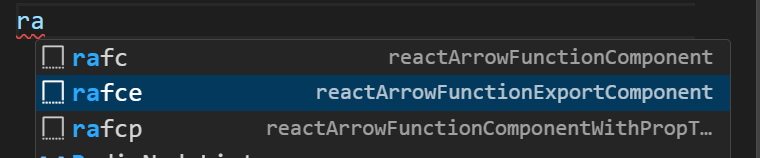
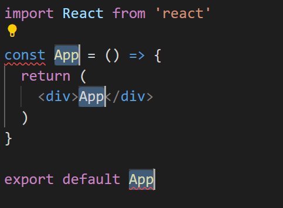
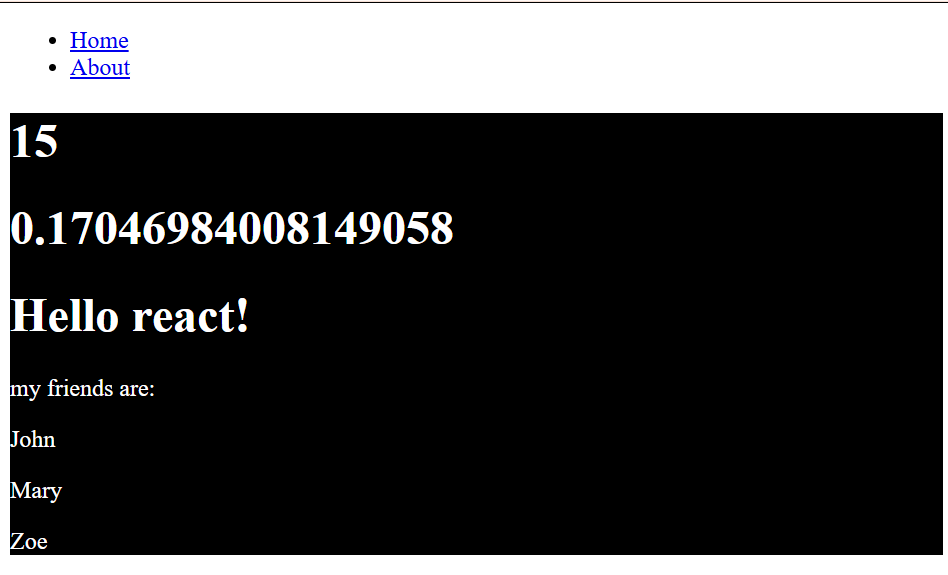
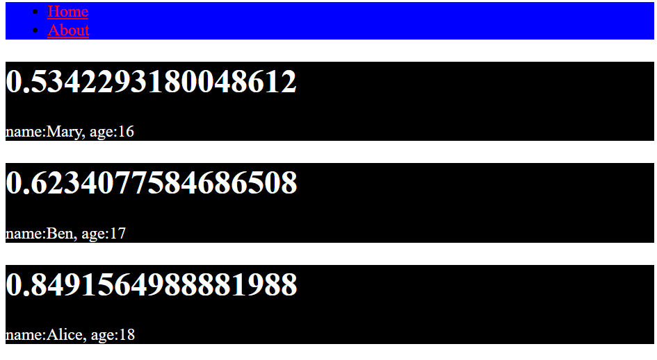
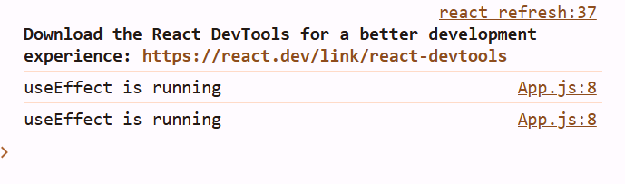
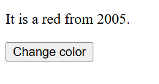
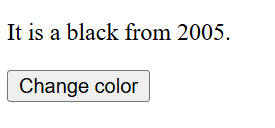
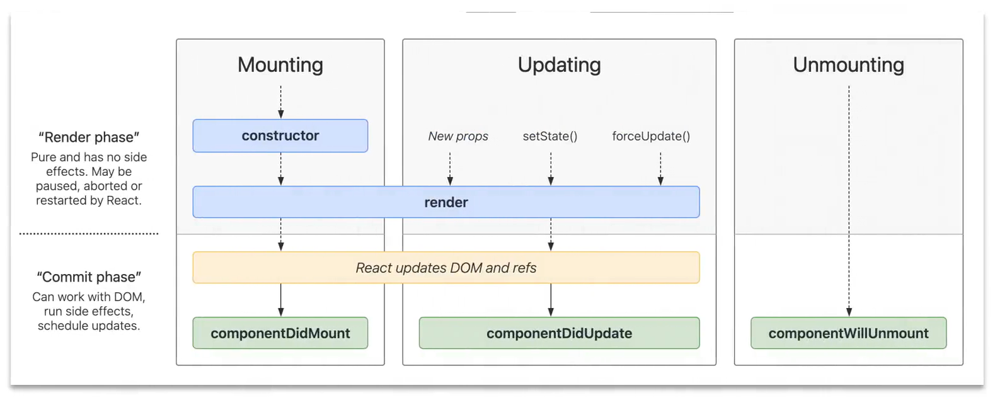

## 目錄

- [SPA](#SPA)
- [React](#React)
- [React 專案環境設定](#React-專案環境設定)
- [JSX](#JSX)
- [Props](#Props)
- [事件處理](#事件處理)
- [State](#State)
- [State Lifting](#State-Lifting)
- [useEffect](#useEffect)
- [Class Component and Life Cycle](#Class-Component-and-Life-Cycle)
- [React Router](#React-Router)

# SPA

> 若我們有一個後端的網路服務(Web Service)已經能夠正常運作且受到保護，只有經過身分驗證和授權的用戶才能調用這個API，則我們可以使用網頁前端的框架來架設網站，並且連結到此API。

> 在大多數的網站上，當我們點擊連結或提交表單時，瀏覽器會向伺服器發出request並下載一個完整的新頁面。我們通常會看到白色閃爍，因為當前頁面消失並加載了新頁面。若使用AJAX技術，我們可以編寫一些在瀏覽器上運行的JavaScript。JavaScript將向伺服器發出request，接收response並使用數據更新當前HTML頁面。正個過程中，只有數據通過網路傳輸，而不是一個全新的HTML頁面。

> 像這樣的頁面，就被稱為Single Page Application(SPA)。

- 優點:

1. 我們減少了伺服器的負載。為每個request生成一個HTML頁面需要大量的處理能力。如果我們的服務器的CPU太忙，我們的網站就會變慢，並可能變成反應遲鈍使我們的網站關閉。在使用網頁瀏覽器時，大多數客戶的CPU(可能有8個或更多)都處於空嫌狀態。因此，我們可以將數據傳到客戶端，讓客戶端的CPU驅動瀏覽器來渲染(render)頁面。

> Client-side rendering

2. 我們還減少了需要通過網路傳輸的數據量，因為只發送新數據，而不是完整的HTML頁面。

**雖然SPA有很多優點，但這並不意味每個網站都應該是SPA。SPA的缺點有:**

1. SPA非常複雜，SPA越大，添加功能越多時，會變得越複雜。最終，複雜性會影響我們網站的性能，並增加BUG出現的機率。

2. 搜索引擎優化(SEO)會出現問題。谷歌和其他搜索引擎自動掃描程式。但是，這些自動掃描程式不會運行JS帶碼來加載數據。因此。搜索引擎無法正確定為我們的網站。

> 市面上有幾個熱門框架可以製作SPA，包括React.js(由Meta開發和使用)、Angular.js(由Google的Angular團隊以及社群共同領導)和Vue.js。

# React

> React(也稱為React.js或ReactJS)是一個免費和開源的前端JavaScript框架，用UI組件來架構使用者介面，它由Meta(以前的Facebook)和個人開發人員社區維護。React可用作於開發SPA網頁。React的基本原理是，用JavaScript來生成HTML。

**React Native是一個Facebook研發的開放原始碼的應用程式框架。React Native開發的程式可用於IOS和Android手機平台。**

**React常與另一個框架Next.js合作使用。**

**因為React還是個相對年輕的框架(初始版本在2013年9越發部)，所以功能上、語法上、套件上都會不斷更新。**

> 使用React好處

1. 可重複使用的組件(Reusable Components)- Component是React的核心架構；使用React建構的每個應用程序的UI，都可以分解為彼此獨立的小部分。這些小部分稱為Components。每一個Components中都有自己的程式邏輯，可以單獨編輯，然而在最終的UI中合併到一起，這使得創建應用程序UI的任務更簡單，更易於管理。Component也可以在其他頁面和應用程序上重複使用，從而節省大量編寫程式的時間。

2. React最有用的特性之一是它能夠更改網站上的Components，而無須更新整個DOM。這是通過虛擬DOM(virtual DOM)完成。虛擬DOM是DOM的虛擬表示(virtual representation)或副本(copy)。

> 每當用戶執行操作時，例如點擊按鈕，React都會更新虛擬DOM，將更新後的與之前的版本進行比較，檢測差異，然後只更新受影響的物件而不是刷新整個DOM。這使的網站反應速度更快、性能更高。

3. JSX代表JavaScript XML，是JavaScript的語法擴展，它允許寫程式的人在JavaScript代碼中，遷入類似HTML語法的程式碼。React的工作就是將JSX換成DOM元素。

## 製作react專案

```shell
npx create-react-app <project-name>
```
- npx: Node Package Execution，是npm內建的功能。Npx是一個npm package運行程序，可以從npm拿到package並且直接執行，甚至無須在電腦上安裝該package。

**現在並不推薦，現在比較推薦的是使用next.js**

- 資料夾與檔案基本的用途如下
  - public folder: 內部放置靜態文件，例如:index.html、JavaScript文件、圖片、favicon.ico和其他檔案等等
    - public資料夾內部的index.html文ˋ建非常重要。用React所製作的Single Page Application當中所使用的單一頁面就是這個index.html文件。
  - src folder: 是React應用程序的核心資料夾，包含Components、index.js、App.js等等文件功能
    - index.js文件的功能是將最主要的React Component渲染到在index.html當中id為root的標籤。
    - App.js文件的功能是，製作「App Component」。App Component的功能是擔任其他所有Component的容器。因為React製作出的網站是一頁式的網站，所以網頁內容會根據URL改變。根據不同的URL去做相對應的route是App.js的責任  
  - node_modules: 目錄包含所有React專案所依賴的packages，例如:react、react-dom等等。   
  - .gitignore: 任何列出的文件或資料夾，都不會被push上GitHub
  - package.json: 用來保存與Project相關的數據，用於管理Project的dependencies、scripts、versions等等。
  - README.md: 為其他開發人員提供了GitHib上的詳細描述。

# React 專案環境設定

1. 可以在settings.json加上

```json
"[javascriptreact]":{
  "editor.defaultFormatter":"esbenp.prettier-vscode"
},
"files.associations":{
  "*.js": "javascriptreact"
}
```

2. 在延伸模組新增
- `ES7+React/Reduc/React-Native snippets`




# JSX

- JSX的功能讓我們可以在JavaScript內部，使用類HTML的程式碼來製作Component。(React並不要求使用JSX，但大部分人覺得在JavaScript程式碼中撰寫使用者介面的同時，這是一個很好的視覺輔助)

- 由於網頁瀏覽器無法理解JSX語法，我們需要先做JSX Transformation。在React Project內部的node_modules資料夾內。可以找到一個資料夾「babel」。Babel是一個JavaScript編譯器，它可以將不是每個瀏覽器都可以理解的最新JavaScript功能轉換為當前和舊瀏覽器或環境中向後兼容的JavaScript版本。Babel在React的功能在於將JSX語法轉換成React Components。

- JSX的特殊語法如下:
1. 我們可以在大括弧{}內編寫expression。
  - 在程式語言中，Statements代表一個動作或是指令，例如打印出某個值或是if statement。
  - Expression是會算出某個值得操作，例如一個變數、數學運算或是執行函數等等。
    - 基本原則是，「An expression is something, while a statement does something.」在JSX當中使用{}可以執行expression本身，並且顯示return value。
2. 在JSX當中，HTML的標籤內，class屬性都需要改叫做className。這是因為class這個字在JavaScript內部是個保留字，所以不能直接寫class。

> 在jsx當中一次只能return一個東西

❌不能一次return`<Nav/>`和`<Info/>`這兩個東西
```jsx
import Nav from "./Nav";
import Info from "./Info";
function App(){
  return (
   <Nav/>
   <Info/>
  );
}
export default App;
```

✅可以return`<div/>`這一個東西
```jsx
import Nav from "./Nav";
import Info from "./Info";
function App(){
  return (
  <div>
   <Nav/>
   <Info/>
  </div>
  );
}
export default App;
```

> expression

```jsx
import React from 'react'
const something = ()=>{
  return "Hello react!"
}
function Info() {
  let friends=["John","Mary",'Zoe']
  return (
    <div>
      <h1>{5+10}</h1>
      <h1>{Math.random()}</h1>
      <h1>{something()}</h1>
      <p>my friends are:</p>
      {
        friends.map(friend=>{
          return <p>{friend}</p>
        })
      }
    </div>
  )
}

export default Info
```


**❌不能用for迴圈，因為for迴圈不會return東西，它不是expression**

```jsx
import React from 'react'
const something = ()=>{
  return "Hello react!"
}
function Info() {
  let friends=["John","Mary",'Zoe']
  return (
    <div>
      <h1>{5+10}</h1>
      <h1>{Math.random()}</h1>
      <h1>{something()}</h1>
      <p>my friends are:</p>
      {
        for(let i=0;i<friends.length;i++){
          <p>{friend}</p>
        }
      }
    </div>
  )
}

export default Info
```


> className

```css
.info{
  background-color: black;
  color: white;
}
```

```jsx
import React from 'react'
import "./style/style.css"
const something = ()=>{
  return "Hello react!"
}
function Info() {
  let friends=["John","Mary",'Zoe']
  return (
    <div className="info">
      <h1>{5+10}</h1>
      <h1>{Math.random()}</h1>
      <h1>{something()}</h1>
      <p>my friends are:</p>
      {
        friends.map(friend=>{
          return <p>{friend}</p>
        })
      }
    </div>
  )
}

export default Info
```



3. 在JSX內做inline-styling時，需要給style屬性一個expression。這個expression內部需要放入一個物件，所以inline-styling的語法會變成style={{}}。其中，外部的大括號是JSX expression語法，內部的大括號是JavaScript物件語法。此外，因為連字號(Hyphen)在JavaScript有特殊意義，所以不能在JavaScript物件的屬性使用聯字號。因此，在CSS中具有連字號的屬性都會被換成camelCase的語法。例如:background-color會需要被寫成backgroundColor。

```jsx
import React from 'react'

function Nav() {
  return (
    <nav style={{color:"red"}}>
      <ul>
        <li>
          <a href="#">Home</a>
        </li>
        <li>
          <a href="#">About</a>
        </li>
      </ul>
    </nav>
  )
}

export default Nav
```


```jsx
import React from 'react'

function Nav() {
  return (
    <nav style={{backgroundColor:"blue"}}>
      <ul>
        <li>
          <a href="#" style={{color:"red"}}>Home</a>
        </li>
        <li>
          <a href="#" style={{color:"red"}}>About</a>
        </li>
      </ul>
    </nav>
  )
}

export default Nav
```


# Props

在React當中，每個Component都可以有自己的屬性(Props,propeties)。Props可以由HTML標籤的attributes傳遞給Component。例如:

```jsx
<Friend name="Jane">
```

若是Props傳遞時，要使用變數，則需要將變數轉換成expression:

```jsx
let myName="Jane";
<Friend name={myName}>
```
Props會透過argument的方式傳遞給Component，所以Component使用Props的語法為:

```jsx
const Friend=(props)=>{
  return(<div><h1>{props.name}</h1></div>);
}
```
或是，我們也可以使用object destructuring的語法來取得props物件內的屬性:
```jsx
const Friend=({name})=>{
  return(<div><h1>{name}</h1></div>);
}
```

範例:

- info.js

```jsx
import React from 'react'
import "./style/style.css"
function Info({name}) {
  return (
    <div className="info">
      <h1>{Math.random()}</h1>
      <span>{name}</span>
    </div>
  )
}

export default Info
```

- app.js
```jsx
import Nav from "./Nav";
import Info from "./Info";
function App(){
  let friends=["Mary","Ben",'Alice']
  return (
  <div>
   <Nav/>
   <Info name={friends[0]}/>
   <Info name={friends[1]}/>
   <Info name={friends[2]}/>
  </div>
  );
}
export default App;
```


- 物件寫法

**第一種**

app.js

```jsx
import Nav from "./Nav";
import Info from "./Info";
function App(){
  // let friends=["Mary","Ben",'Alice']
  let friends=[
    {name:"Mary",age:16},
    {name:"Ben",age:17},
    {name:"Alice",age:18},
  ]
  return (
  <div>
   <Nav/>
   <Info name={friends[0].name} age={friends[0].age}/>
   <Info name={friends[1].name} age={friends[1].age}/>
   <Info name={friends[2].name} age={friends[2].age}/>
  </div>
  );
}
export default App;
```
info.js
```jsx
import React from 'react'
import "./style/style.css"
function Info(props) {
  console.log(props);
  return (
    <div className="info">
      <h1>{Math.random()}</h1>
      <span>name:{props.name}, age:{props.age}</span>
    </div>
  )
}

export default Info
```

**info第二種**

info.js
```jsx
import React from 'react'
import "./style/style.css"
function Info({name,age}) {
  console.log(name);
  return (
    <div className="info">
      <h1>{Math.random()}</h1>
      <span>name:{name}, age:{age}</span>
    </div>
  )
}

export default Info
```

**app第二種**

```jsx
import Nav from "./Nav";
import Info from "./Info";
function App(){
  // let friends=["Mary","Ben",'Alice']
  let friends=[
    {name:"Mary",age:16},
    {name:"Ben",age:17},
    {name:"Alice",age:18},
  ]
  return (
  <div>
   <Nav/>
   {
    friends.map(friend=>{
      return <Info name={friend.name} age={friend.age}/>
    })
   }
  </div>
  );
}
export default App;
```


# 事件處理

使用React element處理事件跟DOM element處理事件是十分相似的。他們有一些語法上的差異:

1. 事件的名稱在React中都是camelCase，而在HTML DOM中則是小寫。
2. 事件的值在JSX中是一個function(也是一個expression，所以我們需要用{}符號)，而在HTML DOM中則是一個string。React事件處理時，會直接執行expression內的function。

例如，在HTML當中對`<button>`監聽click事件時，語法為:
```html
<button onclick="running()">hello</button>
<script>
  function running(){
    console.log("this is running...");
  }
</script>
```

在JSX當中對`<button>`監聽click事件時，語法為:

```JSX
function App(){
 function running(){
    console.log("this is running...");
  }
  return (
  <div>
   <button onClick={running}>hello</button>
  </div>
  );
}
export default App;
```
若要在事件的callback function執行時加入參數，如果寫:

```jsx
function App(){
 function running(msg){
    console.log(msg);
  }
  return (
  <div>
   <button onClick={running("this is running...")}>hello</button>
  </div>
  );
}
export default App;
```
會造成React讀取程式碼時，直接執行了running("this is running...")這個function

因此，我們可以把帶有參數的running("this is running...")放入一個arrow function expression內部，做成button的onClick事件的值:

```jsx
function App(){
 function running(msg){
    console.log(msg);
  }
  return (
  <div>
   <button onClick={()=>
     {running("this is running...");}
   }>hello</button>
  </div>
  );
}
export default App;
```

# State

使用React的其中一個好處在於，它能夠只更改網站上必須改變的Components，而無須更新更新整個DOM。實現這個功能的工具是State。State是透過React Hooks當中的useState來完成。

在React當中，State是Component所持有的一個物件，此物件包含有關Component的數據或資訊。Component的State是可以改變的。每當Component的State改變時，持有此state的所有Components都會全部重新渲染(render)。**React Components在其props或state改變時，都會重新渲染!**

**Hooks是React 16.8版本中引入的新功能。它允許您在布編寫class的情況下使用State和其他React的功能(class是React舊版本的常見語法)。Hools在class內部無法起作用。我們可以理解為，Hooks是從function component中「鉤入」React State和生命週期特性的函數**

useState的語法為:

```jsx
const[name,setName]= useState(initialValue);
```
name: state的名稱，可以隨意命名
setName: 是更新state時所使用的函數。
initialValue:是name這個state的初始值。

Info.js
```jsx
import React,{useState} from 'react'
import "./style/style.css"
function Info() {
  let [name,setName]= useState('John');
  let age = 20;
  const changeNameHandle=()=>{
    setName('Ben');
  }
  return (
    <div className="info">
      <h1>name:{name}, age:{age}</h1>
      <button onClick={changeNameHandle}>change Name</button>
    </div>
  )
}

export default Info
```


**瀏覽器擴充系統，可下載React Developer Tools**

# State Lifting

我們有時會希望兩個Component之間可以共享某個state。如果兩個Component屬於不同鏈同層級或是不同鏈不同層級，則我們需要將state往兩邊最近的common ancestor(ancestor component)的方向移動。這樣的作法就叫做「state lifting」。


app.js

```jsx
import React,{useState} from 'react'
import Create from "./Create";
import Info from "./Info";
function App(){
  let [message,setMessages] = useState([]);
  return (
  <div>
   <Create message={message} setMessages={setMessages}/>
   <Info message={message} setMessages={setMessages}/>
  </div>
  );
}
export default App;
```

create.js

```jsx
import React,{useState} from 'react'

const Create = ({message,setMessages}) => {
  let [input,setInput] = useState("");
  const submitButtonHandler = (e)=>{
   e.preventDefault();
   setMessages([...message,input]);
   setInput("")
  }
  const inputHandler=(e)=>{
    setInput(e.target.value);
  //  console.log(e.target.value);
  }
  return (
    <form action="">
      <input onChange={inputHandler} type="text" value={input}/>
      <button onClick={submitButtonHandler}>Submit</button>
    </form>
  )
}
export default Create
```

info.js

```jsx
import React,{useState} from 'react'
import "./style/style.css"
function Info({message,setMessage}) {
  return (
    <div className="info">
    {
      message.map((message,index) => {
        return<p key={index}>{message}</p>
      })
    }
    </div>
  )
}

export default Info
```

# useEffect

在程式語言裡，一個函數通常只會做兩件事情:

1. return value: 計算或找出某個值，並且從函數內回傳出來
2. side effect: 當函數來做某事時，我們就說這個函數的功能是做side effect。例如，函數從數據庫讀取或寫入數據

在React當中，一個functional component如果想要做side effect，則可以使用useEffect這個Hook。常見的side effect有: 向API去fetch數據、使用setTimeout等等的計時函數

useEffect Hook語法接收兩個參數:
useEffect(function,dependencies)
Dependemcies是一個array of states:

1. 如果dependencies是一個empty array，則在此Component第一次被渲染的時候，就會執行useEffect參數的function一次。
2. 如果dependencies是[name]，則在此Component第一次被渲染的時候，就會執行useEffect參數的function一次。每當name這個state被更新時，也會執行useEffect參數的function一次

```jsx
import React,{useState,useEffect} from "react";
function App(){
  let [myName,setMyName] = useState("Joan Hu")
  const changeNameHandle =()=>{
    setMyName("Ben Lin");
  }
  useEffect(()=>{
    console.log("useEffect is running")
  },[myName])
   return (
  <div>
     <h1>{myName}</h1>
     <button onClick={changeNameHandle}>Change Name</button>
  </div>)
}
export default App;
```



> 一開始執行時會出現兩次是因為在index.js裡面有`<React.StrictMode>`，把這個拿到就不會出現了

```js
import React from 'react';
import ReactDOM from 'react-dom/client';
import App from './App';

const root = ReactDOM.createRoot(document.getElementById('root'));
root.render(
  <React.StrictMode>
    <App />
  </React.StrictMode>
);
```

改成

```js
import React from 'react';
import ReactDOM from 'react-dom/client';
import App from './App';

const root = ReactDOM.createRoot(document.getElementById('root'));
root.render(
    <App />
);
```

# Class Component and Life Cycle

React 16版本以前，Component的製作方式只有一種，那就是使用class component。Class Component內部自動帶有State以及跟Component生命週期(Component Life Cycle)有關的函數。

在React 16.8出現Hooks之後，我們就不需要使用class component內的state以及生命週期的語法了。然而，現在被維護的React程式碼中仍參雜許多class component的寫法，所以認識Class Component對寫React是百利而無一害。

class componet的語法為:

```jsx
class Car extends React.Component{
  render(){
    return(
      <h2>Hi,I am a Car!</h2>
    )
  }
}
```
**範例**

Car.js

```JSX
import React from "react";

class Car extends React.Component {
  render(){
    return(<h2>This is a car.</h2>);
  }
}

export default Car;
```

App.js

```JSX
import Car from "./Car"
function App(){

  return (
  <div>
    <Car/>
  </div>)
}
export default App;
```

render函數可以定義此Component的JSX架構。
若要在Class Component內部初始化某些屬性，則需要用到constructor()

> 當此Class Component第一次被渲染時，constructor就會被React執行。


**範例**

```jsx
import React from "react";

class Car extends React.Component{
  constructor(){
    super();
    this.state = {color:"red"};
  }
  render(){
    return(
      <h2>Hi, this is a {this.state.color}  Car!</h2>
    )
  }
}

export default Car;
```


在Class Component當中使用Props的方式也很簡單。先在父層的標籤設定屬性

```jsx
import React from "react";
import Car from "./Car";

function App() {
  return (
    <Car model="Toyota" />
  );
}

export default App;
```

到子層再使用:

```jsx
import React from "react";
class Car extends React.Component{
  render(){
    return(
      <h2>Hi, this is a {this.props.model} car!</h2>
    )
  }
}
export default Car;
```

> props是constructor的參數，且一定要放入super()函數內部。
> 在Class Component內部使用this.props就可以使用props內的屬性


在Class Component當中，如果要改變state屬性的內容，必須要用setState()函數:

```jsx
import React from "react";
class Car extends React.Component{
  constructor(props){
    super(props);
    this.state = {
      price: 300000,
      color: "red",
      year: 2005,
    };
  }
  changeColor = ()=>{
    this.setState({color:"black"})
  };
  render(){
    return (
      <div>
        <p>It is a {this.state.color} from {this.state.year}.</p>
        <button type="button" onClick={this.changeColor}>Change color</button>
      </div>
    )
  }
}
export default Car;
```




React 中的每個Component都有一個生命週期(Life Cycle)，而我們可以在其三個主要階段對其進行監控和操作。這三個與生命週期有關的函數(Life Cycle Method)是:

1. componentDidMount(): 在一個component 被mount(加入DOM tree中)後，componentDidMount()會馬上被呼叫。

>  被mount等於被render

2. componentDidUpdate()- componentDidUpdate()會在更新後馬上被呼叫。這個方法並不會在初次render時被呼叫。

3. componentWillUnmount(): componentWillUnmount()會在一個component即將被unmount和destroy時被呼叫。

**在React的Development Mode之下，<React.StrictMode>會讓componentDidMount執行兩次。**
**除了這三個methods之外，還有許多其他的Life Cycle Methods，有興趣在去認識。**



```jsx
import React from "react";
class Car extends React.Component{
  constructor(props){
    super(props);
    this.state = {
      price: 300000,
      color: "red",
      year: 2005,
    };
  }
  componentDidMount(){
    console.log("It is rendered...");
  };
  componentDidUpdate(){
    console.log("It is updated...");
  };  
  componentWillUnmount(){
    console.log("It is unmounted...");
  };    
  changeColor = ()=>{
    this.setState({color:"black"})
  };
  render(){
    return (
      <div>
        <p>It is a {this.state.color} from {this.state.year}.</p>
        <button type="button" onClick={this.changeColor}>Change color</button>
      </div>
    )
  }
}
export default Car;
```

### 補充
根據React的文件,「如果你熟悉React class的生命週期方法，你可以把useEffect視為componentDidMount, componentDidUpdate和componentWillUnmount的組合」

例如，在useEffect的第二個參數放入empty array，即有componentDidMount的效果。在useEffect的第二個參數放入[state]，即有componentDidMount以及componentDidUpdate的效果

關於useEffect如何跟三個生命週期函數互換，可以參考此[網址](https://react.dev/reference/react/useEffect)

# React Router

因為Create React App並不自動包含page routing的功能，所以最有名的解決方案是使用`react-router-dom`這個package。

```shell
npm install react-router-dom
```


React Router Dom中,App.js的語法是:

```jsx
import React from "react";
import Home from "./Home";
import Layout from './Layout'; 
import About from "./About";
import ErrorPage from "./ErrorPage";
import{BrowserRouter, Routes,Route} from "react-router-dom";
function App() {
  return(
    <BrowserRouter>
      <Routes>
        <Route path="/" element={<Layout/>}></Route>
        <Route index element={<Home/>}></Route>
        <Route path="about" element={<About/>}></Route>
        <Route path="*" element={<ErrorPage/>}></Route>       
      </Routes>
    </BrowserRouter>
  )
}

export default App;
```

**Layout.js的語法如下**

```jsx
import React from 'react';  // 這是必須的
import{Outlet, Link} from "react-router-dom";
const Layout = ()=>{
  return(
    <>
    <nav>
      <ul>
        <li>
          <Link to="/">Create</Link>
        </li>
        <li>
          <Link to="/Car">Car</Link>
        </li>        
      </ul>
    </nav>
      
      <Outlet/>
    </>
  )
}
export default Layout
```

> `<Outlet/>`標籤會自動在<Route element={Layout}>下的其他`<Route>`標籤內自動轉換


