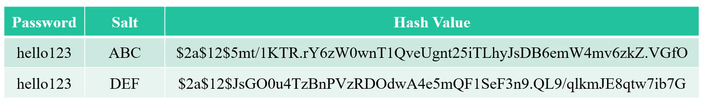
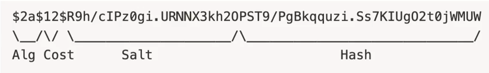
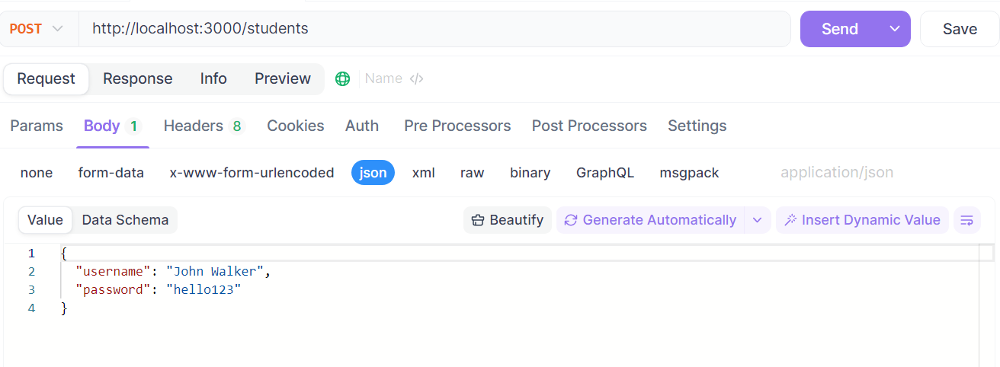
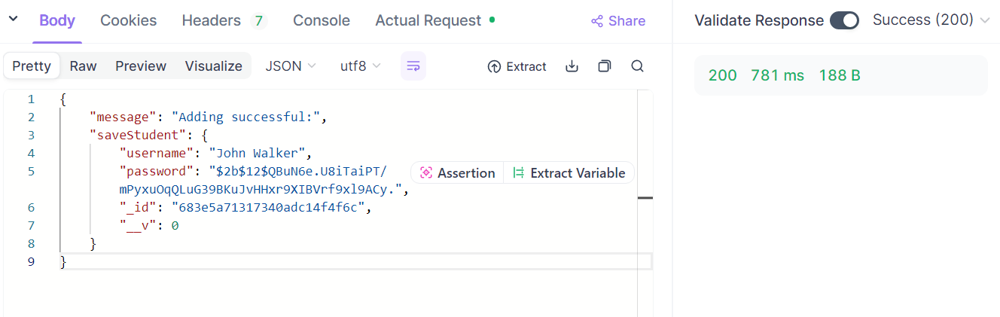
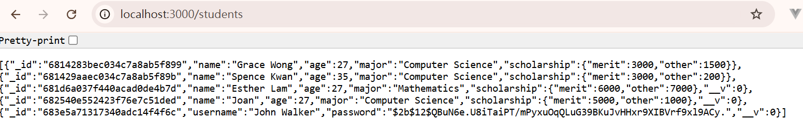

# 目錄

- [Authentication and Authorizations](#Authentication-and-Authorizations)
- [密碼學導論與密碼加鹽](#密碼學導論與密碼加鹽)
- [Bcrypt 密碼處理](#Bcrypt-密碼處理)
- [登入系統](#登入系統)
- [Blowfish 演算法](#Blowfish-演算法)

## Authentication and Authorizations

**Authentication**

身分驗證(Authentication)是指通過一定的手段，完成對使用者身分的確認。如果我們希望我們的應用程序被任何人使用，我們需要創建一個用戶身分驗證系統。這將是一個用戶可以註冊帳戶和登錄的系統。Authentication可以透過以下的幾種方式來完成:

1. 要求使用者給予系統已經儲存過的帳號密碼

2. 基於共享金鑰的身分驗證。當使用者需要進行身分驗證時，使用者通過輸入或通過保管有密碼的裝置提交由使用者和伺服器共同擁有的密碼。伺服器在收到使用者提交的密碼後，檢查使用者所提交的密碼是否與伺服器端儲存的密碼一致，如果一致，就判斷使用者為合法使用者。如果使用者提交的密碼與伺服器端所儲存的密碼不一致時，則判定身分驗證失敗。

3. 基於公開金鑰加密演算法的身分驗證。通信中的雙方分別持有公開金鑰和私有金鑰，尤其中的一方採用私有金鑰對特定資料進行加密，而對方採用公開金鑰對資料進行加密，如果解密成功，就認為使用者是合法使用者，否則就認為是身分驗證失敗。使用基於公開金鑰加密演算法的身分驗證的服務有:SSL、數位簽章等等。

4. 基於生物學特徵的身分驗證，使用每個人身體上獨一無二的特徵，如指紋、虹膜等等。

5. 多重要素驗證(Multi-factor authentication，所寫為MFA)。例如，使用銀行卡時，需要另外輸入個人識別碼，確認之後才能使用其轉帳功能。登入校園網路系統時，通過手機簡訊或學校指定的手機軟體進行驗證。

6. 開放授權 (O Auth) 是一個開放標準，允許使用者讓第三方應用存取該使用者在某一網站上儲存的私密的資源(如相片，影片，聯絡人列表)，而無需將使用者名稱和密碼提供給第三方應用。

**Authorizations**

既然我們知道正在使用系統的用戶是誰，並且已經做了身分驗證，伺服器仍需要檢查該用戶是否有權執行他們嘗試執行的操作，這稱為授權(Authorizations)。例如，在Udemy上面，只有講師可以看到每個學生的學習進度與後台資料，而學生無法看到其他學生的資訊。若有學生嘗試存取其他學生的後台資料，伺服器應該加以阻擋。

## 密碼學導論與密碼加鹽

> 在我們的數據庫中以純文字的形式存儲密碼是一個非常糟糕的主意。若駭客害入系統內部，就可以馬上看到所有用戶的密碼。另外，員工也可以訪問資料庫，看到所有用戶的密碼，可能會有資安疑慮。由於很多人在多個網站上都會重複使用相同的密碼(並不是一個非常好的習慣)，若我們的資料庫內的密碼外洩，受影響的用戶的Google、Facebook、銀行等帳戶可能都會同時遭到入侵。

因此，我們希望在將密碼儲存到資料庫之前對其進行加密或轉換。我們實際上不需要加密(encrypt)密碼，我們只需要對它們進行雜湊(hash)處理。加密通常意味著我們可以將我們加密的內容進行解密處理，以獲去原始文字。雜湊處理則代表沒有可逆選項

如果我們將密碼的雜湊值(hash values)存儲在資料庫中，當用戶端給我們密碼時，我們只需要將密碼拿去做雜湊處理，得到雜湊值後，在去跟資料庫中的雜湊值去比較是否相同。

在雜湊函數的選擇上需要特別注意。我們可以使用SHA家族的演算法對密碼進行雜湊處理，但因為SHA家族演算法產生雜湊值的速度非常快，並不是合當作使用者密碼的雜湊函數。這是因為，如果我們使用一個非常快的演算法，駭客可以非常快速地對使用者地密碼做出很多猜測。駭客可以不斷地猜測不同可能地密碼來嘗試登入系統。通常來說，駭客會參考「一萬種最常見的密碼」列表來猜測使用者地密碼。像這樣地攻擊，被稱為字典攻擊(dictionary attack)

另一個資安問題是駭客可以創建彩虹表(rainbow table)。彩虹表示一個包含許多密碼(可能超過1億個)及其雜湊值地列表。駭客如果進入我們的資料庫，可以看到許多以雜湊值地形式所儲存的密碼。此時駭客只需要拿出彩虹表對照，就可以反推原本地使用者密碼。

如果幫單一密碼算出雜湊值所需要的時間越長，對駭客來說，創建彩虹表的時間成本就越高。因此，我們需要使用速度慢地雜湊函數。在市面上，儲存密碼用的雜湊函數最有名的就是Bcrypt。跟SHA家族相比，Bcrypt的速度很慢。此外，我們也可以做設定讓Bcrypt完成的速度減慢。

**密碼加鹽**

即使我們在將密碼保存到資料庫之前對密碼進行了雜湊函數轉換，仍然不安全。駭客仍然可以用彩虹表對照出雜湊函數轉換前的密碼。因此，我們通常會在對密碼「加鹽」處理。

在我們對密碼做雜湊處理之前，我們在密碼中添加一些鹽(salt)，再拿去做雜湊處理，這樣相同地密碼在數據庫中看起來會有所不同，因為相同的密碼會有不同的鹽，所以雜湊函數算出來的雜湊值也會不同。例如:

|Password|Salt|Hash Value|
|--------|----|----------|
|hello123|ABC|$2a$12$5mt/1KTR.rY6zW0wnT1QveUgnt25iTLhyJsDB63mW4mv6kZ.VGfO|
|hello123|DEF|$2a$12$JsGO0u4TzBnPVzRDOdwA4e5mQF1SeF3n9.QL9/qlkmJE8qtw7ib7G|



在資料庫中，我們會儲存雜湊值和鹽兩個部分。下次當使用者給伺服器密碼時，伺服器可以將使用者給的密碼配上資料庫內儲存的鹽，兩者拿去算出雜湊值。若算出的值與資料庫內的雜湊值相符合，則驗證使用者。

這就是為什麼大多數網站不會在我們忘記密碼時，告訴我們密碼的原因。網站伺服器真的沒有辦法恢復密碼，因偉網站伺服器根本就沒有儲存過使用者地密碼。伺服器所能做的就是讓我們創建一個新的密碼。

## Bcrypt 密碼處理

Bcrypt 是根據Blowfish加密演算法所設計的密碼雜湊函式。在使用Bcrypt時，我們可以客製化salt round。salt round的數字越大，Bcrypt做雜湊運算所需要完成的時間就越久，且成2^salt round倍成長。也就是說，salt round寫10，會比寫1需要花上的時間多2^10=1024倍。

使用Bcrypt時，輸入式密碼、salt round、一個鹽巴，而輸出是雜湊值。雜湊值的形式是:

```
$2<a/b/x/y>$[cost]$[22 character salt][31 character hash]
```

cost: salt round

22 character salt: salt

31 character hash: 算出來的hash value

例如，如果密碼是abc123xyz，salt round是12，還有隨機的鹽巴，那bcrypt輸出的結果會是:



Where:

1. `$2a$`: The hash algorithm identifier (bcrypt)

2. `12`: Input cost (i.e. 4096 rounds)

3. `R9h/cIPz0gi.URNNX3kh2O`: input Salt

4. `PST9/PgBkqquzi.Ss7KIUgO2t0jWMUW: the first 23 bytes of the computed 24 byte hash`

這裡我們發現，資料庫當中也會儲存鹽巴以及salt round，所以下次有登入時。我們把他的密碼拿去跟資料庫內的鹽巴進行bcrypt加密，salt round以及演算法版本，全部一起使用，即可確認密碼的正確性!

**Bcrypt語法**

> 在Node.js當中使用Bcrypt計算密碼的雜湊值語法有兩種:

```js
bcrypt.genSalt(saltRounds,function(err,salt){
  bcrypt.hash(myPlaintextPassword, salt, function(err,hash){
    //Store hash in your password DB.
  });
})
```
> 第二種:

```js
bcrypt.hash(myPlaintextPassword, saltRounds, function(err,hash){
    // Store hash in your password DB.
});
```

[npm bcrypt](https://www.npmjs.com/package/bcrypt)

```shell
npm i bcrypt
```

> 資料schema

```js
const mongoose = require("mongoose");
const { Schema } = mongoose;

// Define the schema for a student
const studentSchema = new Schema({
  username: {
    type: String,
    required: true,
  },
  password: {
    type: String,
    required: true,
  },
});

// Create and export the Student model
const Student = mongoose.model("Student", studentSchema);
module.exports = Student;
```

> app.js

```js
require('dotenv').config();
const express = require("express");
const session = require("express-session");
const mongoose = require("mongoose");
const Student = require("./models/student");
const bcrypt = require("bcrypt");
const saltRounds = 12; // 8,10,12,14

const app = express();

mongoose.connect("mongodb://localhost:27017/demo").then(()=>{
  console.log("connecting is successful...");
}).catch((e) => {
  console.log(e);
});

app.use(
  session({
    secret:"process.env.MYSESSIONSECRETKEY",
    resave: false,
    saveUninitialized: false,
    cookie:{secure:false}, // localhost
  })
)

app.use(express.json());

app.use(express.urlencoded({extended:true}))

app.get("/students", async (req, res) => {
  try {
    let foundStudent = await Student.find({}); // ✅ 等待查詢完成
    return res.send(foundStudent);
  } catch (e) {
    return res.status(500).send({ error: "Failed to fetch students", detail: e });
  }
});

app.post("/students",async (req,res)=>{
  try{
    let {username,password} = req.body;
    let hashValue = await bcrypt.hash(password, saltRounds);
    const newStudent = new Student({
      username,
      password: hashValue,
    });
    let saveStudent = await newStudent.save();
    return res.send({message:"Adding successful:",saveStudent});
  }catch (e) {
    console.error("Error while saving student:", e);
    return res.status(400).send({ error: e.message, details: e.errors });
  }

})

app.listen(3000,()=>{
  console.log("Server running on port 3000....")
})
```

結果:





## 登入系統

## Blowfish 演算法