# 目錄

- [EJS 基本介紹](#EJS-基本介紹)
- [EJS 語法](#EJS-語法)
- [EJS 應用示範](#EJS-應用示範)
- [MVC 模式](#MVC-模式)

# EJS 基本介紹

- EJS的全名是「Embedded JavaScript」，是與Express.js搭配的內嵌式樣版引擎。EJS可以讓我們使用jAVAsCRIPT生成HTML頁面。**EJS文件需要放在「views」資料夾內部。**

> 例如可以在HTML的頁面用for迴圈

- 頁面渲染(rendering)就是瀏覽器將HTML變成人眼看到的圖像的全過程。Express.js當中的View Engine允許我們使用模板文件渲染網頁。這些模板填充了實際數據並從伺服器被傳送到客戶端。

- 若有使用`app.set("view engine","ejs")`，則使用`res.render()`時，就不需要指定文件類別。例如，`res.render("index.ejs")`可以改成`res.render("index")`。


[npm ejs](https://www.npmjs.com/package/ejs)

```shell
npm i ejs
```


- 一般使用

**app.js**

```js
const express = require("express");
const app = express();
const port = 3000;

app.use(express.static("public"))

app.get("/",(req,res)=>{
  res.render("index.ejs")
})

app.use((req,res)=>{
 res.status(404).send("<h1>404 Not Found</h1>");
})

app.listen(port, () => {
  console.log(`Example app listening on port ${port}`)
})
```

**view/index.ejs**

```html
<!DOCTYPE html>
<html lang="en">
<head>
  <meta charset="UTF-8">
  <meta name="viewport" content="width=device-width, initial-scale=1.0">
  <title>Document</title>
</head>
<body>
  <h1>This is a webpage by EJS.</h1>
</body>
</html>
```

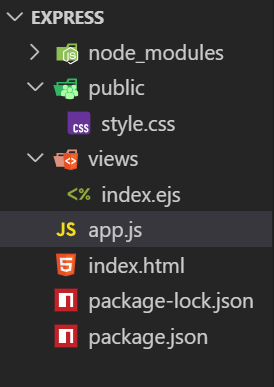
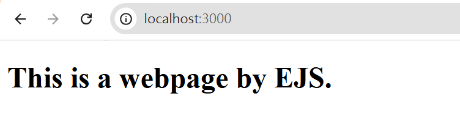

- `app.set("view engine","ejs")`

```js
const express = require("express");
const app = express();
const port = 3000;

app.use(express.static("public"));
app.set("view engine", "ejs");

app.get("/",(req,res)=>{
  res.render("index")
})

app.use((req,res)=>{
 res.status(404).send("<h1>404 Not Found</h1>");
})

app.listen(port, () => {
  console.log(`Example app listening on port ${port}`)
})
```

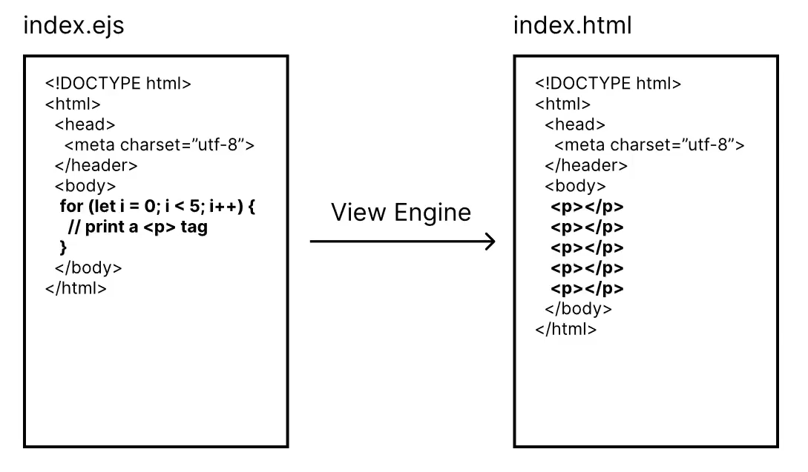

- 套用變數

**app.js**
```js
const express = require("express");
const app = express();
const port = 3000;

app.use(express.static("public"));
app.set("view engine", "ejs");

app.get("/:name",(req,res)=>{
  let {name} =req.params;
  //JS中，出現object屬性為variable相同的狀況可以把{name:name}省略成{name}
  res.render("index",{name});
})

app.use((req,res)=>{
 res.status(404).send("<h1>404 Not Found</h1>");
})

app.listen(port, () => {
  console.log(`Example app listening on port ${port}`)
})
```
**view/index.ejs**
```html
<!DOCTYPE html>
<html lang="en">
<head>
  <meta charset="UTF-8">
  <meta name="viewport" content="width=device-width, initial-scale=1.0">
  <title>Document</title>
</head>
<body>
  <h1>This is a webpage by EJS.</h1>
  <h2>Hi, <%= name %>. Welcome to my website</h2>
</body>
</html>
```

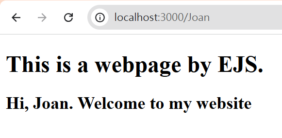
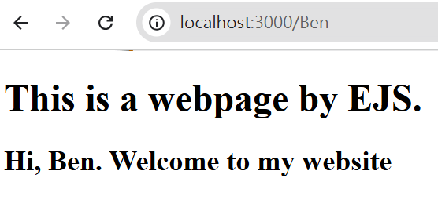

# EJS語法
- `<%`: 一般標籤，用於control flow，不輸出任何的值。
  - control flow: if statement,for loop,while
- `<%=`: 將值輸出到模板中 (不會轉換HTML語法)。例如: `x="<p>This is a paragraph</p>"`，則`<%=x%>`會是輸出`<p>This is a paragraph</p>`
- `<%-`: 將轉換過程的HTML語法的值輸出到模板中。例如:`x = "<p>This is a paragraph"`，則`<%-x%>`匯是輸出`This is a paragraph`
- `<%#`: 註釋標籤，不執行也不輸出任何的值。
- `%>`: 普通的結束標籤
- `<%-include%>`: 語法可以鑲嵌其他EJS文件

**範例1**

```html
<!DOCTYPE html>
<html lang="en">
<head>
  <meta charset="UTF-8">
  <meta name="viewport" content="width=device-width, initial-scale=1.0">
  <title>Document</title>
</head>
<body>
  <% for(let i = 0; i < 10; i++){%>
    <%=i%>
  <%}%>  
</body>
</html>
```

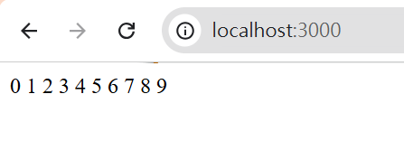

**範例2**

```js
const express = require("express");
const app = express();
const port = 3000;

app.use(express.static("public"));
app.set("view engine", "ejs");

app.get("/",(req,res)=>{
  let myString = "<h1>hello world</h1>"
  res.render("index", {myString});
})

app.use((req,res)=>{
 res.status(404).send("<h1>404 Not Found</h1>");
})

app.listen(port, () => {
  console.log(`Example app listening on port ${port}`)
})
```

```html
<!DOCTYPE html>
<html lang="en">
<head>
  <meta charset="UTF-8">
  <meta name="viewport" content="width=device-width, initial-scale=1.0">
  <title>Document</title>
</head>
<body>
   <%-myString%>
</body>
</html>
```

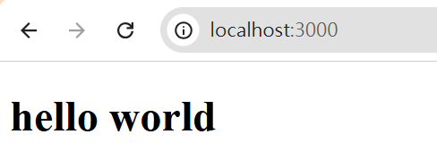


**範例3**

```html
<!DOCTYPE html>
<html lang="en">
<head>
  <meta charset="UTF-8">
  <meta name="viewport" content="width=device-width, initial-scale=1.0">
  <title>Document</title>
</head>
<body>
   <%=myString%>
</body>
</html>
```

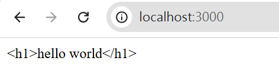

**範例4**

```html
<!DOCTYPE html>
<html lang="en">
<head>
  <meta charset="UTF-8">
  <meta name="viewport" content="width=device-width, initial-scale=1.0">
  <title>Document</title>
</head>
<body>
  <% for(let i = 0; i < 10; i++){%>
    <h1><%-i%></h1>
  <%}%>  
</body>
</html>
```

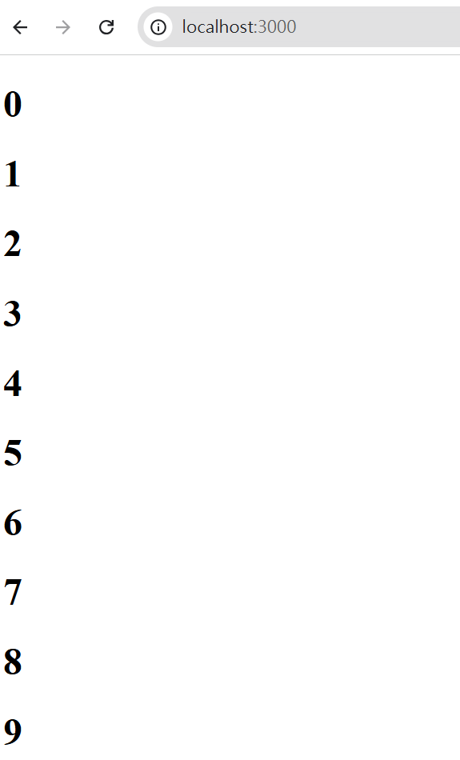

**範例5**

```html
<!DOCTYPE html>
<html lang="en">
<head>
  <meta charset="UTF-8">
  <meta name="viewport" content="width=device-width, initial-scale=1.0">
  <title>Document</title>
</head>
<body>
  <%# This is a for loop%>
  <% for(let i = 0; i < 10; i++){%>
    <h1><%-i%></h1>
  <%}%>  
</body>
</html>
```
**範例6**

- `partial/footer.ejs`

```js
<h2>This is a footer.</h2>
```
```html
<!DOCTYPE html>
<html lang="en">
<head>
  <meta charset="UTF-8">
  <meta name="viewport" content="width=device-width, initial-scale=1.0">
  <title>Document</title>
</head>
<body>
  <%# This is a for loop%>
  <% for(let i = 0; i < 10; i++){%>
    <h1><%-i%></h1>
  <%}%> 
  <%- include("partials/footer.ejs")%> 
</body>
</html>
```

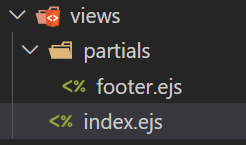
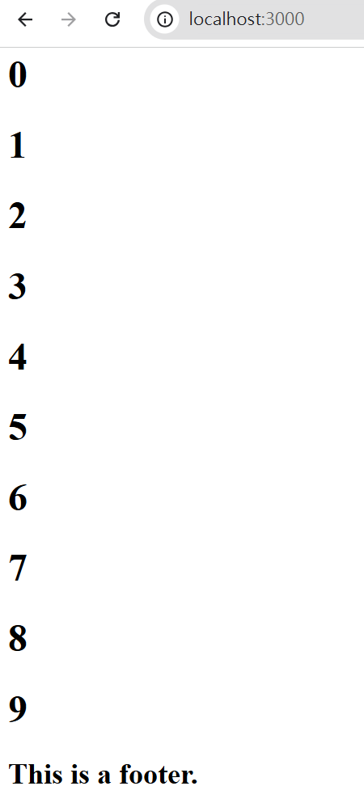

# EJS 應用示範

- 如何跟表單活用

**views/index.ejs**

```html
<!DOCTYPE html>
<html lang="en">
<head>
  <meta charset="UTF-8">
  <meta name="viewport" content="width=device-width, initial-scale=1.0">
  <title>Document</title>
</head>
<body>
 <form action="/example" method="GET">
  <label for="name">Name:</label>
  <input type="text" id="name" name="name">
  <label for="age">Age:</label>
  <input type="number" id="age" name="age">
  <button>submit</button>
 </form>
</body>
</html>
```

**views/partials/response**

```html
<!DOCTYPE html>
<html lang="en">
<head>
  <meta charset="UTF-8">
  <meta name="viewport" content="width=device-width, initial-scale=1.0">
  <title>Document</title>
</head>
<body>
  <h1>We have already received your data!</h1>
  <h3>The flollowing for your data details:</h3>
  <p>Customer Name: <%=name%></p>
  <p>Customer Age: <%=age%></p>  
</body>
</html>
```

```js
const express = require("express");
const app = express();
const port = 3000;

app.use(express.static("public"));
app.set("view engine", "ejs");

app.get("/",(req,res)=>{
  res.render("index");
})

app.get("/example",(req,res)=>{
  let {name,age} = req.query;
  res.render("partials/response",{name,age});
})

app.use((req,res)=>{
 res.status(404).send("<h1>404 Not Found</h1>");
})

app.listen(port, () => {
  console.log(`Example app listening on port ${port}`)
})
```

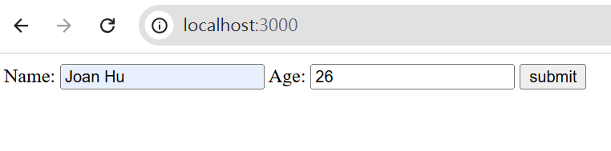
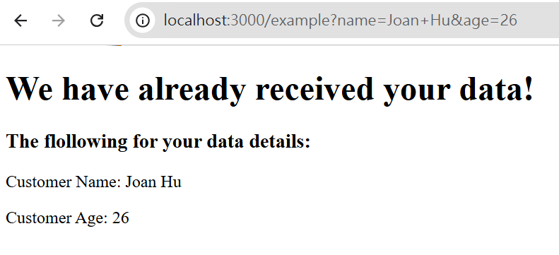

- 如何跟資料連用

```js
const express = require("express");
const app = express();
const port = 3000;

app.use(express.static("public"));
app.set("view engine", "ejs");

app.get("/",(req,res)=>{
  const languages = [
    { name: "Python", rating: 9.5, popularity: 9.7, trending: "super hot" },
    { name: "Java", rating: 9.4, popularity: 8.5, trending: "hot" },
    { name: "C++", rating: 9.2, popularity: 7.7, trending: "hot" },
    { name: "PHP", rating: 9.0, popularity: 5.7, trending: "decreasing" },
    { name: "JS", rating: 8.5, popularity: 8.7, trending: "hot" }
  ];
  
  res.render("index", {languages});
})

app.use((req,res)=>{
 res.status(404).send("<h1>404 Not Found</h1>");
})

app.listen(port, () => {
  console.log(`Example app listening on port ${port}`)
})
```

```html
<!DOCTYPE html>
<html lang="en">
<head>
  <meta charset="UTF-8">
  <meta name="viewport" content="width=device-width, initial-scale=1.0">
  <title>Document</title>
  <link rel="stylesheet" href="style.css">
</head>
<body>

 <table>
  <tr>
    <th>name</th>
    <th>rating</th>
    <th>popularity</th>
    <th>trending</th>
  </tr>
  <% languages.forEach((lang,index) => { %>
    <tr>
      <td><%= lang.name %></td>
      <td><%= lang.rating %></td>
      <td><%= lang.popularity %></td>
      <td><%= lang.trending %></td>
    </tr>
  <% }) %>
 </table>
</body>
</html>
```

**public/style.css**
```css
body{
  background-color: black;
  color: white;
}

table,tr,th,td{
  border-collapse: collapse;
  border: 2px solid white;
  text-align: center;
}
th,td{
  padding: 0.25rem 0.5rem;
}
```

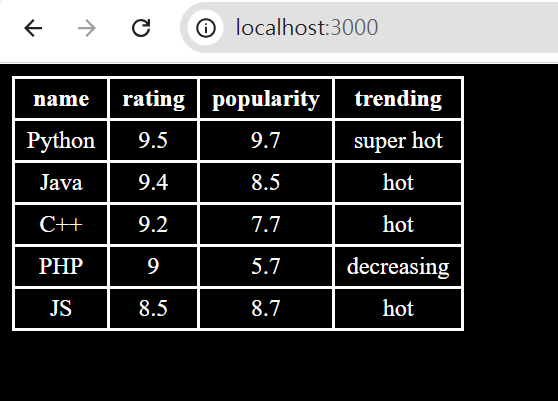