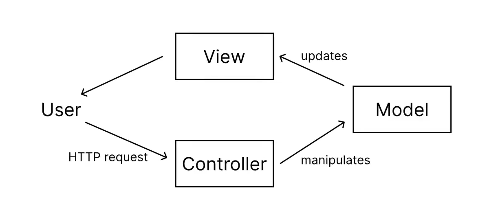
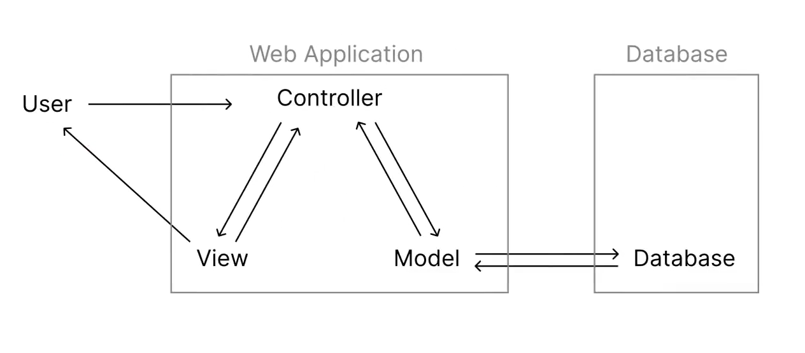
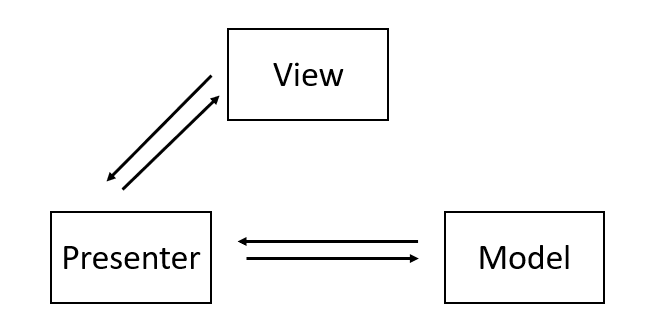
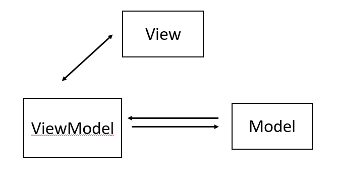

# 目錄

- [EJS 基本介紹](#EJS-基本介紹)
- [EJS 語法](#EJS-語法)
- [EJS 應用示範](#EJS-應用示範)
- [MVC 模式](#MVC-模式)
- [MVP 模式](#MVP-模式)
- [MVVM 模式](#MVVM-模式)

# EJS 基本介紹

- EJS的全名是「Embedded JavaScript」，是與Express.js搭配的內嵌式樣版引擎。EJS可以讓我們使用jAVAsCRIPT生成HTML頁面。**EJS文件需要放在「views」資料夾內部。**

> 例如可以在HTML的頁面用for迴圈

- 頁面渲染(rendering)就是瀏覽器將HTML變成人眼看到的圖像的全過程。Express.js當中的View Engine允許我們使用模板文件渲染網頁。這些模板填充了實際數據並從伺服器被傳送到客戶端。

- 若有使用`app.set("view engine","ejs")`，則使用`res.render()`時，就不需要指定文件類別。例如，`res.render("index.ejs")`可以改成`res.render("index")`。


[npm ejs](https://www.npmjs.com/package/ejs)

```shell
npm i ejs
```


- 一般使用

**app.js**

```js
const express = require("express");
const app = express();
const port = 3000;

app.use(express.static("public"))

app.get("/",(req,res)=>{
  res.render("index.ejs")
})

app.use((req,res)=>{
 res.status(404).send("<h1>404 Not Found</h1>");
})

app.listen(port, () => {
  console.log(`Example app listening on port ${port}`)
})
```

**view/index.ejs**

```html
<!DOCTYPE html>
<html lang="en">
<head>
  <meta charset="UTF-8">
  <meta name="viewport" content="width=device-width, initial-scale=1.0">
  <title>Document</title>
</head>
<body>
  <h1>This is a webpage by EJS.</h1>
</body>
</html>
```


- `app.set("view engine","ejs")`

```js
const express = require("express");
const app = express();
const port = 3000;

app.use(express.static("public"));
app.set("view engine", "ejs");

app.get("/",(req,res)=>{
  res.render("index")
})

app.use((req,res)=>{
 res.status(404).send("<h1>404 Not Found</h1>");
})

app.listen(port, () => {
  console.log(`Example app listening on port ${port}`)
})
```


- 套用變數

**app.js**
```js
const express = require("express");
const app = express();
const port = 3000;

app.use(express.static("public"));
app.set("view engine", "ejs");

app.get("/:name",(req,res)=>{
  let {name} =req.params;
  //JS中，出現object屬性為variable相同的狀況可以把{name:name}省略成{name}
  res.render("index",{name});
})

app.use((req,res)=>{
 res.status(404).send("<h1>404 Not Found</h1>");
})

app.listen(port, () => {
  console.log(`Example app listening on port ${port}`)
})
```
**view/index.ejs**
```html
<!DOCTYPE html>
<html lang="en">
<head>
  <meta charset="UTF-8">
  <meta name="viewport" content="width=device-width, initial-scale=1.0">
  <title>Document</title>
</head>
<body>
  <h1>This is a webpage by EJS.</h1>
  <h2>Hi, <%= name %>. Welcome to my website</h2>
</body>
</html>
```


# EJS語法
- `<%`: 一般標籤，用於control flow，不輸出任何的值。
  - control flow: if statement,for loop,while
- `<%=`: 將值輸出到模板中 (不會轉換HTML語法)。例如: `x="<p>This is a paragraph</p>"`，則`<%=x%>`會是輸出`<p>This is a paragraph</p>`
- `<%-`: 將轉換過程的HTML語法的值輸出到模板中。例如:`x = "<p>This is a paragraph"`，則`<%-x%>`匯是輸出`This is a paragraph`
- `<%#`: 註釋標籤，不執行也不輸出任何的值。
- `%>`: 普通的結束標籤
- `<%-include%>`: 語法可以鑲嵌其他EJS文件

**範例1**

```html
<!DOCTYPE html>
<html lang="en">
<head>
  <meta charset="UTF-8">
  <meta name="viewport" content="width=device-width, initial-scale=1.0">
  <title>Document</title>
</head>
<body>
  <% for(let i = 0; i < 10; i++){%>
    <%=i%>
  <%}%>  
</body>
</html>
```


**範例2**

```js
const express = require("express");
const app = express();
const port = 3000;

app.use(express.static("public"));
app.set("view engine", "ejs");

app.get("/",(req,res)=>{
  let myString = "<h1>hello world</h1>"
  res.render("index", {myString});
})

app.use((req,res)=>{
 res.status(404).send("<h1>404 Not Found</h1>");
})

app.listen(port, () => {
  console.log(`Example app listening on port ${port}`)
})
```

```html
<!DOCTYPE html>
<html lang="en">
<head>
  <meta charset="UTF-8">
  <meta name="viewport" content="width=device-width, initial-scale=1.0">
  <title>Document</title>
</head>
<body>
   <%-myString%>
</body>
</html>
```


**範例3**

```html
<!DOCTYPE html>
<html lang="en">
<head>
  <meta charset="UTF-8">
  <meta name="viewport" content="width=device-width, initial-scale=1.0">
  <title>Document</title>
</head>
<body>
   <%=myString%>
</body>
</html>
```


**範例4**

```html
<!DOCTYPE html>
<html lang="en">
<head>
  <meta charset="UTF-8">
  <meta name="viewport" content="width=device-width, initial-scale=1.0">
  <title>Document</title>
</head>
<body>
  <% for(let i = 0; i < 10; i++){%>
    <h1><%-i%></h1>
  <%}%>  
</body>
</html>
```


**範例5**

```html
<!DOCTYPE html>
<html lang="en">
<head>
  <meta charset="UTF-8">
  <meta name="viewport" content="width=device-width, initial-scale=1.0">
  <title>Document</title>
</head>
<body>
  <%# This is a for loop%>
  <% for(let i = 0; i < 10; i++){%>
    <h1><%-i%></h1>
  <%}%>  
</body>
</html>
```
**範例6**

- `partial/footer.ejs`

```js
<h2>This is a footer.</h2>
```
```html
<!DOCTYPE html>
<html lang="en">
<head>
  <meta charset="UTF-8">
  <meta name="viewport" content="width=device-width, initial-scale=1.0">
  <title>Document</title>
</head>
<body>
  <%# This is a for loop%>
  <% for(let i = 0; i < 10; i++){%>
    <h1><%-i%></h1>
  <%}%> 
  <%- include("partials/footer.ejs")%> 
</body>
</html>
```


# EJS 應用示範

- 如何跟表單活用

**views/index.ejs**

```html
<!DOCTYPE html>
<html lang="en">
<head>
  <meta charset="UTF-8">
  <meta name="viewport" content="width=device-width, initial-scale=1.0">
  <title>Document</title>
</head>
<body>
 <form action="/example" method="GET">
  <label for="name">Name:</label>
  <input type="text" id="name" name="name">
  <label for="age">Age:</label>
  <input type="number" id="age" name="age">
  <button>submit</button>
 </form>
</body>
</html>
```

**views/partials/response**

```html
<!DOCTYPE html>
<html lang="en">
<head>
  <meta charset="UTF-8">
  <meta name="viewport" content="width=device-width, initial-scale=1.0">
  <title>Document</title>
</head>
<body>
  <h1>We have already received your data!</h1>
  <h3>The flollowing for your data details:</h3>
  <p>Customer Name: <%=name%></p>
  <p>Customer Age: <%=age%></p>  
</body>
</html>
```

```js
const express = require("express");
const app = express();
const port = 3000;

app.use(express.static("public"));
app.set("view engine", "ejs");

app.get("/",(req,res)=>{
  res.render("index");
})

app.get("/example",(req,res)=>{
  let {name,age} = req.query;
  res.render("partials/response",{name,age});
})

app.use((req,res)=>{
 res.status(404).send("<h1>404 Not Found</h1>");
})

app.listen(port, () => {
  console.log(`Example app listening on port ${port}`)
})
```


- 如何跟資料連用

```js
const express = require("express");
const app = express();
const port = 3000;

app.use(express.static("public"));
app.set("view engine", "ejs");

app.get("/",(req,res)=>{
  const languages = [
    { name: "Python", rating: 9.5, popularity: 9.7, trending: "super hot" },
    { name: "Java", rating: 9.4, popularity: 8.5, trending: "hot" },
    { name: "C++", rating: 9.2, popularity: 7.7, trending: "hot" },
    { name: "PHP", rating: 9.0, popularity: 5.7, trending: "decreasing" },
    { name: "JS", rating: 8.5, popularity: 8.7, trending: "hot" }
  ];
  
  res.render("index", {languages});
})

app.use((req,res)=>{
 res.status(404).send("<h1>404 Not Found</h1>");
})

app.listen(port, () => {
  console.log(`Example app listening on port ${port}`)
})
```

```html
<!DOCTYPE html>
<html lang="en">
<head>
  <meta charset="UTF-8">
  <meta name="viewport" content="width=device-width, initial-scale=1.0">
  <title>Document</title>
  <link rel="stylesheet" href="style.css">
</head>
<body>

 <table>
  <tr>
    <th>name</th>
    <th>rating</th>
    <th>popularity</th>
    <th>trending</th>
  </tr>
  <% languages.forEach((lang,index) => { %>
    <tr>
      <td><%= lang.name %></td>
      <td><%= lang.rating %></td>
      <td><%= lang.popularity %></td>
      <td><%= lang.trending %></td>
    </tr>
  <% }) %>
 </table>
</body>
</html>
```

**public/style.css**
```css
body{
  background-color: black;
  color: white;
}

table,tr,th,td{
  border-collapse: collapse;
  border: 2px solid white;
  text-align: center;
}
th,td{
  padding: 0.25rem 0.5rem;
}
```


# MVC 模式

- MVC模式(Model-View-Controller)是軟體工程中的一種design pattern(軟體架構模式)，把軟體系統分為三個基本部分:模型(Model)、視圖(View)和控制器(Controller)。

- MVC模式的目的是實現一種動態的設計程式，使後續對程式的修改和擴充簡化，並且使程式某一部份的重複利用成為可能。除此之外，此模式透過對複雜度的簡化，使程式結構更加直覺。軟體系統透過對自身基本部分分離同時也賦予了各個基本部分應有的功能。

- 現在的網頁開發框架，例如Java Spring、ASP.NET、Ruby on Rails、Django、Laravel等等，都是使用相當標準的MVC design pattern。

**Model、View、Controller的分工如下:**

- 模型(Model): 封裝與應用程式邏輯相關的資料以及對資料的處理方法「Model」有對資料直接存取的權利，例如對資料庫的存取
 - Mongoose

- 視圖(View): 將資料有目的的顯示出來
 - EJS

- 控制器(Controller): 用於控制應用程式的流程，處理事件並做出回應。「事件」包括使用者的行為和Model上的改變
  - app.js
  - express router




- 優點:

1. 重複使用已寫好的程式碼: model, view,controller各司其職，不同的view可以使用同一個model連結資料庫，產出不同的頁面，增加開發效率

2. 容易維護的程式碼:由於MVC彼此獨立，因此，將現有的project擴大或是修改都可以不破壞現有架構

3. 團隊分工合作: view、model、controller可由不同專業的人分工處理。例如:view郊遊前端工程師美化處理、model、controller則是由後端或資料庫人員負責

- 缺點：

1. 不適合小型，中等規模的應用程序，花費大量時間將 MVC 應用到規模並不是很大的應用程序通常會得不償失。
2. 視圖與控制器間過於緊密連接，視圖與控制器是相互分離，但卻是聯繫緊密的部件，視圖沒有控制器的存在，其應用是很有限的，反之亦然，這樣就妨礙了他們的獨立重用。

3. 視圖對模型數據的低效率訪問，依據模型操作接口的不同，視圖可能需要多次調用才能獲得足夠的顯示數據。對未變化數據的不必要的頻繁訪問，也將損害操作性能。

- 例子: 顧客來到餐廳用點餐機點餐(controller)，點餐機把餐點的資料等送到廚房讓廚師料理(model)，料理完後再透過服務生端出來給使用者(view)

# MVP

- MVP模式(Model-View-Presenter)是由 MVC 演變而來，不過將 Controller 改名爲 Presenter，同時改變了通信方向。

- 模式和MVC幾乎完全相同差別在 MVP 中 View 並不直接與 Model 交互，它們之間的通信是通過 Presenter (MVC 中的 Controller) 來進行的

- 特點:
1. M、V、P 之間雙向通信。

2. View 與 Model 不通信，都通過 Presenter 傳遞。Presenter 完全把 Model 和 View 進行了分離，主要的程序邏輯在 Presenter 裏實現。

3. View 非常薄，不部署任何業務邏輯，稱爲” 被動視圖”（Passive View），即沒有任何主動性，而 Presenter 非常厚，所有邏輯都部署在那裏。

4. Presenter 與具體的 View 是沒有直接關聯的，而是通過定義好的接口進行交互，從而使得在變更 View 時候可以保持 Presenter 的不變，這樣就可以重用。不僅如此，還可以編寫測試用的 View，模擬用戶的各種操作，從而實現對 Presenter 的測試–從而不需要使用自動化的測試工具。

- 優點:

1. 模型與視圖完全分離，我們可以修改視圖而不影響模型；

2. 可以更高效地使用模型，因爲所有的交互都發生在一個地方 — — Presenter 內部；

3. 我們可以將一個 Presenter 用於多個視圖，而不需要改變 Presenter 的邏輯。這個特性非常的有用，因爲視圖的變化總是比模型的變化頻繁；

4. 如果我們把邏輯放在 Presenter 中，那麼我們就可以脫離用戶接口來測試這些邏輯（單元測試）。

MVP 缺點：視圖和 Presenter 的交互會過於頻繁，使得他們的聯繫過於緊密。也就是說，一旦視圖變更了，presenter 也要變更。




- 例子: 顧客來到餐廳用點餐機點餐(Presenter)，點餐機把餐點的資料等送到廚房讓廚師料理(model)，料理完後的料理會送到點餐機出口，服務生要從點餐機出口拿料理給顧客(view)

# MVVM

- MVVM模式(Model View ViewModel)這個模式提供對 View 和 View Model 的雙向數據綁定。這使得 View Model 的狀態改變可以自動傳遞給 View。典型的情況是，View Model 通過使用 obsever 模式（觀察者模式）來將 View Model 的變化通知給 model。

- 模式和MVC幾乎完全相同差別在 MVP 中 View 並不直接與 Model 交互，它們之間的通信是通過 Presenter (MVC 中的 Controller) 來進行的

**Model、View、View Model的分工如下:**

- 模型(Model): 封裝與應用程式邏輯相關的資料以及對資料的處理方法「Model」有對資料直接存取的權利，例如對資料庫的存取

- 視圖(View): 將資料有目的的顯示出來

- 視圖模型(View Model): 用於控制應用程式的流程，處理事件並做出回應。「事件」包括使用者的行為和Model上的改變



MVVM 模式關鍵點：

1. 用戶和 View 交互。
2. View 和 ViewModel 是多對一關係。意味着一個 ViewModel 只映射多個 View。

3. View 持有 ViewModel 的引用，但是 ViewModel 沒有任何 View 的信息。

4. View 和 ViewModel 之間有雙向數據綁定關係。

MVVM 優點：

1. 視圖（View）可以獨立於 Model 變化和修改，一個 ViewModel 可以綁定到不同的”View” 上，當 View 變化的時候 Model 可以不變，當 Model 變化的時候 View 也可以不變。

2. 可重用性，可以把一些視圖邏輯放在一個 ViewModel 裏面，讓很多 view 重用這段視圖邏輯。

3. 獨立開發，開發人員可以專注於業務邏輯和數據的開發（ViewModel），設計人員可以專注於頁面設計，使用 Expression Blend 可以很容易設計界面並生成 xml 代碼。

4. 可測試，界面向來是比較難於測試的，而現在測試可以針對 ViewModel 來寫。

- 例子: 顧客來到餐廳用點餐機點餐(ViewModel)，點餐機把餐點的資料等送到廚房讓廚師料理(model)，料理完後就會送回點餐機出口，移送到點餐機出口時顧客的桌上就會瞬間出現料理
