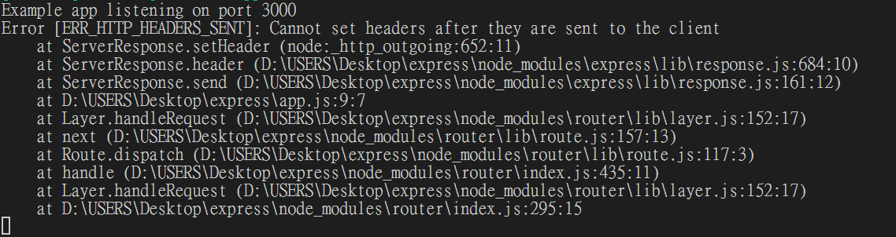
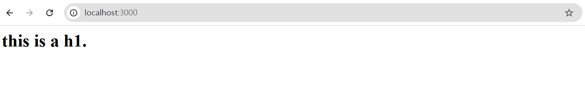
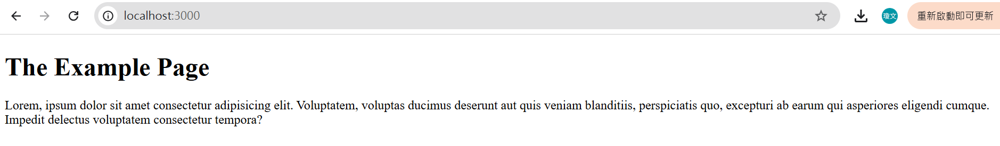
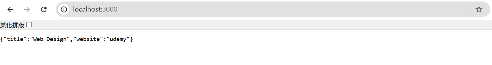
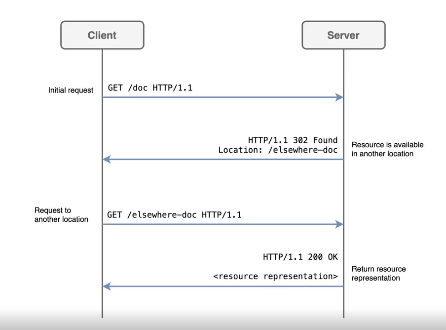
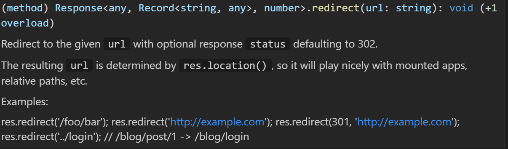
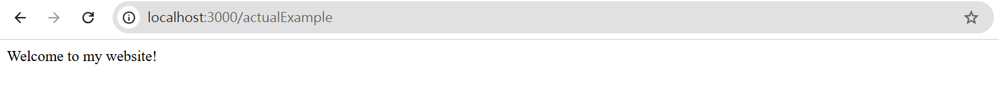

# 目錄

- [ExpressJS](#ExpressJS)
- [HTTP Request Methods](#HTTP-Request-Methods)
- [Express Routing 與 Response Object](#Express-Routing-與-Response-Object)
- [Request object常用屬性](#Request-object-常用屬性)
- [Express Middleware](#Express-Middleware)
- [Static Files](#Static-Files)
- [HTTP Status Code](#HTTP-Status-Code)

# ExpressJS

Express.js是針對Node.js的應用框架（framework），建構在Node.js之上，其主要目的是為了對Node.js架設的後端伺服器簡化程式碼並且增加開發速度（這就是為何Express叫做Express）。要使用Express，我們只需要在work directory中做：

```shell
npm install express
```
[npm install express](https://www.npmjs.com/package/express)

[express官方網站](https://expressjs.com/)

```js
const express = require('express')
const app = express()
const port = 3000

// HTTP request, GET, POST, PUT, DELETE
app.get('/', (req, res) => {
  res.send('Hello World!') // send to client
})

// it's our server, one param is port, another is callback
app.listen(port, () => {
  console.log(`Example app listening on port ${port}`)
})
```


```js
const express = require('express')
const app = express()
const port = 3000

// HTTP request, GET, POST, PUT, DELETE
app.get('/', (req, res) => {
  res.send('Hello World!') // send to client
})

app.get("/anotherPage",(req,res)=>{
  res.send("Welcome to another page!")
})

// it's our server, one param is port, another is callback
app.listen(port, () => {
  console.log(`Example app listening on port ${port}`)
})
```


> require是可以require一個function回來

**app2.js**

```js
function app2Function(){
  console.log("hello from app2");
}

module.exports = app2Function;
```

**app1.js**

```js
const app2 =require("./app2");
app2();
```

## Framework and Library

- Framework 與 Library是兩個開發者常用的詞彙。兩者並沒有學術上的定義，但基本的區別是：

- 使用Library就像從頭開始建造你的家。房子可以按照你喜歡的任何風格建造，房間可以按照你喜歡的方式布置和裝飾。另一方面，Framework就像買新房一樣。房子已經建好了，所以你不用擔心建築問題，但你不能選擇房子的格局以及房間的佈置方式

- Framework: express.js，已經有固定的框架向是第一行一定要寫`const express = require("express")`，不論你是否高興都需要寫

- 在Library當中通常會提供許多的功能，開發者可以自行選擇所需的部分取用，例如：Bootstrap是HTML、CSS的Library。JQuery是JavaScript的Library。另一方面，Flask是Python的web framework，開發者必須要依照Flask的規則架構進行開發，沒有自行選擇架構的自由

# HTTP Request Methods

- HTTP協議中，客戶端可以向伺服器發出請求（request）。常見的請求method分成以下幾種：

1. GET: 用於請求指定的資源。使用GET的請求只應用於取得資料。
2. POST: 用於提交指定的資源，通常會改變伺服器的狀態或已儲存的資料。

(以上兩種request可由HTML的form當中傳送)

我們在瀏覽器中輸入網址，請求網頁，都是在向伺服器發出GET request。當我們登入某個網頁時，則是發出POST request。發出GET request時，額外的資訊會被放在URL的後面，用`?`當作與端點的分隔符號，`&`為多個資訊間的分隔符號。發出POST request時，額外資訊則會被藏起來。

- 例如，在Google上搜尋panda，網址會變成:
`https://www.google.com/search?q=panda&oq=panda&...VxFfTLxBVJ6AP1cRX0y&sourceid=chrome&ie=UTF-8`

- 其他常見的request methods是:

1. PUT: 用於修改資源的方法，客戶端發送更新整個資源的數據。

2. PATCH: 用於修改資源的方法，客戶端發送要更新的部分數據而不修改整個數據。

3. DELETE: 用於刪除資源。

以上三種HTTP request 皆無法從瀏覽器發送，只能使用程式語言或是postman等軟體發送

# Express Routing 與 Response Object

- Express Routing: 路由(routing)是指伺服器如何回應客戶端對特定端點(endpoint)的請求。端點(endpoint)是URI和特定的HTTP請求方法(GET、POST等)組成的。例如，伺服器上提供氣象資訊與回報，則伺服器上的endpoint可以有:
  - an endpoint that handles **GET/weather/taiwan** requests.
  - an endpoint that handles **GET/weather/hongkong** requests.
  - an endpoint that handles **POST/weather/taiwan** requests.  
  - an endpoint that handles **POST/weather/hongkong** requests.

> 當跳轉網址的時，基本上就是對此網址發送一個GET的請求

- 在Express中，製作伺服器端的routing endpoints的語法如下:

1. app.listen(port, callbackFn): app是個express instance、port是我們可以自行決定的數字，callbackFn是一旦伺服器開始監聽指定的port，callbackFn就會被執行

2. app.METHOD(PATH,HANDLER): app是個express instance、METHOD是一個HTTP method，path是endpoint，而handler是一個function，一旦伺服器在app.listen()指定的port收到相關method與path的請求，就會執行handler function 來回應請求

- 當handle function被express執行時，express會自動帶入兩個物件當作parameter，分別為request object以及response object。這兩個物件分別代表HTTP的請求以及回應。因此，handler function通常被寫成arrow function expression，且此arrow function一定會有兩個parameter:

```
(req,res)=>{
  //從req拿到資訊
  //根據拿到的資訊，用res做回應
}
```

- Response Object常用的methods有:

|Methods| Description|
|res.send(body)|傳送出HTTP Response。Body可以是String,object,array,boolean等等。|
|res.sendFile(path)|將位於path的文件傳送出去。|
|res.json(body)|發送JSON response。此method會先使用JSON.stringify()將body轉換為JSON String後，再發送一個response給客戶端|
|res.redirect(path)|伺服器通過發送狀態為302的HTTP response要求客戶端到path。客戶端會重新發送一個HTTP GET request到path。|
|res.render(view[,locals])|將view模板透過locals的文字後，將view發送到客戶端。|
|res.status()|設定HTTP Response的status code。|


- res.send(body)

```js
const express = require('express')
const app = express()
const port = 3000

// HTTP request, GET, POST, PUT, DELETE
app.get('/', (req, res) => {
  // send to client
  res.send('<h1>this is a h1.</h1>') 
  res.send('<p>this is a p.</p>') // it will be error, because it will set header twice. 
})

// it's our server, one param is port, another is callback
app.listen(port, () => {
  console.log(`Example app listening on port ${port}`)
})
```





- res.sendFile(path): path需要是絕對路徑

```js
const express = require('express')
const app = express()
const port = 3000

// HTTP request, GET, POST, PUT, DELETE
app.get('/', (req, res) => {
  // send to client
  res.sendFile(__dirname + '/example.html')  
})

// it's our server, one param is port, another is callback
app.listen(port, () => {
  console.log(`Example app listening on port ${port}`)
})
```

```html
<!DOCTYPE html>
<html lang="en">
<head>
  <meta charset="UTF-8">
  <meta name="viewport" content="width=device-width, initial-scale=1.0">
  <title>Document</title>
</head>
<body>
  <h1>The Example Page</h1>
  <p>Lorem, ipsum dolor sit amet consectetur adipisicing elit. Voluptatem, voluptas ducimus deserunt aut quis veniam blanditiis, perspiciatis quo, excepturi ab earum qui asperiores eligendi cumque. Impedit delectus voluptatem consectetur tempora?</p>
</body>
</html>
```



- res.json(body)
```js
const express = require('express')
const app = express()
const port = 3000

// HTTP request, GET, POST, PUT, DELETE
app.get('/', (req, res) => {
  let obj = {
    title: "Web Design",
    website: "udemy"
  }
  res.json(obj);
})

// it's our server, one param is port, another is callback
app.listen(port, () => {
  console.log(`Example app listening on port ${port}`)
})
```



- res.redirect(path)



- 302 Found: 東西有找到，但被移到其他地方，因此需要轉址



```js
const express = require('express')
const app = express()
const port = 3000

// HTTP request, GET, POST, PUT, DELETE
app.get('/', (req, res) => {
  res.redirect("/actualExample");  
})
app.get('/actualExample', (req, res) => {
  res.send("Welcome to my website!");  
})

// it's our server, one param is port, another is callback
app.listen(port, () => {
  console.log(`Example app listening on port ${port}`)
})
```



> 處理使用者亂打的情況


```js
const express = require('express')
const app = express()
const port = 3000

// HTTP request, GET, POST, PUT, DELETE
app.get('/', (req, res) => {
  res.redirect("/actualExample");  
})
app.get('/actualExample', (req, res) => {
  res.send("Welcome to my website!");  
})

app.use((req,res)=>{
  return res.status(404).send("<h1>404 Not Found</h1>");
})

// it's our server, one param is port, another is callback
app.listen(port, () => {
  console.log(`Example app listening on port ${port}`)
})
```

> 要記住這個錯誤設置是不能放在最上面的，放在最上面反而會找不到下面的網頁，所以需要把錯誤配置配到最下面才行