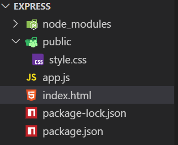

# 目錄

- [ExpressJS](#ExpressJS)
- [HTTP Request Methods](#HTTP-Request-Methods)
- [Express Routing 與 Response Object](#Express-Routing-與-Response-Object)
- [Request object常用屬性](#Request-object-常用屬性)
- [Express Middleware](#Express-Middleware)
- [Static Files](#Static-Files)
- [HTTP Status Code](#HTTP-Status-Code)

# ExpressJS

Express.js是針對Node.js的應用框架（framework），建構在Node.js之上，其主要目的是為了對Node.js架設的後端伺服器簡化程式碼並且增加開發速度（這就是為何Express叫做Express）。要使用Express，我們只需要在work directory中做：

```shell
npm install express
```
[npm install express](https://www.npmjs.com/package/express)

[express官方網站](https://expressjs.com/)

```js
const express = require('express')
const app = express()
const port = 3000

// HTTP request, GET, POST, PUT, DELETE
app.get('/', (req, res) => {
  res.send('Hello World!') // send to client
})

// it's our server, one param is port, another is callback
app.listen(port, () => {
  console.log(`Example app listening on port ${port}`)
})
```


```js
const express = require('express')
const app = express()
const port = 3000

// HTTP request, GET, POST, PUT, DELETE
app.get('/', (req, res) => {
  res.send('Hello World!') // send to client
})

app.get("/anotherPage",(req,res)=>{
  res.send("Welcome to another page!")
})

// it's our server, one param is port, another is callback
app.listen(port, () => {
  console.log(`Example app listening on port ${port}`)
})
```


> require是可以require一個function回來

**app2.js**

```js
function app2Function(){
  console.log("hello from app2");
}

module.exports = app2Function;
```

**app1.js**

```js
const app2 =require("./app2");
app2();
```

## Framework and Library

- Framework 與 Library是兩個開發者常用的詞彙。兩者並沒有學術上的定義，但基本的區別是：

- 使用Library就像從頭開始建造你的家。房子可以按照你喜歡的任何風格建造，房間可以按照你喜歡的方式布置和裝飾。另一方面，Framework就像買新房一樣。房子已經建好了，所以你不用擔心建築問題，但你不能選擇房子的格局以及房間的佈置方式

- Framework: express.js，已經有固定的框架向是第一行一定要寫`const express = require("express")`，不論你是否高興都需要寫

- 在Library當中通常會提供許多的功能，開發者可以自行選擇所需的部分取用，例如：Bootstrap是HTML、CSS的Library。JQuery是JavaScript的Library。另一方面，Flask是Python的web framework，開發者必須要依照Flask的規則架構進行開發，沒有自行選擇架構的自由

# HTTP Request Methods

- HTTP協議中，客戶端可以向伺服器發出請求（request）。常見的請求method分成以下幾種：

1. GET: 用於請求指定的資源。使用GET的請求只應用於取得資料。
2. POST: 用於提交指定的資源，通常會改變伺服器的狀態或已儲存的資料。

(以上兩種request可由HTML的form當中傳送)

我們在瀏覽器中輸入網址，請求網頁，都是在向伺服器發出GET request。當我們登入某個網頁時，則是發出POST request。發出GET request時，額外的資訊會被放在URL的後面，用`?`當作與端點的分隔符號，`&`為多個資訊間的分隔符號。發出POST request時，額外資訊則會被藏起來。

- 例如，在Google上搜尋panda，網址會變成:
`https://www.google.com/search?q=panda&oq=panda&...VxFfTLxBVJ6AP1cRX0y&sourceid=chrome&ie=UTF-8`

- 其他常見的request methods是:

1. PUT: 用於修改資源的方法，客戶端發送更新整個資源的數據。

2. PATCH: 用於修改資源的方法，客戶端發送要更新的部分數據而不修改整個數據。

3. DELETE: 用於刪除資源。

以上三種HTTP request 皆無法從瀏覽器發送，只能使用程式語言或是postman等軟體發送

# Express Routing 與 Response Object

- Express Routing: 路由(routing)是指伺服器如何回應客戶端對特定端點(endpoint)的請求。端點(endpoint)是URI和特定的HTTP請求方法(GET、POST等)組成的。例如，伺服器上提供氣象資訊與回報，則伺服器上的endpoint可以有:
  - an endpoint that handles **GET/weather/taiwan** requests.
  - an endpoint that handles **GET/weather/hongkong** requests.
  - an endpoint that handles **POST/weather/taiwan** requests.  
  - an endpoint that handles **POST/weather/hongkong** requests.

> 當跳轉網址的時，基本上就是對此網址發送一個GET的請求

- 在Express中，製作伺服器端的routing endpoints的語法如下:

1. app.listen(port, callbackFn): app是個express instance、port是我們可以自行決定的數字，callbackFn是一旦伺服器開始監聽指定的port，callbackFn就會被執行

2. app.METHOD(PATH,HANDLER): app是個express instance、METHOD是一個HTTP method，path是endpoint，而handler是一個function，一旦伺服器在app.listen()指定的port收到相關method與path的請求，就會執行handler function 來回應請求

- 當handle function被express執行時，express會自動帶入兩個物件當作parameter，分別為request object以及response object。這兩個物件分別代表HTTP的請求以及回應。因此，handler function通常被寫成arrow function expression，且此arrow function一定會有兩個parameter:

```
(req,res)=>{
  //從req拿到資訊
  //根據拿到的資訊，用res做回應
}
```

- Response Object常用的methods有:

|Methods| Description|
|res.send(body)|傳送出HTTP Response。Body可以是String,object,array,boolean等等。|
|res.sendFile(path)|將位於path的文件傳送出去。|
|res.json(body)|發送JSON response。此method會先使用JSON.stringify()將body轉換為JSON String後，再發送一個response給客戶端|
|res.redirect(path)|伺服器通過發送狀態為302的HTTP response要求客戶端到path。客戶端會重新發送一個HTTP GET request到path。|
|res.render(view[,locals])|將view模板透過locals的文字後，將view發送到客戶端。|
|res.status()|設定HTTP Response的status code。|


- res.send(body)

```js
const express = require('express')
const app = express()
const port = 3000

// HTTP request, GET, POST, PUT, DELETE
app.get('/', (req, res) => {
  // send to client
  res.send('<h1>this is a h1.</h1>') 
  res.send('<p>this is a p.</p>') // it will be error, because it will set header twice. 
})

// it's our server, one param is port, another is callback
app.listen(port, () => {
  console.log(`Example app listening on port ${port}`)
})
```


- res.sendFile(path): path需要是絕對路徑

```js
const express = require('express')
const app = express()
const port = 3000

// HTTP request, GET, POST, PUT, DELETE
app.get('/', (req, res) => {
  // send to client
  res.sendFile(__dirname + '/example.html')  
})

// it's our server, one param is port, another is callback
app.listen(port, () => {
  console.log(`Example app listening on port ${port}`)
})
```

```html
<!DOCTYPE html>
<html lang="en">
<head>
  <meta charset="UTF-8">
  <meta name="viewport" content="width=device-width, initial-scale=1.0">
  <title>Document</title>
</head>
<body>
  <h1>The Example Page</h1>
  <p>Lorem, ipsum dolor sit amet consectetur adipisicing elit. Voluptatem, voluptas ducimus deserunt aut quis veniam blanditiis, perspiciatis quo, excepturi ab earum qui asperiores eligendi cumque. Impedit delectus voluptatem consectetur tempora?</p>
</body>
</html>
```


- res.json(body)
```js
const express = require('express')
const app = express()
const port = 3000

// HTTP request, GET, POST, PUT, DELETE
app.get('/', (req, res) => {
  let obj = {
    title: "Web Design",
    website: "udemy"
  }
  res.json(obj);
})

// it's our server, one param is port, another is callback
app.listen(port, () => {
  console.log(`Example app listening on port ${port}`)
})
```


- res.redirect(path)


- 302 Found: 東西有找到，但被移到其他地方，因此需要轉址


```js
const express = require('express')
const app = express()
const port = 3000

// HTTP request, GET, POST, PUT, DELETE
app.get('/', (req, res) => {
  res.redirect("/actualExample");  
})
app.get('/actualExample', (req, res) => {
  res.send("Welcome to my website!");  
})

// it's our server, one param is port, another is callback
app.listen(port, () => {
  console.log(`Example app listening on port ${port}`)
})
```


> 處理使用者亂打的情況

```js
const express = require('express')
const app = express()
const port = 3000

// HTTP request, GET, POST, PUT, DELETE
app.get('/', (req, res) => {
  res.redirect("/actualExample");  
})
app.get('/actualExample', (req, res) => {
  res.send("Welcome to my website!");  
})

app.use((req,res)=>{
  return res.status(404).send("<h1>404 Not Found</h1>");
})

// it's our server, one param is port, another is callback
app.listen(port, () => {
  console.log(`Example app listening on port ${port}`)
})
```


> 要記住這個錯誤設置是不能放在最上面的，放在最上面反而會找不到下面的網頁，所以需要把錯誤配置配到最下面才行

## Request object的常用屬性為:

|Attributes|Description|
|req.body|此屬性是一個物件，預設值是undefined，但若使用express.json()或是express.urlencode()這種middleware，可以讓內部包含POST request季來的資料訊息，並且用key-value pair來表示|
|req.params| 此屬性是一個物件，內部屬性為named route parameters。例如，如果我們有route是`/user/:name`，則"req.params.name"屬性可取得route當中的name的值。此物件默認為{}。|
|req.query|此屬性是一個物件，其中包含route中`?`後面的key-value pair。例如，如果我們有route是`/api/getUser/?id=1`，則`req.query.id`就會是1|


- req.body
 - express.json()會去檢查requests的header有沒有Content-Type: application/json。如果有，就把text-based JSON換成JavaScript能夠存取的JSON物件。
 - express.urlencoded()會去檢查requests的header有沒有Content-Type:application/x-www-form-unlencoded(也就是去檢查是不是帶有資料的POST request)。如果有，也把text-based JSON換成JavaScript能夠存取的JSON物件。Extended屬性設定為true，可以讓JSON物件內部儲存String以外的資料類型。
 - 綜合來說，express.json()以及express.urlencoded()功能一樣，指是處理的Content-Type不同。兩者轉換完成的JSON物件會被放入req.body


```js
const express = require('express')
const app = express()
const port = 3000

//middleware
app.use(express.json());
app.use(express.urlencoded({ extended:true }))

// HTTP request, GET, POST, PUT, DELETE
app.get('/example',(req,res)=>{
  res.sendFile(__dirname+"/example.html")
})

app.get('/', (req, res) => {
  res.redirect("/actualExample");  
})

app.get('/actualExample', (req, res) => {
  res.send("Welcome to my website!");  
})

app.get("/fruit",(req,res)=>{
  res.send("Welcome to fruit page!")
})


app.get("/fruit/:someFruit",(req,res)=>{
  res.send(`<h1>Welcome to<strong style="color:red;"> ${req.params.someFruit}</strong> page!</h1>`)
})

app.post("/formhandling",(req,res)=>{
   res.send("we have already received your data.")
  console.log(req.body)
})

app.use((req,res)=>{
  return res.status(404).send("<h1>404 Not Found</h1>");
})

// it's our server, one param is port, another is callback
app.listen(port, () => {
  console.log(`Example app listening on port ${port}`)
})
```

```html
<!DOCTYPE html>
<html lang="en">
<head>
  <meta charset="UTF-8">
  <meta name="viewport" content="width=device-width, initial-scale=1.0">
  <title>Document</title>
</head>
<body>
  <form action="/formHandling" method="POST">
    <label for="email">email:</label>
    <input type="text" id="email" name="email" />
    <label for="password">password:</label>
    <input type="password" id="password" name="password" />
    <button>submit</button>    
  </form>
</body>
</html>
```


- req.params

```js
const express = require('express')
const app = express()
const port = 3000

// HTTP request, GET, POST, PUT, DELETE
app.get('/f', (req, res) => {
  res.redirect("/actualExample");  
})

app.get('/actualExample', (req, res) => {
  res.send("Welcome to my website!");  
})

app.get("/fruit",(req,res)=>{
  res.send("Welcome to fruit page!")
})


app.get("/fruit/:someFruit",(req,res)=>{
  res.send(`<h1>Welcome to<strong style="color:red;"> ${req.params.someFruit}</strong> page!</h1>`)
})

app.use((req,res)=>{
  return res.status(404).send("<h1>404 Not Found</h1>");
})

// it's our server, one param is port, another is callback
app.listen(port, () => {
  console.log(`Example app listening on port ${port}`)
})
```


- req.query

```js
const express = require('express')
const app = express()
const port = 3000

// HTTP request, GET, POST, PUT, DELETE
app.get('/example',(req,res)=>{
  res.sendFile(__dirname+"/example.html")
})

app.get('/', (req, res) => {
  res.redirect("/actualExample");  
})

app.get('/actualExample', (req, res) => {
  res.send("Welcome to my website!");  
})

app.get("/fruit",(req,res)=>{
  res.send("Welcome to fruit page!")
})


app.get("/fruit/:someFruit",(req,res)=>{
  res.send(`<h1>Welcome to<strong style="color:red;"> ${req.params.someFruit}</strong> page!</h1>`)
})

app.get("/formhandling",(req,res)=>{
  res.send(`we have already received your data. name is ${req.query.name} and age is ${req.query.age}`)
  console.log(req.query)
})

app.use((req,res)=>{
  return res.status(404).send("<h1>404 Not Found</h1>");
})

// it's our server, one param is port, another is callback
app.listen(port, () => {
  console.log(`Example app listening on port ${port}`)
})
```

```html
<!DOCTYPE html>
<html lang="en">
<head>
  <meta charset="UTF-8">
  <meta name="viewport" content="width=device-width, initial-scale=1.0">
  <title>Document</title>
</head>
<body>
  <form action="/formHandling" method="GET">
    <label for="name">name:</label>
    <input type="text" id="name" name="name" />
    <label for="age">age:</label>
    <input type="number" id="age" name="age" />
    <button>submit</button>    
  </form>
</body>
</html>
```


# Express Middleware

- Middleware(中介軟體)是指從發出HTTP請求後，到伺服器回覆前，用來做特定用途的程式。每個Middleware可以針對所收到的物件進行修改或解析，處理後再來決定是否要繼續擺物件繼續傳遞給下一個middleware。在Express.js中，最基礎的使用middleware的語法是:

```js
app.use(callbackFu)
```

- 不論是GET request,POST request還是其他種類的request methods，app.use()內部的callbackFn都會被Express.js執行

- callbackFn被Express.js執行時，會使用基本的三個參數: req,res,next。next本身是個function。如果目前的middleware不打算結束客戶端的請求、也沒有傳地回應給客戶端，就必須呼叫next()以便將控制權地給下一個middleware。否則，若是目前的middleware既沒有執行next()，也沒有給客戶端回應，則客戶端的request將會停擺。

**錯誤處理中介軟體(error-handling middleware)是專門用來處理錯誤狀況所使用的。撰寫錯誤處理中介軟體時，callbackFn則會使用四個參數，分別為err、req、res與next。err參數代表，當錯誤發生時，Express.js會把error object當作argument放入callbackFn內部。**

```js
const express = require("express");
const app = express();
const port = 3000;

//middleware
app.use((req,res,next)=>{
  console.log("middleware")
})

app.get("/",(req,res)=>{
  res.send("Welcome to my website!")
})

app.listen(port, () => {
  console.log(`Example app listening on port ${port}`)
})
```


> 他會停在middleware不會往下跑，一定要呼叫next()才會有下一步的動作

```js
const express = require("express");
const app = express();
const port = 3000;

//middleware
app.use((req,res,next)=>{
  console.log("middleware")
  next();
})

app.get("/",(req,res)=>{
  res.send("Welcome to my website!")
})

app.listen(port, () => {
  console.log(`Example app listening on port ${port}`)
})
```

> 通常可以用在登入時的身分認證，若有token才執行next()，沒有就不執行等等

- 除了自己寫出app.use()內部的callbackFn之外，我們也可以使用Express的built-in middleware，放入app.use()內部，例如:

```js
app.use(express.static('public'));
app.use(express.json());
app.use(express.urlencoded({extended:true}));
```
等等。

# Static Files

- 靜態文件(static files)是客戶端可以從伺服器下載的文件。例如，404錯誤訊息網頁、CSS文件、網頁中的圖片、JavaScript文件等等，都是網頁伺服器不需要通過腳本語言去組成的網頁，而是可以直接寄送給客戶端的文件。

- 在Express.js當中，預設的情況下是不允許我們提供Static Files。我們需要先使用middleware:

```js
app.use(express.static('public'));
```
才能向客戶提供static files。

- 我們需要在work directory當中創建一個資料夾，名稱必須是`public`。所有的static files都可以放進public資料夾內部。

**注意!!當Express查找public資料夾內部的文件時，使用的是相對路徑，且public資料夾名稱不是URL的一部分。**

```js
const express = require("express");
const app = express();
const port = 3000;

app.get("/",(req,res)=>{
  res.sendFile(__dirname+"/index.html")
})

app.listen(port, () => {
  console.log(`Example app listening on port ${port}`)
})
```

```html
<!DOCTYPE html>
<html lang="en">
<head>
  <meta charset="UTF-8">
  <meta name="viewport" content="width=device-width, initial-scale=1.0">
  <title>Document</title>
</head>
<body>
  <h1>Welcome to HOME!</h1>
</body>
</html>
```

```css
body{
  background-color: black;
  color: white;
}
```


> 會發現沒有反應，須修改app.js並且把style.css放入public資料夾下才有反應

```js
const express = require("express");
const app = express();
const port = 3000;

app.use(express.static("public"))

app.get("/",(req,res)=>{
  res.sendFile(__dirname+"/index.html")
})

app.listen(port, () => {
  console.log(`Example app listening on port ${port}`)
})
```




# HTTP Status Code

- HTTP狀態碼(Status Code)是伺服器對任何HTTP請求的回應代碼。當我們寄送請求到伺服器後，伺服器會使用一個三位數的代碼表明一個HTTP請求是否已經被完成。HTTP Status Code分為五種:

1. 資訊回應(Informational responses, 100-199)
2. 成功回應(Successful response, 200-299)
3. 重定定向(Redirects, 300-399)
4. 用戶端錯誤(Client errors, 400-499)
5. 伺服器端錯誤(Server erroes, 500-599)

[mdn](https://developer.mozilla.org/en-US/docs/Web/HTTP/Reference/Status)

- 最常見與最常使用的HTTP Status Code:

|Code|Meaning|
|----|-------|
|200 OK|表示請求成功。|
|201 Created|請求成功且新的資源成功被創建，通常用於POST或一些PUT請求後的回應。|
|302 Found|表示請求資源的URI已臨時更改。將來可能會對URI進行新的更改。因此，客戶端在已後的請求中應該使用相同的URI。|
|400 Bad Request|表示伺服器因為收到無效語法，而無法理解請求|
|401 Unauthorized|需要授權已回應請求。它有點像403，但這裡的授權，是有可能辦到的。|
|403 Forbidden|用戶端並無訪問權限，例如未被授權，所以伺服器拒絕給予回應。不同於401，伺服器端知道用戶端的身分。|
|404 Not Found|伺服器找不到請求的資源。因為在網路上他很常出現，這回應碼也許最為人所悉。|
|500 Internal Server Error|伺服器端發生未知或無法處理的錯誤。|