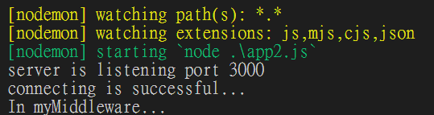
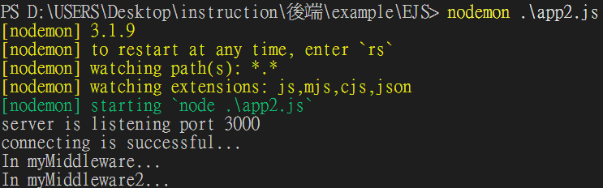
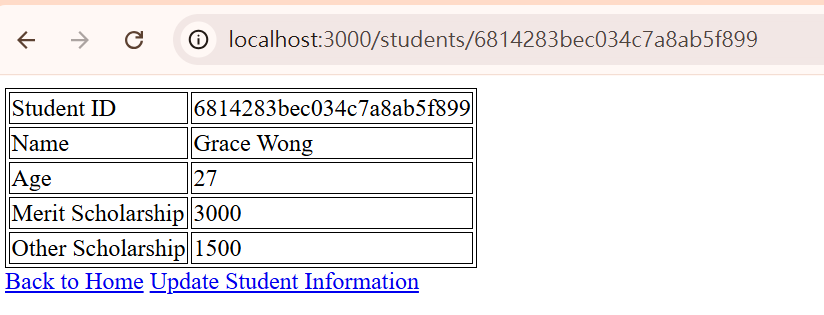
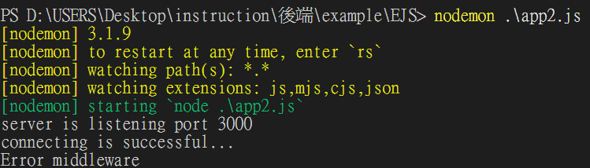
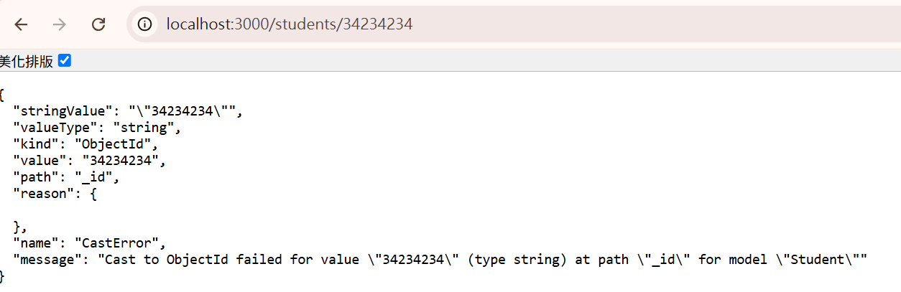
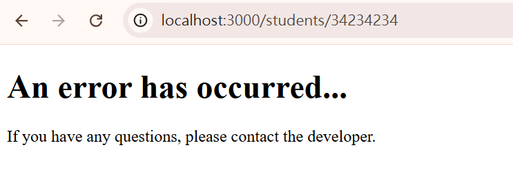

# 目錄

- [Express Middlewares](#Express-Middlewares)
- [Express Router](#Express-Router)

## Express Middlewares

> Express 中的 Middleware(中介軟體)除了可以放在所有的 routes 之前，也可以放在 route 內部的 path 以及 callbackFn 之間。語法是:

```js
app.METHOD(path, middlewareFn, callbackFn);
```

```js
const express = require("express");
const app = express();
const mongoose = require("mongoose");
const methodOverride = require("method-override"); // 新增引入
const { Schema } = mongoose;

mongoose
  .connect("mongodb://localhost:27017/demo")
  .then(() => {
    console.log("connecting is successful...");
  })
  .catch((e) => {
    console.log(e);
  });

app.set("view engine", "ejs");
app.use(express.json());
app.use(express.urlencoded({ extended: true }));
app.use(methodOverride("_method"));

const studentSchema = new Schema({
  name: String,
  age: Number,
});
const Student = mongoose.model("Student", studentSchema);

function myMiddleware(req, res, next) {
  console.log("In myMiddleware...");
  next(); // 呼叫 next()，讓流程繼續
}

app.get("/students", myMiddleware, async (req, res) => {
  try {
    let studentData = await Student.find({}).exec();
    return res.render("students", { studentData }); // 變數名要一致
  } catch (e) {
    return res.status(500).send("error...");
  }
});

app.get("/students/new", (req, res) => {
  return res.render("new-student-form");
});

app.listen(3000, () => {
  console.log("server is listening port 3000");
});
```

> students.ejs

```html
<!DOCTYPE html>
<html lang="en">
  <head>
    <meta charset="UTF-8" />
    <meta http-equiv="X-UA-Compatible" content="IE=edge" />
    <meta name="viewport" content="width=device-width, initial-scale=1.0" />
    <title>Students' home</title>
  </head>
  <body>
    <h1>Students' home</h1>
    <ul>
      <% studentData.forEach(student => { %>
      <li><a href="/students/<%= student._id %>"><%= student.name %></a></li>
      <% }) %>
    </ul>
    <a href="/students/new">Create a new student</a>
  </body>
</html>
```




> 使用時機，若某些route需要使用者登入後才准看，那就可以用這個來設定

> 也可以寫成箭頭涵式的形式

```js
app.get("/students",
 (req, res, next) => {
  console.log("In myMiddleware...");
  next(); // 呼叫 next()，讓流程繼續
}, async (req, res) => {
  try {
    let studentData = await Student.find({}).exec();
    return res.render("students", { studentData }); // 變數名要一致
  } catch (e) {
    return res.status(500).send("error...");
  }
});
```

> 若有兩個middleware執行該怎麼辦呢?要使用array的寫法

```js
app.get("/students",
[ 
  (req, res, next) => {
  console.log("In myMiddleware...");
  next(); // 呼叫 next()，讓流程繼續
  },
  (req, res, next) => {
  console.log("In myMiddleware2...");
  next(); // 呼叫 next()，讓流程繼續
  },
], async (req, res) => {
  try {
    let studentData = await Student.find({}).exec();
    return res.render("students", { studentData }); // 變數名要一致
  } catch (e) {
    return res.status(500).send("error...");
  }
});
```



之前的課程有提過，Middelware 中的 callbackFn 內可以有三個參數，分別為 req，res 以及 next。若我們希望用 middleware 來處理錯誤，則可以改用包含四個參數的 callbackFn。四個參數分別為: err,req,res,next(順序不能換)。

在 try catch block 內部，我們可以把 catch()到的錯誤，用 next()往 middleware 的方向傳送。此時，我在 express 的 app.use() 所使用的 callbackFn 則需要四個參數:err,req,res 以及 next。

```js
const express = require("express");
const app = express();
const mongoose = require("mongoose");
const methodOverride = require("method-override");
const { Schema } = mongoose;

mongoose
  .connect("mongodb://localhost:27017/demo")
  .then(() => {
    console.log("connecting is successful...");
  })
  .catch((e) => {
    console.log(e);
  });

app.set("view engine", "ejs");
app.use(express.json());
app.use(express.urlencoded({ extended: true }));
app.use(methodOverride("_method"));

const studentSchema = new Schema({
  name: String,
  age: Number,
  scholarship: {    // 你有用到 scholarship，要加這欄位
    merit: Number,
    other: Number,
  }
});
const Student = mongoose.model("Student", studentSchema);

// 修改學生資料表單頁面 (注意路由前面要有 /)
app.get("/students/:_id/edit", async (req, res, next) => {
  let { _id } = req.params;
  try {
    let foundStudent = await Student.findOne({ _id }).exec();
    if (foundStudent != null) {
      return res.render("edit-student", { foundStudent }); // 拼錯，原本是 "esit-student"
    } else {
      return res.status(400).render("student-not-found");
    }
  } catch (e) {
    next(e);
  }
});

// 新增學生 (POST)
app.post("/students", async (req, res) => {
  try {
    let { name, age, merit, other } = req.body;
    let newStudent = new Student({
      name,
      age,
      scholarship: {
        merit: Number(merit), // 資料型態轉換，避免存字串
        other: Number(other),
      },
    });
    let savedStudent = await newStudent.save();
    return res.render("student-save-success", { savedStudent });
  } catch (e) {
    return res.status(400).render("student-save-fail");
  }
});

// 修改學生資料 (PUT)
app.put("/students/:_id", async (req, res) => {
  try {
    let { _id } = req.params;
    let { name, age, merit, other } = req.body;
    let newData = await Student.findOneAndUpdate(
      { _id },
      {
        name,
        age,
        scholarship: {
          merit: Number(merit),
          other: Number(other),
        },
      },
      {
        new: true,
        runValidators: true,
        overwrite: true,
      }
    );
    return res.render("student-update-success", { newData });
  } catch (e) {
    return res.status(400).send(e.message);
  }
});

// 刪除學生資料 (DELETE)
// 路由修正: 要跟其他路由保持一致 /students 而非 /student
app.delete("/students/:_id", async (req, res) => {
  try {
    let { _id } = req.params;
    let deleteResult = await Student.deleteOne({ _id });
    return res.send(deleteResult);
  } catch (e) {
    console.log(e);
    return res.status(500).send("could not delete.");
  }
});

// 取得所有學生資料
app.get("/students", async (req, res, next) => {
  try {
    let studentData = await Student.find({}).exec();
    return res.render("students", { studentData });
  } catch (e) {
    next(e);
  }
});

// 依ID取得單一學生資料
app.get("/students/:id", async (req, res,next) => {
  let { id } = req.params;
  try {
    let foundStudent = await Student.findById(id).exec();
    if (foundStudent != null) {
      return res.render("student-page", { foundStudent });
    } else {
      return res.status(400).render("student-not-found");
    }
  } catch (e) {
    next(e);
    // return res.status(400).render("student-not-found");
  }
});

// 新增學生表單頁面
app.get("/students/new", (req, res) => {
  return res.render("new-student-form");
});

// 錯誤處理 middleware
app.use((err, req, res, next) => {
  console.error("Error middleware");
  return res.status(400).send(err);
});

app.listen(3000, () => {
  console.log("server is listening port 3000");
});
```

> student-page.ejs

```html
<!DOCTYPE html>
<html lang="en">
  <head>
    <meta charset="UTF-8" />
    <meta http-equiv="X-UA-Compatible" content="IE=edge" />
    <meta name="viewport" content="width=device-width, initial-scale=1.0" />
    <title><%= foundStudent.name %>'s Page</title>
    <style>
      table,
      tr,
      td {
        border: 1px solid black;
      }
    </style>
  </head>
  <body>
    <table>
      <tr>
        <td>Student ID</td>
        <td><%= foundStudent._id %></td>
      </tr>
      <tr>
        <td>Name</td>
        <td><%= foundStudent.name %></td>
      </tr>
      <tr>
        <td>Age</td>
        <td><%= foundStudent.age %></td>
      </tr>
      <tr>
        <td>Merit Scholarship</td>
        <td><%= foundStudent.scholarship.merit %></td>
      </tr>
      <tr>
        <td>Other Scholarship</td>
        <td><%= foundStudent.scholarship.other %></td>
      </tr>
    </table>
    <a href="/students">Back to Home</a>
    <a href="/students/<%= foundStudent._id %>/edit">Update Student Information</a>
  </body>
</html>

```

> student-not-found

```html
<!DOCTYPE html>
<html lang="en">
  <head>
    <meta charset="UTF-8" />
    <meta http-equiv="X-UA-Compatible" content="IE=edge" />
    <meta name="viewport" content="width=device-width, initial-scale=1.0" />
    <title>Error Page</title>
  </head>
  <body>
    <p>Student not found...</p>
    <a href="/students">Back to Home</a>
  </body>
</html>


```
>正常顯示學生資料



> 找不到學生時呈現的東西




> 處理錯誤資訊
```js
// 錯誤處理 middleware
app.use((err, req, res, next) => {
  console.error("Error middleware");
  return res.status(400).render("error");
});

```

> error.ejs

```html
<!DOCTYPE html>
<html lang="en">
  <head>
    <meta charset="UTF-8" />
    <meta http-equiv="X-UA-Compatible" content="IE=edge" />
    <meta name="viewport" content="width=device-width, initial-scale=1.0" />
    <title>Error Page</title>
  </head>
  <body>
    <h1>An error has occurred...</h1>
    <p>If you have any questions, please contact the developer.</p>
  </body>
</html>

```
