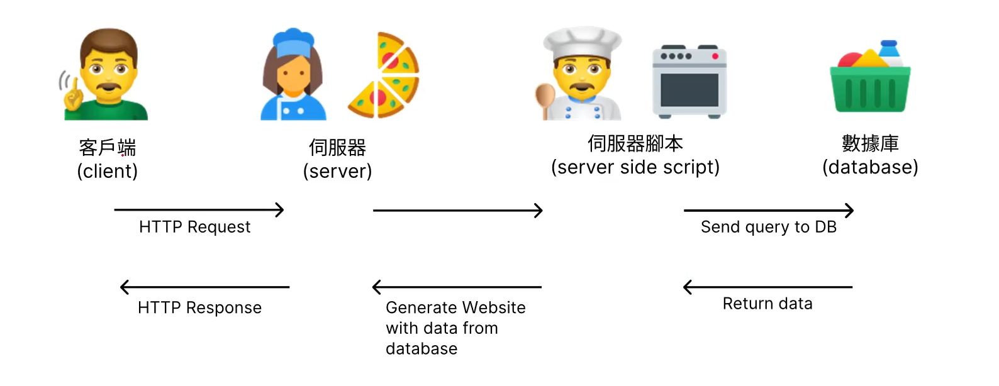
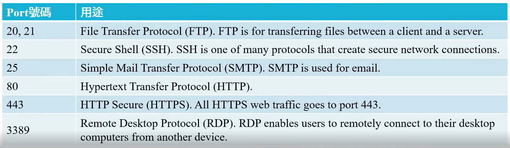
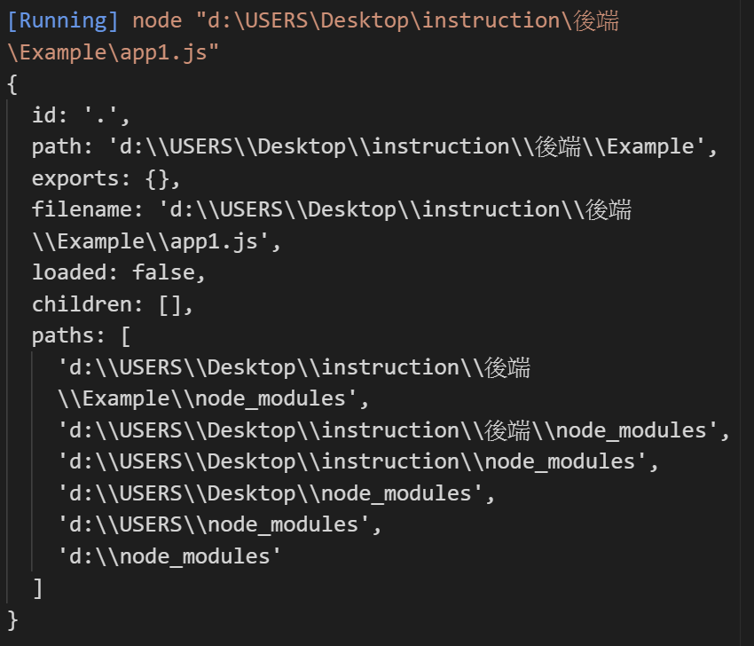
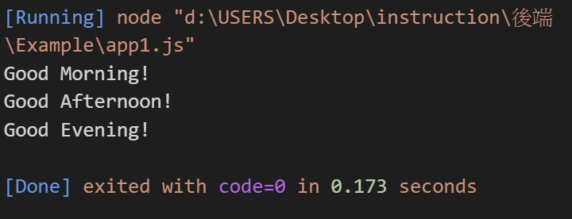
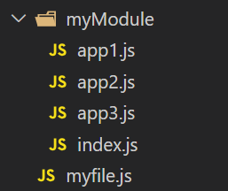
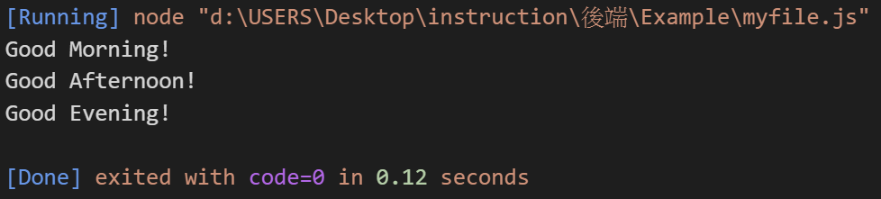

# 目錄

- [靜態網頁和動態網頁](#靜態網頁和動態網頁)
- [後端網頁開發工具](#後端網頁開發工具)
- [Module Wrapper](#Module-Wrapper)
- [Nodejs Modules](#Nodejs-Modules)
  - [內建 Module](#內建-Module)
  - [Self-Made Module](#Self-Made-Module)
  

# 靜態網頁和動態網頁

- 靜態網頁: 在客戶端若要跟網頁溝通，須給一個 https 的 請求(request)，那伺服器端就會直接返回請求，無需等待
  - 靜態網站(static website)由使用 HTNL，CSS 和 Javascript 創建的網頁組成。靜態網站上的每個頁面都儲存為單個 HTML 文件，該文件完全按原樣從伺服器直接傳送到用戶端。
    - 優點:
      - 更快的頁面加載速度。由於網頁都已預先製作完成，伺服器的工作只是傳送文件，無需從數據庫找資料或在 server side script 做驗證等工作，所以加載速度會比動態網頁快速。由於頁面加載速度是由谷歌評估網站性能的關鍵部分(對 SEO 和排名性能有影響)，這個優點不應該被低估。
      - 創建與部屬快速。靜態網站的創建和發布速度更快，因為他們複雜度較低，並且不需要有組織的連接到資料庫。網頁製作完成後，靜態網頁的部屬較簡單，因為只需要將文件放置到伺服器上即可。相對的，動態網頁需要避免資料庫被駭客入侵、攻擊，設定伺服器端腳本與資料庫都需要額外的工作
      - 安全性較高。靜態網頁不與數據庫連接，也不使用外部套件。數據庫與外部套件都可以成為攻擊的常見入口點。
    - 缺點:
      - 有限的可擴展性。雖然可以使用靜態網頁構件數百個頁面，但這始終是一個緩慢而漫長的過程。網頁因為沒有連接儲存使用者資訊的數據庫，無法針對每個使用者提供客製化的內容
      - 管理效率低。靜態網站的創建速度可能更快，但管理起來可能更耗時。因為需要逐頁編輯靜態網站，並且隨者網站頁面更多，不斷大量更新快速變化的內容耗時又耗力
  - 例子:這家餐廳的服務員(伺服器端)已經存放很多 pizza 客人(顧客端)點 pizza 後直接拿出來即可


- 動態網頁: 客戶端會送一個 https 的 request 到伺服器這邊，伺服器收到後會拿到伺服器端的腳本看是否符合資源後去跟數據庫聯絡，聯絡完後再從數據庫返回資源給伺服器腳本，之後產生資料給伺服器再給客戶端
  - 使用伺服器腳本(serve-side script)和技術建構的動態網站允許根據用戶行為，即時地顯示每個頁面的不同內容，例如，每個人的 YouTube 首頁顯示的推薦影片都不相同，因為 Youtube 會根據數據庫中儲存的使用者的觀察紀錄、習慣、訂閱內容等等的因素改變推薦影片
  - 通常，動態網站用於內容繁重且與用戶互動平凡的網站。假設我們要架設的網站是房地懺網站。我們需要生成數百個頁面來列出數百個房市資訊，且這些頁面上的內容需要反映即時的可用資訊，我們就需要選擇用動態網頁。墊子商務網站、社群網站、在線論壇、會員網站、串流影音平台等等是其他常見的動態網頁類型。
  - 優點:
    - 維護更容易且更快。使用數據庫來儲存資料，每個網頁的製作依賴伺服器端腳本(server-side script)去抓取資訊並且生成網站
    - 可擴展性。若從一開始就沒有計畫建立一個大型網站，動態網站的架構也可以讓我們在必要時進行擴展
    - 更好的用戶體驗。動態網站提供根據用戶需求量身訂製的內容
    - 功能更強大。伺服器端腳本可用更多更強大的演算法來增加網頁功能性
  - 缺點:
    - 需要更多資源才能建立。由於設定數據庫並將其連接到正確頁面所需的額外步驟，動態網站的設置和運行可能會更加複雜，這也意味著成本更高
    - 性能問題，動態網站比靜態網站有更多的處理指令，不斷從數據庫提取資訊以顯示網頁內容都需要時間來處理執行。
  - 例子:這家餐廳的服務員(伺服器)接收到顧客(顧客端)點餐後，須向廚師(伺服器腳本)請示要做什麼，廚師再看是否有符合的食材(數據庫)，有的話在拿出來料理後給服務員，服務員最後再拿給顧客



# 後端網頁開發工具

1. PHP、Laravel(PHP Framework)
2. Node.js、Express.js (Server-Side JavaScript)
3. Java、Java Spring Framework
4. Ruby on Rails
5. Python Django、 Flask Framework

**Node.js**

- `Node.js`: 是能夠在伺服器端運行 JavaScript 的開放原始碼、跨平台執行環境。在`Node.js`出現之前，JavaScript 通常做為瀏覽器上的客戶端程式設計語言使用，以 JavaScript 寫出的程式通常能夠在使用者的瀏覽器上執行。Node.js 的出現使 JavaScript 也能用於伺服器端腳本編寫。

- `Node.js`內部採用 V8 JavaScript 執行引擎作為核心引擎

# Module Wrapper

- 在 Node.js 當中，module 是指一組程式碼，組織成簡單或複雜功能，可被用來與外部其他程式碼連結。Module 可以是單個文件，或是多個文件與資料夾的集合

- 在執行 module 的程式碼之前，Node.js 將使用如下所示的函數包裝器來包裝它:

```
(function(export,require,module,__filename,__dirname){
    //Module code actually lives in here.
})
```

> 一個 js 的文件可以為一個 module， 多個 js 的文件也可以稱為 module

**app1.js**

```js
console.log("This is app1.js");
```

```shell
node .\app1.js
```

> 在執行時實際上會長這樣

```js
(function(export,require,module,__filename,__dirname){
   console.log("This is app1.js");
})
```

> 這樣做有什麼好處呢?

1. 讓使用這個 module 的文件中，所使用的 global variable 不會被 module 內部的變數影響

**app2.js**

```js
let num = 10; //global variable
console.log(num);
```

**app1.js**

```js
require("./app2");
let num = 30; //local variable
console.log(num);
```

```shell
node .\app1.js
```

> 在執行時**app1.js**實際上會長這樣

```js
(function(export,require,module,__filename,__dirname){
   let num = 10; //local variable
   console.log(num); //10
})
let num = 30; //global variable
console.log(num); //30
```

2. 讓 module 內部所定義的 global variable 變成 function scope

3. 讓 module 內部的 JS 文件可以使用某些實用的變數，例如:module、exports 可以用來輸出本身 module， 而 require 可以用來獲得其他 module

4. `__filename`, `__dirname` 等等變數在開發上變得方便，因為兩者包含 module 的絕對路徑名稱與資料夾路徑

```js
console.log(__dirname); //d:\USERS\Desktop\Example
console.log(__filename); //d:\USERS\Desktop\Example\app1.js
```

```shell
node .\app1.js
```

# Nodejs Modules

Node.js 的modules分成三種:

1. Node.js內建的modules，可以直接拿來使用
[官方網站](https://nodejs.org/docs/latest/api/)
2. 我們自己製作的modules。
3. 網路上第三方製作的modules，可以透過npm(node package manager)下載來使用

## 內建 Module

### fs(file system)

```js
const fs = require("fs");
fs.writeFile("myFile.txt","test",(e)=>{
  if(e) throw e;
  console.log("finished!");
})
```

```js
const fs = require("fs");
fs.readFile("myFile.txt","utf-8",(e,data)=>{
  if(e) throw e;
  console.log(data);
})
```

### http module
- http module creates web servers

#### 前提基礎認識:

- IP位址
  - (IP Address，全稱:`Internet Protocol Address`):又稱為網際網路協定位址，是網際協定中用於標識傳送或接收資料裝置的一串數字(相當於每個在網路上的電腦地址)
  - 常見的IP位址分別為IPv4與IPv6兩大類，IP位址由一串數字組成。IPv4為32位元長，通常書寫時以四組十進位數字組成，並以點分隔，如:`172.16.254.1`;IPv6為128位元長，通常書寫時以八組十六進位數字組成，以冒號分割，如:`2001:db8:0:1234:0:576:8:1`
  - IPv4中的每8個digit都會被轉換為0到255之間的整數；因此，IPv4通常是`168.1.7.0`而不是`10101000.00000001.00000111.00000000`。用前者更容易讓人記憶。
  - 根據IPv4地址的格式，全世界有多少個不同的設備可以同時上網?
  - 32 bits可以製作出2^32個不同的IP地址。2^32 = 4294967296，約43億。但是，這是世界上大約有72億人，且每個人可能擁有超過一個與網路連接的設備，所以用IPv4地址的格式可能會有一天不夠用。
  - 因此，IPv6於1990年代引入；IPv6使用128位元，將確保地球上的每一個人、裝置、每一塊岩石和沙子都能夠擁有一個IPv6地址

- DNS(Domain Name System)
  - 是網際網路的一項服務。它作為將域名(Domain Name)和IP位址相互對應的一個分散式資料庫，能夠使人更方便地存取網際網路。DNS旨在讓人們記住域名，而不是無意義的數字。例如，記住www.youtube.com比記住168.112.0.12更容易的多。

**例子**


- Port: 伺服器中的port式網路通訊連接時，邏輯上的端點(endpoint)，用於在伺服器和客戶端之間交換訊息。每個port被分配一個為一的數字來單獨識別它們。
  - 例子: port就像一間公司有好幾個部門，要處理事情必須找對部門(窗口)，才有辦法處理

- 一些最常用的端口以及其相關的網路協議是:



- 例如，若Google伺服器是https://www.google.com，我們希望發出HTTPs Request，則可以對者`https://www.google.com:443`發出請求，即可連線到Google伺服器上處理HTTPs請求的port。因為沒有必要顯示，所以網址後面的:443通常在網頁瀏覽器是看不到的

- 另一方面，Google伺服器有著24小時不停止運作的腳本語言，在處理任何來字port 443的請求，腳本的Pseudocode如下:

- 處理FTP請求

```Pseudocode
app.listen(20,()=>{//return a file to client})
```

- 處理SMTP請求

```Pseudocode
app.listen(25,()=>{//return an email to client})
```

- 處理HTTPs請求

```Pseudocode
app.listen(25,()=>{//return a webpage to client})
```

- `localhost:3000`
  - 在電腦網路中，localhost(意味「本地主機」，指「這台電腦」)是給迴路網絡接口(loopback)的一個標準主機名，相對應的IP位址為127.0.0.1 (IPv4)。在DNS中，localhost這個domain name會被換成127.0.0.1。
  - 我們可以在自己的電腦上面架設並且運行伺服器。當我們要使用同一台電腦連結在自己的電腦上面伺服器時，可以透過寄送請求到localhost，就可以連到自己的電腦上，這就是迴路網絡接口(loopback)
  - 通常我們在本機上的網頁伺服器，都是使用port 3000或是8080(但基本上可以設定任何1000~9999內的數字)

#### HTTP Request and Response

- HTTP Request以及Response的基本規定格式如下:
 - Request-Line for HTTP Request, Status-Line for HTTP Response
 - Header: encoding、length
 - An empty line indicating the end of the header fields
 - Optionally a message section

> 在HTTP中定義了client和server，要請求時可以有四種請求

1. GET Request
2. POST Request
3. PUT Request
4. DELETE Request

- 一個基礎的GET Request
```http
GET /index.html HTTP/1.1
HOST: Joanhu.note.edu
<BLANK LINE>
```
> GET: HTTP verb
> host: header

- 一個基礎的Response會是:
```http
HTTP/1.1 200 OK
Content-Length: 1555
Content-Type: text/html; charset=ISO-8859-1

<!DOCYTYPE html>
<html>
<body>
...
```

> 200: status code

- 如果網頁交出表格資料，請使用GET request 的話:
```http
GET /index.html?name=Joan&age=24 HTTP/1.1
HOST: Joanhu.note.edu
<BLANK LINE>
```
- Post Request 內部有表格資料的話
```http
POST /index.html HTTP/1.1
HOST: Joanhu.note.edu
Content-Type: application/x-www-form-urlencoded; 
Content-Length: 33

username=Joan@password=alongpassword
```
- 帶有cookie設定的response:
```http
HTTP/1.1 200 OK
CONTENT-LENGTH: 200
CONTENT-TYPE: text/html
SET-COOKIES: session_id = adsfklasdklfjaslkd;asdawdawdwad;awdawdwdawdawd

<!DOCTYPE html>
```

- 帶有cookie設定的request:
```http
Get /index.html HTTP/1.1
HOST: Joanhu.note.edu
COOKIES: session_id = adsfklasdklfjaslkd
<BLANK LINE>
```

## Self-Made Module

- Self-Made Module
  - 在Module Wrapper中提供的變數:
    - module變數是個物件，此物件包含此文件的內部訊息，包含id，path，exports，parant，filename等等資訊。
    - exports是module物件的屬性，本身是個empty object。
    - require 是一個function，可以讀取一個JavaScript文件，執行該文件，然後return這個文件的exports objext。若讀取的是一個資料夾，則讀取該資料夾內的index.js文件，執行該文件，然後return這個文件的exports object。

**module變數**

```js
console.log(module)
```



**exports**

- `app2.js`

```js
function morning(){
  console.log("Good Morning!")
}
function evening(){
  console.log("Good Evening!")
}
module.exports.morning = morning;
exports.evening = evening;
```

- `app3.js`

```js
function afternoon(){
  console.log("Good Afternoon!")
}

exports.afternoon = afternoon;
```

**require**

- `app1.js`

```js
let app2 = require("./app2")
let app3 = require("./app3")
app2.morning();
app3.afternoon();
app2.evening();
```



**Folder**

- `app1.js`
```js
function callApp() {
  app2.morning();
  app3.afternoon();
  app2.evening();
}
exports.callApp =callApp
```
- `index.js`
```js
let app1 = require("./app1")

exports.callApp =app1.callApp;
```
-`myfile.js`
```js
let myModule = require("./myModule")
myModule.callApp();
```


