# 目錄

- [OAuth 流程](#OAuth-流程)
- [Google client id 與 secret](#Google-client-id-與-secret)
- [Google 登入頁面](#Google-登入頁面)
- [儲存使用者資訊](#儲存使用者資訊)
- [顯示使用者資訊](#顯示使用者資訊)
- [註冊本地使用者](#註冊本地使用者)
- [登入本地使用者](#登入本地使用者)
- [製作 Post](#製作-Post)
- [RFC 6749 導讀與詳細說明](#RFC-6749-導讀與詳細說明)

## OAuth 流程

我們可以依靠另一方(如Facebook)來驗證某人的真實性，而不是使用密碼。大多數網站讓用戶在本地身分驗證(local authentication)或使用其他服務之間進行選擇。我們可以使用OAuth以幫助新舊用戶簡化註冊/登入過程。假設用戶已經在瀏覽器中登入Facebook， 則用戶只需要單擊一個按鈕即可登入我們的網站，而不需要填寫個人資料表格或是註冊新的密碼。

大多數網站都會使用OAuth來提高轉化率，擊訪問網站者中的註冊百分比。若用戶覺得註冊帳戶非常容易，更多的用戶會傾向註冊帳戶。每個帳戶都有點子郵件地址，網站也可以開始通過電子郵件向用戶進行營銷。

OAuth 2.0是一種安全協議，協議規範能讓第三方應用程式以有限的權限，透果構建資源擁有者與網路伺服器間的許可交互機制，讓第三方應用程式代表資源擁有者訪問伺服器。OAuth常見名詞:

- Resource Owner: 資源擁有者，即網頁的使用者。資源是指網頁使用者的個人資料與授權

- Client: 客戶端，指的是使用第三方應用程式的網站本身。

- Authorization Server: 授權伺服器，指的是Google,Facebook等大型系統，也就是給予授權的伺服器。

- Resource Server: 資源伺服器，指的是Google,Facebook等大型系統中，存放資源擁有者被保護資訊的位置。

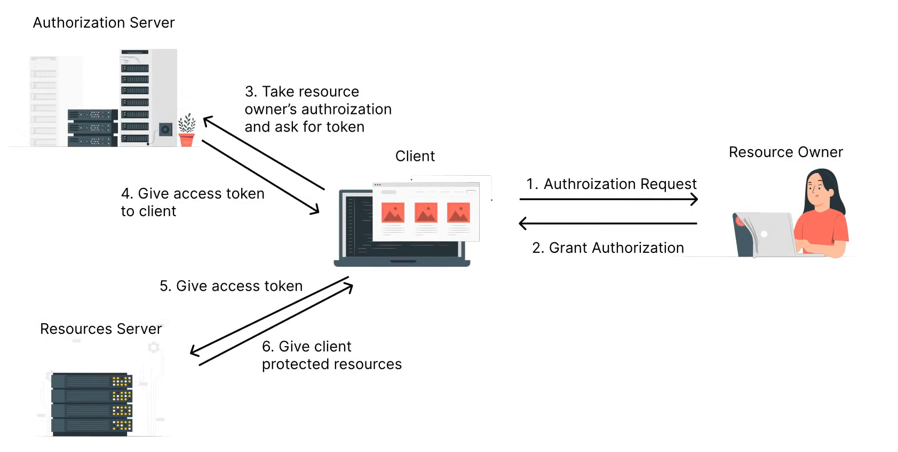

**詳細流程**

1. Site A 到 Site B 註冊自己，並且從Site B 拿到Secret以及一個ID。

2. 當使用者X告訴Site A去存取在Site B上的資料，使用者X會被透過Site A的ID送到Site B，並且告訴Site B說自己同意Site A來獲取自己存在這裡的資訊。

3. Site B 接下來會把使用者X導回Site A，並且附上一個 Authorization Code。

4. Site A接下來把Authorization Code以及在Site B註冊時得到的secret送到Site B。

5. Site B 確認了 Site A給的secret，確認沒有其他網站冒充Site A，並且透過Authorization Code 確認使用者X確實給了Site A授權來存取使用者X的資訊，於是Site B將security token 寄給Site A。

6. Site A接下來拿者 security token 到 Site B去取得所需資料。

**架設流程**

1. 架設一個網站，使用者須先有Google帳號，並且在此網站後點選使用google登入，此時會跳轉畫面請求登入google，登入完後google會給此網站兩組英數字碼；client_id以及secret。登入完後會跳轉到我們設定的redirect URL，此URL是Google驗證使用者完成後，跳轉的地方。

2. 網站需要製作一個anchor tag，連結到`/auth/google`。網頁使用者點即連結，就會被送到Google登入畫面。

3. 網頁使用者登入google後，google會在Authorization Server內部製作一組code，這組code專屬於此網站以及目前的使用者。

4. 此網站先把secret連同剛剛收到的一組code帶到Authorization Server取得token。

5. 取得token後，網站用token向Google Resource Server取得使用者資訊。

6. 認證成功後，Google Authorization Server會用HTTP status code 302把使用者重新導向到我們設置的redirect URL，`https://domainName/auth/google/redirect?code=______`，其中code會是剛剛得到到那一組code，而`/auth/google/redirect?`這個route由網站後端處理。

7. 網站可以在`/auth/google/redirect`這個route中，先確認了使用者已經被驗證了(可以用passport.authenticate('google'))，再將使用者導向登入後頁面，對使用者來說2到6步都是不可見的。


## Google client id 與 secret

1. 建立Google專案

[google cloud](https://console.cloud.google.com/apis/dashboard)

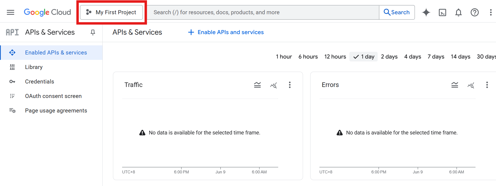
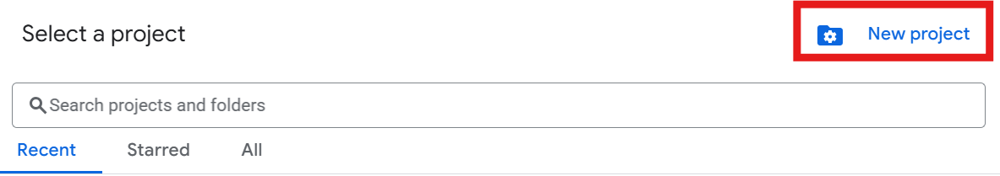
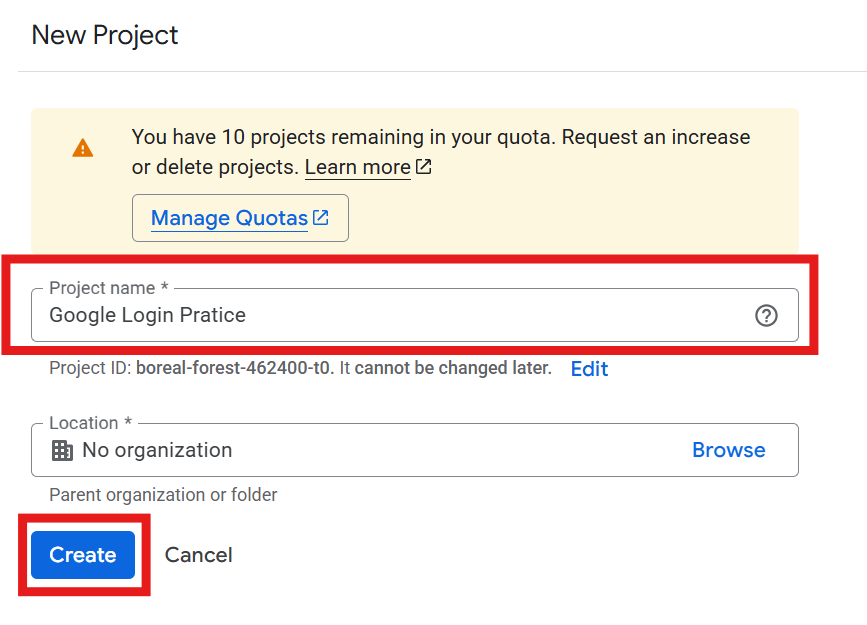

2. 建立金鑰

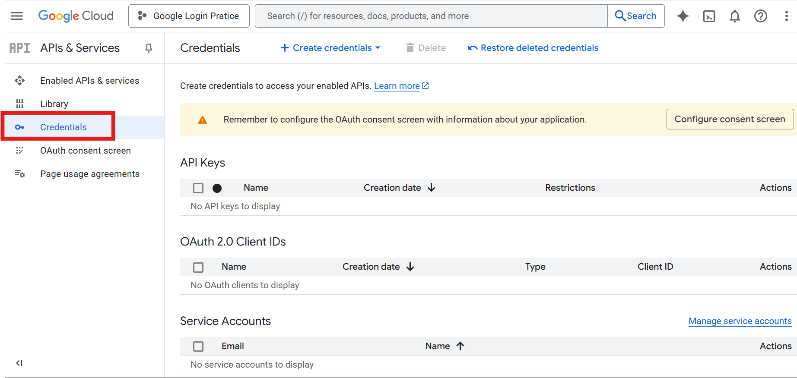
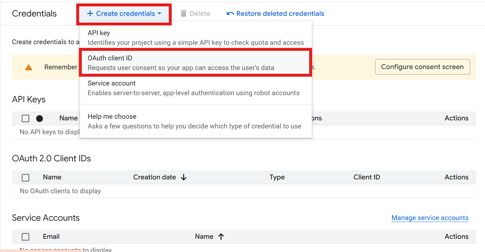
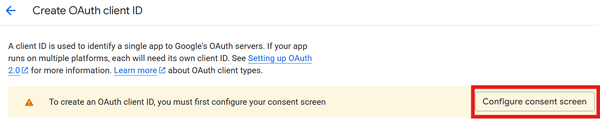
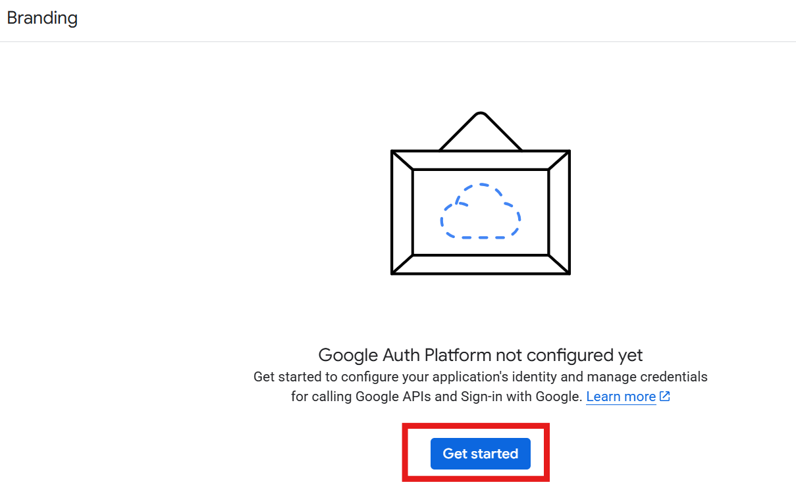
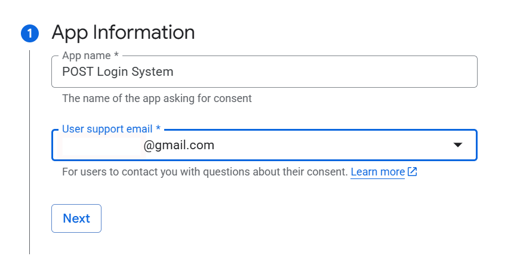
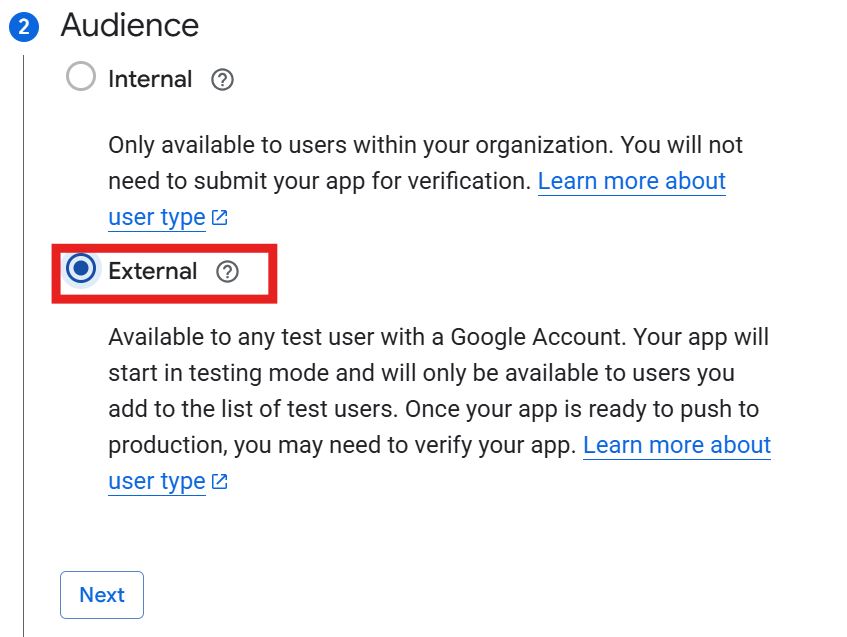
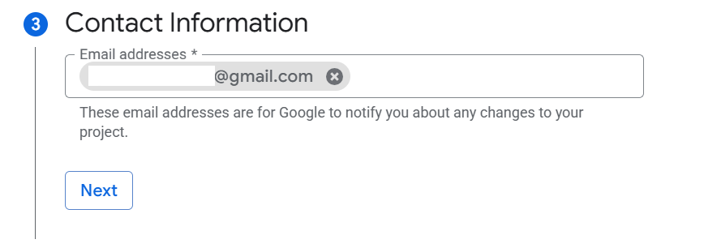
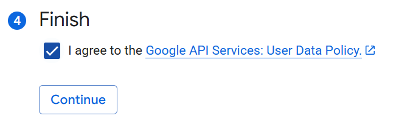

3. 設定金鑰

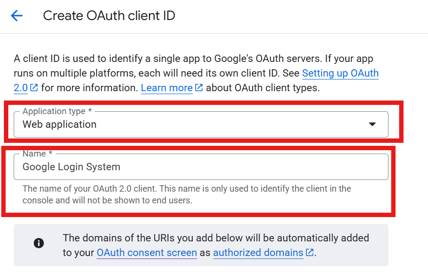
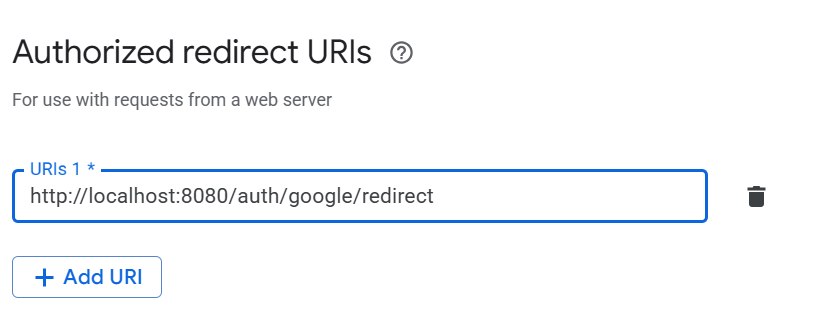
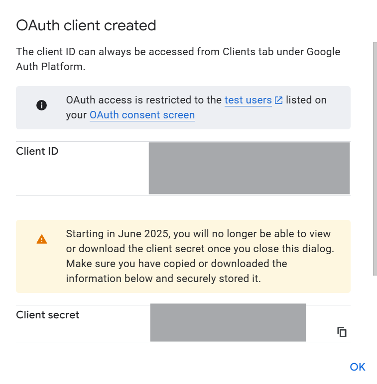
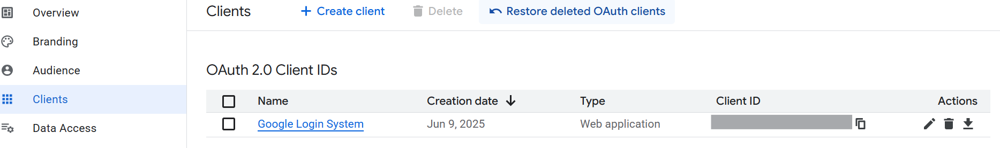


## Google 登入頁面

**Passport 套件**

Passport.js是適用於Node.js中，用來做身分驗證的middleware。使用Passport.js，我們可以將OAuth身分驗證的功能輕鬆集成到任何基於Node和Express的應用程序。

Passport 庫提供了500多種身分驗證機制，包括本地身分驗證、Google、Facebook、Twitter、GitHub、LinkedIn、Instagram登入等等功能。

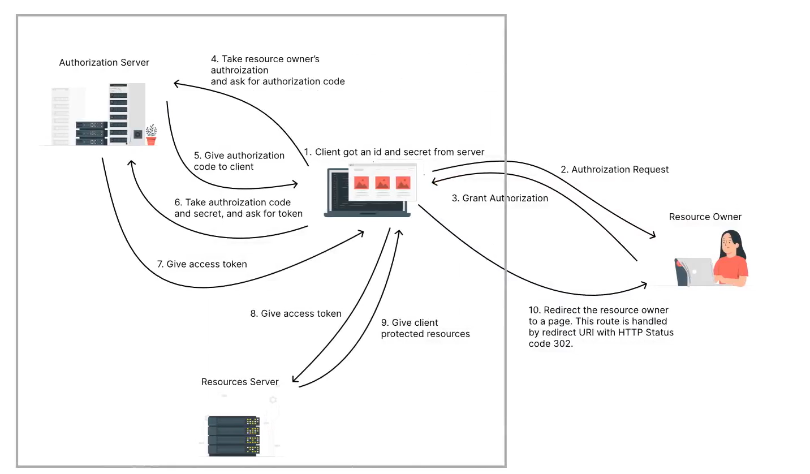

上圖框框的部分都會由Passport隱藏起來。對於client來說,只需要提供client_id,secret以及redirect URL給Passport,Passport就會提供token以及protected resource給client。

[passportjs](https://www.passportjs.org/)

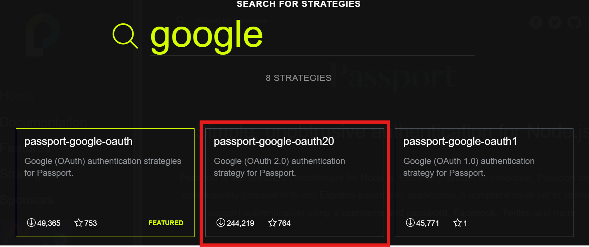

[google-oauth2.0](https://www.passportjs.org/packages/passport-google-oauth20/)

因為Passport 把所有跟OAuth有關的步驟都自動完成了，所以我們程式碼是從獲得token與resource owner的資料後，以及redirect的部分開始撰寫。(內部的步驟有點繁瑣且複雜，需要一些耐心。)

1. 先設定Google Strategy的登入方式。Google Strategy需要兩個parameter，第一個parameter是一個物件，內部含有client id, client secret以及一個callback URL。第二個parameter是一個function。

2. 用戶端在Google登入頁面按下登入後，Passport會自動完成Oauth的步驟，取得用戶的資料後，Passport會自動調用Google Strategy第二個parameter內部的function。此function的參數為accessToken， refreshToken, profile, done。其中profile代表Passprot從Google取得的用戶資料。

3. 我們可以在此function內部判斷，若此用戶為第一次登入系統，則將從Google取得的用戶資料存入我們系統的資料庫內。

4. 在此Function的第四個參數done是一個function。我們可以將使用者資訊放入done的第二個參數內，並且執行done()。

在程式開發當中，Serialization是指，將數據(或是物件)傳輸或儲存之前，將其轉換為bytes的過程。Deserialization則是指將bytes轉換回到物件。

Passport將這部分的實作留給開發者自己決定怎麼實踐Serialization與Deserialization的功能，傳統上來說，Serialization的做法，是簡單的將用戶端的id存入session。而Deserialization的做法是將session內部的id拿去資料庫查看資料，將id所指向的資料取回。

在Passport當中，serialization與deserialization的功能名稱叫做serializeUser與deserializeUser。我們實作這兩個功能之前，需要先使用express-session這個套件的功能，幫session做簽名等功能。

以上的功能都設定好後，在Google Strategy內部的第二個參數的function所使用的第四個參數done被我們執行時，Passport會透過express-session套件去自動執行passport.serializeUser()。serializeUser()參數為user與done。user會被自動帶入Google Strategy的done的第二個參數。passport.serializeUser()也會自動帶入以下的兩個功能(當內部的done()被執行時):

1. 內部的done()執行時，將參數的值放入session內部，並且在用戶端設置cookie。

2. 設定req.isAuthenticated()為true。

serializeUser完成後，Passport會執行callback URL的route。進入此route之後，Passport會執行deserializeUser()。

Passport在deserializeUser()額外付加的一個功能，就是當deserializeUser()內部的done()被執行時，第二個參數會被設定在req.user內部。為何Passport會如此設計？這是因為，從使用者登入後，我們目前只有執行過serializeUser，也就是將使用者的登入資訊存入session內部。但使用者或許曾經登入過系統，是個舊用戶，以前曾在系統內有存過其他資料。我們讓使用者開始使用網站之前，最好可以把這些資料放在一個方便存取的地方，這就是Passport為何會提供「deserializeUser()內部自動設定req.user的值是done()的第二個參數的值」這個功能。

最後，callback URL內部會將使用者導向到網頁的其他地方。在這些route內部，我就可以使用req.user這個屬性來客制化網頁的內容。

以下幾個為Passport內建的methods:

- req.logout(): 登出使用者。Passport會自動刪除session。
- req.isAuthenticated(): 給定boolean的值，代表使用者是否被認證過。

> 正式試做

1. 開啟新專案，下載要用的npm

```shell
npm init
```

```shell
npm install express mongoose ejs dotenv
```

2. 創建一個index.js文件

```js
const dotenv = require("dotenv");
dotenv.config();
const express = require("express");
const app = express();
const mongoose = require("mongoose");

//connect MongoDB
mongoose.connect("mongodb://localhost:27017/GoogleDB").then(()=>{
  console.log("Connecting to mongodb....");
}).catch((e)=>{
  console.log(e)
})

//setting Middlewares and ejs

app.set("view engine","ejs");
app.use(express.json());
app.use(express.urlencoded({ extended: true }));

app.get("/",(req,res)=>{
  return res.render("index")
})

app.listen(8080,()=>{
  console.log("Server running on port 8080.")
});
```
3. 創建index.ejs和其餘的模板

> index.ejs

```html
<!DOCTYPE html>
<html lang="en">
  <head>
    <%- include("partials/header") %>
    <title>Home</title>
  </head>
  <body>
    <%- include("partials/nav") %>
    <div class="p-5 mb-4 bg-light rounded-3">
      <div class="container-fluid py-5">
        <h1 class="display-5 fw-bold">Project 7 - Google and Local Login System</h1>
        <p class="col-md-8 fs-4">
          The practice of Project 7 includes using EJS, MongoDB, Passport.js, Authentication, OAuth (Google Login Setup), and other examples.
        </p>
        <button class="btn btn-primary btn-lg" type="button">
          Learn how to build a website!
        </button>
      </div>
    </div>
  </body>
</html>

```

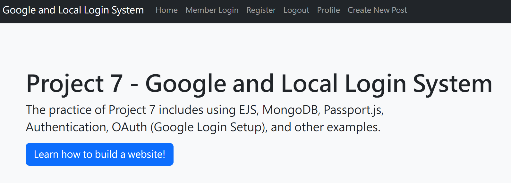

4. 下載 passport-google-oauth20 和 passport

```shell
npm install passport-google-oauth20
```

```shell
npm install passport
```

5. 新增一個routes的資料夾，並且新增一個auth-routes.js的文件

```js
const router = require("express").Router();
const passport = require("passport");

router.get("/login",(req,res)=>{
  return res.render("login")
})

module.exports = router;
```
> index.js
```js
const dotenv = require("dotenv");
dotenv.config();
const express = require("express");
const app = express();
const mongoose = require("mongoose");
const authRoutes = require("./routes/auth-routes");

//connect MongoDB
mongoose.connect("mongodb://localhost:27017/GoogleDB").then(()=>{
  console.log("Connecting to mongodb....");
}).catch((e)=>{
  console.log(e)
})

//setting Middlewares and ejs

app.set("view engine","ejs");
app.use(express.json());
app.use(express.urlencoded({ extended: true }));

//setting routes
app.use("/auth", authRoutes)

app.get("/",(req,res)=>{
  return res.render("index")
})

app.listen(8080,()=>{
  console.log("Server running on port 8080.")
});
```
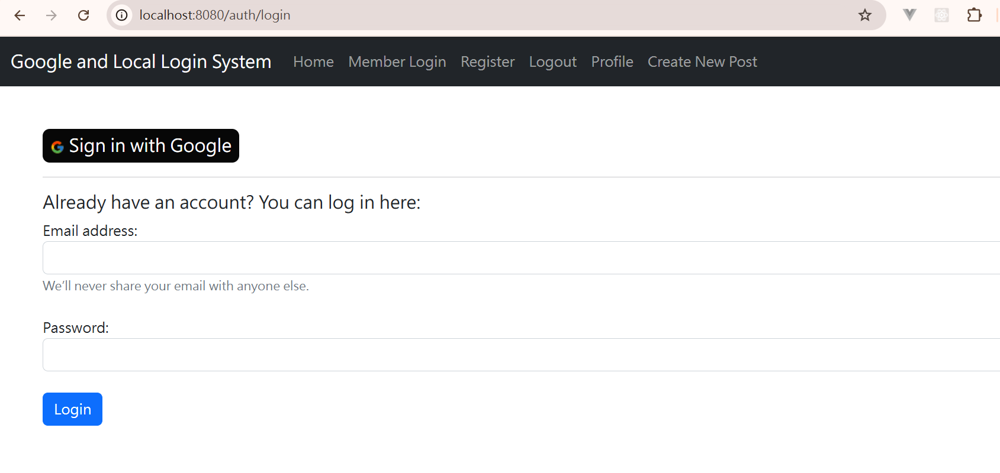

6. 新增一個config資料夾，在裡面新增passport.js文件

```js
const passport = require("passport");
const GoogleStrategy = require("passport-google-oauth20")

passport.use(new GoogleStrategy(
  {
     clientID: process.env.GOOGLE_CLIENT_ID,
     clientSecret: process.env.GOOGLE_CLIENT_SECRET,
     callbackURL:"/auth/google/redirect",
  },
  (accessToken, refreshToken, profile, done) => {}
 )
);
```
7.製作一個.env的文件，放入Client ID和Client secret

```js
GOOGLE_CLIENT_ID="111111111111-0aaaa00b0cdef0ghijkl000mnmm0p0uj.apps.googleusercontent.com"
GOOGLE_CLIENT_SECRET="GOOGLE-isSEC-secret_FA_C_KP5433YAA_A"
```

> autho-routes.js

```js
const router = require("express").Router();
const passport = require("passport");

router.get("/login",(req,res)=>{
  return res.render("login")
})

router.get('/google', 
  passport.authenticate('google', {
    scope: ['profile', 'email'],
    prompt: 'select_account'
  })
);
```

> index.js新增下面這一行

```js
require("./config/passport");
```

執行下面指令

```shell
nodemon index.js
```

點擊`Sign in with Google`

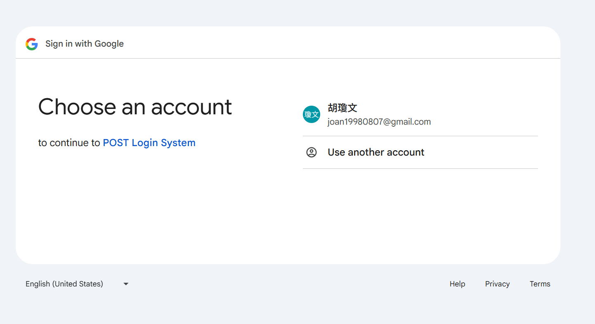

## 儲存使用者資訊

> passport.js

```js
const passport = require("passport");
const GoogleStrategy = require("passport-google-oauth20")

passport.use(new GoogleStrategy(
  {
     clientID: process.env.GOOGLE_CLIENT_ID,
     clientSecret: process.env.GOOGLE_CLIENT_SECRET,
     callbackURL:"/auth/google/redirect",
  },
  (accessToken, refreshToken, profile, done) => {
   console.log(profile)
  }
 )
);
```

> auth-routes

```js
router.get('/google/redirect',passport.authrnticate("google"),(req,res)=>{
  return res .redirect("/profile")
})
```

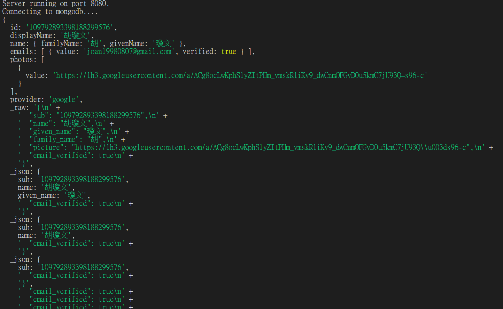

> user-model.js

```js
const mongoose = require("mongoose");

const userSchema = new mongoose.Schema({
  name:{
    type: String,
    required: true,
    minLength: 3,
    maxLength: 255,
  },
  googleID:{
    type: String,
  },
  date:{
    type: Date,
    default: Date.now,
  },
  thumbnail:{
    type:String,
  },
  // local login
  email:{
    type: String,
  },
  password:{
    type: String,
    minLength: 8,
    maxLength: 1024,
  }
});

module.exports = mongoose.model("User",userSchema);
```

> passport.js

```js
const passport = require("passport");
const GoogleStrategy = require("passport-google-oauth20")
const User = require("../models/user-model");
const userModel = require("../models/user-model");

passport.use(new GoogleStrategy(
  {
     clientID: process.env.GOOGLE_CLIENT_ID,
     clientSecret: process.env.GOOGLE_CLIENT_SECRET,
     callbackURL:"/auth/google/redirect",
  },
  async (accessToken, refreshToken, profile, done) => {
   console.log("Entered the Google Strategy section!");
   console.log(profile);
   console.log("============================");
   let foundUser = await userModel.findOne({googleID: profile.id}).exec();
   if(foundUser){
      console.log("This user is already registered.");
      done(null,foundUser)
   }else{
      console.log("A new user has been detected!");
      let newUser = new User({
         name: profile.displayName,
         googleID: profile.id,
         thumbnail: profile.photos[0].value,
         email: profile.emails[0].value,
      });
      let saveUser = await newUser.save();
      console.log("Successfully created a new user");
      done(null,saveUser);
   }
  }
 )
);
```

> 安裝express-session

```shell
npm install express-session
```

> 在index.js裡面加入session和passport

```js
const session = require("express-session");
const passport = require("passport")
app.use(session({
  secret: process.env.SESSION_SECRET,
  resave: false,
  saveUninitialized: false,
  cookie: {secure: false},
}))
app.use(passport.initialize());
app.use(passport.session());
```

> 在.env檔案設定`SESSION_SECRET`

```js
SESSION_SECRET="THISISASESSIONSECRET"
```
> passport.js裡加入serializeUser()

```js
passport.serializeUser((user, done)=>{
   console.log("Serialize User....")
   console.log(user);
});
```

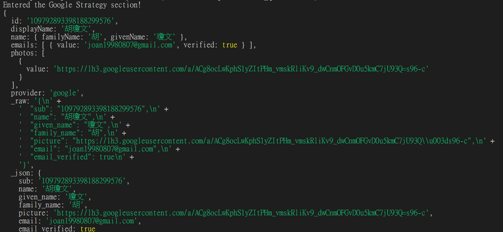
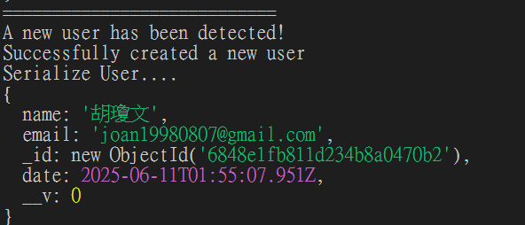

使用done在serializeUser裡面

```js
passport.serializeUser((user, done)=>{
   console.log("Serialize User....")
   done(null, user._id); // Save the MongoDB id in the session, and sign the id before sending it to the user as a cookie.
});
```

## 顯示使用者資訊

> passport.js (Deserialize)

```js
passport.deserializeUser(async (_id,done)=>{
   console.log("Deserialize User... Use the id saved by serializeUser to find the data in the database");
   let foundUser = await User.findOne({ _id });
   done(null,foundUser)
})
```

> 在routes的資料夾裡面，做一個profile的檔案

> profile-routes.js

```js
const router = require("express").Router();

router.get("/",(req,res)=>{
  return res.render("profile", {user: req.user}); //deSerializeUser()
})

module.exports = router;
```

> profile.ejs

```html
<!DOCTYPE html>
<html lang="en">
  <head>
    <%- include("partials/header") %>
    <title>Profile Page</title>
    <style>
      .posts {
        padding: 2rem;
      }
      section.user-info img {
        border-radius: 50%;
        display: inline-block;
        padding: 1rem 0.5rem;
      }
      section.user-info h1 {
        padding: 1rem 0.5rem;
      }
      .flex-container {
        display: flex;
        align-items: center;
      }
    </style>
  </head>
  <body>
    <%- include("partials/nav") %>
    <section class="user-info">
      <div class="flex-container">
        " alt="Profile Picture" />
        <h1><%= user.name %>'s Profile Page</h1>
      </div>
      <ul>
        <li>Google ID: <%= user.googleID %></li>
        <li>Date: <%= user.date %></li>
      </ul>
    </section>
  </body>
</html>
```

> index.js

```js
const profileRoutes = require("./routes/profile-routes");
app.use("/profile",profileRoutes);
```

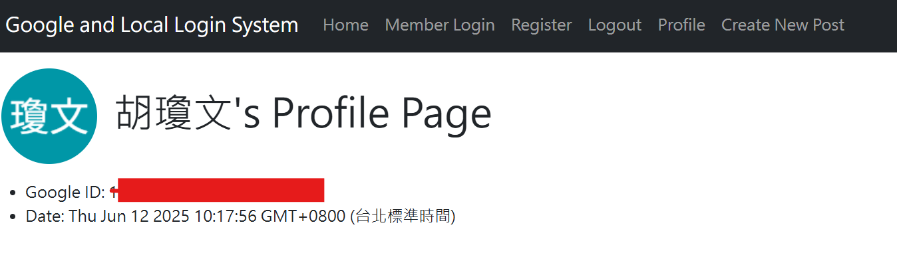
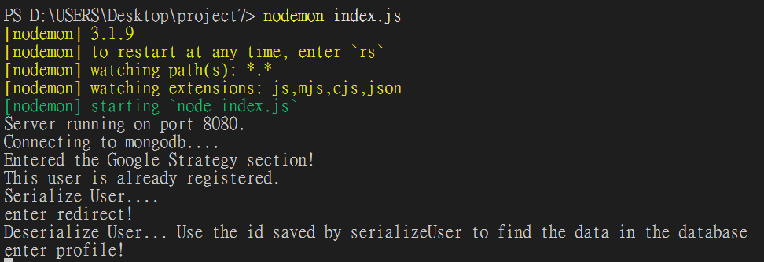
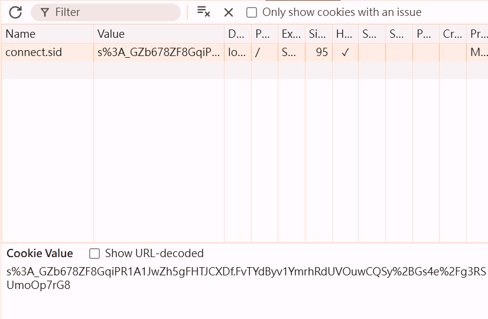

**profile-routes.js應該要被保護，不然一旦刪除cookie就會報錯**

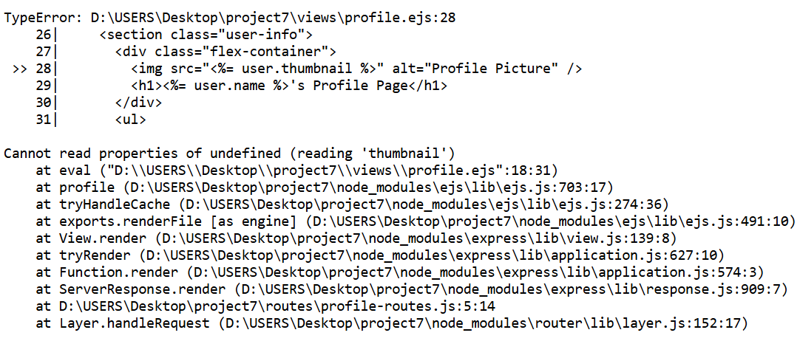

> profile-routes.js

```js
const router = require("express").Router();

const authCheck = (req,res,next)=>{
  if(req.isAuthenticated()){
    next();
  }else{
    return res.redirect("/auth/login");
  }
}

router.get("/",authCheck,(req,res)=>{
  console.log("enter profile!")
  return res.render("profile", {user: req.user}); //deSerializeUser()
})

module.exports = router;
```

> 這樣刪除cookies後就會直接被跳轉到登入畫面

**在auth-routes.js裡面設定logout**

```js
router.get("/logout",(req,res)=>{
  req.logOut((err)=>{
    if(err) return res.send(err);
    return res.redirect("/")
  })
})
```

**更改.ejs，只有登入會員後才能看到profile和logout**

> `nav.ejs`

```html
<nav class="navbar navbar-dark bg-dark navbar-expand-lg navbar-light bg-light">
  <div class="container-fluid">
    <a class="navbar-brand" href="#">Google and Local Login System</a>
    <button
      class="navbar-toggler"
      type="button"
      data-bs-toggle="collapse"
      data-bs-target="#navbarText"
      aria-controls="navbarText"
      aria-expanded="false"
      aria-label="Toggle navigation"
    >
      <span class="navbar-toggler-icon"></span>
    </button>
    <div class="collapse navbar-collapse" id="navbarText">
      <ul class="navbar-nav me-auto mb-2 mb-lg-0">
        <li class="nav-item"><a class="nav-link" href="/">Home</a></li>
        <% if (!user) { %>
        <li class="nav-item">
          <a class="nav-link" href="/auth/login">Member Login</a>
        </li>
        <li class="nav-item">
          <a class="nav-link" href="/auth/signup">Register</a>
        </li>
        <% } %> <% if (user) { %>
        <li class="nav-item">
          <a class="nav-link" href="/auth/logout">Logout</a>
        </li>
        <li class="nav-item">
          <a class="nav-link" href="/profile">Profile</a>
        </li>
        <li class="nav-item">
          <a class="nav-link" href="/profile/post">Create New Post</a>
        </li>
        <% } %>
      </ul>
    </div>
  </div>
</nav>
```

> `index.js`

```js
app.get("/",(req,res)=>{
  return res.render("index",{user:req.user})
})
```

> `auth-routes.js`

```js
router.get("/login",(req,res)=>{
  return res.render("login",{user:req.user})
})
```
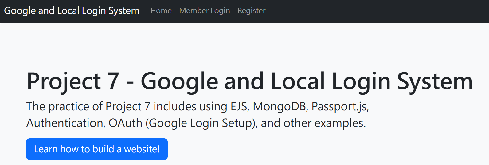
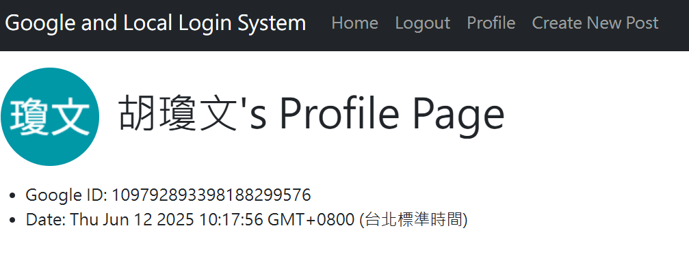

## 註冊本地使用者

## 登入本地使用者

## 製作 Post

## RFC 6749 導讀與詳細說明