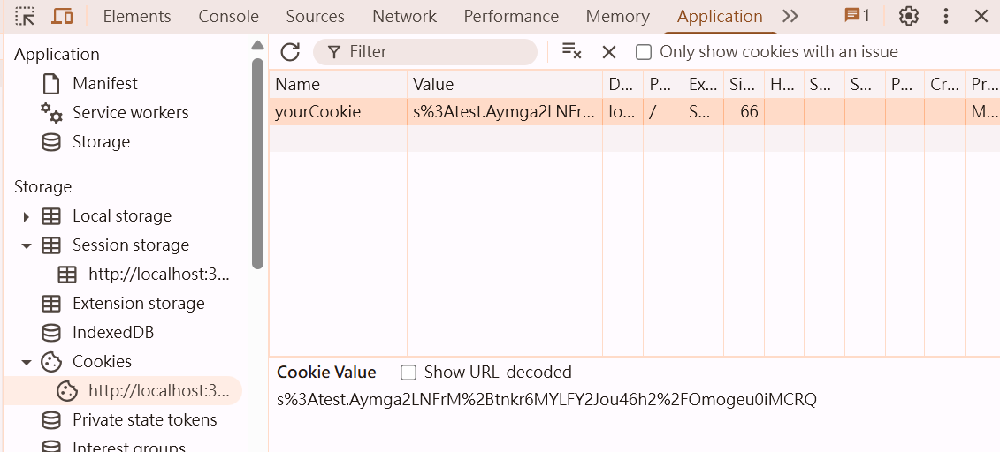
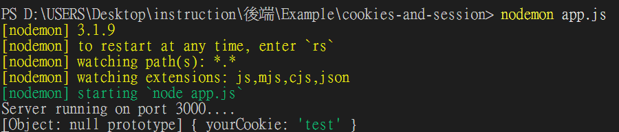
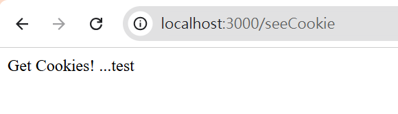
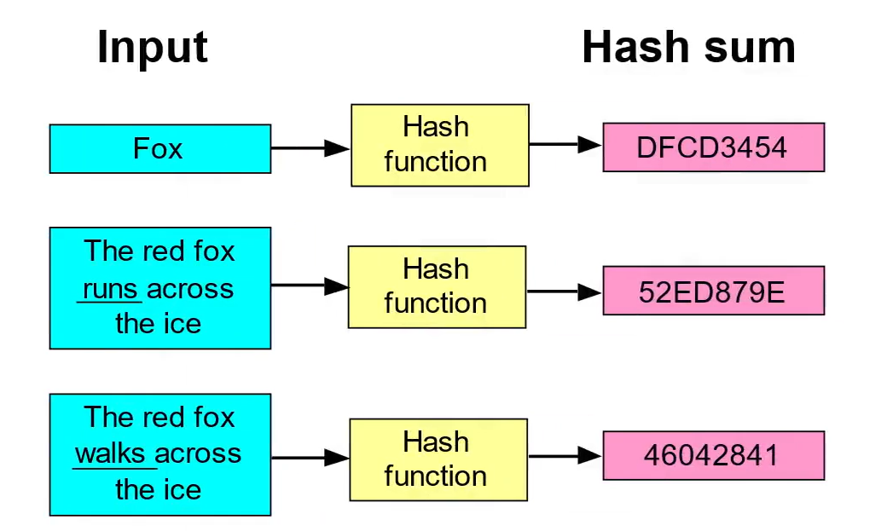

# 目錄

- [Cookies 簡介](#Cookies-簡介)
- [Cookies 簽名](#Cookies-簽名)
- [Singing Cookies](#Singing-Cookies)
- [Cookies 和 Storage 差別](#Cookies-和-Storage-差別)

## Cookies 簡介

Cookies是伺服器傳送給瀏覽器，並在客戶端下此訪問同一網站時一同發回的一小段文字。

它幫助該網站保留使用者的偏好設定(例如登入帳號、語言、字體大小及其他設定)，以便使用者在次訪問該網站或瀏覽該網站的不同網頁時無須重新填寫那些資料。Cookie會被放在客戶端的瀏覽器內部(例如，在Chrome瀏覽器內，點選Settings，點擊Privacy and security，再點擊Cookies and other site data，就可以看到所有的cookies)。

**找cookie的方法:**

> 方法1


> 方法2


Cookies是以key-value pair的形式儲存於瀏覽器內的。每個Cookies都有綁定特定的網站。若網站A給我們一個cookie，則下次我們訪問網站A時，這組cookie也會被傳送到網站A的伺服器。在Express的伺服器程式碼當中，設定cookie的語法是:

```js
res.cookie(key,value);
```

> 範例(app.js)

```js
const express = require("express");
const app = express();

app.get("/",(req,res)=>{
  return res.send("This is homepage.")
})

app.get("/setCookie",(req,res)=>{
  res.cookie("yourCookie","test");
  return res.send("Cookie has already setted.")
})

app.listen(3000,()=>{
  console.log("Server running on port 3000....")
})
```


下次同個瀏覽器傳送HTTP request到我們的伺服器時
我們可以用cookieParser()這個middleware，之後就可以透過req.cookies這個屬性來獲取我們的伺服器曾經存在客戶端的資料


❌ 沒有使用cookieParser()

```js
const express = require("express");
const app = express();
const cookieParser = require("cookie-parser");

app.use(cookieParser());

app.get("/",(req,res)=>{
  return res.send("This is homepage.")
})

app.get("/setCookie",(req,res)=>{
  res.cookie("yourCookie","test");
  return res.send("Cookie has already setted.")
})

app.get("/seeCookie",(req,res)=>{
  console.log(req.cookies);
  return res.send("Get Cookies!")
})

app.listen(3000,()=>{
  console.log("Server running on port 3000....")
})
```


✅ 使用cookieParser()

```shell
npm install cookie-parser
```

```js
const express = require("express");
const app = express();

app.get("/",(req,res)=>{
  return res.send("This is homepage.")
})

app.get("/setCookie",(req,res)=>{
  res.cookie("yourCookie","test");
  return res.send("Cookie has already setted.")
})

app.get("/seeCookie",(req,res)=>{
  console.log(req.cookies);
  return res.send("Get Cookies!")
})

app.listen(3000,()=>{
  console.log("Server running on port 3000....")
})
```


```js
app.get("/seeCookie",(req,res)=>{
  return res.send("Get Cookies! ..." + (req.cookies.yourCookie))
})
```


## Cookies 簽名

由於cookies可以在客戶端的瀏覽器內被自由修改，我們可以在傳送cookie之前，幫cookie做簽名(sign)。簽名後的cookie被稱為signed cookie。若客戶端對signed cookie做修改的話，我們的Express伺服器可以抓到這個錯誤，並且確認修改過的cookie為無效cookie。

在Express當中，若要對cookie做簽名的話，我們需要先下載cookie parser，並且在cookieParser()這個function內部提供一個參數，此參數為某個秘密String。在寄送cookie之前時，我們需要設定signed屬性為true:

```js
res.cookie(key,value,{signed:true})
```

下次同個瀏覽器傳送HTTP request到我們的伺服器時，我們可以用`req.signedCookies`這個屬性獲得未簽名的cookies。

```js
const express = require("express");
const app = express();
const cookieParser = require("cookie-parser");

app.use(cookieParser("secret"))

app.get("/",(req,res)=>{
  return res.send("This is homepage.")
})

app.get("/setCookie",(req,res)=>{
  //res.cookie("yourCookie","test");
  res.cookie("yourCookie","test",{ signed:true });
  return res.send("Cookie has already setted.")
})

app.get("/seeCookie",(req,res)=>{
  console.log(req.signedCookies)
  return res.send("Get Cookies! ..." + (req.signedCookies.yourCookie))
})
app.listen(3000,()=>{
  console.log("Server running on port 3000....")
})
```

> 進入`http://localhost:3000/setCookie`，可看到值已經被加密




> 進入`http://localhost:3000/seeCookie`，在console.log和介面上可以看到cookie的值




## Singing Cookies

在電腦科學當中，雜湊函數的功能是，把訊息或資訊壓縮成摘要(或指紋)，或使得資料量變小或變大，將資料的格式轉換，重新建立一個叫做雜湊值(hash values)。好的雜湊函數應該要有以下的特點:

1. 一致性:每次我們給hash()函數提供相同的輸入時，我們需要得到相同的輸出。不同長度的輸入也應該有相同長度的輸出。

2. 均勻分布:這樣的好處在於，可以減少hash collision的發生(hash collision是指兩個不同的input卻算出相同的hash value)。

3. 不可逆性: 雜湊函數不應該是可逆的，不然很容易被破解

4. 雪崩效應: 輸入的微小變化會導致輸出的巨大差異。增加hash function的不可逆性。



SHA 演算法是Secure Hash Algorithm的縮寫，一種密碼雜湊函式演算法標準，由美國國家安全局研發。其下又可再分為六個不同的演算法標準，包括了: SHA-224、SHA-256、SHA-384、SHA-512、SHA-512/224、SHA-512/256。以上總稱SHA家族。

為了確保Cookies沒有在客戶端被竄改過，幫Cookies做簽名需要用到的演算法叫做HMAC(Hashed MAC)。根據RFC 2014，HMAC的數學公式為

$$
\text{HMAC}_K(m) = H \big( (K' \oplus opad) \parallel H((K' \oplus ipad) \parallel m) \big)
$$


Cookie簽名的完整流程是:

1. 伺服器將value以及secret拿去做運算，得到HMAC值。HMAC就是我們的 Signed Cookies。

2. 伺服器將signed cookies以及value送到客戶端。

3. 客戶端或許會竄改signed cookies。

4. 客戶端下次發送HTTP request 到伺服器時，伺服器會將value以及secret拿去做運算，得到HMAC值。再將HMAC值與客戶端送來的signed cookies對照。如果兩者不同，則代表signed cookies遭到竄改。伺服器及認定此為無效的signed cookies。