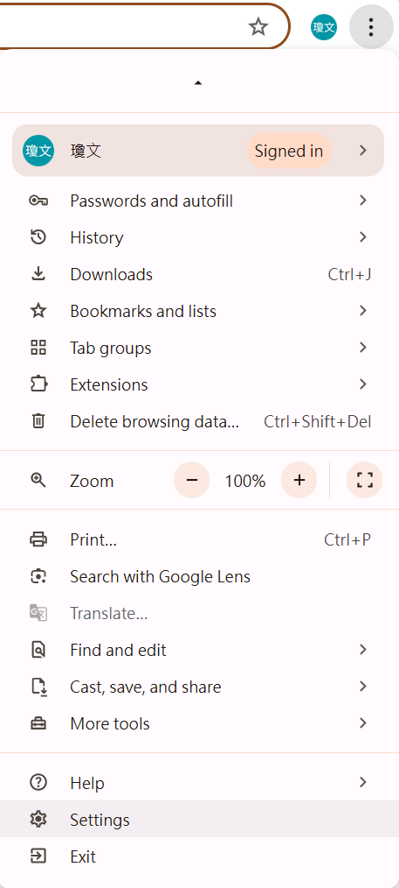
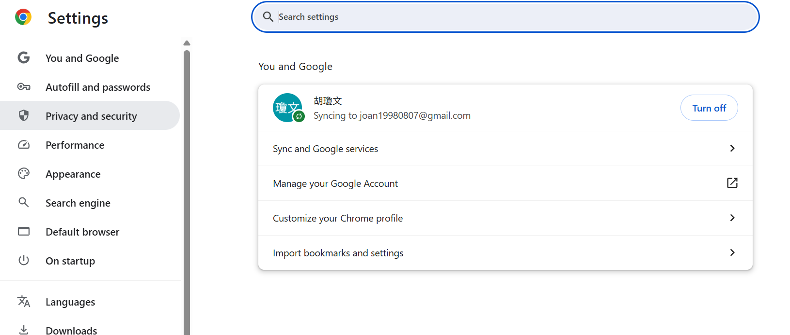
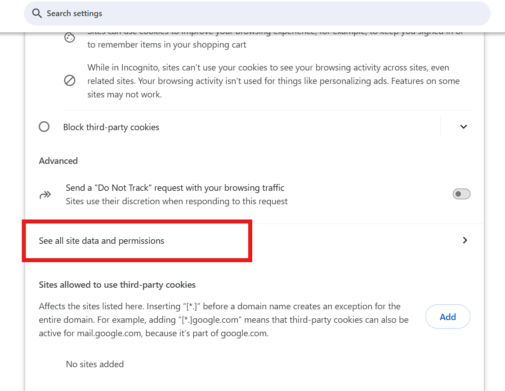
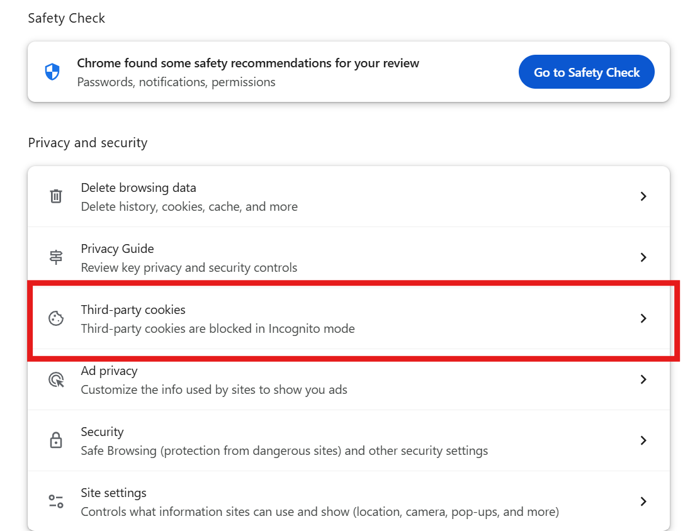
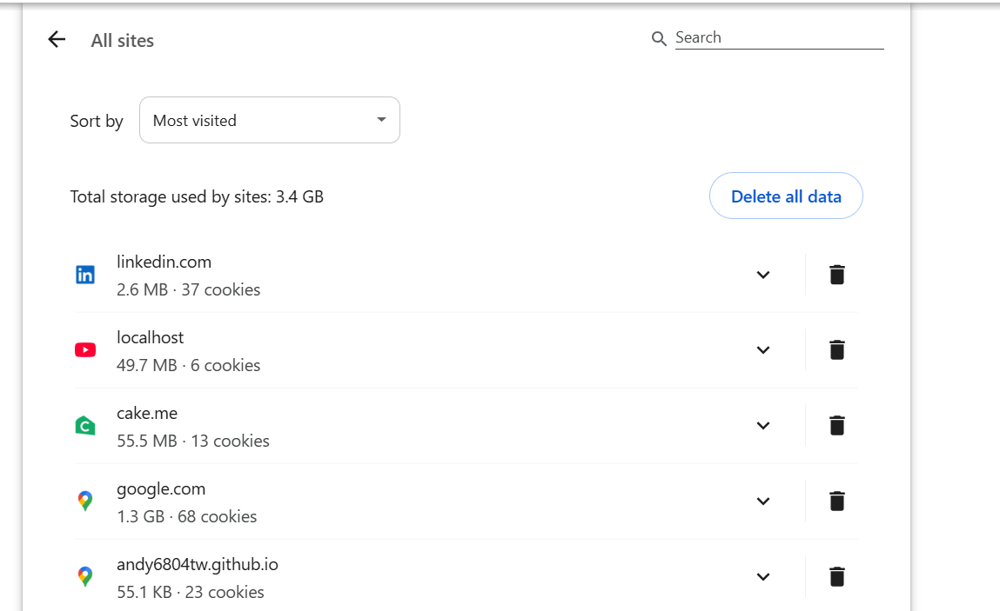
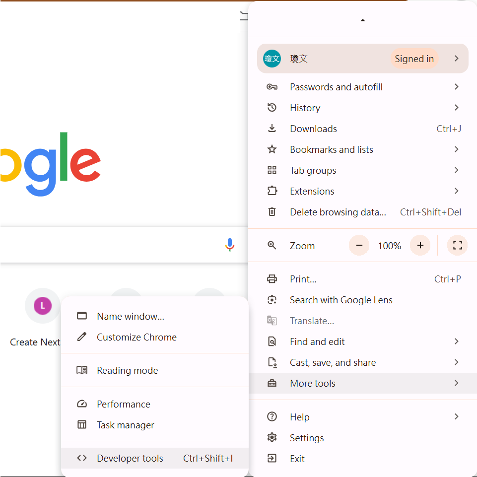
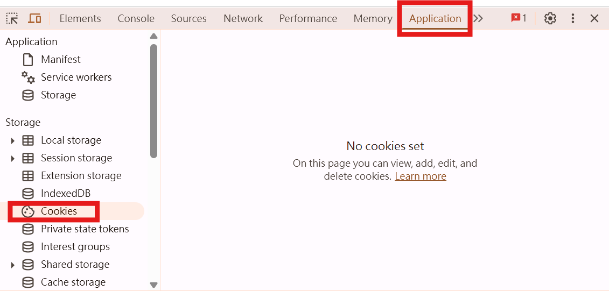
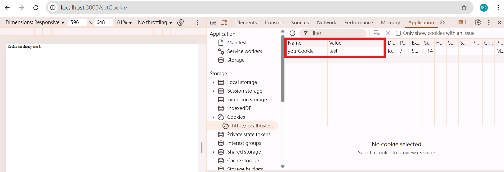
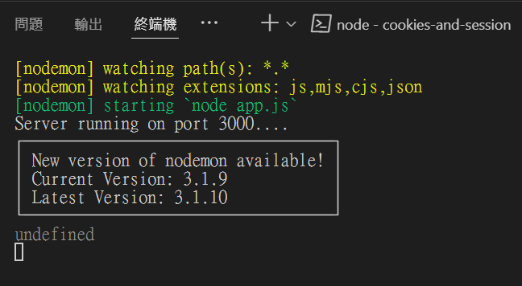
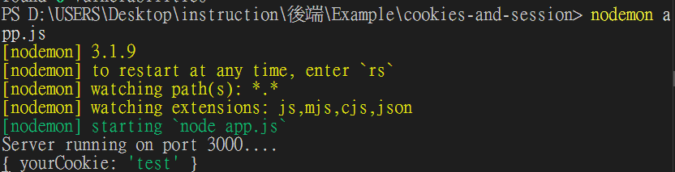

# 目錄

- [Cookies 簡介](#Cookies-簡介)
- [Cookies 簽名](#Cookies-簽名)
- [Singing Cookies](#Singing-Cookies)
- [Cookies 和 Storage 差別](#Cookies-和-Storage-差別)

## Cookies 簡介

Cookies是伺服器傳送給瀏覽器，並在客戶端下此訪問同一網站時一同發回的一小段文字。

它幫助該網站保留使用者的偏好設定(例如登入帳號、語言、字體大小及其他設定)，以便使用者在次訪問該網站或瀏覽該網站的不同網頁時無須重新填寫那些資料。Cookie會被放在客戶端的瀏覽器內部(例如，在Chrome瀏覽器內，點選Settings，點擊Privacy and security，再點擊Cookies and other site data，就可以看到所有的cookies)。

**找cookie的方法:**

> 方法1







> 方法2



Cookies是以key-value pair的形式儲存於瀏覽器內的。每個Cookies都有綁定特定的網站。若網站A給我們一個cookie，則下次我們訪問網站A時，這組cookie也會被傳送到網站A的伺服器。在Express的伺服器程式碼當中，設定cookie的語法是:

```js
res.cookie(key,value);
```

> 範例(app.js)

```js
const express = require("express");
const app = express();

app.get("/",(req,res)=>{
  return res.send("This is homepage.")
})

app.get("/setCookie",(req,res)=>{
  res.cookie("yourCookie","test");
  return res.send("Cookie has already setted.")
})

app.listen(3000,()=>{
  console.log("Server running on port 3000....")
})
```


下次同個瀏覽器傳送HTTP request到我們的伺服器時
我們可以用cookieParser()這個middleware，之後就可以透過req.cookies這個屬性來獲取我們的伺服器曾經存在客戶端的資料


❌ 沒有使用cookieParser()

```js
const express = require("express");
const app = express();
const cookieParser = require("cookie-parser");

app.use(cookieParser());

app.get("/",(req,res)=>{
  return res.send("This is homepage.")
})

app.get("/setCookie",(req,res)=>{
  res.cookie("yourCookie","test");
  return res.send("Cookie has already setted.")
})

app.get("/seeCookie",(req,res)=>{
  console.log(req.cookies);
  return res.send("Get Cookies!")
})

app.listen(3000,()=>{
  console.log("Server running on port 3000....")
})
```



✅ 使用cookieParser()

```shell
npm install cookie-parser
```

```js
const express = require("express");
const app = express();

app.get("/",(req,res)=>{
  return res.send("This is homepage.")
})

app.get("/setCookie",(req,res)=>{
  res.cookie("yourCookie","test");
  return res.send("Cookie has already setted.")
})

app.get("/seeCookie",(req,res)=>{
  console.log(req.cookies);
  return res.send("Get Cookies!")
})

app.listen(3000,()=>{
  console.log("Server running on port 3000....")
})
```



```js
app.get("/seeCookie",(req,res)=>{
  return res.send("Get Cookies! ..." + (req.cookies.yourCookie))
})
```

