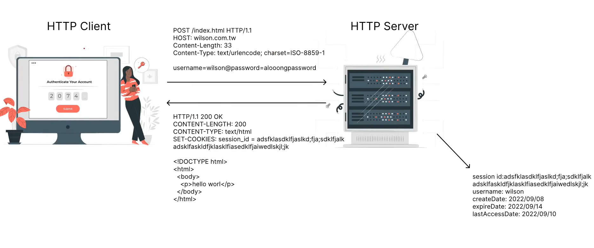
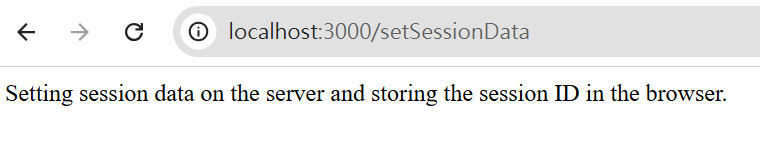

# 目錄

- [Session 設定](#Session-設定)
- [dotenv](#dotenv)
- [flash](#flash)

## Session 設定

Session是在網頁伺服器上的儲存空間。當使用者登入網頁時，伺服器會製作一個session id，以及此session id所相對應的資料。Session id會被當作cookie送到用戶端。下次用戶端造訪同一網站時。Session id會被以cookie的形式送到伺服器，而伺服器使用session id找到所相對應的資料，來確認使用者的身分。

如此一來，我們可以解決兩個cookie的隱患:

1. 伺服器上的儲存空間不受4095 bytes的容量限制。
2. 如果用戶串改了自己的session id，有沒有可能冒充其他使用者呢?有可能，但是session id通常是非常長的String，可能性非常的多，比密碼更難猜。

隨意修改session id只會造成伺服器無法辨認session id。若要靠修改session id來冒稱他人，與嘗試猜測session_id相比，他們嘗試猜測其他人的密碼更有可能達成冒充他人的意圖。

另外，在發出session id之前，我們可以對session id簽名。若有人串改coikie內的session id，我們可以快速辨識出來。



> 在Express所架設的伺服器內，若要使用sessions，則可以使用套件express-session。

[npm express-session](https://www.npmjs.com/package/express-session)

```shell
npm i express-session
```

> express-sessions的語法為:

```js
app.use(session({
  secret: 'keyboard cat',
  resave: false,
  saveUninitialized: false,
  cookie:{secure:true}
}))
```

- secret: 用來幫session ID做成的cookie簽名
- resave: 強制將此session 重新保存回伺服器上的session存儲區，即使在上次到本次的HTTP request期間，從為修改過此session。預設值為true，但建議使用false。此用true的話，可能會在伺服器上導致race condition。例如，客戶端像伺服器發出兩個併行的request，則某個request對session所做的改變會在另一個request結束時被覆蓋。

- saveUninitialized: 當request送到伺服器時，如果request 的header內部沒有包含session id 的cookie的話，伺服器會:
(1)生成獨特的session id
(2)將session id存在cookie內，既給用戶端
(3)創建一個empty session object
(4)根據saveUninitialized的值，在request結束時，session object可能會被儲存在伺服器內。

若在request 的整個生命周期內，session object都沒有被修改的話，那麼在請求結束時，如果saveUninitialized為false時，則session object不會被存在資料庫內。Uninitialized的意思是指 new but not modified。

saveUninitialized的預設值是true， 但建議使用false。使用false的好處在於，伺服器可以防止在系統中儲存大量empty session object。由於沒有任何有用的資訊需要用session來儲存，session object在request結束時被刪除。

何時會modify session object呢?例如，使用者登入系統時，session object會更新最一次的登入時間。如果某個使用我們網站的人，只是走走逛逛沒有登入，那麼session object從被創建到request結束都不會被更改，所以屬於new but not modified，也就是Uninitialized。

此外，在saveUninitialized使用false也可以降低伺服器出現race condition的情況。

- cookie:{secure:true}: 若設定secure為true，則cookies只有在HTTPs的協議下才會既行傳輸，任何不安全的傳輸通道上，cookie都不會被傳遞

```js
const session = require("express-session");

app.use(
  session({
    secret:"session-example",
    resave: false,
    saveUninitialized: false,
    cookie:{secure:false}, // localhost
  })
)
```

若我們想獲得session id所相對應的session data，我們只需要在Express當中取得request object的session屬性即可:

```js
req.session
```

另外，express-sessions給客戶端設定的cookie名稱是connect.sid，而value則是簽名過的session id。

```js
app.get("/setSessionData",(req,res)=>{
  console.log(req.session);
  return res.send("Setting session data on the server and storing the session ID in the browser.")
})
```

>  完整程式碼

```js
const express = require("express");
const session = require("express-session");

const app = express();

app.use(
  session({
    secret:"session-example",
    resave: false,
    saveUninitialized: false,
    cookie:{secure:false}, // localhost
  })
)

app.get("/",(req,res)=>{
  return res.send("This is homepage.")
})


app.get("/setSessionData",(req,res)=>{
  console.log(req.session);
  return res.send("Setting session data on the server and storing the session ID in the browser.")
})

app.listen(3000,()=>{
  console.log("Server running on port 3000....")
})
```




```js
app.get("/setSessionData",(req,res)=>{
  req.session.example= 'something not important...'
  return res.send("Setting session data on the server and storing the signed session ID in the browser.")
})
```


> 得到簽名過後的session_id

```js
app.get("/getSessionData",(req,res)=>{
  console.log(req.session);
  // connect.sid => session id
  return res.send("Get session data!" )
})
```


> 可用來做模擬登入狀態

```js
app.get("/verifyUser",(req,res)=>{
  request.session.isVerified = true;
  return res.send("Thank you for your login!")
})
app.get("/login", (req, res) => {
  if (!req.session.isVerified) {
    return res.send("Please log in to the system!");
  } else {
    return res.send("You are already logged in!");
  }
});
```


> 若有好幾個頁面需要知道是否有沒有登入，需要改寫成middleware

```js
const checkUser = (req,res,next)=>{
  if (!req.session.isVerified) {
    return res.send("Please log in to the system!");
  } else {
    next();
  }
}
app.get("/login",checkUser, (req, res) => {
    return res.send("You are already logged in!");
});
```

> 完整程式碼

```js
const express = require("express");
const session = require("express-session");
const cookieParser = require("cookie-parser");

const app = express();
app.use(cookieParser("secret"))

app.use(
  session({
    secret:"session-example",
    resave: false,
    saveUninitialized: false,
    cookie:{secure:false}, // localhost
  })
)

const checkUser = (req,res,next)=>{
  if (!req.session.isVerified) {
    return res.send("Please log in to the system!");
  } else {
    next();
  }
}

app.get("/",(req,res)=>{
  return res.send("This is homepage.")
})

app.get("/setCookie",(req,res)=>{
  //res.cookie("yourCookie","test");
  res.cookie("yourCookie","test",{ signed:true });
  return res.send("Cookie has already setted.")
})

app.get("/seeCookie",(req,res)=>{
  console.log(req.signedCookies)
  return res.send("Get Cookies! ..." + (req.signedCookies.yourCookie))
})

app.get("/setSessionData",(req,res)=>{
  req.session.example= 'something not important...'
  return res.send("Setting session data on the server and storing the signed session ID in the browser.")
})

app.get("/getSessionData",(req,res)=>{
  console.log(req.session);
  // connect.sid => session id
  return res.send("Get session data: ",req.session )
})

app.get("/verifyUser",(req,res)=>{
  req.session.isVerified = true;
  return res.send("Thank you for your login!")

})

app.get("/login",checkUser, (req, res) => {
  return res.send("You are already logged in!");
});

app.listen(3000,()=>{
  console.log("Server running on port 3000....")
})
```

## dotenv

直接在程式碼內儲存秘密是一個不好的習慣。通常來說，我們會把秘密存在環境變數內部。環境變數(environment varaible)是一個動態的值，可以影響電腦上運行的城市。它們是正在運行程式的一部份。

例如，一個正在運行的程式可以查詢TEMP環境變量的值來發現一個合適的位置，來存儲林時的文件，或者查詢HOME便量來找到運行該程式的用戶所擁有的目錄結構。

在Node.js當中，我們使用dotenv套件，透過process物件的env屬性，來獲得環境變數。(除此之外，如果我們在雲端上不屬伺服器，通常雲端提供商應該有某種秘密管理工具，例如AWS Secrets Manager。)

[dotenv](https://www.npmjs.com/package/dotenv)

```shell
npm install dotenv
```

> 創造`.env`文件

```env
MYCOOKIESECRETKEY = "secret"
MYSESSIONSECRETKEY="session-example"
```

```js
require('dotenv').config();
const express = require("express");
const session = require("express-session");
const cookieParser = require("cookie-parser");

const app = express();
app.use(cookieParser("process.env.MYCOOKIESECRETKEY"))

app.use(
  session({
    secret:"process.env.MYSESSIONSECRETKEY",
    resave: false,
    saveUninitialized: false,
    cookie:{secure:false}, // localhost
  })
)

const checkUser = (req,res,next)=>{
  if (!req.session.isVerified) {
    return res.send("Please log in to the system!");
  } else {
    next();
  }
}

app.get("/",(req,res)=>{
  return res.send("This is homepage.")
})

app.get("/setCookie",(req,res)=>{
  //res.cookie("yourCookie","test");
  res.cookie("yourCookie","test",{ signed:true });
  return res.send("Cookie has already setted.")
})

app.get("/seeCookie",(req,res)=>{
  console.log(req.signedCookies)
  return res.send("Get Cookies! ..." + (req.signedCookies.yourCookie))
})

app.get("/setSessionData",(req,res)=>{
  req.session.example= 'something not important...'
  return res.send("Setting session data on the server and storing the signed session ID in the browser.")
})

app.get("/getSessionData",(req,res)=>{
  console.log(req.session);
  // connect.sid => session id
  return res.send("Get session data: ",req.session )
})

app.get("/verifyUser",(req,res)=>{
  req.session.isVerified = true;
  return res.send("Thank you for your login!")

})

app.get("/login",checkUser, (req, res) => {
  return res.send("You are already logged in!");
});

app.listen(3000,()=>{
  console.log("Server running on port 3000....")
})
```

