# 目錄

- [MongoDB 介紹與安裝](#MongoDB-介紹與安裝)
- [資料庫增刪查改](#資料庫增刪查改)
  - [Database collection document](#Database-collection-document)
  - [Database 的基本操作](#Database-的基本操作)
  - [什麼是 JSON](#什麼是-JSON)
  - [在 collection 裡面 insert 資料](#在-collection-裡面-insert-資料)
  - [JSON 和 BSON](#JSON-和-BSON)
  - [插入和刪除](#插入和刪除)
  - [查找和更新](#查找和更新)
  - [find 方法和 cursor 物件](#find-方法和-cursor-物件)
  - [projection](#projection)
  - [Document 嵌套](#Document-嵌套)
  - [Document limitation](#Document-limitation)
- [結構和資料類型](#結構和資料類型)
  - [Collection 有 Schema 嗎](Collection-有-Schema-嗎)
  - [資料類型](#資料類型)
  - [關於時間資料類型](#關於時間資料類型)
  - [關於數字資料類型](#關於數字資料類型)
- [NOSQL 中的關係](#NOSQL-中的關係)
  - [什麼是關係](#什麼是關係)
- [深入了解增刪查改](#深入了解增刪查改)
- [使用 index 索引](#使用-index-索引)
- [地理空間資料處理](#地理空間資料處理)
- [聚合操作](#聚合操作)
- [資料庫管理](#資料庫管理)
- [圖形化管理工具](#圖形化管理工具)
- [主從複製](#主從複製)
- [sharding 分片技術](#sharding-分片技術)

# MongoDB 介紹與安裝

What is MongoDB?

- Scable, High-performance, Open source, Document-orientated database.
  - Build for Speed
  - Rich Document based queries
  - Full index support
  - Map/reduce for aggregation
  - Replication and Failover
  - Auto Sharding

Why use MongoDB?

- SQL was invented in the 70's to store data.
- MongoDB stored documents (or) objects.
- Now-a-days, everyone workd with objects (Python/Ruby/Java...etc.)
- And we need Databases to persist our objects. Then why not store objects directly?
- Embedded documents and arrays reduce need for joins. No joins and No-multi document transactions.

- 安裝 MongoDB

[官方網址](https://www.mongodb.com/try/download/community)


> 不安裝 Compass

[shell 下載網址](https://www.mongodb.com/try/download/shell)

下載完後丟進`C:\Program Files`

> 設置環境變數

複製網址到環境變數裡

```shell
C:\Program Files\mongosh-2.5.0-win32-x64\bin
```


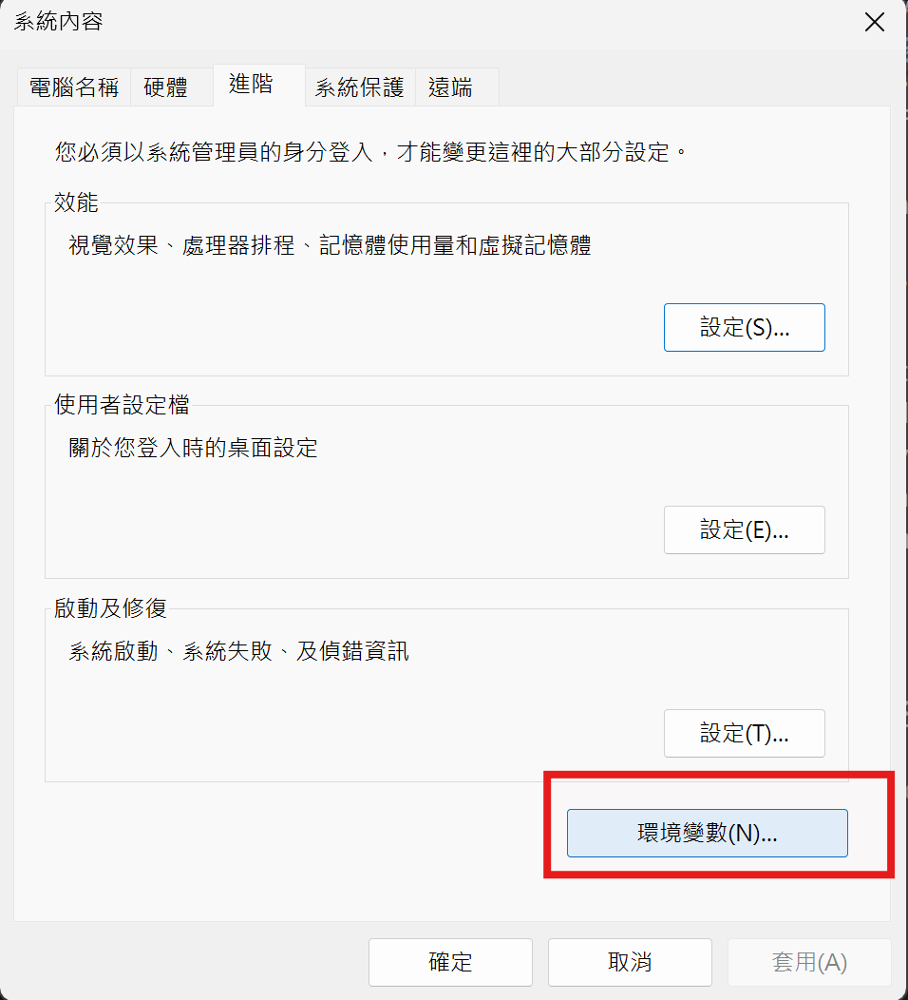
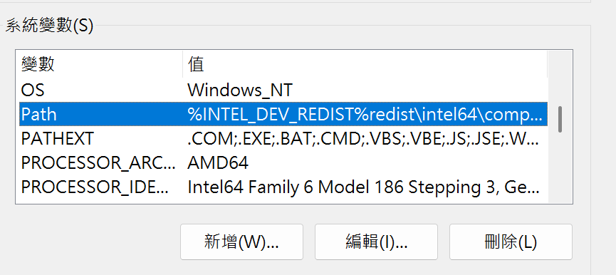
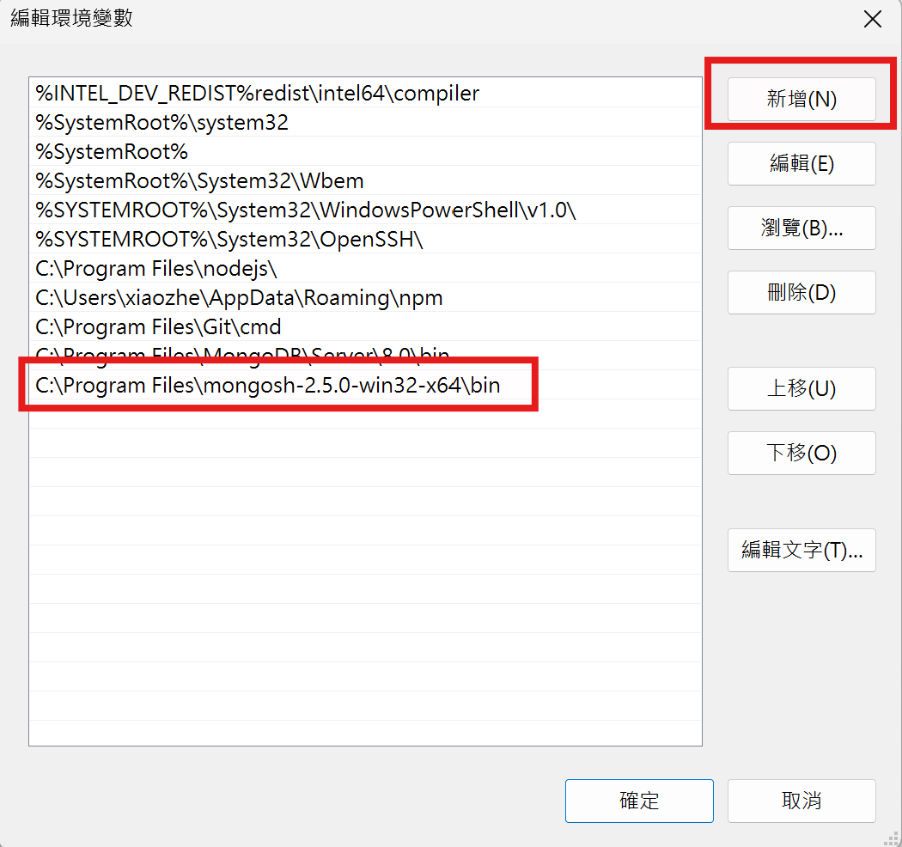

> 打開命令提示字元，看是否安裝成功

```shell
mongosh --help
```

> 若沒有東西要手動啟動 mogoDB server

用管理員身分打開 cmd

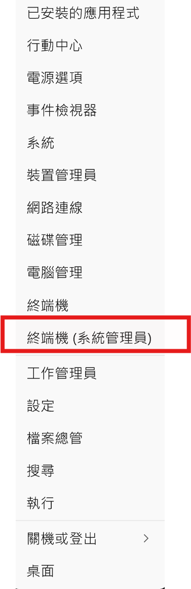

```shell
net start MongoDB
```

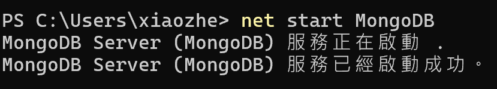

```shell
mongosh
```

> 離開可按 `CTRL-D` 或打

```shell
exit()
```

# 資料庫增刪查改

(CRUD): create/read/update/delete

## Database collection document

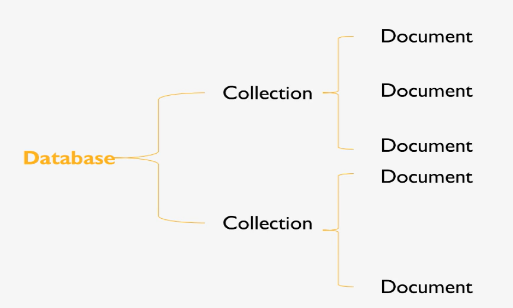

對應 mySQL 例子:

Database: database
Collection: table
Document: row of table

## Database 的基本操作

- 清除指令

```shell
cls
```

- 幫助指令

```shell
help
```

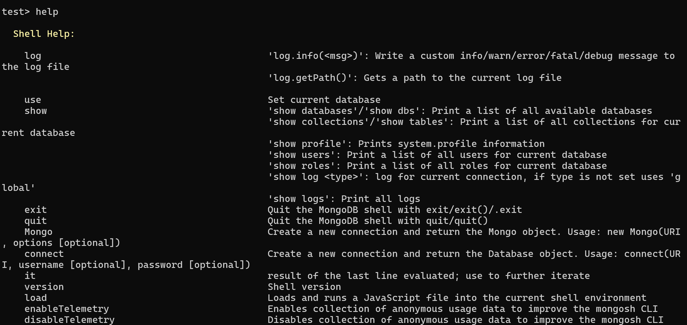

- 退出指令

```shell
exit
```

- 進入指令

```shell
mongosh
```

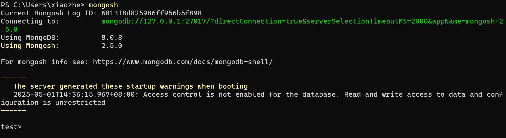

- 查看目前資料庫有幾個

```shell
show dbs
```

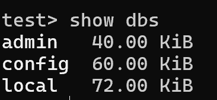

- 創建資料庫(直接使用資料庫)

```shell
use <database-name>
```

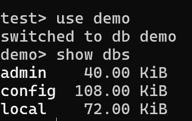

> 因為 demo 這個 database 裡面還沒有 collection，所以不會出現在`show dbs`裡面

- 查看所有 db 操作

```shell
db.help
```

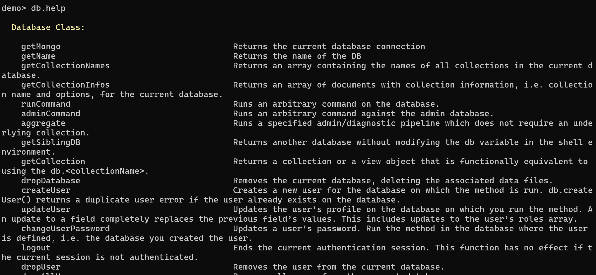

- 創建 collection

```shell
db.createCollection('<collection-name>')
```

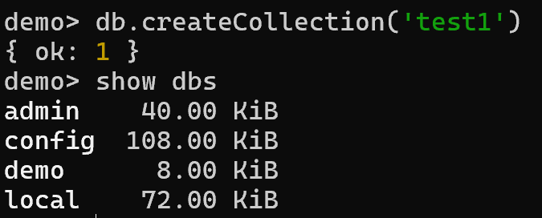

> 按 tab 鍵可以提示有哪些命令可以輸入

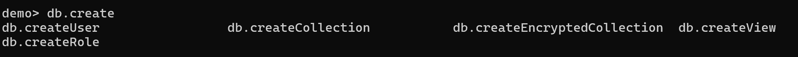

> 輸入可以不用打全，例如打 Co 按下 tab 鍵就會自動帶入

- 查詢目前所在的資料庫

```shell
db.getName()
```

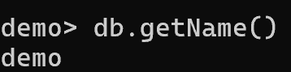

- 查詢目前所在的資料庫有哪些 collections

```shell
db.getCollectionNames()
```

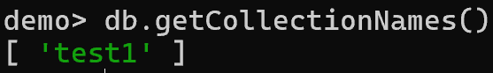

- 刪除資料庫

> 先要到此資料庫後再使用下面指令

```shell
db.dropDatabase()
```

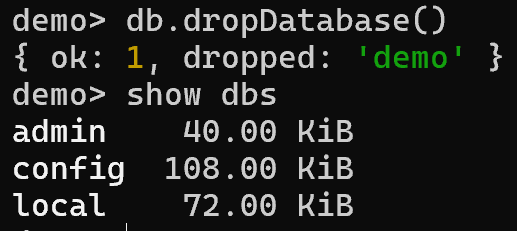

## 什麼是 JSON

JSON(JavaScript Object Notation):有兩種結構

1. Object(物件): 包含一系列無順序的 key-value pair。

```js
{
    "name":"Joan",
    "age":"26"
}
```

2. Array(陣列): 多個 value 放入中括弧`[]`裡面，並且用逗號分割

```js
["test1", "test2"];
```

> json 就是陣列包物件，把多個 object 放入`[]`裡面

- json 格式和 js 格式的不同在於
  - 若在 js 裡面寫陣列包物件，key 若是英文那可以不加引號(`""`)， 但 json 不管英文或中文，它的 key 值都需要加引號
  - 最後一個 key-value pair 在 json 裡不可加逗號，但在 js 裡面可以

```json
[
  {
    "name": "Joan",
    "age": "26",
  },
  {
    "name": "John",
    "age": "31",
  }
];
```

## 在 collection 裡面 insert 資料

> 實際上 collection 和 database 一樣不需要去創建，可以直接使用

```shell
db.<collection-name>.insertOne(<Object>)
```

```shell
db.employee.insertOne(
    {
        "first_name":"Robin",
        "last_name":"Jackman",
        "title":"Software Engineer",
        "Salary":3000,
        "Intership":true
    }
)
```

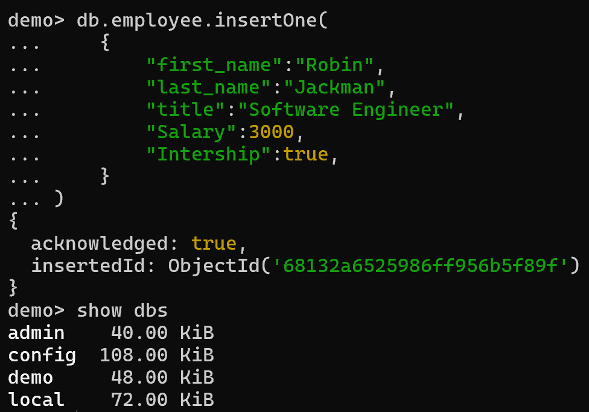

- 查詢插入資料

```shell
db.employee.find()
```

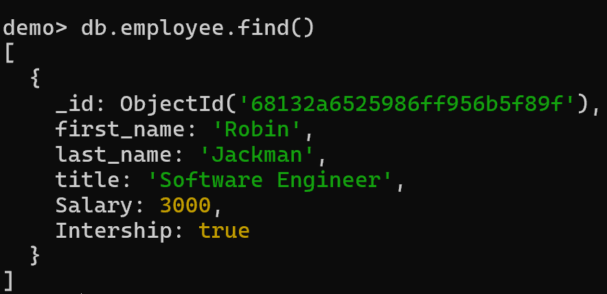

## JSON 和 BSON

> `_id: ObjectId('6813218e25986ff956b5f899'),`此格式並不符合 json， 格式是屬於 BSON 格式

BSON 就是二進制的 JSON，為什麼要用 BSON? 因為它可以提高效率

> ID 可以指定，但絕不能重複

```shell
db.employee.insertOne(
    {
        "_id": 1,
        "first_name": 'Joan',
        "last_name": 'Hu',
        "title": 'Teacher',
        'salary': 1500,
        'Intership': false
    }
 )
```

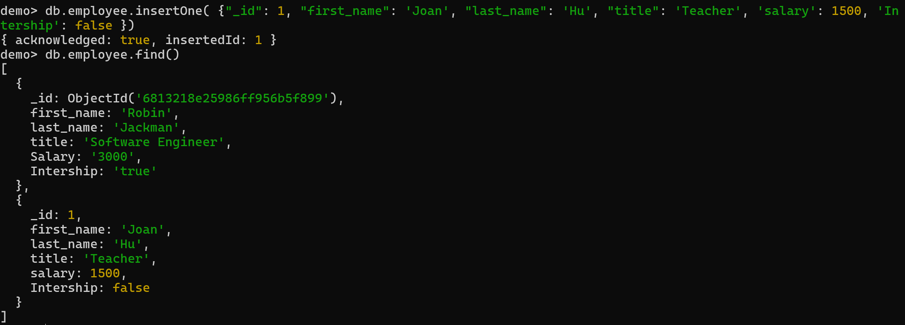

```shell
db.employee.insertOne(
    {
        "_id": 1,
        "first_name": 'error',
        "last_name": 'duplicate_id',
        "title": 'Teacher',
        'salary': 1500,
        'Intership': false
    }
 )
```

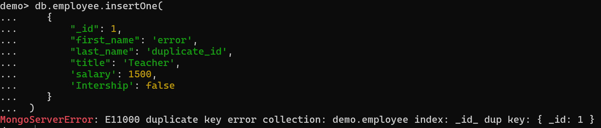

## 插入和刪除

- 插入
  - insertOne(document,options)
  - insertMany(document,options)
- 刪除

  - deleteOne(filiter,options)
  - deleteMany(filiter,options)

**插入**

- 插入一個數據`insertOne`:

```shell
db.employee.insertOne(
    {
        "first_name":"Taylor",
        "last_name":"Edward",
        "title":"Software Engineer",
        "Salary":7500,
        "Intership":false
    }
)
```

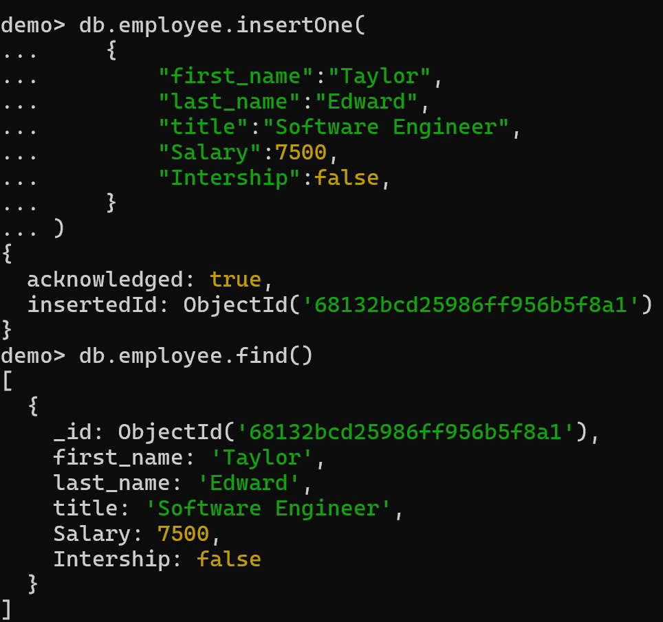

- 插入多個數據`insertMany`:

```shell
db.employee.insertMany([

    {
        "first_name":"Taylor",
        "last_name":"Edward",
        "title":"Software Engineer",
        "Salary":7500,
        "Intership":false
    },
    {
        "first_name":"Robin",
        "last_name":"Jackman",
        "title":"Software Engineer",
        "Salary":3000,
        "Intership":true
    }
])
```

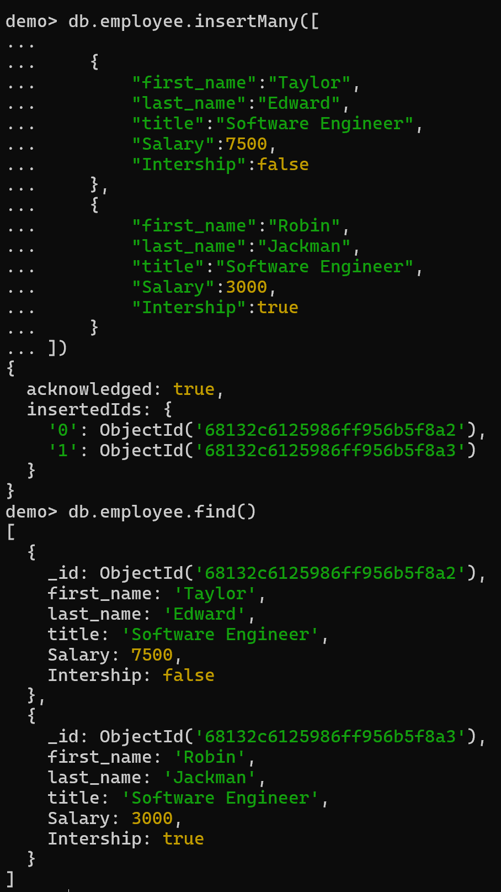

**刪除**

- 刪除一個數據`deleteOne`:

```shell
db.<collection-name>.deleteOne({"_id": <num>})
```

```shell
db.employee.deleteOne({"_id":1})
```

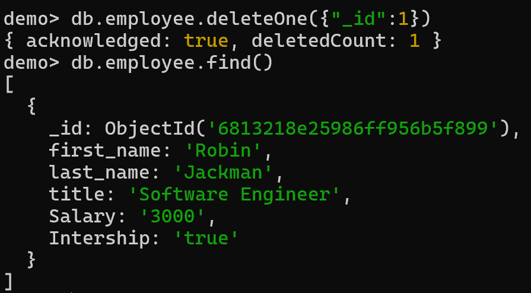

> 若 filter 有兩個結果，但我使用`deleteOne`時會優先刪除第一個匹被盜的數據

```shell
db.employee.deleteOne({"a":1})
```

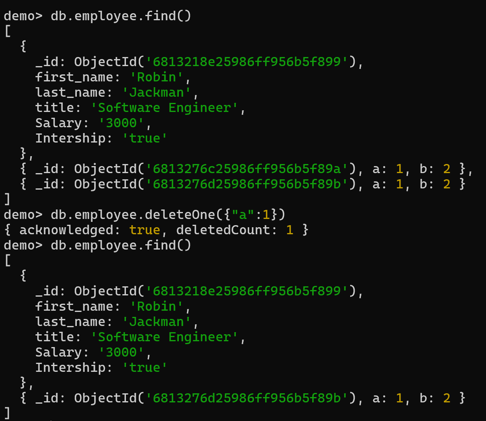

- 刪除多個數據`deleteMany`:

```shell
db.<collection-name>.deleteMany({"_id": <num>})
```

```shell
db.employee.deleteMany({"a":1})
```

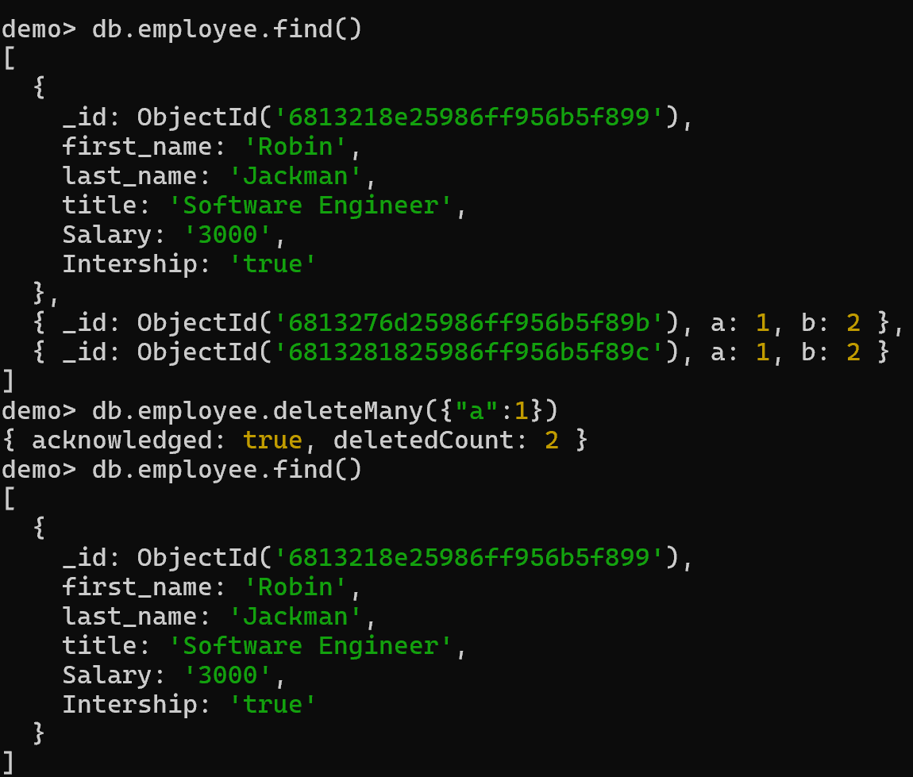

[官方網站講解](https://www.mongodb.com/docs/manual/reference/operator/query/)

> 若想刪除薪水大於 2000

```shell
db.employee.deleteMany({"Salary":{"$gt":2000}})
```

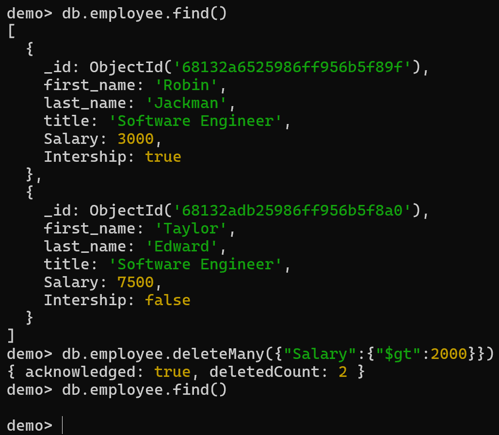

## 查找和更新

- 查找
  - findOne(fliter,options)
  - find(filter,option)
- 更新

  - updateOne(fliter,update,options)
  - updateMany(fliter,update,options)

- 所使用的 json

```json
[
  {
    "first_name": "Robin",
    "last_name": "Jackman",
    "title": "Software Engineer",
    "salary": 5500,
    "hire_date": "2001-10-12"
  },
  {
    "first_name": "Taylor",
    "last_name": "Edward",
    "title": "Software Architect",
    "salary": 7200,
    "hire_date": "2002-09-21"
  },
  {
    "first_name": "Vivian",
    "last_name": "Dickens",
    "title": "Database Administrator",
    "salary": 6000,
    "hire_date": "2012-08-29"
  },
  {
    "first_name": "Harry",
    "last_name": "Clifford",
    "title": "Database Administrator",
    "salary": 6800,
    "hire_date": "2015-12-10"
  },
  {
    "first_name": "Eliza",
    "last_name": "Clifford",
    "title": "Software Engineer",
    "salary": 4750,
    "hire_date": "1998-10-19"
  },
  {
    "first_name": "Nancy",
    "last_name": "Newman",
    "title": "Software Engineer",
    "salary": 5100,
    "hire_date": "2007-01-23"
  },
  {
    "first_name": "Melinda",
    "last_name": "Clifford",
    "title": "Project Manager",
    "salary": 8500,
    "hire_date": "2013-10-29"
  },
  {
    "first_name": "Jack",
    "last_name": "Chan",
    "title": "Test Engineer",
    "salary": 6500,
    "hire_date": "2018-09-07"
  },
  {
    "first_name": "Harley",
    "last_name": "Gilbert",
    "title": "Software Architect",
    "salary": 8000,
    "hire_date": "2000-07-17"
  }
]
```

**查找**

```shell
db.employee.find({'title':"Software Architect"})
```

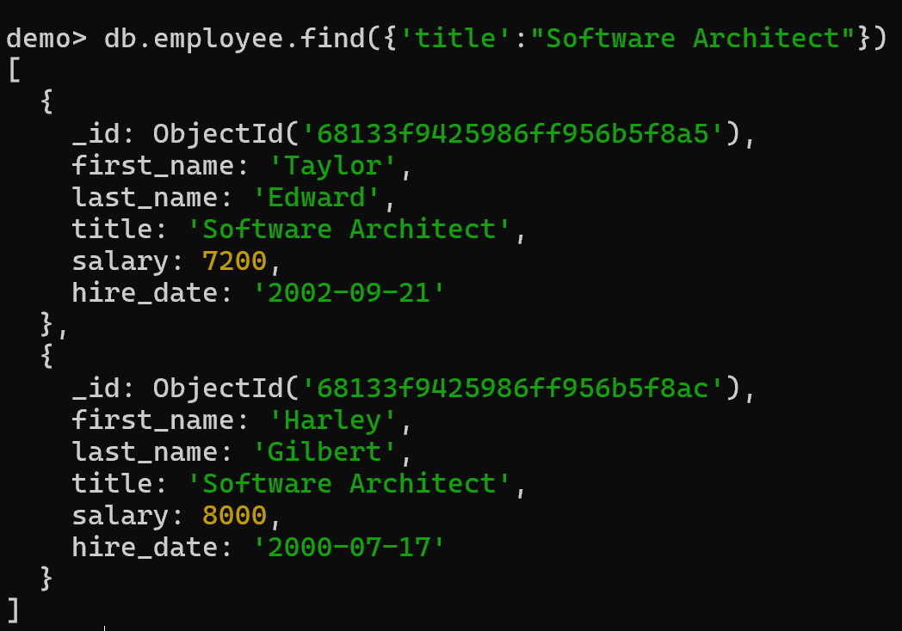

> 可以把引號去掉

```shell
db.employee.find({salary :{$gt:6000}})
```

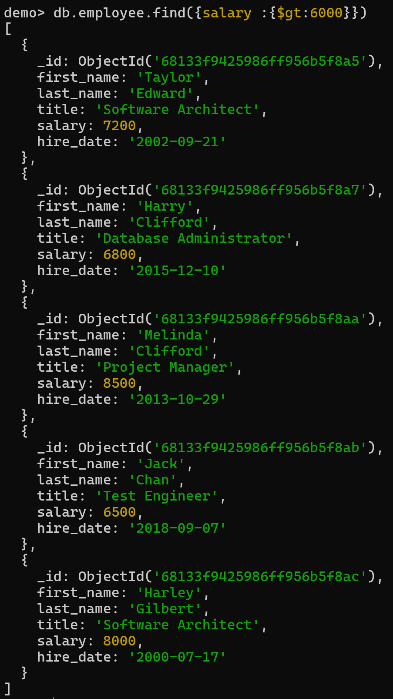

> `findOne` 只返回第一個符合的資料

```shell
db.employee.findOne({salary :{$gt:6000}})
```

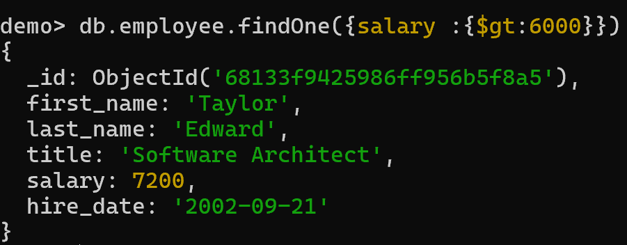

**更新**

> `updateOne`

```shell
db.<collection-name>.updateOne({<filter>},{$set:{<edit>}}}
```

```shell
db.employee.updateOne({_id: ObjectId('6813786025986ff956b5f8ae')},{$set:{"salary":7300}})
```

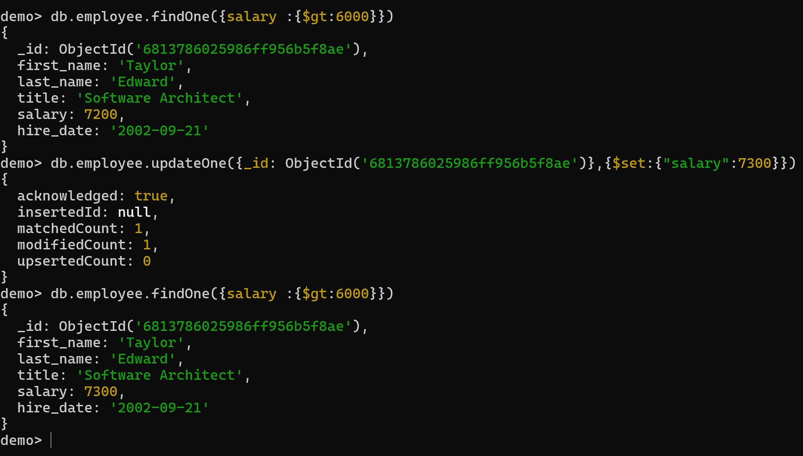

> `updateMany`

```shell
db.<collection-name>.updateMany({<filter>},{$set:{<edit>}}}
```

```shell
db.employee.updateMany({title:"Software Architect"},{$set:{"salary":8000}})
```

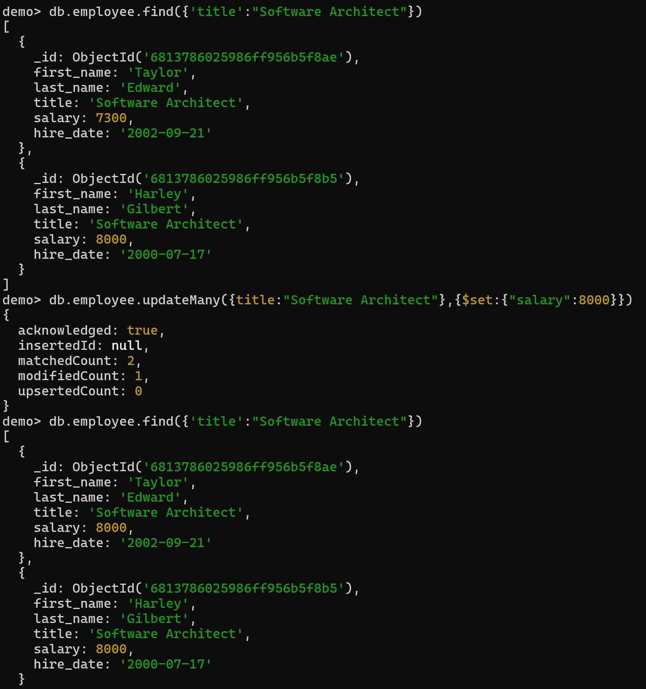

> 直接覆蓋可用`replaceOne`

```shell
db.<collection-name>.replaceOne({<filter>},{$set:{<edit>}}}
```

```shell
db.employee.replaceOne({_id: ObjectId('6813786025986ff956b5f8ad')},{
    "first_name": "Joan",
    "last_name": "Hu",
    "title": "Teacher",
    "salary": 1500,
    "hire_date": "2012-11-10"
  })
```

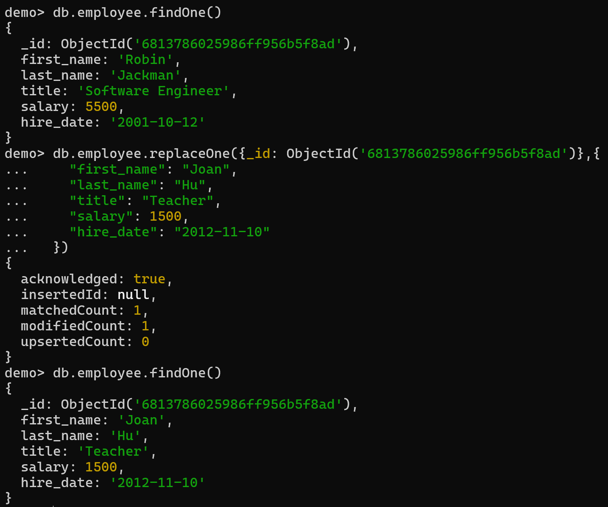

## find 方法和 cursor 物件

> 使用資料

```json
[
  { "name": "Linda Rodgers" },
  { "name": "Oscar Jensen" },
  { "name": "Dawn Dingle" },
  { "name": "Joline Thomas" },
  { "name": "Mary Bennett" },
  { "name": "Steven Partee" },
  { "name": "Vickie Lyle" },
  { "name": "Richard Hartman" },
  { "name": "David Baldwin" },
  { "name": "Elizabeth Oneal" },
  { "name": "Sharon Hanson" },
  { "name": "Caleb Kirkpatrick" },
  { "name": "Bruce Spruill" },
  { "name": "Ralph Smith" },
  { "name": "Monica Baxter" },
  { "name": "Faith Williams" },
  { "name": "Helen Tucker" },
  { "name": "Vernell Mcmorran" },
  { "name": "Eric Smith" },
  { "name": "Floyed Gallup" },
  { "name": "John Doe" },
  { "name": "Jane Smith" },
  { "name": "Michael Johnson" },
  { "name": "Patricia Williams" },
  { "name": "Robert Brown" },
  { "name": "Jennifer Davis" },
  { "name": "Linda Miller" },
  { "name": "Michael Wilson" },
  { "name": "Sarah Moore" }
]
```


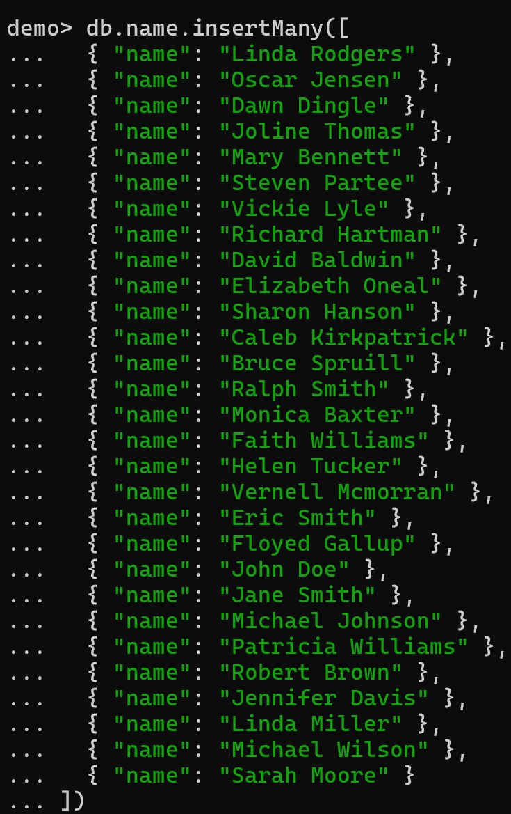
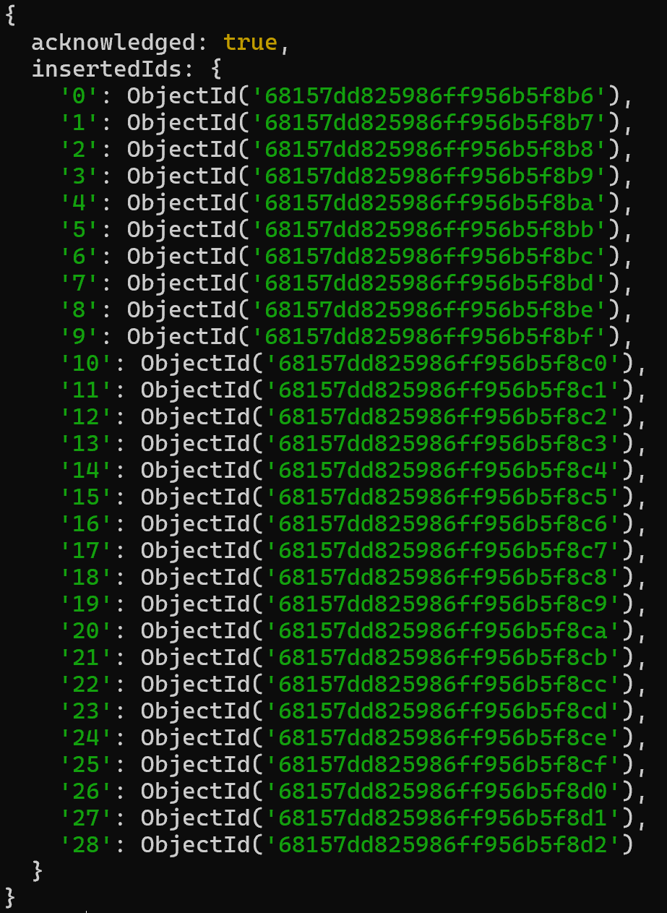
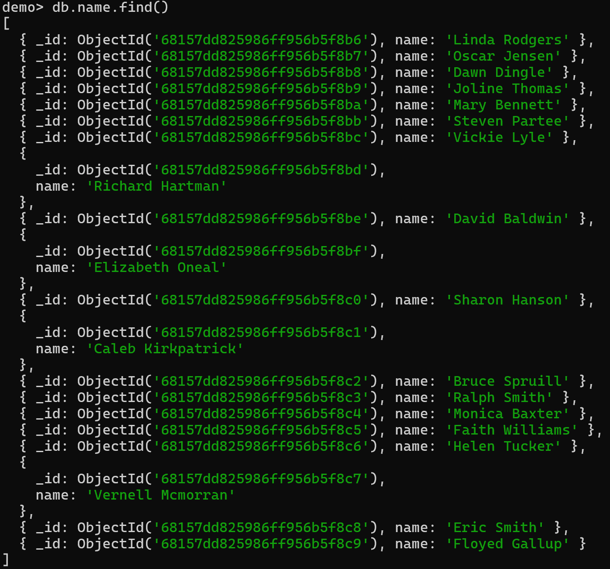
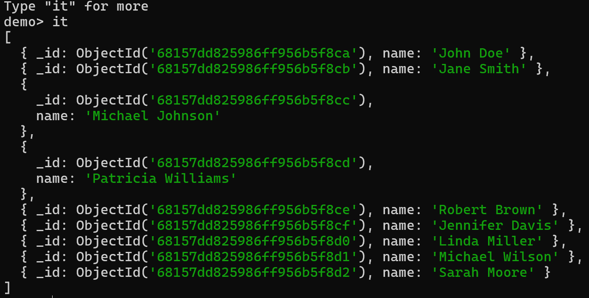

[官方網站](https://www.mongodb.com/docs/manual/reference/method/db.collection.find/)

> 打`it`可察看更多資訊，這裡的`it`全名是`iterate`
> iterate:透過 for 迴圈迭代的物件

> `db.collection.find()`:默認只返回前二十個，透過`it`可以再取得二十個

- 對 javascript 來講，可以轉換成 array

```shell
db.name.find().toArray()
```

> 這樣不用輸入`it`可直接返回所有資料

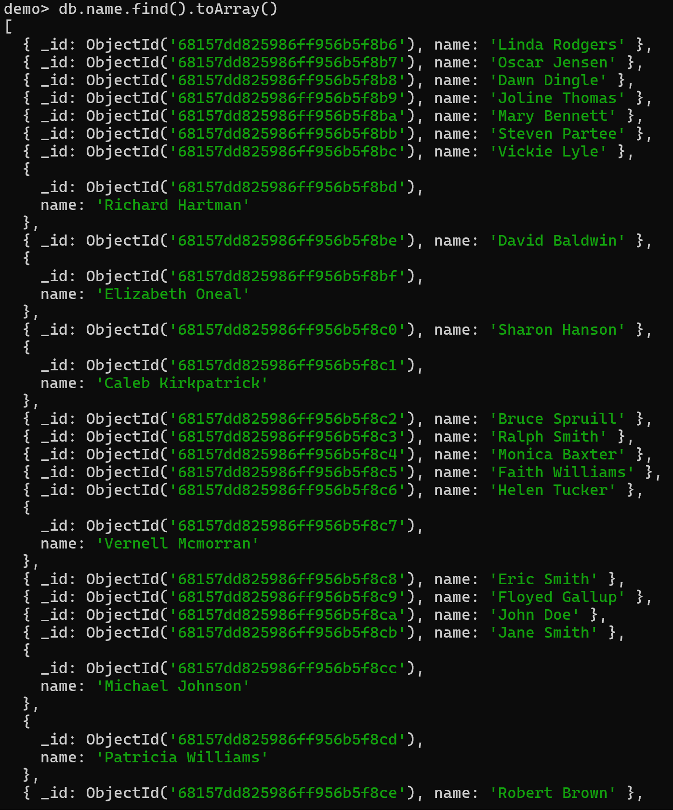

[MongoDB Drivers](https://www.mongodb.com/docs/drivers/)

## projection

> 原始資料

```json
{
  "first_name": "Robin",
  "last_name": "Jackman",
  "title": "Software Ebgineer",
  "salary": 5500,
  "hire_date": "2001-10-12"
}
```

> 需要的資料

```json
{
  "first_name": "Robin",
  "last_name": "Jackman",
  "salary": 5500
}
```

> 若把所有資料都傳給前端，讓前端處理會造成浪費存處和傳輸頻寬，所以在資料庫返回時就該處理好資料再進行返回

```shell
db.collections.find(filter,condition)
```

```shell
db.employee.find({},{first_name:1,last_name:1,salary:1,_id:0})
```

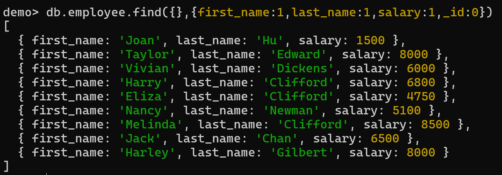

## Document 嵌套

> 使用資料

```json
[
  {
    "first_name": "Robin",
    "last_name": "Jackman",
    "title": "Software Engineer",
    "salary": 5500,
    "hire_date": "2001-10-12",
    "hobby": ["book", "movie"],
    "contact": {
      "email": "rj@jackman.com",
      "phone": 1111
    }
  },
  {
    "first_name": "Taylor",
    "last_name": "Edward",
    "title": "Software Architect",
    "salary": 7200,
    "hire_date": "2002-09-21",
    "hobby": ["travel", "hiking"],
    "contact": {
      "email": "te@edward.com",
      "phone": 2222
    }
  },
  {
    "first_name": "Vivian",
    "last_name": "Dickens",
    "title": "Database Administrator",
    "salary": 6000,
    "hire_date": "2012-08-29",
    "hobby": ["travel", "music"],
    "contact": {
      "email": "vd@dickens.com",
      "phone": 3333
    }
  },
  {
    "first_name": "Harry",
    "last_name": "Clifford",
    "title": "Database Administrator",
    "salary": 6800,
    "hire_date": "2015-12-10",
    "hobby": ["book", "gym"],
    "contact": {
      "email": "hc@clifford.com",
      "phone": 4444
    }
  }
]
```


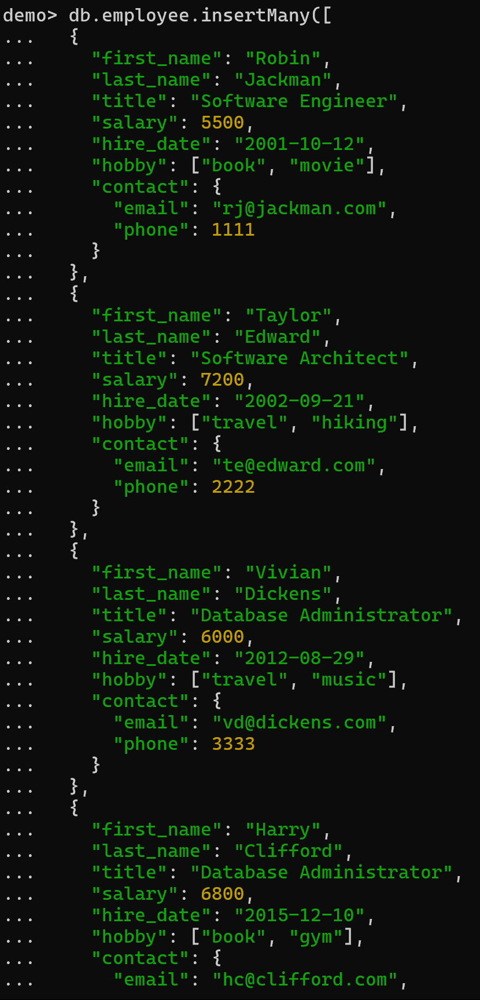
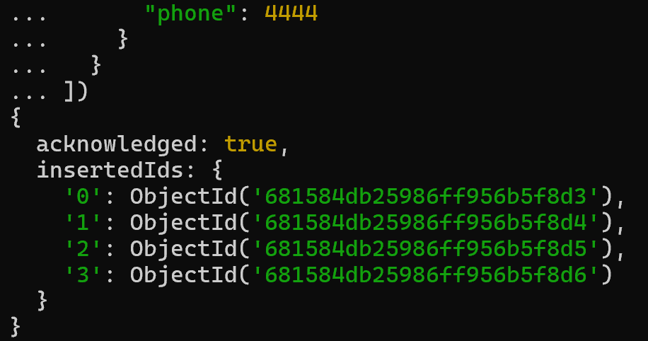

> 顯示第一條紀錄

```shell
db.employee.findOne()
```

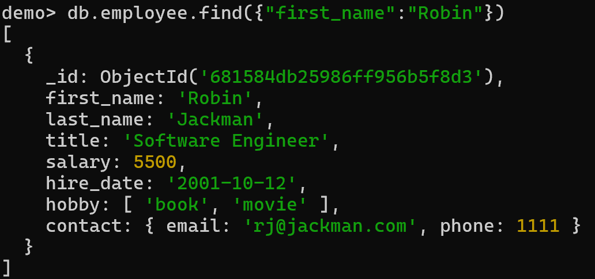

> 找尋物件單筆資料

```shell
db.employee.findOne({"contact.phone":1111})
```

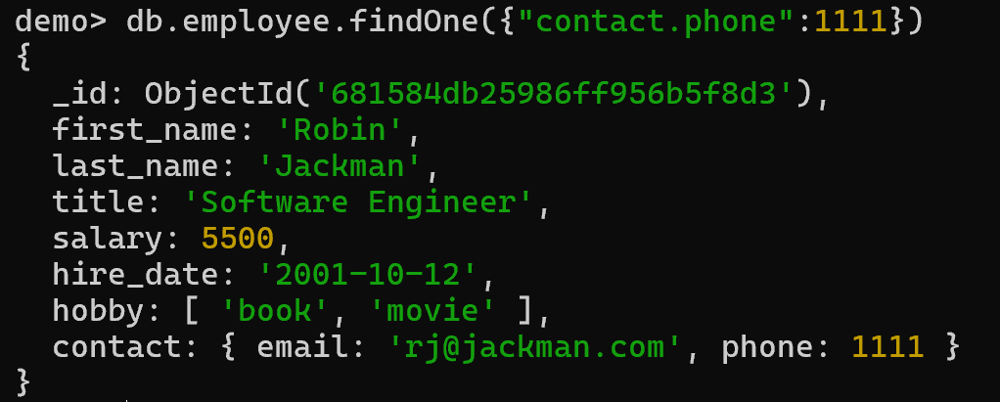

> 當有嵌套時，`key`的引號不能省略不然會報錯

❌

```shell
db.employee.findOne({contact.phone:1111})
```

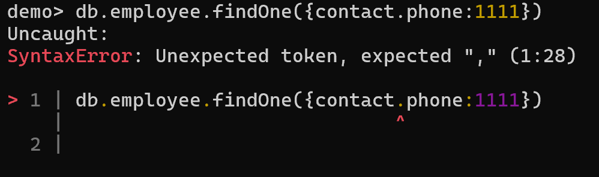

**找尋陣列資料**

> 找尋 hobby 有 book 的資料

```shell
db.employee.find({"hobby":"book"})
```

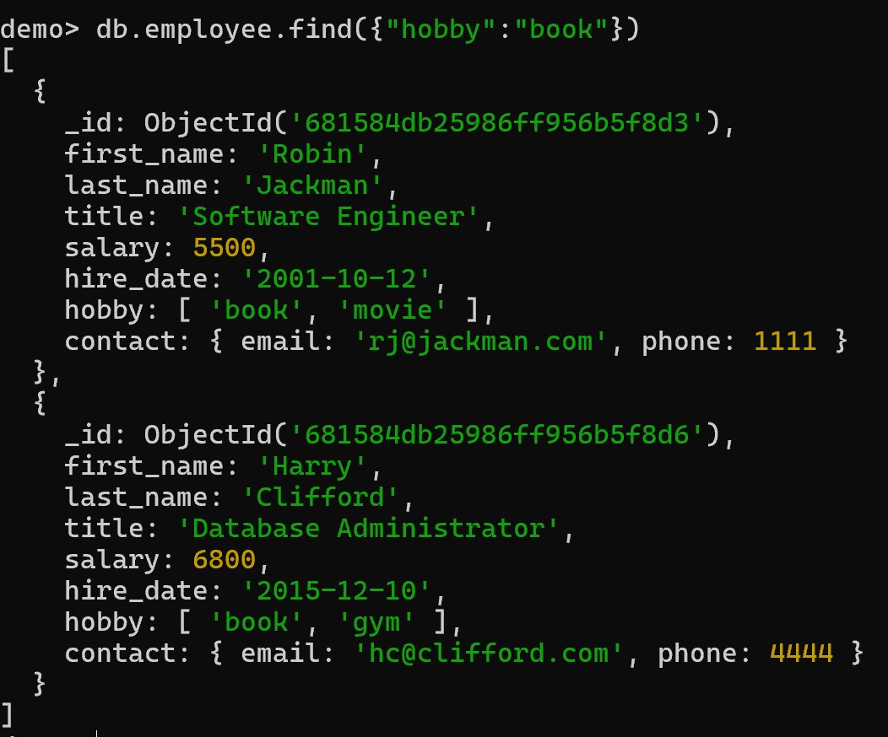

> 找尋有 book 和 movie

```shell
db.employee.find({"hobby":["book","movie"]})
```

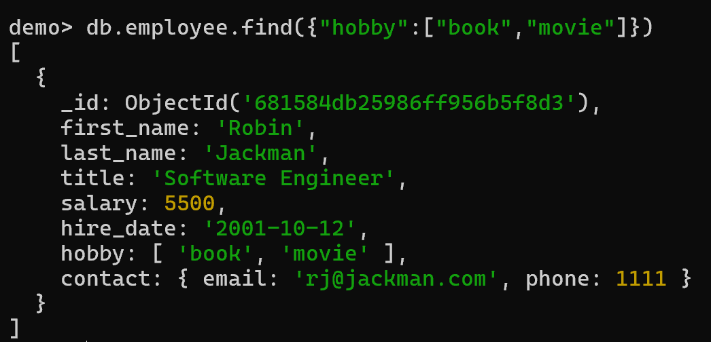

> 找尋 hobby 有 book 或 movie 的資料

[include 官網](https://www.mongodb.com/docs/manual/reference/operator/query/in/)

```shell
db.employee.find({ "hobby": { $in: ["book", "movie"] } })
```

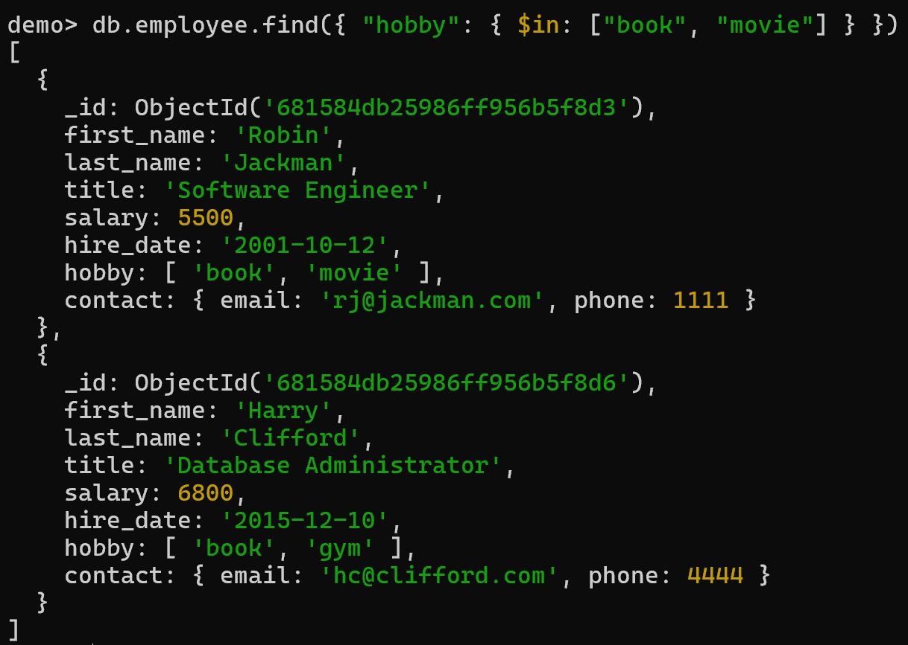

```shell
db.employee.find({ "hobby": { $in: ["book", "movie","travel"] } })
```

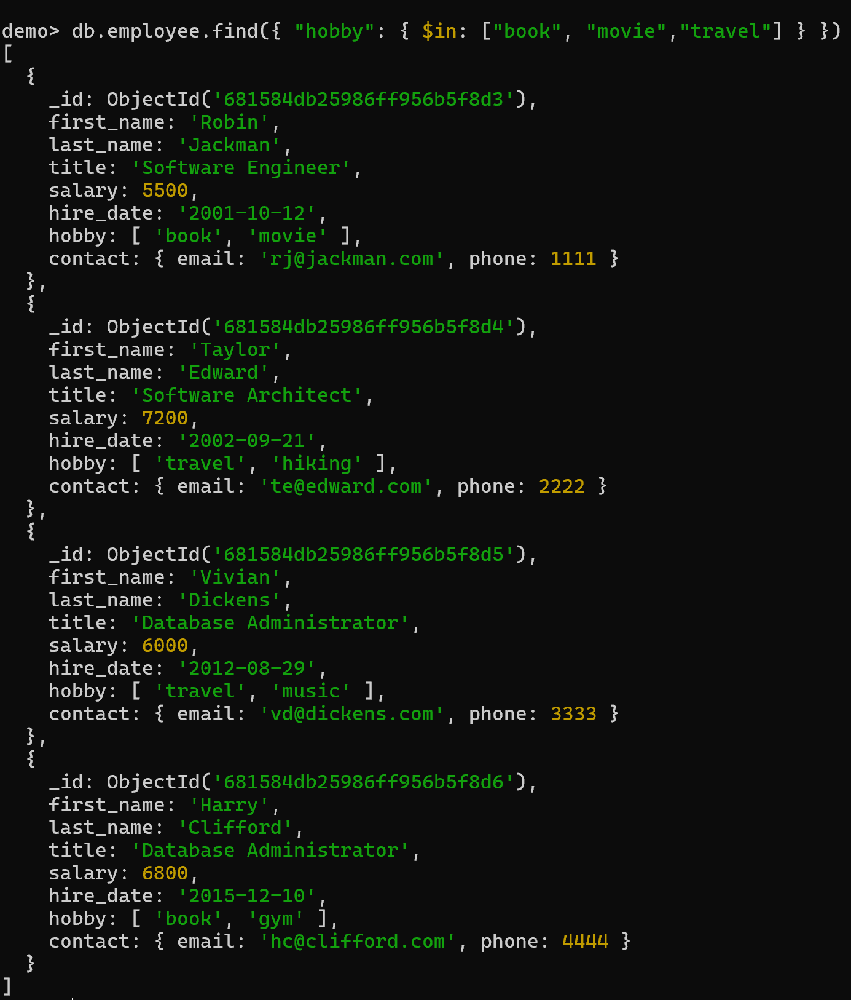

## Document limitation

[官網](https://www.mongodb.com/docs/manual/reference/limits/#bson-documents)

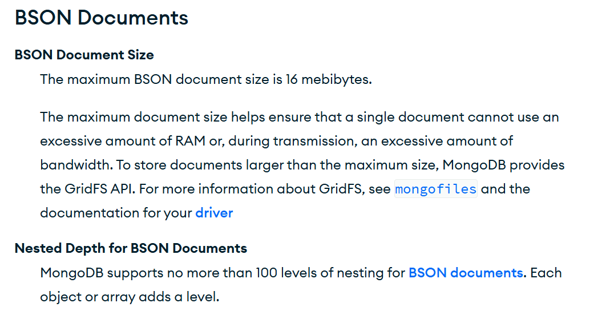

> 一個 BSON 大小不能超過十六兆，嵌套不能超過一百層

# 結構和資料類型

## Collection 有 Schema 嗎

Schema: 固定結構，須提前定義

> 例如: MySQL 再給定資料前，要先新建結構，例如要這個 table 要幾個 column，每一列的數據類型都是固定的，例如: age 就是 int，name 就是 varchar，定好後就要按照這結構插入數據，不能多也不能少

> Collection 沒有任何限制，可以插入任何類型的數據，但 collection 有 Schema，不是強制但可以設定

**在使用上雖然 mongoDB 可以隨意插入不同類型的數據，但設計者並不會讓使用者這麼做，畢竟一旦這麼做了，就很難去控管和對數據做處理，所以都還是會設計 Schema**

## 資料類型

- String
- Boolean
- Number (32 bit interger, 64bit Interger, Decimal)
- ObjectID
- Data (Timestamp, ISODate)
- Array

**數據類型用到的方法**

1. 用物件 `.` 的形式拿取資料

```shell
db.employee.findOne({}).<key>
```

- 範例

```shell
db.employee.findOne({}).title
```

```shell
db.employee.findOne({}).hobby
```

```shell
db.employee.findOne({}).contact
```

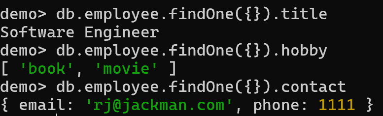

2. 使用`typeof`查看數據類型

```shell
typeof db.employee.findOne({}).<key>
```

- 範例

```shell
typeof db.employee.findOne({}).title
```

```shell
typeof db.employee.findOne({}).hobby
```

```shell
typeof db.employee.findOne({}).contact
```

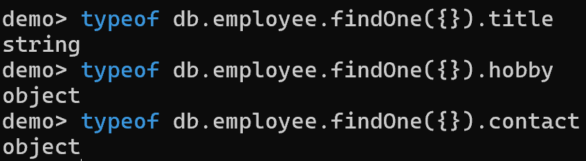

## 關於時間資料類型

> 透過 javascript 語法產生

```shell
var a = new Date()
```

```shell
var b = new Timestamp()
```

```shell
db.test.insertOne({date: a, timedtamp:b})
```

> 之後要使用這個需要看要使用什麼 drive，每個指令會不同，而去選擇使用

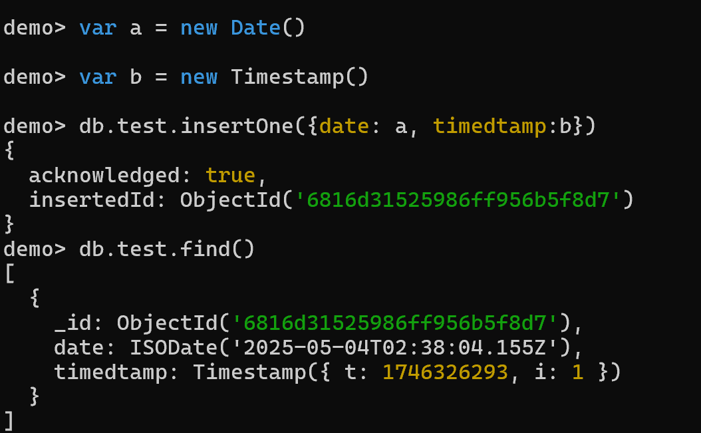

## 關於數字資料類型

> 透過 javascript 語法產生

```shell
var a = 1234
```

```shell
var b = NumberLong(1234)
```

```shell
db.test.insertOne({a: a, b:b})
```

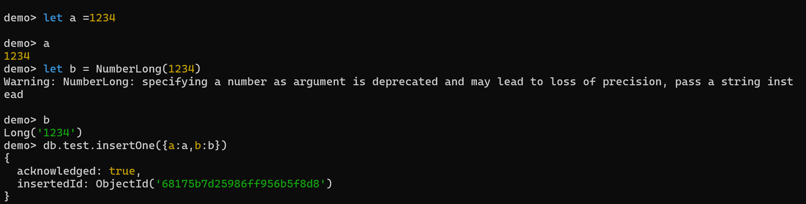
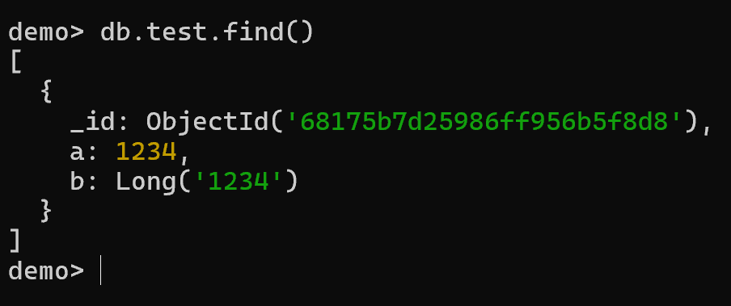

```shell
db.test.updateOne({},{$set:{c:1.001}})
```

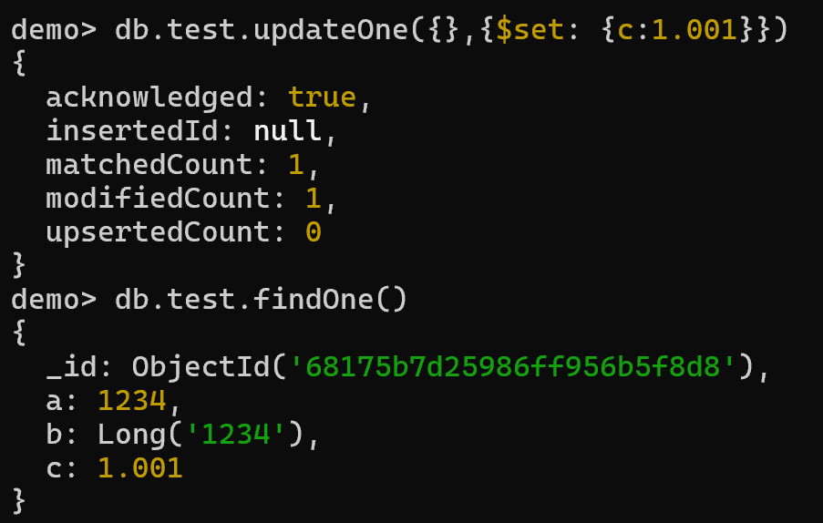

```shell
type db.test.findOne().a
```

```shell
type db.test.findOne().b
```

```shell
type db.test.findOne().c
```

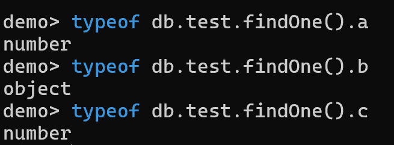

# NOSQL 中的關係

## 什麼是關係

```json
{
  "_id": 1,
  "name": "John Cart",
  "email": "test@g,com",
  "phone": 1234,
  "orders": [
    {
      "date": "2018-12-10",
      "product": "a book",
      "cost": 19.99
    },
    {
      "date": "2018-12-22",
      "product": "a computer",
      "cost": 2000
    }
  ]
}
```

> 轉變為關係文件

**customers**

```json
{
  "_id": 1,
  "name": "John Cart",
  "email": "test@g,com",
  "phone": 1234,
  "orders": [1, 2]
}
```

**orders**

```json
[
  {
    "_id": 1,
    "date": "2018-12-10",
    "product": "a book",
    "cost": 19.99
  },
  {
    "_id": 2,
    "date": "2018-12-22",
    "product": "a computer",
    "cost": 2000
  }
]
```

關係分很多種情況

1. 1 對 1
2. 1 對多
3. 多對多
