# 目錄

- [Mongoose 介紹](#Mongoose-介紹)
- [Mongoose 套件下載](#Mongoose-套件下載)
- [Model and Schema](#Model-and-Schema)
- [Mongoose 資料查詢](#Mongoose-資料查詢)
- [Query Object 與 Promise 比較補充](#Query-Object-與-Promise-比較補充)
- [更新資料](#更新資料)
- [刪除資料](#刪除資料)
- [Schema Vaildation](#Schema-Vaildation)
- [Static method and instance method](#Static-method-and-instance-method)
- [Mongoose Middleware](#Mongoose-Middleware)

## Mongoose 介紹

> 若要在程式語言中使用或存取 MongoDB ，我們需要工具讓資料庫可以跟 JavaScript 程式碼連結。這類工具的特點就是，能夠將 JavaScript 中的 Object 轉換成 MongoDB 當中的 document，因此，這類的工具叫做 object-document mapping(ODM)。在市面上，眾多 MongoDB 的 ODM 當中，最熱門的叫做 mongoose。

使用 ODM 的好處在於:

1. 資料庫的結構能被追蹤。通常資料庫的結構經過改變之後，很難退回到未改變的結構。使用 ODM 可以將資料庫的結構寫在程式碼內部，方便追蹤與更改。

2. 通常 ORM/ODM 會內建保護機制或是保護型語法，所以使用 SQL 資料庫時，就不用擔心 SQL Injection 之類的攻擊。

3. 讓 Project 更符合 MVC 模型。Mongoose 是 model，用來與 MongoDB 互動獲得或改變資料、View 是 EJS，Controller 則是 app.js 擔任

**SQL 資料庫使用的工具叫做 ORM，而 NoSQL 資料庫使用的工具叫做 ODM。兩者功能相同但名稱不同。**

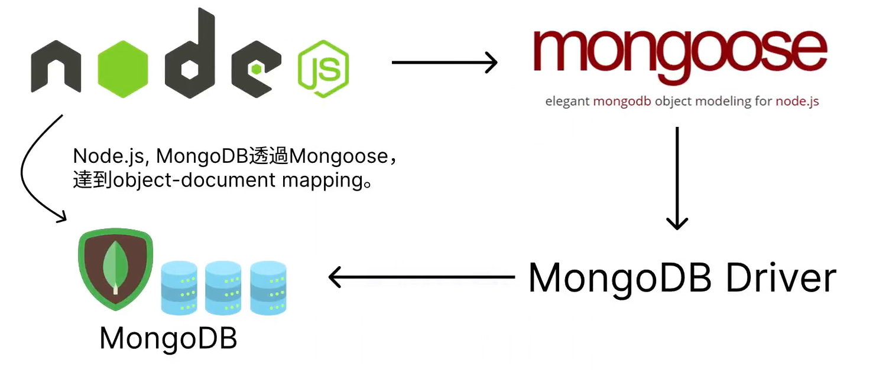

## Mongoose 套件下載

> 創建資料夾後用 VS code 打開，下載 npm

```shell
npm init
```

> 全部留預設

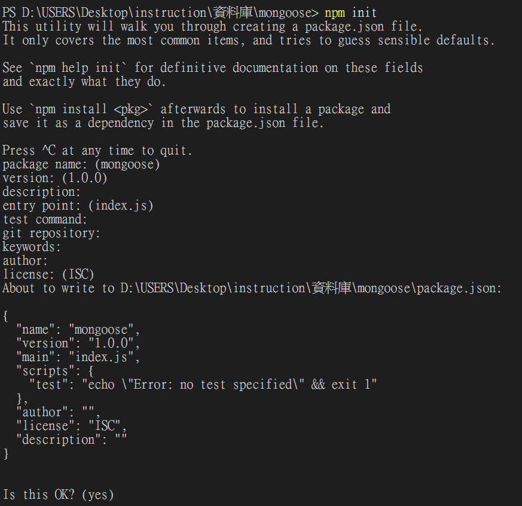

> 下載 express 和 ejs

```shell
npm install express ejs
```

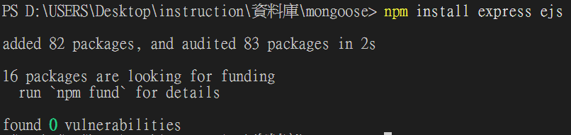

> 新建一個檔案(app.js)

```js
const express = require("express");
const app = express();

app.set("view engine", "ejs");

app.listen(3000, () => {
  console.log("server is listening port 3000");
});
```

> 啟動伺服器

```shell
nodemon app.js
```

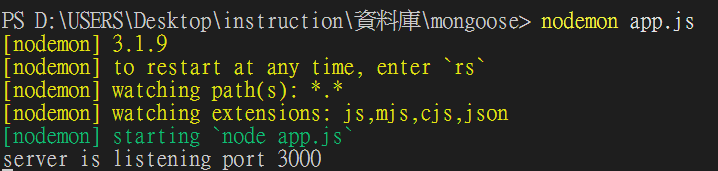

> 下載 mongoose

```shell
npm install mongoose
```

[npm install mongoose](https://www.npmjs.com/package/mongoose)

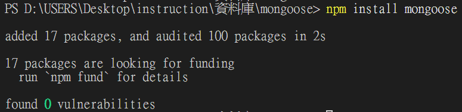

> package.json

```json
{
  "name": "mongoose",
  "version": "1.0.0",
  "main": "index.js",
  "scripts": {
    "test": "echo \"Error: no test specified\" && exit 1"
  },
  "author": "",
  "license": "ISC",
  "description": "",
  "dependencies": {
    "ejs": "^3.1.10",
    "express": "^5.1.0",
    "mongoose": "^8.14.1"
  }
}
```

[mongoose 官網](https://mongoosejs.com/)

> 連結 mongoose，修改 app.js

```js
const express = require("express");
const app = express();
const mongoose = require("mongoose");

app.set("view engine", "ejs");

mongoose
  .connect("mongodb://localhost:27017/demo")
  .then(() => {
    console.log("connecting is successful...");
  })
  .catch((e) => {
    console.log(e);
  });

app.listen(3000, () => {
  console.log("server is listening port 3000");
});
```

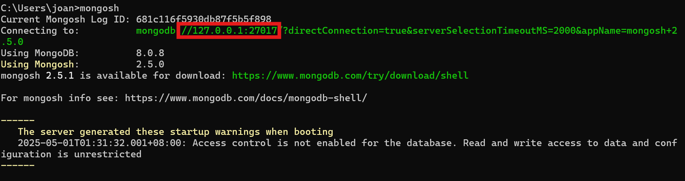
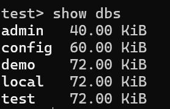

> `mongoose.connect("mongodb://<IP>:<port>/yourDB")`

> 啟動伺服器

```shell
nodemon app.js
```

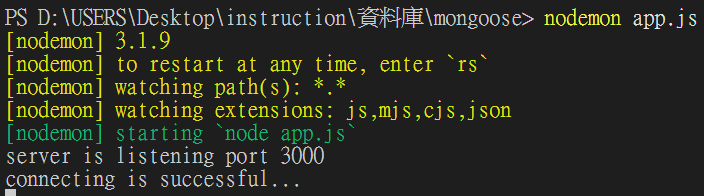

## Model and Schema

> 在 Mongoose 中，兩個 keyword 需要記得:

1. Schema: 每個 Schema 映射到一個 MongoDB 中的 Collection，並且定義該 Collection 中的 document 的架構，包含默認值、最大長度、最大值、最小值等等。

2. Model: 包裝 Schema 的容器。在資料庫中，Schema 所對應到的 Collection 提供了一個接口，可以用 Model 來對 Collection 進行新增、查詢、更新、刪除紀錄等功能

**Model 就像是 SQL 當中的 table，而 Schema 是 create table 的步驟。**

> Schema 的語法為:

```js
import mongoose from "mongoose";
const { Schema } = mongoose;
const blogSchema = new Schema({
  title: String, //String is shorthand for {type: String},
  data: { type: Date, default: Date.now },
  meta: { votes: Number, favs: Number },
});
```

**範例:**

```js
const mongoose = require("mongoose");
const { Schema } = mongoose;
const studentSchema = new Schema({
  name: String,
  age: Number,
  major: String,
  scholarship: {
    merit: Number,
    other: Number,
  },
});
```

> 在 blogSchema 的 constructor 當中，參數為一個物件，而物件的每個 key 都定義了 blog collection 當中的 document 的屬性。並且賦予的 value 為一個屬性為 SchemaType 的物件。常見的 SchemaType 有: String,Number,Date,Boolean,ObjectId,Array,Decimal128,Map

[mongoose schematypes](https://mongoosejs.com/docs/schematypes.html)

> Model 語法為

```js
const Blog = mongoose.model("Blog", blogSchema);
```

特別注意，mongoose.nodel()的第一個參數是 String，為我們的 collection 名稱。這裡使用的 String 必須為大寫英文字母開頭，且為`單數形式`。例如，如果我們希望製作名為 students 的 collection，就必須使用`Student`，而如果要製作名為 people 的 collection，就必須使用`Person`。(Mongoose 會自動轉換，我們需要確保提供正確拚字即可)

**範例:**

```js
const Student = mongoose.model("Student", studentSchema);

const newObject = new Student({
  name: "Esther",
  age: 27,
  major: "Mathematics",
  scholarship: {
    merit: 6000,
    other: 7000,
  },
});
```

**CRUD in Mongoose**

> 常見在 Mongoose 中，跟 CRUD 有關的操作是:

- document.save(): 在 MongoDB 中儲存 document。return a promise。

```js
doc.save().then(saveDoc = >{savedDoc === dov;//true })
```

**範例**

```js
newObject
  .save()
  .then((saveObject) => {
    console.log("The data has been saved. The saved data is... ");
    console.log(saveObject);
  })
  .catch((e) => {
    console.log(e);
  });
```

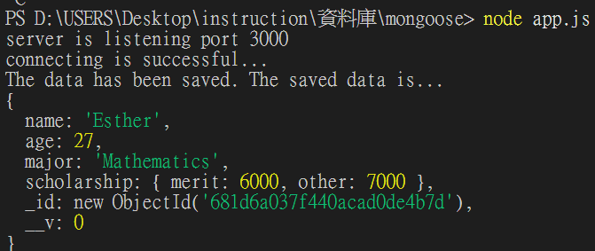
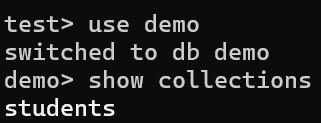
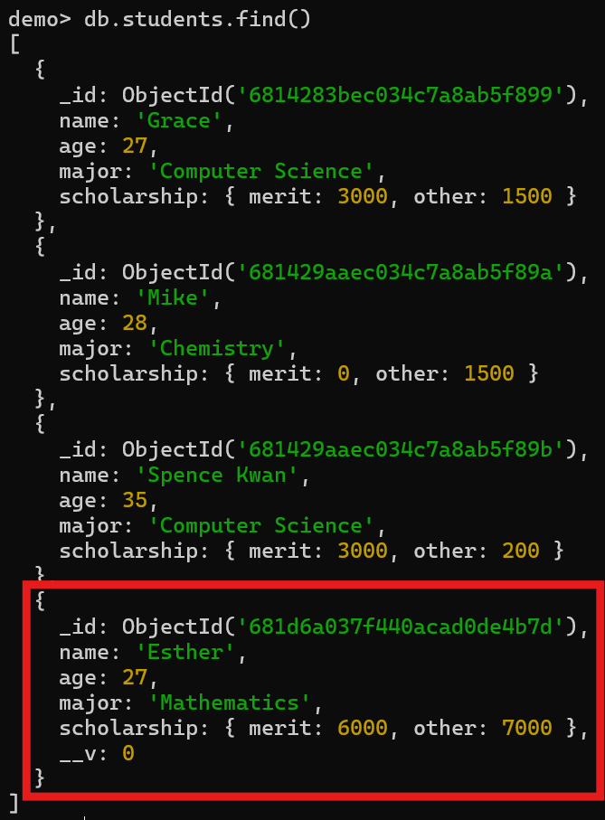

## Mongoose 資料查詢

在 Mongoose 當中，許多 methods 的 return type 都是「Query」。Query 是一種 Mongoose 特有的 Class(根據 documentation，Query 是一種 thenable object，但不是 Promise)，提供用於 find、update 和 documents 等操作提供 method chaining。如果要讓這些 methods 的 return type 變成 promise，可以讓 Query 執行.exec()即可。

- `Model.find(filter)`: 找到所有符合 filter 條件的物件。參數一個物件，用來提供過濾尋找的條件。

> return array of documents

```js
Student.find({})
  .exec()
  .then((data) => {
    console.log(data);
  })
  .catch((e) => {
    console.log(e);
  });
```

> async function 的形式

```js
async function findStudent() {
  try {
    let data = await Student.find().exec();
    console.log(data);
  } catch (e) {
    console.log(e);
  }
}
```

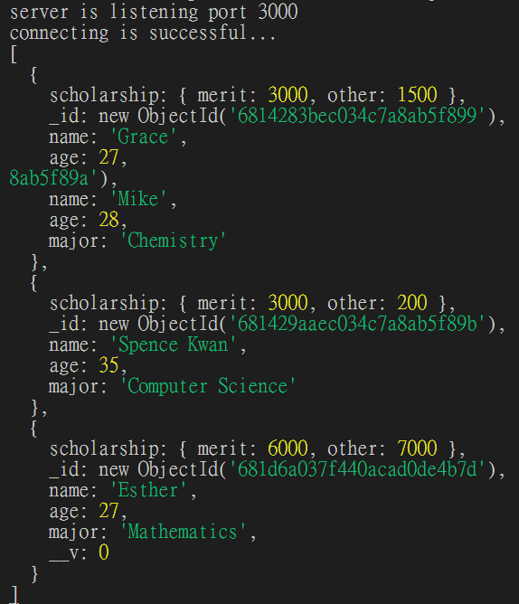

**真正在網站時的用法**

```js
app.get("/", async (req, res) => {
  try {
    let data = await Student.find().exec();
    res.send(data);
  } catch (e) {
    console.log(e);
  }
});
```

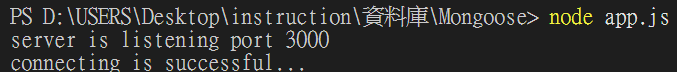
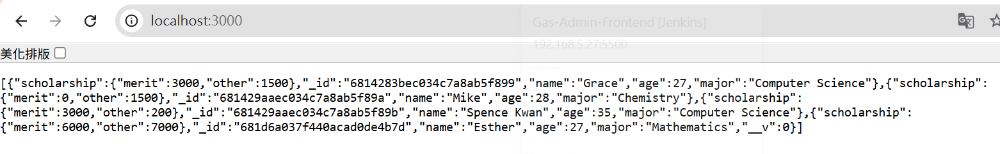

- `Model.findOne(filter)`: 找到第一個符合 filter 條件的物件。參數一個物件，用來提供過濾尋找的條件

> return a document

```js
app.get("/", async (req, res) => {
  try {
    let data = await Student.findOne({ name: "Grace" }).exec();
    res.send(data);
  } catch (e) {
    console.log(e);
  }
});
```

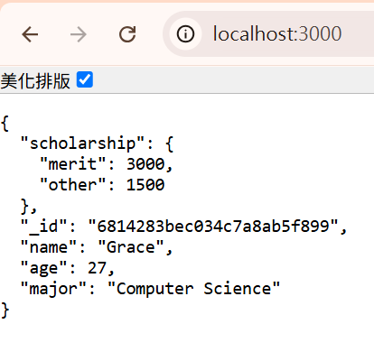

> 找到`scholarship.merit`大於`1500`

```js
Student.find({ "scholarship.merit": { $gte: 1500 } })
  .then((data) => {
    console.log(data);
  })
  .catch((e) => {
    console.log(e);
  });
```

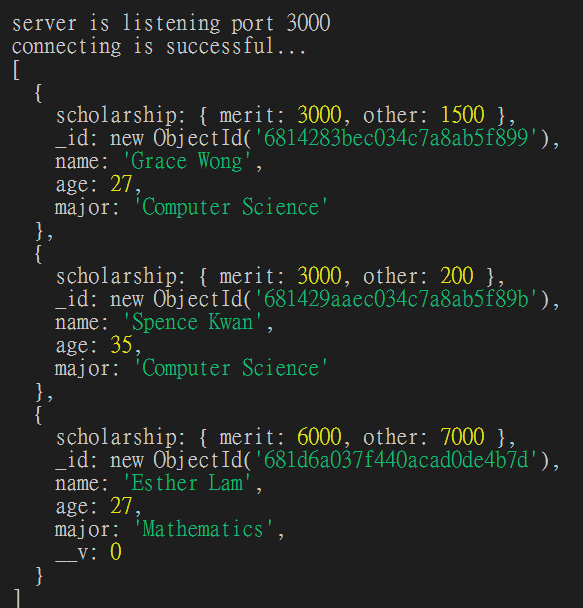

## Query Object 與 Promise 比較補充

關於 Query Object 與 Promise 的比較，我用文字在這裡補充。Query Object 以及 Promise 兩者非常相像：

1. Query Object 本身是一種 thenable object，代表後面可以串接.then()以及.catch()。在上支影片當中的 find()以及 findOne()兩個 method 的 return 值都是 Query Object。因此，如果你把上支影片範例中的.exec()全部刪掉，會發現程式碼還是能夠照常運作的。

2. Promise 語法我想你應該很熟悉了。也是可以使用.then()以及.catch()。

這裡可以看出，在 Query Object 後面加上.exec()，轉變成 Promise，這個步驟，似乎不是必要的。那兩者有何不同？或者，哪些情況該用哪個呢？

答案是，不管在哪種情況，在 Query Object 後面加上.exec()，讓它變成 Promise 都是比較好的。這是因為，使用 Promise 的話，JavaScript 的 try...catch...語法中，catch 可以顯示更好的錯誤追蹤訊息。詳細的例子可以參考 mongoose 的 documentation：https://mongoosejs.com/docs/promises.html 。使用 Promise 的話，錯誤追蹤訊息會顯示出問題的.exec()是在哪一行程式碼。因此，加上.exec()會比不加來得更好。

## 更新資料

- `Model.updateOne(filter,update,options)`:找到第一個符合 filter 條件的物件，並且將資料更新 update 的值。filter,update 這兩個 parameter 的資料類型都是 object。`.then()`內部的 callback 被執行時，帶入的 parameter 是更新操作訊息，例如:acknowledge, modifiedCount, upsertedId 等等。Options 物件可設定 runValidators，若 update 物件的值不符合 Schema 的設定，則出現 error。

```js
const Student = mongoose.model("Student", studentSchema);

Student.updateOne({ name: "Esther" }, { name: "Esther Lam" })
  .exec()
  .then((msg) => {
    console.log(msg);
  })
  .catch((e) => {
    console.log(e);
  });
```

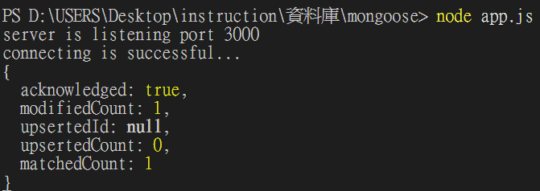

> 檢查是否有被更新

```js
Student.find({})
  .exec()
  .then((data) => {
    console.log(data);
  })
  .catch((e) => {
    console.log(e);
  });
```

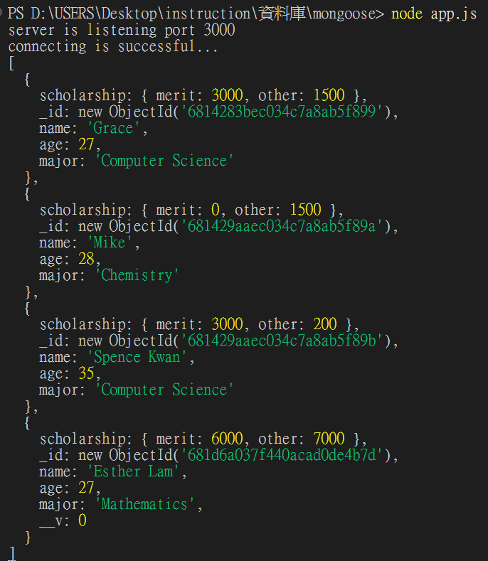

> Schema 可以設定最小值和最大值

```js
const studentSchema = new Schema({
  name: String,
  age: { type: Number, min: [0, "Age cannot be less than 0"] },
  major: String,
  scholarship: {
    merit: Number,
    other: Number,
  },
});
```

> 設定錯誤年齡

```js
Student.updateOne({ name: "Esther Lam" }, { age: -5 })
  .exec()
  .then((msg) => {
    console.log(msg);
  })
  .catch((e) => {
    console.log(e);
  });
```

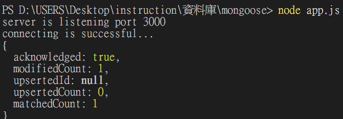
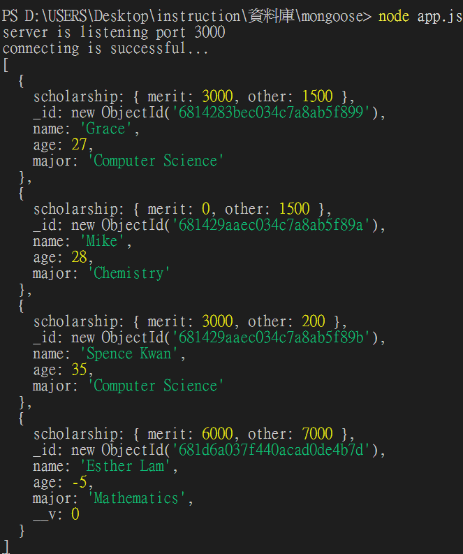

> 已經限制最大值了，為什麼還可以改變此值?

**因為在使用有關 update 的方法是，此方法是不會去看 Schema 是如何設定的，他們沒有關聯；但在新增時就會去判斷 Schema 是如何設定的，所以會發生錯誤**

```js
let newStudent = new Student({
  name: "Joan",
  age: -12,
  major: "Business Administration",
  scholarship: {
    merit: 5000,
    other: 2000,
  },
});

newStudent
  .save()
  .then((data) => {
    console.log("success!");
  })
  .catch((e) => {
    console.log(e);
  });
```

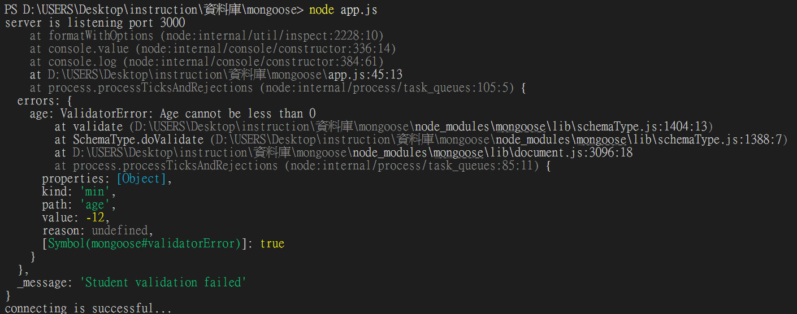

> 如何讓 update 也能做到呢?需要設定第三個`option`，`{ runValidators: true }`

```js
Student.updateOne(
  { name: "Esther Lam" },
  { age: -100 },
  { runValidators: true }
)
  .exec()
  .then((msg) => {
    console.log(msg);
  })
  .catch((e) => {
    console.log(e);
  });
```

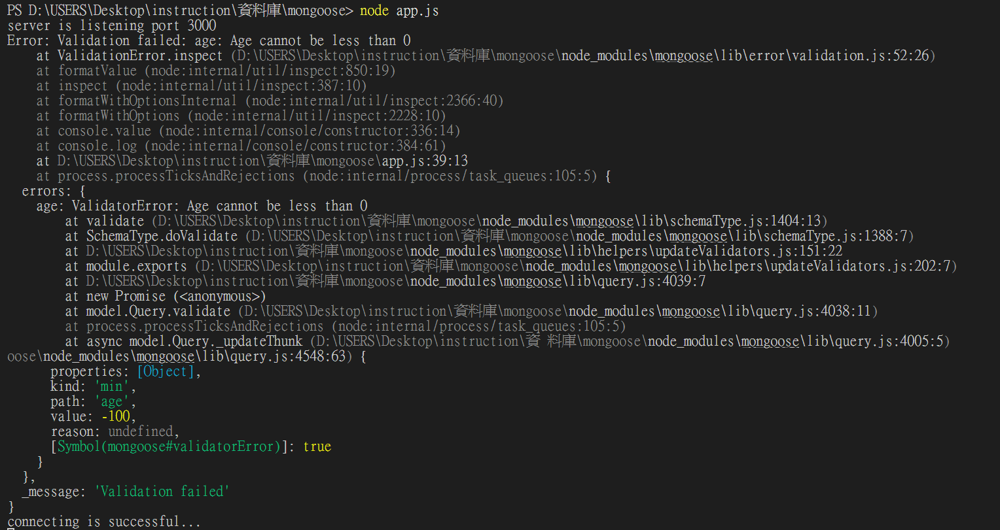

> `option`還可以設定`{new:true}`，但對`updateOne()`這方法是不起作用的

- `Model.updateMany(filter,update,options)`:找到所有符合 filter 條件的物件，並且將符合 filter 的每一筆資料，更新 update 的值。filter,update 這兩個 parameter 的資料類型都是 object。`.then()`內部的 callback 被執行時，帶入的 parameter 也是更新操作訊息。Options 可設定 run Validators。

- `Model.findOneAndUpdate(condition,update,options)`: 找到第一個符合 condition 條件的物件，並且更新 update 的值。condition,update,options 這三個 parameters 的資料類型都是 object。`.then()`內部的 callback 被執行時，若在 options 內部有表明 new 屬性為 true，則`.then()`內部的 callback 被執行時，帶入的 parameter 會是更新完成了 document。反之，沒有表明 new 是 true，或設定 new 是 false(這是預設值)，則 callback 的 parameter 會是更新前的 document。Options 中野可設定 runValidators

```js
Student.findOneAndUpdate(
  { name: "Grace" },
  { name: "Grace Wong" },
  { runValidators: true, new: true }
)
  .exec()
  .then((newData) => {
    console.log(newData);
  })
  .catch((e) => {
    console.log(e);
  });
```

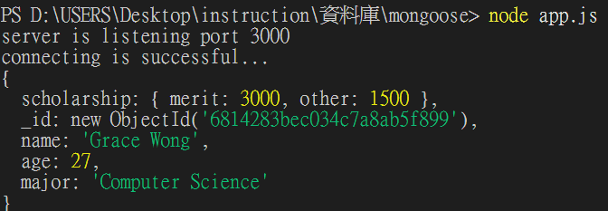

```js
Student.findOneAndUpdate(
  { name: "Mike" },
  { name: "Mike Chen" },
  { runValidators: true, new: false } //new預設為false
)
  .exec()
  .then((oldData) => {
    console.log(oldData);
  })
  .catch((e) => {
    console.log(e);
  });
```

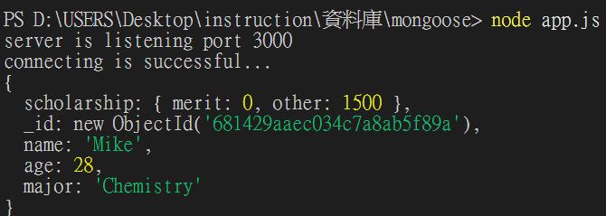

> `updateOne()`與`findOneAndUpdate()`的使用時機為何?

- `updateOne()`是當我們不需要更新後的 document，並且希望節省一點資料庫操作時間的通訊流量可以選擇使用。

- `findOneAndUpdate()`:排除上面可以選擇使用`updateOne()`的情況，推薦使用此方法，因為`findOneAndUpdate()`提供更新完成的 document 是非常實用的功能

## 刪除資料

- `Model.deleteOne(condition)`:從 Collections 中刪除與 conditions 匹配的第一個 document。此 method 會 return 一個具有 deletedCount 屬性的 object。

```js
Student.deleteOne({ name: "Mike Chen" })
  .exec()
  .then((msg) => {
    console.log(msg);
  })
  .catch((e) => {
    console.log(e);
  });
```

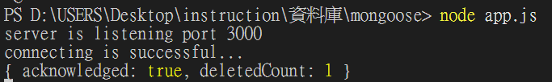

- `Model.deleteMany(condition)`: 從 Conditions 中刪除與 conditions 匹配的所有 documents。此 method 會 return 一個具有 deletedCount 屬性的 object。

**[其他的所有 Mongoose CRUD 操作 ](https://mongoosejs.com/docs/queries.html)**
