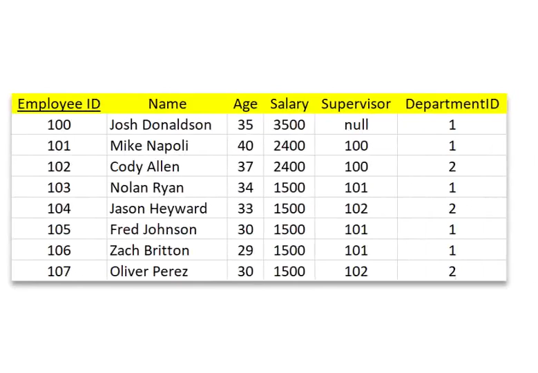

# 目錄

- [MySQL](#MySQL)
  - [資料庫管理系統 DBMS](#資料庫管理系統-DBMS)
  - [增刪查改 CRUD](#增刪查改-CRUD)
  - [keys](#keys)
  - [SQL](#SQL)
  - [下載 MySQL Server](#下載-MySQL-Server)
  - [PopSQL 下載](#PopSQL-下載) 
  - [SQL 表格設定](#SQL-表格設定)
  - [增加資料](#增加資料)
  - [刪除 查詢 修改資料](#刪除-查詢-修改資料) 
  - [Join 表格](#Join-表格)
  - [SQL 與 NoSQL 比較](#SQL-與-NoSQL-比較)     

- [MongoDB](#MongoDB)
  - [安裝 MongoDB 與 Mongo Shell](#安裝-MongoDB-與-Mongo-Shell)
  - [JSON and BSON](#JSON-and-BSON)
  - [mongosh 與 數據新增](#mongosh-與-數據新增)
  - [數據查詢](#數據查詢)
  - [修改與刪除](#修改與刪除)   

# MySQL

## 資料庫管理系統

**我們為什麼需要資料庫?不能將所有數據用Excel儲存嗎?**

> 儘管我們可以對Excel表格中的數據進行排序和過濾，但資料庫具有廣泛的查詢功能，可以檢索與選擇條件匹配的所有紀錄，並且在多個表格中做交叉引用紀錄，以及跨多個表格執行複雜的聚合計算

> 此外，就查詢資料而言，資料庫比Excel快上許多，在資料龐大時差別會更明顯。Excel可以處理最多大約100萬行數據，但對於現代資料來說，明顯容量不足了。

- 資料庫管理系統(database management system，縮寫:DBMS) 是一種為管理資料庫而設計的管理系統，具有代表性的資料管理系統有:Microsoft SQL Server、MongoDB、MySQL及PostgreSQL等。(簡單來說，DBMS就是管理資料庫的軟體)

**資料庫在概念上來說，可以被分成兩種:**
1. Relational Database (or SQL Database):是一種存儲並提供對彼此相關的數據點訪問的資料庫。例如，一家娛樂公司有一個資料庫來儲存他們所有的藝術家和歌曲數據。所有歌曲都有一位或多於一位作家，所有作家都有一首或多於一首歌曲。因此，該數據庫的每個表格之間是有關聯的。

> ER Diagram 由美籍台灣人電腦科學家陳品姍發明，常用於資訊系統設計中；對於大型的資料庫來說，建構的第一步就是設計資料庫，並且畫出ER Diagram。

> 大多會用表格做儲存

2. Non-Relational Database (or NoSQL Database)

> 會用json做儲存而不是表格

> 數據的彈性會更好

- 幾十年來，SQLite、PostgreSQL、MySQL和SQL Server等關係資料庫已成為數據儲存的熱門選擇。近幾年來，包括MongoDB和Redis在內的NoSQL資料庫也逐漸受到青睞。

