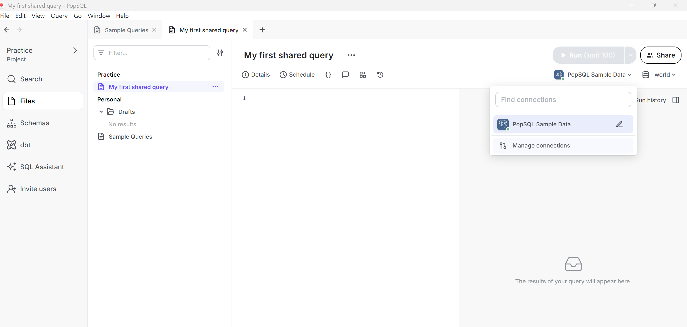
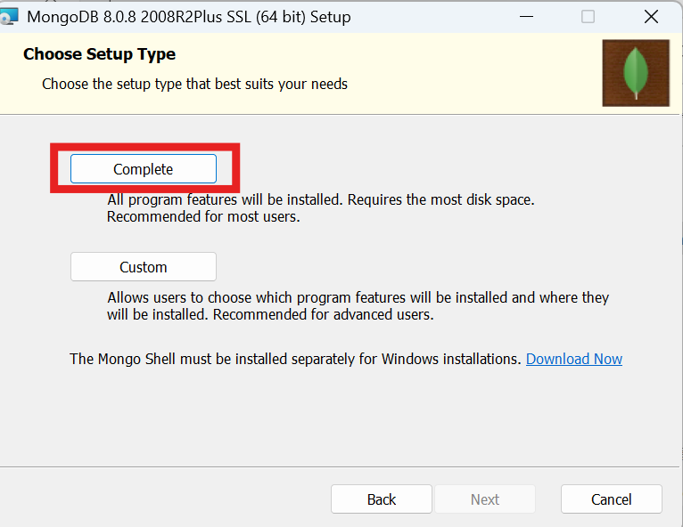
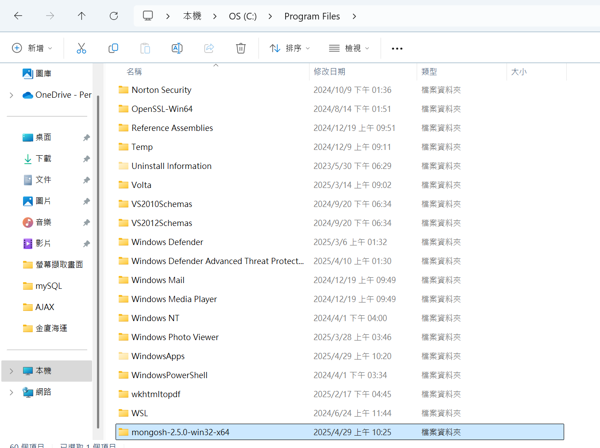

# 目錄

- [MySQL](#MySQL)

  - [資料庫管理系統 DBMS](#資料庫管理系統-DBMS)
  - [增刪查改 CRUD](#增刪查改-CRUD)
  - [Relational Database and Excel](#Relational-Database-and-Excel)
  - [SQL](#SQL)
  - [下載 MySQL Server](#下載-MySQL-Server)
  - [PopSQL 下載](#PopSQL-下載)
  - [SQL Data Type](#SQL-Data-Type)
  - [SQL 表格設定](#SQL-表格設定)
  - [SQL 基本語法](#SQL-基本語法)
  - [SQL 與 NoSQL 比較](#SQL-與-NoSQL-比較)

- [MongoDB](#MongoDB)
  - [安裝 MongoDB 與 Mongo Shell](#安裝-MongoDB-與-Mongo-Shell)
  - [JSON and BSON](#JSON-and-BSON)
  - [mongosh 與 數據新增](#mongosh-與-數據新增)
  - [數據查詢以及修改與刪除](#數據查詢以及修改與刪除)


# MySQL

## 資料庫管理系統

**我們為什麼需要資料庫?不能將所有數據用 Excel 儲存嗎?**

> 儘管我們可以對 Excel 表格中的數據進行排序和過濾，但資料庫具有廣泛的查詢功能，可以檢索與選擇條件匹配的所有紀錄，並且在多個表格中做交叉引用紀錄，以及跨多個表格執行複雜的聚合計算

> 此外，就查詢資料而言，資料庫比 Excel 快上許多，在資料龐大時差別會更明顯。Excel 可以處理最多大約 100 萬行數據，但對於現代資料來說，明顯容量不足了。

- 資料庫管理系統(database management system，縮寫:DBMS) 是一種為管理資料庫而設計的管理系統，具有代表性的資料管理系統有:Microsoft SQL Server、MongoDB、MySQL 及 PostgreSQL 等。(簡單來說，DBMS 就是管理資料庫的軟體)

**資料庫在概念上來說，可以被分成兩種:**

1. Relational Database (or SQL Database):是一種存儲並提供對彼此相關的數據點訪問的資料庫。例如，一家娛樂公司有一個資料庫來儲存他們所有的藝術家和歌曲數據。所有歌曲都有一位或多於一位作家，所有作家都有一首或多於一首歌曲。因此，該數據庫的每個表格之間是有關聯的。


> ER Diagram 由美籍台灣人電腦科學家陳品姍發明，常用於資訊系統設計中；對於大型的資料庫來說，建構的第一步就是設計資料庫，並且畫出 ER Diagram。

> 大多會用表格做儲存
> 

2. Non-Relational Database (or NoSQL Database)

> 會用 json 做儲存而不是表格

> 數據的彈性會更好


- 幾十年來，SQLite、PostgreSQL、MySQL 和 SQL Server 等關係資料庫已成為數據儲存的熱門選擇。近幾年來，包括 MongoDB 和 Redis 在內的 NoSQL 資料庫也逐漸受到青睞。

## 增刪查改 CRUD

> 增刪查改(CRUD)，全稱增加(Create，意為「建立」)、刪除(Delete)、查詢(Read，意為「讀取」)、改正(Updata，意味「更新」)，是在 DBMS 當中，一連串幢建的操作行為。

**增刪查改除了常用於 SQL 資料庫之外，也在與網站的 API 阜口時常使用。在 Resful API 製作時，會再次使用。但網站的 API 阜口使用 HTTP 協定傳送通訊，所以原本的「增珊查改」所對應的英文字會因此改名，不再對應 CRUD。比如:「查」不再是 Read，而改為 GET；「增」不再是 Create，而改為 POST；「改」不再是 Update，而改為 PUT 等等。**

**英語中因為 CRUD 比中文所對應的 CRUD 易讀易記而將「刪除」(Delete)放置於最後。但是英文小寫的 curd，是指水垢、腐蝕淤泥，或是噁心的東西。**

## Relational Database and Excel


> 整個叫 Database，一個 Databas 可能會有很多個 table，在 table 和 table 之間他們是互相有關連的

### key

- 關係鍵(keys)是關聯式資料庫的重要組成部分。關係鍵是一個表中的一個或幾個屬性，用來標示該錶的每一行或與另一個表產生關係。在 DBMS 當中，主要的 keys 有:

1. 主鍵(primary key): 是資料庫表中對儲存資料誤鍵予以唯一和完整標示的資料列或屬性的鍵。一筆資料只能有一個主鍵(但可以由兩個以上的行組成 primary key)，且主鍵的取值不能缺失，即不能為空值(Null)。

2. 外鍵(foreign Key): 是指向其他表個主鍵的欄位，用於確定兩張表格的關聯性

3. 自然鍵(natural key): 若使用在真實生活中唯一確定一個事物的標識，來當作資料庫的 primary key，則此 primary key 可被稱作是 natural key。例如，台灣的身分證字號可以當作資料庫的 natural key。

4. 代理鍵(surrogate key): 相對於 natural key，在當資料表格中的所有現有欄位都不適合當主鍵時，例如資料太長，或是意義層面太多，就會製作一個無意義的欄位來代為作主鍵

5. 複合主鍵(composite key): 當資料表的主鍵(Primary Key)如果是由多個欄位組成，則稱為 composite key。

## SQL

- SQL(Structured Query Language，結構化查詢語言)是一種特定目的的程式語言，用於對關聯式資料庫管理系統(Relational DBMS, or RDBMS)下達指令。SQL 在 1987 年成為國際標準化組織(ISO)標準。
- 雖然有這一標準的存在，但大部分的 SQL 代碼在不同的資料庫系統中並不具有完全的跨平台性，也就是說，雖然 SQL 這門程式語言可以用來操作 DBMS，但每個 DBMS 所接受的 SQL 語法有些微差異。例如，用來操作 MySQL 這個 DBMS 的 SQL 程式碼不能全部拿去用來操作 Mircosoft SQL Server 這個 DBMS。

## 下載 MySQL Server


## PopSQL 下載





> 測試是否有連接


- 新增 TABLE

```SQL
CREATE TABLE employees (
    employeeID int PRIMARY key
)
```

- 刪除 TABLE

```sql
DROP TABLE employees;
```

## SQL Data Type

| Data Types   | Bytes             | Description                                                                                               |
| ------------ | ----------------- | --------------------------------------------------------------------------------------------------------- |
| INT          | 4 bytes           | 資料範圍是-2^31~2^31-1(-2147483648~2147483467)                                                            |
| DECIMAL(p,s) | 視精確度而定      | p 代表 total digits，s 代表小數點後的 digits。例如:152.23 為例，p 是 5,s 是 2。資料範圍是-10^38+1~10^38-1 |
| VARCHAR(n)   | 變動長度，max=2GB | 資料範圍是 1~2^31-1                                                                                       |
| DATETIME     | 8bytes            | 資料範圍是 1753/1/1~9999/12/31 ex2008-11-27 08:08:08:888                                                  |

## SQL 表格設定

試試看製作下面表格


- Employee table

```sql
CREATE TABLE employees (
    employeeID INT PRIMARY key,
    employeeName VARCHAR(50),
    age INT,
    salary INT,
    supervisor INT,
    departmentID INT
)
```

## SQL 基本語法

- 在 SQL 中，創造新表格的語法為:

```SQL
CREATE TABLE table_name(
column1 datatype,
column2 datatype,
column3 datatype,
.....
)

```

```sql
CREATE TABLE employees (
    employeeID INT PRIMARY key,
    employeeName VARCHAR(50),
    age INT,
    salary INT,
    supervisor INT,
    departmentID INT
)
```

- 想要得到 SQL 的表格資訊，可以用:

```SQL
DESCRIBE table_name
```

```SQL
DESCRIBE employees
```

- 刪除表格

```SQL
DROP TABLE table_name
```

```SQL
DROP TABLE employees
```


- 若要在表格中心曾資料，則語法為:

1. 指定 column name 和要插入的值:

```spl
INSERT INTO table_name (column1,column2,column3, ...)
VALUES (value1,value2,value3,...)
```

```SQL
INSERT INTO employees (employeeID, employeeName, age, salary, supervisor, department)
VALUES (100, "Josh Donaldson" ,35 ,3500, NULL,1);
```

2. 如果要為表格的所有 column 添加值，則無需指定 column name。但是，需要確保值的順序與表中 column 的順序相同。

```sql
INSERT INTO table_name
VALUES (value1,value2,value3,...);
```

```sql
INSERT INTO employees
VALUES (101, "Mike Napoli" ,40 ,2400, 100,1);
```

- 查詢的語法

```sql
SELECT* FROM table_name;
```

```sql
SELECT* FROM employees;
```

- `*`: 所有欄位


- 修改表格現有的紀錄，語法:

```sql
UPDATE table_name
SET column1 = value1, column2 = value2,...
WHERE condition;
```

> 更新表中的紀錄時要小心!注意 UPDATE 語句中的 WHERE。WHERE 可以指定應該更新那些紀錄。如果省略 WHERE，表中所有紀錄都將被更新!

```SQL
INSERT INTO employees
VALUES (103, "Nolan Ryan" ,34, 1500, 101,1);
INSERT INTO employees
VALUES (104, "Jason Heyward" ,33, 1500, 102,2);
INSERT INTO employees
VALUES (105, "Fred Johnson" ,30, 1500, 101,1);
INSERT INTO employees
VALUES (106, "Zach Britton" ,29, 1500, 101,1);
INSERT INTO employees
VALUES (108, "Oliver Perez" ,30, 1500, 102,2);
SELECT* FROM employees;
```


```SQL
UPDATE employees
SET employeeID = 107
WHERE employeeID = 108
```


- 刪除表格現有的紀錄，語法為:

```SQL
DELETE FROM table_name WHERE condition;
```

> 刪除表格中的紀錄時也要小心! 如果省略 WHERE，表中的所有紀錄都將被刪除!DELETE 語法只能夠刪除表格中的資料，但表格本身依然存在。若要刪除表格，則必須使用語法:

```SQL
DROP TABLE table_name
```

```SQL
DELETE FROM employees WHERE employeeID = 107;
```


- 查詢表格中的資料時，常用語法為:

```SQL
SELECT column1, column2,...
FROM table_name;
```

```SQL
SELECT employeeID, employeeName, age
FROM employees;
```


> 如果要選擇表中所有的 column，可使用:

```SQL
SELECT * FROM table_name
```

- ORDER BY 關鍵字用於對查詢結果按升序或降序進行排序(默認按升序(ASC)紀錄進行排序)

```SQL
SELECT column1, column2,...
FROM table_name
ORDER BY column1 (ASC|DESC), column2 (ASC|DESC), ...;
```

```sql
SELECT*
FROM employees
ORDER BY age ;
```


```SQL
SELECT*
FROM employees
ORDER BY age DESC;
```


- 查詢表格中的資料時，可以用 WHERE 過濾資料:

```sql
SELECT column1, column2,...
FROM table_name
WHERE condition;
```

> WHERE 中可以使用以下運算符號: `=`,`<`,`<=`,`>`,`>=`,`<>`,IN,BETWEEN,`!=`等等。

```sql
SELECT employeeID, age, departmentID
FROM employees
WHERE departmentID = 1
ORDER BY age;
```


```sql
SELECT employeeName,salary, departmentID
FROM employees
WHERE departmentID = 1 AND salary >=2000
```


- JOIN 用於根據兩個或多個表之間相關 COLUMN 的組合。JOIN 的語法為:

```SQL
SELECT column1, column2,...
FROM table1
JOIN table2 ON table.columnName = table2.columnName;
```

```SQL
CREATE TABLE department(
  departmentID INT PRIMARY KEY,
  departmentName VARCHAR(20),
  address VARCHAR(20),
  headID INT
)
```

```SQL
INSERT INTO department
VALUES (1, "North Cement Ltd." ,"NY No.11" ,101);

INSERT INTO department
VALUES (2, "South Cement Ltd." ,"CA No.15" ,102);
```

```sql
SELECT *
FROM department d
JOIN employees e
ON d.headID = e.employeeID;
```

> Let A and B be subsets of S. The Cartesian Prodcut (or cross product) of A and B, denoted by A x B is defined by:

A × B = { (x, y) | x ∈ A, y ∈ B }

For example,

A = {1,2} and B = {3,4}, then:
A x B = {(1,3),(1,4),(2,3),(2,4)}
A^2 = {(1,1),(1,2),(2,1),(2,2)}

## SQL 與 NoSQL 比較

- SQL

> 關係型資料庫主要有以下優點

1. 由於關係行資料庫改變表格架構較困難，通常會保持數據的一致性。
2. 資料庫內的資料表連結性高，可以進行 Join 等複雜查詢
3. 產品成熟度高、穩定性也高，經過多年發展，較少 bug 需要處理，且提供報表生成等商業功能。

> 缺點是:

1. 擴展困難。關係行資料庫通常會垂直擴展，單台伺服器要持有整個資料庫來確保可靠性與數據的持續可用性。這樣做的代價就是非常昂貴、擴展受到限制
2. 成本高: 企業級資料庫的 License 價格很驚人，並且隨著系統的規模，而不斷上升。
3. 讀寫慢；這種情況主要發生在數據量達到一定規模時，由於關係型資料庫的系統邏輯非常複雜(MySQL use both B+Tree, and HASH indexes)，且有可能死鎖(Deadlock)的並發問題，所以其讀寫速度下滑非常嚴重。

- NoSQL

> 優點:

1. 可擴展性: NoSQL 資料庫一般的設計都能透過硬體的分散式叢級來向外擴展，而不必藉由增加昂貴和重量級的伺服器來進行垂直擴展。雲端伺服器供應商通常須將這些操作處理成全受管服務。
2. 快速的讀寫： 主要例子有 Redis，只在 RAM 操作，使得其性能非常出色，每秒可以處理超過 10 萬次讀寫操作。Redis 資料庫的操作，在所有資料都在 RAM 的前提之下，增刪查改都是 O(1)的時間複雜度，不受資料數量影響。
3. 低廉的成本: 這是 NoSQL 資料庫共有的特點，因為主要都是開源軟體，沒有昂貴的 License 成本。

> Redis(Remote Dictionary Server)

> 缺點

1. 不提供對 SQL 的支持: 因為不支持 SQL 這樣傳統的資料庫，將會對用戶產生一定的學習和應用遷移成本
2. 支持的特性不夠豐富: 現有產品所提供的功能都比較有限，也不像 MS SQL Server 和 Oracle 那樣能提供各種附加功能，比如自通生成報表等等
3. 現有產品的不夠成熟: 大多數產品都還處於初創期，和關係行資料庫幾十年的完善不可同日而語。

# MongoDB

## 安裝 MongoDB 與 Mongo Shell

[MongoDB下載網址](https://www.mongodb.com/try/download/community)





[Mongo Shell](https://www.mongodb.com/try/download/shell)


> 解壓縮完放入C槽的Program Files



> 進入bin複製網址 

```shell
C:\Program Files\mongosh-2.5.0-win32-x64\bin
```


> 打開環境變數，新增此網址


> 打開命令提示字元，看是否安裝成功

```shell
mongosh --help
```


> 若無效可試試看加入PATH裡面


## JSON and BSON

JavaScript Object Notation,通常稱為JSON，在2000年代初期由 JavaScript創建者 Douglas Crockford定義為JavaScript語言的一部份。JavaScript物件簡單的容器，其中一個String key可以映射到一個value(這個value可以是數字、String、Function，甚至是另一個物件)。這種簡單的語言特性允許JavaScript對象在文件中非常簡單地表示；

```json
{
 "firstName": "John",
 "lastName": "Smith",
 "sex": "male",
 "age": 25,
 "address":
 {
    "streetAddress":"21 2nd Street",
    "city":"New York",
    "state": "NY",
    "postalCode": "10021"
 },
 "phoneNumber":
 [
    {
      "type": "home",
      "number": "212 555-1234"
    },
    {
      "type":"fax",
      "number":"646 555-4567"
    }
 ]
}
```
JSON 的普遍性使其成為MongoDB在開發時的數據結構第一選擇。但是，有幾個問題使JSON不太適合在數據庫內部使用:
1. JSON是基於純文字的格式，而純文字在解析上很緩慢
2. JSON的高可讀性並無法節省儲存空間，另一個用JSON製作數據庫會引發的問題。
3. JSON僅支持有限數量的基本data types。

為了使MongoDB提高性能，人們發明了BSON來解決以上的問題。BSON基於JSON，但仍然具有高性能和通用性。BSON代表Binary JSON，BSON的二進制結構對data types和長度信息進行編碼，從而可以更快地對其進行解析，針對速度、空間和靈活性進行了優化。

例如，將JSON的

```JSON
{
  "hello": "world"
}
```

換成BSON會得到

```BSON
\x16\x00\x00\x00\x02 hello\x00\x06\x00\x00\x00world\x00\x00
```

|   | JSON|BSON|
|---|-----|----|
|Encoding|UTF-8 String| Binary|
|Data Type Support|String, Boolean, Number, Array| String, Boolean, Number(Integer, Float, Long, Decimal128...), Array, Data, Raw Binary|
|Readability| Human and Machine| Machine Only|

## mongosh 與 數據新增

- MongoDB Shell (mongosh)
 - MongoDB Shell(mongosh)是一個功能齊全的JavaScript和Node.js 16.x REPL(Read,Evalute,Print,Loop)環境，用於與MongoDB部屬進行交互運作。我們可以使用MongoDB Shell 直接用數據庫測試查詢和操作。


1. read: 先讀`16*3`
2. Evalute: 計算`16*3`
3. Print: 返回`16*3`的結果，也就是`48`

 - 在MongoDB當中，我們可以一次擁有數個databases。每個database內部可以有數個collections。Collections等同於是MySQL當中的一個表格。

 

### 在MongoDB Shell當中，常用的指令有:

1. 展示所有的資料庫:

```shell
show dbs
```


2. 展示目前所在的資料庫

```shell
db
```


3. 將當前所在的資料庫切換到<db>。若<db>不存在，則至做出並且切換到<db>

```shell
use <db>
```


4. 打印當前所在資料庫的所有collections。

```shell
show collections
```


> 在MongoDB中，document指的是數據的基本單元或基本構件塊。在MongoDB Shell當中，跟CRUD有關的常見語法有:

1. 在collection 當中新增一個document

```shell
db.collection.insertOne(<document>)
```
> 參數為一個物件

```shell
db.students.insertOne(
  {
    name:"Grace",
    age:27,
    major:"Computer Science",
    scholarship:{merit:3000,other:1500}
  }
)
```


2. 在collection當中新增一個或一個以上的document

```shell
db.collection.insertMany([<document1>,<document2>,...])
```
> 參數為一個由物件組成的array


```shell
db.students.insertMany([
  {
    name:"Mike",
    age:28,
    major:"Chemistry",
    scholarship:{merit:0,other:1500}
  },
  {
    name:"Spence Kwan",
    age:35,
    major:"Computer Science",
    scholarship:{merit:3000,other:200}
  }
])
```


3. 在collection當中新增一個或一個以上的document

```shell
db.collection.insert(<document of array of documents>)
```
> 參數為一個物件或是一個由物件組成的array

**insertMany和insertOne的混和體**

## 數據查詢以及修改與刪除

- `db.collection.find(<query>)`:找尋collection中的資料。Query的data type是object，用來過濾找尋的資料。若想要獲得collection中的所有資料，query可以是empty object，或者執行find()時不給定任何argument即可。

```shell
db.students.find()
```


```shell
db.students.find({name:"Grace"})
```


```shell
db.students.find({"scholarship.merit":{$lt:5000}})
```


[operation講解](https://www.mongodb.com/docs/manual/reference/operator/query/)

- `db.collection.updateOne(<filter>,<update>)`:更新collection中第一筆找到的資料。Filter的data type是object，是指更新的選擇標準，與find()中query功能一模一樣。Update的data type也是object，我們可以將被修改資料的新數據放在update這個位置。

```shell
db.students.updateOne({name:"Spence Kwan"},{$set:{name:"Spencer Kwan"}})
```


> 紀錄修改時間

```shell
db.students.updateOne({name:"Spencer Kwan"},{$set:{age:37}, $currentDate:{lastModified: true}})
```


- `db.collection.updateMany(<filter>,<update>)`:功能也是更新collection中的資料，但可以一次性的更新collection中所有符合filter的多筆資料

```shell
db.students.updateMany({"scholarship.merit":{$lt:5000}},{$set:{"scholarship.other":500}})
```


- `db.collection.deleteOne(<filter>)`: 可以刪除collection內的第一筆符合filter的資料

```shell
db.students.deleteOne({name:"Mike"})
```


- `db.collection.deleteMany(<filter>)`: 刪除collection內所有符合filter的資料