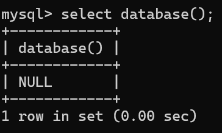
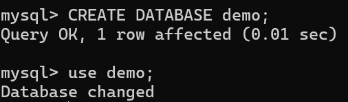
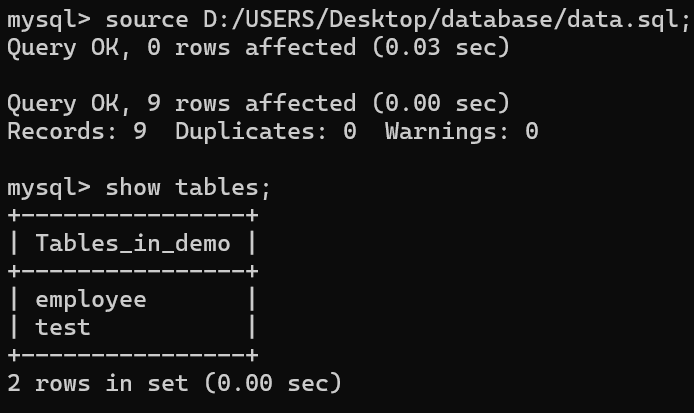
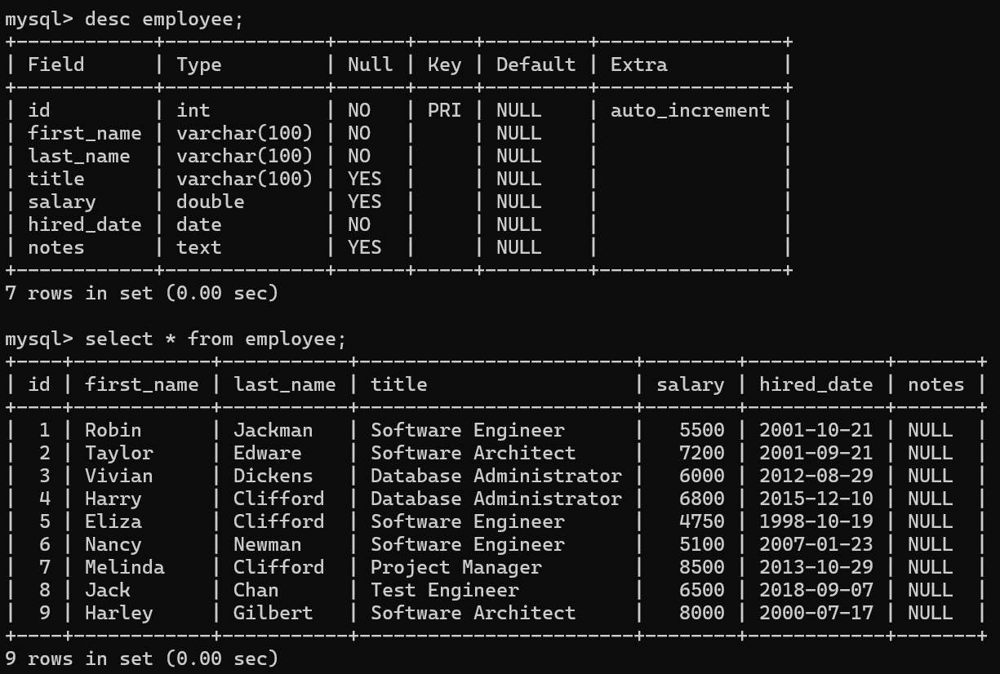
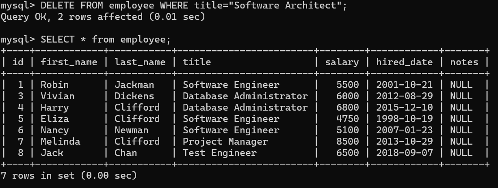

# 目錄
- [介紹SQL]
  - [什麼是資料庫](#什麼是資料庫)
  - [SQL 和 NOSQL](#SQL-和-NOSQL)
  - [為什麼選擇 MySQL](#為什麼選擇-MySQL)
  - [MySQL 版本的選擇](#MySQL-版本的選擇)
- [Database和Table](#Database-和-Table)
  - [本章介紹](#本章介紹)
  - [資料庫的基本操作](#資料庫的基本操作)  
  - [為什麼要輸入分號執行SQL](#為什麼要輸入分號執行-SQL) 
  - [SQL 大小寫的問題](#SQL-大小寫的問題)
  - [表的基本介紹](#表的基本介紹)
  - [資料類型的基本介紹](#資料類型的基本介紹)
  - [表的創建和基本操作](#表的創建和基本操作)  
  - [範例](#範例)   
- [Database Insert 資料插入](#Database-Insert-資料插入)
  - [本章介紹](#本章介紹)
  - [資料插入](#資料插入)  
  - [SELECT語句的基本用法](#SELECT-語句的基本用法) 
  - [NULL 和 NOT NULL](#NULL-和-NOT-NULL)
  - [設置默認值](#設置默認值)
  - [PRIMARY KEY 介紹](#PRIMARY-KEY-介紹)  
  - [UNIQUE 字段](#UNIQUE-字段)
  - [練習](#練習)
- [基本的增刪查改](#基本的增刪查改)
  - [本章介紹](#本章介紹)
  - [學習使用sql文件](#學習使用sql文件) 
  - [資料準備](#資料準備) 
  - [SELECT 語句](#SELECT-語句)
  - [WHERE 語句](#WHERE-語句)
  - [UPDATE 語句](#UPDATE-語句)
  - [DELETE 語句](#DELETE-語句)
  - [CRUD 練習](#CRUD-練習)
- [SQL 字符串相關處理方法](#SQL-字符串相關處理方法)
  - [本章介紹](#本章介紹)
  - [資料準備](#資料準備)
  - [字串拼接 CONCAT](#字串拼接-CONCAT)
  - [子字串 SUBSTRING](#子字串-SUBSTRING)
  - [REPLACE REVERSE CHARLENGTH](#REPLACE-REVERSE-CHARLENGTH)
  - [大小寫轉換](#大小寫轉換)
  - [字串處裡練習](#字串處裡練習)
- [SELECT 結果的進一步處理](#SELECT-結果的進一步處理)
  - [本章介紹](#本章介紹)
  - [資料準備](#資料準備)
  - [ORDER BY](#ORDER-BY)
  - [LIMIT](#LIMIT)
  - [LIKE](#LIKE)
  - [大小寫匹配問題](#大小寫匹配問題)
  - [練習](#練習)
- [資料的聚合處理](#資料的聚合處理)
  - [本章介紹](#本章介紹)
  - [資料準備](#資料準備)
  - [COUNT](#COUNT)
  - [DISTINCT](#DISCINCT)
  - [GROUP BY](#GROUP-BY)
  - [MAX MIN](#MAX-MIN)
  - [SUM AVG](#SUM-AVG)
  - [HAVING](#HAVING)
  - [練習](#練習)
　
# 介紹SQL

## 什麼是資料庫

**資料庫有已下的特徵:**

1. Collection of Data: 資料的收集器(集合)


> Find Nancy's phone number?

2. Methods for accessing and manipulating that data

> Database vs. DBMS(Database Management system)


DBMS: 對database存取的橋梁
Database: 存取資料的方式

透過DBMS可以訪問獲取資料，或對資料進行編輯刪除等操作

宏觀意義上的database: DBMS+Database

市面上有很多不同的DBMS，使用者可以透過這些DBMS去和Database做交互

## SQL 和 NOSQL

> SQL:(prounced"ess-que-el") stands for **Structured Query Language**. SQL is used to communicate with a database. According to ANSI(American National Standards Institue), it is the standard language for **relational database** management systems.

[資料來源](https://en.wikipedia.org/wiki/SQL)


## 為什麼選擇 MySQL

根據[資料庫網站](https://db-engines.com/en/ranking)排名


> 第一、第二是商業軟體都要收費，所以選擇MySQL

# Database和Table

## 本章介紹

- A **database** is just a bunch of **tables**
- Tables hold the **data** (a collection of related data held in a **structured format** within a database)

## 資料庫的基本操作

- 顯示當前有哪些databases

```sql
SHOW databases;
```


- 創建databases

```sql
CREATE DATABASE <name>;
```
> name可以是任意的數字和字母組成但不能有空格


- 刪除databases

```sql
DROP DATABASE <name>;
```


- databases切換

```sql
USE <database name>;
```


- 查看當前正再使用哪個database

```sql
SELECT database();
```


> 預設使用的database是null


## 為什麼要輸入分號執行SQL

> 在SQL裡面`;`代表語句的結束，若沒有輸入，SQL會不知道語句已經結束，會報錯

這個`;`是可以變的，改變可以通過下面語法:

```SQL
delimiter $$
```


## SQL 大小寫的問題

[stackOverfolw](https://stackoverflow.com/questions/292026/is-there-a-good-reason-to-use-upper-case-for-sql-keywords)

> 建議KEYWORDS大寫，並且每遇到關鍵字就換行，這並不強制，小血也可以執行

## 表的基本介紹

- A database is just a bunch of **tables**
- Tables hold the **data in a structured format**


每個table都有column、row

header: Name、Phone、Age
data: 剩餘的部分


## 資料類型的基本介紹


- Numeric Types
  - INT
  - SMALLINT
  - MEDIUMINT
  - BIGINT
  - DECIMAL
  - NUMERIC
  - FLOAT
  - DOUBLE
  - BIT
 - String Types
  - CHAR
  - VARCHAR
  - BINARY
  - VARNINARY
  - BLOB
  - TINYBLOB
  - MEDIUMBLOB
  - LONGLOB
  - TEXT
  - TINYTEXT
  - MEDIUMTEXT
  - LONGTEXT
  - ENUM
 - Data Types
  - DATE
  - DATETIME
  - TIMESTAMP
  - TIME
  - YEAR 

[官方網站](https://dev.mysql.com/doc/refman/8.4/en/data-types.html)
[w3s](https://www.w3schools.com/mysql/mysql_datatypes.asp)

## 表的創建和基本操作

### 創建table

```sql
CREATE TABLE table_name(
  column_name data_type,
  column_name data_type,
  ...
);
```

- 驗證是否建立成功

```SQL
DESC <table name>;
```

**範例**

```sql
CREATE TABLE person
(
  name VARCHAR(20),
  phone VARCHAR(20),
  age INT
);
```

- 驗證是否建立成功

```SQL
DESC person;
```


### 基本操作

- 顯示當前database底下所有的table

```sql
SHOW TABLES;
```


- 展示此table的columns和每個columns的資訊

```sql
SHOW COLUMNS FROM <table_name>;
```


- 顯示當前table的資訊

```sql
DESC <table name>;
```


- 刪除table

```sql
DROP TABLE <table name>;
```


## 範例

- Please create a table for employees in a comapny
- Data include: employee number, birth of date, first name, last name, gender,hired data.


```sql
CREATE TABLE employee(
  eid INT,
  birth_date DATE,
  first_name VARCHAR(20),
  last_name VARCHAR(20),
  gender EMUM('M','F'),
  hired_date DATE
);
```

> [ENUM](https://dev.mysql.com/doc/refman/8.4/en/enum.html): 枚舉

> [DATE](https://dev.mysql.com/doc/refman/8.4/en/datetime.html): 2025-11-12


# Database Insert 資料插入

## 本章介紹

1. How to insert one/many data into MySQL Table?
2. How to check inserted data?
3. How to create table with advanced requirements for columns?

## 資料插入

**一條插入**

```sql
INSERT INTO <table_name>(
  column1_name,
  column2_name,
  ...
)
VALUES(
  column1_value,
  column2_value,
  ...
);
```
> columnName一定的順序要對應到columnValue的順序

```sql
INSERT INTO person(
  name,
  phone,
  age
)
VALUES(
  "Joan Hu",
  "+886 987654321",
  26
);
```


**多條插入**

```sql
INSERT INTO <table_name>(
  column1_name,
  column2_name,
  ...
)
VALUES(
  row1_column1_value,
  row1_column2_value,
  ...
),(
  row2_column1_value,
  row2_column2_value,
  ...
),(
  row3_column1_value,
  row3_column2_value,
  ...
)...;
```
> columnName一定的順序要對應到columnValue的順序

```sql
INSERT INTO person(
  name,
  phone,
  age
)
VALUES(
  "Joan Hu",
  "+886 987654321",
  26
),(
  "John Min",
  "+886 984567890",
  30
),(
  "Ken Lin",
  "+886 973648237",
  40
);
```


## SELECT語句的基本用法

- 把table裡面所有資料，以表格的資料打印出來

```sql
SELECT * from table_name;
```


- 把指定COLUMN的資料以表格的形式打印出來

```sql
SELECT column_name from table_name;
```


## NULL 和 NOT NULL

Field: 資料HEADER
Type: 每一column是什麼樣的資料類型
Null: 此COLUMN資料是否能夠不填
Default: 不填時會產生的值


- 如何產生`NOT NULL`

```SQL
CREATE TABLE <table_name>(
  column1_name data_type NOT NULL,
  column2_name data_type,
  column3_name data_type
);
```

```SQL
CREATE TABLE person2(
  name VARCHAR(20) NOT NULL,
  phone VARCHAR(20),
  age INT
);
```


## 設置默認值

```sql
CREATE TABLE <table_name>(
  column1_name data_type DEFAULT "DEFAULT_VALUE",
  column2_name data_type,
  ...
);
```
```sql
CREATE TABLE person3 (
  name VARCHAR(20) DEFAULT "no name",
  phone VARCHAR(20),
  age INT
);
```


## PRIMARY KEY 介紹

> 想要某一欄位是獨一讀二，不允許重複，可以使用KEY

```sql
CREATE TABLE <table_name>(
  column1_name data_type,
  column2_name data_type,
  ...,
  PRIMARY_KEY (column1_name)
);
```
```sql
CREATE TABLE person4 (
  name VARCHAR(20),
  phone VARCHAR(20),
  age INT,
  PRIMARY_KEY (phone)
);
```


> 讓key以數字的方式自動增加

```sql
CREATE TABLE <table_name>(
  column1_name INT AUTO_INCREMENT,
  column2_name data_type,
  column3_name data_type,
  ...,
  PRIMARY_KEY (column1_name)
);
```
```sql
CREATE TABLE person5 (
  id INT AUTO_INCREMENT,
  name VARCHAR(20),
  phone VARCHAR(20),
  age INT,
  PRIMARY_KEY (id)
);
```


## UNIQUE 字段

```sql
CREATE TABLE <table_name>(
  column1_value data_type PRIMARY KEY,
  column2_value data_type UNIQUE
);
```

```sql
CREATE TABLE table_test(
  a INT PRIMARY KEY,
  b VARCAHR(10) UNIQUE
);
```


> UNIQUE若是null則可以重複，Primary key不能為空，也不能重複

- primary key可以有很多個

> 錯誤設定方式

```sql
CREATE TABLE <table_name>(
  column1_value data_type PRIMARY KEY,
  column2_value data_type PRIMARY KEY,
  column3_value data_type,
);
```

```sql
CREATE TABLE test_table2(
  a INT PRIMARY KEY,
  b INT PRIMARY KEY,
  c INT
);
```


> 正確方式
```sql
CREATE TABLE <table_name>(
  column1_value data_type,
  column2_value data_type,
  column3_value data_type,
  PRIMARY KEY(column1_value,column2_value);
);
```

```sql
CREATE TABLE test_table2(
  a INT,
  b INT,
  c INT,
  PRIMARY KEY(a,b);
);
```


**Primary key vs. UNIQUE**

| 條件 | 	NULL 是否可存在|可否有多個在同一張表|是否可以用多欄位|
|------|----------------|------------------|---------------|
|Primary Key（主鍵）|不可以（必須 NOT NULL）|不可以（每個表只能有一個 Primary Key）|可以（複合主鍵）|
|UNIQUE（唯一約束）|可以（但只能有一筆是 NULL，依資料庫而異）|可以（一個表可以有多個 UNIQUE 約束）|可以（複合 UNIQUE 約束）|

## 練習


```sql
CREATE TABLE employee (
  eid INT AUTO_INCREMENT,
  birth_date DATE NOT NULL,
  first_name VARCHAR(20) NOT NULL,
  last_name VARCHAR(20) NOT NULL,
  gender ENUM('M','F') NOT NULL,
  hired_date DATE NOT NULL DEFAULT "2000-01-01"
);
```


# 基本的增刪查改

## 本章介紹

- CRED
 - C: Create 增加
 - R: Read  讀取
 - U: Update 更新
 - D: Delete 刪除

## 學習使用sql文件

- 步驟:
 - step1: 先用指令`CREATE DATABASE <DATABASE_NAME>`創建database，並用指令`USE <DATABASE_NAME>`切換database
 - step2: 創建一個`.sql`檔案，並且在裡面寫下創建table的指令
 - step3: 複製此檔案的絕對路徑到MYSQL的Command裡面
 - step4: 輸入`source <url>;`執行sql檔案，執行完候用`DESC <TABLE_NAME>`或`SELECT * FROM <TABLE_NAME>`等指令，確認是否創建正確




```SQL
CREATE TABLE test(
  id INT NOT NULL AUTO_INCREMENT,
  first_name VARCHAR(20) NOT NULL,
  last_name VARCHAR(20) NOT NULL,
  PRIMARY KEY (id)
);

INSERT INTO test (first_name, last_name) VALUES
('Robin','Jackman'),
('Taylor','Edward'),
('Vivian','Dickens'),
('Harry','Clifford'),
('Elize','Clifford'),
('Nancy','Newman'),
('Melinda','Clifford');
```

## 資料準備

```sql
CREATE TABLE employee(
  id INT NOT NULL AUTO_INCREMENT,
  first_name VARCHAR(100) NOT NULL,
  last_name VARCHAR(100) NOT NULL,
  title VARCHAR(100) DEFAULT NULL,
  salary DOUBLE DEFAULT NULL,
  hired_date DATE NOT NULL,
  notes TEXT,
  PRIMARY KEY (id)
);

INSERT INTO employee (first_name, last_name, title, salary, hired_date) VALUES
('Robin','Jackman','Software Engineer', 5500, '2001-10-21'),
('Taylor','Edware','Software Architect', 7200, '2001-09-21'),
('Vivian','Dickens','Database Administrator', 6000, '2012-08-29'),
('Harry','Clifford','Database Administrator', 6800, '2015-12-10'),
('Eliza','Clifford','Software Engineer', 4750, '1998-10-19'),
('Nancy','Newman','Software Engineer', 5100, '2007-01-23'),
('Melinda','Clifford','Project Manager', 8500, '2013-10-29'),
('Jack','Chan','Test Engineer', 6500, '2018-09-07'),
('Harley','Gilbert','Software Architect', 8000, '2000-07-17');
```



## SELECT 語句

- table裡的全部資料

```sql
SELECT * FROM <TABLE_NAME>;
```

```sql
select * from employee;
```


- 指定column

```sql
SELECT column1_name,column2_name FROM <TABLE_NAME>;
```

```sql
select first_name ,salary from employee;
```


- column如果太長，可以另外取名

```sql
SELECT colum1_name as colN, column2_name as col2N FROM <TABLE_NAME>;
```

```sql
select first_name as fname,last_name as lname from employee;
```


## WHERE 語句

> 可增加搜尋條件

```sql
SELECT * from employee WHERE condition;
```

```sql
SELECT * from employee WHERE title="Database Administrator";
```


> 多個條件可以用`and`，`or`來做連接

**and**

```sql
SELECT * from employee WHERE condition1 and condition2;
```

```sql
SELECT * from employee WHERE title="Database Administrator" and salary=6000;
```


**or**

```sql
SELECT * from employee WHERE condition1 or condition2;
```

```sql
SELECT * from employee WHERE title="Software Architect" or salary=6000;
```


> 可以使用`NOT`

**NOT**

```sql
SELECT * from employee WHERE NOT condition1 or condition2;
```

```sql
SELECT * from employee WHERE NOT title="Software Architect";
```


## UPDATE 語句

```SQL
UPDATE <TABLE_NAME> SET column_name = value where condition ;
```

```SQL
UPDATE employee set salary=10000 where title="Software Architect";
```


> 同時改多個值

```sql
UPDATE <TABLE_NAME> SET column1_name = value, column2_name = value where condition ;
```
```SQL
UPDATE employee set salary=20000,notes="update" where title="Software Architect";
```


## DELETE 語句

```sql
DELETE FROM <TABLE_NAME> WHERE condition;
```
```sql
DELETE FROM employee WHERE title="Software Architect";
```


- 刪除整個table裡面的資料

```sql
DELETE FROM <TABLE_NAME>;
```

```sql
DELETE FROM employee;
```


> 在CREATE TABLE時可以加判斷，當此TABLE沒成立時才創建

```SQL
CREATE TABLE IF NOT EXISTS <table_name>(
  column1_name data type,
  column2_name data type,
  ...,
)
```

```SQL
CREATE TABLE IF NOT EXISTS employee(
  id INT NOT NULL AUTO_INCREMENT,
  first_name VARCHAR(100) NOT NULL,
  last_name VARCHAR(100) NOT NULL,
  title VARCHAR(100) DEFAULT NULL,
  salary DOUBLE DEFAULT NULL,
  hired_date DATE NOT NULL,
  notes TEXT,
  PRIMARY KEY (id)
);
```


## CRUD 練習

```sql
CREATE TABLE IF NOT EXISTS movie(
    id INT NOT NULL AUTO_INCREMENT PRIMARY KEY,
    title VARCHAR(100) NOT NULL,
    title_year INT NOT NULL,
    director_name VARCHAR(50) NOT NULL,
    actor_1_name VARCHAR(50) NOT NULL,
    actor_2_name VARCHAR(50) NOT NULL,
    duration INT NOT NULL,
    country VARCHAR(50) NOT NULL,
    content_rating VARCHAR(10) NOT NULL,
    gross BIGINT NOT NULL,
    imdb_score FLOAT DEFAULT 0
);

INSERT INTO movie(title, title_year, director_name, actor_1_name, actor_2_name, duration, country, content_rating, gross, imdb_score) VALUES
("Avatar", 2009, "James Cameron", "CCH Pounder", "Joel David Moore", 178, "USA", "PG-13", 760505847, 7.9),
("Pirates of the Caribbean: At World's End", 2007, "Gore Verbinski", "Johnny Depp", "Orlando Bloom", 169, "USA", "PG-13", 309404152, 7.1),
("Spectre", 2015, "Sam Mendes", "Christoph Waltz", "Rory Kinnear", 148, "UK", "PG-13", 200074175, 6.8),
("The Dark Knight Rises", 2012, "Christopher Nolan", "Tom Hardy", "Christian Bale", 164, "USA", "PG-13", 448130642, 8.5),
("John Carter", 2012, "Andrew Stanton", "Daryl Sabara", "Samantha Morton", 132, "USA", "PG-13", 73058679, 6.6),
("Spider-Man 3", 2007, "Sam Raimi", "J.K. Simmons", "James Franco", 156, "USA", "PG-13", 336530303, 6.2),
("Tangled", 2010, "Nathan Greno", "Brad Garrett", "Donna Murphy", 100, "USA", "PG", 200807262, 7.8),
("Avengers: Age of Ultron", 2015, "Joss Whedon", "Chris Hemsworth", "Robert Downey Jr.", 141, "USA", "PG-13", 458991599, 7.5),
("Harry Potter and the Half-Blood Prince", 2009, "David Yates", "Alan Rickman", "Daniel Radcliffe", 153, "UK", "PG", 301956980, 7.5),
("Batman v Superman: Dawn of Justice", 2016, "Zack Snyder", "Henry Cavill", "Lauren Cohan", 183, "USA", "PG-13", 330249062, 6.9),
("Superman Returns", 2006, "Bryan Singer", "Kevin Spacey", "Marlon Brando", 169, "USA", "PG-13", 200069408, 6.1),
("Quantum of Solace", 2008, "Marc Forster", "Giancarlo Giannini", "Mathieu Amalric", 106, "UK", "PG-13", 168368427, 6.7),
("Pirates of the Caribbean: Dead Man's Chest", 2006, "Gore Verbinski", "Johnny Depp", "Orlando Bloom", 151, "USA", "PG-13", 423032628, 7.3),
("The Lone Ranger", 2013, "Gore Verbinski", "Johnny Depp", "Ruth Wilson", 150, "USA", "PG-13", 89289910, 6.5),
("Man of Steel", 2013, "Zack Snyder", "Henry Cavill", "Christopher Meloni", 143, "USA", "PG-13", 291021565, 7.2),
("The Chronicles of Narnia: Prince Caspian", 2008, "Andrew Adamson", "Peter Dinklage", "Pierfrancesco Favino", 150, "USA", "PG", 141614023, 6.6),
("The Avengers", 2012, "Joss Whedon", "Chris Hemsworth", "Robert Downey Jr.", 173, "USA", "PG-13", 623279547, 8.1),
("Pirates of the Caribbean: On Stranger Tides", 2011, "Rob Marshall", "Johnny Depp", "Sam Claflin", 136, "USA", "PG-13", 241063875, 6.7),
("Men in Black 3", 2012, "Barry Sonnenfeld", "Will Smith", "Michael Stuhlbarg", 106, "USA", "PG-13", 179020854, 6.8),
("The Hobbit: The Battle of the Five Armies", 2014, "Peter Jackson", "Aidan Turner", "Adam Brown", 164, "New Zealand", "PG-13", 255108370, 7.5),
("The Amazing Spider-Man", 2012, "Marc Webb", "Emma Stone", "Andrew Garfield", 153, "USA", "PG-13", 262030663, 7),
("Robin Hood", 2010, "Ridley Scott", "Mark Addy", "William Hurt", 156, "USA", "PG-13", 105219735, 6.7),
("The Hobbit: The Desolation of Smaug", 2013, "Peter Jackson", "Aidan Turner", "Adam Brown", 186, "USA", "PG-13", 258355354, 7.9),
("The Golden Compass", 2007, "Chris Weitz", "Christopher Lee", "Eva Green", 113, "USA", "PG-13", 70083519, 6.1),
("King Kong", 2005, "Peter Jackson", "Naomi Watts", "Thomas Kretschmann", 201, "New Zealand", "PG-13", 218051260, 7.2),
("Titanic", 1997, "James Cameron", "Leonardo DiCaprio", "Kate Winslet", 194, "USA", "PG-13", 658672302, 7.7),
("Captain America: Civil War", 2016, "Anthony Russo", "Robert Downey Jr.", "Scarlett Johansson", 147, "USA", "PG-13", 407197282, 8.2),
("Battleship", 2012, "Peter Berg", "Liam Neeson", "Alexander Skarsgård", 131, "USA", "PG-13", 65173160, 5.9),
("Jurassic World", 2015, "Colin Trevorrow", "Bryce Dallas Howard", "Judy Greer", 124, "USA", "PG-13", 652177271, 7),
("Skyfall", 2012, "Sam Mendes", "Albert Finney", "Helen McCrory", 143, "UK", "PG-13", 304360277, 7.8),
("Spider-Man 2", 2004, "Sam Raimi", "J.K. Simmons", "James Franco", 135, "USA", "PG-13", 373377893, 7.3),
("Iron Man 3", 2013, "Shane Black", "Robert Downey Jr.", "Jon Favreau", 195, "USA", "PG-13", 408992272, 7.2),
("Alice in Wonderland", 2010, "Tim Burton", "Johnny Depp", "Alan Rickman", 108, "USA", "PG", 334185206, 6.5),
("X-Men: The Last Stand", 2006, "Brett Ratner", "Hugh Jackman", "Kelsey Grammer", 104, "Canada", "PG-13", 234360014, 6.8),
("Monsters University", 2013, "Dan Scanlon", "Steve Buscemi", "Tyler Labine", 104, "USA", "G", 268488329, 7.3),
("Transformers: Revenge of the Fallen", 2009, "Michael Bay", "Glenn Morshower", "Kevin Dunn", 150, "USA", "PG-13", 402076689, 6),
("Transformers: Age of Extinction", 2014, "Michael Bay", "Bingbing Li", "Sophia Myles", 165, "USA", "PG-13", 245428137, 5.7),
("Oz the Great and Powerful", 2013, "Sam Raimi", "Tim Holmes", "Mila Kunis", 130, "USA", "PG", 234903076, 6.4),
("The Amazing Spider-Man 2", 2014, "Marc Webb", "Emma Stone", "Andrew Garfield", 142, "USA", "PG-13", 202853933, 6.7),
("TRON: Legacy", 2010, "Joseph Kosinski", "Jeff Bridges", "Olivia Wilde", 125, "USA", "PG", 172051787, 6.8),
("Cars 2", 2011, "John Lasseter", "Joe Mantegna", "Thomas Kretschmann", 106, "USA", "G", 191450875, 6.3),
("Green Lantern", 2011, "Martin Campbell", "Ryan Reynolds", "Temuera Morrison", 123, "USA", "PG-13", 116593191, 5.6),
("Toy Story 3", 2010, "Lee Unkrich", "Tom Hanks", "John Ratzenberger", 103, "USA", "G", 414984497, 8.3),
("Terminator Salvation", 2009, "McG", "Christian Bale", "Bryce Dallas Howard", 118, "USA", "PG-13", 125320003, 6.6),
("Furious 7", 2015, "James Wan", "Jason Statham", "Paul Walker", 140, "USA", "PG-13", 350034110, 7.2),
("World War Z", 2013, "Marc Forster", "Peter Capaldi", "Brad Pitt", 123, "USA", "PG-13", 202351611, 7),
("X-Men: Days of Future Past", 2014, "Bryan Singer", "Jennifer Lawrence", "Peter Dinklage", 149, "USA", "PG-13", 233914986, 8),
("Star Trek Into Darkness", 2013, "J.J. Abrams", "Benedict Cumberbatch", "Bruce Greenwood", 132, "USA", "PG-13", 228756232, 7.8),
("Jack the Giant Slayer", 2013, "Bryan Singer", "Eddie Marsan", "Ewen Bremner", 114, "USA", "PG-13", 65171860, 6.3),
("The Great Gatsby", 2013, "Baz Luhrmann", "Leonardo DiCaprio", "Elizabeth Debicki", 143, "Australia", "PG-13", 144812796, 7.3),
("Prince of Persia: The Sands of Time", 2010, "Mike Newell", "Jake Gyllenhaal", "Richard Coyle", 116, "USA", "PG-13", 90755643, 6.6),
("Pacific Rim", 2013, "Guillermo del Toro", "Charlie Hunnam", "Clifton Collins Jr.", 131, "USA", "PG-13", 101785482, 7),
("Transformers: Dark of the Moon", 2011, "Michael Bay", "Glenn Morshower", "Lester Speight", 154, "USA", "PG-13", 352358779, 6.3),
("Indiana Jones and the Kingdom of the Crystal Skull", 2008, "Steven Spielberg", "Harrison Ford", "Ray Winstone", 122, "USA", "PG-13", 317011114, 6.2),
("The Good Dinosaur", 2015, "Peter Sohn", "A.J. Buckley", "Jack McGraw", 93, "USA", "PG", 123070338, 6.8),
("Brave", 2012, "Mark Andrews", "Kelly Macdonald", "John Ratzenberger", 93, "USA", "PG", 237282182, 7.2),
("Star Trek Beyond", 2016, "Justin Lin", "Sofia Boutella", "Melissa Roxburgh", 122, "USA", "PG-13", 130468626, 7.5),
("WALL·E", 2008, "Andrew Stanton", "John Ratzenberger", "Fred Willard", 98, "USA", "G", 223806889, 8.4),
("Rush Hour 3", 2007, "Brett Ratner", "Tzi Ma", "Dana Ivey", 91, "USA", "PG-13", 140080850, 6.2),
("2012", 2009, "Roland Emmerich", "Oliver Platt", "Liam James", 158, "USA", "PG-13", 166112167, 5.8),
("A Christmas Carol", 2009, "Robert Zemeckis", "Robin Wright", "Colin Firth", 96, "USA", "PG", 137850096, 6.8),
("Jupiter Ascending", 2015, "Lana Wachowski", "Channing Tatum", "Mila Kunis", 127, "USA", "PG-13", 47375327, 5.4),
("The Legend of Tarzan", 2016, "David Yates", "Christoph Waltz", "Alexander Skarsgård", 110, "USA", "PG-13", 124051759, 6.6),
("The Chronicles of Narnia: The Lion, the Witch and the Wardrobe", 2005, "Andrew Adamson", "Jim Broadbent", "Kiran Shah", 150, "USA", "PG", 291709845, 6.9),
("X-Men: Apocalypse", 2016, "Bryan Singer", "Jennifer Lawrence", "Michael Fassbender", 144, "USA", "PG-13", 154985087, 7.3),
("The Dark Knight", 2008, "Christopher Nolan", "Christian Bale", "Heath Ledger", 152, "USA", "PG-13", 533316061, 9),
("Up", 2009, "Pete Docter", "John Ratzenberger", "Delroy Lindo", 96, "USA", "PG", 292979556, 8.3),
("Monsters vs. Aliens", 2009, "Rob Letterman", "Amy Poehler", "Rainn Wilson", 94, "USA", "PG", 198332128, 6.5),
("Iron Man", 2008, "Jon Favreau", "Robert Downey Jr.", "Jeff Bridges", 126, "USA", "PG-13", 318298180, 7.9),
("Hugo", 2011, "Martin Scorsese", "Chloe Grace Moretz", "Christopher Lee", 126, "USA", "PG", 73820094, 7.5),
("Wild Wild West", 1999, "Barry Sonnenfeld", "Will Smith", "Salma Hayek", 106, "USA", "PG-13", 113745408, 4.8),
("The Mummy: Tomb of the Dragon Emperor", 2008, "Rob Cohen", "Jet Li", "Brendan Fraser", 112, "USA", "PG-13", 102176165, 5.2),
("Suicide Squad", 2016, "David Ayer", "Will Smith", "Robin Atkin Downes", 123, "USA", "PG-13", 161087183, 6.9),
("Evan Almighty", 2007, "Tom Shadyac", "Jimmy Bennett", "Morgan Freeman", 96, "USA", "PG", 100289690, 5.4),
("Edge of Tomorrow", 2014, "Doug Liman", "Tom Cruise", "Lara Pulver", 113, "USA", "PG-13", 100189501, 7.9),
("Waterworld", 1995, "Kevin Reynolds", "Jeanne Tripplehorn", "Rick Aviles", 176, "USA", "PG-13", 88246220, 6.1),
("G.I. Joe: The Rise of Cobra", 2009, "Stephen Sommers", "Joseph Gordon-Levitt", "Dennis Quaid", 118, "USA", "PG-13", 150167630, 5.8),
("Inside Out", 2015, "Pete Docter", "Amy Poehler", "Mindy Kaling", 95, "USA", "PG", 356454367, 8.3),
("The Jungle Book", 2016, "Jon Favreau", "Scarlett Johansson", "Bill Murray", 106, "UK", "PG", 362645141, 7.8),
("Iron Man 2", 2010, "Jon Favreau", "Robert Downey Jr.", "Scarlett Johansson", 124, "USA", "PG-13", 312057433, 7),
("Snow White and the Huntsman", 2012, "Rupert Sanders", "Chris Hemsworth", "Kristen Stewart", 132, "USA", "PG-13", 155111815, 6.1),
("Maleficent", 2014, "Robert Stromberg", "Angelina Jolie Pitt", "Sharlto Copley", 97, "USA", "PG", 241407328, 7),
("Dawn of the Planet of the Apes", 2014, "Matt Reeves", "Gary Oldman", "Judy Greer", 130, "USA", "PG-13", 208543795, 7.6),
("47 Ronin", 2013, "Carl Rinsch", "Keanu Reeves", "Cary-Hiroyuki Tagawa", 128, "USA", "PG-13", 38297305, 6.3),
("Captain America: The Winter Soldier", 2014, "Anthony Russo", "Scarlett Johansson", "Chris Evans", 136, "USA", "PG-13", 259746958, 7.8),
("Shrek Forever After", 2010, "Mike Mitchell", "Jon Hamm", "Kathy Griffin", 93, "USA", "PG", 238371987, 6.4),
("Tomorrowland", 2015, "Brad Bird", "Judy Greer", "Chris Bauer", 130, "USA", "PG", 93417865, 6.5),
("Inception", 2010, "Christopher Nolan", "Leonardo DiCaprio", "Tom Hardy", 148, "USA", "PG-13", 292568851, 8.8),
("Big Hero 6", 2014, "Don Hall", "Damon Wayans Jr.", "Daniel Henney", 102, "USA", "PG", 222487711, 7.9),
("Wreck-It Ralph", 2012, "Rich Moore", "Jack McBrayer", "Sarah Silverman", 101, "USA", "PG", 189412677, 7.8),
("The Polar Express", 2004, "Robert Zemeckis", "Tom Hanks", "Eddie Deezen", 100, "USA", "G", 665426, 6.6),
("Independence Day: Resurgence", 2016, "Roland Emmerich", "Vivica A. Fox", "Sela Ward", 120, "USA", "PG-13", 102315545, 5.5),
("How to Train Your Dragon", 2010, "Dean DeBlois", "Gerard Butler", "America Ferrera", 98, "USA", "PG", 217387997, 8.2),
("Terminator 3: Rise of the Machines", 2003, "Jonathan Mostow", "Nick Stahl", "M.C. Gainey", 109, "USA", "R", 150350192, 6.4),
("Guardians of the Galaxy", 2014, "James Gunn", "Bradley Cooper", "Vin Diesel", 121, "USA", "PG-13", 333130696, 8.1),
("Interstellar", 2014, "Christopher Nolan", "Matthew McConaughey", "Anne Hathaway", 169, "USA", "PG-13", 187991439, 8.6),
("Australia", 2008, "Baz Luhrmann", "Essie Davis", "Bryan Brown", 165, "Australia", "PG-13", 49551662, 6.6),
("Warcraft", 2016, "Duncan Jones", "Dominic Cooper", "Callum Rennie", 123, "USA", "PG-13", 46978995, 7.3),
("X-Men: First Class", 2011, "Matthew Vaughn", "Jennifer Lawrence", "Michael Fassbender", 132, "USA", "PG-13", 146405371, 7.8),
("The Hobbit: An Unexpected Journey", 2012, "Peter Jackson", "Aidan Turner", "Adam Brown", 182, "USA", "PG-13", 303001229, 7.9);
```

1. print out a table only have three columns (title,director_name,imdb_score)

```sql
SELECT title,director_name,imdb_score FROM movie;
```


2. filter out all movies in 2012 and contect_rating is PG-13

```sql
SELECT * FROM movie WHERE title_year=2012 AND content_rating="PG-13";
```


3. filter out all not USA movie

```sql
SELECT * FROM movie WHERE NOT country="USA";
```


4. filter out Peter Jackson's or Christopher Nolan's movie

```sql
SELECT * FROM movie WHERE director_name="Peter Jackson" OR director_name="Christopher Nolan";
```


5. update all Christopher Nolan's movie's IMDB score to 9

```sql
UPDATE movie SET imdb_score=9 WHERE director_name="Christopher Nolan";
```


6. delete all movies which IMDB score is less than 6

```sql
DELETE FROM movie WHERE imdb_score<6;
```


7. delete all movies in 2016

```sql
DELETE FROM movie WHERE title_year=2006;
```


# SQL 字符串相關處理方法

## 本章介紹

- 字串"拼接"
- 字串"剪輯"
- 字串"反轉"
- 字串"長度"
- 字串"大小寫"

## 資料準備


## 字串拼接 CONCAT

```sql
select first_name, last_name from employee;
```
> 這樣會打印出兩個column，那如果我想直接拿到全名該怎麼做?

- The MYSQL CONCAT function takes one or more string arguments and concatenates them into a single string. The CONCAT function requires a minimum of one parameter otherwise it raises an error

- CONCAT("A","B") = "AB"

```SQL
SELECT CONCAT("A","B");
```


```SQL
SELECT CONCAT(first_name, last_name) from employee;
```


> 讓他更美觀一點

```SQL
SELECT CONCAT(first_name, "," ,last_name) as FullName from employee;
```


**範例**

```SQL
SELECT CONCAT(first_name, "," ,last_name," is a ",title) as Sentence from employee;
```


**CONCAT_WS:第一個參數可以放要分割的東西，後面參數則是放合併的參數**

```SQL
SELECT CONCAT_WS(",",first_name,last_name) as FullName from employee;
```


```SQL
SELECT CONCAT_WS(",",first_name,last_name,title) as FullName from employee;
```


## 子字串 SUBSTRING

> 取index為0~3的字母

```SQL
SELECT SUBSTRING("Hello World",1,4);
```


> 取index從7開始到結束的字母

```SQL
SELECT SUBSTRING("Hello World",7);
```


> 從後面數來的3個字母到最後

```SQL
SELECT SUBSTRING("Hello World",-3);
```


**範例**

```sql
SELECT SUBSTRING(title,1,5) from employee;
```


> `SUBSTRING`可以簡寫成`SUBSTR`

```sql
SELECT SUBSTR(title,1,5) from employee;
```


```sql
SELECT CONCAT_WS(" ",first_name,last_name,"was hired on",SUBSTR(hire_date,1,4)) as information from employee;
```


## REPLACE REVERSE CHARLENGTH

> 替代指定的字串

```sql
SELECT REPLACE("Hello World", "World","MySQL");
```


> 反轉字串

```SQL
SELECT REVERSE("Hello World");
```


> 顯示字串長度

```SQL
SELECT CHAR_LENGTH("Hello World");
```


**範例**

```sql
SELECT REPLACE(title, "Software","Hardware") from employee;
```


## 大小寫轉換

> 轉換成大寫

```sql
SELECT UPPER("Hello MySQL");
```


```sql
SELECT LOWER("Hello MySQL");
```


**範例**

```sql
SELECT UPPER(first_name) as first_name, UPPER(last_name) as last_name from employee;
```


## 字串處裡練習

1. 複習

```sql
SELECT REPLACE(CONCAT("H"," ","E"," ","L"," ","L"," ","O")," ","-") AS Title;
```

| Title|
|------|
|H-E-L-L-O|


2. CONCAT練習

```SQL
SELECT CONCAT(director_name,"->",imdb_score) as "director_name->imdb_score" from movie;
```
```SQL
SELECT CONCAT_WS("->",director_name,imdb_score) as "director_name->imdb_score" from movie;
```


3. REVERSE練習

```SQL
SELECT country,REVERSE(country) as "yrtnuoc" from movie;
```


4. CONCAT練習

```SQL
SELECT CONCAT_WS(" ",title,"was released in",title_year) as "title" from movie;
```


5. CHAR_LENGTH練習

```SQL
SELECT title, CHAR_LENGTH(title) as character_count from movie;
```


5. CONCAT和SUBSTR練習

```SQL
SELECT CONCAT(SUBSTR(title,1,8),"...")as short_title, director_name from movie;
```


# SELECT 結果的進一步處理

## 本章介紹

1. 如何對SELECT返回的資料按某種規則進行排序?
2. 如何限制SELECT返回資料的數量?
3. 如何進行SELECT結果的模糊搜索?

## 資料準備


## ORDER BY

```sql
SELECT * from employee ORDER BY salary;
```


> 默認排序順序是從低到高

**降序**
```sql
SELECT * from employee ORDER BY salary DESC;
```


> 除了一般的數字外，DATA和STRING也可以排序
```sql
SELECT * from employee ORDER BY title;
```


```sql
SELECT * from employee ORDER BY hired_date;
```


> 若有指定column可以簡寫成數字排序

- 照salary排序

```sql
SELECT first_name, last_name, salary from employee ORDER BY 3;
```


- 照last_name排序

```sql
SELECT first_name, last_name, salary from employee ORDER BY 2;
```


> 也可以照沒有指定的欄位排序

```sql
SELECT first_name, last_name, salary from employee ORDER BY id;
```


> 也可以選擇兩個column進行排序

- 先按照`last_name`進行排序，若有相同的`last_name`再按照`first_name`做排序

```sql
SELECT first_name, last_name, salary from employee ORDER BY 2,1;
```


## LIMIT

> 返回前五條記錄

```sql
SELECT * FROM employee limit 5;
```


```sql
SELECT * FROM employee ORDER BY salary limit 3;
```


```sql
SELECT * FROM employee ORDER BY salary DESC limit 3;
```


> 可以指定範圍

- 從index為2開始數四個(2~5) 

```sql
SELECT * FROM employee ORDER BY salary DESC limit  2,4;
```


- 若不想要指定結束，要怎麼做?可以在後面放很大的數字

[官網](https://dev.mysql.com/doc/refman/8.4/en/select.html)

```SQL
SELECT * FROM tbl LIMIT 95,18446744073709551615;
```

## LIKE

> 模糊搜尋，`%`代表任意字符

- 搜尋`last_name`是以`C`開頭的

```SQL
SELECT * FROM employee where last_name like "C%";
```


- 搜尋`last_name`是以`Cl`開頭的

```SQL
SELECT * FROM employee where last_name like "Cl%";
```


- 搜尋`last_name`包含`i`的資料

```SQL
SELECT * FROM employee where last_name like "%i%";
```


- 搜尋`last_name`以`n`結尾的資料

```SQL
SELECT * FROM employee where last_name like "%n";
```


> 若知道長度，那可以用`-`做篩選

- 搜尋`last_name`為四個字，以`an`結尾

```sql
SELECT * FROM employee where last_name like "__an";
```


- 搜尋`last_name`為四個字

```sql
SELECT * FROM employee where last_name like "____";
```


> 若原本的字串裡面存在`%`和`_`時該怎麼辦?

```sql
INSERT INTO employee(first_name, last_name, title, salary, hired_date) VALUES("a%bb","c_dd","Test",10000,"2018-10-10");
```


> 此時可以用`\`做轉譯

```sql
SELECT * FROM employee where first_name like "%\%%";
```


```sql
SELECT * FROM employee where last_name like "%\_%";
```


## 大小寫匹配問題

> 不論大寫或小寫都可以被匹配到

```sql
SELECT * FROM employee where first_name="robin";
```

```sql
SELECT * FROM employee where first_name="Robin";
```


## 練習

1. 找出所有電影名字含有`dark`的影片，打印出片名，導演、上映時間

```sql
SELECT title,director_name,title_year from movie where title like "%dark%";
```


2. 找出票房最高的十部影片，打印出片名、上映時間、導演、票房、主演1和2

```sql
SELECT title,title_year,director_name,gross,actor_1_name,actor_2_name from movie ORDER BY gross DESC LIMIT 10;
```


3. 找到`Peter Jackson票房最高`的電影，打印出片名，上映時間，票房，IMDB評分

```sql
SELECT title,title_year,gross,imdb_score from movie WHERE director_name="Peter Jackson" ORDER BY gross DESC LIMIT 1;
```


4. 對片名按照字母順序排序，打印出片名、上映時間、導演

```sql
SELECT title,title_year,director_name from movie ORDER BY title;
```


5. 找到Christopher Nolan所有影片中IMDB評分最高的電影，打印出片名，上映時間，IMDB評分

```sql
SELECT title,title_year,imdb_score from movie WHERE director_name="Christopher Nolan" ORDER BY imdb_score DESC LIMIT 1;
```


# 資料的聚合處理

## 本章介紹

- Group and aggregation 


## 資料準備

> 使用movie和employee的資料

## COUNT

> 可對篩選的結果做統計

```sql
select count(*) from employee;
```


```sql
select count(*) from employee WHERE title="Software Engineer";
```


## DISTINCT

```sql
SELECT DISTINCT title FROM employee;
```


```sql
SELECT COUNT(DISTINCT title) FROM employee;
```


## GROUP BY

> 按照title去分組

```SQL
SELECT title FROM employee group by title;
```


```SQL
SELECT title, count(first_name) from employee group by title;
```


```SQL
SELECT last_name from employee group by last_name;
```


```SQL
SELECT last_name from employee group by last_name,first_name;
```


## MAX MIN

```sql
SELECT MAX(salary) FROM employee;
```


```sql
SELECT * FROM employee ORDER BY salary DESC LIMIT 1;
```


> 打印出每一種title的最高salary

```sql
SELECT title, max(salary) FROM employee group by title;
```


> 打印出每一種title的最低salary

```sql
SELECT title, MIN(salary) FROM employee group by title;
```


> 也可以使用在日期上

```sql
SELECT MIN(hire_date),MAX(hire_date) FROM employee;
```


> 也可以使用在字串上

```sql
SELECT MIN(first_name),MAX(first_name) FROM employee;
```


## SUM AVG

```sql
SELECT sum(salary) FROM employee;
```


```sql
SELECT sum(salary),AVG(salary) FROM employee;
```


❌方法跟column名稱連用

```sql
SELECT sum(salary),AVG(salary),title FROM employee;
```


> 算出每個title的最小值、最大值、總和和平均值

```sql
SELECT title, min(salary),max(salary),avg(salary),sum(salary) from employee GROUP by title;
```


## HAVING

- where指過濾原始資料，無法對聚合以後的結果進行過濾

```sql
SELECT title, count(*) FROM employee WHERE title="Database Administrator" group by title;
```


> 如何對group by的結果進行filter

- 需要使用HAVING

```sql
SELECT title, count(*) FROM employee group by title HAVING title="Database Administrator";
```


> group by之前用where，group by之後用HAVING

## 練習

1. Christopher Nolan導演拍過幾部電影?

```sql
SELECT COUNT(*) from movie where director_name="Christopher Nolan";
```


2. Tom Hardy出演過幾部電影?

```sql
SELECT COUNT(*) from movie where actor_1_name="Tom Hardy" or actor_2_name="Tom Hardy";
```


3. 一共有多少導演?

```sql
SELECT COUNT(DISTINCT director_name) FROM movie;
```


4. Top5 拍電影最多的導演

```sql
SELECT COUNT(title),director_name FROM movie GROUP BY director_name ORDER BY COUNT(title) DESC LIMIT 5;
```


4. Top5 歷史票房最高的導演

```sql
SELECT SUM(gross),director_name FROM movie GROUP BY director_name ORDER BY SUM(gross) DESC LIMIT 5;
```
