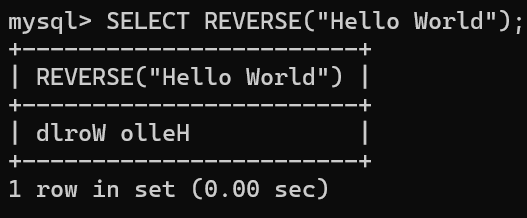
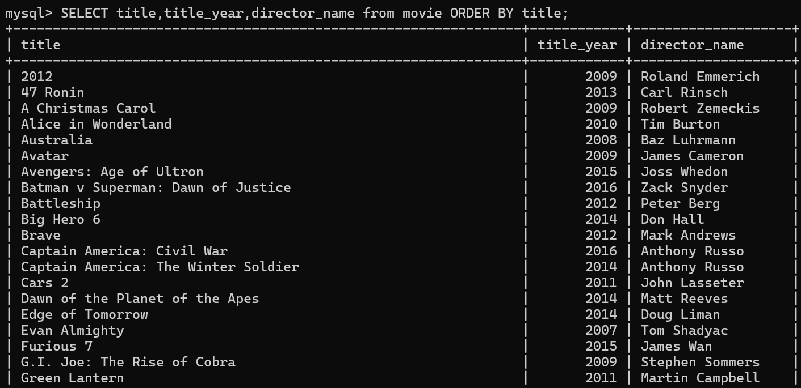
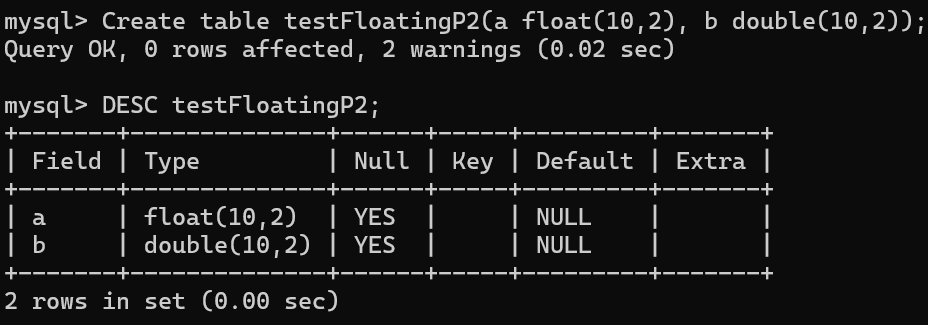
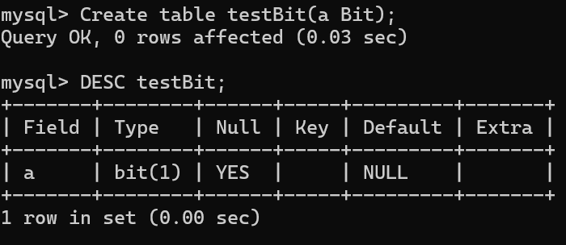
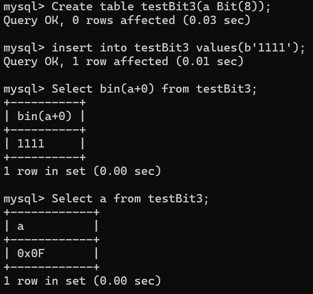
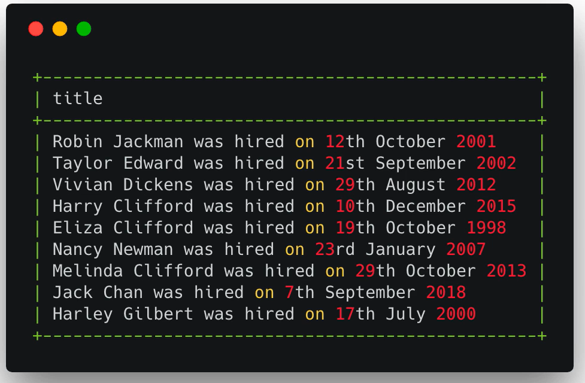
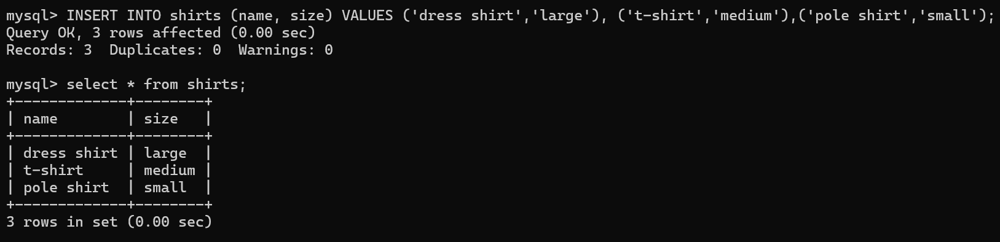
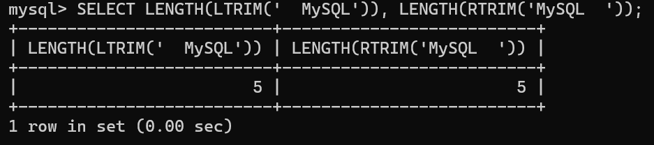
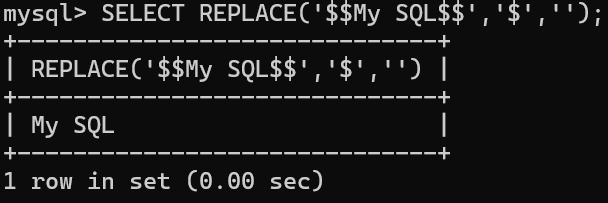
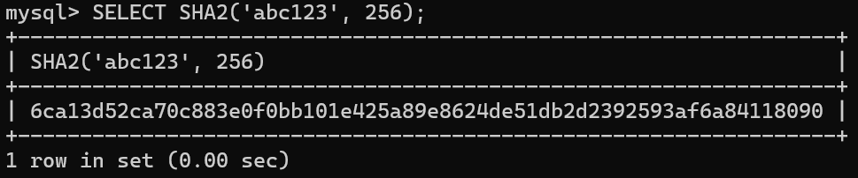

# 目錄
- [介紹SQL]
  - [什麼是資料庫](#什麼是資料庫)
  - [SQL 和 NOSQL](#SQL-和-NOSQL)
  - [為什麼選擇 MySQL](#為什麼選擇-MySQL)
  - [MySQL 版本的選擇](#MySQL-版本的選擇)
- [Database和Table](#Database-和-Table)
  - [本章介紹](#本章介紹)
  - [資料庫的基本操作](#資料庫的基本操作)  
  - [為什麼要輸入分號執行SQL](#為什麼要輸入分號執行-SQL) 
  - [SQL 大小寫的問題](#SQL-大小寫的問題)
  - [表的基本介紹](#表的基本介紹)
  - [資料類型的基本介紹](#資料類型的基本介紹)
  - [表的創建和基本操作](#表的創建和基本操作)  
  - [範例](#範例)   
- [Database Insert 資料插入](#Database-Insert-資料插入)
  - [本章介紹](#本章介紹)
  - [資料插入](#資料插入)  
  - [SELECT語句的基本用法](#SELECT-語句的基本用法) 
  - [NULL 和 NOT NULL](#NULL-和-NOT-NULL)
  - [設置默認值](#設置默認值)
  - [PRIMARY KEY 介紹](#PRIMARY-KEY-介紹)  
  - [UNIQUE 字段](#UNIQUE-字段)
  - [練習](#練習)
- [基本的增刪查改](#基本的增刪查改)
  - [本章介紹](#本章介紹)
  - [學習使用sql文件](#學習使用sql文件) 
  - [資料準備](#資料準備) 
  - [SELECT 語句](#SELECT-語句)
  - [WHERE 語句](#WHERE-語句)
  - [UPDATE 語句](#UPDATE-語句)
  - [DELETE 語句](#DELETE-語句)
  - [CRUD 練習](#CRUD-練習)
- [SQL 字符串相關處理方法](#SQL-字符串相關處理方法)
  - [本章介紹](#本章介紹)
  - [資料準備](#資料準備)
  - [字串拼接 CONCAT](#字串拼接-CONCAT)
  - [子字串 SUBSTRING](#子字串-SUBSTRING)
  - [REPLACE REVERSE CHARLENGTH](#REPLACE-REVERSE-CHARLENGTH)
  - [大小寫轉換](#大小寫轉換)
  - [字串處裡練習](#字串處裡練習)
- [SELECT 結果的進一步處理](#SELECT-結果的進一步處理)
  - [本章介紹](#本章介紹)
  - [資料準備](#資料準備)
  - [ORDER BY](#ORDER-BY)
  - [LIMIT](#LIMIT)
  - [LIKE](#LIKE)
  - [大小寫匹配問題](#大小寫匹配問題)
  - [練習](#練習)
- [資料的聚合處理](#資料的聚合處理)
  - [本章介紹](#本章介紹)
  - [資料準備](#資料準備)
  - [COUNT](#COUNT)
  - [DISTINCT](#DISCINCT)
  - [GROUP BY](#GROUP-BY)
  - [MAX MIN](#MAX-MIN)
  - [SUM AVG](#SUM-AVG)
  - [HAVING](#HAVING)
  - [練習](#練習)
- [Data Type 之數據值類型](#Data-Type-之數據值類型)
  - [本章介紹](#本章介紹)
  - [Interger 整數類型](#Interger-整數類型)
  - [Fixed Point 類型](#Fixed-Point-類型)
  - [Floating Point 類型](#Floating-Point-類型)
  - [Bit Value](#Bit-Value)
  - [練習](#練習)
- [Date Type 之日期時間類型](#Date-Type-之日期時間類型)
  - [本章介紹](#本章介紹)    
  - [DATE 和 TIME](#DATE-和-TIME)
  - [YEAR](#YEAR)
  - [DATETIME 和 TIMESTAMP](#DATETIME-和-TIMESTAMP)
  - [關於時區 timezone](#關於時區-timezone)
  - [關於時間和日期的函數方法](#關於時間和日期的函數方法)
  - [練習](#練習)

- [Date Type 之字符類型](#Date-Type-之字符類型)
  - [本章介紹](#本章介紹)    
  - [CHAR 和 VARCHAR](#CHAR-和-VARCHAR)
  - [BINARY 和 VARBINARY](#BINARY-和-VARBINARY)
  - [BLOB 和 TEXT](#BLOB-和-TEXT)
  - [ENUM](#ENUM)
  - [SET](#SET)
  - [修改已設定好的Table](#修改已設定好的Table) 

- [SQL 邏輯操作符](#SQL-邏輯操作符)
  - [本章介紹](#本章介紹)    
  - [EQUAL 和 NOT EQUAL](#EQUAL-和-NOT-EQUAL)
  - [LIKE 和 NOT LIKE](#LIKE-和-NOT-LIKE)
  - [MySQL 模糊查詢大小寫的問題](#MySQL-模糊查詢大小寫的問題)
  - [GREATER THAN 和 LESS THAN](#GREATER-THAN-和-LESS-THAN)
  - [AND 和 OR](#AND-和-OR)
  - [BETWEEN](#BETWEEN)
  - [IN 和 NOT IN](#IN-和-NOT-IN)
  - [CASE 表達式](#CASE-表達式)
  - [練習](#練習) 
- [MySQL 內置函數串講](#MySQL-內置函數串講)
  - [字符處理函數](#字符處理函數)    
  - [數值處理函數](#數值處理函數)
  - [時間日期函數](#時間日期函數)
  - [信息函數](#信息函數)
  - [加密函數](#加密函數)
- [Relationship 之 One to Many](#Relationship-之-One-to-Many)
  - [本章介紹](#本章介紹)    
  - [通過ID關聯兩個表](#通過ID關聯兩個表)
  - [使用外鍵的束關聯自斷](#使用外鍵的束關聯自斷)
  - [inner join](#inner-join)
  - [left join](#left-join)
  - [right join](#right-join)
  - [On Delete](#On-Delete)
  - [練習](#練習)  
- [Relationship 之 Many to Many](#Relationship-之-Many-to-Many)
  - [本章介紹](#本章介紹)    
  - [資料準備](#資料準備)
  - [第一個練習](#第一個練習)
  - [第二個練習](#第二個練習)
  - [第三個練習](#第三個練習)
  - [第四個練習](#第四個練習)
    

# 介紹SQL

## 什麼是資料庫

**資料庫有已下的特徵:**

1. Collection of Data: 資料的收集器(集合)


> Find Nancy's phone number?

2. Methods for accessing and manipulating that data

> Database vs. DBMS(Database Management system)


DBMS: 對database存取的橋梁
Database: 存取資料的方式

透過DBMS可以訪問獲取資料，或對資料進行編輯刪除等操作

宏觀意義上的database: DBMS+Database

市面上有很多不同的DBMS，使用者可以透過這些DBMS去和Database做交互

## SQL 和 NOSQL

> SQL:(prounced"ess-que-el") stands for **Structured Query Language**. SQL is used to communicate with a database. According to ANSI(American National Standards Institue), it is the standard language for **relational database** management systems.

[資料來源](https://en.wikipedia.org/wiki/SQL)


## 為什麼選擇 MySQL

根據[資料庫網站](https://db-engines.com/en/ranking)排名


> 第一、第二是商業軟體都要收費，所以選擇MySQL

# Database和Table

## 本章介紹

- A **database** is just a bunch of **tables**
- Tables hold the **data** (a collection of related data held in a **structured format** within a database)

## 資料庫的基本操作

- 顯示當前有哪些databases

```sql
SHOW databases;
```


- 創建databases

```sql
CREATE DATABASE <name>;
```
> name可以是任意的數字和字母組成但不能有空格


- 刪除databases

```sql
DROP DATABASE <name>;
```


- databases切換

```sql
USE <database name>;
```


- 查看當前正再使用哪個database

```sql
SELECT database();
```


> 預設使用的database是null


## 為什麼要輸入分號執行SQL

> 在SQL裡面`;`代表語句的結束，若沒有輸入，SQL會不知道語句已經結束，會報錯

這個`;`是可以變的，改變可以通過下面語法:

```SQL
delimiter $$
```


## SQL 大小寫的問題

[stackOverfolw](https://stackoverflow.com/questions/292026/is-there-a-good-reason-to-use-upper-case-for-sql-keywords)

> 建議KEYWORDS大寫，並且每遇到關鍵字就換行，這並不強制，小血也可以執行

## 表的基本介紹

- A database is just a bunch of **tables**
- Tables hold the **data in a structured format**


每個table都有column、row

header: Name、Phone、Age
data: 剩餘的部分


## 資料類型的基本介紹


- Numeric Types
  - INT
  - SMALLINT
  - MEDIUMINT
  - BIGINT
  - DECIMAL
  - NUMERIC
  - FLOAT
  - DOUBLE
  - BIT
 - String Types
  - CHAR
  - VARCHAR
  - BINARY
  - VARNINARY
  - BLOB
  - TINYBLOB
  - MEDIUMBLOB
  - LONGLOB
  - TEXT
  - TINYTEXT
  - MEDIUMTEXT
  - LONGTEXT
  - ENUM
 - Data Types
  - DATE
  - DATETIME
  - TIMESTAMP
  - TIME
  - YEAR 

[官方網站](https://dev.mysql.com/doc/refman/8.4/en/data-types.html)
[w3s](https://www.w3schools.com/mysql/mysql_datatypes.asp)

## 表的創建和基本操作

### 創建table

```sql
CREATE TABLE table_name(
  column_name data_type,
  column_name data_type,
  ...
);
```

- 驗證是否建立成功

```SQL
DESC <table name>;
```

**範例**

```sql
CREATE TABLE person
(
  name VARCHAR(20),
  phone VARCHAR(20),
  age INT
);
```

- 驗證是否建立成功

```SQL
DESC person;
```


### 基本操作

- 顯示當前database底下所有的table

```sql
SHOW TABLES;
```


- 展示此table的columns和每個columns的資訊

```sql
SHOW COLUMNS FROM <table_name>;
```


- 顯示當前table的資訊

```sql
DESC <table name>;
```


- 刪除table

```sql
DROP TABLE <table name>;
```


## 範例

- Please create a table for employees in a comapny
- Data include: employee number, birth of date, first name, last name, gender,hired data.


```sql
CREATE TABLE employee(
  eid INT,
  birth_date DATE,
  first_name VARCHAR(20),
  last_name VARCHAR(20),
  gender EMUM('M','F'),
  hired_date DATE
);
```

> [ENUM](https://dev.mysql.com/doc/refman/8.4/en/enum.html): 枚舉

> [DATE](https://dev.mysql.com/doc/refman/8.4/en/datetime.html): 2025-11-12


# Database Insert 資料插入

## 本章介紹

1. How to insert one/many data into MySQL Table?
2. How to check inserted data?
3. How to create table with advanced requirements for columns?

## 資料插入

**一條插入**

```sql
INSERT INTO <table_name>(
  column1_name,
  column2_name,
  ...
)
VALUES(
  column1_value,
  column2_value,
  ...
);
```
> columnName一定的順序要對應到columnValue的順序

```sql
INSERT INTO person(
  name,
  phone,
  age
)
VALUES(
  "Joan Hu",
  "+886 987654321",
  26
);
```


**多條插入**

```sql
INSERT INTO <table_name>(
  column1_name,
  column2_name,
  ...
)
VALUES(
  row1_column1_value,
  row1_column2_value,
  ...
),(
  row2_column1_value,
  row2_column2_value,
  ...
),(
  row3_column1_value,
  row3_column2_value,
  ...
)...;
```
> columnName一定的順序要對應到columnValue的順序

```sql
INSERT INTO person(
  name,
  phone,
  age
)
VALUES(
  "Joan Hu",
  "+886 987654321",
  26
),(
  "John Min",
  "+886 984567890",
  30
),(
  "Ken Lin",
  "+886 973648237",
  40
);
```


## SELECT語句的基本用法

- 把table裡面所有資料，以表格的資料打印出來

```sql
SELECT * from table_name;
```


- 把指定COLUMN的資料以表格的形式打印出來

```sql
SELECT column_name from table_name;
```


## NULL 和 NOT NULL

Field: 資料HEADER
Type: 每一column是什麼樣的資料類型
Null: 此COLUMN資料是否能夠不填
Default: 不填時會產生的值


- 如何產生`NOT NULL`

```SQL
CREATE TABLE <table_name>(
  column1_name data_type NOT NULL,
  column2_name data_type,
  column3_name data_type
);
```

```SQL
CREATE TABLE person2(
  name VARCHAR(20) NOT NULL,
  phone VARCHAR(20),
  age INT
);
```


## 設置默認值

```sql
CREATE TABLE <table_name>(
  column1_name data_type DEFAULT "DEFAULT_VALUE",
  column2_name data_type,
  ...
);
```
```sql
CREATE TABLE person3 (
  name VARCHAR(20) DEFAULT "no name",
  phone VARCHAR(20),
  age INT
);
```


## PRIMARY KEY 介紹

> 想要某一欄位是獨一讀二，不允許重複，可以使用KEY

```sql
CREATE TABLE <table_name>(
  column1_name data_type,
  column2_name data_type,
  ...,
  PRIMARY_KEY (column1_name)
);
```
```sql
CREATE TABLE person4 (
  name VARCHAR(20),
  phone VARCHAR(20),
  age INT,
  PRIMARY_KEY (phone)
);
```


> 讓key以數字的方式自動增加

```sql
CREATE TABLE <table_name>(
  column1_name INT AUTO_INCREMENT,
  column2_name data_type,
  column3_name data_type,
  ...,
  PRIMARY_KEY (column1_name)
);
```
```sql
CREATE TABLE person5 (
  id INT AUTO_INCREMENT,
  name VARCHAR(20),
  phone VARCHAR(20),
  age INT,
  PRIMARY_KEY (id)
);
```


## UNIQUE 字段

```sql
CREATE TABLE <table_name>(
  column1_value data_type PRIMARY KEY,
  column2_value data_type UNIQUE
);
```

```sql
CREATE TABLE table_test(
  a INT PRIMARY KEY,
  b VARCAHR(10) UNIQUE
);
```


> UNIQUE若是null則可以重複，Primary key不能為空，也不能重複

- primary key可以有很多個

> 錯誤設定方式

```sql
CREATE TABLE <table_name>(
  column1_value data_type PRIMARY KEY,
  column2_value data_type PRIMARY KEY,
  column3_value data_type,
);
```

```sql
CREATE TABLE test_table2(
  a INT PRIMARY KEY,
  b INT PRIMARY KEY,
  c INT
);
```


> 正確方式
```sql
CREATE TABLE <table_name>(
  column1_value data_type,
  column2_value data_type,
  column3_value data_type,
  PRIMARY KEY(column1_value,column2_value);
);
```

```sql
CREATE TABLE test_table2(
  a INT,
  b INT,
  c INT,
  PRIMARY KEY(a,b);
);
```


**Primary key vs. UNIQUE**

| 條件 | 	NULL 是否可存在|可否有多個在同一張表|是否可以用多欄位|
|------|----------------|------------------|---------------|
|Primary Key（主鍵）|不可以（必須 NOT NULL）|不可以（每個表只能有一個 Primary Key）|可以（複合主鍵）|
|UNIQUE（唯一約束）|可以（但只能有一筆是 NULL，依資料庫而異）|可以（一個表可以有多個 UNIQUE 約束）|可以（複合 UNIQUE 約束）|

## 練習


```sql
CREATE TABLE employee (
  eid INT AUTO_INCREMENT,
  birth_date DATE NOT NULL,
  first_name VARCHAR(20) NOT NULL,
  last_name VARCHAR(20) NOT NULL,
  gender ENUM('M','F') NOT NULL,
  hired_date DATE NOT NULL DEFAULT "2000-01-01"
);
```


# 基本的增刪查改

## 本章介紹

- CRED
 - C: Create 增加
 - R: Read  讀取
 - U: Update 更新
 - D: Delete 刪除

## 學習使用sql文件

- 步驟:
 - step1: 先用指令`CREATE DATABASE <DATABASE_NAME>`創建database，並用指令`USE <DATABASE_NAME>`切換database
 - step2: 創建一個`.sql`檔案，並且在裡面寫下創建table的指令
 - step3: 複製此檔案的絕對路徑到MYSQL的Command裡面
 - step4: 輸入`source <url>;`執行sql檔案，執行完候用`DESC <TABLE_NAME>`或`SELECT * FROM <TABLE_NAME>`等指令，確認是否創建正確


```SQL
CREATE TABLE test(
  id INT NOT NULL AUTO_INCREMENT,
  first_name VARCHAR(20) NOT NULL,
  last_name VARCHAR(20) NOT NULL,
  PRIMARY KEY (id)
);

INSERT INTO test (first_name, last_name) VALUES
('Robin','Jackman'),
('Taylor','Edward'),
('Vivian','Dickens'),
('Harry','Clifford'),
('Elize','Clifford'),
('Nancy','Newman'),
('Melinda','Clifford');
```

## 資料準備

```sql
CREATE TABLE employee(
  id INT NOT NULL AUTO_INCREMENT,
  first_name VARCHAR(100) NOT NULL,
  last_name VARCHAR(100) NOT NULL,
  title VARCHAR(100) DEFAULT NULL,
  salary DOUBLE DEFAULT NULL,
  hired_date DATE NOT NULL,
  notes TEXT,
  PRIMARY KEY (id)
);

INSERT INTO employee (first_name, last_name, title, salary, hired_date) VALUES
('Robin','Jackman','Software Engineer', 5500, '2001-10-21'),
('Taylor','Edware','Software Architect', 7200, '2001-09-21'),
('Vivian','Dickens','Database Administrator', 6000, '2012-08-29'),
('Harry','Clifford','Database Administrator', 6800, '2015-12-10'),
('Eliza','Clifford','Software Engineer', 4750, '1998-10-19'),
('Nancy','Newman','Software Engineer', 5100, '2007-01-23'),
('Melinda','Clifford','Project Manager', 8500, '2013-10-29'),
('Jack','Chan','Test Engineer', 6500, '2018-09-07'),
('Harley','Gilbert','Software Architect', 8000, '2000-07-17');
```


## SELECT 語句

- table裡的全部資料

```sql
SELECT * FROM <TABLE_NAME>;
```

```sql
select * from employee;
```


- 指定column

```sql
SELECT column1_name,column2_name FROM <TABLE_NAME>;
```

```sql
select first_name ,salary from employee;
```


- column如果太長，可以另外取名

```sql
SELECT colum1_name as colN, column2_name as col2N FROM <TABLE_NAME>;
```

```sql
select first_name as fname,last_name as lname from employee;
```


## WHERE 語句

> 可增加搜尋條件

```sql
SELECT * from employee WHERE condition;
```

```sql
SELECT * from employee WHERE title="Database Administrator";
```


> 多個條件可以用`and`，`or`來做連接

**and**

```sql
SELECT * from employee WHERE condition1 and condition2;
```

```sql
SELECT * from employee WHERE title="Database Administrator" and salary=6000;
```


**or**

```sql
SELECT * from employee WHERE condition1 or condition2;
```

```sql
SELECT * from employee WHERE title="Software Architect" or salary=6000;
```


> 可以使用`NOT`

**NOT**

```sql
SELECT * from employee WHERE NOT condition1 or condition2;
```

```sql
SELECT * from employee WHERE NOT title="Software Architect";
```


## UPDATE 語句

```SQL
UPDATE <TABLE_NAME> SET column_name = value where condition ;
```

```SQL
UPDATE employee set salary=10000 where title="Software Architect";
```


> 同時改多個值

```sql
UPDATE <TABLE_NAME> SET column1_name = value, column2_name = value where condition ;
```
```SQL
UPDATE employee set salary=20000,notes="update" where title="Software Architect";
```


## DELETE 語句

```sql
DELETE FROM <TABLE_NAME> WHERE condition;
```
```sql
DELETE FROM employee WHERE title="Software Architect";
```


- 刪除整個table裡面的資料

```sql
DELETE FROM <TABLE_NAME>;
```

```sql
DELETE FROM employee;
```


> 在CREATE TABLE時可以加判斷，當此TABLE沒成立時才創建

```SQL
CREATE TABLE IF NOT EXISTS <table_name>(
  column1_name data type,
  column2_name data type,
  ...,
)
```

```SQL
CREATE TABLE IF NOT EXISTS employee(
  id INT NOT NULL AUTO_INCREMENT,
  first_name VARCHAR(100) NOT NULL,
  last_name VARCHAR(100) NOT NULL,
  title VARCHAR(100) DEFAULT NULL,
  salary DOUBLE DEFAULT NULL,
  hired_date DATE NOT NULL,
  notes TEXT,
  PRIMARY KEY (id)
);
```


## CRUD 練習

```sql
CREATE TABLE IF NOT EXISTS movie(
    id INT NOT NULL AUTO_INCREMENT PRIMARY KEY,
    title VARCHAR(100) NOT NULL,
    title_year INT NOT NULL,
    director_name VARCHAR(50) NOT NULL,
    actor_1_name VARCHAR(50) NOT NULL,
    actor_2_name VARCHAR(50) NOT NULL,
    duration INT NOT NULL,
    country VARCHAR(50) NOT NULL,
    content_rating VARCHAR(10) NOT NULL,
    gross BIGINT NOT NULL,
    imdb_score FLOAT DEFAULT 0
);

INSERT INTO movie(title, title_year, director_name, actor_1_name, actor_2_name, duration, country, content_rating, gross, imdb_score) VALUES
("Avatar", 2009, "James Cameron", "CCH Pounder", "Joel David Moore", 178, "USA", "PG-13", 760505847, 7.9),
("Pirates of the Caribbean: At World's End", 2007, "Gore Verbinski", "Johnny Depp", "Orlando Bloom", 169, "USA", "PG-13", 309404152, 7.1),
("Spectre", 2015, "Sam Mendes", "Christoph Waltz", "Rory Kinnear", 148, "UK", "PG-13", 200074175, 6.8),
("The Dark Knight Rises", 2012, "Christopher Nolan", "Tom Hardy", "Christian Bale", 164, "USA", "PG-13", 448130642, 8.5),
("John Carter", 2012, "Andrew Stanton", "Daryl Sabara", "Samantha Morton", 132, "USA", "PG-13", 73058679, 6.6),
("Spider-Man 3", 2007, "Sam Raimi", "J.K. Simmons", "James Franco", 156, "USA", "PG-13", 336530303, 6.2),
("Tangled", 2010, "Nathan Greno", "Brad Garrett", "Donna Murphy", 100, "USA", "PG", 200807262, 7.8),
("Avengers: Age of Ultron", 2015, "Joss Whedon", "Chris Hemsworth", "Robert Downey Jr.", 141, "USA", "PG-13", 458991599, 7.5),
("Harry Potter and the Half-Blood Prince", 2009, "David Yates", "Alan Rickman", "Daniel Radcliffe", 153, "UK", "PG", 301956980, 7.5),
("Batman v Superman: Dawn of Justice", 2016, "Zack Snyder", "Henry Cavill", "Lauren Cohan", 183, "USA", "PG-13", 330249062, 6.9),
("Superman Returns", 2006, "Bryan Singer", "Kevin Spacey", "Marlon Brando", 169, "USA", "PG-13", 200069408, 6.1),
("Quantum of Solace", 2008, "Marc Forster", "Giancarlo Giannini", "Mathieu Amalric", 106, "UK", "PG-13", 168368427, 6.7),
("Pirates of the Caribbean: Dead Man's Chest", 2006, "Gore Verbinski", "Johnny Depp", "Orlando Bloom", 151, "USA", "PG-13", 423032628, 7.3),
("The Lone Ranger", 2013, "Gore Verbinski", "Johnny Depp", "Ruth Wilson", 150, "USA", "PG-13", 89289910, 6.5),
("Man of Steel", 2013, "Zack Snyder", "Henry Cavill", "Christopher Meloni", 143, "USA", "PG-13", 291021565, 7.2),
("The Chronicles of Narnia: Prince Caspian", 2008, "Andrew Adamson", "Peter Dinklage", "Pierfrancesco Favino", 150, "USA", "PG", 141614023, 6.6),
("The Avengers", 2012, "Joss Whedon", "Chris Hemsworth", "Robert Downey Jr.", 173, "USA", "PG-13", 623279547, 8.1),
("Pirates of the Caribbean: On Stranger Tides", 2011, "Rob Marshall", "Johnny Depp", "Sam Claflin", 136, "USA", "PG-13", 241063875, 6.7),
("Men in Black 3", 2012, "Barry Sonnenfeld", "Will Smith", "Michael Stuhlbarg", 106, "USA", "PG-13", 179020854, 6.8),
("The Hobbit: The Battle of the Five Armies", 2014, "Peter Jackson", "Aidan Turner", "Adam Brown", 164, "New Zealand", "PG-13", 255108370, 7.5),
("The Amazing Spider-Man", 2012, "Marc Webb", "Emma Stone", "Andrew Garfield", 153, "USA", "PG-13", 262030663, 7),
("Robin Hood", 2010, "Ridley Scott", "Mark Addy", "William Hurt", 156, "USA", "PG-13", 105219735, 6.7),
("The Hobbit: The Desolation of Smaug", 2013, "Peter Jackson", "Aidan Turner", "Adam Brown", 186, "USA", "PG-13", 258355354, 7.9),
("The Golden Compass", 2007, "Chris Weitz", "Christopher Lee", "Eva Green", 113, "USA", "PG-13", 70083519, 6.1),
("King Kong", 2005, "Peter Jackson", "Naomi Watts", "Thomas Kretschmann", 201, "New Zealand", "PG-13", 218051260, 7.2),
("Titanic", 1997, "James Cameron", "Leonardo DiCaprio", "Kate Winslet", 194, "USA", "PG-13", 658672302, 7.7),
("Captain America: Civil War", 2016, "Anthony Russo", "Robert Downey Jr.", "Scarlett Johansson", 147, "USA", "PG-13", 407197282, 8.2),
("Battleship", 2012, "Peter Berg", "Liam Neeson", "Alexander Skarsgård", 131, "USA", "PG-13", 65173160, 5.9),
("Jurassic World", 2015, "Colin Trevorrow", "Bryce Dallas Howard", "Judy Greer", 124, "USA", "PG-13", 652177271, 7),
("Skyfall", 2012, "Sam Mendes", "Albert Finney", "Helen McCrory", 143, "UK", "PG-13", 304360277, 7.8),
("Spider-Man 2", 2004, "Sam Raimi", "J.K. Simmons", "James Franco", 135, "USA", "PG-13", 373377893, 7.3),
("Iron Man 3", 2013, "Shane Black", "Robert Downey Jr.", "Jon Favreau", 195, "USA", "PG-13", 408992272, 7.2),
("Alice in Wonderland", 2010, "Tim Burton", "Johnny Depp", "Alan Rickman", 108, "USA", "PG", 334185206, 6.5),
("X-Men: The Last Stand", 2006, "Brett Ratner", "Hugh Jackman", "Kelsey Grammer", 104, "Canada", "PG-13", 234360014, 6.8),
("Monsters University", 2013, "Dan Scanlon", "Steve Buscemi", "Tyler Labine", 104, "USA", "G", 268488329, 7.3),
("Transformers: Revenge of the Fallen", 2009, "Michael Bay", "Glenn Morshower", "Kevin Dunn", 150, "USA", "PG-13", 402076689, 6),
("Transformers: Age of Extinction", 2014, "Michael Bay", "Bingbing Li", "Sophia Myles", 165, "USA", "PG-13", 245428137, 5.7),
("Oz the Great and Powerful", 2013, "Sam Raimi", "Tim Holmes", "Mila Kunis", 130, "USA", "PG", 234903076, 6.4),
("The Amazing Spider-Man 2", 2014, "Marc Webb", "Emma Stone", "Andrew Garfield", 142, "USA", "PG-13", 202853933, 6.7),
("TRON: Legacy", 2010, "Joseph Kosinski", "Jeff Bridges", "Olivia Wilde", 125, "USA", "PG", 172051787, 6.8),
("Cars 2", 2011, "John Lasseter", "Joe Mantegna", "Thomas Kretschmann", 106, "USA", "G", 191450875, 6.3),
("Green Lantern", 2011, "Martin Campbell", "Ryan Reynolds", "Temuera Morrison", 123, "USA", "PG-13", 116593191, 5.6),
("Toy Story 3", 2010, "Lee Unkrich", "Tom Hanks", "John Ratzenberger", 103, "USA", "G", 414984497, 8.3),
("Terminator Salvation", 2009, "McG", "Christian Bale", "Bryce Dallas Howard", 118, "USA", "PG-13", 125320003, 6.6),
("Furious 7", 2015, "James Wan", "Jason Statham", "Paul Walker", 140, "USA", "PG-13", 350034110, 7.2),
("World War Z", 2013, "Marc Forster", "Peter Capaldi", "Brad Pitt", 123, "USA", "PG-13", 202351611, 7),
("X-Men: Days of Future Past", 2014, "Bryan Singer", "Jennifer Lawrence", "Peter Dinklage", 149, "USA", "PG-13", 233914986, 8),
("Star Trek Into Darkness", 2013, "J.J. Abrams", "Benedict Cumberbatch", "Bruce Greenwood", 132, "USA", "PG-13", 228756232, 7.8),
("Jack the Giant Slayer", 2013, "Bryan Singer", "Eddie Marsan", "Ewen Bremner", 114, "USA", "PG-13", 65171860, 6.3),
("The Great Gatsby", 2013, "Baz Luhrmann", "Leonardo DiCaprio", "Elizabeth Debicki", 143, "Australia", "PG-13", 144812796, 7.3),
("Prince of Persia: The Sands of Time", 2010, "Mike Newell", "Jake Gyllenhaal", "Richard Coyle", 116, "USA", "PG-13", 90755643, 6.6),
("Pacific Rim", 2013, "Guillermo del Toro", "Charlie Hunnam", "Clifton Collins Jr.", 131, "USA", "PG-13", 101785482, 7),
("Transformers: Dark of the Moon", 2011, "Michael Bay", "Glenn Morshower", "Lester Speight", 154, "USA", "PG-13", 352358779, 6.3),
("Indiana Jones and the Kingdom of the Crystal Skull", 2008, "Steven Spielberg", "Harrison Ford", "Ray Winstone", 122, "USA", "PG-13", 317011114, 6.2),
("The Good Dinosaur", 2015, "Peter Sohn", "A.J. Buckley", "Jack McGraw", 93, "USA", "PG", 123070338, 6.8),
("Brave", 2012, "Mark Andrews", "Kelly Macdonald", "John Ratzenberger", 93, "USA", "PG", 237282182, 7.2),
("Star Trek Beyond", 2016, "Justin Lin", "Sofia Boutella", "Melissa Roxburgh", 122, "USA", "PG-13", 130468626, 7.5),
("WALL·E", 2008, "Andrew Stanton", "John Ratzenberger", "Fred Willard", 98, "USA", "G", 223806889, 8.4),
("Rush Hour 3", 2007, "Brett Ratner", "Tzi Ma", "Dana Ivey", 91, "USA", "PG-13", 140080850, 6.2),
("2012", 2009, "Roland Emmerich", "Oliver Platt", "Liam James", 158, "USA", "PG-13", 166112167, 5.8),
("A Christmas Carol", 2009, "Robert Zemeckis", "Robin Wright", "Colin Firth", 96, "USA", "PG", 137850096, 6.8),
("Jupiter Ascending", 2015, "Lana Wachowski", "Channing Tatum", "Mila Kunis", 127, "USA", "PG-13", 47375327, 5.4),
("The Legend of Tarzan", 2016, "David Yates", "Christoph Waltz", "Alexander Skarsgård", 110, "USA", "PG-13", 124051759, 6.6),
("The Chronicles of Narnia: The Lion, the Witch and the Wardrobe", 2005, "Andrew Adamson", "Jim Broadbent", "Kiran Shah", 150, "USA", "PG", 291709845, 6.9),
("X-Men: Apocalypse", 2016, "Bryan Singer", "Jennifer Lawrence", "Michael Fassbender", 144, "USA", "PG-13", 154985087, 7.3),
("The Dark Knight", 2008, "Christopher Nolan", "Christian Bale", "Heath Ledger", 152, "USA", "PG-13", 533316061, 9),
("Up", 2009, "Pete Docter", "John Ratzenberger", "Delroy Lindo", 96, "USA", "PG", 292979556, 8.3),
("Monsters vs. Aliens", 2009, "Rob Letterman", "Amy Poehler", "Rainn Wilson", 94, "USA", "PG", 198332128, 6.5),
("Iron Man", 2008, "Jon Favreau", "Robert Downey Jr.", "Jeff Bridges", 126, "USA", "PG-13", 318298180, 7.9),
("Hugo", 2011, "Martin Scorsese", "Chloe Grace Moretz", "Christopher Lee", 126, "USA", "PG", 73820094, 7.5),
("Wild Wild West", 1999, "Barry Sonnenfeld", "Will Smith", "Salma Hayek", 106, "USA", "PG-13", 113745408, 4.8),
("The Mummy: Tomb of the Dragon Emperor", 2008, "Rob Cohen", "Jet Li", "Brendan Fraser", 112, "USA", "PG-13", 102176165, 5.2),
("Suicide Squad", 2016, "David Ayer", "Will Smith", "Robin Atkin Downes", 123, "USA", "PG-13", 161087183, 6.9),
("Evan Almighty", 2007, "Tom Shadyac", "Jimmy Bennett", "Morgan Freeman", 96, "USA", "PG", 100289690, 5.4),
("Edge of Tomorrow", 2014, "Doug Liman", "Tom Cruise", "Lara Pulver", 113, "USA", "PG-13", 100189501, 7.9),
("Waterworld", 1995, "Kevin Reynolds", "Jeanne Tripplehorn", "Rick Aviles", 176, "USA", "PG-13", 88246220, 6.1),
("G.I. Joe: The Rise of Cobra", 2009, "Stephen Sommers", "Joseph Gordon-Levitt", "Dennis Quaid", 118, "USA", "PG-13", 150167630, 5.8),
("Inside Out", 2015, "Pete Docter", "Amy Poehler", "Mindy Kaling", 95, "USA", "PG", 356454367, 8.3),
("The Jungle Book", 2016, "Jon Favreau", "Scarlett Johansson", "Bill Murray", 106, "UK", "PG", 362645141, 7.8),
("Iron Man 2", 2010, "Jon Favreau", "Robert Downey Jr.", "Scarlett Johansson", 124, "USA", "PG-13", 312057433, 7),
("Snow White and the Huntsman", 2012, "Rupert Sanders", "Chris Hemsworth", "Kristen Stewart", 132, "USA", "PG-13", 155111815, 6.1),
("Maleficent", 2014, "Robert Stromberg", "Angelina Jolie Pitt", "Sharlto Copley", 97, "USA", "PG", 241407328, 7),
("Dawn of the Planet of the Apes", 2014, "Matt Reeves", "Gary Oldman", "Judy Greer", 130, "USA", "PG-13", 208543795, 7.6),
("47 Ronin", 2013, "Carl Rinsch", "Keanu Reeves", "Cary-Hiroyuki Tagawa", 128, "USA", "PG-13", 38297305, 6.3),
("Captain America: The Winter Soldier", 2014, "Anthony Russo", "Scarlett Johansson", "Chris Evans", 136, "USA", "PG-13", 259746958, 7.8),
("Shrek Forever After", 2010, "Mike Mitchell", "Jon Hamm", "Kathy Griffin", 93, "USA", "PG", 238371987, 6.4),
("Tomorrowland", 2015, "Brad Bird", "Judy Greer", "Chris Bauer", 130, "USA", "PG", 93417865, 6.5),
("Inception", 2010, "Christopher Nolan", "Leonardo DiCaprio", "Tom Hardy", 148, "USA", "PG-13", 292568851, 8.8),
("Big Hero 6", 2014, "Don Hall", "Damon Wayans Jr.", "Daniel Henney", 102, "USA", "PG", 222487711, 7.9),
("Wreck-It Ralph", 2012, "Rich Moore", "Jack McBrayer", "Sarah Silverman", 101, "USA", "PG", 189412677, 7.8),
("The Polar Express", 2004, "Robert Zemeckis", "Tom Hanks", "Eddie Deezen", 100, "USA", "G", 665426, 6.6),
("Independence Day: Resurgence", 2016, "Roland Emmerich", "Vivica A. Fox", "Sela Ward", 120, "USA", "PG-13", 102315545, 5.5),
("How to Train Your Dragon", 2010, "Dean DeBlois", "Gerard Butler", "America Ferrera", 98, "USA", "PG", 217387997, 8.2),
("Terminator 3: Rise of the Machines", 2003, "Jonathan Mostow", "Nick Stahl", "M.C. Gainey", 109, "USA", "R", 150350192, 6.4),
("Guardians of the Galaxy", 2014, "James Gunn", "Bradley Cooper", "Vin Diesel", 121, "USA", "PG-13", 333130696, 8.1),
("Interstellar", 2014, "Christopher Nolan", "Matthew McConaughey", "Anne Hathaway", 169, "USA", "PG-13", 187991439, 8.6),
("Australia", 2008, "Baz Luhrmann", "Essie Davis", "Bryan Brown", 165, "Australia", "PG-13", 49551662, 6.6),
("Warcraft", 2016, "Duncan Jones", "Dominic Cooper", "Callum Rennie", 123, "USA", "PG-13", 46978995, 7.3),
("X-Men: First Class", 2011, "Matthew Vaughn", "Jennifer Lawrence", "Michael Fassbender", 132, "USA", "PG-13", 146405371, 7.8),
("The Hobbit: An Unexpected Journey", 2012, "Peter Jackson", "Aidan Turner", "Adam Brown", 182, "USA", "PG-13", 303001229, 7.9);
```

1. print out a table only have three columns (title,director_name,imdb_score)

```sql
SELECT title,director_name,imdb_score FROM movie;
```


2. filter out all movies in 2012 and contect_rating is PG-13

```sql
SELECT * FROM movie WHERE title_year=2012 AND content_rating="PG-13";
```


3. filter out all not USA movie

```sql
SELECT * FROM movie WHERE NOT country="USA";
```


4. filter out Peter Jackson's or Christopher Nolan's movie

```sql
SELECT * FROM movie WHERE director_name="Peter Jackson" OR director_name="Christopher Nolan";
```


5. update all Christopher Nolan's movie's IMDB score to 9

```sql
UPDATE movie SET imdb_score=9 WHERE director_name="Christopher Nolan";
```


6. delete all movies which IMDB score is less than 6

```sql
DELETE FROM movie WHERE imdb_score<6;
```


7. delete all movies in 2016

```sql
DELETE FROM movie WHERE title_year=2006;
```


# SQL 字符串相關處理方法

## 本章介紹

- 字串"拼接"
- 字串"剪輯"
- 字串"反轉"
- 字串"長度"
- 字串"大小寫"

## 資料準備


## 字串拼接 CONCAT

```sql
select first_name, last_name from employee;
```
> 這樣會打印出兩個column，那如果我想直接拿到全名該怎麼做?

- The MYSQL CONCAT function takes one or more string arguments and concatenates them into a single string. The CONCAT function requires a minimum of one parameter otherwise it raises an error

- CONCAT("A","B") = "AB"

```SQL
SELECT CONCAT("A","B");
```


```SQL
SELECT CONCAT(first_name, last_name) from employee;
```


> 讓他更美觀一點

```SQL
SELECT CONCAT(first_name, "," ,last_name) as FullName from employee;
```


**範例**

```SQL
SELECT CONCAT(first_name, "," ,last_name," is a ",title) as Sentence from employee;
```


**CONCAT_WS:第一個參數可以放要分割的東西，後面參數則是放合併的參數**

```SQL
SELECT CONCAT_WS(",",first_name,last_name) as FullName from employee;
```


```SQL
SELECT CONCAT_WS(",",first_name,last_name,title) as FullName from employee;
```


## 子字串 SUBSTRING

> 取index為0~3的字母

```SQL
SELECT SUBSTRING("Hello World",1,4);
```


> 取index從7開始到結束的字母

```SQL
SELECT SUBSTRING("Hello World",7);
```


> 從後面數來的3個字母到最後

```SQL
SELECT SUBSTRING("Hello World",-3);
```


**範例**

```sql
SELECT SUBSTRING(title,1,5) from employee;
```


> `SUBSTRING`可以簡寫成`SUBSTR`

```sql
SELECT SUBSTR(title,1,5) from employee;
```


```sql
SELECT CONCAT_WS(" ",first_name,last_name,"was hired on",SUBSTR(hire_date,1,4)) as information from employee;
```


## REPLACE REVERSE CHARLENGTH

> 替代指定的字串

```sql
SELECT REPLACE("Hello World", "World","MySQL");
```


> 反轉字串

```SQL
SELECT REVERSE("Hello World");
```


> 顯示字串長度

```SQL
SELECT CHAR_LENGTH("Hello World");
```


**範例**

```sql
SELECT REPLACE(title, "Software","Hardware") from employee;
```


## 大小寫轉換

> 轉換成大寫

```sql
SELECT UPPER("Hello MySQL");
```


```sql
SELECT LOWER("Hello MySQL");
```


**範例**

```sql
SELECT UPPER(first_name) as first_name, UPPER(last_name) as last_name from employee;
```


## 字串處裡練習

1. 複習

```sql
SELECT REPLACE(CONCAT("H"," ","E"," ","L"," ","L"," ","O")," ","-") AS Title;
```

| Title|
|------|
|H-E-L-L-O|


2. CONCAT練習

```SQL
SELECT CONCAT(director_name,"->",imdb_score) as "director_name->imdb_score" from movie;
```
```SQL
SELECT CONCAT_WS("->",director_name,imdb_score) as "director_name->imdb_score" from movie;
```


3. REVERSE練習

```SQL
SELECT country,REVERSE(country) as "yrtnuoc" from movie;
```


4. CONCAT練習

```SQL
SELECT CONCAT_WS(" ",title,"was released in",title_year) as "title" from movie;
```


5. CHAR_LENGTH練習

```SQL
SELECT title, CHAR_LENGTH(title) as character_count from movie;
```


5. CONCAT和SUBSTR練習

```SQL
SELECT CONCAT(SUBSTR(title,1,8),"...")as short_title, director_name from movie;
```


# SELECT 結果的進一步處理

## 本章介紹

1. 如何對SELECT返回的資料按某種規則進行排序?
2. 如何限制SELECT返回資料的數量?
3. 如何進行SELECT結果的模糊搜索?

## 資料準備


## ORDER BY

```sql
SELECT * from employee ORDER BY salary;
```


> 默認排序順序是從低到高

**降序**
```sql
SELECT * from employee ORDER BY salary DESC;
```


> 除了一般的數字外，DATA和STRING也可以排序
```sql
SELECT * from employee ORDER BY title;
```


```sql
SELECT * from employee ORDER BY hired_date;
```


> 若有指定column可以簡寫成數字排序

- 照salary排序

```sql
SELECT first_name, last_name, salary from employee ORDER BY 3;
```


- 照last_name排序

```sql
SELECT first_name, last_name, salary from employee ORDER BY 2;
```


> 也可以照沒有指定的欄位排序

```sql
SELECT first_name, last_name, salary from employee ORDER BY id;
```


> 也可以選擇兩個column進行排序

- 先按照`last_name`進行排序，若有相同的`last_name`再按照`first_name`做排序

```sql
SELECT first_name, last_name, salary from employee ORDER BY 2,1;
```


## LIMIT

> 返回前五條記錄

```sql
SELECT * FROM employee limit 5;
```


```sql
SELECT * FROM employee ORDER BY salary limit 3;
```


```sql
SELECT * FROM employee ORDER BY salary DESC limit 3;
```


> 可以指定範圍

- 從index為2開始數四個(2~5) 

```sql
SELECT * FROM employee ORDER BY salary DESC limit  2,4;
```


- 若不想要指定結束，要怎麼做?可以在後面放很大的數字

[官網](https://dev.mysql.com/doc/refman/8.4/en/select.html)

```SQL
SELECT * FROM tbl LIMIT 95,18446744073709551615;
```

## LIKE

> 模糊搜尋，`%`代表任意字符

- 搜尋`last_name`是以`C`開頭的

```SQL
SELECT * FROM employee where last_name like "C%";
```


- 搜尋`last_name`是以`Cl`開頭的

```SQL
SELECT * FROM employee where last_name like "Cl%";
```


- 搜尋`last_name`包含`i`的資料

```SQL
SELECT * FROM employee where last_name like "%i%";
```


- 搜尋`last_name`以`n`結尾的資料

```SQL
SELECT * FROM employee where last_name like "%n";
```


> 若知道長度，那可以用`-`做篩選

- 搜尋`last_name`為四個字，以`an`結尾

```sql
SELECT * FROM employee where last_name like "__an";
```


- 搜尋`last_name`為四個字

```sql
SELECT * FROM employee where last_name like "____";
```


> 若原本的字串裡面存在`%`和`_`時該怎麼辦?

```sql
INSERT INTO employee(first_name, last_name, title, salary, hired_date) VALUES("a%bb","c_dd","Test",10000,"2018-10-10");
```


> 此時可以用`\`做轉譯

```sql
SELECT * FROM employee where first_name like "%\%%";
```


```sql
SELECT * FROM employee where last_name like "%\_%";
```


## 大小寫匹配問題

> 不論大寫或小寫都可以被匹配到

```sql
SELECT * FROM employee where first_name="robin";
```

```sql
SELECT * FROM employee where first_name="Robin";
```


## 練習

1. 找出所有電影名字含有`dark`的影片，打印出片名，導演、上映時間

```sql
SELECT title,director_name,title_year from movie where title like "%dark%";
```


2. 找出票房最高的十部影片，打印出片名、上映時間、導演、票房、主演1和2

```sql
SELECT title,title_year,director_name,gross,actor_1_name,actor_2_name from movie ORDER BY gross DESC LIMIT 10;
```


3. 找到`Peter Jackson票房最高`的電影，打印出片名，上映時間，票房，IMDB評分

```sql
SELECT title,title_year,gross,imdb_score from movie WHERE director_name="Peter Jackson" ORDER BY gross DESC LIMIT 1;
```


4. 對片名按照字母順序排序，打印出片名、上映時間、導演

```sql
SELECT title,title_year,director_name from movie ORDER BY title;
```


5. 找到Christopher Nolan所有影片中IMDB評分最高的電影，打印出片名，上映時間，IMDB評分

```sql
SELECT title,title_year,imdb_score from movie WHERE director_name="Christopher Nolan" ORDER BY imdb_score DESC LIMIT 1;
```


# 資料的聚合處理

## 本章介紹

- Group and aggregation 


## 資料準備

> 使用movie和employee的資料

## COUNT

> 可對篩選的結果做統計

```sql
select count(*) from employee;
```


```sql
select count(*) from employee WHERE title="Software Engineer";
```


## DISTINCT

```sql
SELECT DISTINCT title FROM employee;
```


```sql
SELECT COUNT(DISTINCT title) FROM employee;
```


## GROUP BY

> 按照title去分組

```SQL
SELECT title FROM employee group by title;
```


```SQL
SELECT title, count(first_name) from employee group by title;
```


```SQL
SELECT last_name from employee group by last_name;
```


```SQL
SELECT last_name from employee group by last_name,first_name;
```


## MAX MIN

```sql
SELECT MAX(salary) FROM employee;
```


```sql
SELECT * FROM employee ORDER BY salary DESC LIMIT 1;
```


> 打印出每一種title的最高salary

```sql
SELECT title, max(salary) FROM employee group by title;
```


> 打印出每一種title的最低salary

```sql
SELECT title, MIN(salary) FROM employee group by title;
```


> 也可以使用在日期上

```sql
SELECT MIN(hire_date),MAX(hire_date) FROM employee;
```


> 也可以使用在字串上

```sql
SELECT MIN(first_name),MAX(first_name) FROM employee;
```


## SUM AVG

```sql
SELECT sum(salary) FROM employee;
```


```sql
SELECT sum(salary),AVG(salary) FROM employee;
```


❌方法跟column名稱連用

```sql
SELECT sum(salary),AVG(salary),title FROM employee;
```


> 算出每個title的最小值、最大值、總和和平均值

```sql
SELECT title, min(salary),max(salary),avg(salary),sum(salary) from employee GROUP by title;
```


## HAVING

- where指過濾原始資料，無法對聚合以後的結果進行過濾

```sql
SELECT title, count(*) FROM employee WHERE title="Database Administrator" group by title;
```


> 如何對group by的結果進行filter

- 需要使用HAVING

```sql
SELECT title, count(*) FROM employee group by title HAVING title="Database Administrator";
```


> group by之前用where，group by之後用HAVING

## 練習

1. Christopher Nolan導演拍過幾部電影?

```sql
SELECT COUNT(*) from movie where director_name="Christopher Nolan";
```


2. Tom Hardy出演過幾部電影?

```sql
SELECT COUNT(*) from movie where actor_1_name="Tom Hardy" or actor_2_name="Tom Hardy";
```


3. 一共有多少導演?

```sql
SELECT COUNT(DISTINCT director_name) FROM movie;
```


4. Top5 拍電影最多的導演

```sql
SELECT COUNT(title),director_name FROM movie GROUP BY director_name ORDER BY COUNT(title) DESC LIMIT 5;
```


5. Top5 歷史票房最高的導演

```sql
SELECT SUM(gross),director_name FROM movie GROUP BY director_name ORDER BY SUM(gross) DESC LIMIT 5;
```


# Data Type 之數據值類型  

## 本章介紹

- Numeric Type
  - id INT
- Date and Time Type
  - brith_data DATE
- String Type
  - first_name VARCHAR(100)  


- Numeric Type

  1. Interger Types (Exact Value) - INTEGER,INT,SMALLINT,TINYINT,MEDIUMINT,BIGINT
  2. Fixed-Point Types (Exact Value) - DECIMAL,NUMERIC
    > Fixed-Point:後面小數點位數是固定的
  3. Floating-Point Types(Approximate Value) - FLOAT,DOUBLE
    > Floating-Point:後面小數點位數是不固定的  
  4. Bit-Value Type - BIT

|類型|大小|範圍(Signed)|範圍(Unsigned)|用途|
|----|----|----------|------------|----|
|TINYINT|1字元|(-128,127)|(0,255)|小數整值|
|SMALLINT|2字元|(-32768,32767)|(0,65535)|大整數值|
|MEDIUMINT|3字元|(-8388608,8388607)|(0,65535)|大整數值|
|INT或INTEGER|4字元|(-2147483648,2147483647)|(0,4294967295)| 大型數值|
|BIGINT|8字元|(-9233372036854755808,9223372036854775807)|(0,18446744073709551615)|超大整數值|
|FLOAT|4字元|(-3.402823466 E+38, -1.175494351E-38),0,(1.175494351E-38,3.402823466351E+38)|0,(1.175494351E-38,3402823466E+38)|單精度 浮點數值|
|DOUBLE|8字元|(-1.797 6931348623157E+308, -2.2250738585072014E-308),0,(2.2250738585072014E-308,1.797 6931348623157E+308)|0,(2.2250738585072014e-308,1.7976931348623157E+308)|雙精度 浮點數值|
|DECIMAL|對DECIMAL(M,D)，如果M>D，為M+2否則則為D+2|依賴於M和D的值|依賴於M和D的值|小數值|


## Interger 整數類型

MySQL supports the SQL standard interger types INTEGER (or INT) and SMALLINT. As an extension to the standard, MySQL also supports the integer types TINYINT, MEDIUMINT, and BIGINT. The following table shows the required storage and range for each integer type.


[SQL](https://dev.mysql.com/doc/refman/5.7/en/integer-types.html)

[QUORA](https://www.quora.com/Why-the-byte-range-is-defined-from-128-to-127-and-not-127-to-128)

> 得知這些可以讓資料做最好的宣告，例如年齡的話就可以選擇用Unsigned TINYINT來宣告，因為年齡不可能是負的也很少超過255

```sql
 CREATE table test(a TINYINT, b SMALLINT, c MEDIUMINT, d INT, e BIGINT);
```


```sql
 DESC test;
```


✅
```sql
insert into test(a) values(127);
```
❌
```sql
insert into test(a) values(128);
```


✅
```sql
insert into test(a) values(-128);
```

```sql
SELECT * FROM test; 
```


```sql
 CREATE table testUnsigned(a TINYINT UNSIGNED , b SMALLINT UNSIGNED, c MEDIUMINT UNSIGNED, d INT UNSIGNED, e BIGINT UNSIGNED);
```


❌
```sql
insert into testUnsigned(a) values(-128);
```

✅
```sql
insert into testUnsigned(a) values(128);
```


❌
```sql
insert into testUnsigned(a) values(-1);
```

✅
```sql
insert into testUnsigned(a) values(0);
```

❌
```sql
insert into testUnsigned(a) values(256);
```

✅
```sql
insert into testUnsigned(a) values(255);
```


## Fixed Point 類型

- The DECIMAL and NUMERIC types store exact numeric data values. These types are used when it is important to preserve exact precision, for example with monetary data. In MySQL, NUMERIC is implemented as DECIMAL, so the following remarks about DECIMAL apply equally to NUMERIC.

- salary DECIMAL(5,2) : 一共五位包含小數點，小數點為兩位
  - `-999.99~999.99`

[Fixed Point](https://dev.mysql.com/doc/refman/5.7/en/fixed-point-types.html)

> 這很適合用於股票


```sql
Create table testFixedP(price DECIMAL(5,2));
```

```sql
DESC testFixedP;
```


```sql
insert into testFixedP(price) values(10);
```
```sql
Select * from testFixedP;
```


> 系統會自動增加到小數點兩位

```sql
insert into testFixedP(price) values(10.1);
```
```sql
Select * from testFixedP;
```


> 系統會自動增加到小數點兩位

```sql
insert into testFixedP(price) values(10.223);
```
```sql
Select * from testFixedP;
```


```sql
insert into testFixedP(price) values(10.228);
```
```sql
Select * from testFixedP;
```


> 由此推斷會進行四捨五入進位

- 查看警告

```sql
show warnings;
```


> warning只能查看最新的一次，當出現時沒有察看而值型別的指令時，就會被覆蓋掉

✅
```sql
insert into testFixedP(price) values(999.14);
```

❌
```sql
insert into testFixedP(price) values(1000.14);
```


✅
```sql
insert into testFixedP(price) values(999.994);
```

❌
```sql
insert into testFixedP(price) values(999.995);
```


## Floating Point 類型

- The FLOAT and DOUBLE types represent approximate numeric data values. MySQL uses **four bytes** for signle- precision values and **eight bytes** for double-precision values.

> 適合用於薪水

```sql
Create table testFloatingP(a float, b double);
```
```sql
DESC testFloatingP;
```


```sql
Insert into testFloatingP(a,b) values(1,2);
```

```sql
SELECT * from testFloatingP;
```


```sql
Insert into testFloatingP(a) values(131072.32);
```

```sql
SELECT * from testFloatingP;
```


> 小數點被刪除，原因是因為沒有設定後要帶幾位小數點

```sql
Create table testFloatingP2(a float(10,2), b double(10,2));
```

```sql
DESC testFloatingP2;
```


```sql
Insert into testFloatingP2(a) values(131072.32);
```

```sql
SELECT * from testFloatingP2;
```


> 資料並不準確，因為儲存空間的問題

```sql
Insert into testFloatingP2(b) values(131072.32);
```

```sql
SELECT * from testFloatingP2;
```


> 用double資料會準確

## Bit Value

> The BIT data type is used to store bit values. A type of BIT(**M**) enables storage of M-bit values. M can range from 1 to 64.

```sql
Create table testBit(a Bit);
```

```sql
DESC testBit;
```


✅
```sql
Insert into testBit values(1);
```

```sql
Select * from testBit;
```


✅
```sql
Insert into testBit values(0);
```

```sql
Select * from testBit;
```


❌
```sql
Insert into testBit values(2);
```


> 因此可得知若不寫位數的話，預設是需小於2^1


- 設置小於2的3次方，最大為7

```sql
Create table testBit2(a Bit(3));
```
```sql
DESC testBit;
```


✅
```sql
Insert into testBit2 values(2);
```

```sql
Select * from testBit2;
```


- 十進制
```sql
Select a+0 from testBit2;
```
- 二進制
```sql
Select bin(a+0) from testBit2;
```

- 十六進制
```sql
Select hex(a+0) from testBit2;
```


- 如何直接插入二進制

```sql
Create table testBit3(a Bit(8));
```

```sql
insert into testBit3 values(b'1111');
```


- 統整進制表示: 十進制、二進制、八進制、十六進制

```sql
Select a+0, bin(a+0), oct(a+0), hex(a+0) from testBit3;
```


## 練習

[人口比例](https://en.wikipedia.org/wiki/List_of_countries_and_dependencies_by_population)

|id|country|population|date|percent|
|--|-------|----------|----|-------|
|1|India|1,413,324,000|1 Mar 2025|17.3%|
|2|China|1,408,280,000|31 Dec 2024|17.2%|
|3|United States|340,110,988|1 Jul 2024|4.2%|


```sql
CREATE table IF NOT EXISTS population(
  id SMALLINT UNSIGNED AUTO_INCREMENT PRIMARY KEY, 
  country VARCHAR(50),
  population INT UNSIGNED,
  date DATE,
  percent DECIMAL(4,2)
);

```
```sql
DESC population;
```


```sql
insert into population(
  country,
  population,
  date,
  percent
) values(
   'India',
   1413324000,
   '2025-05-01',
   17.3
),(
   'China',
   1408280000,
   '2024-12-31',
   17.2
),(
   'United States',
   340110988,
   '2024-07-01',
   4.2
);
```
```sql
Select * from population;
```


- 新增`%`

```sql
Select id,country,population,date,CONCAT(percent,"%") as percent from population;
```


# Date Type 之日期時間類型

## 本章介紹

- Date and Time Type
  - DATE
  - TIME
  - YEAR
  - DATETIME
  - TIMESTAMP

## DATE 和 TIME

- The **DATE** type is used for values with a data part but no time part. MySQL retrieves and displays. DATE values in `YYYY-MM-DD` format. The supported **range is '1000-01-01' to '9999-12-31'**

- MySQL retrieves and displays **TIME** values in `HH:MM:SS` format (or 'HHH:MM:SS' format for large hours values). TIME values may **range from '-838:59:59' to '838:59:59'**. The hours part may be so large because the TIME type can be udes not only to represent a time of day(which must be less than 24 hours), but also elapsed time or a time interval between two events(which may be much greater than 24 hours, or even negative).

**date**

```sql
create table dataTest(a DATE);
```


✅
```sql
insert into dataTest(a) values('2018-10-01');
```


❌
```sql
insert into dataTest(a) values('2018-10');
```


✅
```sql
insert into dataTest(a) values('20181002');
```


✅
```sql
insert into dataTest(a) values(20181003);
```


❌
```sql
insert into dataTest(a) values(201810);
```


**time**

```sql
create table timeTest(a TIME);
```
```sql
DESC timeTest;
```


✅

```sql
insert into timeTest(a) values('10:10:35');
```


```sql
insert into timeTest(a) values(101037);
```


```sql
insert into timeTest(a) values(1010);
```


> 會變成`00:10:10`

```sql
insert into timeTest(a) values(10);
```


> 會變成`00:00:10`

❌

```sql
insert into timeTest(a) values(10:10:36);
```


**Date 和 TIME 不能插入空的但可以指定為NULL**

✅
```sql
insert into dataTest(a) values(NULL);
```
```sql
insert into timeTest(a) values(NULL);
```


❌
```sql
insert into dataTest(a) values();
```

```sql
insert into dataTest(a);
```

```sql
insert into timeTest(a) values();
```

```sql
insert into timeTest(a);
```


**TIME可以插入空字串，但DATE並不能**

❌
```sql
insert into dataTest(a) values('');
```

✅
```sql
insert into timeTest(a) values('');
```


> 雖然沒有預設，但輸入空字串會變成"00:00:00"

## YEAR

- The YEAR type is a 1-byte type used to represent year values. It can be declared as YEAR or YEAR(4) and a display whidth of four characters.
 - As a 4-digit number in the range 1901 to 2155.
 - As a 4-digit string in the range '1901' to '2155'.
 - As a 1- or 2-digit number in the range 1 to 99. MySQL converts values in the ranges 1 to 69 and 70 to 99 to YEAR values in the ranges 2001 to 2069 and 1970 to 1999.
 - As a 1- or 2-digit string in the range '0' to '99'. MySQL converts values in the ranges '0' to '69' and '70' to '99' to YEAR values in the ranges 2000 to 2069 and 1970 to 1999.
 - The result of inserting a numeric 0 has a display value of 0000 and an internal value of 0000. To insert zero and have it be interpreted as 2000, specify it as a string '0' or '00'.

```sql
create table yearTest(a YEAR);
```

```sql
desc yearTest;
```


✅
```sql
insert into yearTest(a) values(1901);
```


❌

```sql
insert into yearTest(a) values(1900);
```


❌

```sql
insert into yearTest(a) values(2156);
```


✅
```sql
insert into yearTest(a) values(2155);
```


**插入個位數**

```sql
insert into yearTest(a) values(1);
```


```sql
insert into yearTest(a) values(70);
```


```sql
insert into yearTest(a) values(0);
```


```sql
insert into yearTest(a) values("0");
```


## DATETIME 和 TIMESTAMP

- The **DATETIME** type is used for values that contain both data and time parts. MySQL retrieves and displays DATETIME values in `YYYY-MM-DD HH:MM:SS` format. The supported range is **1000-01-01 00:00:00** to **9999-12-31 23:59:59**.  
- The **TIMESTAMP** data type is used for values that contain both data and time parts. TIMESTAMP has a range of **'1970-01-01 00:00:01'UTC to '2038-01-19 03:14:07'UTC**.

- **TIMESTAMP** will change automatically when the mysql **timezone** changed, DATETIME will not change.

- **TIMESTAMP** need 4 bytes for storage, DATATIME need **8 bytes**

- Different range size
  - TIMESTAMP: 1970-01-01 00:00:00 ~ 2038-01-09 03:14:07
  - DATETIME: 1000-01-01 00:00:00 ~ 9999-12-31 23:59:59

- For index, TIMESTAMP is faster than DATETIME

```sql
create table stamp(a DATETIME, b TIMESTAMP);
```
```sql
DESC stamp;
```


```sql
insert into stamp(a) values("2018-01-01 01:10:10");
```
```sql
select * from stamp;
```


**獲取當前時間**

```sql
select NOW();
```


**也可以把NOW()寫進去**

```sql
insert into stamp(b) values(NOW());
```


> 若要記錄修改紀錄的時間可以這樣寫

```sql
CREATE TABLE INFO(price int, changed_at TIMESTAMP);
```

```sql
insert into INFO(price,changed_at) values(100,NOW());
```

```sql
update INFO set price=10, changed_at=NOW();
```


OR

```SQL
CREATE TABLE INFO(
  price INT,
  changed_at TIMESTAMP DEFAULT CURRENT_TIMESTAMP ON UPDATE CURRENT_TIMESTAMP
);
```

```SQL
CREATE TABLE INFO(
  price INT,
  changed_at TIMESTAMP DEFAULT NOW() ON UPDATE NOW()
);
```

```SQL
INSERT INTO INFO(price) VALUES (100);
```

```SQL
UPDATE INFO SET price = 10 WHERE price = 100;
```


**DATETIME也可以設置 ON UPDATE**

```sql
create table e(
  price INT,
  change_at DATETIME DEFAULT NOW() ON UPDATE NOW()
);
```
```sql
DESC e;
```


**MySQL 的設計邏輯是：「自動更新欄位」限制只能有一個，怕資料異動時不確定要更新哪一個欄位。**

## 關於時區 timezone

- TIMESTAMP will change automatically when the musql **timezone** changed, DATETIME will not change.

- TIMESTAMP need 4 bytes form storage, DATATIME need 8 bytes

- Different range size
  - TIMESTAMP: 1970-01-01 00:00:00~ 2038-01-09 03:14:07
  - DATETIME: 1000-01-01 00:00:00 ~ 9999-12-31 23:59:59

- For index, TIMESTAMP is faster than DATETIME


**查看時區**

```SQL
show variables like "%time_zone%";
```


```SQL
create table test_time_zone(a DATETIME, b TIMESTAMP);
```

```SQL
insert into test_time_zone(a,b) values (NOW(),NOW());
```


> 基於UTC時間做加減法，因此算出來的時間要先減8再減12才是對的

**台灣是 UTC+8，也就是 UTC 時間再加 8 小時。**

```sql
set time_zone="-12:00";
```


**time_zone改變，NOW也會跟著改變**

```sql
select now();
```


**把time_zone改回去的語法**

```sql
set time_zone="system";
```


## 關於時間和日期的函數方法

[官網](https://dev.mysql.com/doc/refman/5.7/en/date-and-time-functions.html)

- 返回當前日期

```SQL
select CURDATE();
```


- 返回當前時間

```SQL
select CURTIME();
```


- 返回當前日期加時間

```SQL
select NOW();
```


- 範例

```SQL
CREATE TABLE DEMO(
  a YEAR,
  b DATE,
  c TIME,
  d DATETIME,
  e TIMESTAMP DEFAULT NOW() ON UPDATE NOW()
);
```

```SQL
INSERT INTO DEMO(
  a,
  b,
  c,
  d,
  e
) VALUES (
  '2018',
  '2018-11-11',
  '11:11:11',
  '2018-11-05 10:12:40',
  '2018-11-05 10:12:40'
);

```


- 轉換成這個周的第幾天

```sql
select DAYOFWEEK(b) from demo;
```


- 轉換成這個月的第幾天

```sql
select DAYOFMONTH(b) from demo;
```


- 轉換成這個年的第幾天

```sql
select DAYOFYEAR(b) from demo;
```


- 調出月份

```sql
select MONTHNAME(b) from demo;
```


## 練習

> 打印出下圖



- 使用DATE_FROMAT

```sql
SELECT CONCAT_WS(" ",first_name,last_name,"was hired on",DATE_FORMAT(hired_date,'%D %M %Y')) as title from employee;
```

 
 [DATE_FROMAT官網](https://dev.mysql.com/doc/refman/5.7/en/date-and-time-functions.html#function_date-format)

# Date Type 之字符類型

## 本章介紹

- String Type
  - CHAR and VARCHAR
  - BINARY and VARBINARH
  - BLOB and TEXT
  - ENUM
  - SET

## CHAR 和 VARCHAR

- **CHAR** is fixed length string (0-255)
- **VARCHAR** is variable-length strings (0-65535)
  - VARCHAR不只要存儲實際資料，還要儲存長度，所以會多佔一個

|Value|Char(4)|Storage Required|VARCHAR(4)|Storage Required|
|-----|-------|-----------------|----------|-----|
|''|'    '|4 bytes|''|1 byte|
|'ab'|'ab  '|4 bytes|'ab'|3 bytes|
|'abcd'|'abcd'|4 bytes|'abcd'|5 bytes|
|'abcdfgh'|'abcd'|4 bytes|'abcd'|5 bytes|

**使用時機**
> 當長度是固定的會使用**CHAR**，當長度是不固定的可以使用**VARCHAR**

> 例如:國內電話號碼就可以使用**CHAR**，若是名字就可以設定為**VARCHAR**

> **CHAR**沒有特別節省空間，不管你使用多少他所佔的空間都一樣，但若使用**VARCHAR**則可以節省空間

```SQL
CREATE TABLE testChar(a CHAR(4), b VARCHAR(4));
```


```SQL
INSERT INTO testChar values("ab","cd");
```


```SQL
SELECT CHAR_LENGTH(a), CHAR_LENGTH(b) from testChar;
```


> CHAR_LENGTH是顯示字符長度，LENGTH則是顯示bytes的存儲空間

## BINARY 和 VARBINARY

[官網](https://dev.mysql.com/doc/refman/8.0/en/binary-varbinary.html)

> BINARY若傳入不滿足此指定的數字在後面會自動插入`\0`，但VARBINARY並不會幫我們自動插入`\0`

```sql
CREATE TABLE testBinary (a BINARY(4), b VARBINARY(4));
```


```sql
INSERT INTO testBinary values('a','b');
```


```sql
SELECT LENGTH(a), LENGTH(b) from testBinary;
```


## BLOB 和 TEXT

[官網](https://dev.mysql.com/doc/refman/8.0/en/storage-requirements.html)

> BINARY 和 VARBINARY是有限制的，但BLOB的儲存空間，遠遠的都比這大，TEXT也是存儲非常大的字串，他對應的是CHAR 和 VARCHAR

> 個別會分四個級別

- BLOB
  - TINYBLOB
  - BLOB
  - MEDIUMBLOB
  - LONGBLOB
- TEXT
  - TINYTEST
  - TEXT
  - HEDIUMTEXT
  - LONGTEXT  


> 因為儲存的東西太大，會造成排序的負擔，因此MYSQL創造了一個語法`max_sort_length`，用來指定指排序前幾個字串，而不是處理全部，這樣效率會提高很多

```sql
SET max_sort_length = 2000;
SELECT id, comment from testTable ORDER BY comment;  
```

## ENUM

[官網](https://dev.mysql.com/doc/refman/5.7/en/enum.html)

```sql
CREATE TABLE shirts(name VARCHAR(40), size ENUM('x-small', 'small', 'medium', 'large', 'x-large'));
```


```sql
INSERT INTO shirts (name, size) VALUES ('dress shirt','large'), ('t-shirt','medium'),('pole shirt','small');
```



```sql
INSERT INTO shirts values("test1",1);
```


```sql
INSERT INTO shirts values("test2",2);
```


## SET

```sql
CREATE TABLE set1(a SET('one', 'two', 'three'));
```


```sql
INSERT INTO set1 values('one,three');
```


> 也可以插入數字

```sql
INSERT INTO set1 values(2);
```


```sql
INSERT INTO set1 values(3);
```


```sql
INSERT INTO set1 values(4);
```


```sql
INSERT INTO set1 values(5);
```


```sql
INSERT INTO set1 values(6);
```


```sql
INSERT INTO set1 values(7);
```


```sql
INSERT INTO set1 values(8);
```


```sql
INSERT INTO set1 values(0);
```


|十進制|二進制|SET值|
|-----|------|-----|
|0|000|''|
|1|001|one|
|2|010|two|
|3|011|one,two|
|4|100|three|
|5|101|one,three|
|6|110|two,three|
|7|111|one,two,three|

## 修改已設定好的Table

```sql
create table user(username VARCHAR(10), password VARCHAR(20));
```


```sql
insert into user(username, password) values('test','test123');
```

```sql
select * from user;
```


```sql
ALTER TABLE user MODIFY username VARCHAR(15);
```

```sql
desc user;
```


# SQL 邏輯操作符

## 本章介紹

- Select all movies NOT in 2008

```sql
SELECT * from movie WHERE NOT title_year=2008;
```

```sql
SELECT * from movie WHERE title_year!=2008;
```


- select all movies IMDB greater than 8

```sql
SELECT * from movie WHERE imdb_score>=8;
```


- select all movies IMDB greater than 8 and director_name is Christopher Nolan

```sql
SELECT * from movie WHERE imdb_score>=8 and director_name='Christopher Nolan';
```


- Select all movies BETWEEN 1990 ADN 2000

```sql
SELECT * from movie WHERE title_year BETWEEN 1990 and 2000;
```


## EQUAL 和 NOT EQUAL


> 找出salary等於8000的

```sql
SELECT * FROM employee WHERE salary=8000;
```

```sql
SELECT * FROM employee WHERE NOT salary!=8000;
```


> 找出salary不等於8000的

```sql
SELECT * FROM employee WHERE salary!=8000;
```

```sql
SELECT * FROM employee WHERE NOT salary=8000;
```


**TRUE OR FALSE**

```sql
SELECT 1=1;
```


```sql
SELECT 1!=1;
```


## LIKE 和 NOT LIKE

- 找出所有的first_name以h開頭的

```sql
SELECT * FROM employee WHERE first_name like 'H%';
```


- 找出所有的first_name不是以h開頭的

```sql
SELECT * FROM employee WHERE first_name NOT like 'H%';
```


## MySQL 模糊查詢大小寫的問題

```sql
CREATE TABLE t1 (name VARCHAR(100), age INT);
```


```sql
INSERT INTO t1(name,age) VALUES("Tom",18),("Jack",20),("john",19);
```


```sql
SELECT * FROM t1 WHERE name LIKE "%J%";
```


```sql
SELECT * FROM t1 WHERE name LIKE binary "%J%";
```


```sql
SELECT * FROM t1 WHERE name LIKE binary "%j%";
```


> 可以直接設定大小寫敏感

```sql
CREATE TABLE t2 (name VARCHAR(100) BINARY, age INT);
```
```sql
INSERT INTO t2(name,age) VALUES("Tom",18),("Jack",20),("john",19);
```
```sql
SELECT * FROM t2 WHERE name LIKE "%J%";
```


## GREATER THAN 和 LESS THAN

> 找出薪水大於6000

```sql
select * from employee where NOT salary<=6000;
```

```sql
select * from employee where salary>6000;
```


> 找出薪水大於等於6000

```sql
select * from employee where salary>6000 or salary=6000;
```

```sql
select * from employee where NOT salary<6000;
```

```sql
select * from employee where salary>=6000;
```


> 找出薪水小於6000

```sql
select * from employee where NOT salary>=6000;
```

```sql
select * from employee where salary<6000;
```


> 找出薪水小於等於6000

```sql
select * from employee where NOT salary>6000;
```

```sql
select * from employee where salary<6000 or salary=6000;
```

```sql
select * from employee where salary<=6000;
```


## AND 和 OR

> 尋找出薪水大於6000以及first_name開頭為H的資料

```sql
SELECT * from employee WHERE salary>6000 and first_name like "H%";
```


> 尋找出薪水大於6000或title是Database Admonistrator

```sql
SELECT * from employee WHERE salary>6000 or title="Database Admonistrator";
```


## BETWEEN

- 找出薪水在6000~8000之間的資料

```SQL
SELECT * FROM employee where salary>=6000 and salary<=8000;
```


```SQL
SELECT * FROM employee where salary BETWEEN 6000 and 8000;
```


## IN 和 NOT IN

- 想要過濾薪水是5000、6000、7000、8000這接整數的資料

```sql
select * from employee where salary=5000 or salary=6000 or salary=7000 or salary=8000;
```


```sql
select * from employee where salary in (5000,6000,7000,8000);
```


```sql
select * from employee where salary NOT in (5000,6000,7000,8000);
```


## CASE 表達式

- 新增一個TAG若薪水小於等於7000則表示為low，反之大於為high

```sql
SELECT First_name, last_name, title, salary,
  case 
    when salary>=7000 then "high"
    else "low"
  end as tag
from employee order by salary desc;
```


```sql
SELECT *,
  case 
    when salary>=7000 then "high"
    else "low"
  end as tag
from employee order by salary desc;
```


> 根據title若有'Engineer'打1,'Architect'打2,其他打3

```sql
SELECT *,
  case 
    when title like "%Engineer" then 1
    when title like "%Architect" then 2
    else 3
  end as tag
from employee order by tag;
```


## 練習

1. 按票房**多->少**排序，找出**美國**在**2000-2010**年期間票房**超過1億**美元的電影(打印出電影名稱,導演,放映時間,票房,IMDB評分)

```SQL
SELECT 
  title, director_name,title_year,gross,imdb_score 
FROM movie 
WHERE 
  country="USA" AND title_year BETWEEN 2000 and 2010 
order by gross DESC;
```


2. 給電影加一個start評分,按imdb評分**多->少**排序，評分規則為

- IMDB評分8分以及8分以上的,標記為五星 `*****`
- IMDB評分7-8分(包含7分,但不包含8分), 標記為四星 `****`
- IMDB評分為6-7分(包含6分,但不包含7分), 標記為三星`***`
- IMDB評分5-6分(包含5分,但不包含6分)，標記為二星`**`
- IMDB評分低於5分,標記為一星`*`

```SQL
SELECT title, director_name,title_year,gross,imdb_score,
  CASE
    WHEN imdb_score>=8 then "*****"
    WHEN imdb_score<8 and imdb_score>=7 then "****"
    WHEN imdb_score<7 and imdb_score>=6 then "***"
    WHEN imdb_score<6 and imdb_score>=5 then "**"
    else "*"
  END as start
FROM movie order by imdb_score DESC;
```


# MySQL 內置函數串講

- 字符函數
- 數值函數
- 時間日期函數
- 信息函數
- 聚合函數
- 加密函數

## 字符處理函數 

- concat: 字串連接

```sql
SELECT CONCAT('Hello','','MySQL');
```


- LOWER(): 轉換小寫， UPPER(): 轉換大寫

```sql
SELECT LOWER('MYSQL'), UPPER('mySQL');
```


- LEFT: 留下左邊自符, RIGHT: 留下右邊自符

```sql
SELECT LEFT('MySQL',2), RIGHT('MySQL',2);
```


- LENGTH: 長度

```sql
SELECT LENGTH('MySQL'), LENGTH('My SQL');
```


- LENGTH(LTRIM()): 去除開頭空格
- LENGTH(RTRIM()): 去除結尾空格

```sql
SELECT LENGTH(LTRIM('  MySQL')), LENGTH(RTRIM('MySQL  '));
```



- TRIM(): 去除特定自符

```sql
SELECT TRIM('  My SQL  ');
```


```sql
SELECT TRIM(LEADING '$' FROM '$$My SQL$$');
```


```sql
SELECT TRIM(TRAILING '$' FROM '$$My SQL$$');
```


- REPLACE(): 替換自符

```sql
SELECT REPLACE('$$My SQL$$','$','');
```



- SUBSTRING(): 擷取字串

```sql
SELECT SUBSTRING('MySQL',1,3), SUBSTRING('MySQL',3), SUBSTRING('MySQL',-4);
```


## 數值處理函數

- CEIL(): 向上取整

```sql
SELECT CEIL(10.1), CEIL(10.61);
```


- FLOOR(): 向下取整

```sql
SELECT FLOOR(10.1), FLOOR(10.61);
```


- DIV(): 取整數除法
- MOD(): 取餘數除法

```sql
SELECT 3/4, 3 DIV 4, 3 MOD 4;
```


- POEWR(): 平方運算

```sql
SELECT POWER(2.3);
```


- ROUND(): 四捨五入

```sql
SELECT ROUND(3.1461,2),ROUND(3.1461,3);
```


## 時間日期函數

- NOW(): 顯示當前時間和日期
- CURDATE(): 顯示當前日期
- CURTIME(): 顯示當前時間

```sql
SELECT NOW(), CURDATE(),CURTIME();
```


- DATE_FORMAT(): 轉換時間格式

```sql
SELECT DATE_FORMAT('2001-1-11','%m/%d/%Y');
```


- DATE_ADD(): 增減時間

```sql
SELECT DATE_ADD(NOW(), INTERVAL 10 DAY), DATE_ADD('2000-11-11', INTERVAL 10 WEEK);
```


```sql
SELECT DATE_ADD(NOW(), INTERVAL -10 DAY);
```


- DATEDIFF(): 取得時間(天數)差

```sql
SELECT DATEDIFF(NOW(), '2000-12-20');
```


## 信息函數

- CONNECTION_ID(): 獲取當前MYSQL的ID

```sql
SELECT CONNECTION_ID();
```


- DATABASE(): 獲取當前所使用的DATABASE

```sql
SELECT DATABASE();
```


- LAST_INSERT_ID(): 獲取最後插入的ID

```sql
SELECT LAST_INSERT_ID();
```


> 若同時插入多個值，他只會取第一個

```SQL
CREATE TABLE testInsert (
  a INT AUTO_INCREMENT,
  b INT,
  PRIMARY KEY (a)
);
```

```sql
INSERT INTO testInsert(b) VALUES(1),(2),(3);
```
```sql
SELECT LAST_INSERT_ID();
```


- USER(): 獲取當前用戶

```sql
SELECT USER();
```


- VERSION(): 獲取當前本版

```sql
SELECT VERSION();
```


## 加密函數

- MD5():安全性較低

```sql
SELECT MD5('abc123');
```


- 範例使用

```sql
create table user(username VARCHAR(100) NOT NULL, password VARCHAR(100) NOT NULL);
```

```sql
INSERT INTO user(username,password) VALUES ('Amy', MD5('abc123'));
```


- SHA2(): 密碼做雜湊（hash）

```sql
SELECT SHA2('abc123', 256);
```



- 用 ALTER USER 修改密碼

```sql
ALTER USER 'root'@'localhost' IDENTIFIED BY 'abc123';
```

- 範例使用

```sql
create table user(username VARCHAR(100) NOT NULL, password VARCHAR(100) NOT NULL);
```

```sql
INSERT INTO user(username,password) VALUES ('root', SHA2('abc123', 256));
```


# Relationship 之 One to Many

## 本章介紹
例如: 

1. 一部電影只有一位導演，但一位導演可以導多部電影，電影和導演就是一對多的關係
2. 一個商品可以對一個條碼，但一個條碼可以對多個商品，商品和條碼就是一對多的關係

## 通過ID關聯兩個表

- 建立客戶資訊(customers)

```sql
CREATE TABLE customers(
  id INT AUTO_INCREMENT PRIMARY KEY,
  first_name VARCHAR(100),
  last_name VARCHAR(100),
  email VARCHAR(100)
);
```
- 插入客戶資料

```sql
INSERT INTO customers(first_name, last_name,email) VALUES ('Robin', 'Jackman', 'roj@gmail.com'),
('Taylor', 'Edward', 'taed@gmail.com'),
('Vivian', 'Dickens', 'vid@gmail.com'),
('Harley', 'Gilbert', 'hgi@gmail.com');
```


- 建立訂單資訊(orders)

```sql
CREATE TABLE orders(
  id INT AUTO_INCREMENT PRIMARY KEY,
  order_date DATE,
  amount DECIMAL(8,2),
  customer_id INT
);
```

```sql
INSERT INTO orders(order_date, amount,customer_id) VALUES ('2001-10-12', 99.12, 1),
('2001-09-21', 100.99, 2),
('2001-10-13', 12.19, 1),
('2001-11-29', 88.09, 3),
('2001-11-11', 205.01, 4);
```


```sql
select * from orders where customer_id=(select id from customers where email="roj@gmail.com");
```


## 使用外鍵的束關聯自斷

- 設置FOREIGN KEY,FOREIGN KEY可以有多個

```sql
CREATE TABLE orders(
  id INT AUTO_INCREMENT PRIMARY KEY,
  order_date DATE,
  amount DECIMAL(8,2),
  customer_id INT,
  FOREIGN KEY(customer_id) REFERENCES customers(id)
);
```


```sql
INSERT INTO orders(order_date,amount,customer_id) values(20020101, 300.05,100);
```
> 設置FOREIGN KEY就可以避免插入不存在的id


## inner join

把原本一個表變成兩個表，但某些情況下需要看一些訊息，所以要匯成一個大表，如何通過兩張表，合成一個大表?

> 只會取集合裡面交集的部分


```sql
select * from customers inner join orders where customers.id=orders.customer_id;
```


```sql
insert into customers(first_name, last_name,email) values("A",'B','AB@gmail.com');
```


> 新插入的資料並不會出現，因為它沒有關聯到orders

```sql
select first_name, last_name from customers inner join orders where customers.id=orders.customer_id group by customers.id;
```

```sql
select first_name, last_name, SUM(amount) from customers inner join orders where customers.id=orders.customer_id group by customers.id;
```


> where 也可以改 on,結果是一樣的

```sql
select first_name, last_name, SUM(amount) from customers inner join orders on customers.id=orders.customer_id group by customers.id;
```

## left join


> 只能用`ON`不能把`ON`改成`WHERE`
```sql
SELECT * FROM customers LEFT JOIN orders ON customers.id = orders.customer_id;
```


```sql
select first_name, last_name,SUM(amount) from customers LEFT JOIN orders ON customers.id=orders.customer_id group by customers.id;
```


```sql
SELECT first_name, last_name,
  CASE
    WHEN SUM(amount) IS NULL THEN 0
    ELSE SUM(amount)
  END AS total_amount
FROM customers
LEFT JOIN orders ON customers.id = orders.customer_id
GROUP BY customers.id;
```


- 使用IFNULL(): 也可以達到同樣的效果

```sql
select first_name, last_name,IFNULL(SUM(amount),0) from customers LEFT JOIN orders ON customers.id=orders.customer_id group by customers.id;
```


## right join


```sql
SELECT * FROM customers RIGHT JOIN orders ON customers.id = orders.customer_id;
```


> 和inner join的結果是一樣的

## On Delete
> 在刪除customers裡的紀錄時，同時會連動刪除有用到customers裡面資料的orders table裡的資料

- 設置On Delete

```sql
CREATE TABLE orders(
  id INT AUTO_INCREMENT PRIMARY KEY,
  order_date DATE,
  amount DECIMAL(8,2),
  customer_id INT,
  FOREIGN KEY(customer_id) 
    REFERENCES customers(id)
    ON DELETE CASCADE
);
```
```sql
DELETE from customers where id=1;
```


> 有關id為1的customer資料全都不見了

## 練習

```sql
-- director table
CREATE TABLE IF NOT EXISTS directors(
    id INT NOT NULL AUTO_INCREMENT PRIMARY KEY,
    first_name VARCHAR(50),
    last_name VARCHAR(50)
);

-- movie table
CREATE TABLE IF NOT EXISTS movies(
    id INT NOT NULL AUTO_INCREMENT PRIMARY KEY,
    title VARCHAR(100) NOT NULL,
    title_year INT NOT NULL,
    director_id INT,
    gross BIGINT NOT NULL,
    imdb_score FLOAT DEFAULT 0,
    FOREIGN KEY (director_id) 
        REFERENCES directors(id)
        ON DELETE CASCADE
);

INSERT INTO directors(first_name, last_name) VALUES
    ('Christopher', 'Nolan'),
    ('Anthony', 'Russo'),
    ('Doug', 'Liman'),
    ('Andrew', 'Stanton'),
    ('Dean', 'DeBlois'),
    ('Pete', 'Docter'),
    ('James', 'Gunn'),
    ('Peter', 'Jackson'),
    ('Bryan', 'Singer'),
    ('Lee', 'Unkrich'),
    ('Dean', 'DeBlois'),
    ('Don', 'Hall'),
    ('Joss', 'Whedon'),
    ('Jon', 'Favreau'),
    ('James', 'Cameron'),
    ('Nathan', 'Greno');

INSERT INTO movies(title, title_year, gross, imdb_score, director_id) VALUES
    ('The Avengers', 2012, 623279547, 8.1,13),
    ('X-Men: Days of Future Past', 2014, 233914986, 8, 9),
    ('The Dark Knight', 2008, 533316061, 9, 1),
    ('Big Hero 6', 2014, 222487711, 7.9, 12),
    ('Inception', 2010, 292568851, 8.8, 1),
    ('How to Train Your Dragon', 2010, 217387997, 8.2, 5),
    ('Interstellar', 2014, 187991439, 8.6, 1),
    ('Avatar', 2009, 760505847, 7.9, 15),
    ('The Dark Knight Rises', 2012, 448130642, 8.5, 1),
    ('Guardians of the Galaxy', 2014, 333130696, 8.1, 7),
    ('The Hobbit: The Desolation of Smaug', 2013, 258355354, 7.9, 8),
    ('Toy Story 3', 2010, 414984497, 8.3, 10),
    ('The Hobbit: An Unexpected Journey', 2012, 303001229, 7.9, 8),
    ('Up', 2009, 292979556, 8.3, 6),
    ('Tangled', 2010, 200807262, 7.8, 16),
    ('Captain America: Civil War', 2016, 407197282, 8.2, 2),
    ('Inside Out', 2015, 356454367, 8.3, 6),
    ('Edge of Tomorrow', 2014, 100189501, 7.9, 3),
    ('WALL·E', 2008, 223806889, 8.4, 4),
    ('Iron Man', 2008, 318298180, 7.9, 14);


SELECT
    first_name,
    last_name,count(*) AS total_moves,
    CONVERT(AVG(imdb_score), DECIMAL(2,1)) AS imdb_avg
FROM directors 
INNER JOIN movies ON directors.id=movies.director_id
GROUP BY directors.id
ORDER BY imdb_avg DESC;
```


```sql
SELECT
  first_name,
  last_name,
  COUNT(title) AS total_movies,
  CONVERT(AVG(imdb_score), DECIMAL(2,1)) AS imdb_avg
FROM directors
INNER JOIN movies ON directors.id = movies.director_id
GROUP BY directors.id;
ORDER BY imdb_avg DESC;
```
> CONVERT可以轉換成其他的數據類型

# Relationship 之 Many to Many

## 本章介紹

- One-Many: 一位電影只能有一位導演，一位導演可以有多個電影
- Many-Many: 亞馬遜上的books和review的關係就是多對多的關係，每本書都可以有很多人的評論，每個人也可以評論很多本書

## 資料準備

```sql
CREATE TABLE reviewers (
    id INT AUTO_INCREMENT PRIMARY KEY,
    first_name VARCHAR(100),
    last_name VARCHAR(100)
);

CREATE TABLE books(
    id INT AUTO_INCREMENT PRIMARY KEY,
    title VARCHAR(100) NOT NULL,
    released_year YEAR(4) NOT NULL,
    language VARCHAR(100) NOT NULL,
    paperback INT NOT NULL
);

CREATE TABLE reviews (
    id INT AUTO_INCREMENT PRIMARY KEY,
    rating DECIMAL(2,1),
    book_id INT,
    reviewer_id INT,
    FOREIGN KEY(book_id) REFERENCES books(id),
    FOREIGN KEY(reviewer_id) REFERENCES reviewers(id)
);

INSERT INTO books(title, released_year, language, paperback) VALUES
    ('Fifty Shades of Grey Series', 2012, 'English', 514),
    ('Civilian Publishing Alif Baa Taa: Learning My Arabic Alphabet', 2018, 'Arabic', 30),
    ('The Hunger Games (Book 3)', 2014, 'English', 400),
    ('Santo Remedio', 2017, 'Spanish', 240),
    ('The Fault in Our Stars', 2012, 'English', 318),
    ('Harry Potter Und der Stein der Weisen (German Edition)', 2005, 'German', 334),
    ('Collection Folio, no. 2', 1971, 'French', 185),
    ('Santo remedio: Ilustrado y a color', 2018, 'Spanish', 216),
    ('Splatoon 2', 2017, 'Japanese', 384),
    ('Minna No Nihongo: Beginner 1, 2nd Edition', 2012, 'Japanese', 210);


INSERT INTO reviewers (first_name, last_name) VALUES
    ('Thomas', 'Stoneman'),
    ('Wyatt', 'Skaggs'),
    ('Kimbra', 'Masters'),
    ('Domingo', 'Cortes'),
    ('Colt', 'Steele'),
    ('Pinkie', 'Petit'),
    ('Marlon', 'Crafford');

INSERT INTO reviews(book_id, reviewer_id, rating) VALUES
    (1,1,8.0),(1,2,7.5),(1,3,8.5),(1,4,7.7),(1,5,8.9),
    (2,1,8.1),(2,4,6.0),(2,3,8.0),(2,6,8.4),(2,5,9.9),
    (3,1,7.0),(3,6,7.5),(3,4,8.0),(3,3,7.1),(3,5,8.0),
    (4,1,7.5),(4,3,7.8),(4,4,8.3),(4,2,7.6),(4,5,8.5),
    (5,1,9.5),(5,3,9.0),(5,4,9.1),(5,2,9.3),(5,5,9.9),
    (6,2,6.5),(6,3,7.8),(6,4,8.8),(6,2,8.4),(6,5,9.1),
    (7,2,9.1),(7,5,9.7),
    (8,4,8.5),(8,2,7.8),(8,6,8.8),(8,5,9.3),
    (9,2,5.5),(9,3,6.8),(9,4,5.8),(9,6,4.3),(9,5,4.5),
    (10,5,9.9);

```


## 第一個練習
```sql
SELECT 
  title, 
  CONVERT(AVG(rating), DECIMAL(3,2)) AS avg_rating
FROM books 
INNER JOIN reviews on books.id = reviews.book_id GROUP BY reviews.book_id 
ORDER BY CONVERT(AVG(rating), DECIMAL(3,2)) DESC;
```


## 第二個練習
```sql
SELECT 
  first_name,
  last_name, 
  CONVERT(AVG(rating), DECIMAL(3,2)) AS avg_rating
FROM reviewers 
INNER JOIN reviews on reviewers.id = reviews.reviewer_id GROUP BY reviews.reviewer_id 
ORDER BY avg_rating DESC;
```


## 第三個練習

```sql
SELECT
  books.title,
  CONVERT(AVG(rating), DECIMAL(3,2)) AS avg_rating
FROM books
LEFT JOIN reviews
  ON books.id = reviews.book_id
GROUP BY books.id
ORDER BY avg_rating DESC;
```


```sql
SELECT 
  first_name,
  last_name, 
  CONVERT(AVG(rating), DECIMAL(3,2)) AS avg_rating
FROM reviewers 
LEFT JOIN reviews 
  ON reviewers.id = reviews.reviewer_id 
GROUP BY reviewers.id
ORDER BY avg_rating DESC;
```


## 第四個練習

```sql
SELECT 
  first_name,
  last_name,
  COUNT(reviewer_id) AS COUNT,
  IFNULL(CONVERT(MIN(rating), DECIMAL(2,1)),0.0) AS MIN,
  IFNULL(CONVERT(MAX(rating), DECIMAL(2,1)),0.0) AS MAX, 
  IFNULL(CONVERT(AVG(rating), DECIMAL(3,2)),0.00) AS AVG,
  CASE
    WHEN COUNT(reviewer_id)>0 THEN 'ACTIVE'
    ELSE 'INACTIVE'
  END AS STATUS  
FROM reviews 
RIGHT JOIN reviewers 
  ON reviewers.id = reviews.reviewer_id
LEFT JOIN books 
  ON books.id = reviews.book_id
GROUP BY reviews.reviewer_id, reviewers.first_name, reviewers.last_name
ORDER BY AVG DESC;
```
