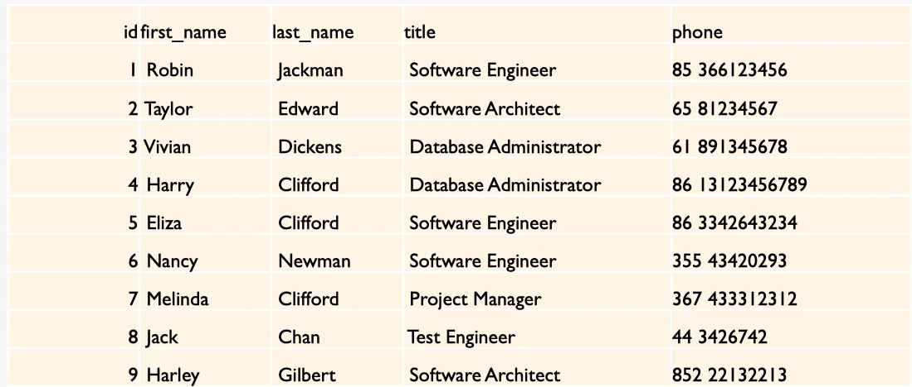
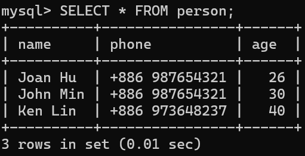

# 目錄
- [介紹SQL]
  - [什麼是資料庫](#什麼是資料庫)
  - [SQL 和 NOSQL](#SQL-和-NOSQL)
  - [為什麼選擇 MySQL](#為什麼選擇-MySQL)
  - [MySQL 版本的選擇](#MySQL-版本的選擇)
- [Database和Table](#Database-和-Table)
  - [本章介紹](#本章介紹)
  - [資料庫的基本操作](#資料庫的基本操作)  
  - [為什麼要輸入分號執行SQL](#為什麼要輸入分號執行-SQL) 
  - [SQL 大小寫的問題](#SQL-大小寫的問題)
  - [表的基本介紹](#表的基本介紹)
  - [資料類型的基本介紹](#資料類型的基本介紹)
  - [表的創建和基本操作](#表的創建和基本操作)  
  - [範例](#範例)   
- [Database Insert 資料插入](#Database-Insert-資料插入)
  - [本章介紹](#本章介紹)
  - [資料插入](#資料插入)  
  - [SELECT語句的基本用法](#SELECT-語句的基本用法) 
  - [NULL 和 NOT NULL](#NULL-和-NOT-NULL)
  - [設置默認值](#設置默認值)
  - [PRIMARY KEY 介紹](#PRIMARY-KEY-介紹)  
  - [UNIQUE 字段](#UNIQUE-字段)
  - [練習](#練習)
- [基本的增刪查改](#基本的增刪查改)    
　- [本章介紹](#本章介紹) 
  - [學習使用sql文件](#學習使用sql文件) 
  - [資料準備](#資料準備) 
  - [SELECT 語句](#SELECT-語句)
  - [WHERE 語句](#WHERE-語句)
  - [UPDATE 語句](#UPDATE-語句)
  - [DELETE 語句](#DELETE-語句)
  - [CRUD 練習](#CRUD-練習)

　
# 介紹SQL

## 什麼是資料庫

**資料庫有已下的特徵:**

1. Collection of Data: 資料的收集器(集合)



> Find Nancy's phone number?

2. Methods for accessing and manipulating that data

> Database vs. DBMS(Database Management system)


DBMS: 對database存取的橋梁
Database: 存取資料的方式

透過DBMS可以訪問獲取資料，或對資料進行編輯刪除等操作

宏觀意義上的database: DBMS+Database

市面上有很多不同的DBMS，使用者可以透過這些DBMS去和Database做交互

## SQL 和 NOSQL

> SQL:(prounced"ess-que-el") stands for **Structured Query Language**. SQL is used to communicate with a database. According to ANSI(American National Standards Institue), it is the standard language for **relational database** management systems.

[資料來源](https://en.wikipedia.org/wiki/SQL)


## 為什麼選擇 MySQL

根據[資料庫網站](https://db-engines.com/en/ranking)排名


> 第一、第二是商業軟體都要收費，所以選擇MySQL

# Database和Table

## 本章介紹

- A **database** is just a bunch of **tables**
- Tables hold the **data** (a collection of related data held in a **structured format** within a database)

## 資料庫的基本操作

- 顯示當前有哪些databases

```sql
SHOW databases;
```


- 創建databases

```sql
CREATE DATABASE <name>;
```
> name可以是任意的數字和字母組成但不能有空格


- 刪除databases

```sql
DROP DATABASE <name>;
```


- databases切換

```sql
USE <database name>;
```


- 查看當前正再使用哪個database

```sql
SELECT database();
```


> 預設使用的database是null


## 為什麼要輸入分號執行SQL

> 在SQL裡面`;`代表語句的結束，若沒有輸入，SQL會不知道語句已經結束，會報錯

這個`;`是可以變的，改變可以通過下面語法:

```SQL
delimiter $$
```


## SQL 大小寫的問題

[stackOverfolw](https://stackoverflow.com/questions/292026/is-there-a-good-reason-to-use-upper-case-for-sql-keywords)

> 建議KEYWORDS大寫，並且每遇到關鍵字就換行，這並不強制，小血也可以執行

## 表的基本介紹

- A database is just a bunch of **tables**
- Tables hold the **data in a structured format**


每個table都有column、row

header: Name、Phone、Age
data: 剩餘的部分


## 資料類型的基本介紹


- Numeric Types
  - INT
  - SMALLINT
  - MEDIUMINT
  - BIGINT
  - DECIMAL
  - NUMERIC
  - FLOAT
  - DOUBLE
  - BIT
 - String Types
  - CHAR
  - VARCHAR
  - BINARY
  - VARNINARY
  - BLOB
  - TINYBLOB
  - MEDIUMBLOB
  - LONGLOB
  - TEXT
  - TINYTEXT
  - MEDIUMTEXT
  - LONGTEXT
  - ENUM
 - Data Types
  - DATE
  - DATETIME
  - TIMESTAMP
  - TIME
  - YEAR 

[官方網站](https://dev.mysql.com/doc/refman/8.4/en/data-types.html)
[w3s](https://www.w3schools.com/mysql/mysql_datatypes.asp)

## 表的創建和基本操作

### 創建table

```sql
CREATE TABLE table_name(
  column_name data_type,
  column_name data_type,
  ...
);
```

- 驗證是否建立成功

```SQL
DESC <table name>;
```

**範例**

```sql
CREATE TABLE person
(
  name VARCHAR(20),
  phone VARCHAR(20),
  age INT
);
```

- 驗證是否建立成功

```SQL
DESC person;
```


### 基本操作

- 顯示當前database底下所有的table

```sql
SHOW TABLES;
```


- 展示此table的columns和每個columns的資訊

```sql
SHOW COLUMNS FROM <table_name>;
```


- 顯示當前table的資訊

```sql
DESC <table name>;
```


- 刪除table

```sql
DROP TABLE <table name>;
```


## 範例

- Please create a table for employees in a comapny
- Data include: employee number, birth of date, first name, last name, gender,hired data.


```sql
CREATE TABLE employee(
  eid INT,
  birth_date DATE,
  first_name VARCHAR(20),
  last_name VARCHAR(20),
  gender EMUM('M','F'),
  hired_date DATE
);
```

> [ENUM](https://dev.mysql.com/doc/refman/8.4/en/enum.html): 枚舉

> [DATE](https://dev.mysql.com/doc/refman/8.4/en/datetime.html): 2025-11-12


# Database Insert 資料插入

## 本章介紹

1. How to insert one/many data into MySQL Table?
2. How to check inserted data?
3. How to create table with advanced requirements for columns?

## 資料插入

**一條插入**

```sql
INSERT INTO <table_name>(
  column1_name,
  column2_name,
  ...
)
VALUES(
  column1_value,
  column2_value,
  ...
);
```
> columnName一定的順序要對應到columnValue的順序

```sql
INSERT INTO person(
  name,
  phone,
  age
)
VALUES(
  "Joan Hu",
  "+886 987654321",
  26
);
```


**多條插入**

```sql
INSERT INTO <table_name>(
  column1_name,
  column2_name,
  ...
)
VALUES(
  row1_column1_value,
  row1_column2_value,
  ...
),(
  row2_column1_value,
  row2_column2_value,
  ...
),(
  row3_column1_value,
  row3_column2_value,
  ...
)...;
```
> columnName一定的順序要對應到columnValue的順序

```sql
INSERT INTO person(
  name,
  phone,
  age
)
VALUES(
  "Joan Hu",
  "+886 987654321",
  26
),(
  "John Min",
  "+886 984567890",
  30
),(
  "Ken Lin",
  "+886 973648237",
  40
);
```


## SELECT語句的基本用法

- 把table裡面所有資料，以表格的資料打印出來

```sql
SELECT * from table_name;
```


- 把指定COLUMN的資料以表格的形式打印出來

```sql
SELECT column_name from table_name;
```


## NULL 和 NOT NULL

Field: 資料HEADER
Type: 每一column是什麼樣的資料類型
Null: 此COLUMN資料是否能夠不填
Default: 不填時會產生的值


- 如何產生`NOT NULL`

```SQL
CREATE TABLE <table_name>(
  column1_name data_type NOT NULL,
  column2_name data_type,
  column3_name data_type
);
```

```SQL
CREATE TABLE person2(
  name VARCHAR(20) NOT NULL,
  phone VARCHAR(20),
  age INT
);
```


## 設置默認值

```sql
CREATE TABLE <table_name>(
  column1_name data_type DEFAULT "DEFAULT_VALUE",
  column2_name data_type,
  ...
);
```
```sql
CREATE TABLE person3 (
  name VARCHAR(20) DEFAULT "no name",
  phone VARCHAR(20),
  age INT
);
```


## PRIMARY KEY 介紹

> 想要某一欄位是獨一讀二，不允許重複，可以使用KEY

```sql
CREATE TABLE <table_name>(
  column1_name data_type,
  column2_name data_type,
  ...,
  PRIMARY_KEY (column1_name)
);
```
```sql
CREATE TABLE person4 (
  name VARCHAR(20),
  phone VARCHAR(20),
  age INT,
  PRIMARY_KEY (phone)
);
```


> 讓key以數字的方式自動增加

```sql
CREATE TABLE <table_name>(
  column1_name INT AUTO_INCREMENT,
  column2_name data_type,
  column3_name data_type,
  ...,
  PRIMARY_KEY (column1_name)
);
```
```sql
CREATE TABLE person5 (
  id INT AUTO_INCREMENT,
  name VARCHAR(20),
  phone VARCHAR(20),
  age INT,
  PRIMARY_KEY (id)
);
```


## UNIQUE 字段

```sql
CREATE TABLE <table_name>(
  column1_value data_type PRIMARY KEY,
  column2_value data_type UNIQUE
);
```

```sql
CREATE TABLE table_test(
  a INT PRIMARY KEY,
  b VARCAHR(10) UNIQUE
);
```


> UNIQUE若是null則可以重複，Primary key不能為空，也不能重複

- primary key可以有很多個

> 錯誤設定方式

```sql
CREATE TABLE <table_name>(
  column1_value data_type PRIMARY KEY,
  column2_value data_type PRIMARY KEY,
  column3_value data_type,
);
```

```sql
CREATE TABLE test_table2(
  a INT PRIMARY KEY,
  b INT PRIMARY KEY,
  c INT
);
```


> 正確方式
```sql
CREATE TABLE <table_name>(
  column1_value data_type,
  column2_value data_type,
  column3_value data_type,
  PRIMARY KEY(column1_value,column2_value);
);
```

```sql
CREATE TABLE test_table2(
  a INT,
  b INT,
  c INT,
  PRIMARY KEY(a,b);
);
```


**Primary key vs. UNIQUE**

| 條件 | 	NULL 是否可存在|可否有多個在同一張表|是否可以用多欄位|
|------|----------------|------------------|---------------|
|Primary Key（主鍵）|不可以（必須 NOT NULL）|不可以（每個表只能有一個 Primary Key）|可以（複合主鍵）|
|UNIQUE（唯一約束）|可以（但只能有一筆是 NULL，依資料庫而異）|可以（一個表可以有多個 UNIQUE 約束）|可以（複合 UNIQUE 約束）|

## 練習


```sql
CREATE TABLE employee (
  eid INT AUTO_INCREMENT,
  birth_date DATE NOT NULL,
  first_name VARCHAR(20) NOT NULL,
  last_name VARCHAR(20) NOT NULL,
  gender ENUM('M','F') NOT NULL,
  hired_date DATE NOT NULL DEFAULT "2000-01-01"
);
```


# 基本的增刪查改

## 本章介紹

- CRED
 - C: Create 增加
 - R: Read  讀取
 - U: Update 更新
 - D: Delete 刪除

## 學習使用sql文件

- 步驟:
 - step1: 先用指令`CREATE DATABASE <DATABASE_NAME>`創建database，並用指令`USE <DATABASE_NAME>`切換database
 - step2: 創建一個`.sql`檔案，並且在裡面寫下創建table的指令
 - step3: 複製此檔案的絕對路徑到MYSQL的Command裡面
 - step4: 輸入`source <url>;`執行sql檔案，執行完候用`DESC <TABLE_NAME>`或`SELECT * FROM <TABLE_NAME>`等指令，確認是否創建正確


## 資料準備
## SELECT 語句
## WHERE 語句
## UPDATE 語句
## DELETE 語句
## CRUD 練習