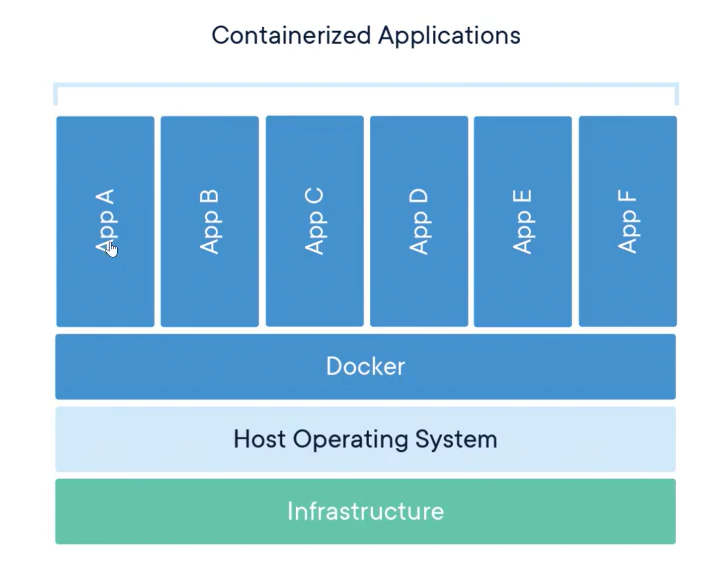
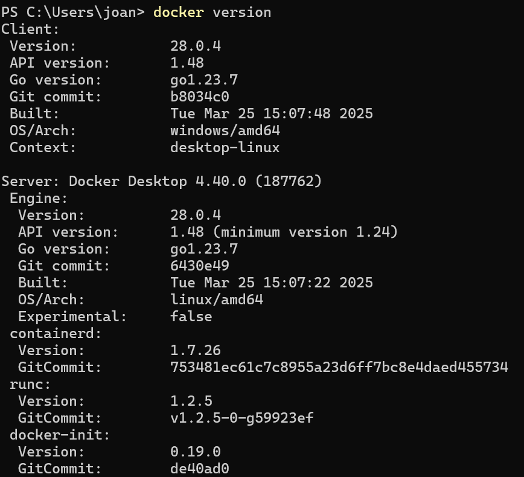
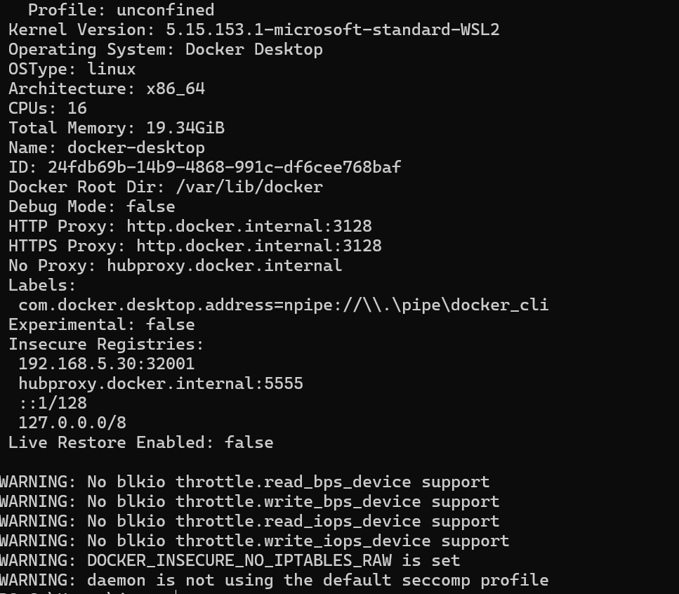
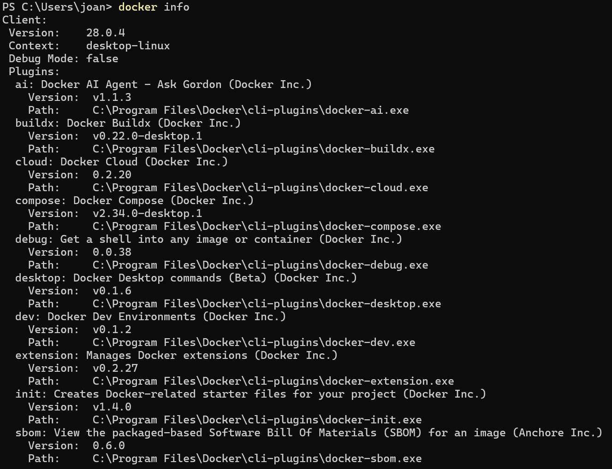
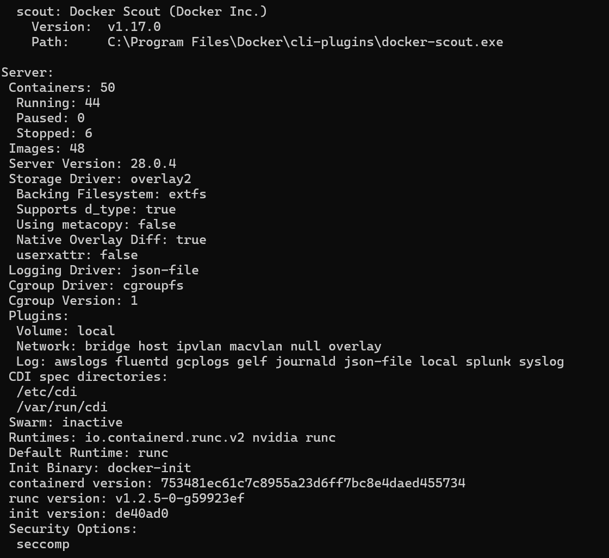
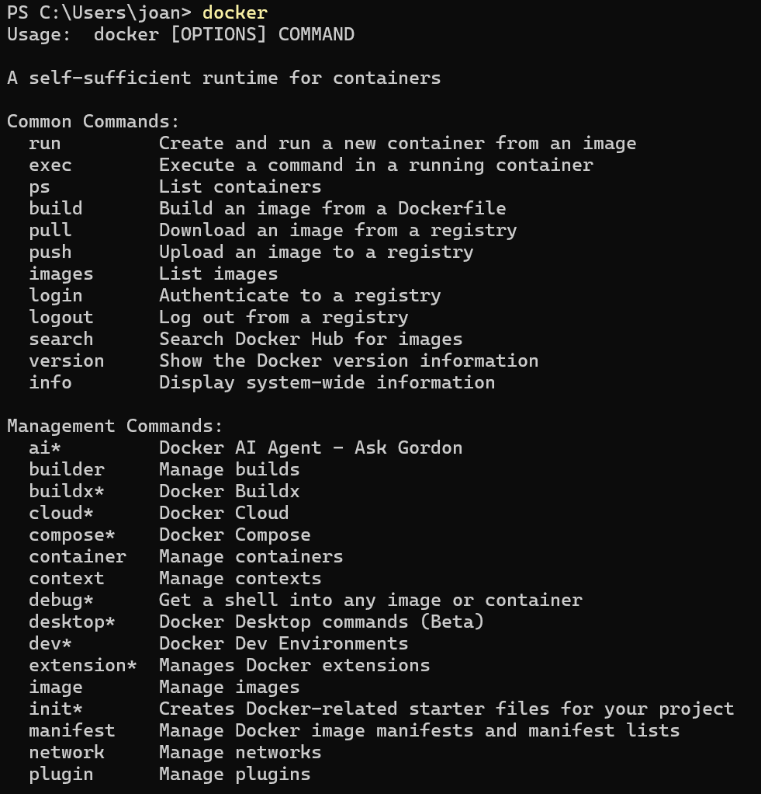
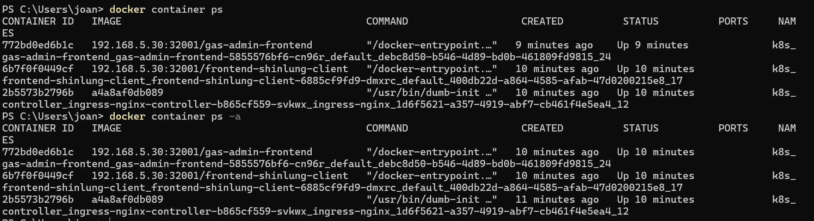
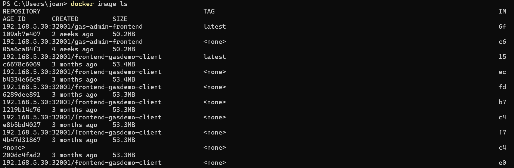

# 目錄

- [Docker 的介紹和安裝](#Docker-的介紹和安裝)
  - [容器技術介紹](#容器技術介紹)
- [容器快速上手](#容器快速上手)
  - [認識一下Docker命令行](#認識一下Docker命令行)
  - [鏡像和容器](#鏡像和容器)
  - [創建我們第一個容器](#創建我們第一個容器)
  - [命令行技巧之批量操作](#命令行技巧之批量操作)
  - [容器的 attached 和 detached 模式](#容器的-attached-和-detached-模式)
  - [容器的交互模式](#容器的交互模式)
  - [windows 是如何運行 docker engine](#windows-是如何運行-docker-engine)
  - [容器和虛擬機](#容器和虛擬機)
  - [創建容器時背後到底發生了什麼](#創建容器時背後到底發生了什麼)

## Docker 的介紹和安裝

### 容器技術介紹

1. Docker不等於容器(Container)，他只是實現容器的一種方法

2. 要談容器我們需要先看一下他的演變史
  - 最一開始是PC(1990年代)
  - 再來才是是虛擬機(2000年代)
  - 接著雲技術出現(2010年代初)
  - 最後容器成為主流（2010年代中期）

3. 容器是什麼?
 - 它是一種打包的技術，它有三個特點:
  - 標準化:使用相同的規則和方法打包，所以無論是要裝固體、液體或、是方形和圓形都可以用相同的方式打包來
  - 輕量級:這個特性是跟虛擬機去比較的
  - 易移植:這特點十分容易理解，畢竟都已經標準化，那移植當然也容易，想像一下我每個盒子都是同樣大小，那我搬運和拿走時不就很輕鬆嗎?

4. 什麼是Linux container(容器技術)?
 - 容器技術是建立在 Linux 提供的 namespace（命名空間）和 cgroup（控制群組）之上：
   - namespace（命名空間）：提供環境隔離，讓每個容器擁有獨立的檔案系統、網路、行程等，彼此互相獨立。
   - cgroup（控制群組）：用來限制和管理容器可使用的資源，如 CPU、記憶體、IO 等，避免資源爭用。

**什麼是Docker?**

> Docker 是一個讓你把應用程式和相依環境一起封裝成容器的工具，能在任何支援 Docker 的作業系統上執行，實現環境一致性和高效部署。




**容器的標準化**

1. 運行時標準化(runtime spec): 規範如何下載鏡像、創建容器、啟動容器等。

2. 鏡像標準化(image spec): 定義鏡像的基本模式，例如人基本就有頭，身軀和四肢像這樣

**為什麼大家要使用容器?容器到底有什麼好?**

> 因為速度!!!

容器可以加速軟體開發、程式編譯、測試、部屬、更新和故障恢復

## 容器快速上手

### 認識一下Docker命令行

1. 確認本版

```shell
docker version
```



2. 當前docker基本狀態，一樣有client和server

```shell
docker info
```





3. 查詢所有的docker命令有那些用法

```shell
docker
```


4. 若要查詢此指令有何用處需使用`--help`

```shell
docker container --help
```


5. 查詢現在運行的容器

```shell
docker container ps
```
6. 查詢當前所有的容器

```shell
docker container ps -a
```


7. 列出所有鏡像

```shell
docker image ls
```


### 鏡像和容器

**鏡像(image)**

1. 是一個只可讀的文件
2. 這文件裡面包含原始程式碼、工具等一些應用程式需要的文件
3. 可以把其看成一個模板
4. docker image有分層的概念

**容器(container)**

1. 會複製所有的image並且在最上層加一層container layer
2. 這層可寫可讀，是用來管理底下的那些image文件
3. 基於同一個image可以創建多個container
 - image 就像「食譜」，container 像是「照食譜做出來的料理」。
 - 同一份食譜可以做出很多盤相同的菜，每盤彼此獨立；其中一盤加鹽不會影響其他盤。


### 創建我們第一個容器

1. 創建容器指令

```shell
docker container run <image>
```

2. 停止容器

```shell
docker container stop <names> or <id>
```

**id小技巧，可以只寫前幾位**

3. 查看所有容器(ps和ls都可以使用)

```shell
docker container ps -a
```

4. 查看已經在運行的容器(ps和ls都可以使用)

```shell
docker container ps
```

4. 刪除容器

```shell
docker container rm <names> or <id>
```


### 命令行技巧之批量操作

1. 可以一次停止多個容器

**方法1**

```shell
docker container stop <id1> <id2> <id3> <id4>
```

**方法2**

先找出所有container的id

```shell
docker container ps -aq
```

把id傳給暫停指令

```shell
docker container stop $(docker container ps -aq)
```

**同樣的方法也可以用在刪除，只要把`stop`改成`rm`就可以了！**

> 但rm不能刪除正在運行的container，若要刪除要使用

```shell
docker container rm <id> -f
```
> `-f`:就是強制停止加刪除