# 目錄

- [Docker 的介紹和安裝](#Docker-的介紹和安裝)
  - [容器技術介紹](#容器技術介紹)
- [容器快速上手](#容器快速上手)
  - [認識一下Docker命令行](#認識一下Docker命令行)
  - [映像和容器](#映像和容器)
  - [創建我們第一個容器](#創建我們第一個容器)
  - [命令行技巧之批量操作](#命令行技巧之批量操作)
  - [容器的 attached 和 detached 模式](#容器的-attached-和-detached-模式)
  - [容器的交互模式](#容器的交互模式)
  - [windows 是如何運行 docker engine](#windows-是如何運行-docker-engine)
  - [容器和虛擬機](#容器和虛擬機)
  - [創建容器時背後到底發生了什麼](#創建容器時背後到底發生了什麼)
- [映像的創建管理和發布](#映像的創建管理和發布)
  - [映像獲取的方式](#映像獲取的方式)
  - [映像的registry介紹](#映像的registry介紹)
  - [映像的獲取和查看](#映像的獲取和查看)
  - [docker 映像的導入和導出](#docker-映像的導入和導出)
  - [Dockerfile 的介紹](#Dockerfile-的介紹)
  - [映像的建構和分享](#映像的建構和分享)
  - [通過 commit 創建映像](#通過-commit-創建映像)
  - [scratch 映像](#scratch-映像)

## Docker 的介紹和安裝

### 容器技術介紹

1. Docker不等於容器(Container)，他只是實現容器的一種方法

2. 要談容器我們需要先看一下他的演變史
  - 最一開始是PC(1990年代)
  - 再來才是是虛擬機(2000年代)
  - 接著雲技術出現(2010年代初)
  - 最後容器成為主流（2010年代中期）

3. 容器是什麼?
 - 它是一種打包的技術，它有三個特點:
  - 標準化:使用相同的規則和方法打包，所以無論是要裝固體、液體或、是方形和圓形都可以用相同的方式打包來
  - 輕量級:這個特性是跟虛擬機去比較的
  - 易移植:這特點十分容易理解，畢竟都已經標準化，那移植當然也容易，想像一下我每個盒子都是同樣大小，那我搬運和拿走時不就很輕鬆嗎?

4. 什麼是Linux container(容器技術)?
 - 容器技術是建立在 Linux 提供的 namespace（命名空間）和 cgroup（控制群組）之上：
   - namespace（命名空間）：提供環境隔離，讓每個容器擁有獨立的檔案系統、網路、行程等，彼此互相獨立。
   - cgroup（控制群組）：用來限制和管理容器可使用的資源，如 CPU、記憶體、IO 等，避免資源爭用。

**什麼是Docker?**

> Docker 是一個讓你把應用程式和相依環境一起封裝成容器的工具，能在任何支援 Docker 的作業系統上執行，實現環境一致性和高效部署。


**容器的標準化**

1. 運行時標準化(runtime spec): 規範如何下載映像、創建容器、啟動容器等。

2. 映像標準化(image spec): 定義映像的基本模式，例如人基本就有頭，身軀和四肢像這樣

**為什麼大家要使用容器?容器到底有什麼好?**

> 因為速度!!!

容器可以加速軟體開發、程式編譯、測試、部屬、更新和故障恢復

## 容器快速上手

### 認識一下Docker命令行

1. 確認本版

```shell
docker version
```


2. 當前docker基本狀態，一樣有client和server

```shell
docker info
```


3. 查詢所有的docker命令有那些用法

```shell
docker
```


4. 若要查詢此指令有何用處需使用`--help`

```shell
docker container --help
```
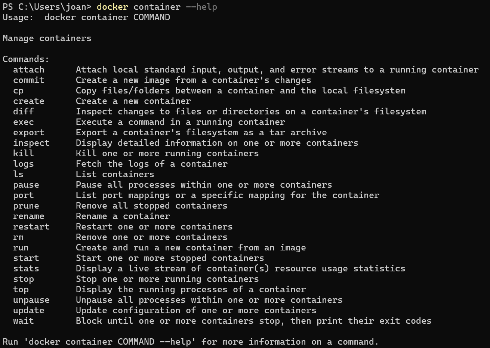

5. 查詢現在運行的容器

```shell
docker container ps
```
6. 查詢當前所有的容器

```shell
docker container ps -a
```


7. 列出所有映像

```shell
docker image ls
```


### 映像和容器

**映像(image)**

1. 是一個只可讀的文件
2. 這文件裡面包含原始程式碼、工具等一些應用程式需要的文件
3. 可以把其看成一個模板
4. docker image有分層的概念

**容器(container)**

1. 會複製所有的image並且在最上層加一層container layer
2. 這層可寫可讀，是用來管理底下的那些image文件
3. 基於同一個image可以創建多個container
 - image 就像「食譜」，container 像是「照食譜做出來的料理」。
 - 同一份食譜可以做出很多盤相同的菜，每盤彼此獨立；其中一盤加鹽不會影響其他盤。

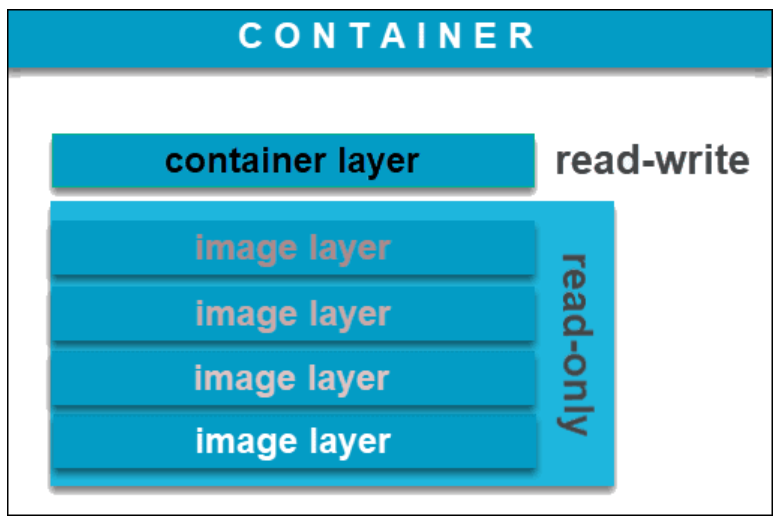
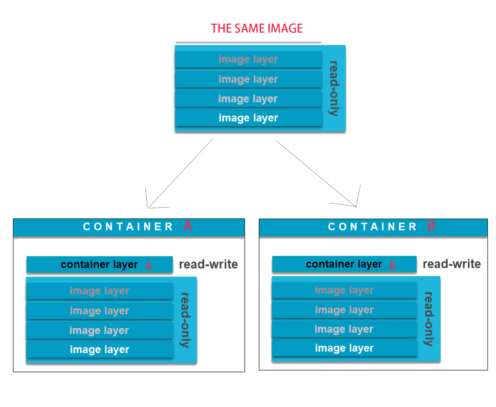

### 創建我們第一個容器

1. 創建容器指令

```shell
docker container run <container-name>
```

2. 停止容器

```shell
docker container stop <container-name> or <id>
```

**id小技巧，可以只寫前幾位**

3. 查看所有容器(ps和ls都可以使用)

```shell
docker container ps -a
```

4. 查看已經在運行的容器(ps和ls都可以使用)

```shell
docker container ps
```

4. 刪除容器

```shell
docker container rm <container-name> or <id>
```


### 命令行技巧之批量操作

1. 可以一次停止多個容器

**方法1**

```shell
docker container stop <id1> <id2> <id3> <id4>
```

**方法2**

先找出所有container的id

```shell
docker container ps -aq
```

把id傳給暫停指令

```shell
docker container stop $(docker container ps -aq)
```

**同樣的方法也可以用在刪除，只要把`stop`改成`rm`就可以了！**

> 但rm不能刪除正在運行的container，若要刪除要使用

```shell
docker container rm <id> -f
```
> `-f`:就是強制停止加刪除

### 容器的 attached 和 detached 模式

#### attached 模式

```shell
docker container run -p 8082:80 nginx
```

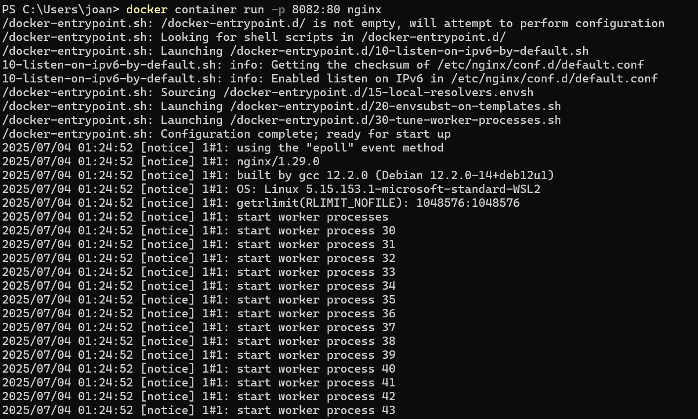


> 若按下 Ctrl+C 會讓容器終止


**透過此方式，讓容器在前台（attached）執行，此模式會把容器內的輸出即時打印到本地終端，因此你在本地可以直接看到容器裡的 log。**

> 本尊(本地)的行為或受傷會直接影響影分身(容器)

#### detached 模式

```shell
docker container run -d -p 8082:80 nginx
```


> 只會輸出此容器的 ID，且此時終端不會顯示容器的 log。

**透過此方式，讓容器在後台（detached）執行，這樣無論你在本地做什麼都不會影響到容器的運作。**

> 如同本尊(本地)的行動或受傷不會影響影分身(容器)，影分身成為獨立的個體持續運行。

=> 那要如何可以連接到影分身(容器)呢?

```shell
docker attach <container-id>
```


>此指令可以和特定容器的標準輸入輸出做連結，此時你會看到容器即時的 log，並且此連結也會讓本地的行為影響容器，例如在本地 Ctrl+C 退出 attach 時，容器也可能跟著終止（視容器應用行為而定）。

**在使用上一般推薦使用detach模式**

### 容器的交互模式

> 查看log

```shell
docker container logs <id>
```


> 動態查看log

```shell
docker container logs -f <id>
```


> 要如何進入container內部去下指令?

```shell
docker exec -it <id> sh
```

就可以進去裡面下shell的指令


**離開時使用exit即可**

> 也可以用這只另去創建一個交互作用的container

```shell
docker container run -it busybox sh
```

在裡面可以做的只另有

1. 查看目錄

```shell
ls
```

2. 搜尋ip位置

```shell
ip a
```

3. 做ping操作

```shell
ping www.google.com
```

4. 退出

```shell
exit
```


### windows 是如何運行 docker engine


> 用`docker version` 指令時察看，會發現到client端的 OS/Arch是windows/amd64，但Server端的則是linux/amd64

**代表目前是用 Windows 控制端操作，但實際的 Docker Engine 是跑在 Linux 環境中。**

Windows 並不直接執行 Docker Engine，而是透過虛擬化架構（如 Hyper-V 或 WSL2）啟動一個 Linux 虛擬機，Docker Engine 則在此環境內運行。


**在哪裡執行？Hyper-V or WSL2？**

你可能會看到以下兩種情況之一：

1. 使用 Hyper-V 模式
可在 Hyper-V 管理員中看到一台 DockerDesktopVM 虛擬機


2. 使用 WSL2 模式
若 Docker Desktop → Settings → General 有勾選 「Use the WSL 2 based engine」
表示 Docker Engine 是執行在 WSL 2 環境中，不會出現在 Hyper-V 管理員中


### 容器和虛擬機

**如何連接容器到shell命令提示**

1. 在創立的時候就直接連接

```shell
docker container run -it busybox sh
```

2. 在一個已經運行的容器裡，執行額外的shell命令

```shell
docker conatiner exec -it <container-id> sh
```

**虛擬機 vs 容器**

虛擬機:需要創建出或安裝完整的作業系統(OS)，虛擬機的底層需要Hypervisor(VMware、Virtual Box...等)

容器:運行在容器引擎之上的一個應用程式，並不是一個獨立的作業系統，而只是一個應用程式，應用程式裡面又會包含一個或多個process

**統整**

1. 容器並不是mini虛擬機

2. 容器是一個或多個的process

4. 容器中的process有限制其CPU和記憶體等資源的訪問

3. 當應用程式停止(所有process都停止)，容器也會停止


> 顯示容器裡的所有process

```shell
docker container top <container-id>
```


可以由上圖的CMD可知，第一個是主process；下面的worker是副process

PID:此process的id

PPID:此 process的父process的id

這些process是運行在docker引擎上面，若用windows系統就有可能是運行在Hyper-V的虛擬機裡面或WSL2裡面


> 由上圖可知，容器內部的id和外部的顯示是不同的

### 創建容器時背後到底發生了什麼

```shell
docker container run -d --publish 80:80 --name webhost nginx
```
step1：在本地檢查是否已有 nginx 映像（image），如果沒有則進入 step2，否則跳至 step4  
step2：從遠端映像倉庫（預設是 Docker Hub）查找 nginx 映像  
step3：拉取（pull）最新版本的 nginx 映像（例如：latest 標籤）  
step4：基於 nginx 映像創建一個新的容器  
step5：Docker Engine 為該容器分配一個內部 IP 地址（通常屬於 bridge 網路）  
step6：將本地 port 80 映射（publish）到容器的 port 80 上（透過 NAT 轉發）  
step7：啟動容器，並執行映像中定義的預設指令（CMD，例如啟動 nginx）


## 映像的創建管理和發布

### 映像獲取的方式

映像（Image）的獲取方式主要可以分為三種，依據是否需要連網，可以再細分為兩大類：

🔗 一、需連網的方式
這是最常見的方式，又可分為兩種：

從 Registry 直接拉取映像

Public Registry：如 Docker Hub，任何人都可以自由拉取映像。

Private Registry：例如公司內部建置的私有 Registry，只有授權使用者可以拉取映像。

使用 Dockerfile 撰寫映像

利用 docker build 根據 Dockerfile 建立映像，過程中通常需要連網下載 base image 或相關套件。

📌 難易程度比較：
使用 Registry 拉取映像最簡單，通常只需一行指令（如 docker pull）；而撰寫 Dockerfile 則較為繁瑣，需要撰寫多行設定與指令，較有彈性但也更麻煩。

🔌 二、離線方式（不需連網）
這種方式較少見，但在無法上網或封閉環境中仍會使用：

透過映像檔（.tar）離線安裝

先在有網路的環境中使用 docker save 將映像儲存為 .tar 檔案，透過 USB 等方式拷貝至目標機器，再用 docker load 匯入。

✅ 總結

| 類型 | 方法                            | 是否連網 | 難易度         |
| -- | ----------------------------- | ---- | ----------- |
| 1  | 從 Registry 拉取（Public/Private） | 需要   | 簡單          |
| 2  | 使用 Dockerfile 自建映像            | 需要   | 較難          |
| 3  | 使用 `.tar` 檔案匯入                | 不需要  | 中等（準備階段較麻煩） |


### 映像的registry介紹

常用拉取映像的registry

1. (Docker Hub)[https://hub.docker.com/]
2. (Red Head Quay)[https://www.redhat.com/en/technologies/cloud-computing/quay]


> 如上圖所示，推薦使用官方版本，較安全

docker hub免費版有一些限制可以從(docker hub pricing)[https://www.docker.com/pricing/]所觀察到

### 映像的獲取和查看

```shell
docker image --help
```
查看 docker image 子指令有哪些可用操作


1. pull 拉取映像最簡單

我們可以去 Docker Hub 或 Red Hat Quay 查詢所需映像


例如:拉取nginx映像

```shell
docker image pull nginx
```
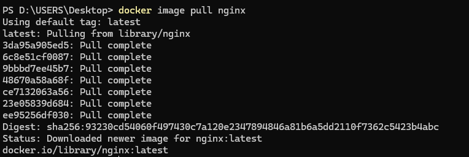

> 什麼都沒打可以從第一行看出會自動下載latest(最新版本)

若要指定版本，那在其指令後面加上`:+版本號`即可

```shell
docker image pull nginx:1.20.0
```


**版本號的查詢可以在Tags裡面查詢**


2. 用inspect指令查詢image裡面的詳細資料

```shell
docker image inspect <image-id>
```


**Architecture: "amd64" 表示此 image 為 x86_64 架構，若你的電腦是舊款 Apple M1/M2（ARM 架構）可能無法直接執行，需另找支援 ARM 架構的版本。**

3. 查詢目前所有的image

```shell
docker image ls
```


4. 用rm指令刪除映像

```shell
docker image rm <image-id>
```

**請注意若映像存在在容器裡，無論容器是否有在運行中都無法刪除，唯一可以刪除映像的條件為使用此映像容器全部被刪除後，才可刪除映像**


- 停止容器運行

```shell
docker container stop <container-id>
```

**會發現依舊無法刪除image，因為即使容器已停止，image 仍被 container 使用，所以還是無法刪除**


- 刪除整個容器

```shell
docker container rm -f <container-id>
```


> 才可以刪除掉image

### docker 映像的導入和導出

**在離線的方式使用save和load去做映像的導入和導出**

1. save 指令使用方法

```shell
docker image save <image-name:image-version> -o <file-name>
```

`-o`: output也就是輸出

```shell
docker image save nginx:1.20.0 -o nginx.image
```

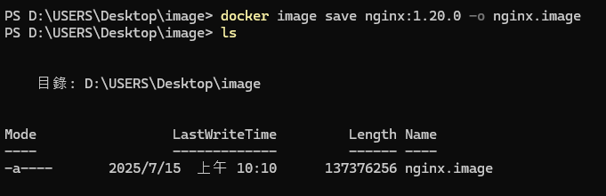

> 此時在此目錄底下就應該可以的到此文件

2. load的指令方法

```shell
docker image load -i <filePath\fileName>
```
`-i`: input輸入的意思

```shell
docker image load -i .\nginx.image
```
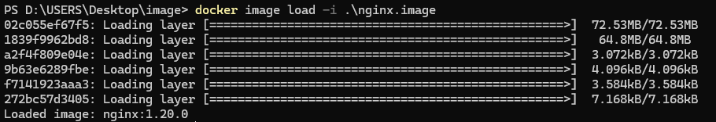


### Dockerfile 的介紹

**什麼是Dockerfile?**

1. dockerfile是用來建造映象的文件
2. dockerfile裡面包含建造映象的指令
3. dockerfile裡面的指令有他自己的與法規範

[Dockerfile的語法](https://docs.docker.com/reference/dockerfile/)

> 舉例:若我們要在一台ubuntu 22.04上運行下面hello.py的python檔案該如何執行?

```py
print("hello world")
```

第一步準備python環境

```shell
apt-get update && \
DEBIAN_FRONTEND=noninteractive apt-get install -y python3 python3-pip python3-venv
```

說明：
- sudo apt-get update：更新套件列表
- DEBIAN_FRONTEND=noninteractive：避免安裝時出現互動式提示（常用於自動化部署）
- apt-get install -y：自動安裝（不需要使用者輸入 Y）
- python3：Python 解譯器
- python3-pip：Python 的套件管理工具
- python3-venv：虛擬環境工具，方便你管理不同專案的相依套件

第二步:運行hello.py

```shell
python3 hello.py
```

> 那我們要如何在Dockerfile裡面去實現呢

```dockerfile
FROM ubuntu:22.04
RUN apt-get update && \
    DEBIAN_FRONTEND=noninteractive apt-get install -y python3 python3-pip python3-venv
ADD hello.py /
CMD ["python3", "/hello.py"]
```
說明：
- FROM:選擇此os作為我們的docker image，做為基礎的image導入進來，此指令如同只用第三方的庫像是`import`或`include`等等。
- RUN:執行後面的指令；在這裡是安裝python環境
- ADD:新增hello.py檔案在映像的根目錄
- CMD：執行裡面的指令(hello.py這個檔案)

### 映像的建構和分享

1. 創建docker image的指令

```shell
docker image build -t <docker-image-name>:<version> <file-path>
```
`-t`: tag,也就是標記image的名字

若version沒有寫那會預設為最新版的

範例:

```shell
docker image build -t hello .
```

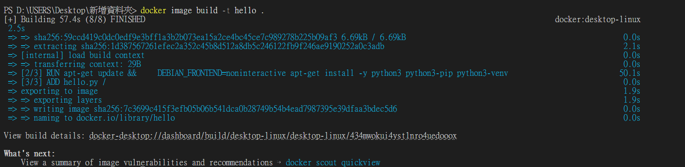

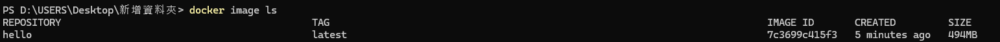

> 要如何啟動這image?執行下面這指令

```shell
docker run -it <image-name>
```

`-it`: 交互作用

例如:

```shell
docker run -it hello
```
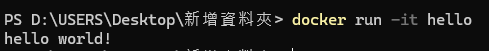

在我們打

```shell
docker container ls -a
```

時可以看到當檔案被執行完時也就退出了這個process


**要如何把自己的image推到docker hub裡?**

1. 首先要先符合image名字的規範，為自己的docker hub帳號名稱/image 名稱

方法一:從新建立一個符合docker hub名字規範的image

```shell
docker image build -t <dockerhub-name>/<image-name>:<image-version> <file-path>
```

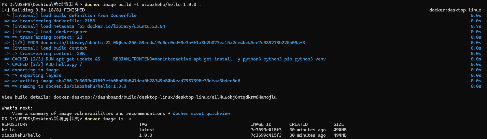

從上圖可以觀察到，這兩個image id是一樣的，因為他們是用同一種方式置做出來的

2. 複製以經做出來的tag把他改名為符合docker hub名字規範的image

```shell
docker image tag <original-name>:<original-version> <changed-name>:<changed-version>
```

> 例如

```shell
docker image tag hello xiaozhehu/hello:1.0.0
```

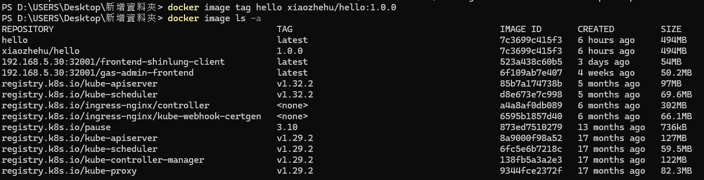


**小提示:若要刪除的image，他的image id 跟別人一樣時，不能打image id做刪除，需要打tag(名稱)**

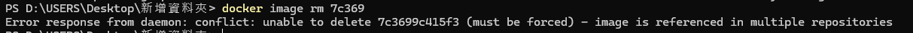
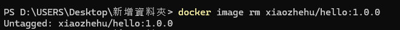

#### 如何把本地的image推送到docker hub裡面呢?

第一步:先在本地登入docker

```shell
docker login
```
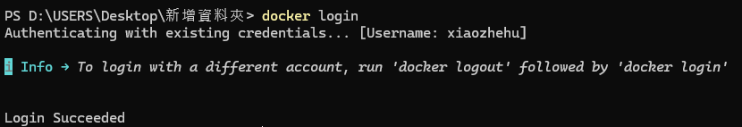

第二步:輸入push指令

```shell
docker push <docker-hub-name>/<docker-image-name>:<docker-image-version>
```
`<docker-hub-name>/<docker-image-name>:<docker-image-version>`: 我們剛剛所改的那image的tag

> 例子

```shell
docker push xiaozhehu/hello:1.0.0
```
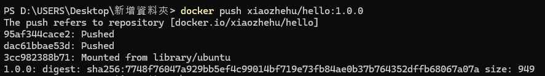
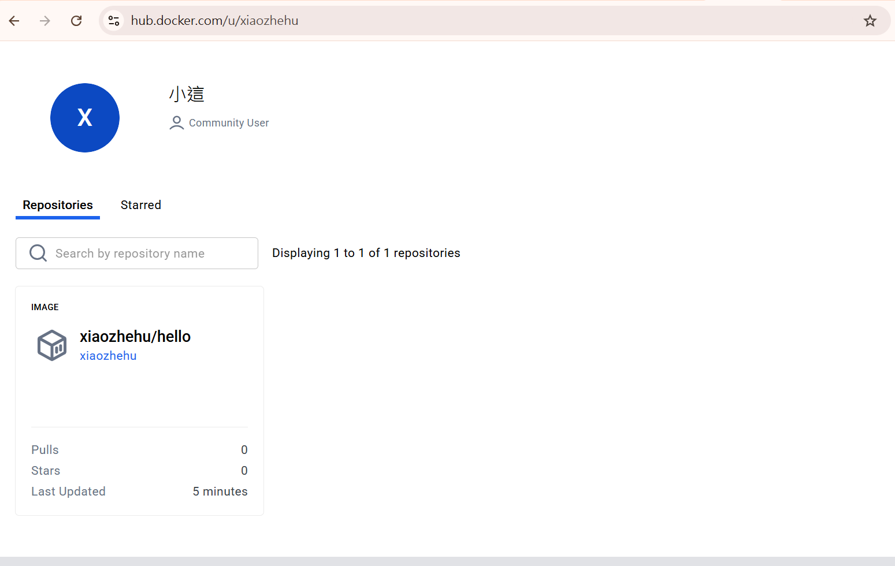

> 我們可以把剛上傳的image拉下來看看是否真的可以執行

步驟一: 把image拉下來

```shell
docker pull <docker-hub-name>/<docker-image-name>:<docker-image-version>
```

> 範例:

```shell
docker push xiaozhehu/hello:1.0.0
```

步驟二: 執行image

```shell
docker run <docker-hub-name>/<docker-image-name>:<docker-image-version>
```

> 範例:

```shell
docker run xiaozhehu/hello:1.0.0
```


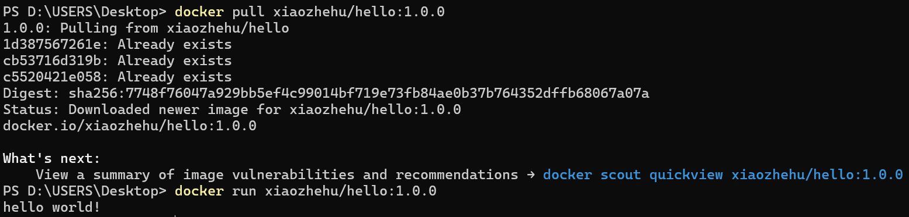

### 通過 commit 創建映像 

**其實產生image還有第四種方式，可以通過commit來產生image**

範例:

1. 先創建一個nginx的容器

```shell
docker container run -d -p 8082:80 nginx
```

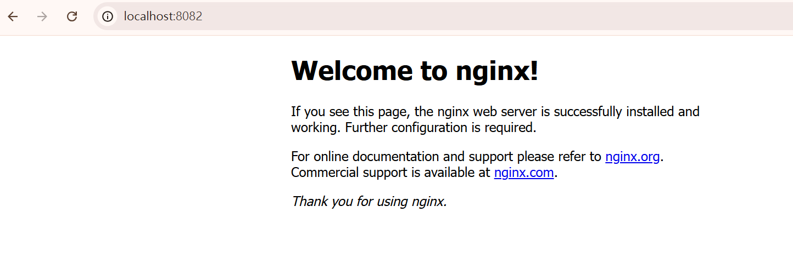
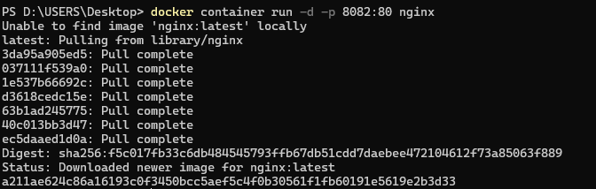

2. 進去容器裡面內部

```shell
docker container exec -it <container-id>
```

3. 查詢index.html，並且打開此檔案

```shell
cd usr/share/nginx
ls
cd html
ls
more index.html
```
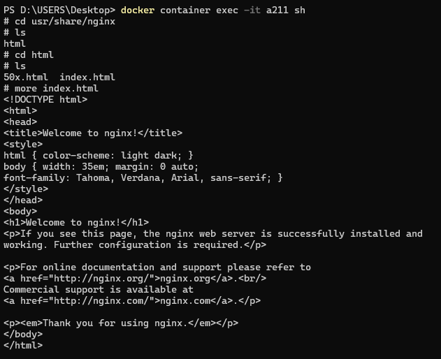

4. 試著修改index.html

```shell
echo "<h1>hello docker</h1> > index.html"
```
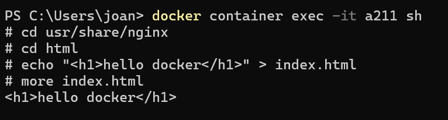


5. 把我改掉的image存成新的container，跟原本的nginx的container隔開

```shell
docker container commit a211 <docker-hub>/<image-name>:<image-version>
```

> 範例

```shell
docker container commit a211 xiaozhehu/nginx-test:1.0.0
```


6. 推到自己的docker hub上，要記得先登入docker hub不然會招到deny

```shell
docker push xiaozhehu/nginx-test:1.0.0
```

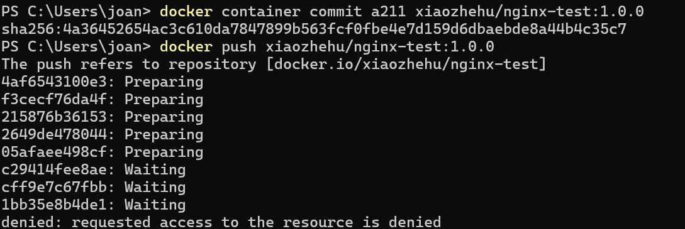
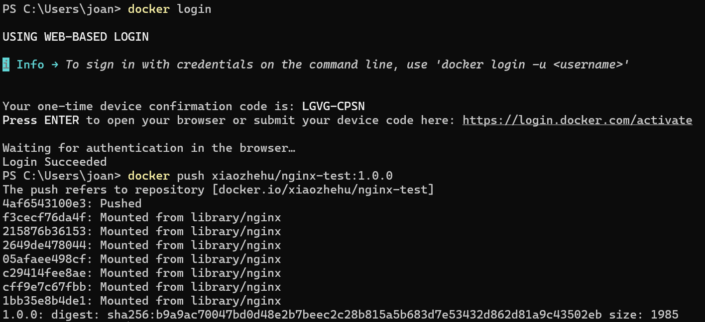
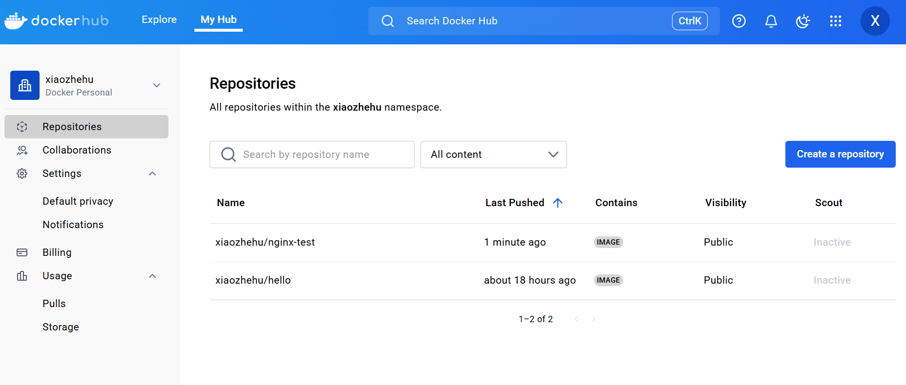


7. 此時可以刪除本機的image在把docker hub的image拉下來看看是否能執行

```shell
docker container rm -f <container-id>
docker image rm -f <image-id>
```

**注意要先從原本的nginx image先刪掉，在刪除新建立的xiaozhehu/nginx-test:1.0.0，不然會珊不掉**

```shell
docker pull <docker-hub-image-name>
```

> 範例

```shell
docker pull xiaozhehu/nginx-test:1.0.0
```
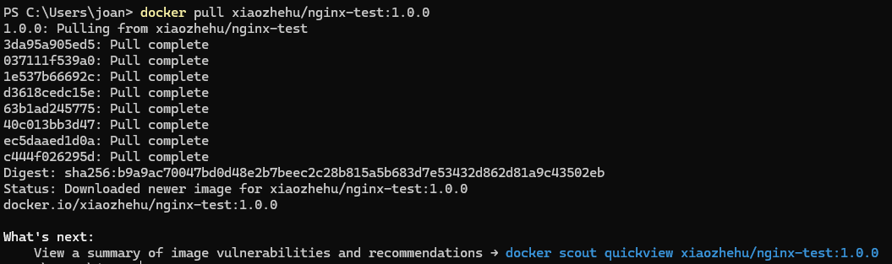

最後讓其image在容器內啟動

```shell
docker run -d -p 8083:80 xiaozhehu/nginx-test:1.0.0
```
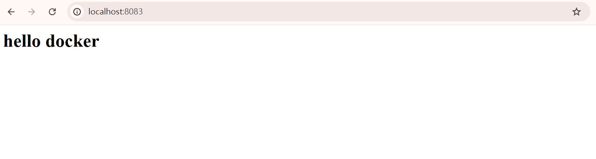
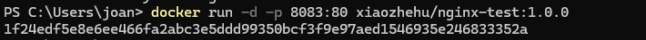

> 舉例:若我們要在一台ubuntu 22.04上運行下面hello.py的python檔案，並且使用commit方法產生image該如何執行?

1. 先建立一個ubuntu 22.04的container，並進入container內

```shell
docker container run -it ubuntu:22.04 sh
```

2. 下載python3

```shell
apt-get update && \
    DEBIAN_FRONTEND=noninteractive apt-get install -y python3 python3-pip python3-venv
```

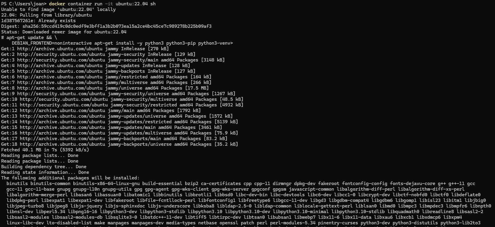

3. 確認成功安裝後就，在跟目錄裡面，新增一個python的文件，新增完沒問題就退出

```shell
python3
```

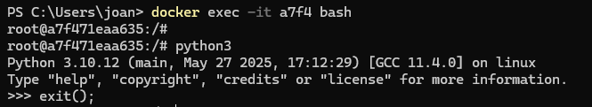

```shell
cd /
echo "print('hello docker')" > hello.py
python3 hello.py
exit
```
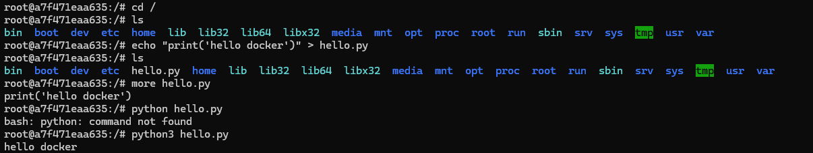

4. 給ubuntu 22.04這個image的container一個新的名字

```shell
docker conatiner commit 1d3c xiaozhehu/python-test:1.0.0
```

5. 推到docker hun

```shell
docker push xiaozhehu/python-test:1.0.0
```
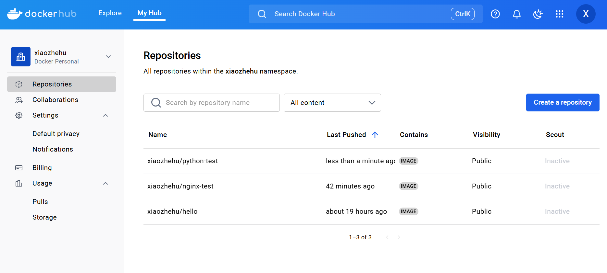
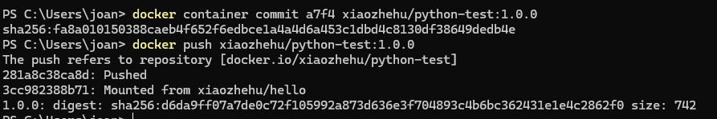

6. 該如何讓其image去創建容器呢?

不能直接執行下面這指令

```shell
docker container run -it xiaozhehu/python-test:1.0.0
```
他會默認直接進入shell模式，使用方法應該是直接在後面加上命令即可

```shell
docker container run -it xiaozhehu/python-test:1.0.0 python3 /hello.py
```
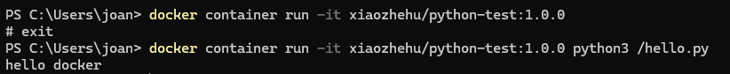