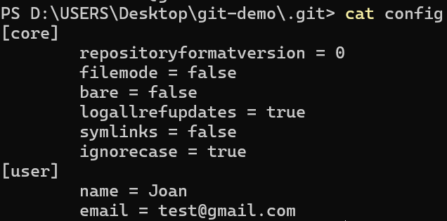

# 目錄

- [Git 介紹](#Git介紹)
- [win10 系統環境準備](#win10-系統環境準備)
- [mac 系統環境準備](#mac-系統環境準備)
- [Git 基本原理介紹](#Git-基本原理介紹)

# Git 介紹

為什麼我們要使用 git?

1. 版本管理
2. 多人開發、合作共享和協助

**[Git vs. Subversion](https://archive.kernel.org/oldwiki/git.wiki.kernel.org/index.php/GitSvnComparison.html)**

|                                           | Git    | Subversion |
| ----------------------------------------- | ------ | ---------- |
| Speed                                     | Faster | Slower     |
| Distributed management                    | ✅     | ❌         |
| Clone entire repository including history | ✅     | ❌         |

# win10 系統環境準備

1. 到 git 官網下載 git


2. 打開 git bash 或是打開 window PowerShell(終端機)，輸入

```shell
git --version
```

> 版本號有出來表示安裝成功
> 

3. 下載 vscode，安裝下面兩個 extendions

- GitLens -- Git supercharged
- Git History

4. 介紹 powershell 一些常見命令

- clear: 可以清除介面，並且回到螢幕上方

```shell
clear
```

- pwd(present working directory): 顯示當前所在的完整路徑

```shell
pwd
```

- ls: 顯示當前資料夾底下所擁有的目錄

```shell
ls
```

- cd: 切換目錄

```shell
cd D:\USERS\Desktop
```

- mkdir: 創建資料夾

```shell
mkdir git-test
```

- `code .`: 在此目錄下開啟 vscode

```shell
code .
```

# mac 系統環境準備

1. 到 git 官網下載 git
   
   
   
   

2. 打開 treminal(終端機)或 [iterm](https://iterm2.com/)，輸入:

   ```shell
   git --version
   ```

   
   
   

3. 下載 vscode，安裝下面兩個 extendions

- GitLens -- Git supercharged
- Git History

  

4. 介紹 mac 一些常見命令

- pwd(present working directory): 顯示當前所在的完整路徑

```shell
pwd
```

- ls: 顯示當前資料夾底下所擁有的目錄

```shell
ls
```

- cd: 切換目錄

```shell
cd D:\USERS\Desktop
```

- mkdir: 創建資料夾

```shell
mkdir git-test
```

# Git 基本原理介紹

- 初始化的配置

  1. 配置身分: 若修改代碼的化，必須知道誰修改這代碼，所以需要配置身分

  - 設定用戶名稱:

  ```shell
  git config --global user.name "your name"
  ```

  - 設定用戶 email

  ```shell
  git config --global user.email "your email"
  ```

  - **設定完後可以去當前資料夾內尋找.gitconfig 裡面配置的東西是否為剛剛我們輸入的，或是直接輸入下面指令查看**

  ```shell
  git config --list
  ```

  或

  ```shell
  git config --l
  ```

- 如何在本地初始化第一個存放庫(repository)

  1. 建立新的資料夾

  ```shell
  mkdir git-demo
  ```

  2. 進入資料夾裡面

  ```shell
  cd git-demo
  ```

  3. 初始化存放庫

  ```shell
  git init
  ```

  - **新增一個隱藏`.git`的資料夾**

  

  - 文件說明

    - config: 裡面有基礎配置，跟剛剛配置不同處在於，一個是 global(全域)配置 另一個只對本地當前資料夾有效；若本地配置和 global 配置有衝突，會優先選擇本地的配置

      - 查看文件內部

        ```shell
        cat config
        ```

        

      - 當前資料夾的 git 的全部配置，也可以看到全域配置

        ```shell
        cat config -l
        ```

        

      - 所以也可以改本地的配置，輸入和 global 不一樣的名稱

        ```shell
        git config user.name "your name"
        ```

        ```shell
        git config user.email "your email"
        ```

      - 在用下面指令查看，就可以看到 name 和 email 已被加入

        ```shell
        cat config
        ```

        

        ```shell
        git config -l
        ```

        - **會在最下面，要按`enter`鍵到最下面，按`q`離開**

    - object 文件:

      - `git add`在做甚麼?

        1.  新增一個文件

        

        2.  查看當前文件在 git 裡的狀態，可以知道哪些有被加入工作區，那些沒有

        ```shell
        git status
        ```

        

        3.  新增`hello.txt`到緩存區(Staging Area)裡面

        ```shell
        git add hello.txt
        ```

        - **可以比對一下運行前有多少個目錄看文件夾**

        ```shell
        tree .git
        ```

        

        - **如果有兩個內容一樣的檔案，不會新增新的檔案，會用同一個**

      - git 提供三個有關 object 的命令

        - **這些文件是用哈希演算法 SHA-1(secure hash algorithm 1)加密過的文件**

        - 查看文件類型

          ```shell
          git cat-file -t "前六位數(包含最一開始資料夾)"
          ```

          

          - **blob 用來儲存文件內容**

        - 查看文件內容

          ```shell
          git cat-file -p "前六位數(包含最一開始資料夾)"
          ```

          

        - 查看文件字元數:
          ```shell
          git cat-file -s "前六位數(包含最一開始資料夾)"
          ```
          

      - 哈希演算法: 將任意長度的輸入（通常稱為消息或數據）通過雜湊算法轉換為固定長度的輸出（稱為雜湊值或哈希值）。這個過程是不可逆的，即無法從哈希值還原原始輸入。

        - [MD5 128bit](https://passwordsgenerator.net/md5-hash-generator) - 不安全已被破解(原本用來驗證文件完整性)
        - [SHA1 160bit](https://passwordsgenerator.net/sha1-hash-generator) - 不安全已被破解(在 git 裡面使用)
          - [google sha1 collision](https://shattered.io/)
        - [SHA256 256bit](https://passwordsgenerator.net/sha256-hash-generator) - docker 的 container id 和 docker image
        - [SHA512 512bit](https://passwordsgenerator.net/sha512-hash-generator)

      - 總結: Git object 產生的文件包含目錄名的哈希值會包含三個東西:
        1. 檔案類型
        2. 檔案內容
        3. 檔案大小

- Working directory and Staging Area(index)

  - 由上述可知，object 裡的文件只存儲文件內容、文件類型和文件大小，那文件名去哪裡了呢?
  - 文件名主要都存放在了 Staging Area(index)，也就是.git 檔案裡面的 index
    

    - 查看文件

    ```shell
    git ls-file
    ```

    - 查看文件更多資訊

    ```shell
    git ls-files -s
    ```

    - 結果說明:
      - 100644: 文件的權限
      - 8d0e41234f24b6da002d962a26c2495ea16a425f: 文件所對應的 blob object
      - hello.txt: 文件名稱

  - **Staging Area(index): 是用來連接 Working directory 和 Git Repository 的中繼站，裡面包含不只是文件本身，也有文件的狀態**

  - 把程式碼同步到 git Repository，使用 git commit

    ```shell
    git commit -m "your msg"
    ```

  - 執行完 git commit 會發生什麼?
    

    - master: 目前所在分支
    - 1d0b740: 代表一次 commit，叫 root commit
    - 
    - 
      - 1741655921 +0800: 時間戳
      - tree 07ed5a: commit 生成的第二個 object 文件
      - 
      - 
      - 當前 master 分支最新的 commit 是 1d0b740e6660dd37c9e3d9a554b70c6474c6566d
      - 
      - HEAD 可以理解為指向，永遠指向當前的分支

  - 總結:
    - commit 文件包含兩個東西
      1. 指向哪個 tree，tree 也是對象，包含哪些文件，文件有各自 blob 的對象，可以查看並且找尋各自的內容
      2. 關於作者一些基本資訊包含時間戳
    - 若修改了文件後再重新 add 和 commit 上來會呈現下面那樣
      - 
      - 文件只要跟著變化 tree 就跟著變了
      - 
      - 這次 commit 會有一個 parent commit 指向原先的 commit(root commit)，並且這次 commit 會產生一個新的 tree，tree 下面會有一個新產生的 blob object
    - 在 git 裡面空文件夾不算有任何的改變，必須要新增文件才算
    - commit 不會生成 blob object 只會生成 tree object 和 commit object
    - 若是文件夾包含檔案，會產生 tree 包 tree 的 object 的結果
      - 
      - 

- Git 的文件狀態:
  1. Untracked: 在 Working directory 新創建一個文件時(當前不在 Staging Area(index)裡面)，使用 git add 可以讓狀態變成 Staged
  2. Modified: 文件已是 staged 狀態(在 Staging Area(index)裡)，但卻在 Working directory 裡面進行修改，導致 Staging Area(index)和 Working directory 裡的文件不同步，需要重新使用 git add 可以讓狀態再變成 Staged
  3. Unmodified:讓程式碼用 git commit 指令，從 Staging Area(index)同步到 resporsity
     
