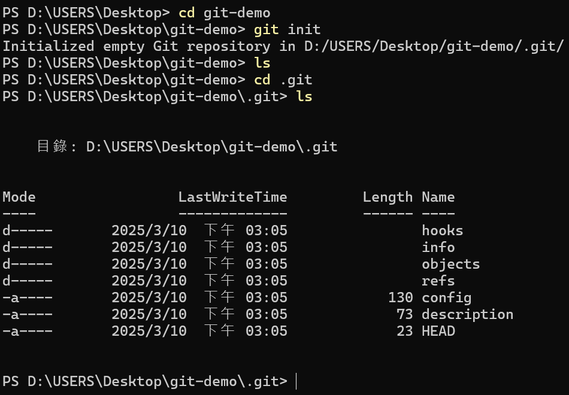
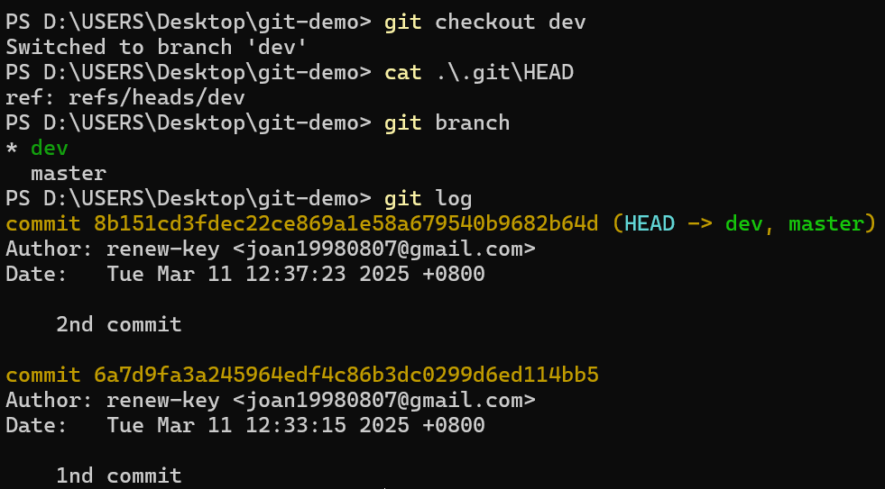
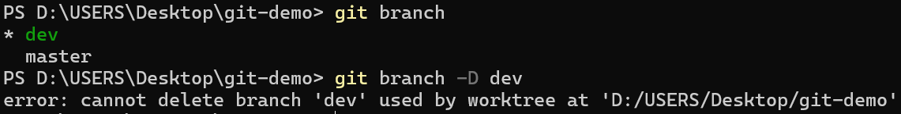
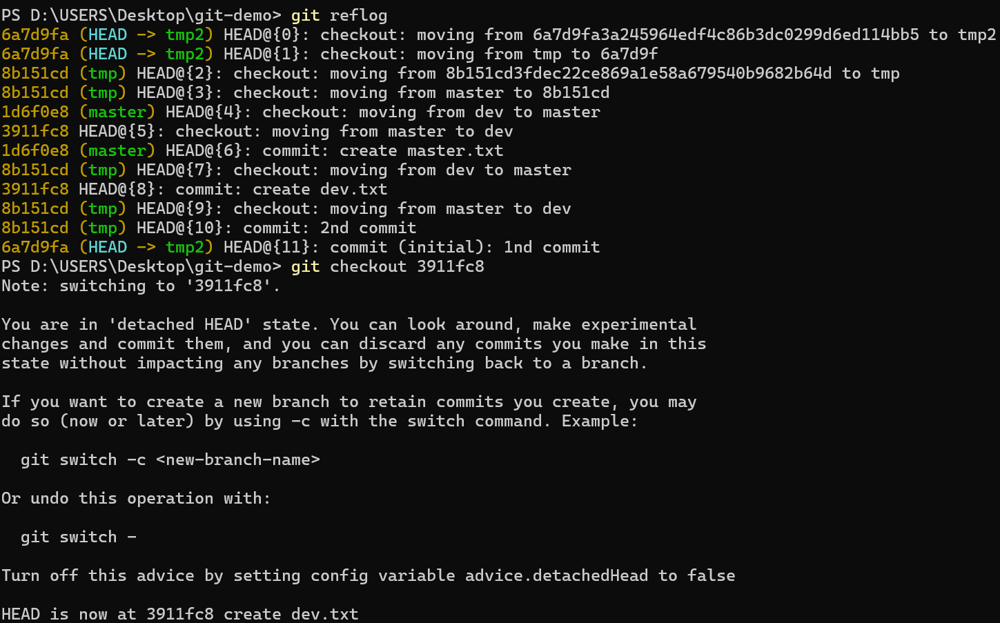
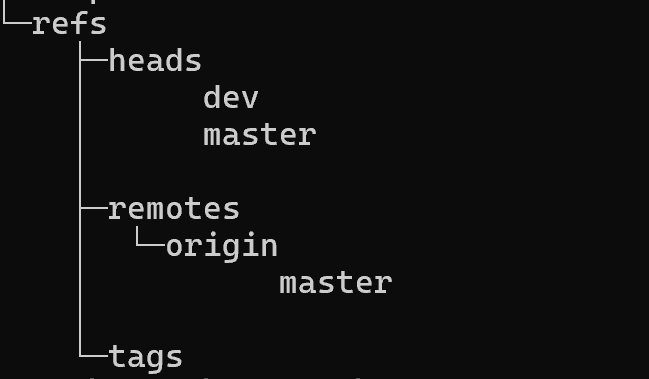

# 目錄

- [Git 介紹](#Git介紹)
- [win10 系統環境準備](#win10-系統環境準備)
- [mac 系統環境準備](#mac-系統環境準備)
- [Git 基本原理介紹](#Git-基本原理介紹)
- [Git 分支和 HEAD](#Git-分支和-HEAD)
- [Git diff](#Git-diff)
- [Git checkout 和 git restore](#Git-checkout-和-git-restore)
- [Git branch 和 git merge](#Git-branch-和-git-merge)
- [Git remote](#Git-remote)
- [Git Local and Git Remote](#Git-Local-and-Git-Remote)

# Git 介紹

為什麼我們要使用 git?

1. 版本管理
2. 多人開發、合作共享和協助

**[Git vs. Subversion](https://archive.kernel.org/oldwiki/git.wiki.kernel.org/index.php/GitSvnComparison.html)**

|                                           | Git    | Subversion |
| ----------------------------------------- | ------ | ---------- |
| Speed                                     | Faster | Slower     |
| Distributed management                    | ✅     | ❌         |
| Clone entire repository including history | ✅     | ❌         |

# win10 系統環境準備

1. 到 git 官網下載 git


2. 打開 git bash 或是打開 window PowerShell(終端機)，輸入

```shell
git --version
```

> 版本號有出來表示安裝成功
> 

3. 下載 vscode，安裝下面兩個 extendions

- GitLens -- Git supercharged
- Git History

4. 介紹 powershell 一些常見命令

- clear: 可以清除介面，並且回到螢幕上方

```shell
clear
```

- pwd(present working directory): 顯示當前所在的完整路徑

```shell
pwd
```

- ls: 顯示當前資料夾底下所擁有的目錄

```shell
ls
```

- cd: 切換目錄

```shell
cd D:\USERS\Desktop
```

- mkdir: 創建資料夾

```shell
mkdir git-test
```

- `code .`: 在此目錄下開啟 vscode

```shell
code .
```

# mac 系統環境準備

1. 到 git 官網下載 git
   
   
   
   

2. 打開 treminal(終端機)或 [iterm](https://iterm2.com/)，輸入:

   ```shell
   git --version
   ```

   
   
   

3. 下載 vscode，安裝下面兩個 extendions

- GitLens -- Git supercharged
- Git History

  

4. 介紹 mac 一些常見命令

- pwd(present working directory): 顯示當前所在的完整路徑

```shell
pwd
```

- ls: 顯示當前資料夾底下所擁有的目錄

```shell
ls
```

- cd: 切換目錄

```shell
cd D:\USERS\Desktop
```

- mkdir: 創建資料夾

```shell
mkdir git-test
```

# Git 基本原理介紹

- 初始化的配置

  1. 配置身分: 若修改代碼的化，必須知道誰修改這代碼，所以需要配置身分

  - 設定用戶名稱:

  ```shell
  git config --global user.name "your name"
  ```

  - 設定用戶 email

  ```shell
  git config --global user.email "your email"
  ```

  - **設定完後可以去當前資料夾內尋找.gitconfig 裡面配置的東西是否為剛剛我們輸入的，或是直接輸入下面指令查看**

  ```shell
  git config --list
  ```

  或

  ```shell
  git config --l
  ```

- 如何在本地初始化第一個存放庫(repository)

  1. 建立新的資料夾

  ```shell
  mkdir git-demo
  ```

  2. 進入資料夾裡面

  ```shell
  cd git-demo
  ```

  3. 初始化存放庫

  ```shell
  git init
  ```

  - **新增一個隱藏`.git`的資料夾**

  

  - 文件說明

    - config: 裡面有基礎配置，跟剛剛配置不同處在於，一個是 global(全域)配置 另一個只對本地當前資料夾有效；若本地配置和 global 配置有衝突，會優先選擇本地的配置

      - 查看文件內部

        ```shell
        cat config
        ```

        

      - 當前資料夾的 git 的全部配置，也可以看到全域配置

        ```shell
        cat config -l
        ```

        

      - 所以也可以改本地的配置，輸入和 global 不一樣的名稱

        ```shell
        git config user.name "your name"
        ```

        ```shell
        git config user.email "your email"
        ```

      - 在用下面指令查看，就可以看到 name 和 email 已被加入

        ```shell
        cat config
        ```

        

        ```shell
        git config -l
        ```

        - **會在最下面，要按`enter`鍵到最下面，按`q`離開**

    - object 文件:

      - `git add`在做甚麼?

        1.  新增一個文件

        

        2.  查看當前文件在 git 裡的狀態，可以知道哪些有被加入工作區，那些沒有

        ```shell
        git status
        ```

        

        3.  新增`hello.txt`到緩存區(Staging Area)裡面

        ```shell
        git add hello.txt
        ```

        - **可以比對一下運行前有多少個目錄看文件夾**

        ```shell
        tree .git
        ```

        

        - **如果有兩個內容一樣的檔案，不會新增新的檔案，會用同一個**

      - git 提供三個有關 object 的命令

        - **這些文件是用哈希演算法 SHA-1(secure hash algorithm 1)加密過的文件**

        - 查看文件類型

          ```shell
          git cat-file -t "前六位數(包含最一開始資料夾)"
          ```

          

          - **blob 用來儲存文件內容**

        - 查看文件內容

          ```shell
          git cat-file -p "前六位數(包含最一開始資料夾)"
          ```

          

        - 查看文件字元數:
          ```shell
          git cat-file -s "前六位數(包含最一開始資料夾)"
          ```
          

      - 哈希演算法: 將任意長度的輸入（通常稱為消息或數據）通過雜湊算法轉換為固定長度的輸出（稱為雜湊值或哈希值）。這個過程是不可逆的，即無法從哈希值還原原始輸入。

        - [MD5 128bit](https://passwordsgenerator.net/md5-hash-generator) - 不安全已被破解(原本用來驗證文件完整性)
        - [SHA1 160bit](https://passwordsgenerator.net/sha1-hash-generator) - 不安全已被破解(在 git 裡面使用)
          - [google sha1 collision](https://shattered.io/)
        - [SHA256 256bit](https://passwordsgenerator.net/sha256-hash-generator) - docker 的 container id 和 docker image
        - [SHA512 512bit](https://passwordsgenerator.net/sha512-hash-generator)

      - 總結: Git object 產生的文件包含目錄名的哈希值會包含三個東西:
        1. 檔案類型
        2. 檔案內容
        3. 檔案大小

- Working directory and Staging Area(index)

  - 由上述可知，object 裡的文件只存儲文件內容、文件類型和文件大小，那文件名去哪裡了呢?
  - 文件名主要都存放在了 Staging Area(index)，也就是.git 檔案裡面的 index
    

    - 查看文件

    ```shell
    git ls-file
    ```

    - 查看文件更多資訊

    ```shell
    git ls-files -s
    ```

    - 結果說明:
      - 100644: 文件的權限
      - 8d0e41234f24b6da002d962a26c2495ea16a425f: 文件所對應的 blob object
      - hello.txt: 文件名稱

  - **Staging Area(index): 是用來連接 Working directory 和 Git Repository 的中繼站，裡面包含不只是文件本身，也有文件的狀態**

  - 把程式碼同步到 git Repository，使用 git commit

    ```shell
    git commit -m "your msg"
    ```

  - 執行完 git commit 會發生什麼?
    

    - master: 目前所在分支
    - 1d0b740: 代表一次 commit，叫 root commit
    - 
    - 
      - 1741655921 +0800: 時間戳
      - tree 07ed5a: commit 生成的第二個 object 文件
      - 
      - 
      - 當前 master 分支最新的 commit 是 1d0b740e6660dd37c9e3d9a554b70c6474c6566d
      - 
      - HEAD 可以理解為指向，永遠指向當前的分支

  - 總結:
    - commit 文件包含兩個東西
      1. 指向哪個 tree，tree 也是對象，包含哪些文件，文件有各自 blob 的對象，可以查看並且找尋各自的內容
      2. 關於作者一些基本資訊包含時間戳
    - 若修改了文件後再重新 add 和 commit 上來會呈現下面那樣
      - 
      - 文件只要跟著變化 tree 就跟著變了
      - 
      - 這次 commit 會有一個 parent commit 指向原先的 commit(root commit)，並且這次 commit 會產生一個新的 tree，tree 下面會有一個新產生的 blob object
    - 在 git 裡面空文件夾不算有任何的改變，必須要新增文件才算
    - commit 不會生成 blob object 只會生成 tree object 和 commit object
    - 若是文件夾包含檔案，會產生 tree 包 tree 的 object 的結果
      - 
      - 

- Git 的文件狀態:

  1. Untracked: 在 Working directory 新創建一個文件時(當前不在 Staging Area(index)裡面)，使用 git add 可以讓狀態變成 Staged
  2. Modified: 文件已是 staged 狀態(在 Staging Area(index)裡)，但卻在 Working directory 裡面進行修改，導致 Staging Area(index)和 Working directory 裡的文件不同步，需要重新使用 git add 可以讓狀態再變成 Staged
  3. Staged: orking directory 和 resporsity 之間的狀態
  4. Unmodified:讓程式碼用 git commit 指令，從 Staging Area(index)同步到 resporsity
     

  - 逆向推回 untracked 狀態:

    1. rm: 把文件從 Staging Area(index)裡面刪除

    - 從 Staged 變成 Untracked

      ```shell
      git rm --cached hello.txt
      ```

      - 

      之後還是要用`git restore`指令，把 Working directory，只動 Staging Area(index)變成同步

    2. 如果 Modified 或 Untracked 已經變成 Staged，但想反悔的話，有兩種方法

       - 去修改 Working directory 的文件，把他變成跟修改前的一樣，在重新推上去
       - 不去動 Working directory，只動 Staging Area(index) 的指向，把它只回上一個 blob object，那就會回到之前的狀態，而在 Working directory 也保留了之前的修改

         ```shell
         git restore --staged hello.txt
         ```

       - 上面因為在 Working directory 保留了之前的修改，因此可以用下列指令來讓 Working directory 和 Staging Area(index)進行同步

         ```shell
         git restore  hello.txt
         ```

         - 
         - 

- Git 的 log 查看提交歷史

  - 查看所有 commit 的歷史: 由新到舊顯示

    ```shell
    git log
    ```

    

  - 每個 commit 通過一行去顯示

    ```shell
    git log --oneline
    ```

    

  - 限制 log 顯示的數量，例如想看最近兩次

    ```shell
    git log -2
    ```

    

    ```shell
    git log --oneline -2
    ```

  - 看指定時間

    ```shell
    git log --after='2025-03-10'
    ```

    > 包含輸入的日期

    

    ```shell
    git log --before='2025-03-10'
    ```

    > 不包含輸入的日期

  - 按照作者進行總結

    ```shell
    git shortlog
    ```

    

  - 顯示更多內容

    ```shell
    git log --stat
    ```

    

  - 更多使用指令

    ```shell
    git help
    ```

## 總結

- Git Basic Commands:
  - git init: initialize an emoty git reposity
  - git status: show the working tree status
  - git add: add file contents to the index
  - git rm: remove files from the working tree and from the index
  - git restore: restire working tree files
  - git commit: records the changes to repository
  - git log: show commit logs
- Git Low Level Commands
  - git cat-file `<SHA1>`
    - `-t`: git object type
    - `-s`: git object size
    - `-p`: git object content
  - git ls-files
    - `-s`: show staged content' mode bits, object name and stage number in the output

# Git 分支和 HEAD

- 到底什麼是分支?
  - 分支是一個有名字的指針，會指向特定的 commit(Branches are named pointers to commits)
    
  - 因為 commit 是一串亂碼，由 SHA1 產生不好記，所以才特定幫他們取了名字，而這名字就是分支，分支必須永遠指向最新的 commit 這樣會產生兩個問題：
    - 需要有地方存儲分支當前指向哪個 commit
    - 有不同的分支就需要有切換分支的功能，在切換之前需要先標示當前在哪個分支
- Master branch and HEAD
  - Master 是一個預設分支，會自動在 git init 後生成(Master is a branch, the canonical mainline branch by default)
  - HEAD 是一個特別的指針(HEAD is a special pointer)，他有兩個功能
    - 永遠指向最新的 commit (Always point to the latest commit)
    - 顯示當前所在的分支名稱 (Related with current active branch)
      
  - 實作  
     
- Git Branch

  - git branch: list and branches we have
    - `*`: 為當前在的分支
      
  - git branch `<branch_name>`: create a branch with branch_name, if there already have branch with the name you want to create, it will return error.
    
    

    > dev 碰巧也是指向相同的 commit 所以才會顯示出來

    - dev 到底存在哪裡呢？它會存在`.git/refs/heads/`裡面
      
    - 目前在 master 分支
      

  - git checkout: change the current active branch
    

    - git checkout 不只可以切換分支，也可以切換到特定的 commit，這種切換叫做 detached HEAD

    
    
    

    - 如果在非分支的 commit 進行修改，要保存的話有兩個方法
      - 用`git switch -c <new-branch-name>`來創立新的分支並再做任何的修改與 commit
        
        
      - 用`git checkout -b <new-branch-name>`來建立新的分支後再做任何的修改與 commit
        

  - git branch -D `<branch_name>`: delete branch, cannot delete current active branch or branch not existing
    
    - `-d`或`--delete`: 非強制刪除，若沒合併會報錯
      
    - `-D`: 強制刪除，不會報任何的錯誤，會強制刪除
      
    - 若刪除後，那在此分支上建立還沒合併的檔案是不會被刪除的
      
  - git checkout -b `<branch_name>`: checkout a branch, will create that branch if it doesn't exist.
    
  - git switch -c `<branch_name>` : checkout a branch, will create that branch if it doesn't exist
    
  - git branch -m `<old_name>` `<new_name>`: rename branch with new name
    

- 新增新的 commit 的操作
  

- **在 git 裡面所做的操作，例如分支的刪除，指是刪除了指向某個特定 commit 的指針而已，本身文件並沒有被刪除，因此如果不小心誤刪了，指要找回原本的 commit 即可復原**

  - 要如何找到誤刪的分支呢？
    - 可以去 object 檔案，用`git cat-file -p <SHA1>`一個個去查看（很笨的方法）
    - 使用`git reflog`查看之前的操作，包括之前刪除的分支
      
      
      

- 分支的刪除，到底刪除了什麼？
  - 刪除了`.git/refs/heads/`裡面的分支名稱檔案
  - 刪除了`.git/logs/refs/heads`裡面的分支名稱檔案

# Git diff

> 可看文檔差別

- 比對 Working directory 和 Staging Area(index)的不同

```shell
git diff
```

- 如何對比區別？

  - 對比 index(索引) blob object，來看是否有區別
    

  - 9001211: Staging Area（Index）中 dev.txt 的版本
  - 199284c:屬於在本地（Working directory）中 dev.txt 的版本
  - `-`: 代表 Staging Area(index)
  - `+`: 代表 Working directory
  - `@@ -1 +1,3 @@`: 顯示 Staging Area(index)）版本的第一行，在 Working directory 版本的第一行後面數三行內容
    

- 比對當前 Staging Area(index)和存放庫(repository)的不同

```shell
git diff --cached
```


- 9001211 Staging Area（Index）中 dev.txt 的版本
- 199284c HEAD（Repository 中最新 Commit）的版本
- `-`: 代表 Staging Area(index)
- `+`: 代表 HEAD（Repository 中最新 Commit）的版本
- `@@ -1 +1,3 @@`: 顯示 Staging Area(index)）版本的第一行，在 HEAD（Repository 中最新 Commit）版本的第一行後面數三行內容
  

# Git checkout 和 git restore

- git restore: 可以回溯到檔案未改的階段
  
- git checkout: 也可以回溯到檔案未改的階段
  

# Git branch 和 git merge

- Nobody should work on Master branch directly.
- We work on our own branch, that branch could be a feature branch or a bugfix branch.
- Always try to merge your own branch to master branch when you think your job is done.

## Git Merge - Fast Forward

1. 切換到被合併的分支

```shell
git checkout <margerdBranch>
```

2. 之後打以下指令就可以把，branchName 給合併進來

```shell
git merge <branchName>
```


- 例如我們要把 dev 的分支給合併到 master 裡面

1. 先切換到 master 分支

```shell
git checkout master
```

2. 輸入指令，把 dev 分支合併進來

```shell
git merge dev
```


3. 結果: 會在`.git`裡面新增加一個較 ORIG_HEAD 的檔案，他會保留 master 合併前所指向的 commit，以防我們 merge 錯誤還可以回溯

### Fast Forward 條件:

1. 目標分支沒有新的提交：目標分支（例如 master）的提交紀錄完全沒有被其他提交改動過，並且源分支（例如 feature）的提交可以被視為目標分支的延伸。
2. 源分支是目標分支的祖先：這表示在進行合併時，源分支的所有提交歷史可以直接“覆蓋”目標分支，不需要進行合併處理。


### Git Merge - 3 way merge

3 way merge: 當要 merge 的分支的 commit 不是指向前一個分支時，就需要用到 3 way merge


- 如果在這種情況下直接使用`git merge <branch>`指令，會發現多新增了一個 commit， dev 沒有變化，但 master 卻跑到了新產出的 commit 上


- 新產生的 commit 有兩個 parent tree， 其中一個是 dev 目前的 commit，而另一個是 master 之前的 commit

- 若同時修改兩個 parent tree 裡的相同文件，會產生衝突，這時就需要人工介入去解決此衝突

#### 3 way merge with conflict


> 發生衝突後，索引存了三個文件，此索引為版本，現在有三個版本


- 修改衝突的方法有以下三種
  - 進去文檔裡面修改衝突
  - 通過 vscode 去修改衝突
    - Accept Current Changes
    - Accept Incoming Changes
    - Accept Both Changes
    - Compare Changes
      
- 若選擇 Accept Both Changes 後，按存檔，就會發現衝突已解決
  
- 之後要 commit 的時候不需要加文字說明，因為之前已經加過了，所以直接打

```shell
git commit
```

- 打完後就會進入到編輯器裡面
  
- 同意的話按`:wq`保存退出
  
  

#### 整理

| Attribute           | Fast Forward Merge    | 3-Way Merge                           |
| ------------------- | --------------------- | ------------------------------------- |
| **Merge Type**      | Linear merge          | Fork and merge                        |
| **Branch History**  | Hidden branch changes | Visible branch changes                |
| **Characteristics** | Clearer history       | Easier to understand branch structure |

### Git Merge - rebase

rebase : 當已經產生 3 way merge 時，但又不想讓樹狀圖呈現分支，就會使用`rebase`來進行合併

合併邏輯: 先讓分支指向最新的 master 所指向的 commit，而分支的 SHA1 值會被重寫，讓使其滿足 Fast Forward 條件，之後就可以進行合併

**在執行 rebase 時也可能會發生衝突，所以也需要解決衝突的問題**

- 產生的問題

1. 會修改原先 commit 的 SHA1 值，如果原本的 commit 已經 push 到 gitHub(遠端存放庫)，若運行完 rebase 後再去進行 push 的話會出錯
2. 若分支在進行 rebase 之前已經 push 到 github(遠端存放庫)，而這分支被別人拉下來，他在本地進行工作，但自己這邊卻進行了 rebase，並且強制 push 到遠端存放庫，這樣會對別的開發者產生不好的影響

**適用於這分支指有自己在用的時候，就可以強制 push，若有別人在使用不建議使用 rebase**

**一般 rebase 並不會使用在 master 分支上面！！**


> rebase 過去後會發現最新的一筆生成時間比第二筆還早

> 這時 bugfix 分支和 master 分支已經在一條線上，因此在進行 merge 時，就會採用 Fast Forward 方式進行合併


# Git remote

- 為什麼需要 git remote?
- 因為我們需要多人協作，如果不需要多人其實用本地的即可


|           | local repository | remote repository |
| --------- | ---------------- | ----------------- |
| tree      | ✅yes            | ❌no              |
| .git file | ✅yes            | ✅yes             |

- 程式碼託管服務
  - Bitbucket
  - GitHub
  - GitLab

## GitHub: 是通過 Git 進行版本控制的程式代碼託管平台

### push

- 若本地已經有存放庫，那要如何 push 到 rmote 存放庫裡呢?

1. 在 GitHunb 裡面創建一個新的存放庫

2. 選擇是使用 https 還是 ssh，要使用 ssh 的話需要先把 ssh key 給配置好，沒有的話就使用 https

3. 設定遠端存放庫

```shell
git rmote add origin <your-rmote-reposity-url>
```


4. 把本地的存放庫資料提交到遠端存放庫

```shell
git push -u origin <your-rmote-reposity-branch>
```


- 解釋:

  - 查看我們.git/object 有多少個，這裡顯示有 20 個
  - 幫我們把 object 的文件做壓縮，並且推到我們的遠端存放庫
  - 同時他也幫我們新建一個分支叫做 master

  
  

  > 在本地的`.git`資料夾裡面，多新增了四個資料夾和兩個檔案

  - logs:
    - remote(資料夾)
    - origin(資料夾)
    - master(文件)
  - refs:

    - remote(資料夾)
    - origin(資料夾)
    - master(文件)

    

    > 本地和遠端指向同一個 commit

5. 此時去 gitHub 上面刷新當前的遠端存放庫頁面，即可看到 push 上去的資料

6. 若之後在本地修改的話，需要和遠端同步，此時只需要用下面指令即可

```shell
git push origin <your-rmote-reposity-branch>
```


**注意:只有第一次的時候需要加`-u`之後 push 都不用加**

**GitHub 的默認分支從 2020 年開始從 master 改成了 main，但 git 依舊是 master**

> 可以去 GitHub->Setting->Repository 改掉

### clone

> 如何從遠端存放庫 clone 到本地電腦

1. 要先擁有遠端存放庫的 url

2. 打下面指令

```shell
git clone <remote-repository-url>
```


> 也可以重新命名新的存放資料夾的名稱

```shell
git clone <remote-repository-url> <folderName>
```


**只要有 url 就可以 clone 所有存在 GitHub 的檔案**

# Git Local and Git Remote

- Git remote commands
  - `git clone <repository URL>`: clone a remote repository to local disk
  - `git push origin <branch_name>`: push local branch `<branch_name>` to remote branch dev, if `dev` branch does not exist remotely, it would be created.(`--delete` to delete a remote branch)
  - `git branch -a`: list all branches both local and remote
  - `git fetch`: download objects and refs from remote repository
  - `git pull`: fetch from remote and integrate with local branch.
  - `git push origin <tag_name>`: push local tag to github
  - `git push origin --delete <tag_name>`: to delete github tag

## Origin


> Origin 為 Remote Repository 默認名稱

一個 Local Repositiory 可以關聯很多個 Remote Repository，默認只關於一個，這個 Remote Repository 就叫 origin

- 有兩種方式可以讓 remote Repository 和 Local Repositiory 建立起關聯

  - 使用 clone，把 remote Repository clone 到 Local Repositiory
  - 使用`git remote add orgin <remote Repository URL>`

- 查看遠端存放庫的名稱

```shell
git remote
```


- 查看更多有關遠端存放庫的資訊

```shell
git remote -v
```

- fetch: 把遠端存放庫的東西拉取到本地
- push: 把本地的東西 push 到遠端存放庫


- 我們多了一個 remotes 的資料夾，裡面可以有多個 remote，現在只有一個預設 origin，裡面的 HEAD 是一個指針，指向目前的 commit

### 如何修改 Remote Repository 的默認名稱

1. 先在本地刪除想要改名的 Remote Repository

```shell
git remote remove <Remote-Repository-name>
```


> 之前 remotes 裡面有個叫 origin 的資料夾不見了

```shell
git remote add <your-setting-name> <remote Repository URL>
```


> 目前只是添加存放庫，並沒有跟遠端存放庫有任何關連，所以 Remotes 資料夾裡面還沒有任何的東西
> 所以需要新增或修改東西，然後在推上去


```shell
git push <your-setting-name> <branch-name>
```


> 可以看到 Remotes 裡面就出現了一個我們新建立的 Remote Repository 的名稱


