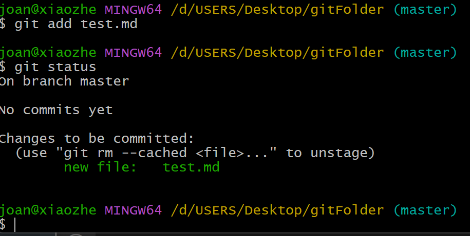
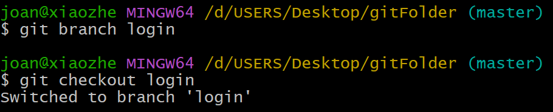

# 目錄

- [版本控制簡介](#版本控制簡介)
- [Kernel and Shell](#Kernel-and-Shell)
- [Command Prompt 常用指令](#Command-Prompt-常用指令)
- [Git and Git Bash](#Git-and-Git-Bash)
- [Unix 作業系統](#Unix-作業系統)
- [Git and GitHub](#Git-and-GitHub)

# 版本控制簡介

> 軟體工程師常利用版本控制來跟蹤、維護原始碼、文件以及設定檔案等地改動。有時候，一個程式同時存在有兩個以上的版本有其必要性，例如:發布版本中程式錯誤已被修正，但沒有加入新功能；而開發版本則有新的功能正在開發、也有新的錯誤待解決，於是便需要同時維護兩個不同的版本。

> 此外，為了找出只存在某一特定版本中的程式錯誤、或找出程式錯誤出現的版本，開發人員也必須通過比對不同版本的原始碼以找出問題的位置

# Kernel and Shell

> 整個電腦可以由使用者、 Shell、Kernel、硬體相互協助運作:

- 硬體(Hardware):整個系統的實體工作者，沒有電力系統的話，CPU、SSD 等就無法工作。
- 核心(Kernel): 是內部的核心、聽完 Shell 的翻譯，再指示硬體要進行的工作。
- Shell: 是外部的表殼，接收使用者的訊息，在翻譯給 Kernel 請 Kernel 處理。
- 使用者:將需求或想做的事發出指令給 Shell

> 一般來說，shell 是指作業系統中提供存取核心(kernel)所提供之服務的程式。


- shell 基本上有兩類
  - CLI(Command-Line Interface)
  - GUI(Graphical User Interface)

> 通常認為，CLI 沒有圖形使用者介面(GUI)那麼方便使用者操作。因為，命令列介面的軟體通常需要使用者記憶操作的命令，但是，由於其本身的特點，命令列介面要較圖形使用者介面節約電腦系統的資源。在熟記命令的前提下，使用命令列介面往往要較使用圖形使用者介面的操作速度要快。所以，在現在的圖形使用者介面的作業系統中，通常保留者可選的命令列介面。

> Windows 系統中，Command-Line Prompt(cmd.exe)是個 CLI 程式。在 macOS 中，terminal 提供了一個命令行介面(CLI)來控制基於 UNIX 作業系統的基礎。

# Command Prompt 常用指令

| CMD Command                | Description                    |
| -------------------------- | ------------------------------ |
| cd                         | Change directory               |
| mkdir                      | Make a new directory           |
| type nul > "filename.text" | 製作一個新的 filename.txt 檔案 |
| cls                        | clear screen                   |
| dir                        | list directory content         |
| Ctrl+C                     | 強制終止任何正在執行的指令     |

| CMD Command                | Description                         |
| -------------------------- | ----------------------------------- |
| cd                         | Change directory                    |
| mkdir                      | Make a new directory                |
| type nul > "filename.text" | Create a new "filename.txt" file    |
| cls                        | Clear screen                        |
| dir                        | List directory content              |
| Ctrl+C                     | Force terminate any running command |

> cmd 有自動搜尋的功能，只要打前面幾個字後按 Tab 就會自動出現
> 按上和下可以顯示之前打的紀錄

- cd
  - 更換目錄
    ```shell
    cd Desktop
    ```
  - 返回上一層
    ```shell
    cd ..
    ```
- mkdir: 在目錄下新建一個資料夾

  ```shell
  mkdir myFolder
  ```

- `type nul >`: 新建檔案

  ```shell
  type nul > "filename.text"
  ```

- cls:清除所有視窗的命令

  ```shell
  cls
  ```

- dir:顯示目前資料夾裡的內容
  ```shell
  dir
  ```
- `Ctrl+C`:強制終止任何正在執行的指令
  - 當你寫了無限迴圈後，可以用這個指令讓它終止

# Git and Git Bash

- Git 是一個免費和開源的 version control system(版本控制系統)，旨在以速度和效率處理從小型到大型項目的所有內容。

- Git 的核心是一組 command line utility programs，旨在 Unix 風格的命令環境中執行。Linux 和 macOS 等現代作業系統都包含內建的 Unix 指令。這就代表，macOS 系統只需要下載 Git 到電腦後，就可以完全使用 Git 來做版本控制了。

- Mircosoft Windows 若要使用 Unix 指令以及 Git 指令，需先下載 Git Bash。(Bash 是 Linux 和 macOS 上流行的默認 shell)。

- Git Bash 是一個適用於 Microsoft Windows 環境的應用程序。在 Git bash 內部，我們可以使用 Unix 指令(因為這是一個 bash)，也可以使用 Git 指令，因為 Git bash 自動包含了 Git 指令。

# Unix 作業系統

> Unix 作業系統是一個強大的多使用者、多工作業系統，支援多種處理器架構，源自 AT&T 公司於 1970 年代的貝爾實驗室研究中心開發。由於 macOs 是基於 Unix 的作業系統，terminal 都可以直接使用

- Unix 作業系統中，常用的指令有:

| Unix Command | Description                                                                  |
| ------------ | ---------------------------------------------------------------------------- |
| cd           | Change directory                                                             |
| ls           | List files or directories in a directory                                     |
| pwd          | Stands for "present working directory"                                       |
| mkdir        | Make directory                                                               |
| touch        | Create,change and modify timestamps of a file                                |
| rm           | Remove file                                                                  |
| rmdir        | Remove an empty directory                                                    |
| rm -rf       | rf stands for remove forcefully; can be used to remove a non-empty directory |


- 藍色是資料夾
- 白色是檔案
- 綠色是軟體


- rmdir 只能刪除空的資料夾不然會報錯
  
  
  - 正確刪除步驟:
    1. 先用`ls`指令檢查裡面的內容
    2. 用`rm`一個個刪除
    3. 全部刪除完後再`cd ..`到外面刪除此資料夾
- rm -rf: 資料夾裡面不管有沒有東西，就是要刪除
  

**用指令刪除的資料在垃圾桶是找不到的!!**

> 只打一個字按 TAB 會幫忙補齊(如果底下資料夾只有一個此字母開頭的話)

> 也可以按上下鍵來查詢之前輸入的指令

> 進入編輯模式後:

> 按 i 進入 插入模式（可以開始輸入文字）
> 按 a 在游標後插入
> 按 o 在下一行新增並進入插入模式
> 按 Esc 進入普通模式
> 輸入 :q 退出 (如果沒有更改)
> 輸入 :q! 強制退出 (不保存)
> 輸入 :wq 或 ZZ 保存並退出

# Git

> Git 本身是個在個人電腦上可以幫助開發者做版本控制的軟體。GitHub 是個網路平台，為使用 Git 軟體開發和版本控制提供託管服務。Git 與 GitHub 協作的流程如下:

1. 在 work directory 用 git init 來開始追蹤程式碼版本
2. 在電腦上的 work directory 撰寫程式碼
3. Commit 是 Git project 時間線上的里程碑。每個 commit 都被視為是 project 的一個小版本
4. git add 的功能是將程式碼放到 staging area 上面。使用 git add 可以將即將被 commit 的文件讓 git 做追蹤
5. 執行 git commit -m 把 staging area 上的文件做 commit。這些 code 的更動會被記錄到 Local Repository(.git 資料夾)內
6. 用 git push 將 local repository 的所有內容都放到遠端伺服器(GitHub)
7. 之後再使用 git pull 或 git clone 把 Remote Repository 的資料再拉到 Local Repository


- 名詞認識:

  - Work Directory: 工作的資料夾。內部包含所有 project 的檔案
  - Staging Area:一個 commit 前的緩衝區域。任何我們想要 commit 的檔案都可以放入 staging area。
  - Local Reposity:指的是本機電腦上包含.git 隱藏文件的 Work Directory。git 資料夾在 git init 被執行時，會自動被創建到 work directory 內部。git 資料夾內部的文件包含與 commit、remote repository address 等相關的所有信息。它還包含一個儲存 commit 歷史紀錄的日誌。此日誌可以幫助我們回溯到以前版本的 code。
    
  - Remote Repository:將程式碼儲存在 GitHub 等程式碼託管服務平台上

Git 對 Local Repository 的檔案有 4 種主要狀態:

1. untracked: 檔案室全新的，Git 對此一無所知，如果我們用 `git add <file>`，檔案將變成:
   
   
2. staged: 現在 Git 知道檔案(tracked)，但也將檔案作為下一個 commit 的一部分。如果我們做 git commit，檔案會變成:
   
   

   - 若有很多個檔案需要 add 那可以打`.`，這樣這個資料夾下的檔案就可以全部都被 add

   ```shell
   git add .
   ```

   - 如果想要特定的附檔名 add 可以用:

   ```shell
   git add *.html
   ```

3. unchanged: 檔案自上次 commit 以來未更改。如果我們修改檔案，檔案就變成:
   
4. unstaged: modified，但還不是下一次 commit 的一部分。我們可以使用 git add 再次讓它變成 staged 狀態。
   

| Git Command                              | Description                                                                                                                                                                             |
| ---------------------------------------- | --------------------------------------------------------------------------------------------------------------------------------------------------------------------------------------- |
| `git init`                               | Initialize an empty git reposity                                                                                                                                                        |
| `git config --list`                      | Display all configuration settings.                                                                                                                                                     |
| `git --version`                          | Display the current version of Git.                                                                                                                                                     |
| `git config --global user.name "name"`   | Set username                                                                                                                                                                            |
| `git config --global user.email "email"` | Set email address                                                                                                                                                                       |
| `git status`                             | Displays the state of the working directory and the staging area.                                                                                                                       |
| `git add <filename>`                     | Add files to staging area.                                                                                                                                                              |
| `git commit -m "commit message"`         | Commit all files on staging area.                                                                                                                                                       |
| `git rm --cached filename`               | Remove files from staging area.                                                                                                                                                         |
| `git log`                                | Review and read commit history                                                                                                                                                          |
| `git branch branchName`                  | Create a new branch from current commit                                                                                                                                                 |
| `git checkout branchName`                | Switch to another branch                                                                                                                                                                |
| `git remote add origin gitSSH/gitHTTPs`  | Connect to a remote repository in gitSSH/gitHTTPs and name the connection origin                                                                                                        |
| `git push -u origin master`              | Push the commits in the local branch named master to the remote named origin -u stands for upstream. When pushing for the first time, you will usually be required to log in to GitHub. |
| `git push`                               | Once we set the -u flag, we can use `git push` command.                                                                                                                                 |
| `git clone gitSSH/gitHTTPs`              | Get a working copy of the remote repository                                                                                                                                             |
| `git pull gitSSH/gitHTTPs`               | Update that local copy with new commits form the remote repository                                                                                                                      |
| `git remote set-url origin gitSSH`       | Set the remote connection named origin to a new remote repository                                                                                                                       |
| `git remote remove origin`               | Remove a connection called origin.                                                                                                                                                      |


> 若要從 git config --list 出來按鍵盤`q`即可


- 若不希望機密資料被上傳到 git，例如:`.env` 檔案，我們可以:

  1. 新增一個.gitignore
  2. 在此.gitignore 裡面新增不想被 git add 的檔案
     
     
     
  3. 之後再`git add`和`git commit -m ""`，把.gitignore add 上去就可以了

- git branch
  
  

**在 login 製作的東西沒有合併之前在 master 是看不到的**

- git marge:
  **確認換到要合併的分支(少東西的分支)**

  - current branch: 目前在的 branch
  - incoming branch: 要合併過來的分支
    

- git conflict:
  
  

## GitHub

1. 註冊一個 github 帳號

2. 新建一個 repository


3.  README.md 讓看到這專案的人更快上手(option)

- `git remote add origin gitSSH/gitHTTPs`
  - gitSSH
    
- `git push -u origin master`
  
- `git push`
  
  
  

**之後的所有變更都需要打**

- `git add .`
- `git commit -m ""`
- `git push`
