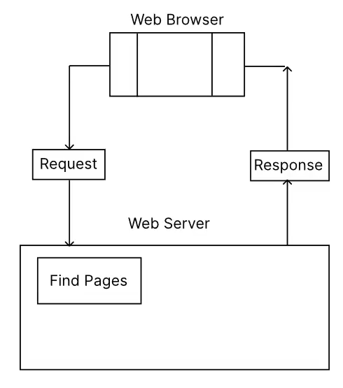
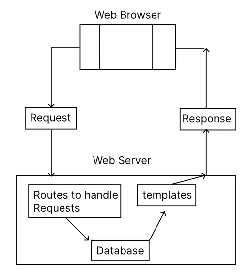

# 目錄

- [前端部屬基本知識](#前端部屬基本知識)

# 前端部屬基本知識

1. 壓縮圖片:

   - 程式檔本質上就是文字檔案而已。在電腦當中，要儲存文字檔案需要的空間並不多，因為文字的編碼相當容易。大致上來說，一個字需要 1 byte 的容量

   - 然而，圖片編碼相較之下需要相當大的儲存空間。一張圖片由千萬的像素組成。每個像素(pixel)需要儲存 RGB 三種顏色的數值(有時也要儲存透明度)，所以需要 3bytes 才能儲存一個像素。因此，一張一千萬像素的圖片需要的容量可以抵過一千萬的文字小說。

   - 將網頁發佈到網路上之前，先將圖片壓縮是個好習慣。我們可以節省雲端空間，也可以加速網站上圖片的讀取速度。

   [壓縮圖片網站](https://tinypng.com/)

2. 部屬靜態網頁

   - 網頁大致上分為兩種:
     - 靜態網頁(static website)
       - 是由 HTML、CSS 或 JavaScript 等語言寫成。我們只需要將這些文件放到網頁伺服器上面即可。
       - 每當有客戶端發出請求時，網頁伺服器只需要預備好的 HTML、CSS 或 JavaScript 文件原封不動地送給客戶端，像這樣的網頁屬於靜態網頁
       - 優點:伺服器回傳速度快
       - 缺點:無法連結資料庫，不能提供登入使用者功能，也無法為使用者客製化網頁內容
         
   - 動態網頁(dynamic website)

     - 伺服器會確認目前的網頁使用者身分，透過後端網頁的伺服器的程式碼，去找出在資料庫內儲存的資料後，透過 template(模板) 生成相對應的不同網頁
     - 例子:
       - YouTube(每個人看到的影片都不同)
     - 下張圖被稱為 MVC Model，分別代表 Model,View, and Controller。
       

**總結**
| |靜態網頁|動態網頁|
|--------|-------|--------|
|網頁內容|網頁內容改變限於 Client Side Script|後端伺服器程式碼可控制網頁內容|
|數據庫|與數據庫沒有連結|可連結數據庫拿出資料|
|速度|速度較快|速度較慢|
|開發成本|成本較低|成本較高|
|工具|HTML,CSS,JavaScript|PHP,Node.js 等等後端腳本語言|
|範例|[Go Website](https://go-website-chi.vercel.app/)|Youtube,Facebook,Udemy|
