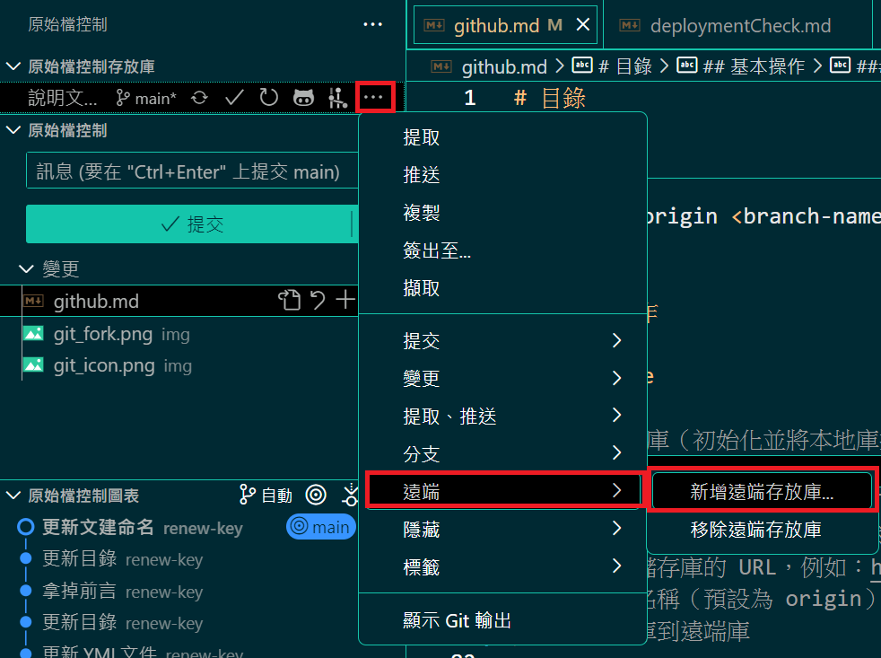

# 目錄

- [基本操作](#基本操作)

  - [Git 基本指令](#Git-基本指令)

    - [git 基本配置](#git-基本配置)
    - [git 初始化（初始化本地儲存庫）](#git-初始化初始化本地儲存庫)
    - [git 複製（從遠端複製儲存庫）](#git-複製從遠端複製儲存庫)
    - [git 查看狀態（查看變更的狀態）](#git-查看狀態查看變更的狀態)
    - [git 添加變更（添加文件到暫存區）](#git-添加變更添加文件到暫存區)
    - [git 提交（提交暫存區的變更）](#git-提交提交暫存區的變更)
    - [git 查看提交歷史（查看提交歷史紀錄）](#git-查看提交歷史查看提交歷史紀錄)
    - [git 拉取（從遠端拉取最新的代碼）](#git-拉取從遠端拉取最新的代碼)
    - [git 推送（推送本地的變更到遠端）](#git-推送推送本地的變更到遠端)
    - [git 建立分支](#git-建立分支)
    - [git 切換分支](#git-切換分支)
    - [git 合併分支](#git-合併分支)
    - [git 建立遠端庫](#git-建立遠端庫)
    - [git 下載 GitHub 儲存庫](#git-下載-GitHub-儲存庫)
    - [git 刪除錯誤commit](#git-刪除錯誤commit)
 

- [介面操作](#介面操作)

  - [vsCode](#vsCode)
  - [IntelliJ IDEA Community](#IntelliJ-IDEA-Community)

- [刪除 github 的庫](#刪除-github-的庫)

  - [刪除本地儲存庫](#刪除本地儲存庫)
  - [刪除遠端儲存庫（GitHub）](#刪除遠端儲存庫GitHub)

- [權限問題處理](#權限問題處理)

---

## 基本操作

### 指令

#### git 基本配置

```bash
git config --global user.name "your_GitHubName"
git config --global user.email "your_email@example.com"
```

#### git 初始化（初始化本地儲存庫)

```bash
git init
```

> 用於在本地初始化一個新的 git 儲存庫。

#### git 複製（從遠端複製儲存庫）

```bash
  git clone <repository-url>
```

> 用來複製一個遠端 git 儲存庫到本地。

#### git 添加變更（添加文件到暫存區）

```bash
  git add <file-name>  # 添加單個文件
  git add .  # 添加所有變更

```

#### git 提交（提交暫存區的變更）

```bash
  git commit -m "提交訊息"
```

#### git 查看狀態（查看變更的狀態）

```bash
  git status
```

#### git 查看提交歷史（查看提交歷史紀錄）

```bash
 git log
```

#### git 拉取（從遠端拉取最新的代碼）

```bash
 git pull origin <branch-name>
```

#### git 推送（推送本地的變更到遠端）

```bash
 git push -u origin <branch-name>
```

#### git 建立分支

```bash
git branch -b <branch-name>
```

#### git 切換分支

```bash
git checkout <branch-name>
```

> 用此指令在本地創建並切換到新分支。

#### git 合併分支

1. 先切回要合併的分支

```bash
git checkout <branch-name>
```

2. 使用指令把要被合併的分支合併進去

```bash
git merge <branch-name>
```

#### git 建立遠端庫

```bash
git remote add origin <repository-url>

```

> 用此指令將本地儲存庫與遠端儲存庫進行綁定，您可以使用 git push 進行推送。

#### git 下載 GitHub 儲存庫

```bash
git clone <repository-url>

```

> 使用此指令從遠端的 GitHub 儲存庫下載到本地。

#### git 刪除錯誤commit


> 假設順序是:A-B-C-D-E-F，要刪除:C跟D


``` bash
git checkout 75e1d3a
```

> 通過 git checkout 切換到 E push的狀態。
> 75e1d3a 是 E push的 commit 值（前 7 個字），可以通過 git log 查詢。
> 目的是讓你可以在 E push上做操作，删除掉 C 和 D 。

``` bash
git reset --soft 1a2b3c4
```
> 讓當前分支指回 B （即删除 C 和 D ，但保持文件内容不變）。
> 1a2b3c4 是 B 提交的 commit 值（前 7 個字），可以通過 git log 查詢。
> --soft 意味 Git 會重置分支指向，但是不會改文件内容。

``` bash
git commit -C 75e1d3a
```
> 使用 E 的commit的值，進行push，這樣，後面之後push上去的文件會以 E 為基礎，而文件内容是来自 B 提交之後的修改。
> 通過這個命令，當前文件（包含了 E 後的所有變動）會push上去，這樣 C 和 D 就會被刪除。

```bash
git rebase --onto HEAD 75e1d3a main
```
> 用於將 main 分支上自 E push之後的所有文件（即 F）重新應用到當前分支（HEAD）。
> 75e1d3a 是 E commit 值，表示 E 之前的所有push（包括 A、B）應該保持不變。
> 目的是將 F 移到新的 HEAD 上，確保push的log中只包含 A、B、E 和 F，並且删除了 C 和 D 。

```bash
git push --force
```
> 強制推送到遠端。

**警告：使用 --force 会覆蓋遠端的log，可能會影響到其他人工作。如果其他開發人員在同一分支上工作，建議先與嘎們溝通，確保不會丟失他們的文件。**


---


## 介面操作

### vsCode

1. 建立遠端庫（初始化並將本地庫推送到遠端）

- 步驟一：初始化本地 Git 儲存庫

  - 如果您的專案尚未初始化 Git 儲存庫(下面步驟二選一)

    - 1. 請在 vsCode 中的「終端機」打開專案資料夾，並執行：

      ```bash

          git init
      ```

      

    - 2. 點擊 Source Control 面板（左側邊欄中的 Git 圖示）-> 初始化存放庫。

         

  > 這會在您的專案資料夾中建立一個 .git 隱藏資料夾。

- 步驟二：連接遠端庫

  - 點擊 Source Control 面板（左側邊欄中的 Git 圖示），然後點擊右上角的 ... 按鈕，選擇 Add Remote...。

  - 輸入遠端儲存庫的 URL，例如：https://github.com/username/repository.git，並設置遠端名稱（預設為 origin）。

  - 點擊 OK 完成設置。

  

- 步驟三：推送本地庫到遠端

  - 點擊 Source Control 面板中的 ... 按鈕，選擇 Push。
  - 如果這是第一次推送，您可能需要選擇遠端分支。選擇您要推送的分支（通常是 main 或 master），然後確認推送。
  - vsCode 會開始將本地的所有提交推送到遠端儲存庫。

  

2. 建立並切換分支

- 建立新分支

  - 在 Source Control 面板中，點擊 ... 按鈕，選擇 Branch。
  - 點擊 Create new branch，並輸入新分支的名稱（例如 feature-branch）。
  - 按下 Enter，這樣您就會創建並自動切換到新分支。

  

- 切換分支

  - 直接點選 main 做切換。

    

- 步驟三：查看當前分支

  - 您可以在左下角或者 git 功能面板看到當前所處的分支名稱。點擊該名稱，可以快速切換到其他分支。

  

3. 拉取遠端庫的最新變更

- 先選擇分支
- 選擇提取、推送
- 選擇從...提取
- 選擇要提取的遠端和分支
- 這會將遠端儲存庫中的最新代碼合併到您當前的本地分支。
- 如果有合併衝突，vsCode 會提示您解決衝突。


4. 合併分支

- 步驟一：切換到目標分支

  - 在合併分支之前，首先需要切換到您希望將變更合併進去的目標分支（例如 main 分支）。
  - 點擊左下角的分支名稱，然後選擇您希望切換的目標分支。

- 步驟二：啟動合併操作

  - 點擊 Source Control 面板中的 ... 按鈕，選擇 Merge Branch...。
  - 選擇您要合併進來的源分支（例如：feature-branch）。
  - 點擊確認，vsCode 會將選定分支的變更合併到當前分支。

  

- 步驟三：解決衝突（如有）

  - 如果合併過程中發生衝突，vsCode 會提示您解決衝突。您可以在編輯器中查看衝突的文件，並手動選擇保留哪些變更。
  - 一旦衝突解決，請重新將文件標記為已解決，並提交合併。

- 步驟四：提交合併結果

  - Source Control 面板，並提交合併後的變更。
  - 通常，vsCode 會自動生成一條合併訊息，您可以選擇修改此訊息或直接提交。

5. 其他常用操作

- 查看變更的文件

  - 在 Source Control 面板中，您會看到所有未提交的變更。點擊文件可以查看差異（Diff）。

- 撤銷更改

  - 若您在本地做了改動但還沒提交，您可以選擇撤銷更改。在 Source Control 面板中，右鍵點擊文件，選擇 Undo Changes。

- 檔案不上傳到 git

  - 在 Source Control 面板中，右鍵點擊文件，選擇新增.gitignore。

  

- 查看歷史紀錄

  - 在 vsCode 的 Source Control 面板中，您可以查看當前分支的歷史紀錄。點擊右鍵文件或分支名，選擇 View History 來查看提交歷史。

### IntelliJ IDEA Community

1. 建立遠端庫（初始化並將本地庫推送到遠端）

- 打開 IntelliJ IDEA，開啟新的專案
- 點選 Version Control -> Share Project on -> github


- 填選儲存庫的名稱
- 按 share


- 選擇要上傳到 Git 儲存庫的檔案
- 輸入 commit 的訊息後按 add


2. 建立並切換分支

- 建立新分支

  - 點擊分支選擇新增分支。

    

  - 輸入分支名稱並確認，這會創建並自動切換到新分支。

    

- 切換分支

  - 點擊左上角分支名稱。

  

  - 點選所要切換的分支

  

  - 按 checkout

  

3. 修改專案後的推送步驟

- 點選 commit 圖示
- 勾選改變的文件
- 新增 commit message
- 點選 commit and push


- 點選 push tag
- 選擇目前的分支
- 按 push


4. 拉取遠端庫

- 新的專案

  - 點選右上角的 Get From Version Control
    

  - 點選 gitHub 帳號
  - 搜尋想拉取的庫
  - 輸入本地存放的網址
  - 按 clone

    

- 若開啟已有專案，想拉取新、完全不同的專案下來

  - 點選左上角的專案名稱
  - 選擇 Get From Version Control

    

  - 點選 gitHub 帳號
  - 搜尋想拉取的庫
  - 輸入本地存放的網址
  - 按 clone

    

5. 拉取遠端庫的最新變更

   - 步驟一：切換到目標分支

     - 在 IntelliJ IDEA 中，首先需要切換到目標分支，這是您想要將其他分支的變更合併進來的分支。

     - 點擊左上角的分支名稱，選擇目標分支（例如 master）。

   - 步驟二: 按 Update Project
     

   - 步驟三: 勾選第一個選項，按 ok
     

6. 合併分支

- 步驟一：切換到目標分支

  - 在 IntelliJ IDEA 中，首先需要切換到目標分支，這是您想要將其他分支的變更合併進來的分支。

  - 點擊左上角的分支名稱，選擇目標分支（例如 master）。

- 步驟二：啟動合併操作

  - 想要合選擇的分支，選擇合併進來的選項

  

- 步驟三: 推到遠端的 github 上面

  

  

7. 其他常用操作

- 如果不想被推上 github，點擊.gitignore 文件夾，自己把不想被推入的檔案加進去即可

## 刪除 github 的庫

### 刪除本地儲存庫

- 在檔案管理器中刪除

  - 您可以直接在檔案管理器中找到本地的 Git 儲存庫資料夾，然後手動刪除整個資料夾。
  - 例如：如果您的儲存庫在 ~/Projects/my-repo，您可以刪除 my-repo 資料夾

- 透過終端刪除

  - 如果您在終端中操作，進入儲存庫資料夾後，使用 rm 命令來刪除儲存庫：

    ```bash
    cd ~/Projects/my-repo
    rm -rf .git
    ```

    > 這將刪除 .git 資料夾，從而讓該資料夾不再是 Git 儲存庫。請注意，這只會刪除 Git 配置和版本控制，並不會刪除該資料夾中的其他檔案。

  - 如果您想完全刪除該資料夾，可以使用：

  ```bash
    rm -rf ~/Projects/my-repo
  ```

  > 這樣會將整個資料夾（包括所有檔案）刪除。

### 刪除遠端儲存庫（GitHub）

- 如果您希望刪除遠端儲存庫（例如 GitHub 上的儲存庫），請按照以下步驟操作：

**步驟：**

1. 登錄 GitHub 帳號

> 進入 GitHub 並登入您的帳號。

2. 進入儲存庫頁面

> 找到您想刪除的儲存庫，點擊進入該儲存庫頁面。


3. 進入儲存庫設置

> 在儲存庫頁面，點擊右上角的 Settings（設置）按鈕。


4. 滾動至頁面底部

> 在設定頁面底部，您會看到 Danger Zone 區域。

5. 選擇刪除儲存庫

> 點擊 Delete this repository（刪除此儲存庫）按鈕。


6. 確認刪除

> GitHub 會要求您再次確認刪除操作，您需要輸入儲存庫的名稱來確認刪除。


7. 完成刪除

> 當您輸入儲存庫名稱並點擊確認後，GitHub 會永久刪除該儲存庫。


## 權限問題

1. 檢查遠端庫 URL 設定:
   如果遇到 "Permission Denied" 的錯誤，請檢查您的遠端儲存庫 URL 是否正確，並使用 HTTPS 或 SSH 協議進行連接。

2. 更新用戶權限:
   在 GitHub 儲存庫的「Settings」頁面，確認您是否擁有相應的權限進行推送操作。

3. 設定 global 用戶:

```bash
   git config --global user.name "Your Name"
   git config --global user.email "your-email@example.com"
```

4. 清理本地 Git 證快取:
   若是遇到多次驗證或錯誤，嘗試清除本地的憑證快取：

```bash
   git credential-manager reject https://github.com
```
