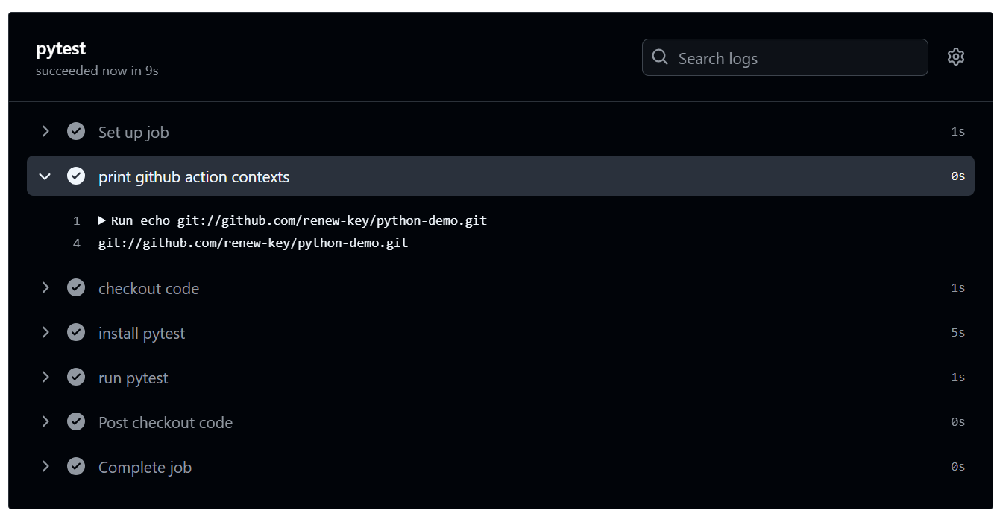
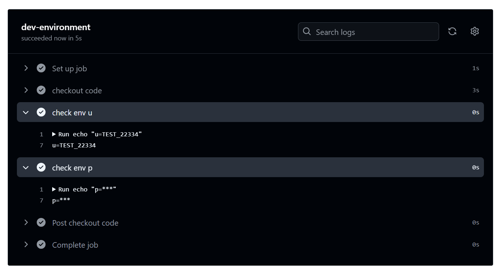

# 目錄

- [Github Action 簡介](#Github-Action-簡介)
  - [Github Action 是什麼?](#Github-Action-是什麼)
  - [The components of GitHub Action](#The-components-of-GitHub-Action)
  - [創建第一個 github workflow](#創建第一個-github-workflow)
  - [GitHub hosted runners](#GitHub-hosted-runner)
  - [Jobs-的串行和並行](#Jobs-的串行和並行)
  - [使用 Action](#使用-Action)
- [Workflow Events](#Workflow-Events)
  - [多個 Events Trigger](#多個-Events-Trigger)
  - [Event Activity Types and Filters](#Event-Activity-Types-and-Filters)
  - [pull request event](#pull-request-event)
  - [Schedule Events](#Schedule-Events)
  - [Cancel and skip workflows](#Cancel-and-skip-workflows)
  - [upload job artifacts](#upload-job-artifacts)
  - [download job artifacts](download-job-artifacts)
- [Environment Variables and Secrets](#Environment-Variables-and-Secrets)
  - [GitHub Action Default Environment Variables](#GitHub-Action-Default-Environment-Variables)
  - [Using contexts to access environment variable values](#Using-contexts-to-access-environment-variable-values)
  - [Repository Secrets](#Repository-Secrets)
  - [Repository Variables](#Repository-Variables)
  - [What is Environment?](#What-is-Environment)

# Github Action 簡介

## Github Action 是什麼?

- GitHub Actions is a continuous integration and continuous delivery (CI/CD) platform that allows you to automate your `build`,`test`,and `deployment` pipeline. You can create workflows that build and test every pull request to your repository, or deploy merged pull requests to production.

- GitHub Actions 可以自動幫我們執行 CI/CD 的平台

- What is CI/CD?

  - Continuous Intergation: Developers push code changes every day, multiple times a day. For every push to the repository, you can create a set of scripts to `build` and `test` your application automatically. These scripts help decrease the chances that you introduce errors in your application.
  - Continuous Deliverly(Deployment): is a step beyond Continuous Integration. Not only is your application built and tested each time a code change is pushed to the codebase, the application is also `deployed` continuously.

- 什麼是 CI/CD？

  - 持續整合 (Continuous Integration)：開發人員每天多次推送程式碼變更。對於每次推送到儲存庫的程式碼，可以建立一組腳本來建置 (build) 和 測試 (test) 應用程式，這些腳本有助於降低應用程式出錯的機率。
  - 持續交付/部署 (Continuous Delivery/Deployment)：這是在持續整合的基礎上更進一步。不僅每次推送程式碼時應用程式會自動建置和測試，還會持續部署 (deploy) 應用程式，使變更更快速地上線。


## The components of GitHub Action

- You can configure a GitHub Actions `workflow` to be triggered when an `event` occurs in your repository, such as a pull request being opened or an issue being created. Your workflow cintains one or more `jobs` which can run in sequential order or in parallel. Each job will run inside its own virtual machine `runner`, or inside a container, and has one or more `steps` that either run a script that you define or run an `action`, which is a reusable extension that can simplify your workflow.

- [官方網址](https://docs.github.com/en/actions/learn-github-actions/understanding-github-actions#the-components-of-github-actions)

- 有什麼事件可以觸發 CI，CI 主要是做`build`和`test`?


## 創建第一個 github workflow

- 透過`yml文件`進行定義

`.github/workflows/demo.yml`

```yml
name: my first workflow

# Controls when the workflow will run
on: workflow_dispatch #Allows you to run this workflow manually from the Actions tab

# A workflow run is made up of one or more jobs that can run sequentially or in parallel
jobs:
  # This workflow contains a signle job called "build"
  build:
    # The type of runner that the job will run on
    run-on: ubuntu-latest

    #Steps represent a sequence of tasks that will be wxwcuted as part of the job
    steps:
      # Runs a set of commands using the runner shell
      - name: Run a multi-line script
        run: |
          echo "hello github actions"
          date
```

- `name: my first workflow`: 定義 github workflow 的名字
- `on`: github workflow 裡面的關鍵字，如何去觸發(trigger)事件

  - workflow_dispatch: 手動觸發事件

- `job`: 在 github workflow 裡面可以定義很多個 job

- `build`: 這個 job 的名字，代表這個 job 具體在做什麼事情，可以自行設定

- `runs-on`: 指定運行在什麼環境上

- `steps`:具體要執行哪些步驟

  - `name`: 每個 step 有自己的名字，代表具體要做的事情
  - `run`: 透過`run`這關鍵字，後面放入腳本(script)去執行
  - `|`: 代表 script 有多行命定不只一行的意思

- 創建 github-action

  - 步驟 1: 在 Github 裡面創建一個新的 repository
    - 建議勾選`Add a README file`，讓其初始化，沒有也可以自己下指令初始化
    - 
  - 步驟 2: 有兩個辦法可以新建 Github Action

    - 第一個辦法:在此 repository 裡面新建一個`.yml`的檔案，路徑為`.github/workflows/[fileName].yml`，把腳本複製貼上到下面
      - 
    - 第二個辦法: 點擊上面的`actions`

      - 

      - 點擊`configure`

        - 

      - 會直接幫我們創建腳本

        - 

      - 修改檔案名稱為`demo`，修改腳本成下面那樣，改完後就可以按 commit change

```yml
# This is a basic workflow to help you get started with Actions

name: CI

# Controls when the workflow will run
on: workflow_dispatch

# A workflow run is made up of one or more jobs that can run sequentially or in parallel
jobs:
  # This workflow contains a single job called "build"
  build:
    # The type of runner that the job will run on
    runs-on: ubuntu-latest

    # Steps represent a sequence of tasks that will be executed as part of the job
    steps:
      # Runs a single command using the runners shell
      - name: Run a one-line script
        run: echo Hello, world!

      # Runs a set of commands using the runners shell
      - name: Run a multi-line script
        run: |
          echo Add other actions to build,
          echo test, and deploy your project.
```


- 點擊 Actions 後點擊`CI`，會看到只有 0 次的執行
  
  

- 點擊 Run workflow，並且選擇分支，選擇完後就可以按 Run workflow
  

- 等待執行完畢後點開 CI

  

- 點開 Build，可以看到執行的 step
  

- github workflow 會自行幫我們加上額外兩個 stpes，一個是`set up job`，另一個是`Complete job`
  [create github-workflow](../img/github/14.png)

## [GitHub hosted runners](https://docs.github.com/en/actions/using-github-hosted-runners/using-github-hosted-runners/about-github-hosted-runners)

- Runners are the machines that execute jobs in a GitHub Actions workflow

```shell
name: CI

# Controls when the workflow will run
on: workflow_dispatch

# A workflow run is made up of one or more jobs that can run sequentially or in parallel
jobs:
  # This workflow contains a job called "build_on_linux"
  build_on_linux:
    # The type of runner that the job will run on
    runs-on: ubuntu-latest

    # Steps represent a sequence of tasks that will be executed as part of the job
    steps:
      # Runs a single command using the runners shell
      - name: Run a one-line script
        run: echo Hello, world!

      # Runs a set of commands using the runners shell
      - name: Run a multi-line script
        run: |
          echo Add other actions to build,
          echo test, and deploy your project.

  # This workflow contains a job called "build_on_windows"
  build_on_windows:
    # The type of runner that the job will run on
    runs-on: windows-latest

    steps:
      - name: Run a multi-line script on Windows
        run: |
          echo "Hello, GitHub Actions"
          powershell -Command "Get-Date"

```


## Jobs-的串行和並行

- 默認行況下 Jobs 是並行的狀態，各自之間並沒有關係，之所以有時間差是因為會放在柱列裡面等待後執行


- 並行，會有關連，例如前面失敗後面就執行不了


## 使用 Action

[github marketplace](https://github.com/marketplace?type=actions)


### checkout

```yml
name: pytest
on: workflow_dispatch

jobs:
  pytest:
    runs-on: ubuntu-latest
    steps:
      - name: clone repository
        run: |
          git clone https://github.com/renew-key/python-demo
          cd python-demo
      - name: install pytest
        run: pip install pytest
      - name: run pytest
        run: pytest
```


> 使用 github action 後，改成

```yml
name: pytest
on: workflow_dispatch

jobs:
  pytest:
    runs-on: ubuntu-latest
    steps:
      - name: checkout code
        uses: actions/checkout@v4
      - name: install pytest
        run: pip install pytest
      - name: run pytest
        run: pytest
```


> 若不加`ref`這個參數的話，默認為 default 分支

> 在 checkout 執行前後，查看當前文件目錄

```yml
name: pytest
on: workflow_dispatch

jobs:
  pytest:
    runs-on: ubuntu-latest
    steps:
      - name: pre - checkout
        run: |
          pwd
          ls -lh
      - name: checkout code
        uses: actions/checkout@v4
      - name: after - checkout
        run: |
          pwd
          ls -lh
      - name: install pytest
        run: pip install pytest
      - name: run pytest
        run: pytest
```


### Contexts

> 執行過程中可能會預先使用到的配置(環境)

[官網](https://docs.github.com/en/actions/writing-workflows/choosing-what-your-workflow-does/accessing-contextual-information-about-workflow-runs)

- 可以用 `${{contexts}}` 去執行

例如:

```yml
name: pytest
on: workflow_dispatch

jobs:
  pytest:
    runs-on: ubuntu-latest
    steps:
      - name: print github action contexts
        run: echo ${{ github.repositoryUrl }}
      - name: checkout code
        uses: actions/checkout@v4
      - name: install pytest
        run: pip install pytest
      - name: run pytest
        run: pytest
```



# Workflow Events

- Available Events

  - [官網](https://docs.github.com/en/actions/using-workflows/events-that-trigger-workflows)

  - Repository related
    - push
    - pull_request
  - Others
    - workflow_dispatch: 手動觸發
    - schedule: 預約時間觸發

## 多個 Events Trigger

`用[]包裹Trigger的方法，以及用逗號隔開即可`

```yml
name: pytest
on: [push, workflow_dispatch]

jobs:
  pytest:
    runs-on: ubuntu-latest
    steps:
      - name: print github action contexts
        run: echo ${{ github.repositoryUrl }}
      - name: checkout code
        uses: actions/checkout@v4
      - name: install pytest
        run: pip install pytest
      - name: run pytest
        run: pytest
```


**只要有新的 commit，這 push 就會被觸發，不管是在哪個分支上**

## Event Activity Types and Filters

- activity Types

```yml
on:
  pull_request:
    types: [opened, reopened]
```

- Filters

```yml
on:
  pull_request:
    types:
      - opened
    branches:
      - `releases/**`
```

> 要指定 branch

```yml
name: pytest
on:
  push:
    branches:
      - main
  workflow_dispatch:

jobs:
  pytest:
    runs-on: ubuntu-latest
    steps:
      - name: print github action contexts
        run: echo ${{ github.repositoryUrl }}
      - name: checkout code
        uses: actions/checkout@v4
      - name: install pytest
        run: pip install pytest
      - name: run pytest
        run: pytest
```

## pull request event

```yml
name: pytest
on:
  push:
    branches:
      - main
  workflow_dispatch:
  pull_request:
    types: [opened]

jobs:
  pytest:
    runs-on: ubuntu-latest
    steps:
      - name: print github action contexts
        run: echo ${{ github.repositoryUrl }}
      - name: checkout code
        uses: actions/checkout@v4
      - name: install pytest
        run: pip install pytest
      - name: run pytest
        run: pytest
```

> 如果有人 open 一個 pull request 那麼 workflow 就會被觸發


> 作為初次用戶第一次去 pull request 需要同意(approval and run)才能運行 github workflow

> 避免同一人創建很多 github 帳號去做攻擊，浪費資源


> 當 pull request 的使用者變成貢獻者(contributor)後，再去做 pull request 就不需要再(approval and run)，workflow 會自動觸發

## Schedule Events

```yml
on:
  schedule:
    - cron: "15 4,5 * * *" # <=== Change this value
```

[crontab](https://crontab.guru/)


> 第一個數字是分鐘、第二個是小時、第三個是天、第四個是月、最後一個是星期


```yml
name: pytest
on:
  push:
    branches:
      - main
  workflow_dispatch:
  pull_request:
    types: [opened]
  schedule:
    - cron: "*/5 * * * *"

jobs:
  pytest:
    runs-on: ubuntu-latest
    steps:
      - name: print github action contexts
        run: echo ${{ github.repositoryUrl }}
      - name: checkout code
        uses: actions/checkout@v4
      - name: install pytest
        run: pip install pytest
      - name: run pytest
        run: pytest
```

> 可以一次性設定不同時間

[參考文檔](https://docs.github.com/en/actions/writing-workflows/choosing-when-your-workflow-runs/events-that-trigger-workflows#schedule)

## Cancel and skip workflows

- Cancel


- skip

  - [官方文件](https://docs.github.com/en/actions/managing-workflow-runs-and-deployments/managing-workflow-runs/skipping-workflow-runs)

- 在 commit message 後面加上[skip ci]


這樣 workflow 就不會在 push 的時候被觸發

## [upload job artifacts](https://github.com/marketplace/actions/upload-a-build-artifact)

- 若我們在 workflow 產生.exe 文件時，當 workflow 結束後就會把這文件銷毀調，於是我們必須先把這.exe 文件上傳到一個地方，這樣就可以下載，這時就須用到 `job artifacts`

```yml
uses: actions/upload-artifact@v4
  with:
    # Name of the artifact to upload.
    # Optional. Default is 'artifact'
    name:

    # A file, directory or wildcard pattern that describes what to upload
    # Required.
    path:

    # The desired behavior if no files are found using the provided path.
    # Available Options:
    #   warn: Output a warning but do not fail the action
    #   error: Fail the action with an error message
    #   ignore: Do not output any war
```

```yml
name: pytest
on:
  push:
    branches:
      - main
  workflow_dispatch:
  pull_request:
    types: [opened]

jobs:
  pysha256:
    runs-on: windows-latest
    steps:
      - name: checkout code
        uses: actions/checkout@v4
      - name: install pyinstaller
        run: pip install pyinstaller
      - name: build exe
        run: pyinstaller .\sha256.py -F
      - name: upload exe file
        uses: uses: actions/upload-artifact@v4
        with:
          name: sha256-windows-exe
          path: dist/sha256.exe
```


## [download job artifacts](https://github.com/marketplace/actions/download-a-build-artifact)

```yml
uses: actions/download-artifact@v4
  with:
    # Name of the artifact to download.
    # If unspecified, all artifacts for the run are downloaded.
    # Optional.
    name:

    # Destination path. Supports basic tilde expansion.
    # Optional. Default is $GITHUB_WORKSPACE
    path:

    # A glob pattern to the artifacts that should be downloaded.
    # Ignored if name is specified.
    # Optional.
```

```yml
name: job-artifact
on:
  push:
    branches:
      - main
  workflow_dispatch:
  pull_request:
    types: [opened]

jobs:
  build-on-windows:
    runs-on: windows-latest
    steps:
      - name: Checkout Code
        uses: actions/checkout@v4

      - name: Install PyInstaller
        run: pip install pyinstaller

      - name: Build EXE
        run: pyinstaller sha256.py -F

      - name: Upload EXE File
        uses: actions/upload-artifact@v4
        with:
          name: sha256-windows
          path: dist/sha256.exe

  build-on-linux:
    runs-on: ubuntu-latest
    steps:
      - name: Checkout Code
        uses: actions/checkout@v4

      - name: Install PyInstaller
        run: pip install pyinstaller

      - name: Build Executable
        run: pyinstaller sha256.py -F

      - name: Upload Executable File
        uses: actions/upload-artifact@v4
        with:
          name: sha256-linux
          path: dist/sha256

  build-on-mac:
    runs-on: macos-latest
    steps:
      - name: Checkout Code
        uses: actions/checkout@v4

      - name: Install PyInstaller
        run: pip install pyinstaller

      - name: Build Executable
        run: pyinstaller sha256.py -F

      - name: Upload Executable File
        uses: actions/upload-artifact@v4
        with:
          name: sha256-mac
          path: dist/sha256

  test-build-windows:
    runs-on: windows-latest
    needs: build-on-windows
    steps:
      - name: Download Executable File
        uses: actions/download-artifact@v4
        with:
          name: sha256-windows

      - name: Test Executable File
        run: |
          ls
          .\sha256.exe .\sha256.exe
```


```yml
name: job-artifact
on:
  push:
    branches:
      - main
  workflow_dispatch:
  pull_request:
    types: [opened]

jobs:
  build-on-windows:
    runs-on: windows-latest
    steps:
      - name: Checkout Code
        uses: actions/checkout@v4

      - name: Install PyInstaller
        run: pip install pyinstaller

      - name: Build EXE
        run: pyinstaller sha256.py -F

      - name: Upload EXE File
        uses: actions/upload-artifact@v4
        with:
          name: sha256-windows
          path: dist/sha256.exe

  build-on-linux:
    runs-on: ubuntu-latest
    steps:
      - name: Checkout Code
        uses: actions/checkout@v4

      - name: Install PyInstaller
        run: pip install pyinstaller

      - name: Build Executable
        run: pyinstaller sha256.py -F

      - name: Upload Executable File
        uses: actions/upload-artifact@v4
        with:
          name: sha256-linux
          path: dist/sha256

  build-on-mac:
    runs-on: macos-latest
    steps:
      - name: Checkout Code
        uses: actions/checkout@v4

      - name: Install PyInstaller
        run: pip install pyinstaller

      - name: Build Executable
        run: pyinstaller sha256.py -F

      - name: Upload Executable File
        uses: actions/upload-artifact@v4
        with:
          name: sha256-mac
          path: dist/sha256

  test-build-windows:
    runs-on: windows-latest
    needs: build-on-windows
    steps:
      - name: Download Executable File
        uses: actions/download-artifact@v4
        with:
          name: sha256-windows

      - name: Test Executable File
        run: |
          ls
          .\sha256.exe .\sha256.exe

  test-build-linux:
    runs-on: ubuntu-latest
    needs: build-on-linux
    steps:
      - name: Download Executable File
        uses: actions/download-artifact@v4
        with:
          name: sha256-linux

      - name: Test Executable File
        run: |
          ls
          chmod +x sha256
          ./sha256 sha256

  test-build-mac:
    runs-on: macos-latest
    needs: build-on-mac
    steps:
      - name: Download Executable File
        uses: actions/download-artifact@v4
        with:
          name: sha256-mac

      - name: Test Executable File
        run: |
          ls
          chmod +x sha256
          ./sha256 sha256
```


# Environment-Variables-and-Secrets

## GitHub Action Default Environment Variables

[官網資料](https://docs.github.com/en/actions/writing-workflows/choosing-what-your-workflow-does/store-information-in-variables#default-environment-variables)

1. 如何在 GitHub workflow 去設置環境變數，和私密文件?
2. 設置的環境變數如何讀取?

- 查看預設的環境變數

```yml
name: workflow_env
on:
  workflow_dispatch:

jobs:
  build-in-env:
    runs-on: ubuntu-latest
    steps:
      - name: checkout code
        uses: actions/checkout@v4
      - name: check default env
        run: env
```

- 打印出預設的環境變數

```yml
name: workflow_env
on:
  workflow_dispatch:

jobs:
  build-in-env:
    runs-on: ubuntu-latest
    steps:
      - name: checkout code
        uses: actions/checkout@v4
      - name: check default env
        run: env
      - name: print env
        run: echo $GITHUB_REPOSITORY
```


- 引用`env.py`

```python
import os

repo = os.environ.get("GITHUB_REPOSITORY")
print(f"repository = {repo}")
```

```yml
name: workflow_env
on:
  workflow_dispatch:

jobs:
  build-in-env:
    runs-on: ubuntu-latest
    steps:
      - name: checkout code
        uses: actions/checkout@v4
      - name: check default env
        run: env
      - name: print env
        run: echo $GITHUB_REPOSITORY
      - name: test with python
        run: python env.py
```


## Using contexts to access environment variable values

> 自己創建環境變數去使用
> 環境變數會有 scoped 的限制，例如在其中一個 step 設置環境變數，那此環境變數就只能在當前的 step 去使用，反之若在 workflow 設置環境變數，那整個 workflow 都可以使用

[官網](https://docs.github.com/en/actions/writing-workflows/choosing-what-your-workflow-does/store-information-in-variables#using-contexts-to-access-variable-values)

```yml
name: workflow_env
on: workflow_dispatch

env:
  DAY_OF_WEEK: Monday

jobs:
  test-scope-env:
    runs-on: ubuntu-latest
    steps:
      - name: print env
        run: echo "$Greeting $First_Name. Today is $DAY_OF_WEEK!"

  greeting-job:
    runs-on: ubuntu-latest
    env:
      Greeting: Hello
    steps:
      - name: "Say Hello Mona it's Monday"
        run: echo "$Greeting $First_Name. Today is $DAY_OF_WEEK!"
        env:
          First_Name: Mona
```


## Repository Secrets

> 如果有些環境變數涉及需要保密的部分，可以創建 Secrets and variable

> Setting > Setting and variable > Action


> 點擊 New repository secret


> 輸入之後就無法查看，但可以修改

- 如何在 github workflow 裡面使用呢?

```yml
name: workflow_secrets
on:
  workflow_dispatch:

env:
  DB_U: test
  DB_P: ${{ secrets.DB_PASSWORD }}

jobs:
  test-secrets:
    runs-on: ubuntu-latest
    steps:
      - name: checkout code
        uses: actions/checkout@v4
      - name: check env u
        run: echo "u=${{ env.DB_U }}"
      - name: check env p
        run: echo "p=${{ env.DB_P }}"
```


- 測試是否能通過外不去擷取到 secret 資訊

```python
import os
password = os.environ.get("DB_P")
print(f"password = {password}")
```

```yml
name: workflow_secrets
on:
  workflow_dispatch:

env:
  DB_U: test
  DB_P: ${{ secrets.DB_PASSWORD }}

jobs:
  test-secrets:
    runs-on: ubuntu-latest
    steps:
      - name: checkout code
        uses: actions/checkout@v4
      - name: check env u
        run: echo "u=${{ env.DB_U }}"
      - name: check env p
        run: echo "p=${{ env.DB_P }}"
      - name: test with python
        run: python secret.py
```


## Repository Variables

> 上次的 secrets 為啥不直接在 steps 裡面使用 `${{ secrets.DB_PASSWORD }}` 呢? 反而要先設置環境變數，把他賦值給`DB_P`再使用?

> 因為若把它命名為環境變數的話，其他檔案也可以讀取

> 密碼設置一定要夠複雜，因為 github 會把跟密碼相關的字一併隱藏，若不複雜可能會被猜出來

> 也可以在 GITHUB 上面設置環境變數


```python
import os
password = os.environ.get("DB_P")
print(f"password = {password}")
username = os.environ.get("DB_U")
print(f"repository = {username}")
```

```yml
name: workflow_secrets
on:
  workflow_dispatch:

env:
  DB_U: ${{ vars.DB_USERNAME }}
  DB_P: ${{ secrets.DB_PASSWORD }}

jobs:
  test-secrets:
    runs-on: ubuntu-latest
    steps:
      - name: checkout code
        uses: actions/checkout@v4
      - name: check env u
        run: echo "u=${{ env.DB_U }}"
      - name: check env p
        run: echo "p=${{ env.DB_P }}"
      - name: test with python
        run: python secret.py
```


## What is Environment?

> 若想要在不同的 job 和 workflows 想使用不同的變數和 secrets 該如何做?

1. 在獨有的 job 和 workflows 宣告 env，這樣環境變數就會有 scoped 的限制

2. 使用 Github 上的 Environment

- Environment: 代表的是代碼的執行環境，例如:測試環境、正式環境...等


```yml
name: workflow_secrets
on:
  workflow_dispatch:

jobs:
  dev-environment:
    environment: dev
    env:
      DB_U: ${{ vars.DB_USERNAME }}
      DB_P: ${{ secrets.DB_PASSWORD }}
    runs-on: ubuntu-latest
    steps:
      - name: checkout code
        uses: actions/checkout@v4
      - name: check env u
        run: echo "u=${{ env.DB_U }}"
      - name: check env p
        run: echo "p=${{ env.DB_P }}"
  prod-environment:
    environment: prod
    env:
      DB_U: ${{ vars.DB_USERNAME }}
      DB_P: ${{ secrets.DB_PASSWORD }}
    runs-on: ubuntu-latest
    steps:
      - name: checkout code
        uses: actions/checkout@v4
      - name: check env u
        run: echo "u=${{ env.DB_U }}"
      - name: check env p
        run: echo "p=${{ env.DB_P }}"
```





> 可以選擇有哪些分支可以使用此環境


