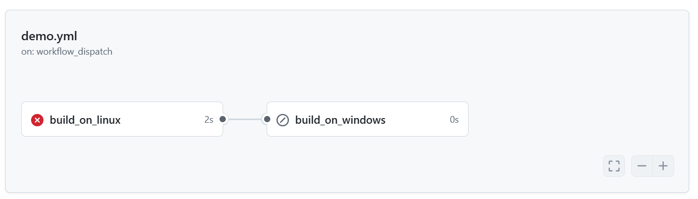

# 目錄

- [Github Action 簡介](#Github-Action-簡介)
  - [Github Action 是什麼?](#Github-Action-是什麼)
  - [The components of GitHub Action](#The-components-of-GitHub-Action)
  - [創建第一個 github workflow](#創建第一個-github-workflow)
  - [GitHub hosted runners](#GitHub-hosted-runner)
  - [Jobs-的串行和並行](#Jobs-的串行和並行)
  - [使用 Action](#使用-Action)

# Github Action 簡介

## Github Action 是什麼?

- GitHub Actions is a continuous integration and continuous delivery (CI/CD) platform that allows you to automate your `build`,`test`,and `deployment` pipeline. You can create workflows that build and test every pull request to your repository, or deploy merged pull requests to production.

- GitHub Actions 可以自動幫我們執行 CI/CD 的平台

- What is CI/CD?

  - Continuous Intergation: Developers push code changes every day, multiple times a day. For every push to the repository, you can create a set of scripts to `build` and `test` your application automatically. These scripts help decrease the chances that you introduce errors in your application.
  - Continuous Deliverly(Deployment): is a step beyond Continuous Integration. Not only is your application built and tested each time a code change is pushed to the codebase, the application is also `deployed` continuously.

- 什麼是 CI/CD？

  - 持續整合 (Continuous Integration)：開發人員每天多次推送程式碼變更。對於每次推送到儲存庫的程式碼，可以建立一組腳本來建置 (build) 和 測試 (test) 應用程式，這些腳本有助於降低應用程式出錯的機率。
  - 持續交付/部署 (Continuous Delivery/Deployment)：這是在持續整合的基礎上更進一步。不僅每次推送程式碼時應用程式會自動建置和測試，還會持續部署 (deploy) 應用程式，使變更更快速地上線。


## The components of GitHub Action

- You can configure a GitHub Actions `workflow` to be triggered when an `event` occurs in your repository, such as a pull request being opened or an issue being created. Your workflow cintains one or more `jobs` which can run in sequential order or in parallel. Each job will run inside its own virtual machine `runner`, or inside a container, and has one or more `steps` that either run a script that you define or run an `action`, which is a reusable extension that can simplify your workflow.

- [官方網址](https://docs.github.com/en/actions/learn-github-actions/understanding-github-actions#the-components-of-github-actions)

- 有什麼事件可以觸發 CI，CI 主要是做`build`和`test`?


## 創建第一個 github workflow

- 透過`yml文件`進行定義

`.github/workflows/demo.yml`

```yml
name: my first workflow

# Controls when the workflow will run
on: workflow_dispatch #Allows you to run this workflow manually from the Actions tab

# A workflow run is made up of one or more jobs that can run sequentially or in parallel
jobs:
  # This workflow contains a signle job called "build"
  build:
    # The type of runner that the job will run on
    run-on: ubuntu-latest

    #Steps represent a sequence of tasks that will be wxwcuted as part of the job
    steps:
      # Runs a set of commands using the runner shell
      - name: Run a multi-line script
        run: |
          echo "hello github actions"
          date
```

- `name: my first workflow`: 定義 github workflow 的名字
- `on`: github workflow 裡面的關鍵字，如何去觸發(trigger)事件

  - workflow_dispatch: 手動觸發事件

- `job`: 在 github workflow 裡面可以定義很多個 job

- `build`: 這個 job 的名字，代表這個 job 具體在做什麼事情，可以自行設定

- `runs-on`: 指定運行在什麼環境上

- `steps`:具體要執行哪些步驟

  - `name`: 每個 step 有自己的名字，代表具體要做的事情
  - `run`: 透過`run`這關鍵字，後面放入腳本(script)去執行
  - `|`: 代表 script 有多行命定不只一行的意思

- 創建 github-action

  - 步驟 1: 在 Github 裡面創建一個新的 repository
    - 建議勾選`Add a README file`，讓其初始化，沒有也可以自己下指令初始化
    - 
  - 步驟 2: 有兩個辦法可以新建 Github Action

    - 第一個辦法:在此 repository 裡面新建一個`.yml`的檔案，路徑為`.github/workflows/[fileName].yml`，把腳本複製貼上到下面
      - 
    - 第二個辦法: 點擊上面的`actions`

      - 

      - 點擊`configure`

        - 

      - 會直接幫我們創建腳本

        - 

      - 修改檔案名稱為`demo`，修改腳本成下面那樣，改完後就可以按 commit change

```yml
# This is a basic workflow to help you get started with Actions

name: CI

# Controls when the workflow will run
on: workflow_dispatch

# A workflow run is made up of one or more jobs that can run sequentially or in parallel
jobs:
  # This workflow contains a single job called "build"
  build:
    # The type of runner that the job will run on
    runs-on: ubuntu-latest

    # Steps represent a sequence of tasks that will be executed as part of the job
    steps:
      # Runs a single command using the runners shell
      - name: Run a one-line script
        run: echo Hello, world!

      # Runs a set of commands using the runners shell
      - name: Run a multi-line script
        run: |
          echo Add other actions to build,
          echo test, and deploy your project.
```


- 點擊 Actions 後點擊`CI`，會看到只有 0 次的執行
  
  

- 點擊 Run workflow，並且選擇分支，選擇完後就可以按 Run workflow
  

- 等待執行完畢後點開 CI

  

- 點開 Build，可以看到執行的 step
  

- github workflow 會自行幫我們加上額外兩個 stpes，一個是`set up job`，另一個是`Complete job`
  [create github-workflow](../img/github/14.png)

## [GitHub hosted runners](https://docs.github.com/en/actions/using-github-hosted-runners/about-github-hosted-runners)

- Runners are the machines that execute jobs in a GitHub Actions workflow

```shell
name: CI

# Controls when the workflow will run
on: workflow_dispatch

# A workflow run is made up of one or more jobs that can run sequentially or in parallel
jobs:
  # This workflow contains a job called "build_on_linux"
  build_on_linux:
    # The type of runner that the job will run on
    runs-on: ubuntu-latest

    # Steps represent a sequence of tasks that will be executed as part of the job
    steps:
      # Runs a single command using the runners shell
      - name: Run a one-line script
        run: echo Hello, world!

      # Runs a set of commands using the runners shell
      - name: Run a multi-line script
        run: |
          echo Add other actions to build,
          echo test, and deploy your project.

  # This workflow contains a job called "build_on_windows"
  build_on_windows:
    # The type of runner that the job will run on
    runs-on: windows-latest

    steps:
      - name: Run a multi-line script on Windows
        run: |
          echo "Hello, GitHub Actions"
          powershell -Command "Get-Date"

```


## Jobs-的串行和並行

- 默認行況下 Jobs 是並行的狀態，各自之間並沒有關係，之所以有時間差是因為會放在柱列裡面等待後執行


- 並行，會有關連，例如前面失敗後面就執行不了




## 使用 Action

[github marketplace](https://github.com/marketplace?type=actions)


```yml
name: pytest
on: workflow_dispatch

jobs:
  pytest:
    runs-on: ubuntu-latest
    steps:
      - name: clone repository
        run: |
          git clone https://github.com/renew-key/python-demo
          cd python-demo
      - name: install pytest
        run: pip install pytest
      - name: run pytest
        run: pytest
```

> 使用 github action 後，改成

```yml
name: pytest
on: workflow_dispatch

jobs:
  pytest:
    runs-on: ubuntu-latest
    steps:
      - name: checkout code
        uses: actions/checkout@v4
      - name: install pytest
        run: pip install pytest
      - name: run pytest
        run: pytest
```
