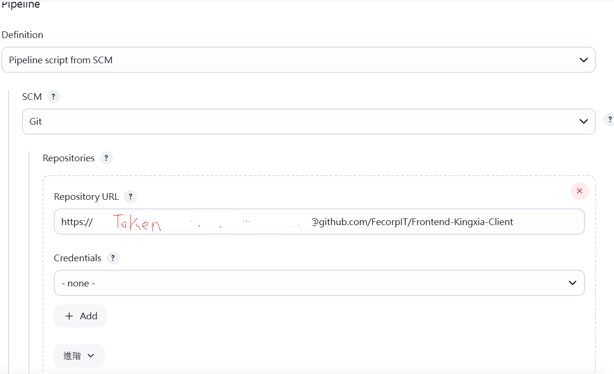

# 設置機密文件與組態設定指南

## 目錄

- [設置機密文件](#設置機密文件)
  - [新增機密文件](#新增機密文件)
    - [SSH 的金鑰](#ssh-的金鑰)
    - [SSL 的金鑰](#ssl-的金鑰)
    - [ENV 的檔案](#env-的檔案)
  - [修改機密文件](#修改機密文件)
  - [機密文件分組設定](#機密文件分組設定)
- [專案分類設置](#專案分類設置)
- [組態設定](#組態設定)
- [建置專案](#建置專案)

---

# 設置機密文件

## 新增機密文件

**步驟:**

1. 登入 Jenkins。
2. 點擊左上角資訊主頁。
3. 前往 **管理 Jenkins**。
4. 進入 **Security -> Credentials**。
5. 點擊目標資料夾的 Domain。
6. 點擊右上角 **Add Credentials**。

### SSH 的金鑰

- **Kind:** SSH Username with private key
- **Scope:** Global
- **ID:** 設置唯一名稱，便於後續使用。
- **Description:** 描述此金鑰用途，例如「用於專案 A 部署」。
- **Username:** 金鑰的使用者名稱。
- **Private Key:**
  - 勾選 **Enter directly**，直接輸入私鑰內容。
  - 如需密碼保護，輸入 **Passphrase**。

### SSL 的金鑰

- **Kind:** Secret file
- **Scope:** Global
- **File:** 上傳 `.key` 或 `.pem` 格式的 SSL 憑證檔案。
- **ID:** 設置唯一名稱，例如「專案 B 的 SSL」。
- **Description:** 說明檔案用途，例如「用於 HTTPS 通信的憑證」。
- 按下 **Create** 建立完成。

### ENV 的檔案

- **Kind:** Secret file
- **Scope:** Global
- **File:** 上傳 `.env` 格式的檔案，內含環境變數設定。
- **ID:** 設置唯一名稱，例如「專案 C 的環境設定」。
- **Description:** 說明檔案用途，例如「此檔案包含資料庫連線資訊」。
- 按下 **Create** 建立完成。

---

## 修改機密文件

1. 進入 Jenkins 的 **Credentials** 頁面。
2. 選擇目標 Domain。
3. 找到需要修改的機密文件，點擊右側的 **Edit**。
4. 更新內容後，按 **Save** 保存變更。

---

## 機密文件分組設定

- **用途:** 將相關的機密文件分組管理，便於大型專案的組態管理。
- **操作:**
  1. 在 **Credentials** 頁面建立新的 Domain。
  2. 為每個專案或用途設定專屬 Domain。
  3. 新增或移動機密文件到指定 Domain。

---

# 專案分類設置

## 資料夾

1. 安裝 Folders 插件 (若尚未安裝)

- 進入 Jenkins 的主頁，點擊左側的 Manage Jenkins（管理 Jenkins）。
- 選擇 Manage Plugins（管理插件）。
- 在 Available（可用）選項卡中搜尋 "Folders" 插件。
- 如果未安裝，勾選並點擊 Install without restart（安裝並立即使用）。

2. 新增資料夾 (Folder)

- 回到 Jenkins 主頁，點擊左上角的 New Item（新增作業）。
- 在名稱欄位中輸入資料夾名稱（例如 MyProjects）。
- 選擇 Folder 作為專案類型，然後點擊 OK。

3. 設置資料夾屬性

- 資料夾創建後，您可以為資料夾添加描述，以說明資料夾的用途。
- 如果需要，您還可以設定資料夾層級的權限管理（例如僅允許特定用戶訪問）。

4. 將專案移動到資料夾

- 開啟資料夾，點擊右側的 New Item 來創建新專案，或選擇 Move 將現有專案移動到此資料夾中。

- 移動專案：

  - 點擊要移動的專案右邊的箭頭，選擇 Move。
  - 選擇目標資料夾，然後確認移動。

  

5. 使用多層資料夾進行進一步分類 (可選)

- 如果需要進一步分類，您可以在資料夾內部再次創建資料夾。例如：

  - Frontend 資料夾：存放前端相關專案。
  - Backend 資料夾：存放後端相關專案。

  
  

6. 快速檢視資料夾內專案

- 在主頁上，點擊資料夾名稱即可進入資料夾查看所有包含的專案。
- 資料夾中的專案可以與其他專案一樣正常配置與執行。

## 視景

1. 進入 Jenkins 主頁：

- 點擊 Jenkins 的資訊主頁（左上角的主頁）。

2. 點擊新增視景 (New View)：

- 在右上角，找到 + 或 New View 按鈕，點擊進入。

3. 設置視景類型：

- 在彈出的對話框中：
  - 輸入視景名稱：如 Frontend Projects。
    - 選擇視景類型：
      - List View（列表視圖）：以列表方式顯示專案。
      - My View（我的視圖）：個人化的專案視圖。
      - Pipeline View（流水線視圖）：顯示 Jenkins Pipeline 的執行情況。
      - Other Plugins（其他視圖）：基於安裝的外掛提供的視圖類型。
    - 點擊 OK。

4. 配置視景內容：

- 在視景的設定頁面中：
  - 選擇要顯示的專案：通過勾選將特定專案添加到此視景。
  - 設定篩選條件：
    - 如篩選專案名稱包含 frontend 或 backend 的專案。
    - 僅顯示失敗、成功或特定狀態的專案。
  - 排序方式：根據專案名稱、最近執行時間等排序。

5. 保存視景：

- 配置完成後，點擊 Save，即可在主頁上看到新的視景。

6. 視景的管理

- 編輯視景：點擊視景的名稱後，選擇 Edit View（編輯視圖）進行修改。
- 刪除視景：進入視景後，點擊右上角的 Delete View 刪除視景（注意，刪除視景不會刪除專案）。
- 默認視景：可以將某個視景設置為默認，這樣每次進入 Jenkins 時會自動顯示該視景。

# Jenkins 專案分類方式比較表

| **分類方式**   | **功能描述**                                                                         | **適用場景**                                                                                                         | **操作步驟**                                                                                                                                                           |
| -------------- | ------------------------------------------------------------------------------------ | -------------------------------------------------------------------------------------------------------------------- | ---------------------------------------------------------------------------------------------------------------------------------------------------------------------- |
| **分類視景**   | 在主頁新增自訂視景，依條件篩選顯示特定專案，並支援多種視覺化方式（如列表、流水線）。 | - 想快速查看特定類型的專案，例如僅顯示開發中的專案。 - 將狀態、名稱、標籤相近的專案分組展示。                     | 1. 進入主頁，點擊 `+` 或 `New View`。 2. 設定視景名稱並選擇視景類型（如 List View 或 Pipeline View）。 3. 選擇專案篩選條件（如名稱、狀態）。 4. 點擊 `Save`。 |
| **資料夾分類** | 建立資料夾，將相關專案直接放入同一資料夾中，提供實體層級的專案組織方式。             | - 想根據專案類型（如前端/後端）、客戶或環境（如測試/生產）進行專案歸類管理。 - 專案數量多，需要更直觀的組織結構。 | 1. 進入主頁，點擊左側 `New Item`。 2. 輸入資料夾名稱，選擇 `Folder` 類型，點擊 `OK`。 3. 進入資料夾後，點擊 `New Item` 新增或移入專案。                          |

## 使用建議

- **分類視景**：適合篩選條件多變的情況，可以根據當前需求快速顯示相關專案，且不影響實際的專案結構。
- **資料夾分類**：適合專案數量多且需要長期歸類管理的情況，提供更清晰的目錄結構，但需要移動專案進資料夾。

---

## 組態設定

1. 進入 Jenkins 主頁：

- 點擊 Jenkins 的資訊主頁（左上角的主頁）。

2. 滑鼠左鍵選擇建置專案的名稱

3. 點選左邊功能欄位"組態"

### General 設定

- **GitHub Project**

  - 勾選 `GitHub project`。
  - 在 URL 欄位輸入 GitHub 專案的網址，例如：`https://github.com/username/project-name`。

  

### Build Triggers 設定

- 選擇 `GitHub hook trigger for GITScm polling`。

### Pipeline 設定

- **Definition**
  - 選擇 `Pipeline script from SCM`。
- **SCM**

  - 選擇 `Git`。
  - **Repositories**
    - **Repository URL**: 輸入包含 token 的 GitHub repository URL，例如：`https://<token>@github.com/username/project-name.git`。
    - **Credential**: 選擇 `None` 或對應的憑證。
  - **Branches to build**
    - **Branch Specifier**: 指定需觸發的分支名稱，例如：`*/main` 或 `*/dev`。
  - **儲存庫瀏覽器**

    - 選擇 `GitHubWeb`。
    - **URL**: 輸入專案的 GitHub 頁面網址，例如：`https://github.com/username/project-name`。

    

    

### Script Path 設定

- 輸入專案內 `Jenkinsfile` 的路徑，例如：`Jenkinsfile` 或 `pipeline/Jenkinsfile`。

  

---

完成以上設定後，按下 **儲存** 按鈕，組態設定即完成。

### 取得 GitHub Token 的步驟

1. 登入 GitHub

進入 GitHub 網站 https://github.com 並登入您的帳戶。

2. 進入 Token 設置頁面

- 點擊右上角的個人頭像。
- 選擇 Settings（設定）。
- 在左側選單中，點擊 Developer settings。
- 選擇 Personal access tokens > Tokens (classic)。

3. 產生新 Token

- 點擊 Generate new token，然後選擇 Generate new token (classic)。

4. 設置 Token 的屬性

- Note: 填寫此 Token 的用途描述，例如 "Jenkins access token"。
- Expiration: 選擇 Token 的有效期限（例如 90 天或無期限）。
- Scopes: 勾選需要的權限，以下為常見的權限：
  - repo（讀取與寫入私有與公共儲存庫）
  - workflow（允許操作 GitHub Actions）
  - admin:repo_hook（管理 Webhook，若有需要時）
  - 根據需要選擇更多權限。

5. 生成 Token

- 點擊下方的 Generate token 按鈕。
- 注意: Token 生成後只會顯示一次，請務必複製並保存到安全的地方。

---

## 建置專案

1. 進入 Jenkins 主頁：

- 點擊 Jenkins 的資訊主頁（左上角的主頁）。

2. 滑鼠左鍵選擇建置專案的名稱

3. 點選左邊功能欄位"馬上建置"

4. 滑到下面的 builds， 點選正在跑的數字

5. 選擇左邊的"console Output" 查看是否有錯誤

